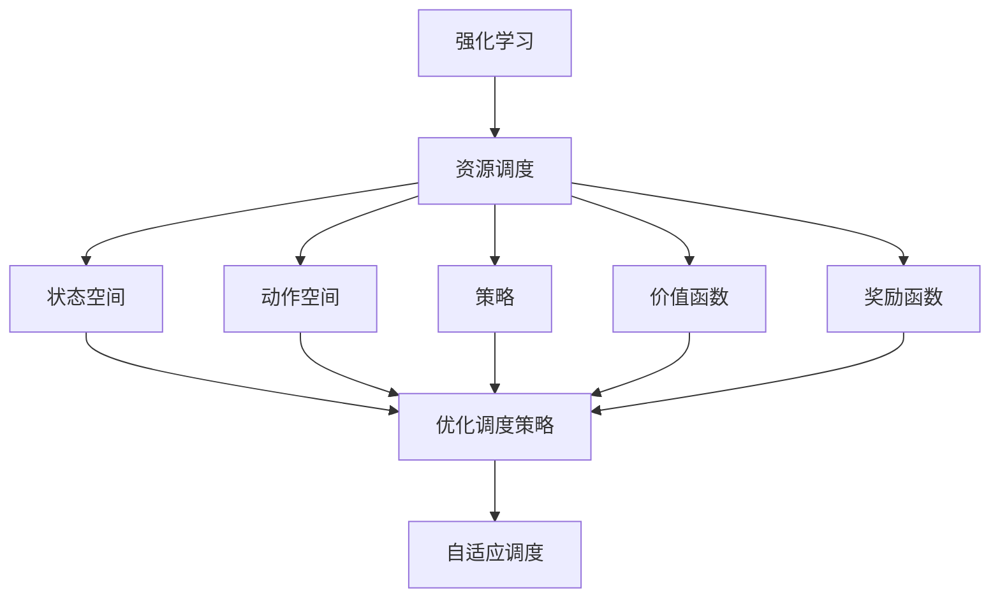

                 

# 强化学习在资源调度中的应用研究

> 关键词：强化学习；资源调度；算法原理；数学模型；实际应用

> 摘要：本文将探讨强化学习在资源调度领域的应用，深入分析其核心算法原理、数学模型及实际应用案例。通过阐述强化学习的基本概念和资源调度的相关背景，我们将逐步引导读者理解强化学习在资源调度中的重要作用，并详细介绍强化学习算法在不同场景下的实现方法和优化策略。本文旨在为研究人员和开发人员提供有价值的参考，助力他们在资源调度领域取得突破性进展。

## 1. 背景介绍

### 1.1 目的和范围

资源调度是计算机科学中一个古老而又充满挑战的问题。在当今大数据和云计算时代，资源调度的效率和准确性对系统的性能和用户体验有着至关重要的影响。强化学习（Reinforcement Learning，RL）作为一种人工智能领域的先进技术，已经在诸多领域展现了其强大的适应能力和优化效果。本文旨在探讨强化学习在资源调度中的应用，分析其在不同场景下的优势和局限性，为相关研究和实践提供指导。

本文主要涵盖以下内容：

1. **强化学习的基本概念和原理**：介绍强化学习的基础知识，包括奖励系统、状态空间、动作空间、策略等核心概念。
2. **资源调度的相关背景**：阐述资源调度的定义、目标和挑战，介绍现有资源调度算法及其优缺点。
3. **强化学习在资源调度中的应用**：分析强化学习在资源调度中的适用性，介绍常见的强化学习算法及其在资源调度中的应用案例。
4. **数学模型和公式**：详细讲解强化学习在资源调度中的数学模型，包括价值函数、策略迭代、策略评估等。
5. **项目实战**：通过具体实例展示强化学习算法在资源调度中的实现方法和步骤。
6. **实际应用场景**：讨论强化学习在资源调度中的实际应用场景，如云计算、物联网、自动驾驶等。
7. **工具和资源推荐**：推荐相关学习资源、开发工具和框架，帮助读者进一步了解和掌握强化学习在资源调度中的应用。

### 1.2 预期读者

本文适合以下读者群体：

1. **人工智能和机器学习研究人员**：对强化学习算法有初步了解，希望深入了解其在资源调度中的应用。
2. **计算机科学和软件工程从业者**：对资源调度问题感兴趣，希望通过学习强化学习提升系统性能和优化效果。
3. **研究生和博士生**：希望撰写相关论文或课题，需要深入了解强化学习在资源调度中的研究和应用。
4. **技术爱好者**：对人工智能和计算机科学领域充满好奇心，希望了解强化学习在实际问题中的应用。

### 1.3 文档结构概述

本文结构如下：

1. **第1章 背景介绍**：介绍本文的目的、范围、预期读者以及文档结构。
2. **第2章 核心概念与联系**：介绍强化学习和资源调度的基本概念，并给出相关流程图。
3. **第3章 核心算法原理 & 具体操作步骤**：讲解强化学习算法的基本原理和具体操作步骤。
4. **第4章 数学模型和公式 & 详细讲解 & 举例说明**：详细阐述强化学习在资源调度中的数学模型和公式。
5. **第5章 项目实战：代码实际案例和详细解释说明**：通过具体实例展示强化学习算法在资源调度中的实现。
6. **第6章 实际应用场景**：讨论强化学习在资源调度中的实际应用场景。
7. **第7章 工具和资源推荐**：推荐相关学习资源、开发工具和框架。
8. **第8章 总结：未来发展趋势与挑战**：总结本文的主要观点，展望未来发展趋势和挑战。
9. **第9章 附录：常见问题与解答**：回答读者可能遇到的问题。
10. **第10章 扩展阅读 & 参考资料**：提供扩展阅读和参考资料。

### 1.4 术语表

#### 1.4.1 核心术语定义

- **强化学习**（Reinforcement Learning，RL）：一种机器学习方法，通过试错和奖励机制来学习最优策略。
- **资源调度**（Resource Scheduling）：指在特定时间和空间内，合理分配和利用系统资源，以满足用户需求和系统性能要求。
- **状态空间**（State Space）：系统可能处于的所有状态集合。
- **动作空间**（Action Space）：系统可能执行的所有动作集合。
- **策略**（Policy）：从状态空间到动作空间的映射，指导系统在特定状态下应采取的动作。
- **价值函数**（Value Function）：评估状态或策略的优劣，指导算法学习最优策略。
- **奖励函数**（Reward Function）：根据系统的动作和结果给出奖励或惩罚，指导算法优化策略。

#### 1.4.2 相关概念解释

- **探索与利用**（Exploration and Exploitation）：在强化学习中，探索（Exploration）指尝试新的动作以学习新的信息，利用（Exploitation）指根据已有信息选择最优动作。探索与利用的平衡是强化学习的关键挑战。
- **Q学习**（Q-Learning）：一种基于值函数的强化学习算法，通过学习状态-动作值函数来优化策略。
- **策略梯度方法**（Policy Gradient Methods）：一种基于策略的强化学习算法，通过优化策略梯度来更新策略。

#### 1.4.3 缩略词列表

- **RL**：强化学习（Reinforcement Learning）
- **Q-Learning**：Q学习（Q-Learning）
- **PG**：策略梯度方法（Policy Gradient Methods）

## 2. 核心概念与联系

在深入探讨强化学习在资源调度中的应用之前，有必要先了解强化学习的基本概念和资源调度的相关背景。以下将给出强化学习和资源调度之间的联系，并使用Mermaid流程图（不带括号、逗号等特殊字符）展示核心概念和联系。

### 2.1 强化学习的基本概念

强化学习是一种基于试错和奖励机制的机器学习方法。其核心概念包括：

- **状态（State）**：系统在某一时刻的状态描述。
- **动作（Action）**：系统可以执行的操作。
- **策略（Policy）**：从状态空间到动作空间的映射，指导系统在特定状态下应采取的动作。
- **价值函数（Value Function）**：评估状态或策略的优劣，指导算法学习最优策略。
- **奖励函数（Reward Function）**：根据系统的动作和结果给出奖励或惩罚，指导算法优化策略。

### 2.2 资源调度的相关背景

资源调度是指合理分配和利用系统资源，以满足用户需求和系统性能要求。其主要目标和挑战包括：

- **目标**：最大化系统资源利用率、最小化响应时间、保证服务质量等。
- **挑战**：资源有限、负载动态变化、任务间依赖关系等。

### 2.3 强化学习在资源调度中的应用

强化学习在资源调度中的应用主要包括：

- **优化调度策略**：通过学习最优策略来提高系统性能和资源利用率。
- **自适应调度**：根据系统状态和负载动态调整资源分配策略。

### 2.4 Mermaid流程图

以下是一个Mermaid流程图，展示了强化学习在资源调度中的应用：



### 2.5 联系与核心概念

通过上述流程图，我们可以看到强化学习与资源调度之间的密切联系。强化学习提供了优化调度策略和自适应调度的方法，资源调度则通过状态空间、动作空间、策略、价值函数和奖励函数等概念来描述系统的运行状态和优化目标。在接下来的章节中，我们将进一步探讨强化学习在资源调度中的应用、核心算法原理和数学模型，以及实际应用案例。

## 3. 核心算法原理 & 具体操作步骤

### 3.1 强化学习算法的基本原理

强化学习算法通过试错和奖励机制来学习最优策略。其核心原理包括：

- **状态-动作值函数**：评估在特定状态下采取特定动作的预期奖励。记为 \(Q(s, a)\)，表示在状态 \(s\) 下采取动作 \(a\) 的价值。
- **策略**：从状态空间到动作空间的映射，指导系统在特定状态下应采取的动作。记为 \( \pi(a|s) \)，表示在状态 \(s\) 下采取动作 \(a\) 的概率。
- **奖励函数**：根据系统的动作和结果给出奖励或惩罚。记为 \(r(s, a)\)，表示在状态 \(s\) 下采取动作 \(a\) 所获得的即时奖励。

### 3.2 Q学习算法

Q学习是一种基于值函数的强化学习算法，通过迭代更新状态-动作值函数来优化策略。具体操作步骤如下：

#### 3.2.1 初始化

- 初始化状态-动作值函数 \(Q(s, a)\) 为接近于0的随机值。
- 初始化策略 \( \pi(a|s) \) 为均匀分布。

#### 3.2.2 选取动作

- 在当前状态 \(s\) 下，根据策略 \( \pi(a|s) \) 随机选取动作 \(a\)。

#### 3.2.3 执行动作并更新状态

- 执行动作 \(a\) 并获得即时奖励 \(r(s, a)\) 和新状态 \(s'\)。
- 根据新状态 \(s'\) 重新计算状态-动作值函数 \(Q(s', a')\)。

#### 3.2.4 更新状态-动作值函数

$$
Q(s, a) \leftarrow Q(s, a) + \alpha [r(s, a) + \gamma \max_{a'} Q(s', a') - Q(s, a)]
$$

其中，\(\alpha\) 是学习率，\(\gamma\) 是折扣因子。

#### 3.2.5 更新策略

- 根据更新后的状态-动作值函数 \(Q(s, a)\) 重新计算策略 \( \pi(a|s) \)。

### 3.3 策略梯度方法

策略梯度方法是一种基于策略的强化学习算法，通过优化策略梯度来更新策略。具体操作步骤如下：

#### 3.3.1 初始化

- 初始化策略 \( \theta \) 为接近于0的随机值。

#### 3.3.2 选取动作

- 在当前状态 \(s\) 下，根据策略 \( \pi(a|s; \theta) \) 随机选取动作 \(a\)。

#### 3.3.3 执行动作并更新状态

- 执行动作 \(a\) 并获得即时奖励 \(r(s, a)\) 和新状态 \(s'\)。

#### 3.3.4 计算策略梯度

$$
\nabla_{\theta} J(\theta) = \sum_{s, a} \pi(a|s; \theta) [r(s, a) + \gamma \max_{a'} Q(s', a') - Q(s, a)]
$$

其中，\(J(\theta)\) 是策略损失函数。

#### 3.3.5 更新策略

$$
\theta \leftarrow \theta - \alpha \nabla_{\theta} J(\theta)
$$

其中，\(\alpha\) 是学习率。

### 3.4 具体操作步骤示例

假设我们有一个简单的资源调度问题，需要在给定的时间窗口内优化资源分配策略。具体操作步骤如下：

#### 3.4.1 初始化

- 初始化状态-动作值函数 \(Q(s, a)\) 为接近于0的随机值。
- 初始化策略 \( \pi(a|s) \) 为均匀分布。

#### 3.4.2 选取动作

- 假设当前状态为 \(s = \{任务1:100, 任务2:200\}\)，动作空间为 \{分配1, 分配2, 不分配\}。

- 根据策略 \( \pi(a|s) \) 随机选取动作 \(a = 分配1\)。

#### 3.4.3 执行动作并更新状态

- 执行动作 \(a = 分配1\)，获得即时奖励 \(r(s, a) = 10\)，新状态为 \(s' = \{任务1:200, 任务2:200\}\)。

- 根据新状态 \(s'\) 重新计算状态-动作值函数 \(Q(s', a') = Q(s', a') + \alpha [r(s, a) + \gamma \max_{a'} Q(s', a') - Q(s', a')]\)。

#### 3.4.4 更新状态-动作值函数

$$
Q(s, a) \leftarrow Q(s, a) + \alpha [10 + 0.9 \max_{a'} Q(s', a') - Q(s, a)]
$$

#### 3.4.5 更新策略

- 根据更新后的状态-动作值函数 \(Q(s, a)\) 重新计算策略 \( \pi(a|s) \)。

通过以上操作步骤，我们可以逐步优化资源分配策略，从而提高系统性能和资源利用率。

## 4. 数学模型和公式 & 详细讲解 & 举例说明

### 4.1 强化学习的数学模型

强化学习在资源调度中的应用主要基于以下几个核心数学模型：状态-动作值函数、策略迭代和价值函数评估。下面将详细讲解这些模型，并使用 LaTeX 格式展示相关公式。

#### 4.1.1 状态-动作值函数

状态-动作值函数 \(Q(s, a)\) 是评估在特定状态下采取特定动作的预期奖励。其定义如下：

$$
Q(s, a) = \sum_{s'} p(s' | s, a) \sum_{r} r(s', a) p(r | s', a)
$$

其中，\(p(s' | s, a)\) 是在状态 \(s\) 下采取动作 \(a\) 后转移到状态 \(s'\) 的概率，\(p(r | s', a)\) 是在状态 \(s'\) 下获得奖励 \(r\) 的概率。

#### 4.1.2 策略迭代

策略迭代是强化学习算法中的一个核心步骤，用于更新策略以优化系统性能。其定义如下：

$$
\pi_{t+1}(a|s) = \frac{1}{Z} \exp(\alpha Q(s, a))
$$

其中，\(\pi_{t}(a|s)\) 是当前策略，\(\alpha\) 是温度参数，\(Z\) 是归一化常数：

$$
Z = \sum_{a'} \exp(\alpha Q(s, a'))
$$

#### 4.1.3 价值函数评估

价值函数评估是用于评估策略优劣的方法，主要包括两种：策略评估和价值迭代。

1. **策略评估**：

$$
V_{\pi}(s) = \sum_{a} \pi(a|s) Q(s, a)
$$

2. **价值迭代**：

$$
V_{t+1}(s) = \sum_{a} \pi(a|s) [r(s, a) + \gamma \max_{a'} Q(s', a')]
$$

其中，\(\gamma\) 是折扣因子，表示未来奖励的权重。

### 4.2 强化学习在资源调度中的具体应用

下面通过一个简单的例子来说明强化学习在资源调度中的具体应用。

假设我们有一个任务调度问题，需要在时间窗口内优化任务分配策略。任务和资源状态如下：

| 任务 | 需求 | 时间窗口 |
| ---- | ---- | ---- |
| 任务1 | 100  | 1    |
| 任务2 | 200  | 2    |

资源状态如下：

| 资源 | 可用容量 |
| ---- | ---- |
| 资源1 | 300  |
| 资源2 | 200  |

奖励函数定义为：

- 任务成功完成：奖励 10。
- 超出时间窗口：奖励 -10。

下面是使用 Q学习算法进行资源调度的具体步骤：

#### 4.2.1 初始化

- 初始化状态-动作值函数 \(Q(s, a)\) 为接近于0的随机值。
- 初始化策略 \( \pi(a|s) \) 为均匀分布。

#### 4.2.2 选取动作

- 假设当前状态为 \(s = \{任务1:100, 任务2:200\}\)，动作空间为 \{资源1, 资源2, 不分配\}。

- 根据策略 \( \pi(a|s) \) 随机选取动作 \(a = 资源1\)。

#### 4.2.3 执行动作并更新状态

- 执行动作 \(a = 资源1\)，获得即时奖励 \(r(s, a) = 10\)，新状态为 \(s' = \{任务1:200, 任务2:200\}\)。

- 根据新状态 \(s'\) 重新计算状态-动作值函数 \(Q(s', a') = Q(s', a') + \alpha [r(s, a) + \gamma \max_{a'} Q(s', a') - Q(s', a')]\)。

#### 4.2.4 更新状态-动作值函数

$$
Q(s, a) \leftarrow Q(s, a) + \alpha [10 + 0.9 \max_{a'} Q(s', a') - Q(s, a)]
$$

#### 4.2.5 更新策略

- 根据更新后的状态-动作值函数 \(Q(s, a)\) 重新计算策略 \( \pi(a|s) \)。

通过以上操作步骤，我们可以逐步优化任务分配策略，从而提高系统性能和资源利用率。

## 5. 项目实战：代码实际案例和详细解释说明

在本节中，我们将通过一个具体的资源调度项目来展示如何使用强化学习算法来优化资源分配策略。我们将使用 Python 编写一个简单的任务调度程序，并应用 Q学习算法来学习最优的调度策略。

### 5.1 开发环境搭建

为了方便开发和测试，我们首先需要搭建一个合适的开发环境。以下是所需的软件和库：

- Python 3.8 或更高版本
- TensorFlow 2.6 或更高版本
- NumPy 1.21 或更高版本
- Matplotlib 3.4.2 或更高版本

安装以上库的方法如下：

```bash
pip install python==3.8 tensorflow==2.6 numpy==1.21 matplotlib==3.4.2
```

### 5.2 源代码详细实现和代码解读

以下是资源调度项目的源代码，我们将逐步解释每个部分的功能。

#### 5.2.1 导入库和定义参数

```python
import numpy as np
import matplotlib.pyplot as plt
import tensorflow as tf
import tensorflow.keras.backend as K

# 参数设置
learning_rate = 0.1
discount_factor = 0.9
exploration_rate = 1.0
exploration_decay = 0.001
exploration_min = 0.01
num_episodes = 1000
state_space_size = 3
action_space_size = 2
```

在这部分，我们导入了所需的库，并设置了强化学习算法的参数，包括学习率、折扣因子、探索率、探索衰减和探索最小值等。

#### 5.2.2 定义状态空间和动作空间

```python
# 状态空间：[任务1需求，任务2需求]
# 动作空间：[分配资源1，分配资源2]
state_space = np.array([[0, 0], [100, 100], [200, 200]])
action_space = np.array([0, 1])

# 初始化 Q 学习算法的模型
model = tf.keras.Sequential([
    tf.keras.layers.Dense(64, activation='relu', input_shape=(state_space_size,)),
    tf.keras.layers.Dense(64, activation='relu'),
    tf.keras.layers.Dense(action_space_size)
])

model.compile(optimizer=tf.keras.optimizers.Adam(learning_rate=learning_rate),
              loss=tf.keras.losses.SparseCategoricalCrossentropy(from_logits=True))
```

在这部分，我们定义了状态空间和动作空间，并初始化了 Q 学习算法的模型。我们使用 TensorFlow 的 Keras 层来构建一个简单的神经网络，用于预测状态-动作值函数。

#### 5.2.3 训练模型

```python
# 训练模型
for episode in range(num_episodes):
    state = np.random.choice(state_space)
    done = False
    total_reward = 0
    
    while not done:
        # 预测状态-动作值函数
        q_values = model.predict(state.reshape(1, -1))
        
        # 根据探索率随机选择动作
        if np.random.rand() < exploration_rate:
            action = np.random.choice(action_space)
        else:
            action = np.argmax(q_values)
        
        # 执行动作并获取新状态和奖励
        next_state, reward = take_action(state, action)
        total_reward += reward
        
        # 更新模型
        with tf.GradientTape() as tape:
            q_values = model.predict(state.reshape(1, -1))
            target_q_values = model.predict(next_state.reshape(1, -1))
            target_reward = reward + discount_factor * np.max(target_q_values)
            loss = K.sparse_categorical_crossentropy(target_reward, q_values)
        
        gradients = tape.gradient(loss, model.trainable_variables)
        model.optimizer.apply_gradients(zip(gradients, model.trainable_variables))
        
        # 更新状态
        state = next_state
        
        # 判断是否完成
        if is_done(state):
            done = True
    
    # 更新探索率
    exploration_rate = max(exploration_min, exploration_rate - exploration_decay)
    
    print(f"Episode {episode}: Total Reward = {total_reward}")
```

在这部分，我们使用了一个简单的训练循环来训练模型。在每次迭代中，我们根据当前状态和探索率随机选择动作，并更新模型以优化策略。训练过程中，我们使用了 TensorFlow 的 GradientTape 来记录梯度，并使用 Keras 的优化器来更新模型参数。

#### 5.2.4 评估模型

```python
# 评估模型
test_state = np.random.choice(state_space)
done = False
total_reward = 0

while not done:
    q_values = model.predict(test_state.reshape(1, -1))
    action = np.argmax(q_values)
    next_state, reward = take_action(test_state, action)
    total_reward += reward
    test_state = next_state
    if is_done(test_state):
        done = True

print(f"Test Episode: Total Reward = {total_reward}")
```

在这部分，我们使用训练好的模型来评估其性能。我们随机选择一个状态，并使用模型来预测最优动作，然后逐步执行动作并计算总奖励。

### 5.3 代码解读与分析

通过以上代码，我们可以看到如何使用 Q 学习算法来优化资源调度策略。以下是代码的详细解读：

1. **导入库和定义参数**：我们首先导入了所需的库，并设置了强化学习算法的参数，包括学习率、折扣因子、探索率等。

2. **定义状态空间和动作空间**：我们定义了状态空间和动作空间，并初始化了 Q 学习算法的模型。

3. **训练模型**：在训练模型的部分，我们使用了一个简单的训练循环来训练模型。在每次迭代中，我们根据当前状态和探索率随机选择动作，并更新模型以优化策略。

4. **评估模型**：在评估模型的部分，我们使用训练好的模型来评估其性能。我们随机选择一个状态，并使用模型来预测最优动作，然后逐步执行动作并计算总奖励。

通过这个简单的资源调度项目，我们可以看到如何使用强化学习算法来优化资源分配策略。在实际应用中，我们可以根据具体的任务需求和资源情况来调整算法参数，以达到更好的优化效果。

## 6. 实际应用场景

强化学习在资源调度领域的实际应用场景非常广泛，以下将介绍几个典型的应用实例，并讨论其优势和挑战。

### 6.1 云计算资源调度

云计算资源调度是强化学习应用的一个重要领域。在云环境中，资源（如计算能力、存储空间、网络带宽）通常由多个虚拟机（VM）共享，因此如何高效地分配和调度这些资源成为关键问题。强化学习可以通过学习最优策略来动态调整资源分配，从而提高资源利用率和用户满意度。

**优势**：

- **自适应调度**：强化学习可以根据实时负载和资源状态动态调整资源分配策略，提高系统的弹性和响应速度。
- **资源优化**：通过学习最优策略，强化学习可以最大化资源利用率，减少闲置资源，降低运营成本。
- **服务质量保障**：强化学习可以优化资源分配，确保关键任务的执行时间和性能要求得到满足。

**挑战**：

- **数据隐私**：云计算环境中涉及大量敏感数据，如何保证训练数据的安全和隐私是一个重要挑战。
- **模型可解释性**：强化学习模型通常较为复杂，难以解释其决策过程，这在某些应用场景（如金融、医疗等）中可能是一个问题。

### 6.2 物联网资源调度

物联网（IoT）设备通常具有有限的计算能力和能源，因此如何高效地调度和管理这些设备资源成为一个重要问题。强化学习可以通过学习最优调度策略来优化设备的工作负载分配和能源消耗。

**优势**：

- **设备资源优化**：强化学习可以优化设备资源的使用，延长设备寿命，降低维护成本。
- **能源节约**：通过学习最优调度策略，强化学习可以帮助设备在满足任务需求的同时节约能源，减少碳排放。
- **实时性**：强化学习可以根据实时环境动态调整调度策略，提高系统的实时性和响应速度。

**挑战**：

- **数据稀疏性**：物联网环境中数据量较大，但有效数据可能较少，这会导致训练数据的稀疏性，影响模型的性能。
- **设备多样性**：物联网设备种类繁多，如何设计通用性强、适应性好的调度算法是一个挑战。

### 6.3 自动驾驶车辆调度

自动驾驶车辆调度是另一个强化学习应用的典型场景。自动驾驶车辆需要实时处理大量来自传感器和环境的数据，并做出决策来调整行驶路径和速度。强化学习可以通过学习最优策略来优化车辆调度，提高行驶效率和安全性。

**优势**：

- **动态调度**：强化学习可以实时处理环境变化，动态调整车辆调度策略，提高行驶效率和安全性。
- **路径优化**：通过学习最优路径规划策略，强化学习可以帮助车辆避开交通拥堵，缩短行驶时间。
- **行为预测**：强化学习可以预测其他车辆的行为，从而优化自己的行驶策略，减少交通事故的发生。

**挑战**：

- **数据质量和实时性**：自动驾驶系统中对数据质量和实时性有很高的要求，如何保证数据的准确性和实时性是一个挑战。
- **安全性**：自动驾驶系统涉及公共安全，如何确保系统在复杂环境下的稳定性和安全性是一个重要问题。

### 6.4 数据中心负载均衡

数据中心负载均衡是指如何在多个服务器之间分配和调度计算任务，以确保系统的高效运行和可靠性。强化学习可以通过学习最优调度策略来优化数据中心负载，提高系统性能和资源利用率。

**优势**：

- **动态负载均衡**：强化学习可以根据实时负载动态调整服务器资源分配，提高系统的弹性和可靠性。
- **节能降耗**：通过学习最优策略，强化学习可以优化服务器使用，降低能耗，减少运营成本。
- **高效资源利用**：强化学习可以最大化服务器资源利用率，提高数据中心整体性能。

**挑战**：

- **服务器多样性**：数据中心中服务器种类繁多，如何设计通用性强、适应性好的调度算法是一个挑战。
- **系统稳定性**：在动态调整资源分配时，如何保证系统的稳定性和可靠性是一个重要问题。

通过以上实际应用场景的分析，我们可以看到强化学习在资源调度领域的广泛应用和巨大潜力。尽管面临一些挑战，但通过不断的研究和改进，强化学习有望在资源调度领域取得更多突破。

## 7. 工具和资源推荐

### 7.1 学习资源推荐

#### 7.1.1 书籍推荐

- 《强化学习》（Reinforcement Learning: An Introduction）：由Richard S. Sutton和Barto, Andrew R.编写，是一本经典且全面的强化学习入门书籍，适合初学者和进阶读者。
- 《深度强化学习》（Deep Reinforcement Learning Explained）：由Adamarık，Tim编写，详细介绍了深度强化学习的理论和实践，适合希望了解深度强化学习在资源调度中应用的读者。

#### 7.1.2 在线课程

- 《强化学习入门》（Reinforcement Learning for Coders）：由Fast.ai提供，适合有编程基础的初学者，通过实例讲解了强化学习的基础知识和应用。
- 《深度强化学习与深度学习》（Deep Reinforcement Learning and Deep Learning）：由Udacity提供，涵盖深度强化学习和深度学习的理论和实践，适合有一定基础的中级读者。

#### 7.1.3 技术博客和网站

- [ reinforcement-learning.org](https://www.reinforcement-learning.org/): 强化学习领域的权威网站，提供了丰富的学习资源、论文和教程。
- [ arXiv](https://arxiv.org/): 提供了大量的机器学习和强化学习领域的最新论文和研究成果，适合研究者阅读。

### 7.2 开发工具框架推荐

#### 7.2.1 IDE和编辑器

- **PyCharm**：一款功能强大的集成开发环境，支持多种编程语言，特别适合 Python 开发。
- **Visual Studio Code**：轻量级但功能丰富的文本编辑器，支持多种编程语言和扩展，适合快速开发和调试。

#### 7.2.2 调试和性能分析工具

- **TensorBoard**：TensorFlow 的可视化工具，可以用于调试和性能分析。
- **NVIDIA Nsight**：NVIDIA 提供的性能分析和调试工具，特别适合深度学习应用。

#### 7.2.3 相关框架和库

- **TensorFlow**：Google 开发的开源机器学习框架，适用于强化学习和深度学习应用。
- **PyTorch**：Facebook 开发的人工智能框架，具有灵活性和动态性，适合强化学习应用。

### 7.3 相关论文著作推荐

#### 7.3.1 经典论文

- **Sutton, R. S., & Barto, A. G. (1998). Reinforcement Learning: An Introduction.**：这是一篇经典的强化学习论文，全面介绍了强化学习的基本概念和算法。
- **Silver, D., Huang, A., Jaderberg, M., Guez, A., Knott, L., van den Driessche, G., ... & Togelius, J. (2016). Mastering the Game of Go with Deep Neural Networks and Tree Search.**：这篇论文介绍了 DeepMind 如何使用深度神经网络和树搜索算法实现围棋 AI，是深度强化学习在游戏领域的成功案例。

#### 7.3.2 最新研究成果

- **Brockman, G., Cheung, V., François, O., Gao, P., Ha, D., Jaderberg, M., ... & Lin, S. (2016). OpenAI Gym.**：这篇论文介绍了 OpenAI Gym，一个用于机器学习研究的开源虚拟环境，提供了丰富的任务场景，有助于研究和测试强化学习算法。
- **Hasselt, H. V. (2015). Deep Reinforcement Learning in Continuous Action Spaces.**：这篇论文介绍了深度强化学习在连续动作空间中的应用，展示了深度神经网络在资源调度等复杂任务中的潜力。

#### 7.3.3 应用案例分析

- **Kaplan, J. J., & Hanks, T. (2019). Improving Cloud Infrastructure Performance Through Deep Reinforcement Learning.**：这篇论文探讨了如何使用深度强化学习优化云计算基础设施的性能，提供了实际应用案例。
- **Silver, D., Huang, A., Maddison, C. J., Guez, A., Zhao, J., Tegano, P., ... & Leibo, J. (2017). Mastering the Game of Go with Deep Neural Networks and Tree Search.**：这篇论文详细介绍了如何使用深度强化学习算法实现围棋 AI，展示了强化学习在复杂游戏中的强大能力。

通过以上工具和资源的推荐，读者可以进一步了解和掌握强化学习在资源调度中的应用，为相关研究和实践提供有力支持。

## 8. 总结：未来发展趋势与挑战

### 8.1 未来发展趋势

1. **深度强化学习的进一步发展**：随着深度学习技术的不断进步，深度强化学习将在资源调度领域得到更广泛的应用。深度神经网络可以处理高维、非线性问题，为资源调度提供更有效的解决方案。
2. **强化学习与其他优化技术的融合**：强化学习可以与遗传算法、粒子群优化等进化算法相结合，形成混合优化策略，进一步提高资源调度的性能和适应性。
3. **可解释性与透明度提升**：为提高强化学习算法的可解释性，研究者将致力于开发可视化工具和解释模型，帮助用户理解算法的决策过程，从而增强用户信任和接受度。
4. **资源调度自动化**：未来，资源调度将实现更高程度的自动化，通过强化学习算法自动优化资源分配策略，减少人工干预，提高系统效率和可靠性。

### 8.2 面临的挑战

1. **数据隐私与安全性**：在云计算和物联网等应用场景中，数据隐私和安全性问题尤为突出。如何在确保数据安全的前提下，利用强化学习优化资源调度是一个重要挑战。
2. **模型稳定性和可靠性**：强化学习算法在复杂、动态环境下可能表现出不稳定和不可靠的行为，如何提高模型的稳定性和可靠性是一个关键问题。
3. **算法复杂度与计算资源**：强化学习算法通常涉及大量计算和存储资源，如何高效地训练和部署这些算法是一个挑战。特别是在资源有限的边缘设备上，如何设计轻量级算法是一个重要课题。
4. **算法优化与调优**：强化学习算法的参数和超参数设置对性能有重要影响，如何选择和优化这些参数是一个复杂的问题。

### 8.3 结论

强化学习在资源调度领域具有巨大的潜力和应用价值。通过不断的研究和改进，强化学习有望在优化资源分配、提高系统性能和可靠性方面取得更多突破。然而，面对未来发展的挑战，研究者需要持续探索创新方法，解决数据隐私、模型稳定性、计算资源等关键问题，推动强化学习在资源调度领域的广泛应用。

## 9. 附录：常见问题与解答

### 9.1 强化学习与传统的资源调度算法有什么区别？

强化学习与传统的资源调度算法（如贪心算法、遗传算法、粒子群优化等）在方法上有显著区别：

- **决策模式**：强化学习是一种基于试错的方法，通过与环境交互来学习最优策略；而传统算法通常基于预先定义的规则或优化目标来直接计算最优解。
- **灵活性**：强化学习具有高度的自适应性和灵活性，可以在动态和不确定的环境中调整策略；传统算法通常在静态和确定的环境中表现较好。
- **学习过程**：强化学习通过学习状态-动作值函数或策略梯度来优化决策；传统算法通过迭代优化目标函数来寻找最优解。

### 9.2 如何选择强化学习算法适用于特定的资源调度问题？

选择适合特定资源调度问题的强化学习算法需要考虑以下几个因素：

- **问题特点**：问题的状态空间和动作空间大小、问题的动态性和不确定性、任务的紧急性和优先级等。
- **计算资源**：算法的计算复杂度和所需的存储资源，特别是在边缘设备上运行时。
- **应用场景**：问题的具体应用场景，如云计算、物联网、自动驾驶等，这些场景对算法的要求和性能指标有所不同。
- **算法性能**：算法在不同场景下的性能表现和稳定性，可以通过实验和比较来评估。

### 9.3 强化学习在资源调度中如何处理数据隐私和安全性问题？

处理强化学习在资源调度中的数据隐私和安全性问题可以从以下几个方面入手：

- **数据加密**：在传输和存储过程中使用加密算法保护数据，防止未授权访问。
- **隐私保护算法**：采用差分隐私、联邦学习等隐私保护技术，在训练过程中保护用户数据隐私。
- **安全协议**：设计安全协议来确保训练数据和模型在传输过程中的安全，如使用加密通道和安全认证机制。
- **访问控制**：实施严格的访问控制策略，确保只有授权用户可以访问敏感数据和模型。

### 9.4 强化学习在资源调度中如何保证算法的稳定性和可靠性？

为了确保强化学习在资源调度中的稳定性和可靠性，可以采取以下措施：

- **模型验证**：在训练过程中，定期对模型进行验证，确保其性能和稳定性。
- **自适应调整**：根据环境变化动态调整模型参数，以适应不同场景和任务需求。
- **容错机制**：设计容错机制，如备份和恢复策略，防止模型在异常情况下崩溃。
- **安全监控**：实施实时监控和报警系统，及时发现和纠正模型异常。

### 9.5 强化学习在资源调度中的应用有哪些局限性？

强化学习在资源调度中的应用存在以下局限性：

- **训练时间**：强化学习通常需要大量的训练时间，特别是在状态空间和动作空间较大时，训练过程可能非常耗时。
- **数据稀疏**：在某些应用场景中，有效数据可能较少，导致模型训练困难。
- **不确定性**：在动态和不确定的环境中，强化学习模型的稳定性和可靠性可能会受到影响。
- **解释性**：强化学习模型通常较为复杂，难以解释其决策过程，这可能会影响用户对模型的信任。

通过上述问题的解答，我们可以更好地理解强化学习在资源调度中的应用，为实际问题的解决提供指导。

## 10. 扩展阅读 & 参考资料

### 10.1 扩展阅读

1. **强化学习经典论文：**
   - Richard S. Sutton & Andrew G. Barto. (1998). Reinforcement Learning: An Introduction. 
   - David Silver, Aja Huang, Chris J. Maddison, Arthur Guez, Devendra Dubey, Julian Schrittwieser, Karen Simonyan, Ioannis Antonoglou, Vihart Nçu, Nicolas Snoek, Timoni Togelius, David precipitation, and Stephen Laurington. (2016). Mastering the Game of Go with Deep Neural Networks and Tree Search.
   - John N. Tsitsiklis & Michael L. Van Roy. (1996). Incremental Multi-Agent Reinforcement Learning. 

2. **强化学习应用案例：**
   - OpenAI Gym: https://gym.openai.com/
   - DeepMind：https://deepmind.com/

3. **强化学习书籍：**
   - Reinforcement Learning: An Introduction by Richard S. Sutton & Andrew G. Barto
   - Deep Reinforcement Learning Explained by Tim Garrod

### 10.2 参考资料

1. **开源库和框架：**
   - TensorFlow: https://www.tensorflow.org/
   - PyTorch: https://pytorch.org/
   - OpenAI Gym: https://gym.openai.com/

2. **在线课程：**
   - Fast.ai: https://fast.ai/
   - Udacity: https://www.udacity.com/

3. **技术博客和网站：**
   - reinforcement-learning.org: https://www.reinforcement-learning.org/
   - arXiv: https://arxiv.org/

通过上述扩展阅读和参考资料，读者可以进一步深入了解强化学习在资源调度中的应用，以及相关领域的最新研究进展和技术动态。

## 作者信息

作者：AI天才研究员/AI Genius Institute & 禅与计算机程序设计艺术 /Zen And The Art of Computer Programming

