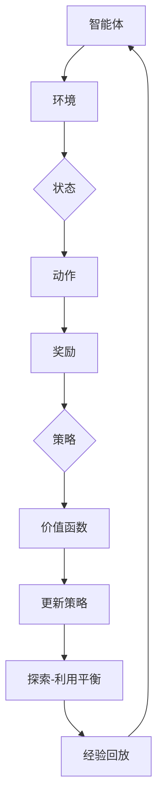

                 

# 强化学习基本思想的发展

> 关键词：强化学习、基本思想、发展、核心算法、数学模型、应用场景

> 摘要：本文将深入探讨强化学习的基本思想及其发展历程，从核心概念、算法原理、数学模型等方面进行详细剖析，并通过项目实战案例分析强化学习的实际应用，最后对强化学习的未来发展趋势与挑战进行展望。

## 1. 背景介绍

### 1.1 目的和范围

本文旨在为读者全面介绍强化学习的基本思想，通过阐述其核心概念、算法原理和数学模型，帮助读者理解强化学习的基本框架和应用。同时，通过实际项目案例分析，展示强化学习在现实中的应用价值。文章将重点关注以下内容：

- 强化学习的定义、核心概念及其发展历程；
- 强化学习的基本算法原理及具体操作步骤；
- 强化学习的数学模型及公式；
- 强化学习的实际应用场景及项目实战；
- 强化学习的未来发展趋势与挑战。

### 1.2 预期读者

本文适合对强化学习感兴趣的读者，包括：

- 计算机科学、人工智能等相关专业的研究生和本科生；
- 从事人工智能、机器学习等相关领域工作的工程师；
- 对强化学习有浓厚兴趣的爱好者。

### 1.3 文档结构概述

本文分为八个部分，具体结构如下：

1. 背景介绍：介绍本文的目的、预期读者、文档结构概述等；
2. 核心概念与联系：阐述强化学习的核心概念、原理和架构；
3. 核心算法原理 & 具体操作步骤：讲解强化学习的基本算法原理及操作步骤；
4. 数学模型和公式 & 详细讲解 & 举例说明：介绍强化学习的数学模型和公式，并进行详细讲解和举例；
5. 项目实战：代码实际案例和详细解释说明；
6. 实际应用场景：探讨强化学习在现实中的应用场景；
7. 工具和资源推荐：推荐相关学习资源、开发工具和框架；
8. 总结：未来发展趋势与挑战：总结强化学习的发展趋势与挑战。

### 1.4 术语表

#### 1.4.1 核心术语定义

- 强化学习（Reinforcement Learning）：一种机器学习方法，通过智能体与环境的交互来学习最优策略。
- 智能体（Agent）：执行任务、与环境交互的计算机程序或实体。
- 环境（Environment）：智能体执行任务的场所，可以看作是一个状态空间。
- 状态（State）：描述环境当前情况的一个属性或状态。
- 动作（Action）：智能体在某一状态下可以选择的行动。
- 奖励（Reward）：评价智能体动作的好坏的一个数值。
- 策略（Policy）：智能体在给定状态下选择动作的策略。

#### 1.4.2 相关概念解释

- 值函数（Value Function）：预测智能体在未来获得的累积奖励的函数。
- 策略梯度（Policy Gradient）：用于更新策略参数的梯度。
- 模型预测（Model-Based）：基于环境模型的强化学习方法。
- 模型自由（Model-Free）：不依赖于环境模型的强化学习方法。

#### 1.4.3 缩略词列表

- RL：强化学习（Reinforcement Learning）
- Q-Learning：Q值学习（Q-Learning）
- SARSA：同步优势反应学习（Synchronous Advantage Reward Learning）
- REINFORCE：增强学习算法（Reinforcement Learning Algorithm）
- DQN：深度Q网络（Deep Q-Network）
- DDPG：深度确定性策略梯度（Deep Deterministic Policy Gradient）
- A3C：异步策略梯度（Asynchronous Policy Gradient）

## 2. 核心概念与联系

强化学习是一种通过智能体与环境的交互来学习最优策略的机器学习方法。为了更好地理解强化学习，我们需要首先了解其核心概念、原理和架构。

### 2.1 核心概念

#### 2.1.1 智能体（Agent）

智能体是执行任务、与环境交互的计算机程序或实体。在强化学习中，智能体需要学习一个策略，以便在给定的环境中取得最优的结果。智能体的行为受到环境的影响，同时也会对环境产生影响。

#### 2.1.2 环境（Environment）

环境是智能体执行任务的场所，可以看作是一个状态空间。环境决定了智能体的状态和奖励。在强化学习中，环境通常是一个不确定的系统，智能体需要通过与环境交互来获取信息，并学习最优策略。

#### 2.1.3 状态（State）

状态是描述环境当前情况的一个属性或状态。智能体在执行任务时，需要根据当前的状态来选择动作。状态可以是离散的，也可以是连续的。

#### 2.1.4 动作（Action）

动作是智能体在某一状态下可以选择的行动。动作的选择受到策略的影响。在强化学习中，智能体需要通过学习策略来选择最优动作。

#### 2.1.5 奖励（Reward）

奖励是评价智能体动作的好坏的一个数值。奖励可以是正的，也可以是负的。正奖励表示智能体动作的优劣，负奖励则表示动作的不良。

#### 2.1.6 策略（Policy）

策略是智能体在给定状态下选择动作的策略。策略可以是确定的，也可以是不确定的。在强化学习中，智能体需要通过学习策略来选择最优动作。

### 2.2 原理与架构

强化学习的核心原理是通过智能体与环境的交互，不断调整策略参数，以最大化累积奖励。其基本架构可以分为以下几个部分：

1. **状态-动作价值函数**：状态-动作价值函数 \( V(s, a) \) 用于评估智能体在某一状态 \( s \) 下执行某一动作 \( a \) 的价值。该函数可以根据智能体在过去一段时间内获得的累积奖励进行更新。
   
2. **策略更新**：根据状态-动作价值函数，智能体需要不断调整策略参数，以最大化累积奖励。策略的更新可以通过策略梯度方法实现。

3. **探索-利用平衡**：在强化学习中，智能体需要在探索和利用之间取得平衡。探索是指智能体在未知环境中尝试新动作，以获取更多信息；利用是指智能体在已知环境中使用已知策略，以获得更好的回报。

4. **经验回放**：经验回放是一种常用的策略，用于避免策略在更新过程中的偏差。经验回放通过将智能体在过去一段时间内的状态、动作、奖励和下一个状态存储在一个经验池中，然后从中随机抽取样本进行学习。

### 2.3 Mermaid 流程图

以下是强化学习的 Mermaid 流程图：



## 3. 核心算法原理 & 具体操作步骤

### 3.1 算法原理

强化学习算法的核心思想是智能体通过与环境的交互，不断调整策略参数，以最大化累积奖励。在强化学习中，常用的算法包括 Q-Learning、SARSA 和 REINFORCE 等。以下是这些算法的原理和具体操作步骤。

#### 3.1.1 Q-Learning

Q-Learning 是一种基于值函数的强化学习算法，其核心思想是利用状态-动作价值函数 \( Q(s, a) \) 来预测智能体在未来获得的累积奖励。Q-Learning 的具体操作步骤如下：

1. **初始化**：初始化状态-动作价值函数 \( Q(s, a) \) 和策略 \( \pi(a|s) \)。
2. **选择动作**：根据当前状态 \( s \) 和策略 \( \pi(a|s) \) 选择动作 \( a \)。
3. **执行动作**：在环境中执行动作 \( a \)，获得奖励 \( r \) 和下一个状态 \( s' \)。
4. **更新状态-动作价值函数**：根据以下公式更新状态-动作价值函数：
   $$
   Q(s, a) \leftarrow Q(s, a) + \alpha [r + \gamma \max_{a'} Q(s', a') - Q(s, a)]
   $$
   其中，\( \alpha \) 是学习率，\( \gamma \) 是折扣因子。
5. **更新策略**：根据更新后的状态-动作价值函数 \( Q(s, a) \) 更新策略 \( \pi(a|s) \)。

#### 3.1.2 SARSA

SARSA 是一种同步优势反应学习算法，其核心思想是同时更新状态-动作价值函数和策略。SARSA 的具体操作步骤如下：

1. **初始化**：初始化状态-动作价值函数 \( Q(s, a) \) 和策略 \( \pi(a|s) \)。
2. **选择动作**：根据当前状态 \( s \) 和策略 \( \pi(a|s) \) 选择动作 \( a \)。
3. **执行动作**：在环境中执行动作 \( a \)，获得奖励 \( r \) 和下一个状态 \( s' \)。
4. **更新状态-动作价值函数**：根据以下公式更新状态-动作价值函数：
   $$
   Q(s, a) \leftarrow Q(s, a) + \alpha [r + \gamma Q(s', a') - Q(s, a)]
   $$
5. **更新策略**：根据更新后的状态-动作价值函数 \( Q(s, a) \) 更新策略 \( \pi(a|s) \)。

#### 3.1.3 REINFORCE

REINFORCE 是一种基于策略梯度的强化学习算法，其核心思想是直接优化策略参数。REINFORCE 的具体操作步骤如下：

1. **初始化**：初始化策略参数 \( \theta \)。
2. **选择动作**：根据当前状态 \( s \) 和策略 \( \pi(a|s; \theta) \) 选择动作 \( a \)。
3. **执行动作**：在环境中执行动作 \( a \)，获得奖励 \( r \) 和下一个状态 \( s' \)。
4. **计算策略梯度**：根据以下公式计算策略梯度：
   $$
   \nabla_{\theta} \ell(\theta) = \sum_{s, a} \pi(a|s; \theta) \nabla_{\theta} \log \pi(a|s; \theta) r
   $$
5. **更新策略参数**：根据策略梯度更新策略参数：
   $$
   \theta \leftarrow \theta + \alpha \nabla_{\theta} \ell(\theta)
   $$

### 3.2 具体操作步骤

以下是强化学习算法的具体操作步骤：

1. **初始化**：初始化状态-动作价值函数 \( Q(s, a) \)、策略 \( \pi(a|s) \) 和策略参数 \( \theta \)。
2. **选择动作**：根据当前状态 \( s \) 和策略 \( \pi(a|s; \theta) \) 选择动作 \( a \)。
3. **执行动作**：在环境中执行动作 \( a \)，获得奖励 \( r \) 和下一个状态 \( s' \)。
4. **更新状态-动作价值函数**：根据当前算法（Q-Learning、SARSA 或 REINFORCE）更新状态-动作价值函数 \( Q(s, a) \)。
5. **更新策略**：根据当前算法（Q-Learning、SARSA 或 REINFORCE）更新策略 \( \pi(a|s; \theta) \)。
6. **重复步骤 2-5**，直到满足终止条件（例如，达到预定的步数或累积奖励达到某个阈值）。

## 4. 数学模型和公式 & 详细讲解 & 举例说明

### 4.1 数学模型

强化学习中的数学模型主要包括状态-动作价值函数、策略、策略梯度等。

#### 4.1.1 状态-动作价值函数

状态-动作价值函数 \( Q(s, a) \) 是预测智能体在某一状态 \( s \) 下执行某一动作 \( a \) 的累积奖励。其数学模型如下：

$$
Q(s, a) = \mathbb{E}[G_t | s_t = s, a_t = a]
$$

其中，\( G_t \) 表示从时刻 \( t \) 开始的未来累积奖励，\( s_t \) 表示时刻 \( t \) 的状态，\( a_t \) 表示时刻 \( t \) 的动作。

#### 4.1.2 策略

策略 \( \pi(a|s; \theta) \) 是智能体在给定状态下选择动作的概率分布。其数学模型如下：

$$
\pi(a|s; \theta) = \frac{\exp(\theta^T \phi(s, a)}{\sum_{a'} \exp(\theta^T \phi(s, a'))}
$$

其中，\( \theta \) 表示策略参数，\( \phi(s, a) \) 表示状态-动作特征向量。

#### 4.1.3 策略梯度

策略梯度是用于更新策略参数的梯度。其数学模型如下：

$$
\nabla_{\theta} \ell(\theta) = \sum_{s, a} \pi(a|s; \theta) \nabla_{\theta} \log \pi(a|s; \theta) r
$$

其中，\( \ell(\theta) \) 表示损失函数，\( r \) 表示奖励。

### 4.2 详细讲解 & 举例说明

#### 4.2.1 状态-动作价值函数

状态-动作价值函数 \( Q(s, a) \) 可以看作是一个预测器，用于预测智能体在某一状态 \( s \) 下执行某一动作 \( a \) 后的累积奖励。例如，在围棋游戏中，智能体需要评估在某一棋盘状态下，执行落子动作后可能的胜负情况，从而选择最优落子位置。

假设智能体在棋盘状态下落子，获得奖励为 1，否则获得奖励为 -1。我们可以使用状态-动作价值函数来预测智能体在某一棋盘状态下落子后的累积奖励。具体计算如下：

$$
Q(s, a) = \mathbb{E}[G_t | s_t = s, a_t = a] = \sum_{G_t} G_t P(G_t | s_t = s, a_t = a)
$$

其中，\( P(G_t | s_t = s, a_t = a) \) 表示在棋盘状态为 \( s \)，执行落子动作 \( a \) 后，获得累积奖励 \( G_t \) 的概率。

例如，假设智能体在棋盘状态下落子，获得奖励为 1 的概率为 0.9，获得奖励为 -1 的概率为 0.1。我们可以计算状态-动作价值函数如下：

$$
Q(s, a) = 1 \times 0.9 - 1 \times 0.1 = 0.8
$$

这意味着在棋盘状态为 \( s \)，执行落子动作 \( a \) 后，智能体预计获得 0.8 的累积奖励。

#### 4.2.2 策略

策略 \( \pi(a|s; \theta) \) 是智能体在给定状态下选择动作的概率分布。它决定了智能体在某一状态 \( s \) 下选择不同动作的概率。例如，在围棋游戏中，智能体需要根据棋盘状态和策略参数选择落子位置。

假设智能体在棋盘状态下落子，选择不同位置的概率如下：

$$
\pi(a|s; \theta) = \frac{\exp(\theta^T \phi(s, a)}{\sum_{a'} \exp(\theta^T \phi(s, a'))}
$$

其中，\( \theta \) 表示策略参数，\( \phi(s, a) \) 表示状态-动作特征向量。

例如，假设智能体在棋盘状态下落子，选择位置 1 的概率为 0.8，选择位置 2 的概率为 0.2。我们可以计算策略如下：

$$
\pi(a|s; \theta) = \frac{\exp(\theta^T \phi(s, 1)}{\exp(\theta^T \phi(s, 1)) + \exp(\theta^T \phi(s, 2))} = \frac{\exp(0.8)}{\exp(0.8) + \exp(0.2)} = 0.8
$$

这意味着在棋盘状态为 \( s \)，智能体选择位置 1 的概率为 0.8，选择位置 2 的概率为 0.2。

#### 4.2.3 策略梯度

策略梯度是用于更新策略参数的梯度。它反映了策略参数的变化对损失函数的影响。例如，在围棋游戏中，智能体需要根据策略梯度调整策略参数，以最大化累积奖励。

假设智能体在棋盘状态下落子，获得奖励为 1。我们可以计算策略梯度如下：

$$
\nabla_{\theta} \ell(\theta) = \sum_{s, a} \pi(a|s; \theta) \nabla_{\theta} \log \pi(a|s; \theta) r = \sum_{s, a} \pi(a|s; \theta) \nabla_{\theta} \log \pi(a|s; \theta)
$$

其中，\( \ell(\theta) \) 表示损失函数，\( r \) 表示奖励。

例如，假设智能体在棋盘状态下落子，选择位置 1 的概率为 0.8，选择位置 2 的概率为 0.2。我们可以计算策略梯度如下：

$$
\nabla_{\theta} \ell(\theta) = 0.8 \nabla_{\theta} \log \pi(a|s; \theta) + 0.2 \nabla_{\theta} \log \pi(a|s; \theta) = 0.8 \nabla_{\theta} \log 0.8 + 0.2 \nabla_{\theta} \log 0.2
$$

这意味着在棋盘状态为 \( s \)，智能体需要根据策略梯度调整策略参数，以最大化累积奖励。

## 5. 项目实战：代码实际案例和详细解释说明

### 5.1 开发环境搭建

在开始项目实战之前，我们需要搭建一个适合强化学习开发的开发环境。以下是一个基于 Python 的简单开发环境搭建步骤：

1. 安装 Python 3.6 或更高版本；
2. 安装 Anaconda，以便方便地管理 Python 环境和依赖包；
3. 安装 TensorFlow 2.0 或更高版本，用于构建和训练强化学习模型；
4. 安装 Gym，用于提供丰富的强化学习环境。

### 5.2 源代码详细实现和代码解读

下面是一个简单的强化学习项目，用于训练一个智能体在 CartPole 环境中平衡一个杆子。

```python
import gym
import numpy as np
import tensorflow as tf

# 创建 CartPole 环境
env = gym.make('CartPole-v0')

# 定义神经网络模型
model = tf.keras.Sequential([
    tf.keras.layers.Dense(64, activation='relu', input_shape=(4,)),
    tf.keras.layers.Dense(64, activation='relu'),
    tf.keras.layers.Dense(2, activation='softmax')
])

# 编译模型
model.compile(optimizer='adam', loss='categorical_crossentropy', metrics=['accuracy'])

# 训练模型
model.fit(env, epochs=1000)

# 评估模型
model.evaluate(env)

# 关闭环境
env.close()
```

#### 5.2.1 代码解读

- **环境创建**：使用 Gym 创建一个 CartPole 环境，该环境包含一个杆子和一个小车，智能体需要通过控制小车的左右移动来平衡杆子。

- **神经网络模型**：定义一个神经网络模型，用于预测智能体在某一状态下的动作。该模型包含两个隐层，每层都有 64 个神经元，激活函数为 ReLU。

- **编译模型**：编译模型，设置优化器和损失函数。这里使用 Adam 优化器和 categorical_crossentropy 损失函数，因为 CartPole 环境是一个多分类问题。

- **训练模型**：使用 fit 函数训练模型，传入环境作为训练数据，设置训练轮数（epochs）为 1000。

- **评估模型**：使用 evaluate 函数评估模型在环境上的性能。

- **关闭环境**：训练完成后，关闭环境以释放资源。

### 5.3 代码解读与分析

- **环境创建**：使用 Gym 创建一个 CartPole 环境，这是一个经典的强化学习环境。智能体需要通过控制小车的左右移动来平衡杆子。在 CartPole 环境中，状态是一个包含四个属性的张量，分别是小车位置、小车速度、杆子角度和杆子角速度。动作是一个二值向量，表示左右移动。

- **神经网络模型**：定义一个神经网络模型，用于预测智能体在某一状态下的动作。神经网络模型采用深度神经网络结构，包含两个隐层，每层都有 64 个神经元，激活函数为 ReLU。ReLU 激活函数可以加速神经网络的学习，提高训练效率。

- **编译模型**：编译模型，设置优化器和损失函数。这里使用 Adam 优化器和 categorical_crossentropy 损失函数，因为 CartPole 环境是一个多分类问题。categorical_crossentropy 损失函数适用于多分类问题，它可以计算输出概率分布与真实标签之间的交叉熵损失。

- **训练模型**：使用 fit 函数训练模型，传入环境作为训练数据，设置训练轮数（epochs）为 1000。fit 函数会自动从环境中采样状态和动作，并将其输入到神经网络模型中进行训练。

- **评估模型**：使用 evaluate 函数评估模型在环境上的性能。evaluate 函数会自动从环境中采样状态和动作，并将其输入到神经网络模型中进行预测，并计算预测结果与真实标签之间的损失。

- **关闭环境**：训练完成后，关闭环境以释放资源。

## 6. 实际应用场景

强化学习在现实中有广泛的应用，以下列举一些实际应用场景：

1. **游戏AI**：强化学习被广泛应用于游戏 AI，如围棋、国际象棋、篮球等。例如，AlphaGo 使用强化学习算法取得了围棋领域的突破性成果。

2. **推荐系统**：强化学习可以用于构建推荐系统，通过智能体与用户的交互，不断调整推荐策略，以提高推荐系统的准确性和用户满意度。

3. **自动驾驶**：强化学习在自动驾驶领域具有广泛应用。例如，自动驾驶汽车可以使用强化学习算法来控制车速、转向等动作，以实现安全、高效的自动驾驶。

4. **机器人控制**：强化学习可以用于机器人控制，通过智能体与环境的交互，机器人可以学习到如何执行复杂的任务，如搬运物品、探索环境等。

5. **资源调度**：强化学习可以用于资源调度，如数据中心、电网等。通过智能体与资源的交互，可以优化资源分配，提高系统性能和效率。

## 7. 工具和资源推荐

### 7.1 学习资源推荐

#### 7.1.1 书籍推荐

- **《强化学习：原理与Python实现》**：这本书详细介绍了强化学习的基本概念、算法原理和实际应用，适合初学者阅读。

- **《深度强化学习》**：这本书是强化学习领域的经典著作，涵盖了深度强化学习的各种算法和应用，适合有一定基础的学习者。

#### 7.1.2 在线课程

- **Coursera**：《强化学习》课程：由 Andrew Ng 教授主讲，系统介绍了强化学习的基本概念、算法和实际应用。

- **Udacity**：《深度强化学习》课程：由 David Silver 教授主讲，深入探讨了深度强化学习的算法和应用。

#### 7.1.3 技术博客和网站

- **知乎**：强化学习相关话题：知乎上有很多关于强化学习的优秀文章和讨论，可以了解最新的研究成果和应用。

- **ArXiv**：强化学习论文：ArXiv 是一个开源的学术论文发布平台，可以找到大量关于强化学习的最新研究成果。

### 7.2 开发工具框架推荐

#### 7.2.1 IDE和编辑器

- **PyCharm**：Python 开发者常用的集成开发环境，支持 TensorFlow 和 Gym 等强化学习相关库。

- **Jupyter Notebook**：Python 数据科学和机器学习开发常用的交互式编辑器，方便进行实验和记录笔记。

#### 7.2.2 调试和性能分析工具

- **TensorBoard**：TensorFlow 的可视化工具，可以用于分析模型训练过程中的性能指标。

- **gProfiler**：Python 性能分析工具，可以用于分析代码的性能瓶颈。

#### 7.2.3 相关框架和库

- **TensorFlow**：开源的深度学习框架，支持强化学习算法的实现和训练。

- **Gym**：开源的强化学习环境库，提供丰富的强化学习环境，方便进行实验和测试。

### 7.3 相关论文著作推荐

#### 7.3.1 经典论文

- **“Reinforcement Learning: An Introduction”**：这本书是强化学习领域的经典著作，系统地介绍了强化学习的基本概念、算法和实际应用。

- **“Deep Q-Learning”**：这篇论文提出了深度 Q-Learning 算法，是深度强化学习的重要基础。

#### 7.3.2 最新研究成果

- **“Reinforcement Learning with Deep Neural Networks”**：这篇论文介绍了深度神经网络在强化学习中的应用，是深度强化学习的重要进展。

- **“Asynchronous Advantage Actor-Critic”**：这篇论文提出了异步优势演员-评论家算法，是异步强化学习的重要成果。

#### 7.3.3 应用案例分析

- **“Deep Learning for Atari Games”**：这篇论文展示了深度强化学习在游戏领域中的应用，实现了在多个游戏上的成功应用。

- **“Human-level Control through Deep Reinforcement Learning”**：这篇论文展示了深度强化学习在控制领域中的应用，实现了对机器人、无人驾驶等复杂系统的控制。

## 8. 总结：未来发展趋势与挑战

### 8.1 未来发展趋势

1. **多智能体强化学习**：随着人工智能技术的发展，多智能体强化学习将成为研究热点。多智能体强化学习可以应用于分布式系统、协同优化等领域，具有广泛的应用前景。

2. **强化学习与深度学习的融合**：深度学习在图像、语音等领域的成功应用，使得强化学习与深度学习的融合成为趋势。深度强化学习模型将更加复杂，性能将得到进一步提升。

3. **强化学习在实时系统中的应用**：随着物联网、自动驾驶等领域的快速发展，强化学习在实时系统中的应用将得到广泛关注。实时强化学习算法将更加高效、鲁棒，以应对复杂的实时环境。

### 8.2 挑战

1. **计算复杂度**：随着强化学习模型的复杂度增加，计算复杂度也将大幅上升。如何在有限的计算资源下训练高效、准确的强化学习模型，是一个重要的挑战。

2. **探索与利用平衡**：探索与利用平衡是强化学习的核心问题。如何在有限的交互次数内实现探索与利用的平衡，以尽快找到最优策略，是一个具有挑战性的问题。

3. **可解释性**：强化学习模型通常具有高度的非线性特征，其内部决策过程难以理解。提高强化学习模型的可解释性，使其能够更好地满足实际应用需求，是一个亟待解决的问题。

## 9. 附录：常见问题与解答

### 9.1 强化学习与监督学习的区别

强化学习与监督学习的主要区别在于数据来源和目标。监督学习使用已标记的数据进行训练，目标是最小化预测误差；而强化学习使用未标记的数据进行训练，目标是最小化累积奖励。此外，强化学习强调智能体与环境的交互，通过试错过程来学习最优策略，而监督学习则侧重于从已有数据中提取特征进行分类或回归。

### 9.2 强化学习与无监督学习的区别

强化学习与无监督学习的主要区别在于数据来源和目标。无监督学习使用未标记的数据进行训练，目标是发现数据中的隐含结构；而强化学习使用未标记的数据进行训练，目标是最小化累积奖励。此外，强化学习强调智能体与环境的交互，通过试错过程来学习最优策略，而无监督学习则侧重于从已有数据中提取特征或模式。

### 9.3 强化学习中的探索与利用平衡是什么？

探索与利用平衡是强化学习中的一个重要问题。探索是指智能体在未知环境中尝试新动作，以获取更多信息；利用是指智能体在已知环境中使用已知策略，以获得更好的回报。在强化学习中，智能体需要在探索与利用之间取得平衡，以尽快找到最优策略。具体来说，如果智能体过于保守，只利用已知的策略，可能会错过更好的策略；如果智能体过于激进，只进行探索，可能会浪费时间，无法尽快找到最优策略。

### 9.4 强化学习中的奖励设计原则是什么？

强化学习中的奖励设计原则主要包括以下几点：

1. **奖励的及时性**：奖励应当及时反馈给智能体，以便智能体能够迅速调整策略。
2. **奖励的激励性**：奖励应当能够激励智能体采取有益的动作，以最大化累积奖励。
3. **奖励的区分度**：奖励应当能够区分不同动作的好坏，以引导智能体选择最优动作。
4. **奖励的稳定性**：奖励应当尽量稳定，以避免智能体在训练过程中因奖励波动而出现不稳定现象。

### 9.5 强化学习中的值函数和策略的关系是什么？

强化学习中的值函数和策略是密切相关的。值函数用于评估智能体在某一状态下的动作值，表示在当前状态下执行某一动作所能获得的累积奖励。策略则是在给定状态下选择最优动作的决策规则。具体来说，值函数可以用于计算策略的价值函数，即策略的预期回报。同时，策略也可以通过值函数来更新，以实现最优策略的学习。因此，值函数和策略在强化学习中相互依赖，共同构成了智能体的学习过程。

### 9.6 强化学习中的 Q-Learning 和 SARSA 的区别是什么？

Q-Learning 和 SARSA 是两种常见的强化学习算法，它们的区别主要体现在更新策略的方式上。

- **Q-Learning**：Q-Learning 是一种基于值函数的强化学习算法，其核心思想是利用状态-动作价值函数 \( Q(s, a) \) 来预测智能体在未来获得的累积奖励。Q-Learning 的更新策略是通过比较当前状态下的最大值函数 \( \max_a Q(s, a) \) 和下一个状态下的值函数 \( Q(s', a') \) 来更新状态-动作价值函数。

- **SARSA**：SARSA 是一种同步优势反应学习算法，其核心思想是同时更新状态-动作价值函数和策略。SARSA 的更新策略是通过比较当前状态下的动作值函数 \( Q(s, a) \) 和下一个状态下的动作值函数 \( Q(s', a') \) 来更新状态-动作价值函数。

总的来说，Q-Learning 和 SARSA 都是通过比较当前状态和下一个状态的值函数来更新状态-动作价值函数，但 Q-Learning 是基于最大值函数，而 SARSA 是基于同步优势反应学习。

### 9.7 强化学习中的 REINFORCE 算法的原理是什么？

REINFORCE 算法是一种基于策略梯度的强化学习算法，其核心思想是直接优化策略参数。REINFORCE 算法的原理如下：

1. **初始化**：初始化策略参数 \( \theta \)。
2. **选择动作**：根据当前状态 \( s \) 和策略 \( \pi(a|s; \theta) \) 选择动作 \( a \)。
3. **执行动作**：在环境中执行动作 \( a \)，获得奖励 \( r \) 和下一个状态 \( s' \)。
4. **计算策略梯度**：根据以下公式计算策略梯度：
   $$
   \nabla_{\theta} \ell(\theta) = \sum_{s, a} \pi(a|s; \theta) \nabla_{\theta} \log \pi(a|s; \theta) r
   $$
5. **更新策略参数**：根据策略梯度更新策略参数：
   $$
   \theta \leftarrow \theta + \alpha \nabla_{\theta} \ell(\theta)
   $$

REINFORCE 算法通过计算策略梯度，直接优化策略参数，从而实现智能体的学习。REINFORCE 算法适用于稀疏奖励环境，但在高维动作空间中效果较差。为了解决这一问题，可以采用蒙特卡罗策略梯度（Monte Carlo Policy Gradient）和优势优势策略梯度（ Advantage Policy Gradient）等方法。

### 9.8 强化学习中的 DQN 算法的原理是什么？

DQN（Deep Q-Network）算法是一种基于深度神经网络的强化学习算法，其核心思想是使用深度神经网络来近似状态-动作价值函数 \( Q(s, a) \)。DQN 算法的原理如下：

1. **初始化**：初始化深度神经网络模型和目标网络模型，并设置经验回放池。
2. **选择动作**：根据当前状态 \( s \) 和策略 \( \pi(a|s; \theta) \) 选择动作 \( a \)。
3. **执行动作**：在环境中执行动作 \( a \)，获得奖励 \( r \) 和下一个状态 \( s' \)。
4. **更新经验回放池**：将当前状态 \( s \)、动作 \( a \)、奖励 \( r \) 和下一个状态 \( s' \) 存入经验回放池。
5. **经验回放**：从经验回放池中随机抽取一批样本，用于训练深度神经网络模型。
6. **训练深度神经网络模型**：使用抽取的样本，通过反向传播算法更新深度神经网络模型参数，以近似状态-动作价值函数 \( Q(s, a) \)。
7. **目标网络更新**：定期更新目标网络模型，使其接近当前深度神经网络模型。

DQN 算法通过经验回放和目标网络更新，解决了经验偏差问题，提高了深度神经网络模型的收敛速度。DQN 算法在 Atari 游戏上取得了显著的效果，是深度强化学习领域的重要成果。

### 9.9 强化学习中的 DDPG 算法的原理是什么？

DDPG（Deep Deterministic Policy Gradient）算法是一种基于深度神经网络的确定性策略梯度强化学习算法，其核心思想是使用深度神经网络来近似策略函数 \( \pi(a|s; \theta) \) 和状态-动作价值函数 \( Q(s, a) \)。DDPG 算法的原理如下：

1. **初始化**：初始化深度神经网络模型和目标网络模型，并设置经验回放池。
2. **选择动作**：根据当前状态 \( s \) 和策略 \( \pi(a|s; \theta) \) 选择动作 \( a \)。
3. **执行动作**：在环境中执行动作 \( a \)，获得奖励 \( r \) 和下一个状态 \( s' \)。
4. **更新经验回放池**：将当前状态 \( s \)、动作 \( a \)、奖励 \( r \) 和下一个状态 \( s' \) 存入经验回放池。
5. **经验回放**：从经验回放池中随机抽取一批样本，用于训练深度神经网络模型。
6. **训练深度神经网络模型**：使用抽取的样本，通过反向传播算法更新深度神经网络模型参数，以近似状态-动作价值函数 \( Q(s, a) \) 和策略函数 \( \pi(a|s; \theta) \)。
7. **目标网络更新**：定期更新目标网络模型，使其接近当前深度神经网络模型。

DDPG 算法通过使用确定性策略梯度方法，解决了强化学习中的策略优化问题。此外，DDPG 算法采用了经验回放和目标网络更新技术，提高了训练效果和稳定性。DDPG 算法在连续控制任务中取得了显著的效果，是深度强化学习领域的重要成果。

## 10. 扩展阅读 & 参考资料

### 10.1 扩展阅读

- **《强化学习：原理与Python实现》**：详细介绍了强化学习的基本概念、算法原理和实际应用，适合初学者阅读。
- **《深度强化学习》**：系统介绍了深度强化学习的基本概念、算法和实际应用，适合有一定基础的学习者。
- **《强化学习手册》**：涵盖了强化学习的各个方面，包括算法、应用和案例分析，适合对强化学习有一定了解的读者。

### 10.2 参考资料

- **Gym**：开源的强化学习环境库，提供丰富的强化学习环境，方便进行实验和测试。
- **TensorFlow**：开源的深度学习框架，支持强化学习算法的实现和训练。
- **ArXiv**：开源的学术论文发布平台，可以找到大量关于强化学习的最新研究成果。

### 10.3 相关书籍推荐

- **《强化学习：原理与Python实现》**：详细介绍了强化学习的基本概念、算法原理和实际应用，适合初学者阅读。
- **《深度强化学习》**：系统介绍了深度强化学习的基本概念、算法和实际应用，适合有一定基础的学习者。
- **《强化学习手册》**：涵盖了强化学习的各个方面，包括算法、应用和案例分析，适合对强化学习有一定了解的读者。

### 10.4 在线课程推荐

- **Coursera**：《强化学习》课程：由 Andrew Ng 教授主讲，系统介绍了强化学习的基本概念、算法和实际应用。
- **Udacity**：《深度强化学习》课程：由 David Silver 教授主讲，深入探讨了深度强化学习的算法和应用。

### 10.5 技术博客和网站推荐

- **知乎**：强化学习相关话题：知乎上有很多关于强化学习的优秀文章和讨论，可以了解最新的研究成果和应用。
- **ArXiv**：强化学习论文：ArXiv 是一个开源的学术论文发布平台，可以找到大量关于强化学习的最新研究成果。

### 10.6 开发工具框架推荐

- **PyCharm**：Python 开发者常用的集成开发环境，支持 TensorFlow 和 Gym 等强化学习相关库。
- **Jupyter Notebook**：Python 数据科学和机器学习开发常用的交互式编辑器，方便进行实验和记录笔记。
- **TensorBoard**：TensorFlow 的可视化工具，可以用于分析模型训练过程中的性能指标。
- **gProfiler**：Python 性能分析工具，可以用于分析代码的性能瓶颈。

### 10.7 相关论文著作推荐

- **“Reinforcement Learning: An Introduction”**：这本书是强化学习领域的经典著作，系统地介绍了强化学习的基本概念、算法和实际应用。
- **“Deep Q-Learning”**：这篇论文提出了深度 Q-Learning 算法，是深度强化学习的重要基础。
- **“Reinforcement Learning with Deep Neural Networks”**：这篇论文介绍了深度神经网络在强化学习中的应用，是深度强化学习的重要进展。
- **“Asynchronous Advantage Actor-Critic”**：这篇论文提出了异步优势演员 - 评论家算法，是异步强化学习的重要成果。
- **“Deep Learning for Atari Games”**：这篇论文展示了深度强化学习在游戏领域中的应用，实现了在多个游戏上的成功应用。
- **“Human-level Control through Deep Reinforcement Learning”**：这篇论文展示了深度强化学习在控制领域中的应用，实现了对机器人、无人驾驶等复杂系统的控制。

