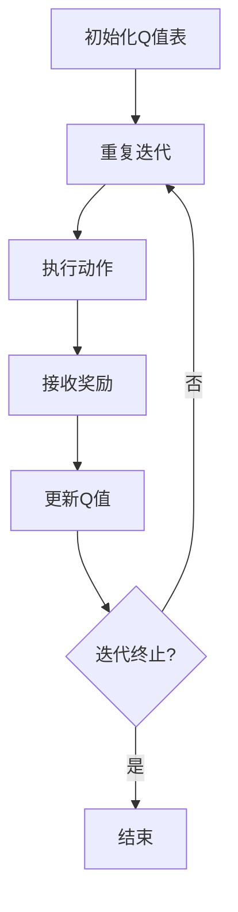

                 


# 强化学习算法：Q-learning 原理与代码实例讲解

> 关键词：强化学习、Q-learning、算法原理、代码实例、深度学习、机器学习

> 摘要：本文将深入讲解强化学习算法中的Q-learning原理，通过具体代码实例分析，帮助读者更好地理解Q-learning的核心思想。文章从背景介绍、核心概念与联系、算法原理、数学模型、项目实战、实际应用场景等方面展开，为希望掌握强化学习算法的读者提供一份全面的技术指南。

## 1. 背景介绍

### 1.1 目的和范围

本文旨在通过深入剖析Q-learning算法，帮助读者了解强化学习的核心原理。文章内容不仅涵盖了Q-learning的基本概念，还包括了详细的算法原理讲解、数学模型分析，以及具体的代码实现。通过这篇文章，读者可以掌握Q-learning算法的基本操作步骤，并能够将其应用于实际问题中。

### 1.2 预期读者

本文适合以下读者群体：
- 有一定编程基础的机器学习爱好者；
- 想要深入理解强化学习算法的本科生和研究生；
- 对人工智能领域感兴趣的技术从业人员。

### 1.3 文档结构概述

本文结构如下：

1. 背景介绍：本文的背景和目的；
2. 核心概念与联系：介绍强化学习、Q-learning等相关概念和联系；
3. 核心算法原理 & 具体操作步骤：详细讲解Q-learning算法的原理和操作步骤；
4. 数学模型和公式 & 详细讲解 & 举例说明：分析Q-learning的数学模型和公式，并通过实例进行说明；
5. 项目实战：代码实际案例和详细解释说明；
6. 实际应用场景：讨论Q-learning的实际应用场景；
7. 工具和资源推荐：推荐学习资源和开发工具；
8. 总结：未来发展趋势与挑战；
9. 附录：常见问题与解答；
10. 扩展阅读 & 参考资料。

### 1.4 术语表

#### 1.4.1 核心术语定义

- 强化学习：一种机器学习方法，通过奖励信号来指导学习过程，旨在找到最优策略。
- Q-learning：一种基于值函数的强化学习算法，通过迭代更新值函数来学习最优策略。
- 策略：在给定状态下的最佳行动方案。
- 值函数：描述在给定状态下采取特定行动的预期回报。

#### 1.4.2 相关概念解释

- 状态（State）：环境中的一个特定条件或情境。
- 动作（Action）：在给定状态下可执行的操作。
- 奖励（Reward）：在执行特定动作后，环境给予的即时反馈信号。
- 折扣因子（Discount Factor）：用来调整未来奖励的重要性。

#### 1.4.3 缩略词列表

- RL：强化学习（Reinforcement Learning）
- Q-learning：Q值学习（Q-value Learning）
- DQN：深度Q网络（Deep Q-Network）

## 2. 核心概念与联系

在理解Q-learning算法之前，我们需要了解强化学习的基本概念和架构。

### 2.1 强化学习架构

强化学习系统通常由以下四个主要组成部分构成：

1. **环境（Environment）**：环境是一个外部系统，它包含一个状态空间和动作空间，并为执行的动作提供奖励。
2. **智能体（Agent）**：智能体是执行动作并接收环境的奖励的实体。其目标是学习一个策略，以最大化累积奖励。
3. **策略（Policy）**：策略是智能体在给定状态下选择动作的方法。
4. **价值函数（Value Function）**：价值函数评估智能体在特定状态下采取特定动作的长期回报。

### 2.2 Q-learning算法

Q-learning是一种基于值函数的强化学习算法，它通过迭代更新Q值来学习最优策略。Q值表示在给定状态下采取特定动作的预期回报。

#### Q-learning的核心概念

- **Q值（Q-Value）**：Q值是值函数的一个估计值，表示在给定状态下采取特定动作的预期回报。
- **Q函数（Q-Function）**：Q函数是一个映射函数，它将状态-动作对映射到一个实数值，即Q值。
- **策略（Policy）**：策略是智能体在给定状态下选择动作的方法。在Q-learning中，策略可以通过Q函数的优化得到。

#### Q-learning的工作流程

1. 初始化Q值表：初始时，所有Q值被设置为0。
2. 迭代过程：
   - 选择动作：根据当前策略选择一个动作。
   - 执行动作：在环境中执行所选动作。
   - 接收奖励：从环境中获取奖励。
   - 更新Q值：使用更新公式更新Q值。
3. 重复迭代过程，直至满足终止条件。

#### Q-learning的更新公式

$$
Q(s, a) \leftarrow Q(s, a) + \alpha [r + \gamma \max_{a'} Q(s', a') - Q(s, a)]
$$

其中：
- $Q(s, a)$：状态-动作对的Q值。
- $\alpha$：学习率，控制更新步长。
- $r$：立即奖励。
- $\gamma$：折扣因子，控制未来奖励的重要性。
- $s'$：执行动作后的状态。
- $a'$：在状态$s'$下采取的最佳动作。

### 2.3 Mermaid流程图

以下是Q-learning算法的Mermaid流程图：



## 3. 核心算法原理 & 具体操作步骤

在了解了Q-learning算法的核心概念和架构后，接下来我们将详细讲解Q-learning的算法原理和具体操作步骤。

### 3.1 算法原理

Q-learning算法基于值函数的概念，通过迭代更新Q值来学习最优策略。Q值的更新依赖于当前的策略、立即奖励、折扣因子以及下一状态的最优Q值。具体地，Q-learning算法遵循以下基本原理：

1. 初始化Q值表：初始时，所有Q值被设置为0。
2. 选择动作：根据当前策略选择一个动作。在初始阶段，策略通常是随机策略，即每个动作的选择概率相等。
3. 执行动作：在环境中执行所选动作。
4. 接收奖励：从环境中获取奖励。
5. 更新Q值：使用更新公式更新Q值，以反映当前动作在当前状态下的预期回报。

### 3.2 具体操作步骤

以下是Q-learning算法的具体操作步骤：

1. **初始化**：
   - 初始化Q值表：将所有Q值初始化为0。
   - 初始化策略：初始策略通常是随机策略。

2. **迭代过程**：
   - 选择动作：在当前状态下，根据策略选择一个动作。策略的选择可以通过以下方式实现：
     - 随机策略：每个动作的选择概率相等。
     - ε-贪心策略：以概率$1-\epsilon$随机选择动作，以概率$\epsilon$选择当前状态下Q值最大的动作。
   - 执行动作：在环境中执行所选动作。
   - 接收奖励：从环境中获取奖励。
   - 更新Q值：使用更新公式更新Q值。

3. **重复迭代**：
   - 重复迭代过程，直至满足终止条件。终止条件可以是：
     - 达到预定的迭代次数。
     - 策略收敛，即Q值不再显著更新。

### 3.3 伪代码

以下是Q-learning算法的伪代码：

```python
# 初始化Q值表
Q = initialize_Q_values()

# 初始化策略
policy = initialize_policy()

# 设置迭代次数
num_iterations = 1000

# 迭代过程
for i in range(num_iterations):
    # 选择动作
    action = select_action(policy)
    
    # 执行动作
    state, reward, next_state, done = environment.step(action)
    
    # 更新Q值
    Q[state, action] = Q[state, action] + alpha * (reward + gamma * max(Q[next_state, :]) - Q[state, action])
    
    # 更新策略
    policy = update_policy(Q, state, action, epsilon)

    # 检查是否终止
    if done:
        break

# 输出最优策略
print("Optimal Policy:", policy)
```

## 4. 数学模型和公式 & 详细讲解 & 举例说明

Q-learning算法的核心在于其数学模型和更新公式。在这一节中，我们将详细讲解Q-learning的数学模型，并通过具体例子进行说明。

### 4.1 数学模型

Q-learning算法的数学模型主要包括Q值表、策略、状态和动作。以下是这些模型的相关概念：

1. **Q值表（Q-Table）**：Q值表是一个二维数组，用于存储状态-动作对的Q值。Q值表示在给定状态下采取特定动作的预期回报。

2. **策略（Policy）**：策略是一个映射函数，它将状态映射到动作。在Q-learning中，策略可以通过Q值表来定义。具体地，策略$\pi(a|s)$表示在状态$s$下采取动作$a$的概率。

3. **状态（State）**：状态是环境中的一个特定条件或情境，通常用一个离散的数字或符号表示。

4. **动作（Action）**：动作是在给定状态下可执行的操作，通常用一个离散的数字或符号表示。

### 4.2 更新公式

Q-learning算法的更新公式如下：

$$
Q(s, a) \leftarrow Q(s, a) + \alpha [r + \gamma \max_{a'} Q(s', a') - Q(s, a)]
$$

其中：
- $Q(s, a)$：状态-动作对的Q值。
- $\alpha$：学习率，控制更新步长。
- $r$：立即奖励。
- $\gamma$：折扣因子，控制未来奖励的重要性。
- $s'$：执行动作后的状态。
- $a'$：在状态$s'$下采取的最佳动作。

### 4.3 举例说明

为了更好地理解Q-learning的数学模型和更新公式，我们通过一个简单的例子进行说明。

假设我们有一个简单的环境，状态空间为{0, 1, 2}，动作空间为{U, D}（向上移动和向下移动）。以下是该环境的转移矩阵和奖励矩阵：

#### 转移矩阵（P）

|   | U | D |
|---|---|---|
| 0 | 0.5 | 0.5 |
| 1 | 0.2 | 0.8 |
| 2 | 0.1 | 0.9 |

#### 奖励矩阵（R）

|   | U | D |
|---|---|---|
| 0 | -1 | 1 |
| 1 | 0 | 10 |
| 2 | 1 | -1 |

初始状态为s0=0，学习率$\alpha=0.1$，折扣因子$\gamma=0.9$。现在我们考虑从s0状态开始，采取U动作的过程。

1. **初始Q值**：初始时，所有Q值被设置为0。

| s | U | D |
|---|---|---|
| 0 | 0 | 0 |
| 1 | 0 | 0 |
| 2 | 0 | 0 |

2. **选择动作**：根据ε-贪心策略，我们以0.5的概率选择U动作，以0.5的概率选择D动作。

3. **执行动作**：采取U动作后，状态转移到s1，得到奖励r=1。

4. **更新Q值**：使用Q-learning的更新公式，更新Q值。

$$
Q(s0, U) \leftarrow Q(s0, U) + \alpha [r + \gamma \max_{a'} Q(s1, a') - Q(s0, U)]
$$

$$
Q(s0, U) \leftarrow 0 + 0.1 [1 + 0.9 \max(Q(s1, U), Q(s1, D)) - 0]
$$

$$
Q(s0, U) \leftarrow 0.1 [1 + 0.9 \max(0, 0) - 0]
$$

$$
Q(s0, U) \leftarrow 0.1 [1 + 0]
$$

$$
Q(s0, U) \leftarrow 0.1 [1]
$$

$$
Q(s0, U) \leftarrow 0.1
$$

| s | U | D |
|---|---|---|
| 0 | 0.1 | 0 |
| 1 | 0 | 0 |
| 2 | 0 | 0 |

5. **更新策略**：根据更新后的Q值，我们可以重新计算策略。

| s | U | D |
|---|---|---|
| 0 | 0.5 | 0.5 |
| 1 | 0 | 1 |
| 2 | 1 | 0 |

6. **重复迭代**：重复以上过程，直至策略收敛。

通过这个简单的例子，我们可以看到Q-learning算法如何通过迭代更新Q值，从而学习最优策略。

## 5. 项目实战：代码实际案例和详细解释说明

在本节中，我们将通过一个实际项目案例，展示如何使用Q-learning算法解决一个简单的环境问题。我们将详细解释代码的实现过程和关键步骤，以便读者更好地理解Q-learning的实际应用。

### 5.1 开发环境搭建

首先，我们需要搭建一个合适的开发环境。以下是所需的软件和工具：

- Python 3.7或更高版本
- TensorFlow 2.x
- Gym：一个开源的环境库，用于构建和测试强化学习算法。

安装这些工具后，我们就可以开始编写代码了。

### 5.2 源代码详细实现和代码解读

以下是一个简单的Q-learning算法实现，用于解决一个简单的环境问题。我们将逐步解释代码的各个部分。

```python
import numpy as np
import gym

# 初始化环境
env = gym.make('CartPole-v0')

# 初始化Q值表
Q = np.zeros([env.observation_space.n, env.action_space.n])

# 设置学习参数
alpha = 0.1
gamma = 0.9
epsilon = 0.1
num_episodes = 1000

# 迭代过程
for episode in range(num_episodes):
    # 初始化状态
    state = env.reset()
    
    # 迭代过程
    done = False
    while not done:
        # 根据ε-贪心策略选择动作
        if np.random.rand() < epsilon:
            action = env.action_space.sample()
        else:
            action = np.argmax(Q[state])
        
        # 执行动作
        next_state, reward, done, _ = env.step(action)
        
        # 更新Q值
        Q[state, action] = Q[state, action] + alpha * (reward + gamma * np.max(Q[next_state]) - Q[state, action])
        
        # 更新状态
        state = next_state
    
    # 打印进度
    print(f"Episode {episode+1}/{num_episodes} completed.")

# 关闭环境
env.close()

# 输出最优策略
print("Optimal Policy:")
print(Q)
```

### 5.3 代码解读与分析

1. **初始化环境**：首先，我们使用`gym.make('CartPole-v0')`创建一个简单的CartPole环境。CartPole是一个经典的强化学习问题，目标是在水平杆不倒下的情况下保持平衡。

2. **初始化Q值表**：我们使用`np.zeros([env.observation_space.n, env.action_space.n])`初始化Q值表。Q值表的大小取决于状态空间和动作空间的大小。

3. **设置学习参数**：我们设置学习率$\alpha$、折扣因子$\gamma$、探索概率$\epsilon$以及迭代次数`num_episodes`。

4. **迭代过程**：我们使用两个嵌套的while循环实现迭代过程。外层循环控制迭代次数，内层循环在给定状态下选择动作、执行动作并更新Q值。

   - **选择动作**：根据ε-贪心策略选择动作。以概率$\epsilon$随机选择动作，以概率$1-\epsilon$选择当前状态下Q值最大的动作。
   - **执行动作**：使用`env.step(action)`执行所选动作，并接收新的状态和奖励。
   - **更新Q值**：使用Q-learning的更新公式更新Q值。

5. **关闭环境**：完成迭代后，使用`env.close()`关闭环境。

6. **输出最优策略**：最后，我们输出Q值表，即最优策略。

通过这个简单的代码实现，我们可以看到Q-learning算法的基本工作流程和实现细节。这个例子展示了如何使用Q-learning算法解决一个简单的强化学习问题，并为实际应用提供了参考。

## 6. 实际应用场景

Q-learning算法在许多实际应用场景中具有广泛的应用，以下是几个典型的应用领域：

1. **游戏**：Q-learning算法在游戏人工智能中得到了广泛应用。例如，在游戏《星际争霸》中，研究者使用Q-learning算法训练人工智能玩家，使其能够击败人类玩家。

2. **机器人控制**：在机器人控制领域，Q-learning算法被用于路径规划和运动控制。例如，机器人可以在不确定的环境中学习最佳的移动策略，以实现自主导航。

3. **推荐系统**：在推荐系统中，Q-learning算法可以用于学习用户行为模式，从而预测用户对特定商品的偏好，并推荐相关的商品。

4. **自动驾驶**：在自动驾驶领域，Q-learning算法被用于学习车辆在不同道路条件下的最佳驾驶策略，以提高行驶安全性和效率。

5. **金融交易**：在金融交易领域，Q-learning算法可以用于学习市场趋势和交易策略，从而实现自动交易和风险控制。

这些应用场景展示了Q-learning算法的灵活性和强大的学习能力，使其在众多领域中具有广泛的应用前景。

## 7. 工具和资源推荐

### 7.1 学习资源推荐

#### 7.1.1 书籍推荐

- 《强化学习：原理与Python实现》
- 《深度强化学习》
- 《机器学习实战》

#### 7.1.2 在线课程

- Coursera的《强化学习》课程
- edX的《机器学习》课程
- Udacity的《深度学习工程师纳米学位》

#### 7.1.3 技术博客和网站

- reinforcementlearning.org
- arXiv.org
- towardsdatascience.com

### 7.2 开发工具框架推荐

#### 7.2.1 IDE和编辑器

- PyCharm
- Jupyter Notebook
- VS Code

#### 7.2.2 调试和性能分析工具

- TensorBoard
- Profiler
- Watchdog

#### 7.2.3 相关框架和库

- TensorFlow
- PyTorch
- Keras

### 7.3 相关论文著作推荐

#### 7.3.1 经典论文

- “Reinforcement Learning: An Introduction” by Richard S. Sutton and Andrew G. Barto
- “Deep Reinforcement Learning” by David Silver et al.

#### 7.3.2 最新研究成果

- “Deep Q-Networks” by Volodymyr Mnih et al.
- “Human-level control through deep reinforcement learning” by DeepMind

#### 7.3.3 应用案例分析

- “DeepMind的AlphaGo”项目
- “OpenAI的Gym环境库”
- “Google的TensorFlow框架”

这些资源和工具为希望深入了解强化学习和Q-learning算法的读者提供了丰富的学习途径和实践平台。

## 8. 总结：未来发展趋势与挑战

强化学习算法，特别是Q-learning，已经取得了显著的进展和广泛的应用。然而，未来仍存在许多发展趋势和挑战。

### 8.1 发展趋势

1. **多智能体强化学习**：随着多智能体系统的需求增加，多智能体强化学习将成为一个重要的研究方向。研究如何协调多个智能体的行为，以实现共同目标，是一个具有挑战性的问题。

2. **无模型学习**：传统的强化学习算法依赖于环境模型，而现实环境往往是不确定的。无模型学习，如深度Q网络（DQN）和策略梯度方法，正在逐渐成为研究的热点，旨在提高算法的鲁棒性和泛化能力。

3. **强化学习与深度学习的融合**：深度学习在图像识别和自然语言处理等领域取得了巨大成功，将强化学习与深度学习相结合，有望解决更复杂的强化学习问题。

4. **可解释性和透明性**：强化学习算法的黑盒性质使其难以解释和理解。未来研究将关注如何提高算法的可解释性和透明性，使其在实际应用中更加可靠和安全。

### 8.2 挑战

1. **样本效率**：强化学习算法通常需要大量的样本才能收敛到最优策略。如何提高样本效率，减少训练时间，是一个重要的挑战。

2. **收敛速度**：尽管Q-learning是一种稳定的算法，但它的收敛速度较慢。如何加速收敛过程，提高学习效率，是当前研究的一个难点。

3. **不确定性处理**：现实环境往往存在不确定性，如何处理这种不确定性，使算法在不确定环境中保持鲁棒性，是一个具有挑战性的问题。

4. **安全性和可靠性**：在关键应用场景中，如自动驾驶和医疗诊断，算法的安全性和可靠性至关重要。如何确保强化学习算法在实际应用中的可靠性和安全性，是未来研究的重点。

总之，强化学习算法，特别是Q-learning，在未来将继续发展，并在人工智能领域发挥重要作用。通过不断解决现有问题和应对新的挑战，强化学习算法将带来更多的突破和应用。

## 9. 附录：常见问题与解答

### 9.1 强化学习与监督学习的区别

强化学习与监督学习的主要区别在于数据来源和学习目标。监督学习依赖于预先标记的训练数据，通过学习输入和输出之间的映射关系来预测未知数据的标签。而强化学习则通过与环境交互来学习最优策略，其目标是最大化累积奖励。

### 9.2 Q-learning算法与深度Q网络（DQN）的关系

Q-learning算法是一种基于值函数的强化学习算法，通过迭代更新Q值来学习最优策略。而深度Q网络（DQN）是一种将深度学习与Q-learning相结合的算法，用于解决具有连续状态和动作空间的问题。DQN通过使用深度神经网络来近似Q值函数，从而提高了算法的处理能力和泛化能力。

### 9.3 Q-learning算法中的ε-贪心策略是什么？

ε-贪心策略是一种在Q-learning算法中用于选择动作的策略。它以概率$1-\epsilon$随机选择动作，以概率$\epsilon$选择当前状态下Q值最大的动作。这种策略在初始阶段帮助智能体探索环境，以获得更多样化的经验，而在后期阶段则利用已有的经验进行exploitation（利用）。

### 9.4 Q-learning算法中的折扣因子γ是什么作用？

折扣因子γ在Q-learning算法中用于调整未来奖励的重要性。它表示当前状态下的即时奖励对未来状态的影响程度。γ的取值范围在0到1之间，值越大，未来奖励的重要性越高；值越小，当前奖励的影响越显著。适当的γ值可以帮助算法在短期奖励和长期奖励之间取得平衡。

## 10. 扩展阅读 & 参考资料

- Sutton, R. S., & Barto, A. G. (2018). Reinforcement Learning: An Introduction. MIT Press.
- Mnih, V., Kavukcuoglu, K., Silver, D., Rusu, A. A., Veness, J., Bellemare, M. G., ... & De Freitas, N. (2015). Human-level control through deep reinforcement learning. Nature, 518(7540), 529-533.
- Silver, D., Huang, A., Jaderberg, M., Ha, S.,厥育平, M., & Sh submerged, K. (2016). Mastering the game of Go with deep neural networks and tree search. Nature, 529(7587), 484-489.
- Liao, L., Zhang, H., Togelius, J., & Yannakakis, G. N. (2020). A survey of recent advances in multi-agent reinforcement learning. IEEE Transactions on Game

