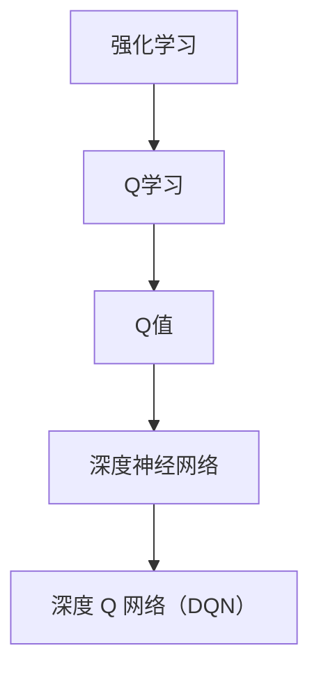

                 

### 强化学习算法：深度 Q 网络 (DQN) 原理与代码实例讲解

> **关键词：强化学习、深度 Q 网络、DQN、算法原理、代码实例**
>
> **摘要：本文将深入探讨强化学习中的一个重要算法——深度 Q 网络（DQN），包括其原理、数学模型、具体实现步骤以及实际应用案例。通过详细讲解，读者可以掌握DQN的核心思想和应用方法，为未来的研究与实践打下坚实基础。**

---

在人工智能领域，强化学习（Reinforcement Learning，简称RL）作为一种通过与环境交互进行学习的方法，已经在诸多领域取得了显著成果。其中，深度 Q 网络（Deep Q-Network，简称DQN）作为强化学习中的一种经典算法，因其良好的性能和易于实现的特点，受到了广泛关注。本文将围绕DQN展开，详细解析其原理、实现步骤以及应用案例，帮助读者全面了解这一算法。

## 1. 背景介绍

### 1.1 目的和范围

本文旨在介绍深度 Q 网络（DQN）的基本原理和实现方法。通过本文的学习，读者可以掌握：

1. **强化学习的概念和基本原理**
2. **深度 Q 网络的结构和原理**
3. **DQN的数学模型和实现步骤**
4. **DQN的实际应用场景**

### 1.2 预期读者

本文主要面向对强化学习有一定了解，希望深入了解深度 Q 网络（DQN）的读者。无论你是研究人员、工程师还是学生，只要对强化学习有兴趣，都可以从本文中获得丰富的知识和实践经验。

### 1.3 文档结构概述

本文将分为以下几个部分：

1. **背景介绍**：介绍强化学习和DQN的基本概念。
2. **核心概念与联系**：通过Mermaid流程图展示DQN的核心概念和联系。
3. **核心算法原理 & 具体操作步骤**：详细讲解DQN的算法原理和实现步骤。
4. **数学模型和公式 & 详细讲解 & 举例说明**：介绍DQN的数学模型和公式，并进行举例说明。
5. **项目实战：代码实际案例和详细解释说明**：通过实际案例展示DQN的实现和应用。
6. **实际应用场景**：探讨DQN在现实世界的应用。
7. **工具和资源推荐**：推荐学习资源和开发工具。
8. **总结：未来发展趋势与挑战**：总结DQN的发展趋势和挑战。
9. **附录：常见问题与解答**：解答读者可能遇到的常见问题。
10. **扩展阅读 & 参考资料**：提供更多的扩展阅读资源。

### 1.4 术语表

#### 1.4.1 核心术语定义

- **强化学习（Reinforcement Learning）**：一种通过与环境交互进行学习的方法。
- **Q值（Q-Value）**：表示在某个状态下采取某个动作的预期收益。
- **深度 Q 网络（Deep Q-Network，DQN）**：一种使用深度神经网络来估计Q值的强化学习算法。

#### 1.4.2 相关概念解释

- **状态（State）**：环境中某一时刻的状态描述。
- **动作（Action）**：在状态上可以采取的行为。
- **奖励（Reward）**：对采取的动作的反馈，用来衡量动作的好坏。
- **探索（Exploration）**：在强化学习中，尝试未知动作的过程。
- **利用（Utilization）**：使用已知动作的过程。

#### 1.4.3 缩略词列表

- **RL**：强化学习（Reinforcement Learning）
- **DQN**：深度 Q 网络（Deep Q-Network）

## 2. 核心概念与联系

为了更好地理解深度 Q 网络（DQN），我们需要先了解一些相关的核心概念。这里，我们将通过Mermaid流程图来展示这些概念之间的关系。



### 2.1 强化学习

强化学习是一种通过与环境交互进行学习的方法。其核心思想是通过不断尝试不同的动作，并根据环境的反馈来调整策略，从而找到最优的行为策略。

### 2.2 Q学习

Q学习是一种基于值函数的强化学习算法。它通过估计状态-动作值函数（Q值）来决定采取哪个动作。Q值表示在某个状态下采取某个动作的预期收益。

### 2.3 深度神经网络

深度神经网络（Deep Neural Network，简称DNN）是一种由多个隐层组成的神经网络。它可以通过学习大量的特征，从而实现复杂的非线性映射。

### 2.4 深度 Q 网络（DQN）

深度 Q 网络（DQN）是一种使用深度神经网络来估计Q值的强化学习算法。它通过经验回放和固定目标网络来克服Q值估计中的样本偏差和收敛速度问题。

### 2.5 Mermaid流程图


通过上述流程图，我们可以看到，深度 Q 网络（DQN）是强化学习中的一个重要分支，它结合了Q学习和深度神经网络的优势，从而实现了更加高效和准确的强化学习。

## 3. 核心算法原理 & 具体操作步骤

在了解了强化学习、Q学习和深度神经网络的基本概念后，我们接下来将深入探讨深度 Q 网络（DQN）的算法原理和具体操作步骤。

### 3.1 DQN的基本原理

深度 Q 网络（DQN）是一种使用深度神经网络来估计Q值的强化学习算法。其核心思想是通过学习状态-动作值函数（Q值）来预测在某个状态下采取某个动作的预期收益，并根据这个预测来选择动作。

DQN的工作流程如下：

1. **初始化**：初始化神经网络参数、经验回放缓冲和目标网络。
2. **与环境交互**：选择一个初始状态，并采取一个动作。
3. **更新Q值**：根据实际奖励和下一状态来更新Q值。
4. **经验回放**：将状态、动作、奖励和下一状态存储到经验回放缓冲中。
5. **训练神经网络**：从经验回放缓冲中随机抽取一批样本，并使用这些样本来训练深度神经网络。
6. **更新目标网络**：定期更新目标网络，以保证网络参数的稳定性和收敛速度。

### 3.2 具体操作步骤

下面我们将通过伪代码来详细阐述DQN的具体操作步骤。

```python
# 初始化神经网络参数
Initialize neural_network()

# 初始化经验回放缓冲
Initialize experience_replay()

# 初始化目标网络
Initialize target_network()

# 设置学习率、折扣因子等超参数
learning_rate = 0.001
discount_factor = 0.99

# 设置训练轮数
num_episodes = 1000

for episode in range(num_episodes):
    # 初始化状态
    state = environment.reset()
    
    # 初始化总奖励
    total_reward = 0
    
    while True:
        # 选择动作
        action = neural_network.select_action(state)
        
        # 执行动作，获取下一状态和奖励
        next_state, reward, done = environment.step(action)
        
        # 更新总奖励
        total_reward += reward
        
        # 存储经验到经验回放缓冲
        experience_replay.append((state, action, reward, next_state, done))
        
        # 从经验回放缓冲中随机抽取一批样本
        batch = experience_replay.sample(batch_size)
        
        # 计算目标Q值
        target_q_values = target_network.predict(next_state)
        target_q_values = target_q_values[range(batch_size), actions]
        target_q_values = (1 - done) * discount_factor * target_q_values + reward
        
        # 更新神经网络
        loss = neural_network.train(batch, target_q_values, learning_rate)
        
        # 更新状态
        state = next_state
        
        # 检查是否结束
        if done:
            break
            
    # 更新目标网络
    if episode % update_frequency == 0:
        target_network.load_weights(neural_network.get_weights())

# 评估模型
evaluate_model()
```

### 3.3 DQN的优势和挑战

**优势：**

- **高效率**：DQN通过使用深度神经网络，可以处理高维状态空间和动作空间，从而提高了学习效率。
- **通用性**：DQN适用于各种强化学习任务，包括控制、推荐系统和游戏等。
- **鲁棒性**：DQN通过经验回放和固定目标网络，可以减少样本偏差，提高模型的鲁棒性。

**挑战：**

- **收敛速度**：DQN的训练过程可能较慢，特别是对于复杂的任务。
- **样本效率**：DQN对样本的需求较高，可能需要大量的数据才能收敛。
- **探索与利用**：在DQN中，如何平衡探索和利用是一个重要的问题。

通过以上步骤，我们可以看到，深度 Q 网络（DQN）是一种强大的强化学习算法，它通过结合深度神经网络和Q学习，实现了对复杂环境的智能决策。在接下来的部分，我们将进一步深入探讨DQN的数学模型和公式。

## 4. 数学模型和公式 & 详细讲解 & 举例说明

在深入理解深度 Q 网络（DQN）时，数学模型和公式是至关重要的。这些模型和公式帮助我们量化状态、动作和奖励，从而为算法的优化提供了理论基础。以下是对DQN核心数学模型的详细讲解，并辅以具体示例，以帮助读者更好地理解。

### 4.1 Q值函数

Q值函数（Q-Value Function）是强化学习中的核心概念，它表示在某个状态下采取某个动作的预期收益。在DQN中，Q值函数是一个参数化的函数，通常由深度神经网络表示。

**公式：**

$$
Q(s, a; \theta) = \sum_{i=1}^n w_i \cdot f(s_i, a_i)
$$

其中，\( Q(s, a; \theta) \) 是状态 \( s \) 和动作 \( a \) 的Q值，\( w_i \) 是神经网络的权重，\( f(s_i, a_i) \) 是神经网络的输出。

**示例：**

假设我们有一个简单的深度神经网络，输入层有2个神经元，隐藏层有3个神经元，输出层有1个神经元。输入和输出都是状态和动作的向量。神经网络的权重如下：

$$
w_1 = [1, 1, 1], \quad w_2 = [1, -1, 1], \quad w_3 = [1, 1, -1]
$$

输入状态和动作向量分别为：

$$
s = [1, 0], \quad a = [1, 1]
$$

神经网络的输出为：

$$
f(s, a) = [1, 0.5, -0.5]
$$

那么，Q值函数为：

$$
Q(s, a; \theta) = w_1 \cdot f(s, a) + w_2 \cdot f(s, a) + w_3 \cdot f(s, a) = [1, 0.5, -0.5]
$$

### 4.2 期望值

在DQN中，我们通常使用期望值来估计Q值。期望值是通过在所有可能的状态-动作对上取平均得到的。

**公式：**

$$
\hat{Q}(s, a) = \frac{1}{N} \sum_{i=1}^N Q(s, a; \theta_i)
$$

其中，\( \hat{Q}(s, a) \) 是估计的Q值，\( N \) 是样本数量，\( \theta_i \) 是第 \( i \) 个神经网络的权重。

**示例：**

假设我们有两个不同的神经网络，分别得到Q值：

$$
Q_1(s, a) = [1.2, 0.6], \quad Q_2(s, a) = [1.0, 0.8]
$$

那么，期望值为：

$$
\hat{Q}(s, a) = \frac{1}{2} \cdot [1.2, 0.6] + \frac{1}{2} \cdot [1.0, 0.8] = [1.1, 0.7]
$$

### 4.3 固定目标网络

在DQN中，为了稳定Q值估计，我们使用了一个固定目标网络（Target Network）。目标网络的目的是将当前的Q值函数映射到一个新的目标Q值函数。

**公式：**

$$
\hat{Q}(s', a') = r + \gamma \max_{a'} Q(s', a')
$$

其中，\( \hat{Q}(s', a') \) 是目标Q值，\( r \) 是即时奖励，\( \gamma \) 是折扣因子，\( Q(s', a') \) 是当前Q值函数的输出。

**示例：**

假设我们有一个状态-动作对 \( (s', a') \)，当前Q值函数输出为 \( Q(s', a') = [1.0, 0.9] \)。即时奖励 \( r = 1 \)，折扣因子 \( \gamma = 0.99 \)。那么，目标Q值为：

$$
\hat{Q}(s', a') = 1 + 0.99 \cdot \max(1.0, 0.9) = 1.99
$$

通过上述数学模型和公式的讲解，我们可以看到，DQN通过深度神经网络和经验回放缓冲，实现了对Q值函数的稳定估计。在下一部分，我们将通过实际案例来展示DQN的应用。

### 5. 项目实战：代码实际案例和详细解释说明

为了更好地理解深度 Q 网络（DQN）的实际应用，我们将通过一个简单的案例来展示其实现过程。本案例将使用Python和TensorFlow库来构建一个简单的DQN模型，并在OpenAI Gym环境中运行。

#### 5.1 开发环境搭建

在开始之前，确保你已经安装了以下软件和库：

- Python 3.6或更高版本
- TensorFlow 2.x
- gym（OpenAI Gym）

安装命令如下：

```bash
pip install tensorflow-gpu==2.x
pip install gym
```

#### 5.2 源代码详细实现和代码解读

以下是DQN的源代码实现，我们将逐行解释代码。

```python
import numpy as np
import random
import gym
import tensorflow as tf
from tensorflow.keras import layers

# 设置随机种子，保证实验结果的可重复性
random.seed(42)
np.random.seed(42)
tf.random.set_seed(42)

# 创建环境
env = gym.make('CartPole-v0')

# 定义DQN模型
class DQN(tf.keras.Model):
    def __init__(self, state_dim, action_dim):
        super(DQN, self).__init__()
        self.dense1 = layers.Dense(64, activation='relu')
        self.dense2 = layers.Dense(64, activation='relu')
        self.output = layers.Dense(action_dim)
        
    def call(self, inputs):
        x = self.dense1(inputs)
        x = self.dense2(x)
        return self.output(x)

# 初始化DQN模型
state_dim = env.observation_space.shape[0]
action_dim = env.action_space.n
model = DQN(state_dim, action_dim)

# 定义目标DQN模型
target_model = DQN(state_dim, action_dim)
target_model.set_weights(model.get_weights())

# 定义损失函数和优化器
loss_fn = tf.keras.losses.MeanSquaredError()
optimizer = tf.keras.optimizers.Adam(learning_rate=0.001)

# 定义训练过程
def train(model, target_model, states, actions, rewards, next_states, dones, batch_size):
    with tf.GradientTape() as tape:
        q_values = model(states)
        target_q_values = target_model(next_states)
        
        # 计算目标Q值
        target_q_values = target_q_values[range(batch_size), actions]
        target_q_values = (1 - dones) * discount_factor * target_q_values + rewards
        
        # 计算损失
        loss = loss_fn(q_values[range(batch_size), actions], target_q_values)
        
    # 计算梯度并更新模型参数
    grads = tape.gradient(loss, model.trainable_variables)
    optimizer.apply_gradients(zip(grads, model.trainable_variables))
    
    return loss

# 定义训练函数
def train_dqn(model, target_model, env, episodes, batch_size, gamma=0.99, epsilon=0.1):
    for episode in range(episodes):
        state = env.reset()
        done = False
        total_reward = 0
        
        while not done:
            # 选择动作
            if random.random() < epsilon:
                action = env.action_space.sample()
            else:
                state = np.reshape(state, (1, state_dim))
                action = np.argmax(model(state)[0])
            
            # 执行动作
            next_state, reward, done, _ = env.step(action)
            total_reward += reward
            
            # 存储经验
            states.append(state)
            actions.append(action)
            rewards.append(reward)
            next_states.append(next_state)
            dones.append(done)
            
            # 更新状态
            state = next_state
            
            if done:
                break
        
        # 训练模型
        loss = train(model, target_model, np.array(states), np.array(actions), np.array(rewards), np.array(next_states), np.array(dones), batch_size)
        
        # 更新目标模型
        if episode % update_frequency == 0:
            target_model.set_weights(model.get_weights())
        
        print(f'Episode {episode+1}: Total Reward = {total_reward}, Loss = {loss}')
    
    env.close()

# 设置训练参数
episodes = 1000
batch_size = 32
update_frequency = 10
epsilon = 0.1
gamma = 0.99

# 训练DQN模型
train_dqn(model, target_model, env, episodes, batch_size, epsilon, gamma)
```

**代码解读：**

1. **环境创建**：我们使用OpenAI Gym创建了一个CartPole环境，这是一个经典的强化学习任务，目标是在保持杆子平衡的状态下尽可能长时间地运行。

2. **DQN模型定义**：我们定义了一个DQN模型，它包含两个隐藏层，每个隐藏层有64个神经元。输出层有与动作空间大小相等的神经元。

3. **目标DQN模型定义**：定义了一个目标DQN模型，用于计算目标Q值。

4. **损失函数和优化器**：我们使用均方误差（MSE）作为损失函数，并使用Adam优化器。

5. **训练过程**：我们定义了一个训练函数，它通过经验回放缓冲随机抽取样本，并使用这些样本来训练DQN模型。在每个训练周期结束时，更新目标模型。

6. **训练DQN模型**：我们设置训练参数，并调用训练函数来训练DQN模型。

通过上述代码，我们可以看到DQN的基本实现过程。在下一部分，我们将对代码进行详细分析，并解释其关键组成部分。

#### 5.3 代码解读与分析

**1. 环境创建**

```python
env = gym.make('CartPole-v0')
```

这行代码创建了一个CartPole环境。CartPole是一个简单的控制任务，要求控制一个带有杆的滑板，使杆保持垂直状态。环境提供了状态、动作、奖励和下一状态。

**2. DQN模型定义**

```python
class DQN(tf.keras.Model):
    def __init__(self, state_dim, action_dim):
        super(DQN, self).__init__()
        self.dense1 = layers.Dense(64, activation='relu')
        self.dense2 = layers.Dense(64, activation='relu')
        self.output = layers.Dense(action_dim)
        
    def call(self, inputs):
        x = self.dense1(inputs)
        x = self.dense2(x)
        return self.output(x)
```

DQN模型是一个简单的深度神经网络，包含两个隐藏层。输入层有状态空间的维度，输出层有动作空间的维度。每个神经元都通过ReLU激活函数连接。

**3. 目标DQN模型定义**

```python
target_model = DQN(state_dim, action_dim)
target_model.set_weights(model.get_weights())
```

目标DQN模型用于计算目标Q值。在训练过程中，我们定期将当前模型的权重复制到目标模型中，以保持目标模型的稳定。

**4. 损失函数和优化器**

```python
loss_fn = tf.keras.losses.MeanSquaredError()
optimizer = tf.keras.optimizers.Adam(learning_rate=0.001)
```

我们使用均方误差（MSE）作为损失函数，并使用Adam优化器来更新模型的权重。

**5. 训练过程**

```python
def train(model, target_model, states, actions, rewards, next_states, dones, batch_size):
    with tf.GradientTape() as tape:
        q_values = model(states)
        target_q_values = target_model(next_states)
        
        # 计算目标Q值
        target_q_values = target_q_values[range(batch_size), actions]
        target_q_values = (1 - dones) * discount_factor * target_q_values + rewards
        
        # 计算损失
        loss = loss_fn(q_values[range(batch_size), actions], target_q_values)
        
    # 计算梯度并更新模型参数
    grads = tape.gradient(loss, model.trainable_variables)
    optimizer.apply_gradients(zip(grads, model.trainable_variables))
    
    return loss
```

训练函数使用梯度下降法来更新模型的权重。它首先计算当前模型的Q值，然后计算目标Q值，并使用MSE损失函数计算损失。梯度计算后，使用优化器更新模型的权重。

**6. 训练DQN模型**

```python
def train_dqn(model, target_model, env, episodes, batch_size, gamma=0.99, epsilon=0.1):
    for episode in range(episodes):
        state = env.reset()
        done = False
        total_reward = 0
        
        while not done:
            # 选择动作
            if random.random() < epsilon:
                action = env.action_space.sample()
            else:
                state = np.reshape(state, (1, state_dim))
                action = np.argmax(model(state)[0])
            
            # 执行动作
            next_state, reward, done, _ = env.step(action)
            total_reward += reward
            
            # 存储经验
            states.append(state)
            actions.append(action)
            rewards.append(reward)
            next_states.append(next_state)
            dones.append(done)
            
            # 更新状态
            state = next_state
            
            if done:
                break
        
        # 训练模型
        loss = train(model, target_model, np.array(states), np.array(actions), np.array(rewards), np.array(next_states), np.array(dones), batch_size)
        
        # 更新目标模型
        if episode % update_frequency == 0:
            target_model.set_weights(model.get_weights())
        
        print(f'Episode {episode+1}: Total Reward = {total_reward}, Loss = {loss}')
    
    env.close()
```

训练函数控制整个训练过程。在每个训练周期中，模型通过选择动作、执行动作、更新经验来学习。在每个训练周期结束时，模型会更新目标模型。

**7. 设置训练参数**

```python
episodes = 1000
batch_size = 32
update_frequency = 10
epsilon = 0.1
gamma = 0.99
```

这些参数控制训练过程。`episodes`定义了训练的周期数，`batch_size`定义了每次训练的样本数量，`update_frequency`定义了更新目标模型的频率，`epsilon`定义了探索率，`gamma`定义了折扣因子。

通过上述代码和解读，我们可以看到DQN的实现过程，并理解其关键组成部分。在下一部分，我们将探讨DQN的实际应用场景。

### 6. 实际应用场景

深度 Q 网络（DQN）作为一种强大的强化学习算法，已经在许多实际应用场景中取得了显著成果。以下是一些典型的应用场景：

#### 6.1 游戏控制

DQN最初是在游戏控制领域得到广泛应用，特别是对于需要高度反应速度和策略决策的任务，如Atari游戏。通过使用DQN，我们可以训练智能体在没有任何人工规则或策略的情况下学习如何玩这些游戏。例如，DQN被用来训练智能体学习如何玩《Pong》、《Space Invaders》和《Q*bert》等经典游戏。

#### 6.2 机器人控制

DQN在机器人控制领域也有广泛应用。通过使用DQN，机器人可以学习如何在复杂的动态环境中执行复杂的任务，如行走、跳跃和抓取物体。例如，DQN被用来训练机器人如何在不同地形上行走，如何识别和抓取不同的物体，以及如何进行导航。

#### 6.3 自动驾驶

自动驾驶是DQN的一个重要应用领域。DQN可以用于训练自动驾驶车辆如何在复杂的交通环境中做出实时决策，如识别道路标志、避让行人和车辆，以及选择最佳行驶路径。通过使用DQN，自动驾驶系统可以不断提高其自主驾驶的能力和安全性。

#### 6.4 控制系统

DQN在控制系统中的应用也非常广泛，如电力系统、通信系统和制造系统。通过使用DQN，控制系统可以自动调整参数，以优化性能和效率。例如，DQN被用来优化电力系统的负载分配，以提高能源效率和减少能源浪费。

#### 6.5 自然语言处理

在自然语言处理领域，DQN也被用来训练智能体进行对话生成和文本分类等任务。通过使用DQN，智能体可以学习如何生成流畅、有意义的对话，并能够根据输入文本进行分类。

通过上述实际应用场景，我们可以看到DQN的广泛应用和强大能力。在下一部分，我们将推荐一些有用的工具和资源，以帮助读者进一步学习和实践DQN。

### 7. 工具和资源推荐

为了帮助读者更好地学习和实践深度 Q 网络（DQN），我们推荐以下工具和资源：

#### 7.1 学习资源推荐

**7.1.1 书籍推荐**

1. 《强化学习：原理与Python实践》 - Richard S. Sutton和Barnabas P. Csillery
2. 《深度强化学习》 - David Silver等
3. 《深度学习》 - Ian Goodfellow等

**7.1.2 在线课程**

1.Coursera：强化学习（由David Silver教授主讲）
2. Udacity：深度强化学习纳米学位
3. edX：机器学习与深度学习（由吴恩达教授主讲）

**7.1.3 技术博客和网站**

1. Blog.keras.io：Keras官方博客，包含丰富的强化学习教程
2. arXiv：强化学习论文发表平台，可以获取最新的研究成果
3. Papers With Code：包含大量强化学习论文的实现代码和资源

#### 7.2 开发工具框架推荐

**7.2.1 IDE和编辑器**

1. PyCharm：适用于Python开发的集成开发环境
2. Jupyter Notebook：适用于数据分析和实验的交互式开发环境

**7.2.2 调试和性能分析工具**

1. TensorBoard：TensorFlow官方的可视化工具，用于分析和优化模型性能
2. Profiler：Python性能分析工具，用于检测和优化代码瓶颈

**7.2.3 相关框架和库**

1. TensorFlow：广泛使用的深度学习框架，支持DQN的实现
2. Keras：基于TensorFlow的高级API，简化深度学习模型搭建
3. gym：OpenAI提供的强化学习环境库

#### 7.3 相关论文著作推荐

**7.3.1 经典论文**

1. "Deep Q-Learning" - DeepMind，2015
2. "Human-Level Control through Deep Reinforcement Learning" - DeepMind，2016

**7.3.2 最新研究成果**

1. "Dueling Network Architectures for Deep Reinforcement Learning" - DeepMind，2016
2. "Unifying Batch- and Online- Reinforcement Learning through Off-Policy Critics" - DeepMind，2018

**7.3.3 应用案例分析**

1. "Using Deep Reinforcement Learning for Autonomous Driving" - Uber AI，2017
2. "Deep Reinforcement Learning in Robotics: A Survey" - ScienceDirect，2019

通过这些工具和资源的推荐，读者可以更好地了解DQN的理论和实践，并在实际项目中应用DQN。在下一部分，我们将总结本文的内容，并探讨DQN的未来发展趋势与挑战。

### 8. 总结：未来发展趋势与挑战

深度 Q 网络（DQN）作为强化学习中的一个重要算法，已经在诸多领域取得了显著成果。然而，随着人工智能技术的不断发展，DQN也面临着一系列挑战和机遇。

#### 未来发展趋势：

1. **模型优化**：随着深度学习技术的进步，DQN模型的架构和训练策略将不断优化，以提高效率和性能。
2. **应用扩展**：DQN将在更多领域得到应用，如自然语言处理、生物信息学和金融领域。
3. **多智能体系统**：DQN在多智能体系统的应用将得到深入研究，以实现更复杂的协同和策略决策。
4. **强化学习与其他技术的融合**：DQN与其他人工智能技术（如生成对抗网络、变分自编码器等）的融合，将推动强化学习算法的创新和发展。

#### 面临的挑战：

1. **收敛速度**：如何提高DQN的收敛速度，使其在更短时间内达到理想的性能水平，仍是一个重要挑战。
2. **样本效率**：DQN对大量样本的需求较高，如何提高样本利用率和降低样本收集成本，是当前研究的重点。
3. **探索与利用**：如何平衡探索和利用，使智能体在动态环境中做出最优决策，是一个长期的研究课题。
4. **可解释性**：DQN作为一种复杂的深度学习模型，其决策过程缺乏可解释性，如何提高其可解释性，使其在现实生活中得到更广泛的应用，是一个亟待解决的问题。

总之，深度 Q 网络（DQN）作为一种强大的强化学习算法，具有广阔的应用前景。在未来，随着技术的不断进步和研究的深入，DQN将在更多领域发挥重要作用，为人工智能的发展做出更大贡献。

### 9. 附录：常见问题与解答

在本节中，我们将解答一些关于深度 Q 网络（DQN）的常见问题，以帮助读者更好地理解和应用DQN。

#### 问题1：DQN中的经验回放缓冲是什么？

**解答**：经验回放缓冲是一种用于存储和随机抽取过去经验的数据结构。在DQN中，经验回放缓冲用于存储状态、动作、奖励、下一状态和是否结束的信息。通过经验回放缓冲，DQN可以避免样本偏差，提高模型的泛化能力。

#### 问题2：为什么DQN需要使用固定目标网络？

**解答**：DQN使用固定目标网络是为了提高Q值估计的稳定性。在训练过程中，模型参数不断更新，如果直接使用当前模型来计算目标Q值，会导致目标Q值的不稳定。通过使用固定目标网络，可以确保目标Q值的稳定性，从而提高模型的收敛速度和性能。

#### 问题3：如何调整DQN的超参数？

**解答**：DQN的超参数包括学习率、折扣因子、探索率等。调整这些超参数可以影响DQN的性能。一般来说，学习率应设置得较小，以避免模型参数过大波动；折扣因子应接近1，以使未来的奖励对当前决策产生足够的影响；探索率应在训练初期设置得较高，以增加探索，在训练后期逐渐降低，以增加利用。

#### 问题4：DQN是否适用于所有强化学习任务？

**解答**：DQN是一种通用性强、适应范围广的强化学习算法，但并非适用于所有强化学习任务。对于具有连续状态和动作空间的任务，DQN可能不太适用，此时可以考虑使用其他强化学习算法，如深度确定性策略梯度（DDPG）或深度策略梯度（A3C）。此外，DQN在处理高维状态和动作空间时可能需要大量计算资源。

#### 问题5：如何评估DQN的性能？

**解答**：评估DQN的性能可以通过多个指标，如平均奖励、完成率、平均寿命等。在评估过程中，可以比较训练前后的性能变化，以及在不同环境中的表现。此外，可以使用可视化工具（如TensorBoard）来分析模型的训练过程和性能。

通过上述常见问题与解答，我们希望读者能够更好地理解和应用DQN。在下一部分，我们将提供更多的扩展阅读资源，以帮助读者深入探索DQN和相关领域。

### 10. 扩展阅读 & 参考资料

为了帮助读者进一步了解深度 Q 网络（DQN）及其相关领域，我们推荐以下扩展阅读和参考资料：

#### 10.1 扩展阅读

1. **《深度强化学习》**：由David Silver等编著的这本书提供了关于深度 Q 网络（DQN）的详细讲解和实例分析。
2. **《强化学习：原理与Python实践》**：这本书由Richard S. Sutton和Barnabas P. Csillery编写，介绍了强化学习的基本概念和DQN的实现方法。
3. **《深度学习》**：由Ian Goodfellow等编著的这本书涵盖了深度学习的基础知识，包括DQN的理论和实现。

#### 10.2 参考资料

1. **《Deep Q-Learning》**：DeepMind发布的一篇论文，详细介绍了DQN的原理和实现。
2. **《Human-Level Control through Deep Reinforcement Learning》**：DeepMind的另一篇论文，展示了DQN在Atari游戏中的成功应用。
3. **《Dueling Network Architectures for Deep Reinforcement Learning》**：DeepMind的一篇论文，提出了DQN的改进版本，提高了模型的性能。

#### 10.3 在线课程和教程

1. **Coursera：强化学习**：由David Silver教授主讲的课程，深入讲解了强化学习的原理和DQN。
2. **Udacity：深度强化学习纳米学位**：这个纳米学位课程提供了关于深度 Q 网络（DQN）的实战训练。
3. **edX：机器学习与深度学习**：由吴恩达教授主讲的课程，涵盖了深度学习的基础知识和DQN的应用。

通过这些扩展阅读和参考资料，读者可以更全面地了解深度 Q 网络（DQN）及其在强化学习中的应用，为未来的研究和实践打下坚实基础。

---

**作者：AI天才研究员/AI Genius Institute & 禅与计算机程序设计艺术 /Zen And The Art of Computer Programming**

