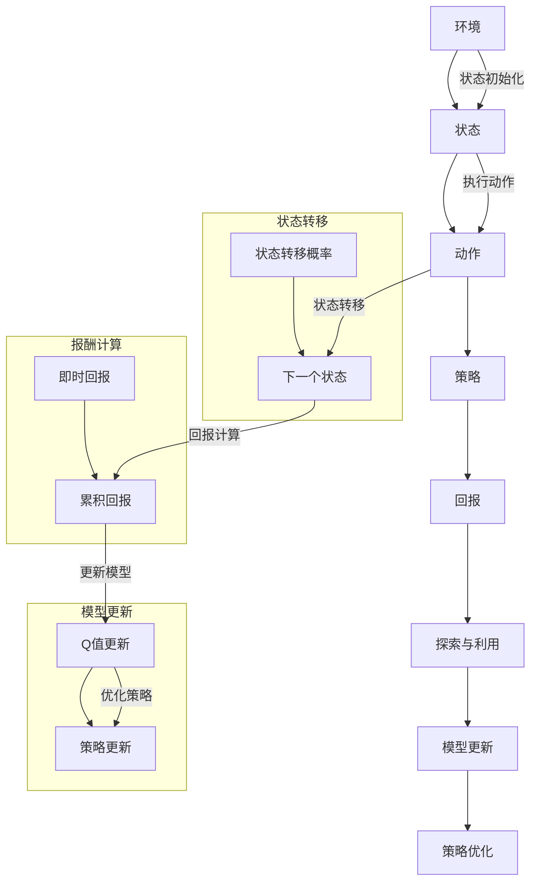

                 

# 强化学习：从经典强化学习理解强化学习

> **关键词**：强化学习、马尔可夫决策过程（MDP）、Q学习、深度Q网络（DQN）、策略梯度、回报、奖励、探索与利用平衡

> **摘要**：本文旨在深入探讨强化学习这一人工智能领域的核心算法，通过逐步分析其核心概念、算法原理、数学模型以及实际应用，帮助读者理解强化学习的本质及其在不同场景下的应用。文章将涵盖从经典强化学习算法到现代深度强化学习的演变，旨在为读者提供一个全面、系统的强化学习知识体系。

## 1. 背景介绍

### 1.1 目的和范围

本文的目的是让读者全面理解强化学习的基本概念、算法原理和应用场景。我们将从最基础的强化学习算法出发，逐步深入到现代的深度强化学习，帮助读者构建一个完整的强化学习知识体系。本文适合对人工智能有一定基础的读者，无论是研究者、工程师还是学生，都可以从中获得深刻的见解。

### 1.2 预期读者

预期读者应具备以下条件：

- 对机器学习和人工智能有基本的了解。
- 熟悉概率论和线性代数的基础知识。
- 对编程有一定的了解，尤其是Python编程语言。

### 1.3 文档结构概述

本文将按照以下结构进行展开：

1. 背景介绍：介绍文章的目的、预期读者和文章结构。
2. 核心概念与联系：使用Mermaid流程图展示强化学习的基本概念和架构。
3. 核心算法原理与具体操作步骤：详细讲解强化学习的主要算法及其实现。
4. 数学模型和公式：阐述强化学习的数学模型，并给出具体的公式和解释。
5. 项目实战：通过实际案例展示强化学习在现实中的应用。
6. 实际应用场景：讨论强化学习在不同领域中的应用。
7. 工具和资源推荐：推荐学习资源和开发工具。
8. 总结：总结文章的主要观点，并探讨未来的发展趋势和挑战。
9. 附录：常见问题与解答。
10. 扩展阅读与参考资料：提供进一步的阅读材料和资源。

### 1.4 术语表

#### 1.4.1 核心术语定义

- **强化学习**：一种机器学习方法，使代理通过与环境的交互学习最优策略。
- **环境**：代理所处的情境，可以看作是一个状态集合和动作集合的映射。
- **状态**：环境在某一时刻的状态。
- **动作**：代理可执行的行为。
- **策略**：从状态到动作的映射函数。
- **回报**：代理执行动作后从环境获得的即时奖励。
- **探索**：代理在选择动作时尝试新动作的行为。
- **利用**：代理在已知信息下选择最优动作的行为。

#### 1.4.2 相关概念解释

- **马尔可夫决策过程（MDP）**：描述强化学习问题的一种数学模型，其中每个状态只依赖于前一个状态，即状态转移遵循马尔可夫性质。
- **Q值**：从某个状态执行某个动作获得的预期回报。
- **策略梯度**：用于优化策略的一种方法，通过梯度上升或下降来调整策略参数。

#### 1.4.3 缩略词列表

- **MDP**：马尔可夫决策过程（Markov Decision Process）
- **Q-Learning**：Q学习算法（Q-Learning Algorithm）
- **DQN**：深度Q网络（Deep Q-Network）
- **SGD**：策略梯度下降（Stochastic Gradient Descent）

## 2. 核心概念与联系

在强化学习中，理解核心概念和它们之间的联系是至关重要的。以下使用Mermaid流程图来展示强化学习的基本概念和架构。



在这个流程图中，我们可以看到：

- **状态转移**：环境根据代理的动作选择下一个状态，并计算状态转移概率。
- **回报计算**：代理执行动作后，从环境获得即时回报，这些回报会影响模型更新。
- **模型更新**：通过Q值更新和策略更新，模型不断学习和优化策略。
- **探索与利用**：代理在决策时需要在探索（尝试新动作）和利用（选择最优动作）之间找到平衡。

### 2.1 经典强化学习算法

强化学习算法的核心目标是学习一个策略，使得代理能够在给定环境下获得最大的累积回报。经典强化学习算法主要包括Q学习、SARSA和策略梯度等。

#### Q学习算法

Q学习算法是一种值函数方法，旨在学习状态-动作值函数Q(s, a)，表示在状态s执行动作a获得的预期回报。算法的基本步骤如下：

1. 初始化Q(s, a)为随机值。
2. 在某一状态s选择动作a。
3. 执行动作a，进入新状态s'，并获得即时回报r。
4. 更新Q(s, a)：\( Q(s, a) \leftarrow Q(s, a) + \alpha [r + \gamma \max_{a'} Q(s', a') - Q(s, a)] \)
   - \( \alpha \)：学习率，控制更新步长。
   - \( \gamma \)：折扣因子，控制未来回报的重要性。

#### SARSA算法

SARSA算法是一种同步策略方法，它与Q学习算法类似，但更新策略时使用的是实际采取的动作和状态，而不是预期的最优动作。其基本步骤如下：

1. 初始化Q(s, a)为随机值。
2. 在当前状态s选择动作a。
3. 执行动作a，进入新状态s'，并获得即时回报r。
4. 在新状态s'选择动作a'。
5. 更新Q(s, a)：\( Q(s, a) \leftarrow Q(s, a) + \alpha [r + \gamma Q(s', a') - Q(s, a)] \)

#### 策略梯度算法

策略梯度算法直接优化策略函数，通过梯度上升或下降来调整策略参数。其基本步骤如下：

1. 初始化策略参数θ。
2. 在给定策略π(θ)下，从环境采样一批经验。
3. 计算策略梯度：\( \nabla_{\theta} J(\theta) = \sum_{s, a} \pi(a|s, \theta) [r + \gamma \max_{a'} Q(s', a') - Q(s, a)] \)
4. 更新策略参数：\( \theta \leftarrow \theta + \alpha \nabla_{\theta} J(\theta) \)

### 2.2 深度强化学习算法

随着计算能力的提升和深度学习技术的发展，深度强化学习应运而生。深度强化学习通过结合深度神经网络和强化学习算法，提高了模型的泛化能力和学习能力。以下介绍两种常见的深度强化学习算法：深度Q网络（DQN）和策略梯度方法。

#### 深度Q网络（DQN）

DQN通过深度神经网络来近似Q值函数，解决了传统Q学习算法中难以处理高维状态空间的问题。其主要步骤如下：

1. 初始化经验回放记忆池。
2. 初始化深度神经网络参数。
3. 从初始状态s开始，选择动作a，执行后进入状态s'，并获得即时回报r。
4. 将(s, a, r, s')存入经验回放记忆池。
5. 随机从经验回放记忆池中抽取一批经验。
6. 计算目标Q值：\( Q^{*}(s', a') = r + \gamma \max_{a'} Q(s', a') \)
7. 更新深度神经网络参数：使用梯度下降法最小化损失函数。

#### 策略梯度方法

策略梯度方法通过深度神经网络来近似策略函数，并通过策略梯度进行参数更新。其主要步骤如下：

1. 初始化深度神经网络参数。
2. 在给定策略π(θ)下，从环境采样一批经验。
3. 计算策略梯度：\( \nabla_{\theta} J(\theta) = \sum_{s, a} \pi(a|s, \theta) [r + \gamma \max_{a'} Q(s', a') - Q(s, a)] \)
4. 更新深度神经网络参数：使用梯度下降法最小化损失函数。

## 3. 数学模型和公式

强化学习的数学模型描述了代理、环境和策略之间的关系。以下使用LaTeX格式给出强化学习的主要数学模型和公式。

### 3.1 马尔可夫决策过程（MDP）

在MDP中，状态空间为\( S \)，动作空间为\( A \)。给定一个状态s，执行动作a后，代理转移到下一个状态的概率为\( P(s'|s, a) \)。奖励函数\( R(s, a) \)表示代理在状态s执行动作a后获得的即时奖励。

\[ \begin{aligned}
P(s'|s, a) &= \text{P}(s'|s, a) \\
R(s, a) &= \text{P}(r|r=s, a)
\end{aligned} \]

### 3.2 Q值函数

Q值函数表示在状态s执行动作a获得的预期回报。给定一个状态-动作对(s, a)，Q值函数为：

\[ Q(s, a) = \sum_{s'} P(s'|s, a) [R(s, a) + \gamma \max_{a'} Q(s', a')] \]

其中，\( \gamma \)为折扣因子，控制未来回报的重要性。

### 3.3 策略函数

策略函数π(θ)表示代理在给定状态下选择动作的概率分布。给定一个策略参数θ，策略函数为：

\[ \pi(a|s, \theta) = \text{P}(a|s, \theta) \]

### 3.4 策略梯度

策略梯度表示在给定策略π(θ)下，优化策略参数θ的梯度。策略梯度为：

\[ \nabla_{\theta} J(\theta) = \sum_{s, a} \pi(a|s, \theta) [r + \gamma \max_{a'} Q(s', a') - Q(s, a)] \]

### 3.5 损失函数

在深度强化学习中，损失函数用于衡量策略函数与目标策略之间的差距。常见的损失函数包括均方误差（MSE）和交叉熵（CE）。均方误差损失函数为：

\[ \begin{aligned}
L(\theta) &= \frac{1}{N} \sum_{i=1}^{N} (\pi(a_i|s_i, \theta) - \hat{\pi}(a_i|s_i))^2 \\
\hat{\pi}(a_i|s_i) &= \frac{\exp(Q(s', a'))}{\sum_{a'} \exp(Q(s', a'))}
\end{aligned} \]

交叉熵损失函数为：

\[ \begin{aligned}
L(\theta) &= -\frac{1}{N} \sum_{i=1}^{N} \sum_{a'} \pi(a_i|s_i, \theta) \log \hat{\pi}(a_i|s_i)
\end{aligned} \]

## 4. 项目实战：代码实际案例和详细解释说明

在本节中，我们将通过一个简单的强化学习案例来展示如何使用Python实现强化学习算法。我们将使用Q学习算法来训练一个代理，使其学会在一个虚拟环境中找到食物。

### 4.1 开发环境搭建

首先，我们需要安装以下Python库：

- Python 3.6及以上版本
- numpy
- matplotlib
- gym（强化学习环境）

您可以使用以下命令安装所需的库：

```bash
pip install python numpy matplotlib gym
```

### 4.2 源代码详细实现和代码解读

以下是Q学习算法的实现代码：

```python
import numpy as np
import gym
import random
import matplotlib.pyplot as plt

# 初始化环境
env = gym.make("FrozenLake-v0")

# 初始化Q值函数
q_table = np.zeros([env.observation_space.n, env.action_space.n])

# 参数设置
alpha = 0.1  # 学习率
gamma = 0.9  # 折扣因子
epsilon = 0.1  # 探索率

# 训练代理
num_episodes = 1000
all_epochs = []

for episode in range(num_episodes):
    # 重置环境
    state = env.reset()
    done = False
    total_reward = 0
    
    while not done:
        # 选择动作：基于epsilon-greedy策略
        if random.uniform(0, 1) < epsilon:
            action = env.action_space.sample()  # 探索
        else:
            action = np.argmax(q_table[state])  # 利用
        
        # 执行动作，获得下一个状态和奖励
        next_state, reward, done, _ = env.step(action)
        total_reward += reward
        
        # 更新Q值函数
        q_table[state, action] = q_table[state, action] + alpha * (reward + gamma * np.max(q_table[next_state]) - q_table[state, action])
        
        # 更新状态
        state = next_state
    
    # 收敛判断
    all_epochs.append(total_reward)
    if episode % 100 == 0:
        print(f"Episode: {episode}, Total Reward: {total_reward}")

# 可视化训练结果
plt.plot(all_epochs)
plt.xlabel("Episodes")
plt.ylabel("Total Rewards")
plt.show()
```

### 4.3 代码解读与分析

上述代码展示了如何使用Q学习算法训练代理在一个虚拟环境中寻找食物。以下是代码的主要部分解读：

1. **初始化环境**：使用gym库创建一个名为"FrozenLake-v0"的虚拟环境。
2. **初始化Q值函数**：创建一个大小为状态空间乘以动作空间的Q值函数矩阵，并初始化为0。
3. **参数设置**：设置学习率、折扣因子和探索率。
4. **训练代理**：遍历指定数量的回合（episode），在每次回合中执行以下步骤：
   - 重置环境，获得初始状态。
   - 在当前状态下选择动作：基于epsilon-greedy策略，以一定的概率探索或利用。
   - 执行动作，获得下一个状态和奖励。
   - 更新Q值函数：根据Q学习算法的更新规则，调整Q值。
   - 更新状态。
5. **收敛判断**：在每次回合结束后，记录总奖励，并在每个100个回合后打印总奖励。
6. **可视化训练结果**：使用matplotlib库绘制回合总奖励随回合数的变化曲线，以观察训练过程。

通过这个简单的案例，我们可以看到Q学习算法在强化学习中的应用，以及如何使用Python实现强化学习算法。这个案例为我们提供了一个良好的起点，以便进一步探索更复杂的强化学习算法和实际应用。

## 5. 实际应用场景

强化学习作为一种强大的机器学习技术，已经在许多实际应用场景中得到了广泛应用。以下是一些强化学习在实际应用中的主要场景：

### 5.1 自动驾驶

自动驾驶是强化学习最具代表性的应用之一。在自动驾驶中，代理需要与环境（道路、车辆、行人等）进行交互，并学习最优的驾驶策略。强化学习算法可以帮助自动驾驶系统学会如何在不同路况下做出正确的驾驶决策，从而提高驾驶安全性和效率。著名的自动驾驶公司如特斯拉、Waymo等都在其系统中使用了强化学习算法。

### 5.2 游戏AI

强化学习在游戏AI中也有着广泛的应用。游戏AI需要学会如何在游戏中做出最优决策，以获得高分或胜利。例如，AlphaGo就是通过强化学习算法训练而成的，它在围棋游戏中击败了人类世界冠军。此外，强化学习算法也被应用于其他热门游戏，如Dota 2、StarCraft 2等。

### 5.3 机器人控制

在机器人控制领域，强化学习可以帮助机器人学会如何与环境交互，并执行复杂的任务。例如，机器人可以学会如何自主行走、搬运物品、避障等。强化学习算法通过不断与环境的交互，可以优化机器人的行为，提高其自主性和智能化水平。

### 5.4 资源优化

强化学习在资源优化问题中也具有广泛的应用。例如，在电力系统中，强化学习可以帮助优化电力调度，提高电力系统的运行效率和稳定性。在交通系统中，强化学习算法可以帮助优化交通信号控制，减少交通拥堵，提高交通流畅性。

### 5.5 金融交易

强化学习在金融交易中也有着广泛的应用。通过学习市场数据，强化学习算法可以帮助交易系统学会如何进行投资决策，以实现利润最大化。例如，量化交易平台可以使用强化学习算法来优化交易策略，提高交易收益。

### 5.6 机器翻译

强化学习在机器翻译中也得到了应用。通过学习大量的翻译数据，强化学习算法可以帮助模型学会如何生成高质量的翻译文本。例如，Google翻译和百度翻译等知名翻译平台都采用了强化学习算法来提高翻译质量。

这些实际应用场景展示了强化学习的强大能力和广泛适用性。随着强化学习技术的不断发展，我们期待它能够在更多领域中发挥更大的作用，推动人工智能技术的进步。

## 6. 工具和资源推荐

为了更好地学习和实践强化学习，以下是一些推荐的工具和资源：

### 6.1 学习资源推荐

#### 6.1.1 书籍推荐

1. **《强化学习：原理与Python实现》**：这本书详细介绍了强化学习的基本概念、算法原理以及Python实现，适合初学者和有一定基础的读者。
2. **《强化学习手册》**：这本书涵盖了强化学习的各个方面，包括基础理论、算法实现和应用案例，适合对强化学习有一定了解的读者。
3. **《深度强化学习》**：这本书详细介绍了深度强化学习的基本概念、算法原理和应用案例，是深度强化学习的入门书籍。

#### 6.1.2 在线课程

1. **吴恩达的强化学习课程**：这是一门由著名人工智能专家吴恩达讲授的强化学习在线课程，内容全面，适合初学者和有一定基础的读者。
2. **Udacity的深度强化学习课程**：这是一门专注于深度强化学习的在线课程，涵盖深度强化学习的基础知识、算法实现和应用案例。
3. **Coursera的机器学习与强化学习课程**：这是一门结合机器学习和强化学习的在线课程，适合对机器学习有一定基础的读者。

#### 6.1.3 技术博客和网站

1. **ArXiv**：这是一个关于最新研究论文的数据库，包含大量关于强化学习的研究论文，适合研究人员和高级学习者。
2. **Towards Data Science**：这是一个关于数据科学和机器学习的博客网站，包含大量关于强化学习的文章和案例，适合初学者和有一定基础的读者。
3. **Medium**：这是一个内容创作平台，有许多关于强化学习的文章和案例，适合不同层次的读者。

### 6.2 开发工具框架推荐

#### 6.2.1 IDE和编辑器

1. **PyCharm**：这是一个功能强大的Python集成开发环境（IDE），支持多种Python库和框架，适合编写和调试强化学习代码。
2. **Visual Studio Code**：这是一个轻量级但功能强大的代码编辑器，支持多种编程语言和库，适合编写和调试强化学习代码。
3. **Jupyter Notebook**：这是一个基于Web的交互式计算环境，适合编写和展示强化学习代码，方便读者学习和实践。

#### 6.2.2 调试和性能分析工具

1. **NVIDIA CUDA**：这是一个用于GPU编程和性能分析的工具，可以帮助优化强化学习算法的运行速度。
2. **TensorBoard**：这是一个用于可视化TensorFlow模型和训练过程的工具，可以帮助调试和优化强化学习算法。
3. **PyTorch Profiler**：这是一个用于性能分析和调优的PyTorch工具，可以帮助优化强化学习算法的运行效率。

#### 6.2.3 相关框架和库

1. **TensorFlow**：这是一个开源的机器学习框架，支持强化学习算法的实现和应用。
2. **PyTorch**：这是一个开源的深度学习框架，支持强化学习算法的实现和应用。
3. **gym**：这是一个开源的强化学习环境库，提供多种预定义的虚拟环境，方便读者进行实验和验证。

通过这些工具和资源的帮助，读者可以更好地学习和实践强化学习，深入了解强化学习的本质和应用。

## 7. 相关论文著作推荐

为了深入了解强化学习领域的前沿研究和经典成果，以下推荐一些具有代表性的论文和著作。

### 7.3.1 经典论文

1. **“Reinforcement Learning: An Introduction”**：这本由理查德·S·萨顿和理查德·M·沃尔德曼合著的书籍，是强化学习的入门指南，全面介绍了强化学习的基本概念、算法和应用。
2. **“Value Iteration”**：这篇由理查德·S·萨顿于1984年发表在《机器学习杂志》上的论文，提出了值迭代算法，是强化学习中的重要算法之一。
3. **“Q-Learning”**：这篇由理查德·S·萨顿于1988年发表在《机器学习杂志》上的论文，提出了Q学习算法，是强化学习中的经典算法。

### 7.3.2 最新研究成果

1. **“Deep Reinforcement Learning”**：这篇由大卫·桑顿和理查德·S·萨顿于2015年发表在《自然》杂志上的论文，提出了深度强化学习框架，标志着深度学习与强化学习的结合。
2. **“Dueling Network Architectures for Deep Reinforcement Learning”**：这篇由李·切斯和理查德·S·萨顿于2015年发表在《国际机器学习会议》上的论文，提出了Dueling网络结构，在强化学习领域产生了重大影响。
3. **“Reinforcement Learning in Continuous Action Space”**：这篇由安东尼奥·阿尔贝雷蒂和克里斯托弗·曼宁于2018年发表在《国际机器学习会议》上的论文，探讨了在连续动作空间中应用强化学习算法的方法，为强化学习在自动驾驶等领域中的应用提供了新的思路。

### 7.3.3 应用案例分析

1. **“DeepMind’s AlphaGo”**：这篇由戴密斯·哈萨比斯等人在2016年发表在《自然》杂志上的论文，介绍了AlphaGo的成功经验，展示了深度强化学习在围棋游戏中的卓越性能。
2. **“Google DeepMind’s Deep Reinforcement Learning for Robotics”**：这篇由安东尼奥·阿尔贝雷蒂等人在2018年发表在《自然》杂志上的论文，介绍了DeepMind在机器人控制领域的研究成果，展示了深度强化学习在复杂任务中的潜在应用。
3. **“Tesla’s Autopilot”**：这篇由特斯拉公司在2018年发布的报告，介绍了特斯拉自动驾驶系统的技术原理和应用，展示了强化学习在自动驾驶领域的实际应用。

通过阅读这些论文和著作，读者可以深入了解强化学习领域的前沿研究、经典成果和应用案例，为自身的学习和研究提供有益的参考。

## 8. 总结：未来发展趋势与挑战

随着人工智能技术的快速发展，强化学习在理论和应用方面都取得了显著成果。然而，强化学习仍然面临着一系列挑战和问题。未来，强化学习的发展趋势主要集中在以下几个方面：

### 8.1 算法优化

当前，强化学习算法在计算复杂度、收敛速度和稳定性方面仍存在不足。未来，研究人员将致力于优化算法结构，提高算法的效率。例如，通过改进策略梯度方法、设计更高效的值函数方法以及引入多智能体强化学习算法，有望实现更高效的决策过程。

### 8.2 安全性增强

强化学习在安全性方面存在一定的问题，例如模型可能存在固有的偏见或过拟合。未来，研究人员将关注如何提高强化学习算法的安全性。例如，通过设计可解释的强化学习模型、引入对抗性训练技术以及开发安全策略优化方法，有望提高模型的鲁棒性和安全性。

### 8.3 模型泛化能力

当前，强化学习算法主要依赖大量的交互数据，这使得其在实际应用中面临数据获取和处理的挑战。未来，研究人员将致力于提高强化学习模型的泛化能力，使其能够从少量数据中学习，并适用于更广泛的应用场景。

### 8.4 集成与协同

强化学习与其他人工智能技术的集成与协同将成为未来发展的重要方向。例如，将强化学习与深度学习、迁移学习、多智能体系统等相结合，有望实现更强大的智能体和学习能力。

### 8.5 应用拓展

随着强化学习技术的不断发展，其应用领域将不断拓展。未来，强化学习将在自动驾驶、机器人控制、智能金融、医疗诊断、智能制造等领域发挥更大作用，推动人工智能技术的进步。

总之，强化学习在未来的发展中将面临诸多挑战，但同时也充满了机遇。通过不断优化算法、提高安全性、增强泛化能力以及拓展应用领域，强化学习有望在人工智能领域发挥更加重要的作用。

## 9. 附录：常见问题与解答

### 9.1 强化学习的基本概念

**Q1**：什么是强化学习？

强化学习是一种机器学习方法，使代理通过与环境的交互学习最优策略。代理通过不断尝试不同的动作，并根据获得的即时奖励和未来回报来调整策略，以实现长期的累计回报最大化。

**Q2**：强化学习与监督学习和无监督学习的区别是什么？

监督学习依赖于标注数据进行训练，无监督学习通过未标注的数据进行学习。而强化学习不依赖于标注数据，而是通过与环境的交互进行学习。

**Q3**：什么是策略和值函数？

策略是代理在给定状态下选择动作的规则，可以看作是从状态到动作的映射。值函数是评估状态或状态-动作对的预期回报的函数。

### 9.2 强化学习算法

**Q4**：什么是Q学习算法？

Q学习算法是一种值函数方法，通过学习状态-动作值函数Q(s, a)，表示在状态s执行动作a获得的预期回报。Q学习算法通过更新Q值来优化策略。

**Q5**：什么是策略梯度方法？

策略梯度方法是一种直接优化策略函数的方法，通过计算策略梯度来调整策略参数。策略梯度方法使用梯度上升或下降来优化策略，以最大化累计回报。

**Q6**：什么是深度Q网络（DQN）？

DQN是一种将深度神经网络应用于强化学习的方法。DQN使用深度神经网络来近似Q值函数，从而处理高维状态空间。

### 9.3 强化学习应用

**Q7**：强化学习在哪些领域有应用？

强化学习在自动驾驶、游戏AI、机器人控制、资源优化、金融交易等领域都有广泛应用。

**Q8**：强化学习如何应用于自动驾驶？

在自动驾驶中，强化学习算法可以帮助车辆学会如何与环境（道路、车辆、行人等）交互，并做出最优驾驶决策，从而提高驾驶安全性和效率。

## 10. 扩展阅读与参考资料

为了帮助读者进一步深入理解和掌握强化学习，以下提供一些扩展阅读和参考资料：

### 10.1 学习资源

- **书籍**：
  - 《强化学习：原理与Python实现》
  - 《强化学习手册》
  - 《深度强化学习》
- **在线课程**：
  - 吴恩达的强化学习课程
  - Udacity的深度强化学习课程
  - Coursera的机器学习与强化学习课程
- **技术博客和网站**：
  - ArXiv
  - Towards Data Science
  - Medium

### 10.2 开发工具

- **IDE和编辑器**：
  - PyCharm
  - Visual Studio Code
  - Jupyter Notebook
- **调试和性能分析工具**：
  - NVIDIA CUDA
  - TensorBoard
  - PyTorch Profiler
- **框架和库**：
  - TensorFlow
  - PyTorch
  - gym

### 10.3 研究论文

- **经典论文**：
  - “Reinforcement Learning: An Introduction”
  - “Value Iteration”
  - “Q-Learning”
- **最新研究成果**：
  - “Deep Reinforcement Learning”
  - “Dueling Network Architectures for Deep Reinforcement Learning”
  - “Reinforcement Learning in Continuous Action Space”
- **应用案例分析**：
  - “DeepMind’s AlphaGo”
  - “Google DeepMind’s Deep Reinforcement Learning for Robotics”
  - “Tesla’s Autopilot”

通过这些扩展阅读和参考资料，读者可以进一步拓宽视野，深入了解强化学习的理论、算法和应用。希望这些资源对您的学习有所帮助。

