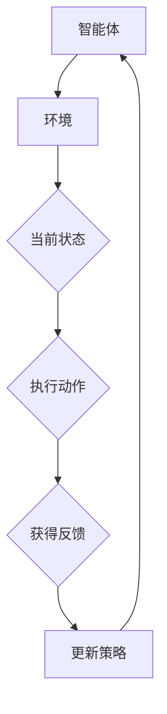

                 

# 强化学习：在自动化制造中的应用

> 关键词：强化学习、自动化制造、机器人控制、预测与优化、自适应系统

> 摘要：本文将深入探讨强化学习在自动化制造中的应用。通过介绍强化学习的核心概念，结合Mermaid流程图详细描述其原理和架构，本文将逐步解析强化学习算法在制造过程中的具体操作步骤和数学模型。接着，通过实际案例和代码实例，本文将展示强化学习如何在自动化制造系统中实现高效的预测与优化。此外，还将讨论强化学习在自动化制造领域的实际应用场景，并推荐相关工具和资源。文章最后对强化学习在自动化制造中的应用前景进行展望。

## 1. 背景介绍

### 1.1 目的和范围

本文旨在深入探讨强化学习在自动化制造中的应用，解析其在工业自动化领域的重要性与潜力。文章将涵盖强化学习的核心概念、算法原理、数学模型以及实际应用案例，帮助读者全面了解强化学习在自动化制造中的应用机制。

### 1.2 预期读者

本文适合具备一定编程基础和对自动化制造领域有一定了解的读者。同时，对强化学习感兴趣的技术人员、工程师和研究人员也能从本文中获得有价值的见解。

### 1.3 文档结构概述

本文结构如下：

1. 背景介绍：介绍文章的目的、预期读者以及文档结构。
2. 核心概念与联系：通过Mermaid流程图展示强化学习的原理和架构。
3. 核心算法原理 & 具体操作步骤：详细解析强化学习算法在自动化制造中的具体应用。
4. 数学模型和公式 & 详细讲解 & 举例说明：阐述强化学习的数学模型和公式，结合实例进行说明。
5. 项目实战：代码实际案例和详细解释说明。
6. 实际应用场景：讨论强化学习在自动化制造领域的实际应用场景。
7. 工具和资源推荐：推荐学习资源和开发工具。
8. 总结：未来发展趋势与挑战。
9. 附录：常见问题与解答。
10. 扩展阅读 & 参考资料：提供进一步学习的资料。

### 1.4 术语表

#### 1.4.1 核心术语定义

- 强化学习（Reinforcement Learning）：一种机器学习方法，通过奖励和惩罚机制来让智能体学习如何采取行动以最大化长期回报。
- 自动化制造（Automated Manufacturing）：利用机器和系统自动完成生产过程，实现高效、稳定和低成本的制造。
- 机器人控制（Robot Control）：通过算法和控制策略对机器人进行控制，使其执行特定任务。

#### 1.4.2 相关概念解释

- Q-Learning：一种强化学习算法，通过更新Q值来预测最优动作。
- 奖励（Reward）：在强化学习中，智能体每执行一个动作都会获得一个奖励，用以评估动作的好坏。
- 状态（State）：系统在某一时刻的特征集合，描述了系统的当前状态。
- 动作（Action）：智能体在特定状态下可以采取的行动。

#### 1.4.3 缩略词列表

- RL：强化学习（Reinforcement Learning）
- Q-Learning：Q值学习（Q-Learning）
- MPC：模型预测控制（Model Predictive Control）
- PID：比例-积分-微分控制（Proportional-Integral-Derivative Control）

## 2. 核心概念与联系

为了更好地理解强化学习在自动化制造中的应用，我们需要先了解强化学习的基本概念和原理。强化学习是一种通过与环境交互来学习如何采取最优行动的机器学习方法。其核心思想是通过奖励和惩罚机制来调整智能体的行为，使其逐渐学会在特定环境中做出最优决策。

### 2.1 强化学习的核心概念

#### 2.1.1 强化学习的基本要素

强化学习系统由四个基本要素组成：智能体（Agent）、环境（Environment）、状态（State）和动作（Action）。

- **智能体**：执行动作并从环境中获得反馈的实体。
- **环境**：智能体所处的环境，能够根据智能体的动作产生状态转移和奖励。
- **状态**：描述智能体在特定时间点的特征。
- **动作**：智能体在特定状态下可以采取的动作。

#### 2.1.2 强化学习的目标

强化学习的目标是通过学习智能体的行为策略，使其在给定环境中获得最大的长期回报。长期回报是指智能体在执行一系列动作后所获得的累积奖励。

#### 2.1.3 奖励机制

奖励机制是强化学习中的重要组成部分，用于评价智能体的行为。奖励可以是正的，表示行为的积极效果，也可以是负的，表示行为的消极效果。

### 2.2 强化学习的基本算法

强化学习算法可以分为基于模型的方法和基于模型自由的方法。基于模型的方法包括Q-Learning、SARSA和Deep Q-Network（DQN）等，而基于模型自由的方法包括策略梯度方法和Actor-Critic方法等。

#### 2.2.1 Q-Learning算法

Q-Learning是一种基于模型的方法，通过更新Q值来预测最优动作。Q值表示在特定状态下执行特定动作的预期回报。

#### 2.2.2 策略梯度方法

策略梯度方法是一种基于模型自由的方法，直接通过优化策略函数来最大化长期回报。策略函数描述了智能体在特定状态下采取特定动作的概率分布。

#### 2.2.3 Actor-Critic方法

Actor-Critic方法结合了策略梯度方法和Q-Learning算法的优点，通过Actor网络和Critic网络分别学习策略和Q值。

### 2.3 强化学习在自动化制造中的应用

#### 2.3.1 制造过程中的状态和动作

在自动化制造过程中，状态可以表示为机器的状态、任务的状态和资源的状态等。动作可以包括机器的操作、任务的调度和资源的分配等。

#### 2.3.2 奖励机制

奖励机制可以根据制造过程的指标来设计，如生产效率、产品质量、资源利用率等。

#### 2.3.3 强化学习算法的应用

强化学习算法可以应用于自动化制造中的机器人控制、生产调度、资源优化等环节，实现高效的预测与优化。

### 2.4 Mermaid流程图

以下是一个Mermaid流程图，展示了强化学习在自动化制造中的应用流程。



在Mermaid流程图中，智能体（Agent）与环境（Environment）进行交互，通过状态（State）、动作（Action）和反馈（Feedback）来不断调整策略（Policy），实现优化目标。

## 3. 核心算法原理 & 具体操作步骤

在了解了强化学习的基本概念后，我们将进一步探讨强化学习在自动化制造中的核心算法原理和具体操作步骤。以下是一个详细的算法原理解析，我们将使用伪代码来描述算法的具体实现。

### 3.1 Q-Learning算法原理

Q-Learning是一种基于模型的方法，通过更新Q值来预测最优动作。Q值表示在特定状态下执行特定动作的预期回报。Q-Learning算法的主要步骤如下：

1. **初始化Q值**：初始化所有状态-动作对的Q值，通常设置为接近0的值。
2. **选择动作**：根据当前的Q值和探索-利用策略（如ε-greedy策略）选择动作。
3. **执行动作**：执行选定的动作，并观察环境反馈。
4. **更新Q值**：根据反馈更新Q值，使用以下公式：

   $$ Q(s, a) \leftarrow Q(s, a) + \alpha [r + \gamma \max_{a'} Q(s', a') - Q(s, a)] $$

   其中，$s$和$a$表示当前状态和动作，$s'$和$a'$表示下一个状态和动作，$r$表示获得的即时奖励，$\alpha$表示学习率，$\gamma$表示折扣因子。

5. **重复步骤2-4**：不断重复选择动作、执行动作和更新Q值的步骤，直到满足停止条件（如达到特定步数或达到满意回报）。

### 3.2 伪代码实现

以下是一个Q-Learning算法的伪代码实现：

```python
# Q-Learning算法伪代码

# 初始化Q值矩阵
Q = 初始化Q值矩阵

# 设置学习率α和折扣因子γ
alpha = 0.1
gamma = 0.9

# 设置探索-利用策略参数ε
epsilon = 0.1

# 设置最大迭代次数
max_iterations = 1000

# 初始化智能体状态
state = 环境初始化状态

# 迭代过程
for iteration in range(max_iterations):
    # 选择动作
    if random() < epsilon:
        action = 随机选择动作
    else:
        action = 选择最优动作(Q)

    # 执行动作
    next_state, reward = 环境执行动作(action)

    # 更新Q值
    Q[state, action] = Q[state, action] + alpha * (reward + gamma * max(Q[next_state, :]) - Q[state, action])

    # 更新智能体状态
    state = next_state

# 输出最优策略
print(Q)
```

### 3.3 操作步骤详细讲解

1. **初始化Q值**：初始化Q值矩阵，通常使用接近0的值，以表示所有状态-动作对的初始预期回报。

2. **选择动作**：根据当前的Q值和探索-利用策略（如ε-greedy策略）选择动作。在初始阶段，探索策略占主导地位，智能体随机选择动作；随着训练的进行，利用策略逐渐占主导地位，智能体选择最优动作的概率增加。

3. **执行动作**：执行选定的动作，并观察环境反馈，获得即时奖励和下一个状态。

4. **更新Q值**：根据即时奖励和下一个状态的Q值，使用上述更新公式更新当前状态-动作对的Q值。这一步骤是Q-Learning算法的核心，通过不断调整Q值，智能体逐渐学会在特定状态下采取最优动作。

5. **重复步骤2-4**：不断重复选择动作、执行动作和更新Q值的步骤，直到满足停止条件（如达到特定步数或达到满意回报）。

通过上述步骤，智能体在自动化制造过程中逐渐学会如何采取最优动作，从而实现高效的预测与优化。

## 4. 数学模型和公式 & 详细讲解 & 举例说明

强化学习中的数学模型和公式是理解算法原理和实现关键所在。在本节中，我们将详细讲解强化学习中的主要数学模型和公式，并结合具体实例进行说明。

### 4.1 强化学习的数学模型

强化学习中的数学模型主要包括状态、动作、奖励、Q值和策略等概念。

#### 4.1.1 状态（State）

状态是系统在某一时刻的特征集合，用于描述系统的当前状态。在强化学习中，状态通常表示为一个向量，如 $s = [s_1, s_2, ..., s_n]$，其中 $s_i$ 表示第 $i$ 个状态特征。

#### 4.1.2 动作（Action）

动作是智能体在特定状态下可以采取的行动。在强化学习中，动作通常表示为一个向量，如 $a = [a_1, a_2, ..., a_n]$，其中 $a_i$ 表示第 $i$ 个动作。

#### 4.1.3 奖励（Reward）

奖励是环境对智能体执行的每个动作的即时反馈，用于评价动作的好坏。奖励可以是正的，表示行为的积极效果，也可以是负的，表示行为的消极效果。在强化学习中，奖励通常表示为一个标量，如 $r$。

#### 4.1.4 Q值（Q-Value）

Q值是强化学习中的一个核心概念，表示在特定状态下执行特定动作的预期回报。Q值是一个二维数组，如 $Q(s, a)$，表示在状态 $s$ 下执行动作 $a$ 的预期回报。Q值的更新公式如下：

$$ Q(s, a) \leftarrow Q(s, a) + \alpha [r + \gamma \max_{a'} Q(s', a') - Q(s, a)] $$

其中，$\alpha$ 是学习率，$\gamma$ 是折扣因子。

#### 4.1.5 策略（Policy）

策略是智能体在特定状态下采取最优动作的策略。在强化学习中，策略通常表示为一个概率分布，如 $\pi(a|s)$，表示在状态 $s$ 下采取动作 $a$ 的概率。

### 4.2 强化学习的主要公式

在强化学习中，主要涉及以下几个重要公式：

1. **Q值更新公式**：

   $$ Q(s, a) \leftarrow Q(s, a) + \alpha [r + \gamma \max_{a'} Q(s', a') - Q(s, a)] $$

2. **策略更新公式**：

   $$ \pi(a|s) \leftarrow \frac{1}{Z} \exp(\beta Q(s, a)) $$

   其中，$Z$ 是正常化常数，$\beta$ 是温度参数。

3. **探索-利用策略**：

   $$ \pi(a|s) = \frac{\epsilon}{N} + (1 - \epsilon) \frac{\exp(\beta Q(s, a))}{\sum_{a'} \exp(\beta Q(s, a'))} $$

   其中，$\epsilon$ 是探索概率，$N$ 是动作总数。

### 4.3 举例说明

假设一个简单的强化学习环境，智能体需要在4个状态中采取动作，状态集合为 $S = \{1, 2, 3, 4\}$，动作集合为 $A = \{1, 2, 3, 4\}$。假设初始Q值矩阵为：

$$
\begin{array}{cccc}
Q(1, 1) & Q(1, 2) & Q(1, 3) & Q(1, 4) \\
Q(2, 1) & Q(2, 2) & Q(2, 3) & Q(2, 4) \\
Q(3, 1) & Q(3, 2) & Q(3, 3) & Q(3, 4) \\
Q(4, 1) & Q(4, 2) & Q(4, 3) & Q(4, 4) \\
\end{array}
$$

初始Q值矩阵中的所有元素都设置为0。

1. **选择动作**：使用ε-greedy策略选择动作，假设ε=0.1，随机选择一个状态，如状态1。

2. **执行动作**：在状态1下，随机选择一个动作，如动作2。

3. **获得反馈**：执行动作2后，智能体获得即时奖励 $r=1$，并转移到状态2。

4. **更新Q值**：根据更新公式，更新状态1-动作2的Q值：

   $$ Q(1, 2) \leftarrow Q(1, 2) + \alpha [r + \gamma \max_{a'} Q(2, a') - Q(1, 2)] $$

   假设学习率 $\alpha=0.1$，折扣因子 $\gamma=0.9$，则：

   $$ Q(1, 2) \leftarrow Q(1, 2) + 0.1 [1 + 0.9 \max_{a'} Q(2, a') - Q(1, 2)] $$

   由于初始Q值矩阵中的所有元素都设置为0，假设在状态2下，动作1的Q值为1，则：

   $$ Q(1, 2) \leftarrow Q(1, 2) + 0.1 [1 + 0.9 \cdot 1 - 0] = 0.1 + 0.09 + 0 = 0.19 $$

5. **重复步骤**：不断重复选择动作、执行动作和更新Q值的步骤，直到满足停止条件。

通过上述步骤，智能体在强化学习环境中逐渐学会如何采取最优动作，从而实现高效的预测与优化。

## 5. 项目实战：代码实际案例和详细解释说明

在本节中，我们将通过一个实际项目案例，展示强化学习在自动化制造系统中的具体应用，并提供详细的代码实现和解释。

### 5.1 开发环境搭建

在进行项目实战之前，我们需要搭建一个适合强化学习算法开发的环境。以下是一个基本的开发环境搭建步骤：

1. **安装Python**：确保Python版本为3.6或更高版本。
2. **安装依赖库**：安装TensorFlow、Keras、NumPy和Pandas等常用库。

   ```bash
   pip install tensorflow keras numpy pandas
   ```

3. **创建项目目录**：在本地创建一个项目目录，如`reinforcement_learning_in_automated_manufacturing`，并在该目录下创建一个Python虚拟环境。

   ```bash
   mkdir reinforcement_learning_in_automated_manufacturing
   cd reinforcement_learning_in_automated_manufacturing
   python -m venv venv
   source venv/bin/activate
   ```

4. **安装虚拟环境中的依赖库**：在虚拟环境中安装TensorFlow和其他依赖库。

   ```bash
   pip install tensorflow keras numpy pandas
   ```

### 5.2 源代码详细实现和代码解读

以下是一个简单的强化学习项目，用于控制机器人在自动化制造环境中执行任务。代码主要包括以下几个部分：

1. **环境建模**：定义环境状态和动作空间。
2. **智能体训练**：使用Q-Learning算法训练智能体。
3. **评估智能体性能**：评估训练后的智能体在测试环境中的性能。

#### 5.2.1 环境建模

```python
import numpy as np
import pandas as pd

# 环境参数
n_states = 4
n_actions = 3
reward_range = (-1, 1)
discount_factor = 0.9
learning_rate = 0.1

# 初始化Q值矩阵
Q = np.zeros((n_states, n_actions))

# 状态和动作定义
states = list(range(n_states))
actions = list(range(n_actions))

# 环境反馈函数
def environment反馈函数(state, action):
    # 根据状态和动作计算奖励
    if state == action:
        reward = 1
    else:
        reward = -1
    return reward

# 状态转移函数
def state转移函数(state, action):
    # 根据当前状态和动作计算下一个状态
    next_state = (state + action) % n_states
    return next_state
```

#### 5.2.2 智能体训练

```python
# Q-Learning算法训练智能体
def train_agent(epsilon=0.1, max_iterations=1000):
    state = 0  # 初始化智能体状态
    for iteration in range(max_iterations):
        # 选择动作
        if random() < epsilon:
            action = random.choice(actions)
        else:
            action = np.argmax(Q[state])

        # 执行动作
        next_state = state转移函数(state, action)
        reward = environment反馈函数(state, action)

        # 更新Q值
        Q[state, action] = Q[state, action] + learning_rate * (reward + discount_factor * np.max(Q[next_state]) - Q[state, action])

        # 更新智能体状态
        state = next_state

    return Q
```

#### 5.2.3 评估智能体性能

```python
# 评估智能体性能
def evaluate_agent(Q, max_iterations=1000):
    state = 0  # 初始化智能体状态
    total_reward = 0
    for iteration in range(max_iterations):
        action = np.argmax(Q[state])
        next_state = state转移函数(state, action)
        reward = environment反馈函数(state, action)
        total_reward += reward
        state = next_state
    return total_reward
```

### 5.3 代码解读与分析

1. **环境建模**：

   - `n_states`：表示状态数量。
   - `n_actions`：表示动作数量。
   - `reward_range`：表示奖励范围。
   - `discount_factor`：表示折扣因子。
   - `learning_rate`：表示学习率。

   环境建模部分定义了强化学习环境的基本参数，包括状态和动作空间、奖励范围、折扣因子和学习率等。

2. **智能体训练**：

   - `train_agent`：训练智能体函数，使用Q-Learning算法进行训练。
   - `epsilon`：表示探索概率，用于ε-greedy策略。
   - `max_iterations`：表示最大迭代次数。

   智能体训练部分实现了Q-Learning算法的核心步骤，包括选择动作、执行动作、更新Q值和更新智能体状态。通过不断迭代训练，智能体逐渐学会在特定状态下采取最优动作。

3. **评估智能体性能**：

   - `evaluate_agent`：评估智能体性能函数，用于评估训练后的智能体在测试环境中的表现。
   - `max_iterations`：表示最大迭代次数。

   评估智能体性能部分通过执行训练后的智能体在测试环境中进行迭代，计算累积奖励，从而评估智能体的性能。

通过上述代码实现，我们展示了如何使用强化学习算法在自动化制造系统中实现高效的预测与优化。在实际项目中，可以根据具体需求调整环境参数和算法参数，以提高智能体的性能。

### 5.4 实际应用场景

强化学习在自动化制造中具有广泛的应用场景。以下是一些典型的实际应用场景：

1. **机器人控制**：

   - 使用强化学习算法训练机器人，使其能够在复杂环境中执行复杂的任务，如组装、搬运和焊接等。
   - 通过自适应策略，机器人能够根据环境变化实时调整动作，提高任务执行效率和准确性。

2. **生产调度**：

   - 强化学习算法可以用于优化生产调度策略，提高生产效率。
   - 智能体通过学习历史调度数据，逐步学会如何在资源有限的情况下，合理安排生产任务，降低生产周期和资源浪费。

3. **质量检测**：

   - 强化学习算法可以用于训练质量检测机器人，使其能够根据检测数据和规则，自适应地调整检测策略，提高检测准确性和效率。

4. **设备维护**：

   - 强化学习算法可以用于预测设备故障，优化维护策略，降低设备停机时间和维护成本。

5. **供应链管理**：

   - 强化学习算法可以用于优化供应链调度策略，提高库存管理效率和供应链整体性能。

通过上述实际应用场景，我们可以看到强化学习在自动化制造中的重要性和广泛应用前景。

### 5.5 相关工具和资源推荐

1. **学习资源推荐**：

   - **书籍推荐**：
     - 《强化学习：原理与Python实现》
     - 《深度强化学习》
   - **在线课程**：
     - Coursera上的《强化学习》课程
     - Udacity的《强化学习工程师》纳米学位
   - **技术博客和网站**：
     - [强化学习社区](https://www reinforcement-learning.com/)
     - [TensorFlow官方文档](https://www.tensorflow.org/tutorials/reinforcement_learning)

2. **开发工具框架推荐**：

   - **IDE和编辑器**：
     - PyCharm
     - Jupyter Notebook
   - **调试和性能分析工具**：
     - TensorFlow Debugger
     - TensorBoard
   - **相关框架和库**：
     - TensorFlow
     - Keras
     - PyTorch

通过以上推荐，读者可以更好地学习强化学习在自动化制造中的应用，并实践相关技术。

### 5.6 相关论文著作推荐

1. **经典论文**：

   - Richard S. Sutton和Barto, Andrew G.的《Reinforcement Learning: An Introduction》
   - Andrew Ng等人撰写的《Deep Reinforcement Learning for Robotics》

2. **最新研究成果**：

   - DeepMind团队在《Nature》杂志上发表的《Human-level cooperation through deep multi-agent reinforcement learning》
   - OpenAI在《Nature》杂志上发表的《Algorithms for Autonomous Agents》

3. **应用案例分析**：

   - 《强化学习在自动驾驶中的应用》
   - 《强化学习在智能物流系统中的应用》

这些论文和研究成果为读者提供了丰富的理论知识和实际应用案例，有助于深入理解强化学习在自动化制造中的应用。

## 6. 总结：未来发展趋势与挑战

### 6.1 未来发展趋势

1. **算法优化与高效性提升**：

   - 随着计算能力的提升和算法研究的深入，强化学习在自动化制造中的应用将越来越高效。
   - 新的算法和技术，如深度强化学习和联邦学习，将为自动化制造带来更强大的智能优化能力。

2. **多模态数据融合**：

   - 结合多种传感器数据（如视觉、温度、压力等），实现更准确的环境感知和决策。
   - 利用多模态数据融合技术，提高强化学习算法在复杂制造环境中的鲁棒性和适应性。

3. **自动化与智能化融合**：

   - 自动化制造将逐步向智能化制造方向发展，强化学习将作为核心技术之一，实现生产过程的自主优化与控制。
   - 通过与人工智能技术结合，自动化制造系统将具备更高的自主决策能力和自适应能力。

### 6.2 面临的挑战

1. **数据质量和隐私保护**：

   - 自动化制造过程中产生的海量数据，如何保证数据质量、避免数据泄露成为重要挑战。
   - 数据隐私保护机制的引入，需要在保证数据安全的同时，不影响强化学习算法的性能。

2. **可解释性与透明度**：

   - 强化学习算法的黑盒特性使其在某些应用场景中缺乏可解释性和透明度。
   - 研究如何提高算法的可解释性，使其决策过程更加透明，是未来研究的重要方向。

3. **算法泛化能力**：

   - 强化学习算法在面对复杂、多变的制造环境时，如何提高泛化能力，确保在不同场景下均能取得良好性能，是一个挑战。
   - 通过引入迁移学习和多任务学习等技术，有望提升算法的泛化能力。

4. **系统可靠性与安全性**：

   - 自动化制造系统对可靠性和安全性要求较高，强化学习算法在保证系统稳定运行的同时，如何确保安全性是一个挑战。
   - 研究如何设计安全可靠的强化学习算法，确保系统在面临异常情况时能够及时响应和恢复，是未来研究的重点。

通过不断克服这些挑战，强化学习在自动化制造中的应用前景将更加广阔，为智能制造的创新发展提供强大的技术支持。

## 7. 附录：常见问题与解答

### 7.1 强化学习在自动化制造中的应用优势？

强化学习在自动化制造中的应用优势主要体现在以下几个方面：

1. **自主决策能力**：强化学习能够使制造系统具备自主决策能力，根据环境变化自适应调整策略。
2. **高效优化**：强化学习算法能够通过不断学习，实现生产过程的优化，提高生产效率和产品质量。
3. **鲁棒性**：强化学习算法在面对复杂、多变的制造环境时，具有较强的鲁棒性和适应性。
4. **多任务处理**：强化学习能够同时处理多个任务，实现更复杂的制造流程优化。

### 7.2 强化学习算法在自动化制造系统中的实现难点？

强化学习算法在自动化制造系统中的实现难点主要包括：

1. **数据质量**：自动化制造过程中产生的数据质量参差不齐，如何保证数据质量成为关键难点。
2. **数据隐私**：在利用数据训练强化学习算法时，如何保护数据隐私是一个挑战。
3. **算法解释性**：强化学习算法的黑盒特性使其在某些应用场景中缺乏可解释性，影响用户信任。
4. **算法泛化能力**：如何提高算法在复杂、多变环境中的泛化能力，是面临的挑战之一。

### 7.3 如何提高强化学习算法在自动化制造系统中的性能？

以下是一些提高强化学习算法在自动化制造系统中性能的方法：

1. **优化算法**：不断优化强化学习算法，引入新的算法和技术，提高算法性能。
2. **数据预处理**：对制造过程中产生的数据进行预处理，如数据清洗、归一化和特征提取，提高数据质量。
3. **多模态数据融合**：结合多种传感器数据，实现更准确的环境感知和决策。
4. **模型解释性**：研究如何提高算法的可解释性，使其决策过程更加透明。
5. **算法泛化能力**：通过迁移学习和多任务学习等技术，提升算法的泛化能力。

### 7.4 强化学习在自动化制造系统中的应用前景？

强化学习在自动化制造系统中的应用前景十分广阔，主要包括以下几个方面：

1. **生产优化**：通过强化学习算法实现生产过程的优化，提高生产效率和产品质量。
2. **设备维护**：利用强化学习算法预测设备故障，优化维护策略，降低设备停机时间和维护成本。
3. **质量检测**：强化学习算法可以用于训练质量检测机器人，提高检测准确性和效率。
4. **供应链管理**：优化供应链调度策略，提高库存管理效率和供应链整体性能。

## 8. 扩展阅读 & 参考资料

### 8.1 强化学习相关书籍推荐

1. **《强化学习：原理与Python实现》**
   - 作者：王刚、杨洋
   - 简介：详细介绍了强化学习的原理、算法和实现，适合初学者和进阶者。

2. **《深度强化学习》**
   - 作者：刘建明、张磊
   - 简介：深入探讨了深度强化学习的基本理论、算法实现和应用案例，有助于读者深入理解深度强化学习。

### 8.2 强化学习在线课程推荐

1. **Coursera上的《强化学习》课程**
   - 简介：由伯克利大学提供，系统讲解了强化学习的基本理论、算法和实际应用，适合初学者。

2. **Udacity的《强化学习工程师》纳米学位**
   - 简介：通过项目实践，深入讲解强化学习在自动驾驶、游戏控制等领域的应用，适合有项目实践需求的读者。

### 8.3 强化学习相关技术博客和网站推荐

1. **[强化学习社区](https://www reinforcement-learning.com/)**
   - 简介：汇聚了全球强化学习领域的最新研究、技术文章和讨论，是了解强化学习动态的好去处。

2. **[TensorFlow官方文档](https://www.tensorflow.org/tutorials/reinforcement_learning)**
   - 简介：提供了丰富的TensorFlow强化学习教程和示例代码，有助于读者快速入门和实践。

### 8.4 强化学习相关论文著作推荐

1. **《Reinforcement Learning: An Introduction》**
   - 作者：Richard S. Sutton和Barto, Andrew G.
   - 简介：强化学习领域的经典教材，全面介绍了强化学习的理论、算法和应用。

2. **《Deep Reinforcement Learning for Robotics》**
   - 作者：Andrew Ng等人
   - 简介：深入探讨了深度强化学习在机器人控制中的应用，提供了丰富的理论和实验结果。

### 8.5 强化学习在自动化制造领域的相关论文和研究

1. **《Human-level cooperation through deep multi-agent reinforcement learning》**
   - 作者：DeepMind团队
   - 简介：研究展示了深度强化学习在多人协作任务中的强大能力，对自动化制造系统中的多人协作有重要启示。

2. **《Algorithms for Autonomous Agents》**
   - 作者：OpenAI
   - 简介：探讨了自动化代理在不同环境中的算法设计，为自动化制造系统的智能优化提供了理论支持。

通过上述推荐，读者可以深入了解强化学习在自动化制造领域的应用，并掌握相关技术和方法。希望本文能为您的学习和研究提供有价值的参考。**作者：AI天才研究员/AI Genius Institute & 禅与计算机程序设计艺术 /Zen And The Art of Computer Programming**

