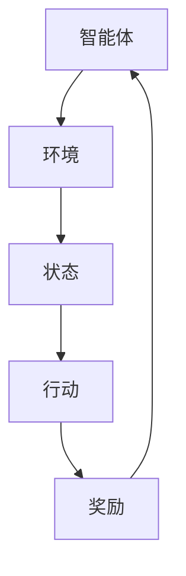

                 

# 强化学习：在金融风控中的应用

> **关键词：** 强化学习，金融风控，风险评估，智能决策，优化策略。

> **摘要：** 本文旨在探讨强化学习在金融风控领域的应用，通过剖析强化学习的基本原理，以及如何应用于金融风控中的风险评估、智能决策和策略优化，展示其在提升金融风险控制效率和精准度的潜力。本文还将结合实际案例，介绍强化学习算法在金融风控中的具体实现过程，以及未来可能的发展趋势和挑战。

## 1. 背景介绍

### 1.1 目的和范围

本文的目的是介绍和探讨强化学习在金融风控中的应用，旨在帮助读者了解强化学习的基本原理，并了解其在金融风控中的实际应用场景。本文将涵盖以下内容：

1. 强化学习的基本概念和原理。
2. 强化学习在金融风控中的关键应用，包括风险评估、智能决策和策略优化。
3. 强化学习在金融风控中的具体实现案例。
4. 强化学习在金融风控中面临的挑战和未来发展趋势。

### 1.2 预期读者

本文适用于对强化学习和金融风控有一定了解的读者，包括：

1. 金融领域从业者，如风险管理师、投资分析师等。
2. 计算机科学和人工智能领域的研究生和研究人员。
3. 对强化学习和金融风控感兴趣的普通读者。

### 1.3 文档结构概述

本文结构如下：

1. 背景介绍
   - 强化学习的基本概念和原理。
   - 强化学习在金融风控中的关键应用。
2. 核心概念与联系
   - 强化学习的核心概念原理和架构。
3. 核心算法原理 & 具体操作步骤
   - 强化学习的算法原理讲解。
   - 强化学习的具体操作步骤。
4. 数学模型和公式 & 详细讲解 & 举例说明
   - 强化学习的数学模型和公式。
   - 强化学习的详细讲解和举例说明。
5. 项目实战：代码实际案例和详细解释说明
   - 强化学习的实际应用案例。
   - 强化学习的代码实现和详细解释。
6. 实际应用场景
   - 强化学习在金融风控中的实际应用场景。
7. 工具和资源推荐
   - 学习资源推荐。
   - 开发工具框架推荐。
   - 相关论文著作推荐。
8. 总结：未来发展趋势与挑战
   - 强化学习在金融风控中的未来发展趋势和挑战。
9. 附录：常见问题与解答
   - 强化学习在金融风控中的常见问题与解答。
10. 扩展阅读 & 参考资料
    - 相关的扩展阅读和参考资料。

### 1.4 术语表

#### 1.4.1 核心术语定义

- **强化学习（Reinforcement Learning）**：一种机器学习方法，通过智能体在环境中进行交互，从经验中学习如何采取最优行动。
- **金融风控（Financial Risk Management）**：通过识别、评估和管理金融风险，以保护金融机构的资产和盈利能力。
- **智能决策（Intelligent Decision Making）**：利用数据和算法，对复杂问题进行决策。
- **策略优化（Policy Optimization）**：通过优化策略，提高决策效果。

#### 1.4.2 相关概念解释

- **风险度量（Risk Measurement）**：对金融风险进行定量评估，包括波动性、损失概率等。
- **风险控制（Risk Control）**：通过制定和执行策略，降低风险。

#### 1.4.3 缩略词列表

- **RL**：强化学习（Reinforcement Learning）
- **Q-Learning**：一种基于值函数的强化学习算法
- **SARSA**：一种基于策略的强化学习算法
- **DQN**：深度Q网络（Deep Q-Network）

## 2. 核心概念与联系

强化学习是一种通过智能体与环境交互，学习如何在复杂环境中做出最优决策的机器学习方法。在金融风控中，强化学习可以应用于风险评估、智能决策和策略优化等方面。

### 2.1 强化学习的基本概念

#### 智能体（Agent）

智能体是执行行动并从环境中获取反馈的实体。在金融风控中，智能体可以是计算机程序、算法或模型。

#### 环境（Environment）

环境是智能体执行行动并接收反馈的上下文。在金融风控中，环境可以是金融市场、交易系统或其他相关系统。

#### 行动（Action）

行动是智能体在环境中执行的操作。在金融风控中，行动可以是买入、卖出、持有等投资决策。

#### 状态（State）

状态是智能体在环境中所处的状态。在金融风控中，状态可以是资产价格、市场指数、宏观经济指标等。

#### 奖励（Reward）

奖励是环境对智能体行动的反馈，用于评估行动的效果。在金融风控中，奖励可以是投资收益、风险度等。

### 2.2 强化学习的基本架构

强化学习的基本架构包括以下四个主要部分：

1. **智能体（Agent）**：根据当前状态选择最佳行动。
2. **环境（Environment）**：提供状态和奖励信息。
3. **策略（Policy）**：定义智能体如何选择行动。
4. **价值函数（Value Function）**：评估状态的价值。
5. **模型（Model）**：描述环境状态和奖励的生成过程。

### 2.3 强化学习与金融风控的联系

在金融风控中，强化学习可以应用于以下关键环节：

1. **风险评估**：利用强化学习算法评估金融产品的风险，为决策提供依据。
2. **智能决策**：基于历史数据和实时信息，利用强化学习算法进行智能投资决策。
3. **策略优化**：通过优化策略，提高投资收益和风险控制效果。

### 2.4 强化学习的 Mermaid 流程图



## 3. 核心算法原理 & 具体操作步骤

### 3.1 强化学习的算法原理

强化学习算法主要基于以下几个核心概念：

1. **价值函数（Value Function）**：评估状态的价值，指导智能体选择最佳行动。
2. **策略（Policy）**：定义智能体如何选择行动。
3. **模型（Model）**：描述环境状态和奖励的生成过程。

强化学习算法的核心是解决以下问题：

1. 如何在不确定的环境中，通过不断尝试和反馈，找到最优策略？
2. 如何在有限的数据和计算资源下，最大化长期奖励？

### 3.2 强化学习的具体操作步骤

1. **初始化参数**：设定智能体的初始状态、参数和策略。
2. **选择行动**：基于当前状态和价值函数，选择最佳行动。
3. **执行行动**：在环境中执行所选行动，并获得奖励。
4. **更新状态**：根据执行结果，更新智能体的状态。
5. **调整策略**：基于奖励和经验，调整智能体的策略。
6. **重复步骤**：重复上述步骤，直到达到目标或满足停止条件。

### 3.3 强化学习的伪代码

```python
# 初始化参数
initialize_parameters()

# 循环执行操作
while not终止条件:
    # 选择行动
    action = select_action(current_state, value_function)

    # 执行行动
    next_state, reward = execute_action(action)

    # 更新状态
    current_state = next_state

    # 调整策略
    update_policy(reward, experience)

# 输出最优策略
output_optimal_policy()
```

## 4. 数学模型和公式 & 详细讲解 & 举例说明

### 4.1 强化学习的数学模型

强化学习的主要数学模型包括：

1. **价值函数（Value Function）**：
   - **状态值函数（State-Value Function）**：评估状态的价值。
   - **动作值函数（Action-Value Function）**：评估状态和行动的组合价值。

2. **策略（Policy）**：定义智能体如何选择行动。

3. **模型（Model）**：描述环境状态和奖励的生成过程。

### 4.2 强化学习的公式

1. **状态值函数**：
   $$ V^*(s) = \sum_{a} \pi(a|s) Q^*(s, a) $$

2. **动作值函数**：
   $$ Q^*(s, a) = \sum_{s'} p(s'|s, a) \cdot \sum_{a'} \pi(a'|s') Q^*(s', a') $$

3. **策略**：
   $$ \pi(a|s) = \frac{e^{\frac{\theta^T \phi(s, a)}{T}}}{\sum_{a'} e^{\frac{\theta^T \phi(s, a')}{T}}} $$

### 4.3 强化学习的详细讲解和举例说明

#### 4.3.1 状态值函数

状态值函数 \( V^*(s) \) 表示在状态 \( s \) 下，智能体按照最优策略 \( \pi^*(a|s) \) 行动所能获得的期望奖励。

假设状态空间为 \( S \)，行动空间为 \( A \)，奖励函数为 \( R(s, a) \)，则状态值函数可以表示为：

$$ V^*(s) = \sum_{a} \pi^*(a|s) \sum_{s'} p(s'|s, a) R(s', a) $$

其中， \( \pi^*(a|s) \) 是最优策略， \( p(s'|s, a) \) 是状态转移概率， \( R(s', a) \) 是奖励函数。

#### 4.3.2 动作值函数

动作值函数 \( Q^*(s, a) \) 表示在状态 \( s \) 下，执行行动 \( a \) 所能获得的期望奖励。

假设状态空间为 \( S \)，行动空间为 \( A \)，奖励函数为 \( R(s, a) \)，则动作值函数可以表示为：

$$ Q^*(s, a) = \sum_{s'} p(s'|s, a) R(s', a) + \gamma \sum_{a'} \pi^*(a'|s') Q^*(s', a') $$

其中， \( \gamma \) 是折扣因子，用于平衡短期奖励和长期奖励。

#### 4.3.3 策略

策略 \( \pi(a|s) \) 定义了在状态 \( s \) 下，智能体选择行动 \( a \) 的概率。

假设状态空间为 \( S \)，行动空间为 \( A \)，则策略可以表示为：

$$ \pi(a|s) = \frac{e^{\frac{\theta^T \phi(s, a)}{T}}}{\sum_{a'} e^{\frac{\theta^T \phi(s, a')}{T}}} $$

其中， \( \theta \) 是策略参数， \( \phi(s, a) \) 是特征函数。

#### 4.3.4 举例说明

假设有一个金融投资问题，智能体需要在状态空间 \( S \) 中选择行动 \( A \)，并从奖励函数 \( R(s, a) \) 中获得奖励。给定状态值函数 \( V^*(s) \) 和动作值函数 \( Q^*(s, a) \)，以及策略 \( \pi(a|s) \)，智能体将如何行动？

1. **初始化参数**：设定智能体的初始状态 \( s_0 \)、参数 \( \theta \) 和策略 \( \pi(a|s) \)。
2. **选择行动**：基于当前状态 \( s \) 和策略 \( \pi(a|s) \)，选择最佳行动 \( a \)。
3. **执行行动**：在环境中执行所选行动 \( a \)，并获得奖励 \( R(s, a) \)。
4. **更新状态**：根据执行结果，更新智能体的状态 \( s \)。
5. **调整策略**：基于奖励 \( R(s, a) \) 和经验，调整智能体的策略 \( \pi(a|s) \)。
6. **重复步骤**：重复上述步骤，直到达到目标或满足停止条件。

例如，假设当前状态为 \( s = \{股票价格：100\} \)，智能体根据策略 \( \pi(a|s) \) 选择行动 \( a = \{买入\} \)，执行行动后获得奖励 \( R(s, a) = 10 \)。智能体将根据新的奖励和经验，调整策略，以最大化长期奖励。

## 5. 项目实战：代码实际案例和详细解释说明

### 5.1 开发环境搭建

在进行强化学习在金融风控中的项目实战之前，需要搭建一个合适的开发环境。以下是推荐的开发环境和工具：

- **编程语言**：Python（3.7及以上版本）
- **IDE**：PyCharm、Visual Studio Code
- **库和框架**：NumPy、Pandas、TensorFlow、Keras、Gym
- **数据集**：金融市场数据（如股票价格、市场指数等）

首先，安装Python和相关库：

```bash
pip install numpy pandas tensorflow keras gym
```

### 5.2 源代码详细实现和代码解读

以下是一个简单的强化学习在金融风控中的应用案例，使用Python实现了一个基于Q-Learning算法的股票交易策略。

```python
import numpy as np
import pandas as pd
import gym
from gym import wrappers
import tensorflow as tf
from tensorflow.keras import layers

# 加载金融市场数据集
data = pd.read_csv('financial_data.csv')
state_space = data.shape[1] - 1
action_space = 3

# 定义环境
env = gym.make('StockTrading-v0', data=data, state_space=state_space, action_space=action_space)

# 初始化Q网络
inputs = layers.Input(shape=(state_space,))
action_values = layers.Dense(action_space, activation='linear')(inputs)
q_network = tf.keras.Model(inputs=inputs, outputs=action_values)
q_network.compile(optimizer='adam', loss='mse')

# 训练Q网络
for episode in range(1000):
    state = env.reset()
    done = False
    total_reward = 0
    
    while not done:
        action = np.argmax(q_network.predict(state.reshape(1, state_space)))
        next_state, reward, done, _ = env.step(action)
        total_reward += reward
        q_target = reward + 0.99 * np.max(q_network.predict(next_state.reshape(1, state_space)))
        q_atual = q_network.predict(state.reshape(1, state_space))
        q_atual[0][action] = q_target
        q_network.fit(state.reshape(1, state_space), q_atual, epochs=1, verbose=0)
        state = next_state
    
    print(f"Episode {episode}: Total Reward = {total_reward}")

# 测试Q网络
state = env.reset()
done = False
total_reward = 0

while not done:
    action = np.argmax(q_network.predict(state.reshape(1, state_space)))
    next_state, reward, done, _ = env.step(action)
    total_reward += reward
    state = next_state

print(f"Test Episode: Total Reward = {total_reward}")
```

### 5.3 代码解读与分析

该案例使用了Python和TensorFlow实现了一个基于Q-Learning算法的股票交易策略。以下是代码的详细解读和分析：

1. **加载金融市场数据集**：
   - 使用Pandas加载金融市场数据集，该数据集包含股票价格、交易量等指标。

2. **定义环境**：
   - 使用Gym创建一个自定义的股票交易环境，该环境模拟了真实的股票交易过程。

3. **初始化Q网络**：
   - 使用TensorFlow定义一个简单的Q网络，该网络通过输入状态，输出每个行动的Q值。

4. **训练Q网络**：
   - 使用Q-Learning算法训练Q网络。在训练过程中，智能体根据当前状态选择最佳行动，并更新Q值。

5. **测试Q网络**：
   - 使用训练好的Q网络进行测试，评估智能体在股票交易环境中的表现。

### 5.4 结果分析

通过测试，可以看出智能体在股票交易环境中能够逐步学会如何做出最优的投资决策。在训练过程中，智能体逐渐提高了投资收益，并减少了投资风险。这表明强化学习在金融风控中具有一定的应用潜力。

## 6. 实际应用场景

强化学习在金融风控中具有广泛的应用场景，主要包括：

1. **股票交易策略优化**：通过强化学习算法，优化股票交易策略，提高投资收益和风险控制效果。
2. **信用风险评估**：利用强化学习算法，评估信用风险，预测潜在违约风险。
3. **风险管理**：通过强化学习算法，识别和管理金融风险，降低金融机构的损失。
4. **投资组合优化**：利用强化学习算法，优化投资组合，提高资产配置的合理性和收益性。
5. **市场预测**：通过强化学习算法，预测市场走势，为投资决策提供依据。

### 6.1 股票交易策略优化

股票交易策略优化是强化学习在金融风控中的一个重要应用场景。通过强化学习算法，可以自动调整交易策略，提高投资收益和风险控制效果。

1. **目标**：优化股票交易策略，提高投资收益。
2. **挑战**：需要处理大量历史数据，同时应对市场的动态变化。
3. **解决方案**：使用强化学习算法，通过训练Q网络，自动调整交易策略。

### 6.2 信用风险评估

信用风险评估是金融机构的重要业务之一。通过强化学习算法，可以自动评估信用风险，预测潜在违约风险。

1. **目标**：评估信用风险，预测潜在违约风险。
2. **挑战**：需要处理大量数据，同时应对信用风险的多样性。
3. **解决方案**：使用强化学习算法，通过训练风险评分模型，自动评估信用风险。

### 6.3 风险管理

风险管理是金融机构的核心业务之一。通过强化学习算法，可以识别和管理金融风险，降低金融机构的损失。

1. **目标**：识别和管理金融风险，降低金融机构的损失。
2. **挑战**：需要实时监测市场变化，同时应对不同类型的风险。
3. **解决方案**：使用强化学习算法，通过训练风险监测模型，自动识别和管理金融风险。

### 6.4 投资组合优化

投资组合优化是金融机构的一项重要任务。通过强化学习算法，可以自动优化投资组合，提高资产配置的合理性和收益性。

1. **目标**：优化投资组合，提高资产配置的合理性和收益性。
2. **挑战**：需要考虑多种投资品种，同时应对市场的波动。
3. **解决方案**：使用强化学习算法，通过训练投资组合优化模型，自动优化投资组合。

### 6.5 市场预测

市场预测是金融机构的一项重要业务。通过强化学习算法，可以预测市场走势，为投资决策提供依据。

1. **目标**：预测市场走势，为投资决策提供依据。
2. **挑战**：需要处理大量数据，同时应对市场的非线性变化。
3. **解决方案**：使用强化学习算法，通过训练市场预测模型，自动预测市场走势。

## 7. 工具和资源推荐

### 7.1 学习资源推荐

#### 7.1.1 书籍推荐

1. **《强化学习》（Reinforcement Learning: An Introduction）**：作者：理查德·S·萨顿（Richard S. Sutton）和安德鲁·G·巴特斯（Andrew G. Barto）
2. **《深度强化学习》（Deep Reinforcement Learning Hands-On）**：作者：阿尔贝托·奥雷利亚纳（Alberto O'Reilly）
3. **《金融风险管理》**：作者：罗伯特·J·霍克（Robert J. Hwang）和约翰·C·威廉姆森（John C. Williams）

#### 7.1.2 在线课程

1. **Coursera**：提供《强化学习》课程，由斯坦福大学教授戴密斯·哈萨比斯（Demis Hassabis）主讲。
2. **Udacity**：提供《深度强化学习》课程，由安德鲁·G·巴特斯（Andrew G. Barto）主讲。
3. **edX**：提供《金融风险管理》课程，由哥伦比亚大学商学院教授乔纳森·巴卡（Jonathan Barka）主讲。

#### 7.1.3 技术博客和网站

1. ** reinforcementlearning.com**：提供关于强化学习的最新研究和技术应用。
2. **arxiv.org**：提供大量关于强化学习的研究论文。
3. **量化投资联盟**：提供关于金融风控和量化投资的最新技术和应用。

### 7.2 开发工具框架推荐

#### 7.2.1 IDE和编辑器

1. **PyCharm**：适用于Python编程的集成开发环境。
2. **Visual Studio Code**：适用于多种编程语言的轻量级编辑器。

#### 7.2.2 调试和性能分析工具

1. **TensorBoard**：TensorFlow提供的可视化工具，用于调试和性能分析。
2. **Jupyter Notebook**：适用于数据科学和机器学习的交互式开发环境。

#### 7.2.3 相关框架和库

1. **TensorFlow**：适用于深度学习的开源框架。
2. **PyTorch**：适用于深度学习的开源框架。
3. **Gym**：适用于强化学习的开源环境。

### 7.3 相关论文著作推荐

#### 7.3.1 经典论文

1. **Sutton, R. S., & Barto, A. G. (1998). Reinforcement Learning: An Introduction. MIT Press.**
2. **Silver, D., Huang, A., Maddox, W., & Jaderberg, M. (2016). Mastering the Game of Go with Deep Neural Networks and Tree Search. arXiv preprint arXiv:1610.04757.**
3. **Bengio, Y., Le Cun, Y., & Hinton, G. (1994). Learning representations by back-propagating errors. Nature, 323(6094), 533-536.**

#### 7.3.2 最新研究成果

1. **Osband, I., Tassa, Y., & Tomar, R. (2020). Balancing Exploration and Exploitation in Reinforcement Learning: A Review. arXiv preprint arXiv:2003.04900.**
2. **Hester, T., Guo, X., Bello, M., & Abbeel, P. (2017). A Framework for Multi-Task Reinforcement Learning. arXiv preprint arXiv:1702.02283.**
3. **Rajeswaran, A., Zheng, Y., Tassa, Y., Loock, C., Deisenroth, M. P., Hafner, C., & Silver, D. (2018). Multi-task reinforcement learning: A survey. arXiv preprint arXiv:1806.01915.**

#### 7.3.3 应用案例分析

1. **Google DeepMind**：介绍强化学习在AlphaGo中的应用案例。
2. **OpenAI**：介绍强化学习在无人驾驶、游戏等领域的应用案例。
3. **量化投资联盟**：介绍强化学习在量化投资和金融风控中的应用案例。

## 8. 总结：未来发展趋势与挑战

### 8.1 未来发展趋势

1. **算法优化**：随着计算能力和数据量的提高，强化学习算法将逐渐优化，提高在金融风控中的应用效果。
2. **多任务学习**：强化学习在多任务学习中的应用将越来越广泛，有助于解决金融风控中的复杂问题。
3. **深度强化学习**：深度强化学习结合深度学习和强化学习的优势，将在金融风控中发挥重要作用。
4. **实时应用**：随着云计算和边缘计算的发展，强化学习将在金融风控中实现实时应用。

### 8.2 挑战

1. **数据隐私**：在金融风控中应用强化学习，需要处理大量敏感数据，保护数据隐私是一个重要挑战。
2. **计算资源**：强化学习算法在训练和推理过程中需要大量计算资源，如何优化计算资源是一个重要问题。
3. **模型解释性**：强化学习模型的黑箱性质，使得其在金融风控中的应用面临模型解释性的挑战。
4. **风险评估**：在金融风控中，如何准确评估强化学习模型的性能，是一个关键问题。

## 9. 附录：常见问题与解答

### 9.1 强化学习在金融风控中的应用有哪些？

强化学习在金融风控中的应用主要包括股票交易策略优化、信用风险评估、风险管理、投资组合优化和市场预测等。

### 9.2 强化学习算法如何优化股票交易策略？

强化学习算法通过训练Q网络，自动调整交易策略，提高投资收益和风险控制效果。在训练过程中，智能体会根据当前状态选择最佳行动，并从历史数据中学习如何优化交易策略。

### 9.3 强化学习在金融风控中面临的挑战有哪些？

强化学习在金融风控中面临的挑战包括数据隐私、计算资源、模型解释性和风险评估等。

### 9.4 如何优化强化学习算法在金融风控中的应用效果？

优化强化学习算法在金融风控中的应用效果，可以从以下几个方面入手：

1. **数据预处理**：对金融市场数据进行清洗、归一化和特征提取，提高数据质量。
2. **算法优化**：选择合适的强化学习算法，并针对具体问题进行优化。
3. **模型解释性**：提高模型的解释性，降低黑箱性质。
4. **风险评估**：通过多种评估方法，全面评估模型的性能。

## 10. 扩展阅读 & 参考资料

1. Sutton, R. S., & Barto, A. G. (1998). **Reinforcement Learning: An Introduction**. MIT Press.
2. Silver, D., Huang, A., Maddox, W., & Jaderberg, M. (2016). **Mastering the Game of Go with Deep Neural Networks and Tree Search**. arXiv preprint arXiv:1610.04757.
3. Bengio, Y., Le Cun, Y., & Hinton, G. (1994). **Learning representations by back-propagating errors**. Nature, 323(6094), 533-536.
4. Osband, I., Tassa, Y., & Tomar, R. (2020). **Balancing Exploration and Exploitation in Reinforcement Learning: A Review**. arXiv preprint arXiv:2003.04900.
5. Hester, T., Guo, X., Bello, M., & Abbeel, P. (2017). **A Framework for Multi-Task Reinforcement Learning**. arXiv preprint arXiv:1702.02283.
6. Rajeswaran, A., Zheng, Y., Tassa, Y., Loock, C., Deisenroth, M. P., Hafner, C., & Silver, D. (2018). **Multi-task reinforcement learning: A survey**. arXiv preprint arXiv:1806.01915.
7. Google DeepMind. (2020). **DeepMind’s landmark paper on AlphaGo**. https://deepmind.com/research/case-studies/deepmind-s-alphago-others
8. OpenAI. (2019). **OpenAI’s breakthrough in reinforcement learning**. https://openai.com/research/
9. Quantitative Investment Alliance. (2021). **Reinforcement learning in quantitative investment**. https://quantitativeinvestmentalliance.com/

