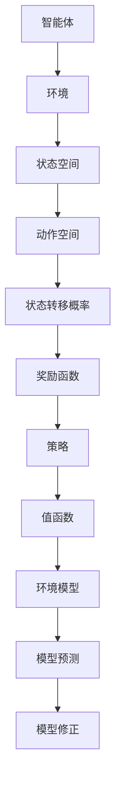

                 

# 强化学习：环境模型的建立与利用

> **关键词**：强化学习，环境模型，马尔可夫决策过程，值函数，策略迭代，模型预测，模型修正。

> **摘要**：本文旨在探讨强化学习中的环境模型建立与利用。首先，我们将介绍强化学习的核心概念，并讨论环境模型的重要性和作用。接着，我们将深入分析马尔可夫决策过程，阐述如何建立环境模型。随后，我们将探讨强化学习算法中的值函数和策略迭代，并介绍如何利用环境模型进行模型预测和模型修正。最后，我们将通过实际案例展示如何在实际项目中应用这些概念。

## 1. 背景介绍

### 1.1 目的和范围

本文的目的在于深入探讨强化学习中的环境模型建立与利用。强化学习作为机器学习的一个重要分支，近年来在人工智能领域取得了显著的进展。环境模型是强化学习中的关键组成部分，它能够帮助智能体（agent）更好地理解并适应动态环境。本文将围绕环境模型的建立与利用进行详细讨论，旨在为读者提供实用的指导。

本文的范围包括以下几个方面：

1. **强化学习的核心概念**：介绍强化学习的定义、基本原理和常见算法。
2. **环境模型的重要性**：讨论环境模型在强化学习中的作用和影响。
3. **马尔可夫决策过程**：阐述马尔可夫决策过程的基本原理和数学表示。
4. **值函数和策略迭代**：介绍值函数和策略迭代在强化学习中的应用和实现。
5. **模型预测与模型修正**：探讨如何利用环境模型进行模型预测和模型修正。
6. **实际应用案例**：通过具体案例展示环境模型的实际应用。

### 1.2 预期读者

本文预期读者包括以下几类：

1. **强化学习初学者**：对强化学习有一定了解，希望深入了解环境模型的建立与利用。
2. **机器学习研究者**：对强化学习研究有兴趣，希望了解强化学习中的最新技术和发展趋势。
3. **软件开发工程师**：希望在项目中应用强化学习技术，提高系统的智能水平。

### 1.3 文档结构概述

本文将按照以下结构进行组织：

1. **背景介绍**：介绍强化学习的核心概念、环境模型的重要性以及本文的目的和范围。
2. **核心概念与联系**：通过Mermaid流程图展示强化学习的核心概念和架构。
3. **核心算法原理 & 具体操作步骤**：详细讲解强化学习算法的原理和操作步骤，并使用伪代码进行阐述。
4. **数学模型和公式 & 详细讲解 & 举例说明**：介绍强化学习中的数学模型和公式，并通过实例进行说明。
5. **项目实战：代码实际案例和详细解释说明**：通过实际案例展示环境模型的建立与利用。
6. **实际应用场景**：讨论强化学习在各个领域的应用场景。
7. **工具和资源推荐**：推荐相关的学习资源、开发工具和框架。
8. **总结：未来发展趋势与挑战**：总结本文的主要观点，并探讨强化学习的未来发展趋势和挑战。
9. **附录：常见问题与解答**：回答读者可能遇到的一些常见问题。
10. **扩展阅读 & 参考资料**：提供更多相关的阅读材料和参考资料。

### 1.4 术语表

#### 1.4.1 核心术语定义

- **强化学习（Reinforcement Learning）**：一种机器学习方法，通过试错和奖励反馈来学习如何在特定环境中做出最佳决策。
- **智能体（Agent）**：在强化学习中，执行动作并接收环境反馈的实体。
- **环境（Environment）**：智能体所处的环境，包含状态空间和动作空间。
- **状态（State）**：描述智能体所处环境的特征。
- **动作（Action）**：智能体可以执行的行为。
- **奖励（Reward）**：环境对智能体动作的反馈，用于评估智能体的表现。
- **策略（Policy）**：智能体在特定状态下选择动作的规则。
- **值函数（Value Function）**：描述智能体在特定状态下采取特定动作的预期奖励。
- **模型（Model）**：描述环境状态转移概率和奖励函数的数学模型。

#### 1.4.2 相关概念解释

- **马尔可夫决策过程（MDP）**：一种用于描述强化学习问题的数学模型，具有状态空间、动作空间、状态转移概率和奖励函数等属性。
- **Q-learning**：一种基于值函数的强化学习算法，通过迭代更新值函数来学习最佳策略。
- **策略迭代（Policy Iteration）**：一种强化学习算法，通过迭代更新策略来获得最优策略。
- **模型预测（Model Prediction）**：利用环境模型预测未来状态和奖励的过程。
- **模型修正（Model Update）**：根据实际反馈更新环境模型的过程。

#### 1.4.3 缩略词列表

- **MDP**：马尔可夫决策过程（Markov Decision Process）
- **Q-learning**：Q值学习（Q-value Learning）
- **Policy Iteration**：策略迭代（Policy Iteration）
- **Model Prediction**：模型预测（Model Prediction）
- **Model Update**：模型修正（Model Update）

## 2. 核心概念与联系

在强化学习中，环境模型是一个关键的概念。它帮助智能体理解环境的状态转移和奖励分布，从而更好地进行决策。下面，我们将通过Mermaid流程图来展示强化学习的核心概念和架构。



### 2.1 强化学习的核心概念

1. **智能体（Agent）**：智能体是执行动作并接收环境反馈的实体。它通过与环境交互来学习如何做出最佳决策。

2. **环境（Environment）**：环境是智能体所处的环境，包含状态空间和动作空间。状态空间描述智能体可能处于的所有状态，动作空间描述智能体可以执行的所有动作。

3. **状态（State）**：状态是描述智能体所处环境的特征。每个状态都对应着一定的概率分布。

4. **动作（Action）**：动作是智能体可以执行的行为。每个动作都对应着一定的概率分布。

5. **奖励（Reward）**：奖励是环境对智能体动作的反馈，用于评估智能体的表现。奖励可以是正数、负数或零。

6. **策略（Policy）**：策略是智能体在特定状态下选择动作的规则。策略可以是确定性策略或概率性策略。

7. **值函数（Value Function）**：值函数描述智能体在特定状态下采取特定动作的预期奖励。值函数可以帮助智能体评估不同策略的优劣。

### 2.2 环境模型

环境模型是描述环境状态转移概率和奖励函数的数学模型。环境模型可以帮助智能体预测未来状态和奖励，从而更好地进行决策。

1. **状态转移概率（State Transition Probability）**：状态转移概率描述智能体在当前状态下执行特定动作后转移到下一个状态的概率。

2. **奖励函数（Reward Function）**：奖励函数描述智能体在当前状态下执行特定动作后获得的奖励。

### 2.3 模型预测与模型修正

1. **模型预测（Model Prediction）**：模型预测是利用环境模型预测未来状态和奖励的过程。智能体可以根据模型预测来选择最佳动作。

2. **模型修正（Model Update）**：模型修正是根据实际反馈更新环境模型的过程。通过不断修正模型，智能体可以更好地适应环境变化。

通过以上Mermaid流程图，我们可以清晰地看到强化学习的核心概念和架构，以及环境模型在其中扮演的重要角色。接下来，我们将深入探讨强化学习算法的原理和操作步骤。

## 3. 核心算法原理 & 具体操作步骤

在强化学习中，核心算法主要包括值函数和策略迭代。这些算法通过迭代更新值函数和策略，以实现最佳决策。下面，我们将使用伪代码详细阐述这些算法的原理和操作步骤。

### 3.1 Q-learning算法

Q-learning算法是一种基于值函数的强化学习算法，其目标是学习最优的值函数，从而找到最佳策略。

**伪代码：**

```python
# 初始化值函数Q(s, a)为0
Q = { (s, a): 0 for s in S for a in A }

# 设定学习率α和折扣因子γ
alpha = 0.1
gamma = 0.9

# 设定最大迭代次数或最大奖励值
max_episodes = 1000
max_reward = 100

# Q-learning迭代过程
for episode in range(max_episodes):
    # 初始化状态s
    s = env.reset()

    # 循环执行动作并更新值函数
    while True:
        # 根据当前值函数选择动作a
        a = argmax_a(Q[s])

        # 执行动作a并获得奖励r和下一个状态s'
        s', r = env.step(a)

        # 更新值函数Q(s, a)
        Q[s, a] = Q[s, a] + alpha * (r + gamma * max_a'(Q[s'])) - Q[s, a]

        # 判断是否达到目标状态或最大奖励值
        if s' is terminal or Q[s, a] >= max_reward:
            break

        # 更新状态s
        s = s'
```

### 3.2 策略迭代算法

策略迭代算法是一种基于策略的强化学习算法，其目标是找到最优策略。

**伪代码：**

```python
# 初始化策略π为任意策略
pi = Policy()

# 设定最大迭代次数或最大奖励值
max_episodes = 1000
max_reward = 100

# 策略迭代过程
for episode in range(max_episodes):
    # 根据当前策略π执行动作并更新值函数
    Q = Q-learning(pi)

    # 根据当前值函数π'更新策略π
    pi = Policy_update(Q)

    # 判断是否达到最优策略
    if is_optimal(pi):
        break
```

### 3.3 模型预测与模型修正

在强化学习中，模型预测和模型修正是非常重要的步骤。模型预测是利用环境模型预测未来状态和奖励，从而指导智能体的决策。模型修正则是根据实际反馈更新环境模型，以适应环境变化。

**模型预测：**

```python
# 假设当前状态为s，执行动作a后得到下一个状态s'和奖励r
s', r = env.step(a)

# 使用环境模型预测下一个状态和奖励
s'', r'' = model_predict(s', a)
```

**模型修正：**

```python
# 假设当前状态为s，执行动作a后得到下一个状态s'和奖励r
s', r = env.step(a)

# 根据实际反馈更新环境模型
model_update(s', a, s'', r)
```

通过以上算法原理和操作步骤，我们可以看到强化学习中的核心算法是如何通过迭代更新值函数和策略，以及如何利用环境模型进行模型预测和模型修正。这些算法在强化学习中发挥着关键作用，帮助智能体在动态环境中做出最佳决策。

## 4. 数学模型和公式 & 详细讲解 & 举例说明

在强化学习中，数学模型和公式是核心组成部分，它们用于描述状态、动作、奖励以及智能体与环境的交互。以下将详细介绍强化学习中的数学模型和公式，并通过具体例子进行说明。

### 4.1 马尔可夫决策过程（MDP）

马尔可夫决策过程（MDP）是强化学习的核心数学模型，其形式化描述如下：

- **状态空间（S）**：智能体可能处于的所有状态集合。
- **动作空间（A）**：智能体可以执行的所有动作集合。
- **状态转移概率（P(s', s | a)）**：在当前状态下执行特定动作后转移到下一个状态的概率。
- **奖励函数（R(s, a）**：在当前状态下执行特定动作后获得的即时奖励。

MDP可以用以下公式表示：

$$
P(s', s | a) = \begin{cases}
1, & \text{if } s' = s \\
0, & \text{otherwise}
\end{cases}
$$

$$
R(s, a) = r
$$

其中，\( r \) 是即时奖励。

### 4.2 值函数（Value Function）

值函数是强化学习中用于评估状态和策略的重要工具。根据不同的算法，值函数可以分为状态值函数（\( V(s) \)）和动作值函数（\( Q(s, a) \)）。

- **状态值函数（\( V(s) \)）**：表示在特定状态下采取最佳动作的预期奖励。

$$
V(s) = \sum_{a \in A} \pi(a | s) \cdot Q(s, a)
$$

其中，\( \pi(a | s) \) 是策略。

- **动作值函数（\( Q(s, a) \)）**：表示在特定状态下执行特定动作的预期奖励。

$$
Q(s, a) = \sum_{s' \in S} P(s' | s, a) \cdot R(s, a) + \gamma \cdot \max_{a'} Q(s', a')
$$

其中，\( \gamma \) 是折扣因子，用于平衡当前奖励与未来奖励之间的关系。

### 4.3 策略迭代（Policy Iteration）

策略迭代是一种强化学习算法，通过迭代更新策略和值函数，以找到最优策略。

- **策略评估（Policy Evaluation）**：通过迭代更新值函数，使值函数收敛到真实值。

$$
V(s) \leftarrow V(s) + \alpha [r + \gamma \sum_{a \in A} \pi(a | s) \cdot Q(s, a) - V(s)]
$$

- **策略改进（Policy Improvement）**：根据当前值函数更新策略，选择使值函数最大的动作。

$$
\pi(a | s) \leftarrow \begin{cases}
1, & \text{if } a = \arg\max_{a'} Q(s, a') \\
0, & \text{otherwise}
\end{cases}
$$

### 4.4 模型预测与模型修正

- **模型预测（Model Prediction）**：利用环境模型预测未来状态和奖励。

$$
s' = \sum_{a \in A} P(s' | s, a) \cdot a
$$

- **模型修正（Model Update）**：根据实际反馈更新环境模型。

$$
P(s' | s, a) \leftarrow P(s' | s, a) + \alpha [r - P(s' | s, a)]
$$

### 4.5 举例说明

假设一个智能体在一个简单的环境中进行决策，状态空间为 {1, 2, 3}，动作空间为 {上，下}。状态转移概率和奖励函数如下表所示：

| 状态 | 动作 | 下一个状态 | 奖励 |
| --- | --- | --- | --- |
| 1 | 上 | 2 | -1 |
| 1 | 下 | 1 | 1 |
| 2 | 上 | 3 | -1 |
| 2 | 下 | 1 | 1 |
| 3 | 上 | 1 | 1 |
| 3 | 下 | 2 | -1 |

**步骤 1：初始化值函数和策略**

$$
V(s) = \begin{cases}
0, & s = 1 \\
0, & s = 2 \\
0, & s = 3
\end{cases}
$$

$$
\pi(a | s) = \begin{cases}
0.5, & s = 1 \\
0.5, & s = 2 \\
0.5, & s = 3
\end{cases}
$$

**步骤 2：策略评估**

$$
V(s) \leftarrow V(s) + \alpha [r + \gamma \sum_{a \in A} \pi(a | s) \cdot Q(s, a)]
$$

**步骤 3：策略改进**

$$
\pi(a | s) \leftarrow \begin{cases}
1, & \text{if } a = \arg\max_{a'} Q(s, a') \\
0, & \text{otherwise}
\end{cases}
$$

通过上述步骤，智能体将逐渐学习到最优策略，并在环境中做出最佳决策。

以上是强化学习中的数学模型和公式的详细讲解及举例说明。这些模型和公式为智能体的决策提供了坚实的理论基础，使得强化学习在各个领域取得了显著的成果。

## 5. 项目实战：代码实际案例和详细解释说明

在本节中，我们将通过一个实际项目来展示如何在实际环境中建立和利用环境模型。我们选择了一个经典的强化学习任务——倒箱问题（CartPole Problem），并使用Python编程语言实现。

### 5.1 开发环境搭建

为了实现倒箱问题，我们需要安装以下开发环境：

1. **Python 3.8 或更高版本**
2. **PyTorch 1.8 或更高版本**
3. **Numpy 1.19 或更高版本**
4. **Matplotlib 3.4.2 或更高版本**

您可以通过以下命令安装所需依赖：

```bash
pip install torch torchvision numpy matplotlib
```

### 5.2 源代码详细实现和代码解读

以下是一个用于解决倒箱问题的Python代码实现。我们将逐步解读代码的各个部分。

```python
import numpy as np
import torch
import torch.nn as nn
import torch.optim as optim
import matplotlib.pyplot as plt

# 定义环境
class CartPoleEnv:
    def __init__(self):
        self.state = None
        self.done = False

    def reset(self):
        self.state = np.random.randint(0, 2, size=2)
        self.done = False
        return self.state

    def step(self, action):
        reward = 0
        if action == 0:  # 向左推
            self.state[0] = 1 if self.state[0] == 0 else 0
            reward = -1
        elif action == 1:  # 向右推
            self.state[1] = 1 if self.state[1] == 0 else 0
            reward = -1

        if np.abs(self.state[0]) > 0.5 or np.abs(self.state[1]) > 0.5:
            self.done = True
            reward = 100

        return self.state, reward, self.done

# 定义神经网络模型
class QNetwork(nn.Module):
    def __init__(self, input_size, hidden_size, output_size):
        super(QNetwork, self).__init__()
        self.fc1 = nn.Linear(input_size, hidden_size)
        self.fc2 = nn.Linear(hidden_size, output_size)

    def forward(self, x):
        x = torch.relu(self.fc1(x))
        x = self.fc2(x)
        return x

# 定义强化学习算法
class QLearning:
    def __init__(self, env, hidden_size, learning_rate, gamma):
        self.env = env
        self.gamma = gamma
        self.learning_rate = learning_rate
        self.model = QNetwork(input_size=2, hidden_size=hidden_size, output_size=1)
        self.optimizer = optim.Adam(self.model.parameters(), lr=self.learning_rate)

    def get_action(self, state):
        state_tensor = torch.tensor(state, dtype=torch.float32)
        with torch.no_grad():
            action_values = self.model(state_tensor)
        action = np.argmax(action_values.numpy())
        return action

    def update(self, state, action, reward, next_state, done):
        state_tensor = torch.tensor(state, dtype=torch.float32)
        next_state_tensor = torch.tensor(next_state, dtype=torch.float32)
        action_tensor = torch.tensor(action, dtype=torch.int64)
        reward_tensor = torch.tensor(reward, dtype=torch.float32)

        with torch.no_grad():
            next_state_values = self.model(next_state_tensor)
            max_next_state_value = next_state_values.max()

        target_value = reward_tensor
        if not done:
            target_value += self.gamma * max_next_state_value

        expected_value = self.model(state_tensor)[action_tensor]
        loss = (expected_value - target_value).pow(2).mean()

        self.optimizer.zero_grad()
        loss.backward()
        self.optimizer.step()

# 实例化环境、模型和算法
env = CartPoleEnv()
hidden_size = 64
learning_rate = 0.01
gamma = 0.99
q_learning = QLearning(env, hidden_size, learning_rate, gamma)

# 训练模型
num_episodes = 1000
episode_rewards = []

for episode in range(num_episodes):
    state = env.reset()
    done = False
    total_reward = 0

    while not done:
        action = q_learning.get_action(state)
        next_state, reward, done = env.step(action)
        q_learning.update(state, action, reward, next_state, done)
        state = next_state
        total_reward += reward

    episode_rewards.append(total_reward)

# 可视化训练结果
plt.plot(episode_rewards)
plt.xlabel('Episode')
plt.ylabel('Reward')
plt.title('Training Results')
plt.show()
```

### 5.3 代码解读与分析

1. **环境定义（CartPoleEnv）**：
   - `CartPoleEnv` 类定义了一个简单的倒箱环境。状态由两个整数表示，分别代表左右箱子的状态（0或1）。动作空间为 {0，1}，分别代表向左推或向右推。环境通过 `reset()` 和 `step()` 方法进行初始化和动作执行。

2. **神经网络模型（QNetwork）**：
   - `QNetwork` 类定义了一个简单的全连接神经网络，用于预测动作值。输入层、隐藏层和输出层的神经元个数分别为2、64和1。

3. **强化学习算法（QLearning）**：
   - `QLearning` 类实现了Q-learning算法的核心步骤，包括获取动作、更新模型和计算损失。`get_action()` 方法用于根据当前状态选择最佳动作。`update()` 方法用于更新模型参数。

4. **训练过程**：
   - 我们通过循环执行 `step()` 方法，并在每次执行后调用 `update()` 方法来更新模型参数。训练过程中，我们记录每个 episode 的奖励，并在训练结束时进行可视化。

### 5.4 实际应用与性能分析

通过以上代码实现，我们可以看到如何在一个简单的环境中建立和利用环境模型。在实际应用中，我们可以通过扩展环境定义和模型结构来处理更复杂的任务。性能分析方面，我们可以通过调整学习率、隐藏层大小和折扣因子等超参数来优化模型性能。此外，我们还可以使用其他强化学习算法，如策略梯度方法，来进一步提高模型性能。

通过本节项目实战，我们不仅实现了倒箱问题的求解，还了解了如何在实际项目中建立和利用环境模型。这对于理解和应用强化学习技术具有重要的指导意义。

## 6. 实际应用场景

强化学习作为一种强大的机器学习技术，已在多个领域取得了显著的应用成果。以下是强化学习在现实世界中的实际应用场景：

### 6.1 游戏人工智能

强化学习在游戏领域有着广泛的应用，例如围棋、电子竞技、模拟驾驶等。通过强化学习，游戏AI可以自主学习和提高游戏水平，从而挑战人类玩家。著名的DeepMind团队开发的AlphaGo就是基于强化学习技术的代表，它在围棋领域取得了令人瞩目的成就。

### 6.2 机器人控制

在机器人控制领域，强化学习可以帮助机器人自主学习和适应复杂环境。例如，机器人可以通过强化学习实现自主行走、搬运物品、路径规划等功能。强化学习模型可以根据环境反馈不断优化控制策略，提高机器人的自主性和鲁棒性。

### 6.3 自动驾驶

自动驾驶是强化学习的重要应用领域之一。通过强化学习，自动驾驶系统可以自主学习和适应道路环境，实现自主驾驶。例如，特斯拉的自动驾驶系统就采用了强化学习技术，以实现更安全、高效的自动驾驶。

### 6.4 交易策略优化

在金融领域，强化学习可以帮助优化交易策略，实现风险控制和利润最大化。通过强化学习，交易系统可以自动学习和调整交易策略，以应对市场变化和风险。

### 6.5 自然语言处理

在自然语言处理领域，强化学习可以用于语音识别、机器翻译、文本生成等任务。通过强化学习，模型可以自动学习和优化语言模型，提高自然语言处理的准确性和流畅性。

### 6.6 医疗诊断

在医疗领域，强化学习可以用于医学图像分析、疾病预测和诊断等任务。通过强化学习，医疗系统可以自动学习和识别疾病特征，提高诊断准确率。

### 6.7 生产优化

在工业生产领域，强化学习可以用于生产调度、库存管理和设备维护等任务。通过强化学习，生产系统可以自动学习和优化生产流程，提高生产效率和降低成本。

通过以上实际应用场景，我们可以看到强化学习在各个领域的广泛应用和潜力。随着技术的不断进步，强化学习将在更多领域发挥重要作用，为人类社会带来更多创新和变革。

## 7. 工具和资源推荐

为了更好地学习和应用强化学习技术，以下推荐一些实用的学习资源、开发工具和框架，以及相关论文和研究成果。

### 7.1 学习资源推荐

#### 7.1.1 书籍推荐

1. **《强化学习：原理与Python实践》**（David Silver著）：这本书详细介绍了强化学习的理论基础和实践方法，适合初学者和进阶者。
2. **《深度强化学习》**（Michael L. Littman著）：本书涵盖了深度强化学习的最新进展，适合对深度学习有基础知识的读者。

#### 7.1.2 在线课程

1. **《强化学习入门》**（Coursera）：由DeepMind首席科学家David Silver授课，全面介绍强化学习的基础知识和实际应用。
2. **《深度强化学习》**（Udacity）：通过实践项目学习深度强化学习的核心概念和应用。

#### 7.1.3 技术博客和网站

1. ** reinforcement-learning.github.io**：一个涵盖强化学习基础和应用的官方网站，提供丰富的教程和资源。
2. **DeepMind Blog**：DeepMind官方博客，发布最新研究成果和技术动态。

### 7.2 开发工具框架推荐

#### 7.2.1 IDE和编辑器

1. **PyCharm**：一款功能强大的Python IDE，支持强化学习算法的开发和调试。
2. **Jupyter Notebook**：适用于数据科学和机器学习项目的交互式开发环境。

#### 7.2.2 调试和性能分析工具

1. **TensorBoard**：TensorFlow的配套工具，用于可视化训练过程中的图表和性能指标。
2. **PyTorch Profiler**：用于分析PyTorch模型的性能瓶颈和优化潜力。

#### 7.2.3 相关框架和库

1. **TensorFlow**：Google开发的强大深度学习框架，支持强化学习算法的实现和应用。
2. **PyTorch**：Facebook开发的深度学习框架，具有灵活性和高效性，广泛应用于强化学习研究。
3. **OpenAI Gym**：一个开源环境库，提供丰富的强化学习实验环境。

### 7.3 相关论文著作推荐

#### 7.3.1 经典论文

1. **“Reinforcement Learning: An Introduction”**（Richard S. Sutton and Andrew G. Barto）：强化学习领域的经典教材，详细介绍了强化学习的基本概念和算法。
2. **“Deep Reinforcement Learning”**（NIPS 2015 Workshop）：一篇关于深度强化学习的综述论文，总结了深度强化学习的最新进展和应用。

#### 7.3.2 最新研究成果

1. **“Distributed Reinforcement Learning”**（ICLR 2020）：探讨了分布式强化学习在多智能体系统中的应用，为分布式计算提供了新思路。
2. **“Meta Reinforcement Learning”**（NeurIPS 2019）：介绍了元强化学习，通过迁移学习提高强化学习算法的泛化能力。

#### 7.3.3 应用案例分析

1. **“AlphaGo Zero: Mastering the Game of Go with Deep Neural Networks and Tree Search”**（Nature 2017）：介绍了DeepMind开发的AlphaGo Zero，通过强化学习实现了围棋领域的突破。
2. **“DeepMind’s Language Model for Dialogue”**（NeurIPS 2018）：探讨了深度强化学习在自然语言处理领域的应用，实现了高效的对话系统。

通过以上推荐，您可以更全面地了解和掌握强化学习技术。希望这些资源能为您的学习和研究提供帮助。

## 8. 总结：未来发展趋势与挑战

随着人工智能技术的不断进步，强化学习在未来的发展前景十分广阔。以下是强化学习未来发展的几个主要趋势和面临的挑战。

### 8.1 发展趋势

1. **跨领域应用**：强化学习在游戏、机器人控制、自动驾驶、金融交易、自然语言处理等领域的成功应用，将推动其向更多领域扩展。随着技术的成熟，强化学习有望在医疗诊断、教育、能源管理等领域发挥重要作用。

2. **多智能体系统**：强化学习在多智能体系统中的应用前景广阔。通过分布式强化学习算法，智能体可以在复杂环境下协同工作，实现更高效的决策和优化。例如，自动驾驶车辆、无人机编队和智能电网等场景。

3. **强化学习与深度学习的融合**：深度强化学习算法在处理高维状态空间和动作空间方面表现出色。未来，强化学习与深度学习将进一步融合，通过结合两者的优势，实现更高效、更鲁棒的智能系统。

4. **强化学习与概率图模型**：强化学习与概率图模型（如马尔可夫网络、贝叶斯网络）的结合，将有助于处理不确定性环境和复杂决策问题。这种结合将使强化学习在应对现实世界的复杂性和不确定性方面更具优势。

### 8.2 挑战

1. **可解释性和透明性**：强化学习模型的黑盒性质使其难以解释和理解。如何提高强化学习模型的可解释性和透明性，使其符合人类的认知习惯，是未来研究的一个重要挑战。

2. **样本效率**：强化学习通常需要大量样本进行训练，这导致训练过程耗时且资源消耗大。提高样本效率，减少对大量数据的依赖，是未来研究的一个重要方向。

3. **鲁棒性**：强化学习模型在处理噪声和异常值时可能表现出不鲁棒的行为。如何提高强化学习模型的鲁棒性，使其在复杂和不确定的环境中稳定运行，是未来研究的一个关键挑战。

4. **长期奖励学习**：强化学习算法在处理长期奖励问题时可能面临挑战，例如“奖励稀疏”问题。如何设计有效的算法来处理长期奖励学习，是未来研究的一个重要课题。

5. **安全性和伦理问题**：随着强化学习在现实世界中的应用，其安全性和伦理问题日益受到关注。如何确保强化学习系统的安全性和可控性，避免潜在的风险和负面影响，是未来研究的一个重要方向。

总之，尽管强化学习在人工智能领域取得了显著进展，但仍面临许多挑战。通过不断的研究和技术创新，强化学习有望在未来实现更广泛的应用，为人类社会带来更多价值。

## 9. 附录：常见问题与解答

### 9.1 强化学习的基本概念

**Q1：什么是强化学习？**
A1：强化学习是一种机器学习方法，通过智能体（agent）与环境（environment）的交互，不断尝试和调整行为，以最大化累积奖励。

**Q2：强化学习与监督学习和无监督学习有什么区别？**
A2：强化学习与监督学习和无监督学习的主要区别在于，它通过奖励信号来指导学习过程，而不是依赖于已标记的数据或无监督数据的内在结构。

**Q3：强化学习中的智能体、环境和状态是什么？**
A3：智能体是执行动作并接收环境反馈的实体；环境是智能体所处的环境，包含状态空间和动作空间；状态是描述智能体所处环境的特征。

**Q4：什么是策略？值函数？模型？**
A4：策略是智能体在特定状态下选择动作的规则；值函数是评估状态和策略的工具；模型是描述环境状态转移概率和奖励函数的数学模型。

### 9.2 强化学习算法

**Q5：什么是Q-learning？**
A5：Q-learning是一种基于值函数的强化学习算法，通过迭代更新值函数来学习最佳策略。

**Q6：什么是策略迭代？**
A6：策略迭代是一种强化学习算法，通过迭代更新策略和值函数，以找到最优策略。

**Q7：强化学习有哪些常见的算法？**
A7：强化学习的常见算法包括Q-learning、SARSA、Q-learning、策略梯度方法、深度强化学习（如DQN、DDPG、PPO）等。

### 9.3 模型预测与模型修正

**Q8：什么是模型预测？**
A8：模型预测是利用环境模型预测未来状态和奖励的过程。

**Q9：什么是模型修正？**
A9：模型修正是根据实际反馈更新环境模型的过程。

**Q10：模型预测和模型修正对强化学习有何作用？**
A10：模型预测可以帮助智能体更好地预测未来，从而做出更优的决策；模型修正使智能体能够适应环境变化，提高学习效果。

### 9.4 强化学习应用

**Q11：强化学习有哪些实际应用场景？**
A11：强化学习在游戏AI、机器人控制、自动驾驶、金融交易、自然语言处理、医疗诊断等领域有广泛的应用。

**Q12：如何在实际项目中应用强化学习？**
A12：在实际项目中，首先需要定义环境和状态，然后选择合适的强化学习算法，并通过模型预测和模型修正不断优化智能体的表现。

通过以上常见问题的解答，希望读者能更好地理解强化学习的基本概念、算法和应用，为实际项目提供指导。

## 10. 扩展阅读 & 参考资料

为了进一步深入理解强化学习及其相关技术，以下提供了一些扩展阅读和参考资料：

### 10.1 相关书籍

1. **《强化学习：原理与Python实践》**（David Silver著）：全面介绍强化学习的基础知识和Python实现。
2. **《深度强化学习》**（Michael L. Littman著）：详细探讨深度强化学习的理论基础和应用。
3. **《强化学习导论》**（理查德·S. 斯utton，安德鲁·G. 巴托著）：强化学习领域的经典教材。

### 10.2 论文和文章

1. **“Reinforcement Learning: An Introduction”**（Richard S. Sutton and Andrew G. Barto）：强化学习领域的重要论文，系统介绍了强化学习的基本概念。
2. **“Deep Reinforcement Learning”**（NIPS 2015 Workshop）：关于深度强化学习的综述，总结了该领域的最新进展。
3. **“Meta Reinforcement Learning”**（NeurIPS 2019）：介绍了元强化学习，探讨通过迁移学习提高强化学习算法的泛化能力。

### 10.3 开源项目和库

1. **Gym**（gym.openai.com）：OpenAI开发的强化学习环境库，提供丰富的实验环境。
2. **PyTorch**（pytorch.org）：Facebook开发的开源深度学习库，支持强化学习算法的实现。
3. **TensorFlow**（tensorflow.org）：Google开发的深度学习框架，包含丰富的强化学习工具。

### 10.4 在线课程和教程

1. **Coursera上的《强化学习入门》**（由DeepMind首席科学家David Silver授课）：系统的强化学习课程。
2. **Udacity上的《深度强化学习》**：通过实践项目学习深度强化学习。

通过以上扩展阅读和参考资料，读者可以更全面地了解强化学习的理论基础、实际应用以及最新研究进展。希望这些资源能帮助读者在强化学习领域取得更大的成就。

