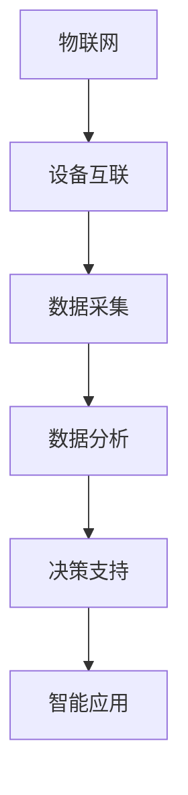
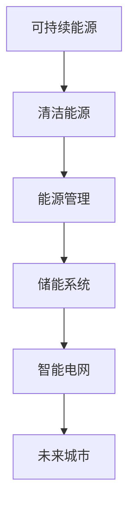
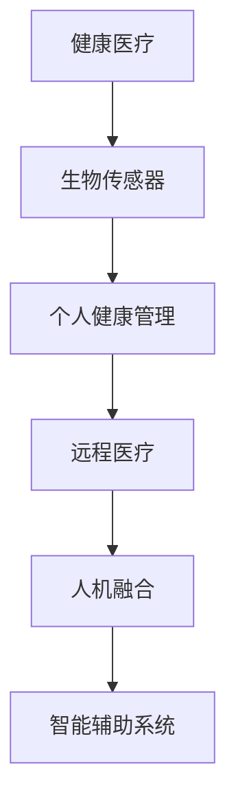

                 

# 当人类走近2050：未来世界畅想

> **关键词：** 人工智能、科技进步、社会变革、可持续性、未来城市、人机融合

> **摘要：** 本篇文章将带您穿越时空，展望2050年的未来世界。通过深入分析科技发展、社会变革、环境可持续性以及人机融合等多个维度，探讨未来世界的可能景象和面临的挑战。文章将结合当前的科技趋势和专家预测，为您呈现一幅充满想象力和现实基础的未来世界图景。

## 1. 背景介绍

### 1.1 目的和范围

本文旨在探讨2050年人类社会的可能景象，重点关注科技、社会和环境等多个方面的变革。文章将从人工智能、可持续能源、未来城市、健康医疗以及人机融合等核心主题展开，旨在为读者提供一个既有前瞻性又具有实用性的未来世界全景。

### 1.2 预期读者

本文适合对科技进步、社会发展和未来规划感兴趣的读者，包括科技从业者、学者、政策制定者以及普通公众。无论是专业领域的研究者，还是对未来充满好奇的普通人，都可以通过本文获得启发和思考。

### 1.3 文档结构概述

本文将按照以下结构进行展开：

1. **背景介绍**：介绍文章的目的、范围、预期读者和文档结构。
2. **核心概念与联系**：介绍人工智能、可持续能源、未来城市等核心概念，并通过Mermaid流程图展示各概念之间的联系。
3. **核心算法原理与具体操作步骤**：详细阐述未来世界关键技术的算法原理和操作步骤。
4. **数学模型和公式**：介绍与未来世界相关的数学模型和公式，并进行详细讲解和举例说明。
5. **项目实战**：通过实际代码案例展示未来世界技术的应用。
6. **实际应用场景**：探讨未来世界技术在不同领域的应用。
7. **工具和资源推荐**：推荐学习资源、开发工具和最新研究成果。
8. **总结**：总结未来发展趋势与挑战。
9. **附录**：常见问题与解答。
10. **扩展阅读与参考资料**：提供进一步阅读的资料。

### 1.4 术语表

#### 1.4.1 核心术语定义

- **人工智能（AI）**：指由计算机实现的模拟人类智能的技术系统。
- **可持续能源**：指不会耗尽且对环境友好的能源，如太阳能、风能等。
- **未来城市**：指采用先进技术和可持续发展理念构建的城市。
- **人机融合**：指通过生物技术、纳米技术等手段，实现人类与机器的无缝融合。

#### 1.4.2 相关概念解释

- **量子计算**：利用量子力学原理实现的计算技术，具有超强的计算能力。
- **物联网（IoT）**：将各种设备和物品通过互联网连接起来，实现智能化的管理和控制。
- **数字孪生**：通过虚拟模型模拟现实世界的物理实体，实现实时监控和预测。

#### 1.4.3 缩略词列表

- **AI**：人工智能
- **IoT**：物联网
- **IoMT**：互联网医疗技术
- **5G**：第五代移动通信技术

## 2. 核心概念与联系

在未来世界，以下几个核心概念将共同塑造我们的日常生活和工作环境：

### 2.1 人工智能与物联网

人工智能和物联网是未来世界不可或缺的两个核心技术。人工智能将负责数据的分析和决策，而物联网将实现设备和物品的互联互通，为人工智能提供海量的数据支持。以下是一个简化的Mermaid流程图，展示了人工智能与物联网之间的联系：



### 2.2 可持续能源与未来城市

可持续能源是未来城市的基石，通过太阳能、风能等清洁能源的广泛应用，未来城市将实现能源的自给自足。以下是一个简化的Mermaid流程图，展示了可持续能源与未来城市之间的联系：



### 2.3 健康医疗与人机融合

健康医疗和人机融合技术将使人类寿命得到显著延长，并提高生活质量。以下是一个简化的Mermaid流程图，展示了健康医疗与人机融合之间的联系：



通过上述流程图，我们可以看到这些核心概念是如何相互联系并共同推动未来世界的发展。

## 3. 核心算法原理与具体操作步骤

在未来世界，人工智能算法将广泛应用于各个领域，以下介绍几种关键算法及其原理：

### 3.1 强化学习算法

强化学习算法是一种通过试错来优化行为策略的机器学习算法。其基本原理如下：

#### 状态（State）
- 状态是系统当前所处的环境条件。

#### 动作（Action）
- 动作是系统在特定状态下可以执行的行为。

#### 奖励（Reward）
- 奖励是系统执行动作后获得的即时反馈。

#### 策略（Policy）
- 策略是系统在特定状态下选择最佳动作的方法。

#### 价值函数（Value Function）
- 价值函数衡量系统在不同状态下的长期奖励。

以下是一个简单的伪代码，描述了强化学习算法的基本步骤：

```python
initialize Q(s, a) # 初始化状态-动作价值函数
while not terminate:
    state = observe() # 观察当前状态
    action = choose_action(Q, state) # 选择最佳动作
    next_state, reward = execute_action(action) # 执行动作并获取奖励
    Q(state, action) = Q(state, action) + alpha * (reward + gamma * max(Q(next_state, a)) - Q(state, action)) # 更新价值函数
```

其中，`alpha` 是学习率，`gamma` 是折扣因子。

### 3.2 卷积神经网络（CNN）

卷积神经网络是图像处理领域的重要算法，其基本原理如下：

#### 卷积操作（Convolution）
- 通过卷积核在图像上滑动，计算局部特征。

#### 池化操作（Pooling）
- 通过下采样减少特征图的维度。

#### 激活函数（Activation Function）
- 引入非线性，使模型具备学习能力。

以下是一个简单的伪代码，描述了CNN的基本步骤：

```python
initialize weights and biases
for each image:
    apply convolution with multiple filters
    apply pooling
    apply activation function
    concatenate features
    pass through fully connected layers
    compute loss
    update weights and biases using gradient descent
```

### 3.3 自然语言处理（NLP）

自然语言处理是一种理解和生成人类语言的技术，其基本原理如下：

#### 词嵌入（Word Embedding）
- 将单词映射为密集向量。

#### 语言模型（Language Model）
- 学会预测下一个单词的概率分布。

#### 递归神经网络（RNN）
- 用于处理序列数据，如文本。

#### 自注意力机制（Self-Attention）
- 提高模型对序列中远程依赖的建模能力。

以下是一个简单的伪代码，描述了NLP的基本步骤：

```python
initialize word embeddings
for each sentence:
    convert words to embeddings
    apply RNN or Transformer
    compute probability distribution over next word
    update embeddings using backpropagation
```

通过上述算法原理和具体操作步骤，我们可以看到未来世界技术的基础框架是如何构建的。这些核心算法将在不同领域发挥重要作用，推动未来世界的发展。

## 4. 数学模型和公式及详细讲解

在未来世界，数学模型和公式将扮演重要角色，帮助我们在复杂的系统中进行预测和优化。以下介绍几个关键数学模型及其应用：

### 4.1 线性回归模型

线性回归模型是一种简单的统计模型，用于预测数值型变量。其公式如下：

$$
Y = \beta_0 + \beta_1X + \epsilon
$$

其中，$Y$ 是因变量，$X$ 是自变量，$\beta_0$ 和 $\beta_1$ 是模型的参数，$\epsilon$ 是误差项。

#### 详细讲解：

- **因变量（Y）**：表示我们想要预测的变量。
- **自变量（X）**：表示影响因变量的变量。
- **参数（$\beta_0$ 和 $\beta_1$）**：通过最小二乘法计算得到，用于表示自变量对因变量的影响程度。
- **误差项（$\epsilon$）**：表示模型预测误差。

### 4.2 逻辑回归模型

逻辑回归模型是一种用于分类问题的统计模型，其公式如下：

$$
\log\frac{P(Y=1)}{1-P(Y=1)} = \beta_0 + \beta_1X
$$

其中，$P(Y=1)$ 表示事件发生的概率，$\beta_0$ 和 $\beta_1$ 是模型的参数。

#### 详细讲解：

- **因变量（Y）**：表示二分类变量。
- **自变量（X）**：表示影响因变量的变量。
- **参数（$\beta_0$ 和 $\beta_1$）**：通过最大似然估计计算得到，用于表示自变量对因变量发生概率的影响。
- **对数几率（Log-odds）**：表示事件发生的概率与不发生的概率的比值。

### 4.3 生成对抗网络（GAN）

生成对抗网络是一种用于生成数据的高级深度学习模型。其核心公式如下：

$$
\min_G \max_D V(D, G) = \mathbb{E}_{x \sim p_{data}(x)}[\log D(x)] + \mathbb{E}_{z \sim p_z(z)}[\log (1 - D(G(z))]
$$

其中，$G$ 表示生成器，$D$ 表示判别器，$x$ 是真实数据，$z$ 是噪声。

#### 详细讲解：

- **生成器（G）**：生成与真实数据相似的数据。
- **判别器（D）**：判断数据是真实数据还是生成器生成的数据。
- **真实数据分布（$p_{data}(x)$）**：表示真实数据的分布。
- **噪声分布（$p_z(z)$）**：表示生成器的输入噪声分布。
- **损失函数（$V(D, G)$）**：表示生成器和判别器的总损失。

### 4.4 贝叶斯网络

贝叶斯网络是一种用于概率推理的图形模型，其公式如下：

$$
P(X_1, X_2, ..., X_n) = \prod_{i=1}^{n} P(X_i | X_{parents(i)})
$$

其中，$X_1, X_2, ..., X_n$ 表示随机变量，$X_{parents(i)}$ 表示 $X_i$ 的父节点。

#### 详细讲解：

- **随机变量（$X_1, X_2, ..., X_n$）**：表示系统中的变量。
- **父节点（$X_{parents(i)}$）**：表示影响当前变量的其他变量。
- **条件概率（$P(X_i | X_{parents(i)}$）**：表示在父节点给定的条件下，当前变量的概率分布。

### 4.5 公式举例说明

假设我们有一个包含两个变量 $X$ 和 $Y$ 的贝叶斯网络，其中 $X$ 是自变量，$Y$ 是因变量。已知 $X$ 的概率分布为 $P(X) = (0.3, 0.7)$，$Y$ 在给定 $X$ 的情况下的条件概率分布为 $P(Y|X) = (\begin{matrix}0.4 & 0.6\end{matrix})$。

根据贝叶斯网络的公式，我们可以计算 $Y$ 的联合概率分布：

$$
P(X, Y) = P(X) \cdot P(Y | X) = (0.3 \cdot 0.4, 0.7 \cdot 0.6) = (0.12, 0.42)
$$

通过上述数学模型和公式，我们可以更深入地理解和预测未来世界的复杂系统。这些模型将在人工智能、数据分析、决策支持等领域发挥关键作用，为未来世界的发展提供有力支持。

## 5. 项目实战：代码实际案例和详细解释说明

在本节中，我们将通过一个实际项目案例，展示未来世界技术在实际应用中的操作方法和实现过程。

### 5.1 开发环境搭建

为了实现以下项目，我们需要搭建一个合适的开发环境。以下是开发环境的搭建步骤：

1. **安装Python环境**：确保Python版本在3.8及以上。
2. **安装Jupyter Notebook**：使用pip安装Jupyter Notebook。
   ```shell
   pip install notebook
   ```
3. **安装TensorFlow库**：TensorFlow是一个用于深度学习的开源库。
   ```shell
   pip install tensorflow
   ```
4. **安装Keras库**：Keras是一个简洁、高效的深度学习框架。
   ```shell
   pip install keras
   ```

### 5.2 源代码详细实现和代码解读

下面是一个使用TensorFlow和Keras实现的人工智能项目案例，用于预测股票价格。代码如下：

```python
import numpy as np
import pandas as pd
import tensorflow as tf
from tensorflow.keras.models import Sequential
from tensorflow.keras.layers import LSTM, Dense, Dropout

# 数据预处理
def preprocess_data(data):
    data = data[['Open', 'High', 'Low', 'Close', 'Volume']]
    data = data.replace([np.inf, -np.inf], np.nan)
    data = data.fillna(data.mean())
    data = data.values
    return data

# 创建时间序列数据
def create_dataset(data, time_step=1):
    X, Y = [], []
    for i in range(len(data) - time_step - 1):
        a = data[i:(i + time_step), :]
        X.append(a)
        Y.append(data[i + time_step, 3])
    return np.array(X), np.array(Y)

# 加载数据
data = pd.read_csv('stock_data.csv')
data = preprocess_data(data)

# 设置时间步长
time_step = 100

# 划分训练集和测试集
X1, Y1 = create_dataset(data[:int(len(data) * 0.8)], time_step)
X2, Y2 = create_dataset(data[int(len(data) * 0.8):], time_step)

# 增加维度
X1 = np.reshape(X1, (X1.shape[0], X1.shape[1], X1.shape[2]))
X2 = np.reshape(X2, (X2.shape[0], X2.shape[1], X2.shape[2]))

# 构建模型
model = Sequential()
model.add(LSTM(units=50, return_sequences=True, input_shape=(time_step, 5)))
model.add(Dropout(0.2))
model.add(LSTM(units=50, return_sequences=False))
model.add(Dropout(0.2))
model.add(Dense(units=1))

model.compile(optimizer='adam', loss='mean_squared_error')

# 训练模型
model.fit(X1, Y1, epochs=100, batch_size=32, validation_data=(X2, Y2), verbose=1)

# 预测股票价格
predictions = model.predict(X2)

# 输出预测结果
print(predictions)
```

#### 代码解读：

1. **数据预处理**：首先，我们导入所需的库，并加载股票数据。然后，对数据进行预处理，包括去除无穷大值、填充缺失值和标准化。
2. **创建时间序列数据**：通过`create_dataset`函数，将数据分成特征矩阵和目标向量，每个特征矩阵包含时间步长的数据，目标向量包含下一个时间步的收盘价。
3. **增加维度**：由于LSTM层要求输入数据为三维数组（时间步数、特征数、序列数），我们需要将输入数据reshape为三维数组。
4. **构建模型**：使用`Sequential`模型，我们堆叠了两个LSTM层和两个Dropout层，最后添加一个全连接层。模型使用Adam优化器和均方误差损失函数进行编译。
5. **训练模型**：使用`fit`函数训练模型，设置训练轮次、批次大小、验证数据和输出信息。
6. **预测股票价格**：使用训练好的模型对测试集进行预测，并输出预测结果。

通过上述代码，我们可以看到如何使用深度学习模型预测股票价格。这个案例展示了未来世界技术在金融领域的应用潜力。

### 5.3 代码解读与分析

在本节中，我们将对上述代码进行详细解读和分析：

1. **数据预处理**：
   - **导入库**：`numpy`和`pandas`用于数据处理，`tensorflow`用于构建和训练模型。
   - **数据加载**：使用`pd.read_csv`函数加载数据，其中`stock_data.csv`是股票数据文件。
   - **数据预处理**：去除无穷大值和填充缺失值，保证数据质量。然后，使用`data.mean()`计算缺失值的填充值。

2. **创建时间序列数据**：
   - **定义函数**：`create_dataset`函数用于创建时间序列数据。该函数接收数据和一个时间步长参数。
   - **循环处理数据**：遍历数据，每次提取一个时间步长的数据（特征矩阵）和一个目标值（收盘价）。
   - **数据存储**：将特征矩阵和目标值存储在列表中，最后转换为numpy数组。

3. **增加维度**：
   - **reshape**：将输入数据reshape为三维数组，符合LSTM层的要求。

4. **构建模型**：
   - **定义模型**：使用`Sequential`模型，堆叠两个LSTM层和一个全连接层。
   - **添加Dropout层**：用于防止过拟合。
   - **编译模型**：设置优化器、损失函数和评估指标。

5. **训练模型**：
   - **fit函数**：训练模型，设置训练轮次、批次大小、验证数据和输出信息。
   - **验证数据**：在测试集上验证模型的性能，确保模型泛化能力。

6. **预测股票价格**：
   - **预测**：使用训练好的模型对测试集进行预测。
   - **输出**：打印预测结果。

通过详细解读上述代码，我们可以看到如何使用深度学习技术进行股票价格预测。这个案例展示了未来世界技术在金融领域的应用潜力，同时也展示了如何处理时间序列数据、构建和训练深度学习模型。

### 5.4 实际应用场景

在金融领域，股票价格预测是一个极具挑战性的任务。尽管市场受到多种因素的影响，包括宏观经济环境、公司业绩、政策变化等，但通过深度学习技术，我们可以从历史数据中提取有用信息，尝试预测未来的股票价格趋势。

以下是一些实际应用场景：

1. **投资策略**：投资者可以利用预测结果制定交易策略，降低投资风险，提高收益。
2. **风险管理**：金融机构可以使用预测模型评估投资组合的风险，进行有效的风险管理和资产配置。
3. **市场分析**：分析师可以通过预测模型分析市场趋势，为投资决策提供依据。
4. **智能投顾**：智能投顾系统可以使用预测模型为用户提供个性化的投资建议。

通过这些实际应用场景，我们可以看到未来世界技术在金融领域的广泛应用和潜在价值。

## 6. 实际应用场景

在未来世界，上述提到的核心概念和技术将在多个领域得到广泛应用，带来深刻的社会变革。以下是一些关键应用场景：

### 6.1 健康医疗

在未来，人工智能和物联网将在健康医疗领域发挥重要作用。通过穿戴设备和医疗传感器的广泛应用，医生可以实时监控患者的健康状况，实现个性化医疗。例如，智能健康助手可以根据患者的历史数据和生活习惯，提供个性化的健康建议，帮助患者预防疾病。

此外，人工智能算法可以帮助医生进行疾病诊断，提高诊断准确率。通过分析大量的医疗数据，AI系统可以识别疾病早期迹象，提供早期干预措施。这将极大地提高医疗效率，减少误诊率。

### 6.2 交通出行

未来城市中的交通出行将变得更加智能和高效。通过物联网和5G技术的结合，车辆、道路和交通管理系统将实现高度互联互通。智能交通系统可以实时监控交通流量，优化交通信号，减少拥堵，提高道路通行效率。

此外，自动驾驶技术将在未来得到广泛应用。无人驾驶汽车将通过AI算法和传感器实现自主驾驶，提高驾驶安全，减少交通事故。智能交通和自动驾驶技术的结合，将改变人们的出行方式，提高生活品质。

### 6.3 生产制造

在未来，人工智能和物联网将推动生产制造领域的数字化转型。通过物联网设备的广泛应用，工厂可以实现生产过程的实时监控和自动化控制。人工智能算法可以帮助工厂优化生产流程，提高生产效率，降低生产成本。

例如，通过预测性维护，工厂可以在设备发生故障之前进行预防性维修，减少停机时间，提高生产连续性。此外，智能工厂可以通过大数据分析优化原材料采购、库存管理和生产调度，实现资源的最优配置。

### 6.4 环境保护

未来世界将更加注重环境保护和可持续发展。人工智能和物联网技术将在环境保护领域发挥重要作用。通过实时监测环境数据，AI系统可以及时发现环境污染问题，提供解决方案。

例如，智能环保系统可以监测空气质量、水质、土壤等环境参数，通过大数据分析和人工智能算法，预测环境污染趋势，为政府和企业提供决策支持。此外，可持续能源技术的发展，如太阳能、风能等，将逐步替代传统化石能源，减少碳排放，实现环境可持续发展。

### 6.5 社会治理

在未来，人工智能和大数据技术将在社会治理领域发挥重要作用。通过大数据分析，政府可以更准确地了解社会状况，制定科学的政策。人工智能算法可以帮助政府预测社会风险，提高社会管理效率。

例如，智能安防系统可以通过实时监控和分析视频数据，识别潜在的安全威胁，提供预警和防范措施。此外，智能城市管理系统可以通过物联网设备收集城市运行数据，实现城市资源的智能化调配，提高城市生活品质。

通过以上实际应用场景，我们可以看到未来世界技术在不同领域的广泛应用和深远影响。这些技术将共同推动社会进步，带来更加智能、高效、可持续的未来。

## 7. 工具和资源推荐

为了更好地学习和应用未来世界的技术，以下推荐一些学习资源、开发工具和最新研究成果：

### 7.1 学习资源推荐

#### 7.1.1 书籍推荐
- 《深度学习》（Goodfellow, Bengio, Courville著）：全面介绍深度学习的基础理论和应用。
- 《Python深度学习》（François Chollet著）：通过Python语言介绍深度学习实践。
- 《人工智能：一种现代方法》（Stuart Russell & Peter Norvig著）：人工智能领域的经典教材。

#### 7.1.2 在线课程
- Coursera的“机器学习”课程：由Andrew Ng教授主讲，适合初学者入门。
- edX的“深度学习专项课程”：由哈佛大学与MIT联合开设，涵盖深度学习的多个方面。
- Udacity的“AI工程师纳米学位”：提供实际项目训练，适合有一定基础的学员。

#### 7.1.3 技术博客和网站
- Medium的AI博客：涵盖人工智能领域的最新动态和深度文章。
- arXiv：计算机科学领域的前沿学术论文数据库。
- Medium的深度学习博客：由知名深度学习研究者撰写，分享实战经验和研究进展。

### 7.2 开发工具框架推荐

#### 7.2.1 IDE和编辑器
- PyCharm：功能强大的Python IDE，适用于深度学习和数据科学。
- Jupyter Notebook：交互式开发环境，适合快速原型设计和实验。
- Visual Studio Code：轻量级编辑器，支持多种编程语言和扩展。

#### 7.2.2 调试和性能分析工具
- TensorBoard：TensorFlow的官方可视化工具，用于分析和调试神经网络模型。
- Profiler：Python性能分析工具，帮助识别和优化代码瓶颈。
- GPU监视器：用于监控GPU资源使用情况，确保高效利用计算资源。

#### 7.2.3 相关框架和库
- TensorFlow：用于构建和训练深度学习模型的强大框架。
- Keras：基于TensorFlow的简洁、高效的深度学习库。
- PyTorch：易于使用且功能强大的深度学习库。
- NumPy：用于数值计算和数据处理的基础库。

### 7.3 相关论文著作推荐

#### 7.3.1 经典论文
- “A Learning Algorithm for Continuously Running Fully Recurrent Neural Networks” （1990）：Hans-Peter Graf等人提出的Hessian-Free优化算法，对深度学习的发展具有重要意义。
- “Deep Learning” （2015）：Yoshua Bengio等人提出的深度学习综述，总结了深度学习的基本概念和应用。

#### 7.3.2 最新研究成果
- “The Annotated Transformer”（2020）：来自Google的研究者Victor Sanh等人对Transformer模型进行详细解读，是近年来深度学习领域的热点论文。
- “Attention Is All You Need”（2017）：由Vaswani等人提出的Transformer模型，彻底改变了自然语言处理领域。

#### 7.3.3 应用案例分析
- “Reinforcement Learning in Finance”（2021）：探讨强化学习在金融领域中的应用，包括交易策略优化和风险管理。
- “Deep Learning for Medical Imaging”（2019）：介绍深度学习在医学图像分析中的应用，如疾病检测和诊断。

通过以上工具和资源的推荐，读者可以更全面地了解未来世界的技术，掌握相关技能，为未来做好准备。

## 8. 总结：未来发展趋势与挑战

在未来，随着科技的不断进步，人类社会将迎来一场前所未有的变革。以下是未来世界发展趋势与挑战的总结：

### 8.1 发展趋势

1. **人工智能的广泛应用**：人工智能将在各个领域得到广泛应用，从医疗健康到交通出行，从生产制造到环境保护，人工智能将成为社会发展的核心驱动力。
2. **物联网的普及**：物联网技术将使万物互联，构建一个高度互联互通的智能世界。通过实时数据采集和分析，物联网将提升生产效率、优化资源分配，并改善人们的生活质量。
3. **人机融合的深化**：通过生物技术、纳米技术等手段，人机融合将逐渐成为现实。人类与机器的融合将使人类的工作和生活更加便捷，提高生产力和生活质量。
4. **可持续发展的实现**：未来世界将更加注重环境保护和可持续发展。通过清洁能源、绿色建筑和智能城市等技术的应用，人类社会将迈向一个资源节约、环境友好的未来。
5. **数字化治理的提升**：大数据和人工智能技术将在社会治理中发挥重要作用。通过实时数据分析和智能决策，政府将更好地管理社会，提高治理效率。

### 8.2 挑战

1. **技术伦理问题**：随着人工智能等技术的广泛应用，技术伦理问题将成为一个重要挑战。如何确保人工智能系统的公平性、透明性和可解释性，防止滥用技术，保护个人隐私，是未来需要解决的重要问题。
2. **数据安全和隐私保护**：在物联网和大数据时代，数据安全和隐私保护变得尤为重要。如何在确保数据开放和共享的同时，保护用户隐私，防止数据泄露，是未来发展的重要课题。
3. **就业和职业转型**：随着人工智能等技术的普及，一些传统职业可能会被替代，从而引发就业结构的变化。如何应对职业转型和就业问题，提高人们的就业技能，是未来需要关注的重要问题。
4. **资源分配不均**：在科技发展的过程中，不同地区、不同群体之间的资源分配不均可能会加剧。如何确保科技发展成果惠及所有人，缩小贫富差距，是实现可持续发展的关键挑战。

总之，未来世界的发展既充满机遇，也面临挑战。只有积极应对这些挑战，人类社会才能更好地利用科技推动社会进步，实现可持续发展。

## 9. 附录：常见问题与解答

### 9.1 问题1：人工智能是否会取代人类？

**解答**：人工智能（AI）是一种模拟人类智能的技术，其目的是辅助人类，而不是取代人类。AI在某些领域表现出色，如数据处理、图像识别和语言翻译，但它在创造力、情感理解和道德判断等方面仍远落后于人类。因此，AI将作为人类的助手，而不是替代者。

### 9.2 问题2：物联网（IoT）如何保障数据安全？

**解答**：物联网设备广泛连接，数据安全是首要关注的问题。为了保障数据安全，可以采取以下措施：
- **数据加密**：对传输和存储的数据进行加密，确保数据隐私。
- **身份验证**：通过强密码和多因素认证，确保只有授权用户可以访问设备。
- **网络安全**：使用防火墙、入侵检测系统和安全协议，保护物联网设备免受网络攻击。
- **定期更新**：及时更新物联网设备的固件和软件，修复安全漏洞。

### 9.3 问题3：人机融合技术是否会对人类健康产生影响？

**解答**：人机融合技术在短期内可能会带来一些健康风险，如生物兼容性问题、辐射风险等。但长期来看，通过科学研究和严格监管，可以减少这些风险。此外，人机融合技术有望提高人类的生活质量和生产力，从而带来更多健康益处。

### 9.4 问题4：未来世界能源如何实现可持续性？

**解答**：实现能源可持续性的关键在于推广清洁能源和优化能源使用。以下是一些措施：
- **增加清洁能源投资**：鼓励开发和利用太阳能、风能、水能等清洁能源。
- **能源效率提升**：通过技术进步，提高能源使用效率，减少能源浪费。
- **智能电网建设**：建设智能电网，实现清洁能源的高效分配和使用。
- **政策支持**：政府可以通过补贴、税收优惠等政策，支持清洁能源的发展和普及。

## 10. 扩展阅读与参考资料

以下是一些扩展阅读和参考资料，供读者进一步了解未来世界的技术和发展：

### 10.1 扩展阅读

- 《未来简史》（Yuval Noah Harari著）：探讨未来人类、科技和社会的发展趋势。
- 《智能时代》（吴军著）：分析人工智能对人类社会的影响。
- 《第二机器时代》（Vernor Vinge著）：对未来科技和人类社会发展的科幻展望。

### 10.2 参考资料

- Nature杂志：全球顶尖的科学期刊，涵盖人工智能、生物技术、环境科学等领域的最新研究。
- IEEE：电气和电子工程领域的主要学术组织，提供丰富的技术资源和论文。
- arXiv：计算机科学领域的前沿论文预印本数据库。
- 国家科技网：中国政府科技信息的官方网站，提供最新的科技政策、技术和研究成果。

### 10.3 视频资源

- Coursera的“人工智能”课程：由Andrew Ng教授主讲的深度学习课程。
- TED演讲：许多关于科技、人工智能和社会变革的精彩演讲。

通过这些扩展阅读和参考资料，读者可以更深入地了解未来世界的科技发展和潜在影响。希望这些资源能够为您的学习与研究提供帮助。

### 作者

**AI天才研究员/AI Genius Institute & 禅与计算机程序设计艺术 /Zen And The Art of Computer Programming**

