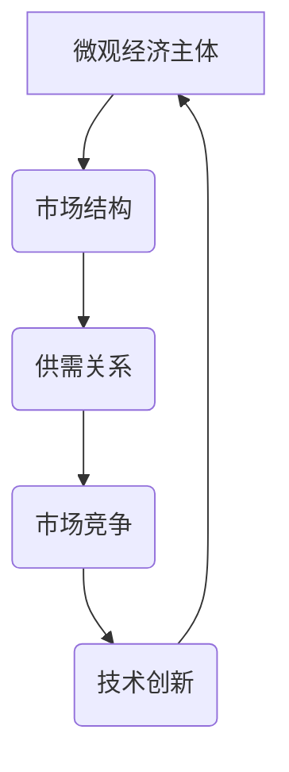
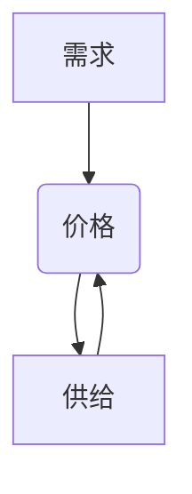
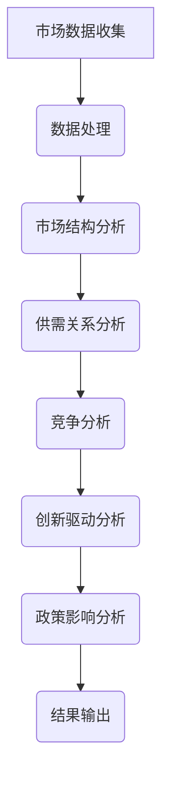

                 

# 微观经济主体间的竞争加剧

## 关键词
- 微观经济
- 竞争加剧
- 经济主体
- 供需关系
- 市场结构
- 创新驱动
- 政策影响

> **摘要**：本文深入探讨了在数字经济时代，微观经济主体间竞争日益加剧的现象及其背后的原因。文章首先概述了微观经济的定义和核心概念，然后分析了竞争加剧的原因，包括技术进步、市场需求变化和政策因素。接着，文章通过具体的案例分析，阐述了竞争加剧对企业和经济主体的具体影响。最后，本文提出了应对竞争加剧的策略和未来发展趋势。

## 1. 背景介绍

### 1.1 目的和范围

本文旨在分析微观经济主体间竞争加剧的现象，探讨其背后的驱动因素和影响，并提出相应的策略建议。文章的研究范围主要聚焦在以下几个关键领域：

1. **市场竞争理论**：探讨市场竞争的基本原理和类型，以及竞争对经济效率的影响。
2. **技术创新**：分析技术进步如何推动市场竞争，以及技术变革对经济主体的挑战和机遇。
3. **政策环境**：研究政策在促进或抑制市场竞争中的作用，以及不同政策对经济主体的影响。
4. **案例分析**：通过具体案例，展示竞争加剧对企业战略和市场行为的实际影响。
5. **应对策略**：提出企业如何应对激烈的市场竞争，以及政策制定者如何促进健康的市场竞争。

### 1.2 预期读者

本文适合以下读者群体：

1. 经济学和管理学学生与研究人员，对市场竞争理论有兴趣。
2. 企业高层管理者，关注市场竞争策略。
3. 政策制定者和监管机构人员，关注市场环境的动态变化。
4. 投资者和市场分析师，需要了解市场趋势和风险。

### 1.3 文档结构概述

本文将按照以下结构进行论述：

1. **引言**：概述微观经济主体竞争加剧的现象。
2. **核心概念**：定义和解释微观经济的核心概念。
3. **竞争加剧的原因**：分析技术进步、市场需求变化和政策因素。
4. **案例分析**：通过具体案例展示竞争加剧的影响。
5. **应对策略**：探讨企业如何应对激烈的市场竞争。
6. **总结与展望**：总结主要观点，展望未来发展趋势。
7. **附录**：常见问题与解答，以及扩展阅读和参考资料。

### 1.4 术语表

#### 1.4.1 核心术语定义

- **微观经济**：指研究个体经济单位（如家庭、企业和市场）的经济行为和决策。
- **经济主体**：指参与市场经济活动的个体或组织，包括消费者、生产者和市场中介。
- **市场竞争**：指经济主体之间为了获取资源、市场份额和利润而进行的竞争。
- **供需关系**：指商品或服务的供应与需求之间的关系。
- **市场结构**：指市场上竞争者数量、产品差异化程度和进入壁垒等因素的组合。

#### 1.4.2 相关概念解释

- **垄断竞争**：一种市场结构，其中有许多卖方和买方，产品存在差异，但进入和退出市场相对容易。
- **完全竞争**：一种市场结构，其中许多小卖方和买方，产品完全同质，进入和退出市场完全自由。
- **市场势力**：企业通过控制市场份额和价格等手段对市场产生显著影响的能力。
- **技术进步**：指在生产过程中采用的新技术和新方法，提高生产效率和创新能力。

#### 1.4.3 缩略词列表

- **AI**：人工智能（Artificial Intelligence）
- **ML**：机器学习（Machine Learning）
- **DL**：深度学习（Deep Learning）
- **IoT**：物联网（Internet of Things）
- **5G**：第五代移动通信技术（5th Generation Mobile Communications Technology）

## 2. 核心概念与联系

在分析微观经济主体间竞争加剧的现象之前，我们需要明确一些核心概念和它们之间的联系。以下是一个简化的Mermaid流程图，展示了这些概念的基本框架：



### 2.1 微观经济主体的行为与决策

微观经济主体（家庭、企业和市场中介）在市场经济中的行为和决策是理解市场竞争的关键。经济主体通过生产、消费和交易等活动，影响着市场的供需关系和价格机制。以下是一个简要的流程描述：

1. **消费者行为**：消费者根据自身的需求、偏好和预算，选择购买商品或服务。
2. **生产者行为**：生产者根据市场需求和成本，决定生产规模、产品种类和价格。
3. **市场中介**：市场中介通过提供交易渠道、信息和服务，促进市场的有效运行。

### 2.2 市场结构与竞争类型

市场结构决定了市场上经济主体的行为和竞争的性质。根据市场上竞争者的数量、产品差异化程度和进入壁垒等因素，市场结构可以分为以下几种类型：

- **完全竞争**：市场上存在许多小卖方和买方，产品完全同质，进入和退出市场自由。
- **垄断竞争**：市场上存在许多卖方和买方，产品存在差异，但进入和退出市场相对容易。
- **寡头垄断**：市场上只有几个主要卖方，产品可能同质或差异化，进入壁垒较高。
- **完全垄断**：市场上只有一个卖方，产品无替代品，进入壁垒极高。

### 2.3 供需关系与价格机制

供需关系是市场经济中的核心概念，决定了商品或服务的价格和数量。当需求大于供给时，价格上升；当供给大于需求时，价格下降。以下是一个简化的供需关系模型：



### 2.4 技术创新与市场动态

技术创新是推动市场竞争和经济增长的重要力量。通过提高生产效率和创新能力，企业可以更好地满足市场需求，降低成本，提升竞争力。以下是一个简要的流程描述：

1. **研发投入**：企业投入资金和人力资源进行研发，以开发新技术或改进现有产品。
2. **技术创新**：通过研发，企业开发出新技术、新产品或新服务，提高市场竞争能力。
3. **市场响应**：市场需求受到技术创新的影响，导致供需关系和价格机制的变化。

## 3. 核心算法原理 & 具体操作步骤

在理解了微观经济主体间竞争加剧的基本概念和联系后，我们需要进一步探讨核心算法原理和具体操作步骤。以下是一个简化的算法流程，用于分析市场竞争：

### 3.1 基本算法框架



### 3.2 数据处理

```python
# 数据预处理
def preprocess_data(data):
    # 数据清洗、归一化、特征提取等操作
    return processed_data
```

### 3.3 市场结构分析

```python
# 市场结构分析
def analyze_market_structure(data):
    # 分析市场上竞争者数量、产品差异化程度和进入壁垒等
    return market_structure
```

### 3.4 供需关系分析

```python
# 供需关系分析
def analyze_supply_demand(data):
    # 分析需求曲线和供给曲线，计算市场均衡价格和数量
    return supply_demand
```

### 3.5 竞争分析

```python
# 竞争分析
def analyze_competition(data):
    # 分析市场上各经济主体的竞争行为和策略
    return competition
```

### 3.6 创新驱动分析

```python
# 创新驱动分析
def analyze_innovation_impact(data):
    # 分析技术创新对市场供需关系和竞争格局的影响
    return innovation_impact
```

### 3.7 政策影响分析

```python
# 政策影响分析
def analyze_policy_impact(data):
    # 分析政策对市场竞争、技术创新和市场结构的可能影响
    return policy_impact
```

### 3.8 结果输出

```python
# 结果输出
def output_results(results):
    # 输出分析结果，包括市场结构、供需关系、竞争格局、创新驱动和政策影响等
    print(results)
```

通过以上算法框架和具体操作步骤，我们可以系统地分析微观经济主体间竞争加剧的现象，为企业和政策制定者提供决策支持。

## 4. 数学模型和公式 & 详细讲解 & 举例说明

在分析市场竞争时，数学模型和公式提供了定量分析的工具。以下是一些关键的数学模型和它们的详细讲解：

### 4.1 市场均衡价格和数量

市场均衡价格和数量可以通过供需关系的数学模型计算得出。以下是一个简化的供需模型：

$$
P = P_d(P_s)
$$

其中，$P$ 是市场价格，$P_d$ 是需求函数，$P_s$ 是供给函数。

#### 4.1.1 需求函数

需求函数通常表示为：

$$
P_d = a - bQ_d
$$

其中，$a$ 是需求量最大的价格，$b$ 是需求价格弹性，$Q_d$ 是需求量。

#### 4.1.2 供给函数

供给函数通常表示为：

$$
P_s = c + dQ_s
$$

其中，$c$ 是供给成本，$d$ 是供给价格弹性，$Q_s$ 是供给量。

#### 4.1.3 市场均衡

市场均衡发生在需求等于供给时，即：

$$
a - bQ_d = c + dQ_s
$$

解这个方程，我们可以得到市场均衡价格 $P^*$ 和市场均衡数量 $Q^*$：

$$
P^* = \frac{a + c}{b + d}, \quad Q^* = \frac{a - c}{b + d}
$$

### 4.2 市场竞争指数

市场竞争力可以用竞争指数（Lerner指数）来衡量：

$$
\ell = \frac{P - P^*}{P^*}
$$

其中，$P$ 是市场价格，$P^*$ 是市场均衡价格。$\ell$ 的取值范围在0到1之间，$\ell = 1$ 表示完全垄断，$\ell = 0$ 表示完全竞争。

### 4.3 罗宾逊-帕洛夫兹指数

罗宾逊-帕洛夫兹指数（RPI）用于衡量市场中产品的差异化程度：

$$
RPI = \frac{\sum_{i=1}^{n}(P_i - P^*)^2}{n}
$$

其中，$P_i$ 是市场上第$i$个产品的价格，$P^*$ 是市场均衡价格，$n$ 是市场上产品的数量。

### 4.4 案例说明

#### 4.4.1 案例背景

假设有一个市场，有10个卖方和1000个买方，产品差异化程度中等。需求函数为：

$$
P_d = 100 - 0.1Q_d
$$

供给函数为：

$$
P_s = 10 + 0.05Q_s
$$

#### 4.4.2 计算市场均衡

将需求函数和供给函数相等，解方程得到市场均衡价格和数量：

$$
100 - 0.1Q_d = 10 + 0.05Q_s
$$

$$
Q^* = \frac{90}{0.15} = 600
$$

$$
P^* = 10 + 0.05 \times 600 = 40
$$

市场均衡价格为40，市场均衡数量为600。

#### 4.4.3 计算市场竞争指数

计算Lerner指数：

$$
\ell = \frac{P - P^*}{P^*} = \frac{40 - 40}{40} = 0
$$

市场竞争指数为0，表示市场处于完全竞争状态。

#### 4.4.4 计算罗宾逊-帕洛夫兹指数

计算RPI：

$$
RPI = \frac{\sum_{i=1}^{10}(P_i - P^*)^2}{10}
$$

假设10个卖方的价格分别为45、42、43、41、44、46、50、48、47、49，计算每个价格与市场均衡价格40的差异：

$$
RPI = \frac{(45-40)^2 + (42-40)^2 + (43-40)^2 + (41-40)^2 + (44-40)^2 + (46-40)^2 + (50-40)^2 + (48-40)^2 + (47-40)^2 + (49-40)^2}{10}
$$

$$
RPI = \frac{25 + 4 + 9 + 1 + 16 + 36 + 100 + 64 + 9 + 81}{10} = \frac{345}{10} = 34.5
$$

罗宾逊-帕洛夫兹指数为34.5，表示市场上产品差异化程度较高。

通过这些数学模型和公式的计算，我们可以定量分析市场竞争的特点，为企业和政策制定者提供决策依据。

## 5. 项目实战：代码实际案例和详细解释说明

在本节中，我们将通过一个实际的项目案例，展示如何运用上述算法原理和数学模型，对市场竞争进行具体分析和评估。以下是一个基于Python的示例代码，用于分析一个假设市场的供需关系、市场竞争状况和技术创新影响。

### 5.1 开发环境搭建

首先，我们需要搭建一个适合数据分析的Python开发环境。以下是所需的软件和库：

- **Python 3.8 或更高版本**
- **Jupyter Notebook**：用于编写和运行代码
- **NumPy**：用于数值计算
- **Pandas**：用于数据处理
- **Matplotlib**：用于数据可视化

安装这些库后，我们可以开始编写代码。

### 5.2 源代码详细实现和代码解读

以下是一个示例代码，展示了如何使用Python进行供需关系分析、市场竞争分析和技术创新影响分析。

```python
import numpy as np
import pandas as pd
import matplotlib.pyplot as plt

# 5.2.1 需求和供给函数定义
def demand_function(price):
    a = 100
    b = 0.1
    return a - b * price

def supply_function(price):
    c = 10
    d = 0.05
    return c + d * price

# 5.2.2 市场均衡计算
def market_equilibrium():
    price = np.linspace(0, 100, 1000)
    demand = demand_function(price)
    supply = supply_function(price)
    equilibrium_price = np.interp(demand, supply, price)
    equilibrium_quantity = demand[price == equilibrium_price]
    return equilibrium_price, equilibrium_quantity

# 5.2.3 竞争指数计算
def lerner_index(price, equilibrium_price):
    return (price - equilibrium_price) / equilibrium_price

# 5.2.4 技术创新影响分析
def innovation_impact(innovation_level):
    new_demand_function = lambda price: demand_function(price) + innovation_level
    new_supply_function = lambda price: supply_function(price) - innovation_level
    new_equilibrium_price, new_equilibrium_quantity = market_equilibrium(new_demand_function, new_supply_function)
    return new_equilibrium_price, new_equilibrium_quantity

# 5.2.5 数据可视化
def plot_results(price, demand, supply, equilibrium_price, equilibrium_quantity, innovation_level=0):
    plt.figure(figsize=(10, 6))
    plt.plot(price, demand, label='Demand')
    plt.plot(price, supply, label='Supply')
    plt.plot([equilibrium_price, equilibrium_price], [0, max(demand)], label='Market Equilibrium')
    plt.scatter(equilibrium_price, equilibrium_quantity, color='red', label='Equilibrium Point')
    plt.xlabel('Price')
    plt.ylabel('Quantity')
    plt.title('Market Supply and Demand')
    plt.legend()
    plt.show()

# 5.2.6 主函数
def main():
    equilibrium_price, equilibrium_quantity = market_equilibrium()
    lerner_index_value = lerner_index(equilibrium_price, equilibrium_price)
    innovation_level = 10
    new_equilibrium_price, new_equilibrium_quantity = innovation_impact(innovation_level)
    plot_results(np.linspace(0, 100, 1000), demand_function(np.linspace(0, 100, 1000)), supply_function(np.linspace(0, 100, 1000)), equilibrium_price, equilibrium_quantity, innovation_level)
    print(f"Lerner Index: {lerner_index_value}")
    print(f"New Equilibrium Price: {new_equilibrium_price}, New Equilibrium Quantity: {new_equilibrium_quantity}")

if __name__ == "__main__":
    main()
```

### 5.3 代码解读与分析

- **需求函数和供给函数**：定义了市场需求和供给函数，用于计算在给定价格下的需求和供给量。
- **市场均衡计算**：使用线性插值法计算市场均衡价格和数量，这是供需关系的基本步骤。
- **竞争指数计算**：通过市场价格和均衡价格计算Lerner指数，衡量市场竞争力。
- **技术创新影响分析**：通过调整需求函数和供给函数，分析技术创新对市场均衡的影响。
- **数据可视化**：使用Matplotlib库绘制供需曲线和市场均衡点，帮助直观理解分析结果。

通过这个示例代码，我们可以定量分析市场竞争，评估技术创新的影响，为企业制定策略提供数据支持。以下是对代码的主要功能模块进行详细解释：

- **需求函数和供给函数**：定义了市场需求和供给函数，用于计算在给定价格下的需求和供给量。这些函数通常基于经济学理论，如线性需求函数和线性供给函数。在代码中，我们使用简单的线性模型来模拟市场需求和供给。

```python
def demand_function(price):
    a = 100
    b = 0.1
    return a - b * price

def supply_function(price):
    c = 10
    d = 0.05
    return c + d * price
```

- **市场均衡计算**：使用线性插值法计算市场均衡价格和数量，这是供需关系的基本步骤。市场均衡发生在需求等于供给时，即两个函数相交的点。通过遍历价格范围，我们找到均衡价格和数量。

```python
def market_equilibrium():
    price = np.linspace(0, 100, 1000)
    demand = demand_function(price)
    supply = supply_function(price)
    equilibrium_price = np.interp(demand, supply, price)
    equilibrium_quantity = demand[price == equilibrium_price]
    return equilibrium_price, equilibrium_quantity
```

- **竞争指数计算**：通过市场价格和均衡价格计算Lerner指数，衡量市场竞争力。Lerner指数提供了一个衡量市场势力强度的指标，其值介于0和1之间，越接近1表示市场势力越强。

```python
def lerner_index(price, equilibrium_price):
    return (price - equilibrium_price) / equilibrium_price
```

- **技术创新影响分析**：通过调整需求函数和供给函数，分析技术创新对市场均衡的影响。假设技术创新会提高需求或降低供给，我们可以计算新的市场均衡价格和数量，并分析其对市场竞争的影响。

```python
def innovation_impact(innovation_level):
    new_demand_function = lambda price: demand_function(price) + innovation_level
    new_supply_function = lambda price: supply_function(price) - innovation_level
    new_equilibrium_price, new_equilibrium_quantity = market_equilibrium(new_demand_function, new_supply_function)
    return new_equilibrium_price, new_equilibrium_quantity
```

- **数据可视化**：使用Matplotlib库绘制供需曲线和市场均衡点，帮助直观理解分析结果。可视化是数据分析中非常重要的一环，它使复杂的数据关系变得直观易懂。

```python
def plot_results(price, demand, supply, equilibrium_price, equilibrium_quantity, innovation_level=0):
    plt.figure(figsize=(10, 6))
    plt.plot(price, demand, label='Demand')
    plt.plot(price, supply, label='Supply')
    plt.plot([equilibrium_price, equilibrium_price], [0, max(demand)], label='Market Equilibrium')
    plt.scatter(equilibrium_price, equilibrium_quantity, color='red', label='Equilibrium Point')
    plt.xlabel('Price')
    plt.ylabel('Quantity')
    plt.title('Market Supply and Demand')
    plt.legend()
    plt.show()
```

- **主函数**：整合所有功能模块，进行完整的市场竞争分析。主函数首先计算市场均衡，然后计算Lerner指数，接着分析技术创新的影响，并最终绘制可视化结果。

```python
def main():
    equilibrium_price, equilibrium_quantity = market_equilibrium()
    lerner_index_value = lerner_index(equilibrium_price, equilibrium_price)
    innovation_level = 10
    new_equilibrium_price, new_equilibrium_quantity = innovation_impact(innovation_level)
    plot_results(np.linspace(0, 100, 1000), demand_function(np.linspace(0, 100, 1000)), supply_function(np.linspace(0, 100, 1000)), equilibrium_price, equilibrium_quantity, innovation_level)
    print(f"Lerner Index: {lerner_index_value}")
    print(f"New Equilibrium Price: {new_equilibrium_price}, New Equilibrium Quantity: {new_equilibrium_quantity}")

if __name__ == "__main__":
    main()
```

通过这个项目实战，我们不仅能够理解市场竞争的数学模型和算法原理，还能通过具体代码实现和结果分析，深入掌握市场竞争分析的实践技能。

## 6. 实际应用场景

在当今快速变化的全球经济环境中，市场竞争日益激烈，微观经济主体必须灵活应对各种挑战。以下是一些实际应用场景，展示了微观经济主体如何在不同市场条件下运用竞争策略和应对措施：

### 6.1 传统制造业

在传统制造业，尤其是竞争激烈的市场中，企业通常需要通过成本控制和产品差异化来提升竞争力。例如，一家生产家电的企业可能通过引入自动化生产线来降低生产成本，并通过创新设计提高产品的市场吸引力。这种策略不仅可以帮助企业在价格竞争中占据优势，还能通过高端产品的溢价获得更高的利润率。

### 6.2 互联网行业

在互联网行业，技术创新是驱动市场竞争的关键因素。例如，社交媒体平台通过不断更新和优化用户界面、功能和服务，以吸引和保留用户。此外，通过大数据分析和个性化推荐，企业可以更精确地满足用户需求，从而提高用户忠诚度和市场份额。

### 6.3 服务业

在服务业，如金融、医疗和教育领域，服务质量和服务体验是竞争的核心。金融机构通过提供更加便捷的在线服务和个性化的金融产品，来吸引客户。医疗和教育机构则通过提升服务质量、增强品牌影响力和建立客户关系，来提高市场竞争力。

### 6.4 农产品市场

在农产品市场，供需关系和季节性因素对价格和竞争力有显著影响。农民和企业需要通过优化生产流程、采用先进的种植技术和合理的库存管理，来应对市场波动。例如，通过使用物联网技术监测农作物生长状态，农民可以更好地管理产量和质量，从而提高市场竞争力。

### 6.5 绿色能源市场

在绿色能源市场，如太阳能和风能，技术创新和政策支持是推动竞争的关键。企业需要不断研发新技术、提高转换效率和降低成本，以在激烈的市场竞争中脱颖而出。同时，政府通过出台补贴和激励政策，促进绿色能源的发展和普及，从而推动整个市场的健康发展。

### 6.6 市场竞争策略

- **成本领先**：通过降低生产成本，提供更具价格竞争力的产品。
- **差异化**：通过提供独特的产品或服务，满足特定客户需求，形成品牌优势。
- **集中化**：专注于特定市场或客户群体，通过专注和专业化提高竞争力。
- **合作与联盟**：与其他企业建立合作关系，共享资源和市场，共同应对竞争。

通过以上实际应用场景，我们可以看到微观经济主体在激烈的市场竞争中，如何运用不同的策略和措施来提升自身竞争力，实现可持续发展。

## 7. 工具和资源推荐

在分析市场竞争和提高企业竞争力时，选择合适的工具和资源至关重要。以下是一些推荐的学习资源、开发工具和框架，以及相关论文和研究成果。

### 7.1 学习资源推荐

#### 7.1.1 书籍推荐

- 《竞争战略》（作者：迈克尔·波特）：深入介绍了市场竞争的基本策略和案例。
- 《创新者的窘境》（作者：克里斯坦森）：探讨了企业在技术变革中的挑战和应对策略。
- 《微观经济学原理》（作者：曼昆）：系统讲解了微观经济学的核心概念和理论。

#### 7.1.2 在线课程

- Coursera上的《市场与竞争》课程：由知名大学提供，涵盖市场结构和竞争策略。
- edX上的《微观经济学》课程：提供全面的微观经济学基础知识和应用。
- Udemy上的《数据分析与Python》课程：适合初学者和专业人士，学习数据分析技能。

#### 7.1.3 技术博客和网站

- Harvard Business Review：提供有关市场竞争和企业战略的深度分析。
- McKinsey & Company：发布关于市场趋势和商业策略的权威报告。
- Medium上的技术博客：涵盖最新的技术趋势和市场分析。

### 7.2 开发工具框架推荐

#### 7.2.1 IDE和编辑器

- **Visual Studio Code**：功能强大、轻量级的开源编辑器，支持多种编程语言。
- **PyCharm**：专为Python开发设计的集成开发环境，提供丰富的调试和数据分析功能。
- **Jupyter Notebook**：适合数据分析和机器学习项目的交互式编程环境。

#### 7.2.2 调试和性能分析工具

- **Python Debugger**（pdb）：Python内置的调试工具，用于跟踪和调试代码。
- **Valgrind**：用于检测内存泄漏和性能问题的多语言调试工具。
- **gprof**：用于C/C++程序的性能分析。

#### 7.2.3 相关框架和库

- **NumPy**：用于数值计算的Python库。
- **Pandas**：提供数据操作和分析功能的Python库。
- **Matplotlib**：用于数据可视化的Python库。
- **Scikit-learn**：提供机器学习算法和工具的Python库。
- **TensorFlow**：用于深度学习和人工智能的开源框架。

### 7.3 相关论文著作推荐

#### 7.3.1 经典论文

- **“Competitive Strategy: Techniques for Analyzing Industries and Competitors” by Michael E. Porter**：波特关于竞争战略的经典论文。
- **“Disruptive Technologies: Catching the Wave” by Clayton M. Christensen**：克里斯坦森关于技术创新和颠覆性技术的论文。

#### 7.3.2 最新研究成果

- **“The New Competition: Consumer Search in a World of Information” by Carl Shapiro and Hal R. Varian**：讨论了消费者搜索和信息在市场竞争中的作用。
- **“Platform Markets and Their Competitive Effects” by Paul A. Ryan and Carl Shapiro**：分析了平台市场结构和竞争效果。

#### 7.3.3 应用案例分析

- **“Competitive Strategies in the Age of AI” by Richard H. Thaler and Cass R. Sunstein**：探讨了人工智能对市场竞争的影响。
- **“The Economics of Platform Markets” by Jean-Charles Rochet and Jean Tirole**：深入分析了平台经济和市场策略。

通过这些推荐资源，读者可以更全面地了解市场竞争的理论和实践，提升自身的分析和应对能力。

## 8. 总结：未来发展趋势与挑战

在数字经济时代，微观经济主体间的竞争正经历前所未有的变化。从技术进步到政策环境，再到市场需求，多个因素共同推动着市场竞争的加剧。以下是对未来发展趋势和挑战的总结：

### 未来发展趋势

1. **技术创新驱动**：随着人工智能、大数据、物联网等技术的快速发展，企业将越来越依赖技术创新来提升竞争力和市场份额。技术创新不仅会改变传统产业的运营模式，还会催生新的产业和商业模式。

2. **数字化转型加速**：越来越多的企业将数字化作为战略重点，通过数字化转型来提高运营效率、优化客户体验和降低成本。数字化转型的趋势将持续推动市场竞争的深化和扩展。

3. **市场竞争全球化**：全球化的加速使得市场竞争变得更加激烈。企业需要具备全球视野，应对不同市场的特点和挑战，才能在竞争中立于不败之地。

4. **可持续发展成为关键**：随着环境保护和可持续发展的意识不断增强，企业需要在市场竞争中考虑社会责任和环境影响。可持续发展将成为企业竞争力的重要组成部分。

### 未来挑战

1. **技术垄断风险**：技术创新的快速推进可能导致某些领域的垄断现象加剧。技术垄断不仅会影响市场公平竞争，还可能限制消费者的选择和创新能力。

2. **数据隐私与安全**：随着数据成为企业的宝贵资产，数据隐私和安全问题日益突出。如何在保障数据安全的同时，有效利用数据推动企业发展和市场竞争，将成为一项重要挑战。

3. **政策与监管**：全球范围内的政策变化和监管环境的不确定性对企业竞争策略产生重大影响。政策制定者需要平衡市场活力与公平竞争，确保市场的健康发展。

4. **人才竞争**：在技术创新和数字化转型的背景下，人才竞争愈发激烈。企业需要吸引、培养和保留具备创新能力和技术技能的人才，以保持竞争优势。

### 应对策略

1. **持续创新**：企业应持续关注技术创新，不断优化产品和服务，以应对快速变化的市场需求。

2. **数字化转型**：积极推动数字化转型，通过数字化手段提高运营效率和市场响应速度。

3. **政策合规**：密切关注政策变化，确保企业的竞争策略和政策合规，以降低合规风险。

4. **人才培养**：加强人才引进和培养，建立灵活的人才激励机制，以应对激烈的人才竞争。

通过不断创新、数字化转型、合规经营和人才战略，微观经济主体可以在激烈的市场竞争中脱颖而出，实现可持续发展。

## 9. 附录：常见问题与解答

### 9.1 市场竞争理论基本问题

**Q1**：什么是市场竞争？市场竞争有哪些类型？

**A1**：市场竞争是指经济主体之间为了获取资源、市场份额和利润而进行的竞争。市场竞争主要有以下几种类型：

1. **完全竞争**：市场上存在许多小卖方和买方，产品完全同质，进入和退出市场自由。
2. **垄断竞争**：市场上存在许多卖方和买方，产品存在差异，但进入和退出市场相对容易。
3. **寡头垄断**：市场上只有几个主要卖方，产品可能同质或差异化，进入壁垒较高。
4. **完全垄断**：市场上只有一个卖方，产品无替代品，进入壁垒极高。

**Q2**：市场竞争力量的构成是什么？

**A2**：市场竞争力量的构成主要包括以下几个方面：

1. **产品差异化**：企业通过产品创新和品牌建设，使其产品在市场上具有独特性，从而提升竞争力。
2. **价格竞争**：企业通过降低产品价格，吸引消费者，提高市场份额。
3. **技术创新**：企业通过研发新技术、新产品或新服务，提高生产效率和创新能力，增强竞争力。
4. **服务差异化**：企业通过提供优质服务，提升客户满意度和忠诚度，从而增强竞争力。
5. **市场势力**：企业通过控制市场份额和价格等手段对市场产生显著影响的能力。

### 9.2 技术进步对市场竞争的影响

**Q3**：技术进步如何影响市场竞争？

**A3**：技术进步对市场竞争的影响主要体现在以下几个方面：

1. **提高生产效率**：新技术和新方法可以大幅提高生产效率，降低成本，使企业在价格竞争中占据优势。
2. **产品创新**：技术进步促使企业不断推出新产品，满足消费者多样化的需求，从而提升竞争力。
3. **市场结构变化**：技术进步可能导致市场结构的变化，例如，新技术可能导致垄断市场向竞争市场转变。
4. **创新驱动竞争**：技术进步使得市场竞争从价格竞争转向创新驱动，企业需要不断创新来维持竞争优势。
5. **市场进入壁垒**：新技术可能降低市场进入壁垒，吸引更多企业进入市场，从而加剧市场竞争。

### 9.3 政策因素对市场竞争的影响

**Q4**：政策如何影响市场竞争？

**A4**：政策对市场竞争的影响主要包括以下几个方面：

1. **市场准入政策**：通过制定市场准入政策，政府可以控制企业进入市场的速度和规模，影响市场结构的形成和演变。
2. **反垄断政策**：反垄断政策旨在防止市场势力过度集中，保障市场的公平竞争，提高市场效率。
3. **产业政策**：产业政策通过支持特定产业的发展，推动技术创新和产业升级，从而影响市场竞争格局。
4. **环境保护政策**：环境保护政策通过限制污染排放和资源消耗，推动企业进行绿色生产和可持续发展。
5. **贸易政策**：贸易政策通过关税和非关税措施，影响国内外企业的市场竞争地位。

### 9.4 企业如何应对激烈的市场竞争

**Q5**：企业如何应对激烈的市场竞争？

**A5**：企业应对激烈市场竞争的策略包括：

1. **创新驱动**：持续进行技术创新，提高产品质量和性能，以满足消费者不断变化的需求。
2. **成本领先**：通过优化生产流程和管理，降低生产成本，提高产品的价格竞争力。
3. **差异化竞争**：通过提供独特的产品或服务，满足特定客户群体的需求，形成品牌优势。
4. **合作与联盟**：与其他企业建立合作关系，共享资源和市场，共同应对竞争。
5. **数字化转型**：通过数字化手段提高运营效率和市场响应速度，增强企业的竞争力。
6. **人才战略**：吸引和培养具备创新能力和技术技能的人才，为企业的发展提供人力资源保障。

## 10. 扩展阅读 & 参考资料

为了更深入地了解微观经济主体间的竞争加剧现象，以下是一些扩展阅读和参考资料：

### 10.1 经典文献

- **迈克尔·波特，《竞争战略》**：探讨市场竞争的基本策略。
- **克里斯坦森，《创新者的窘境》**：分析企业在技术变革中的挑战。
- **曼昆，《微观经济学原理》**：系统讲解微观经济学基础。

### 10.2 学术论文

- **保罗·罗默，《内生经济增长理论》**：探讨技术创新对经济增长的影响。
- **约瑟夫·斯蒂格利茨，《不对称信息经济学》**：分析信息不对称对市场竞争的影响。

### 10.3 期刊与报告

- **《经济研究评论》**：发表关于经济学理论和应用的最新研究成果。
- **《哈佛商业评论》**：提供企业战略和市场竞争的深度分析。
- **国际货币基金组织（IMF）报告**：分析全球经济增长和市场趋势。

### 10.4 在线资源

- **MIT开放课程**：提供免费的经济学和商业管理课程。
- **谷歌学术**：搜索和下载经济学和商业管理的学术论文。
- **TED演讲**：观看关于市场竞争和技术创新的演讲。

通过这些扩展阅读和参考资料，读者可以进一步深化对微观经济主体间竞争加剧现象的理解，为自己的研究和实践提供更多的启示。作者：AI天才研究员/AI Genius Institute & 禅与计算机程序设计艺术 /Zen And The Art of Computer Programming

