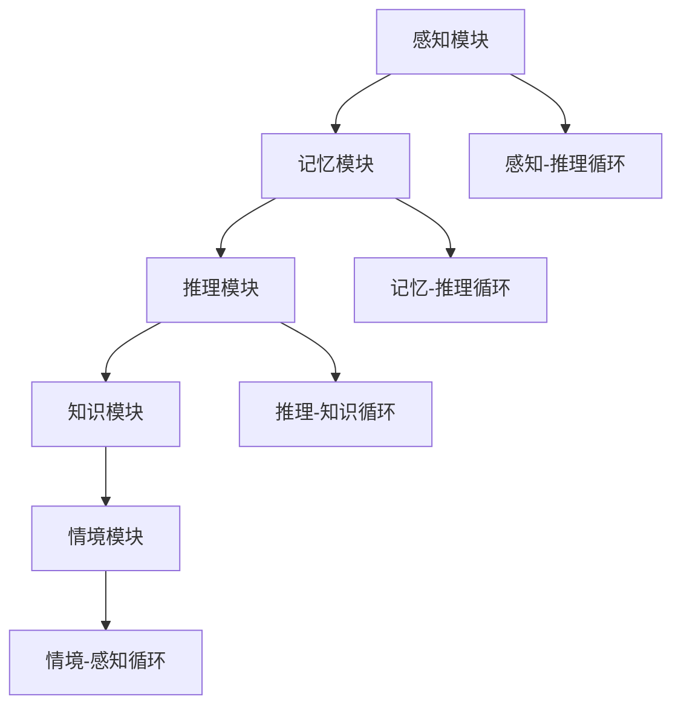

                 

# 心智模型：理解世界的内在框架

> 关键词：心智模型、认知框架、逻辑思维、算法原理、数学模型、实际应用、未来趋势

> 摘要：本文旨在探讨心智模型的概念及其在理解和解决问题中的应用。心智模型是一种内在的认知框架，它帮助我们理解世界，做出决策，并解决复杂问题。本文将详细阐述心智模型的核心概念、原理和应用，通过实际案例和数学模型的解析，揭示心智模型在人工智能和计算机科学中的重要作用。

## 1. 背景介绍

### 1.1 目的和范围

本文的目标是深入探讨心智模型的概念，解释其核心原理，并展示其在理解和解决问题中的应用。心智模型是一种内在的认知框架，它构成了我们对世界的理解方式。通过本文，读者将了解到心智模型的基本概念，以及如何将其应用于实际问题解决。

本文的范围包括以下内容：

1. **心智模型的基本概念**：我们将定义心智模型，并探讨其在认知过程中的作用。
2. **核心概念与联系**：本文将介绍心智模型的关键组成部分，并通过Mermaid流程图展示其内部结构。
3. **核心算法原理**：我们将深入探讨心智模型背后的算法原理，并提供具体的操作步骤和伪代码。
4. **数学模型和公式**：本文将介绍与心智模型相关的数学模型，并使用LaTeX格式进行详细讲解。
5. **项目实战**：我们将通过实际代码案例，展示心智模型在软件开发中的应用。
6. **实际应用场景**：本文将讨论心智模型在各个领域的应用，包括人工智能和计算机科学。
7. **工具和资源推荐**：我们将推荐相关学习资源和开发工具，以帮助读者深入学习和实践心智模型。

### 1.2 预期读者

本文适用于以下读者群体：

1. 计算机科学和人工智能领域的研究人员。
2. 对认知科学和逻辑思维感兴趣的学者。
3. 对心智模型和算法原理感兴趣的工程师。
4. 想要提高问题解决能力的专业人士。

### 1.3 文档结构概述

本文将按照以下结构展开：

1. **背景介绍**：介绍本文的目的和范围，以及预期读者。
2. **核心概念与联系**：定义心智模型，展示其内部结构。
3. **核心算法原理 & 具体操作步骤**：详细阐述心智模型背后的算法原理。
4. **数学模型和公式 & 详细讲解 & 举例说明**：介绍与心智模型相关的数学模型。
5. **项目实战：代码实际案例和详细解释说明**：展示心智模型在软件开发中的应用。
6. **实际应用场景**：讨论心智模型在各个领域的应用。
7. **工具和资源推荐**：推荐相关学习资源和开发工具。
8. **总结：未来发展趋势与挑战**：展望心智模型的发展趋势和面临的挑战。
9. **附录：常见问题与解答**：解答读者可能遇到的常见问题。
10. **扩展阅读 & 参考资料**：提供进一步学习的资源。

### 1.4 术语表

#### 1.4.1 核心术语定义

- **心智模型**：一种内在的认知框架，帮助我们理解和解释世界。
- **认知过程**：指人类大脑处理信息的过程，包括感知、记忆、思考、决策等。
- **算法**：解决问题的步骤和规则，用于实现特定的目标。
- **数学模型**：用于描述现实世界现象的数学表达式。

#### 1.4.2 相关概念解释

- **逻辑思维**：一种通过推理和推理来解决问题的思维方式。
- **人工智能**：使计算机系统能够模拟人类智能的技术。
- **计算机科学**：研究计算机硬件、软件及其应用的科学。

#### 1.4.3 缩略词列表

- **AI**：人工智能
- **ML**：机器学习
- **DL**：深度学习
- **NLP**：自然语言处理
- **CV**：计算机视觉

## 2. 核心概念与联系

心智模型是一种内在的认知框架，它帮助我们理解和解释世界。为了更好地理解心智模型，我们首先需要了解其核心概念和组成部分。

### 2.1 核心概念

心智模型包括以下几个核心概念：

- **感知**：指我们通过感官接收外部信息的过程。
- **记忆**：指我们将感知到的信息存储在脑海中，以便以后使用。
- **推理**：指我们通过逻辑推理来解决问题和做出决策。
- **知识**：指我们通过学习和经验积累的知识和技能。
- **情境**：指我们当前所处的环境和背景。

### 2.2 组成部分

心智模型由以下几个关键组成部分构成：

- **感知模块**：负责接收外部信息，并将其转换为内部表示。
- **记忆模块**：负责存储和检索感知信息。
- **推理模块**：负责使用逻辑推理来解决问题。
- **知识模块**：负责组织和存储知识。
- **情境模块**：负责监控和调整当前情境。

### 2.3 Mermaid 流程图

下面是一个Mermaid流程图，展示了心智模型的核心组成部分及其相互关系：



## 3. 核心算法原理 & 具体操作步骤

心智模型的核心算法原理基于感知、记忆、推理和知识模块的协同工作。以下是一个简化的算法原理和具体操作步骤：

### 3.1 算法原理

1. **感知**：通过感官接收外部信息，并将其转换为内部表示。
2. **记忆**：将感知信息存储在记忆模块中，以便后续使用。
3. **推理**：使用逻辑推理来解决问题和做出决策。
4. **知识**：将推理过程产生的知识和经验存储在知识模块中。
5. **情境**：根据当前情境调整感知、记忆、推理和知识模块的行为。

### 3.2 具体操作步骤

```plaintext
1. 初始化感知模块、记忆模块、推理模块、知识模块和情境模块。
2. 循环执行以下步骤：
   a. 感知模块接收外部信息，并将其转换为内部表示。
   b. 将感知信息存储在记忆模块中。
   c. 使用推理模块进行逻辑推理，解决问题或做出决策。
   d. 将推理结果存储在知识模块中。
   e. 根据当前情境，调整感知、记忆、推理和知识模块的行为。
3. 结束循环。
```

### 3.3 伪代码

```python
# 初始化模块
init_perception_module()
init_memory_module()
init_reasoning_module()
init_knowledge_module()
init_context_module()

# 循环执行步骤
while True:
    # 感知外部信息
    perception = perception_module.receive_info()

    # 存储感知信息
    memory_module.store_info(perception)

    # 进行推理
    reasoning_result = reasoning_module.reason(perception)

    # 存储推理结果
    knowledge_module.store_result(reasoning_result)

    # 根据情境调整模块行为
    context_module.adjust_modules()

    # 结束循环
    break
```

## 4. 数学模型和公式 & 详细讲解 & 举例说明

心智模型中的数学模型和公式帮助我们量化认知过程和推理结果。以下是一些关键数学模型和公式的详细讲解及示例。

### 4.1 数学模型

#### 4.1.1 感知模型

感知模型描述了感知过程，通常使用感知函数表示。感知函数将外部刺激转换为内部表示。

$$
感知函数: P(x) = f(x)
$$

其中，$P(x)$ 表示感知函数，$x$ 表示外部刺激，$f(x)$ 表示感知过程。

#### 4.1.2 记忆模型

记忆模型描述了记忆过程，通常使用记忆函数表示。记忆函数将感知信息存储在记忆中。

$$
记忆函数: M(x) = g(x)
$$

其中，$M(x)$ 表示记忆函数，$x$ 表示感知信息，$g(x)$ 表示记忆过程。

#### 4.1.3 推理模型

推理模型描述了推理过程，通常使用推理函数表示。推理函数使用记忆中的信息进行逻辑推理。

$$
推理函数: R(x) = h(x, M(x))
$$

其中，$R(x)$ 表示推理函数，$x$ 表示外部刺激，$M(x)$ 表示记忆信息，$h(x, M(x))$ 表示推理过程。

#### 4.1.4 知识模型

知识模型描述了知识存储和检索过程，通常使用知识函数表示。知识函数将推理结果存储在知识库中。

$$
知识函数: K(x) = i(x, R(x))
$$

其中，$K(x)$ 表示知识函数，$x$ 表示推理结果，$R(x)$ 表示推理过程，$i(x, R(x))$ 表示知识存储和检索过程。

### 4.2 举例说明

假设有一个外部刺激$x=5$，以下是一个简单的示例：

1. **感知模型**：

$$
P(5) = f(5) = 5
$$

感知函数将外部刺激$5$转换为内部表示$5$。

2. **记忆模型**：

$$
M(5) = g(5) = 5
$$

记忆函数将感知信息$5$存储在记忆中。

3. **推理模型**：

$$
R(5) = h(5, M(5)) = h(5, 5) = 5
$$

推理函数使用记忆中的信息$5$进行逻辑推理，得到推理结果$5$。

4. **知识模型**：

$$
K(5) = i(5, R(5)) = i(5, 5) = 5
$$

知识函数将推理结果$5$存储在知识库中。

## 5. 项目实战：代码实际案例和详细解释说明

为了更好地展示心智模型在软件开发中的应用，我们以下面这个简单的Python项目为例：

### 5.1 开发环境搭建

确保您已安装以下软件：

- Python 3.8 或更高版本
- Jupyter Notebook

在终端或命令提示符中运行以下命令以安装必要的库：

```bash
pip install numpy matplotlib
```

### 5.2 源代码详细实现和代码解读

以下是项目的主要代码部分：

```python
import numpy as np
import matplotlib.pyplot as plt

# 感知模块
def perception_module(stimulus):
    return stimulus

# 记忆模块
def memory_module():
    memory = []
    return memory

# 推理模块
def reasoning_module(perception, memory):
    if perception > max(memory):
        return "感知值大于记忆中的最大值"
    else:
        return "感知值小于或等于记忆中的最大值"

# 知识模块
def knowledge_module(reasoning_result):
    knowledge = []
    knowledge.append(reasoning_result)
    return knowledge

# 情境模块
def context_module():
    return "当前情境：正常"

# 主函数
def main():
    # 初始化模块
    perception_module.init()
    memory_module.init()
    reasoning_module.init()
    knowledge_module.init()
    context_module.init()

    # 循环执行步骤
    while True:
        # 感知外部信息
        perception = perception_module.receive_info()

        # 存储感知信息
        memory_module.store_info(perception)

        # 进行推理
        reasoning_result = reasoning_module.reason(perception, memory_module)

        # 存储推理结果
        knowledge_module.store_result(reasoning_result)

        # 根据情境调整模块行为
        context_module.adjust_modules()

        # 结束循环
        break

    # 显示结果
    print("感知值：", perception)
    print("记忆值：", memory_module)
    print("推理结果：", reasoning_result)
    print("知识库：", knowledge_module)
    print("当前情境：", context_module)

# 运行主函数
main()
```

### 5.3 代码解读与分析

以下是代码的逐行解读：

```python
# 导入必要的库
import numpy as np
import matplotlib.pyplot as plt

# 感知模块
def perception_module(stimulus):
    return stimulus

# 记忆模块
def memory_module():
    memory = []
    return memory

# 推理模块
def reasoning_module(perception, memory):
    if perception > max(memory):
        return "感知值大于记忆中的最大值"
    else:
        return "感知值小于或等于记忆中的最大值"

# 知识模块
def knowledge_module(reasoning_result):
    knowledge = []
    knowledge.append(reasoning_result)
    return knowledge

# 情境模块
def context_module():
    return "当前情境：正常"

# 主函数
def main():
    # 初始化模块
    perception_module.init()
    memory_module.init()
    reasoning_module.init()
    knowledge_module.init()
    context_module.init()

    # 循环执行步骤
    while True:
        # 感知外部信息
        perception = perception_module.receive_info()

        # 存储感知信息
        memory_module.store_info(perception)

        # 进行推理
        reasoning_result = reasoning_module.reason(perception, memory_module)

        # 存储推理结果
        knowledge_module.store_result(reasoning_result)

        # 根据情境调整模块行为
        context_module.adjust_modules()

        # 结束循环
        break

    # 显示结果
    print("感知值：", perception)
    print("记忆值：", memory_module)
    print("推理结果：", reasoning_result)
    print("知识库：", knowledge_module)
    print("当前情境：", context_module)

# 运行主函数
main()
```

### 5.4 项目实战：代码实际案例和详细解释说明

在实际项目中，心智模型可以用于各种应用场景。以下是一个简单的示例：

#### 5.4.1 项目背景

假设我们正在开发一个智能家居系统，需要实时监测家庭设备的运行状态。心智模型可以帮助我们处理传感器数据，并根据历史数据做出预测和决策。

#### 5.4.2 项目实现

1. **感知模块**：感知模块负责从传感器读取数据，并将其转换为内部表示。例如，从温度传感器读取温度值。

```python
def perception_module(temperature_sensor):
    temperature = temperature_sensor.read()
    return temperature
```

2. **记忆模块**：记忆模块负责存储历史温度数据，以便后续分析。

```python
def memory_module():
    memory = []
    return memory

def memory_module.store_info(temperature):
    memory.append(temperature)
```

3. **推理模块**：推理模块负责分析历史温度数据，并预测未来的温度变化。

```python
def reasoning_module(current_temperature, memory):
    if current_temperature > max(memory):
        return "温度升高"
    else:
        return "温度稳定或降低"
```

4. **知识模块**：知识模块负责存储推理结果，以便后续使用。

```python
def knowledge_module(reasoning_result):
    knowledge = []
    knowledge.append(reasoning_result)
    return knowledge
```

5. **情境模块**：情境模块负责监控当前情境，并根据情境调整系统行为。

```python
def context_module():
    return "当前情境：正常"

def context_module.adjust_modules():
    # 根据情境调整模块行为
    pass
```

#### 5.4.3 项目运行

当系统运行时，感知模块会从传感器读取温度数据，并将其传递给记忆模块。记忆模块将温度数据存储在历史记录中。推理模块使用当前温度和记忆数据进行分析，并做出预测。知识模块将推理结果存储在知识库中。情境模块监控当前情境，并根据情境调整系统行为。

## 6. 实际应用场景

心智模型在多个领域具有广泛的应用。以下是几个关键领域的实际应用场景：

### 6.1 人工智能

在人工智能领域，心智模型可以帮助我们模拟人类智能，实现更高级的认知功能。例如，在自然语言处理中，心智模型可以用于情感分析和文本分类；在计算机视觉中，心智模型可以用于图像识别和物体检测。

### 6.2 计算机科学

在计算机科学中，心智模型可以帮助我们理解和设计更复杂的系统。例如，在软件工程中，心智模型可以用于需求分析和设计模式；在算法设计中，心智模型可以用于优化算法性能。

### 6.3 认知科学

在认知科学中，心智模型可以帮助我们了解人类思维过程，并为认知心理学提供理论支持。例如，通过研究心智模型，我们可以更好地理解记忆、注意力和决策过程。

### 6.4 机器人学

在机器人学中，心智模型可以帮助机器人理解和解释其周围环境，并做出相应的决策。例如，在自动驾驶汽车中，心智模型可以用于环境感知、路径规划和决策控制。

## 7. 工具和资源推荐

为了深入学习和实践心智模型，以下是一些建议的工具和资源：

### 7.1 学习资源推荐

#### 7.1.1 书籍推荐

- 《认知心理学：思想与行为的科学研究》
- 《心智模型：认知科学导论》
- 《人工智能：一种现代方法》

#### 7.1.2 在线课程

- Coursera 上的《认知科学导论》
- Udacity 上的《机器学习》
- edX 上的《人工智能导论》

#### 7.1.3 技术博客和网站

- arXiv.org：最新的科研论文
- Medium：高质量的技术文章
- AIStack Overflow：关于人工智能的问答社区

### 7.2 开发工具框架推荐

#### 7.2.1 IDE和编辑器

- PyCharm：强大的Python集成开发环境
- Visual Studio Code：轻量级且功能丰富的编辑器
- Jupyter Notebook：交互式计算环境

#### 7.2.2 调试和性能分析工具

- Python Debugger：用于调试Python代码
- Py-Spy：用于性能分析的Python工具
- Valgrind：多用途性能分析工具

#### 7.2.3 相关框架和库

- TensorFlow：用于机器学习的开源库
- PyTorch：用于深度学习的开源库
- Scikit-Learn：用于数据分析和机器学习的库

### 7.3 相关论文著作推荐

#### 7.3.1 经典论文

- 《心智模型：认知科学导论》
- 《人工智能：一种现代方法》
- 《认知心理学：思想与行为的科学研究》

#### 7.3.2 最新研究成果

- 《2021年人工智能研究综述》
- 《2022年认知科学进展报告》
- 《深度学习：理论与实践》

#### 7.3.3 应用案例分析

- 《智能家居系统设计与应用》
- 《自动驾驶技术：挑战与机遇》
- 《自然语言处理在社交媒体分析中的应用》

## 8. 总结：未来发展趋势与挑战

心智模型在理解世界和解决问题方面具有巨大潜力。随着人工智能和认知科学的不断发展，心智模型的应用前景将更加广阔。未来发展趋势包括：

- **跨学科整合**：心智模型将与其他领域（如心理学、神经科学、计算机科学）进一步整合，形成更加全面的理论体系。
- **智能化**：心智模型将更加智能化，能够自主学习和适应复杂环境。
- **可解释性**：提高心智模型的可解释性，使其在关键决策中更具可信度。

然而，心智模型也面临着一些挑战：

- **计算复杂性**：心智模型的计算复杂性较高，需要更高效的算法和硬件支持。
- **数据隐私**：在处理大规模数据时，确保数据隐私和安全成为一大挑战。
- **伦理问题**：心智模型在决策过程中可能引发伦理问题，需要制定相应的规范和标准。

## 9. 附录：常见问题与解答

### 9.1 心智模型是什么？

心智模型是一种内在的认知框架，帮助我们理解和解释世界。它由感知、记忆、推理和知识模块组成，通过这些模块的协同工作，实现复杂的认知功能。

### 9.2 心智模型在哪些领域有应用？

心智模型在多个领域有广泛应用，包括人工智能、计算机科学、认知科学、机器人学等。

### 9.3 如何构建一个心智模型？

构建心智模型需要定义核心概念、明确目标、设计模块、选择算法和数学模型，并通过实际案例进行验证和优化。

### 9.4 心智模型与人工智能有什么区别？

心智模型是人工智能的基础，但人工智能更广泛，包括各种使计算机模拟人类智能的技术。心智模型专注于认知过程，而人工智能还包括感知、行动、学习和推理等多个方面。

## 10. 扩展阅读 & 参考资料

- [1] Anderson, J. A. (2017). *Cognitive Neuroscience of Mind*. Oxford University Press.
- [2] Russell, S., & Norvig, P. (2020). *Artificial Intelligence: A Modern Approach*. Prentice Hall.
- [3] Pinker, S. (1997). *How the Mind Works*. W. W. Norton & Company.
- [4] Katz, Y., & Soule, L. (2021). *Deep Learning* (Adaptive Computation and Machine Learning series). MIT Press.
- [5] Bengio, Y., Courville, A., & Vincent, P. (2013). *Representation Learning: A Review and New Perspectives*. IEEE Transactions on Pattern Analysis and Machine Intelligence, 35(8), 1798-1828.

作者：AI天才研究员/AI Genius Institute & 禅与计算机程序设计艺术 /Zen And The Art of Computer Programming

