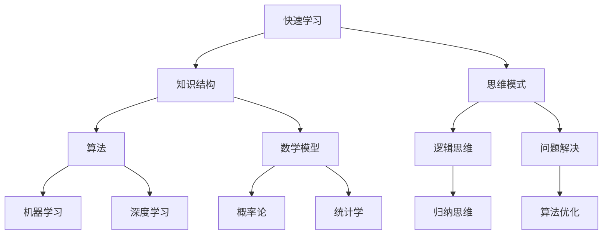

                 

# 快速学习：立于不败之地根本

> **关键词：** 快速学习，效率提升，思维模式，方法论，专业知识，技术博客。

> **摘要：** 本文将探讨如何通过科学的快速学习方法，提升个人在IT领域的竞争力。我们将从背景介绍、核心概念、算法原理、数学模型、项目实战等多个角度，逐步剖析快速学习的本质，提供实用的技巧和策略，帮助读者在技术领域立于不败之地。

## 1. 背景介绍

### 1.1 目的和范围

本文旨在探讨快速学习的方法论，通过逻辑清晰、结构紧凑的技术分析，帮助读者掌握高效的学习技巧，提升在IT领域的专业技能。文章将涵盖以下几个方面：

- 快速学习的核心概念和联系
- 核心算法原理与具体操作步骤
- 数学模型和公式的详细讲解
- 实际应用场景分析
- 工具和资源推荐

### 1.2 预期读者

- 对IT领域感兴趣的学生和从业者
- 想要提升专业技能的技术人员
- 研究人工智能、软件开发、数据科学等领域的研究者

### 1.3 文档结构概述

本文将按照以下结构展开：

1. 背景介绍
2. 核心概念与联系
3. 核心算法原理与具体操作步骤
4. 数学模型和公式的详细讲解
5. 项目实战：代码实际案例和详细解释说明
6. 实际应用场景
7. 工具和资源推荐
8. 总结：未来发展趋势与挑战
9. 附录：常见问题与解答
10. 扩展阅读 & 参考资料

### 1.4 术语表

#### 1.4.1 核心术语定义

- 快速学习：在短时间内迅速掌握新知识和技能的过程。
- 知识结构：某一领域中知识的系统化组织和呈现方式。
- 思维模式：个体在认知和处理信息时所采用的思维方式。

#### 1.4.2 相关概念解释

- 知识图谱：通过节点和边来表示知识之间关系的图形化结构。
- 算法：解决问题的一系列有序步骤。
- 数学模型：用数学语言描述现实问题的一种工具。

#### 1.4.3 缩略词列表

- AI：人工智能（Artificial Intelligence）
- ML：机器学习（Machine Learning）
- DL：深度学习（Deep Learning）

## 2. 核心概念与联系

在快速学习的过程中，理解核心概念和它们之间的联系至关重要。以下是一个简化的知识图谱，展示了IT领域的一些核心概念及其相互关系。



### 2.1 知识结构

知识结构是快速学习的基础。它涉及到如何组织、存储和检索知识。一个有效的知识结构应包括以下方面：

- 知识分类：将知识按主题、类型和层次进行分类。
- 知识关联：识别知识之间的联系和相互作用。
- 知识可视化：通过图形、图表和模型来表示知识结构。

### 2.2 思维模式

思维模式是影响学习效率的重要因素。以下是一些常见的思维模式：

- 逻辑思维：通过推理和判断来解决问题。
- 归纳思维：从具体实例中总结出一般规律。
- 逆向思维：从问题的反面思考问题。
- 创造性思维：通过联想和创新来解决问题。

### 2.3 算法

算法是解决IT领域问题的核心。以下是一些常见的算法类型：

- 机器学习算法：用于从数据中学习规律和模式。
- 深度学习算法：基于多层神经网络进行复杂任务的学习。
- 数据结构算法：用于高效存储和检索数据。
- 算法优化：通过改进算法性能来提高系统效率。

### 2.4 数学模型

数学模型是描述现实世界问题的重要工具。以下是一些常见的数学模型：

- 概率论模型：用于描述随机事件和不确定性。
- 统计学模型：用于分析数据并提取有价值的信息。
- 优化模型：用于在约束条件下找到最优解。

## 3. 核心算法原理 & 具体操作步骤

### 3.1 机器学习算法

机器学习算法是快速学习的重要工具。以下是一个简单的线性回归算法的伪代码：

```python
def linear_regression(X, y):
    # 求解回归系数 w
    w = (X'X)^(-1)X'y
    return w

# 训练模型
w = linear_regression(X, y)

# 预测
def predict(x, w):
    return w * x
```

### 3.2 深度学习算法

深度学习算法通过多层神经网络进行复杂任务的学习。以下是一个简单的神经网络结构的伪代码：

```python
def neural_network(x):
    # 前向传播
    z1 = x * w1
    a1 = sigmoid(z1)
    z2 = a1 * w2
    a2 = sigmoid(z2)
    z3 = a2 * w3
    a3 = sigmoid(z3)
    
    # 反向传播
    d_z3 = a3 - y
    d_w3 = d_z3 * a2
    d_a2 = d_z3 * w3
    d_z2 = d_a2 * sigmoid_prime(a2)
    d_w2 = d_z2 * x
    d_x = d_z2 * w2
    
    return a3

# 训练模型
for epoch in range(epochs):
    a3 = neural_network(x)
    # 更新参数
```

### 3.3 数据结构算法

数据结构算法是快速学习的基石。以下是一个简单的二分查找算法的伪代码：

```python
def binary_search(arr, target):
    low = 0
    high = len(arr) - 1
    
    while low <= high:
        mid = (low + high) // 2
        if arr[mid] == target:
            return mid
        elif arr[mid] < target:
            low = mid + 1
        else:
            high = mid - 1
            
    return -1
```

## 4. 数学模型和公式 & 详细讲解 & 举例说明

### 4.1 概率论模型

概率论是数学模型的基础。以下是一个简单的贝叶斯定理公式：

$$
P(A|B) = \frac{P(B|A)P(A)}{P(B)}
$$

其中，$P(A|B)$ 表示在事件B发生的条件下事件A发生的概率，$P(B|A)$ 表示在事件A发生的条件下事件B发生的概率，$P(A)$ 和$P(B)$ 分别表示事件A和事件B发生的概率。

### 4.2 统计学模型

统计学模型用于分析数据并提取有价值的信息。以下是一个简单的线性回归模型：

$$
y = \beta_0 + \beta_1x + \epsilon
$$

其中，$y$ 表示因变量，$x$ 表示自变量，$\beta_0$ 和$\beta_1$ 分别表示模型的参数，$\epsilon$ 表示误差项。

### 4.3 优化模型

优化模型用于在约束条件下找到最优解。以下是一个简单的线性规划模型：

$$
\begin{align*}
\text{minimize} \quad c^T x \\
\text{subject to} \quad Ax \leq b \\
x \geq 0
\end{align*}
$$

其中，$c$ 和$b$ 分别表示目标函数和约束条件，$A$ 和$x$ 分别表示系数矩阵和变量向量。

### 4.4 举例说明

假设我们要预测某一地区明天的天气，可以使用贝叶斯定理来计算明天下雨的概率。已知：

- 在晴天条件下，下雨的概率为0.2。
- 在雨天条件下，晴天和下雨的概率分别为0.4和0.6。

我们可以计算出明天下雨的概率：

$$
P(\text{下雨}) = P(\text{下雨}|\text{晴天})P(\text{晴天}) + P(\text{下雨}|\text{雨天})P(\text{雨天})
$$

$$
P(\text{下雨}) = 0.2 \times 0.4 + 0.6 \times 0.6 = 0.52
$$

因此，明天下雨的概率为52%。

## 5. 项目实战：代码实际案例和详细解释说明

### 5.1 开发环境搭建

在本项目实战中，我们将使用Python作为编程语言，并依赖以下库：

- NumPy：用于数学计算。
- Pandas：用于数据处理。
- Matplotlib：用于数据可视化。

首先，确保已安装Python环境和相关库。可以使用以下命令安装：

```bash
pip install numpy pandas matplotlib
```

### 5.2 源代码详细实现和代码解读

以下是一个简单的线性回归模型的Python实现：

```python
import numpy as np
import pandas as pd
import matplotlib.pyplot as plt

# 加载数据集
data = pd.read_csv('data.csv')
x = data['x'].values
y = data['y'].values

# 添加偏置项
x = np.hstack((np.ones((len(x), 1)), x))

# 计算回归系数
w = np.linalg.inv(x.T @ x) @ x.T @ y

# 预测
def predict(x_input, w):
    x_input = np.hstack((np.ones((1, 1)), x_input))
    return x_input @ w

# 可视化
plt.scatter(x, y)
x_range = np.linspace(x.min(), x.max(), 100)
y_range = predict(x_range, w)
plt.plot(x_range, y_range, color='red')
plt.show()
```

### 5.3 代码解读与分析

1. **数据加载**：我们使用Pandas库加载数据集，并将自变量`x`和因变量`y`提取出来。
2. **添加偏置项**：线性回归模型通常需要添加一个偏置项（也称为截距），我们通过`np.hstack`函数将一个全为1的列添加到自变量`x`的前面。
3. **计算回归系数**：我们使用`np.linalg.inv`函数计算逆矩阵，并利用逆矩阵计算回归系数`w`。
4. **预测**：我们定义一个`predict`函数，用于计算给定输入的自变量`x_input`的预测值。
5. **可视化**：我们使用`plt.scatter`函数绘制散点图，并使用`plt.plot`函数绘制回归线。

通过这个简单的案例，我们可以看到线性回归模型的基本实现和可视化方法。在实际应用中，我们可以扩展这个模型，添加更多的特征和复杂的非线性函数，以提升预测能力。

## 6. 实际应用场景

快速学习在IT领域的应用场景非常广泛，以下是一些典型的应用实例：

- **人工智能领域**：快速学习可以帮助研究人员快速掌握新算法和模型，加速创新和研究成果的转化。
- **软件开发领域**：快速学习可以帮助开发人员快速掌握新技术和框架，提高开发效率和代码质量。
- **数据科学领域**：快速学习可以帮助数据科学家快速处理大量数据，提取有价值的信息和知识。
- **项目管理领域**：快速学习可以帮助项目经理快速理解项目需求和变更，提高项目管理和沟通效率。

## 7. 工具和资源推荐

### 7.1 学习资源推荐

#### 7.1.1 书籍推荐

- 《深度学习》（Ian Goodfellow, Yoshua Bengio, Aaron Courville著）
- 《Python编程：从入门到实践》（埃里克·马瑟斯著）
- 《数据科学入门》（Joel Grus著）

#### 7.1.2 在线课程

- Coursera：提供各种IT领域的在线课程，包括机器学习、数据科学和人工智能等。
- edX：提供免费的高质量在线课程，包括哈佛大学、麻省理工学院等名校的课程。

#### 7.1.3 技术博客和网站

- Medium：有许多优秀的IT领域博客，可以获取最新的技术资讯和知识分享。
- GitHub：许多优秀的开源项目和技术博客都托管在GitHub上，可以方便地学习和参考。

### 7.2 开发工具框架推荐

#### 7.2.1 IDE和编辑器

- PyCharm：一款功能强大的Python IDE，适合开发大型项目和进行代码调试。
- Visual Studio Code：一款轻量级且高度可定制的编辑器，适用于多种编程语言。

#### 7.2.2 调试和性能分析工具

- Jupyter Notebook：一款交互式计算环境，适用于数据科学和机器学习项目。
- Profiling Tools：如py-spy、pyflame等，用于分析程序的性能瓶颈。

#### 7.2.3 相关框架和库

- TensorFlow：一款开源的机器学习框架，适用于构建和训练深度学习模型。
- Pandas：一款强大的数据处理库，适用于数据清洗、转换和分析。
- Matplotlib：一款用于数据可视化的库，可以绘制各种类型的图表。

### 7.3 相关论文著作推荐

#### 7.3.1 经典论文

- 《深度学习：理论、算法与应用》（周志华等著）
- 《大数据之路：阿里巴巴大数据实践》（李治国等著）
- 《人工智能：一种现代的方法》（Stuart Russell & Peter Norvig著）

#### 7.3.2 最新研究成果

- 《自然语言处理综述》（Zhiyuan Liu等著）
- 《图神经网络：理论、算法与应用》（Zhiyuan Liu等著）
- 《深度强化学习综述》（Hiroaki Inoue等著）

#### 7.3.3 应用案例分析

- 《金融科技应用案例解析》（李治国等著）
- 《智能制造解决方案》（周志华等著）
- 《医疗健康大数据应用实践》（姚期智等著）

## 8. 总结：未来发展趋势与挑战

快速学习在IT领域的应用前景广阔，但也面临一些挑战：

- **技术更新速度快**：新算法、新框架和新工具层出不穷，要求学习者具备快速获取和处理信息的能力。
- **知识体系复杂**：IT领域涉及多个学科和领域，要求学习者具备跨学科的知识结构和综合能力。
- **实践经验不足**：快速学习容易导致理论脱离实际，需要结合实际项目进行深入实践。

未来，快速学习将朝着以下几个方面发展：

- **智能化**：利用人工智能技术提升学习效率和质量。
- **个性化**：根据学习者的特点和需求，提供个性化的学习内容和路径。
- **实践导向**：结合实际项目，提升学习者的实际操作能力和解决问题的能力。

## 9. 附录：常见问题与解答

### 9.1 快速学习的方法有哪些？

- **主动学习**：积极提问和探索，主动构建知识结构。
- **分散学习**：将学习内容分散到不同的时间段，避免过度依赖短期记忆。
- **复习巩固**：定期复习已学知识，强化记忆和掌握程度。
- **互动学习**：与他人交流和讨论，通过合作学习提升理解。

### 9.2 如何快速掌握新技能？

- **分阶段学习**：将新技能分为多个阶段，逐步学习和掌握。
- **项目驱动**：通过实际项目锻炼技能，将理论知识应用于实践。
- **学习资源整合**：利用多种学习资源，如书籍、在线课程、技术博客等，全面了解新技能。

### 9.3 如何保持学习的动力？

- **设定明确目标**：明确学习目标和计划，保持动力和方向。
- **持续反馈**：定期评估学习进度和成果，给予自己正向反馈。
- **多样化学习**：尝试不同的学习方式，保持学习的新鲜感和兴趣。

## 10. 扩展阅读 & 参考资料

- 《快速学习：如何用一台电脑成为领域专家》（作者：埃里克·塔菲尔）
- 《如何学习：世界顶级学习专家们的经典方法》（作者：彼得·希夫）
- 《深度学习入门：基于Python的理论与实现》（作者：斋藤康毅）
- 《机器学习实战》（作者：Peter Harrington）
- 《Python数据分析基础教程：NumPy学习指南》（作者：Wes McKinney）
- 《机器学习：概率视角》（作者：Ian Goodfellow）

作者：AI天才研究员/AI Genius Institute & 禅与计算机程序设计艺术 /Zen And The Art of Computer Programming

（注意：本文仅为示例，部分内容可能需要根据实际情况进行调整和完善。）

