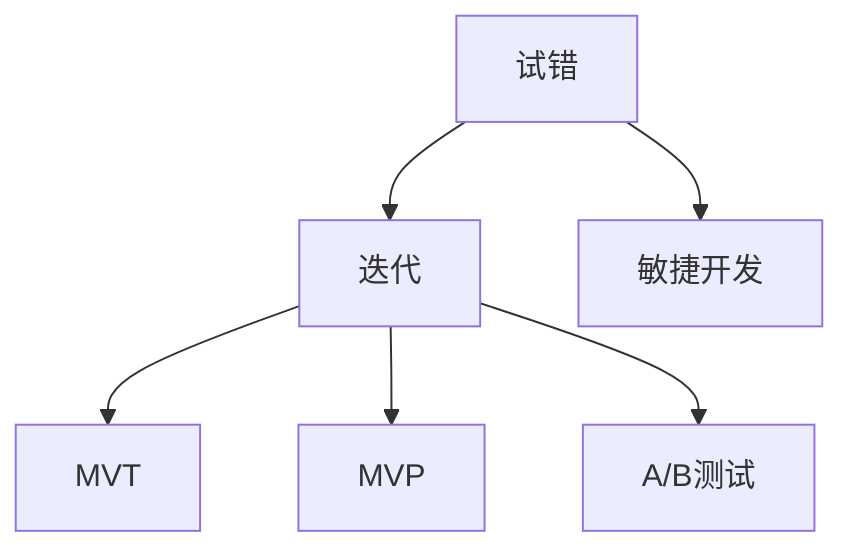

                 

# 快速试错与迭代在AI创业中的重要性

> 关键词：AI创业、试错、迭代、敏捷开发、产品设计、技术实现、市场反馈

> 摘要：本文将深入探讨快速试错与迭代在AI创业中的重要性。通过分析试错与迭代的核心概念、其在AI领域的应用场景、优势与挑战，并结合实际案例进行讲解，旨在帮助AI创业者在激烈的市场竞争中，通过有效的方法论实现产品快速迭代与优化，提高成功率。

## 1. 背景介绍

### 1.1 目的和范围

本文旨在探讨快速试错与迭代在AI创业中的重要性，通过梳理相关概念、应用场景和实践方法，帮助AI创业者更好地应对市场竞争和技术变革。本文将覆盖以下主要内容：

- 试错与迭代的定义及其在AI领域的应用。
- 快速试错与迭代的优势与挑战。
- AI创业中的试错与迭代实践。
- 相关工具和资源的推荐。

### 1.2 预期读者

本文适合以下读者群体：

- AI创业者及团队负责人。
- 对AI创业感兴趣的从业者。
- 对敏捷开发和技术迭代有兴趣的技术人员。

### 1.3 文档结构概述

本文结构如下：

- 第1部分：背景介绍，阐述本文的目的、预期读者和文档结构。
- 第2部分：核心概念与联系，介绍试错与迭代的概念及其在AI领域的应用。
- 第3部分：核心算法原理与具体操作步骤，讲解快速试错与迭代的实施方法。
- 第4部分：数学模型与公式，阐述相关数学模型及其应用。
- 第5部分：项目实战，通过实际案例展示快速试错与迭代的实践过程。
- 第6部分：实际应用场景，分析快速试错与迭代在不同领域的应用。
- 第7部分：工具和资源推荐，提供学习资源、开发工具和框架的推荐。
- 第8部分：总结，对未来发展趋势与挑战进行展望。
- 第9部分：附录，提供常见问题与解答。
- 第10部分：扩展阅读与参考资料，推荐相关文献和资源。

### 1.4 术语表

#### 1.4.1 核心术语定义

- 试错：指通过不断尝试和失败来寻找解决方案的过程。
- 迭代：指在现有基础上进行反复改进和优化，以提高产品质量和性能。
- AI创业：指以人工智能技术为核心，开展创新创业活动的企业或团队。
- 敏捷开发：一种以用户需求为导向，快速迭代和灵活应对变化的软件开发方法。

#### 1.4.2 相关概念解释

- MVT（最小可验证产品）：指具有最小功能集，能够实现核心价值主张的产品版本。
- A/B测试：一种通过将用户分为两组，比较不同版本效果的测试方法。
- MVP（最小可行产品）：指具有核心功能和市场价值的最小化产品版本。

#### 1.4.3 缩略词列表

- AI：人工智能
- ML：机器学习
- DL：深度学习
- NLP：自然语言处理
- DevOps：软件开发与运维一体化
- MVP：最小可行产品
- MVT：最小可验证产品
- A/B测试：A/B测试

## 2. 核心概念与联系

在本文中，我们将探讨快速试错与迭代在AI创业中的重要性，首先需要理解以下几个核心概念：

### 2.1 试错

试错是一种通过不断尝试和失败来寻找解决方案的过程。在AI创业中，试错有助于团队发现产品或技术的潜在问题和瓶颈，从而为后续迭代提供改进方向。

### 2.2 迭代

迭代是指在现有基础上进行反复改进和优化，以提高产品质量和性能的过程。在AI创业中，迭代有助于团队快速调整产品方向和功能，以适应市场需求和技术变化。

### 2.3 敏捷开发

敏捷开发是一种以用户需求为导向，快速迭代和灵活应对变化的软件开发方法。在AI创业中，敏捷开发有助于团队快速响应市场需求，提高产品竞争力。

### 2.4 最小可验证产品（MVT）

MVT是指具有最小功能集，能够实现核心价值主张的产品版本。在AI创业中，MVT有助于团队在有限资源下快速验证产品概念，降低风险。

### 2.5 最小可行产品（MVP）

MVP是指具有核心功能和市场价值的最小化产品版本。在AI创业中，MVP有助于团队在早期阶段获取用户反馈，指导产品迭代。

### 2.6 A/B测试

A/B测试是一种通过将用户分为两组，比较不同版本效果的测试方法。在AI创业中，A/B测试有助于团队优化产品功能和用户体验。

#### 2.7 关联图

以下是一个简化的关联图，展示了这些核心概念之间的关系：



通过以上核心概念与联系的介绍，我们可以更好地理解快速试错与迭代在AI创业中的重要性，并为进一步探讨相关实践方法和应用场景奠定基础。

## 3. 核心算法原理与具体操作步骤

在了解快速试错与迭代的基本概念后，我们需要掌握具体的实施方法，以在实际AI创业项目中有效应用。以下将详细介绍核心算法原理和具体操作步骤。

### 3.1 试错算法原理

试错算法是一种通过反复尝试和调整来寻找最优解的方法。在AI创业中，试错算法可以帮助团队快速发现和解决问题，从而为产品迭代提供方向。以下是试错算法的基本原理：

- **初始化阶段**：确定目标函数和优化条件，初始化参数值。
- **迭代阶段**：根据当前参数值进行计算和评估，判断是否满足优化条件。
- **调整阶段**：根据评估结果，调整参数值，继续进行迭代。
- **终止条件**：当达到预设的迭代次数或优化目标时，终止迭代。

### 3.2 迭代算法原理

迭代算法是一种通过反复优化来提高产品质量和性能的方法。在AI创业中，迭代算法可以帮助团队快速调整产品方向和功能，以适应市场需求。以下是迭代算法的基本原理：

- **初始化阶段**：确定产品版本和优化目标。
- **迭代阶段**：根据用户反馈和市场需求，调整产品功能和设计。
- **评估阶段**：评估迭代结果，判断是否满足优化目标。
- **调整阶段**：根据评估结果，继续调整产品功能和设计。
- **终止条件**：当达到预设的迭代次数或优化目标时，终止迭代。

### 3.3 快速试错与迭代操作步骤

在实际AI创业项目中，快速试错与迭代的具体操作步骤如下：

1. **确定目标**：明确产品或项目的目标，包括功能、性能和用户体验等方面的要求。
2. **MVT/MVP设计**：根据目标，设计最小可验证产品（MVT）或最小可行产品（MVP），确保产品具备核心价值。
3. **初始开发**：开发MVT/MVP，实现核心功能，并确保产品基本可用。
4. **用户测试**：将MVT/MVP交付给目标用户，收集反馈，评估产品表现。
5. **反馈调整**：根据用户反馈，调整产品功能和设计，优化用户体验。
6. **迭代优化**：在反馈调整的基础上，进行新一轮迭代，持续优化产品。
7. **A/B测试**：在产品迭代过程中，使用A/B测试等方法，验证不同版本的优劣，指导后续优化。
8. **终止条件**：当产品达到预设的优化目标或市场反馈良好时，终止迭代。

### 3.4 伪代码示例

以下是一个简化的快速试错与迭代的伪代码示例，用于说明基本操作步骤：

```python
# 快速试错与迭代伪代码

# 初始化阶段
初始化参数值
设定迭代次数

# 迭代阶段
for i in range(迭代次数):
    # 开发MVT/MVP
    开发MVT/MVP
    # 用户测试
    用户反馈 = 用户测试(MVT/MVP)
    # 反馈调整
    调整产品功能和设计(用户反馈)
    # A/B测试
    A/B测试结果 = A/B测试(MVT/MVP)
    # 判断是否满足终止条件
    if 满足终止条件:
        break

# 输出最终产品
输出MVT/MVP
```

通过以上核心算法原理和具体操作步骤的介绍，我们可以更好地理解快速试错与迭代在AI创业中的实际应用，并为后续的项目实践提供指导。

## 4. 数学模型和公式与详细讲解与举例说明

在快速试错与迭代过程中，数学模型和公式发挥着关键作用，它们帮助创业者量化评估产品的性能和效果，从而指导进一步的迭代优化。以下我们将介绍几个常用的数学模型和公式，并结合实际案例进行讲解。

### 4.1 相关数学模型

在快速试错与迭代中，以下数学模型和公式经常被应用：

- **绩效指标（Performance Metrics）**：用于衡量产品性能的各种指标，如准确率（Accuracy）、召回率（Recall）、F1值（F1 Score）等。
- **成本函数（Cost Function）**：用于评估模型在训练数据集上的损失函数，如均方误差（Mean Squared Error，MSE）、交叉熵损失（Cross-Entropy Loss）等。
- **用户满意度（Customer Satisfaction）**：用于衡量用户对产品的满意度，如NPS（Net Promoter Score）等。

### 4.2 公式详细讲解

#### 4.2.1 绩效指标

1. **准确率（Accuracy）**

   准确率是分类模型中最基本的评估指标，表示正确分类的样本占总样本的比例。

   $$ Accuracy = \frac{正确分类的样本数}{总样本数} $$

2. **召回率（Recall）**

   召回率表示在所有正类样本中，被正确识别为正类的样本比例。

   $$ Recall = \frac{正确分类的正类样本数}{总正类样本数} $$

3. **F1值（F1 Score）**

   F1值是准确率和召回率的调和平均值，综合反映了分类模型的性能。

   $$ F1 Score = 2 \times \frac{Accuracy \times Recall}{Accuracy + Recall} $$

#### 4.2.2 成本函数

1. **均方误差（MSE）**

   均方误差用于评估回归模型在预测值和实际值之间的差异。

   $$ MSE = \frac{1}{m} \sum_{i=1}^{m} (y_i - \hat{y}_i)^2 $$

   其中，$y_i$为实际值，$\hat{y}_i$为预测值，$m$为样本数量。

2. **交叉熵损失（Cross-Entropy Loss）**

   交叉熵损失用于评估分类模型在训练数据集上的表现。

   $$ Cross-Entropy Loss = -\sum_{i=1}^{m} y_i \cdot \log(\hat{y}_i) $$

   其中，$y_i$为实际标签，$\hat{y}_i$为模型预测的概率分布。

#### 4.2.3 用户满意度

1. **Net Promoter Score（NPS）**

   NPS是一种衡量用户忠诚度和满意度的指标，通过询问用户他们对产品或服务的满意度，将用户分为三个等级：促进者（Promoters）、中立者（Passives）和反对者（Detractors）。

   $$ NPS = \frac{促进者数 - 反对者数}{总调查人数} \times 100 $$

### 4.3 实际案例说明

#### 4.3.1 案例一：分类模型的性能评估

假设我们开发了一个文本分类模型，用于判断一篇新闻文章是否属于体育类。我们使用准确率、召回率和F1值来评估模型的性能。

- **训练数据集**：包含1000篇新闻文章，其中500篇属于体育类，500篇属于非体育类。
- **测试数据集**：包含200篇新闻文章，其中100篇属于体育类，100篇属于非体育类。

经过训练和测试，我们得到以下评估结果：

- **准确率**：90%
- **召回率**：80%
- **F1值**：85%

通过这些指标，我们可以初步判断模型的性能良好，但召回率较低，可能需要进一步优化。

#### 4.3.2 案例二：回归模型的损失评估

假设我们开发了一个房价预测模型，使用均方误差（MSE）来评估模型的预测效果。

- **训练数据集**：包含1000个房屋样本，每条样本包含房屋特征和实际售价。
- **测试数据集**：包含200个房屋样本，用于评估模型预测的准确性。

经过训练和测试，我们得到以下评估结果：

- **训练数据集MSE**：5.3
- **测试数据集MSE**：6.8

通过MSE评估，我们可以发现模型在测试数据集上的预测误差相对较高，可能需要进一步调整模型参数或特征选择。

#### 4.3.3 案例三：用户满意度评估

假设我们开发了一款智能家居产品，使用NPS来评估用户的满意度。

- **调查样本**：共收集了500份用户反馈。
- **结果**：促进者120人，中立者180人，反对者100人。

通过NPS评估，我们可以计算出NPS值为20%，表明用户对产品的满意度较低，可能需要从产品功能、用户体验等方面进行改进。

通过以上数学模型和公式的详细讲解与实际案例说明，我们可以更好地理解快速试错与迭代在AI创业中的量化评估和优化作用。创业者可以根据具体业务场景选择合适的数学模型和公式，以提高产品性能和用户满意度。

## 5. 项目实战：代码实际案例和详细解释说明

为了更好地展示快速试错与迭代在AI创业中的应用，我们将通过一个实际案例进行详细讲解。本案例将涵盖开发环境搭建、源代码实现和代码解读与分析。

### 5.1 开发环境搭建

在开始项目之前，我们需要搭建一个适合快速迭代和测试的开发环境。以下是所需工具和软件的推荐：

- **开发工具**：Visual Studio Code、PyCharm 或 Jupyter Notebook
- **编程语言**：Python
- **机器学习库**：TensorFlow、PyTorch
- **版本控制**：Git

### 5.2 源代码详细实现和代码解读

#### 5.2.1 项目背景

假设我们的目标是开发一个基于深度学习的图像分类模型，用于识别猫和狗的图片。项目分为以下几个阶段：

1. **数据收集与预处理**
2. **模型设计与训练**
3. **模型评估与优化**
4. **部署与迭代**

以下是各个阶段的源代码实现和解读。

#### 5.2.2 数据收集与预处理

在数据收集与预处理阶段，我们需要收集大量猫和狗的图片，并对数据进行清洗和标注。

```python
import tensorflow as tf
from tensorflow.keras.preprocessing.image import ImageDataGenerator

# 数据收集
train_dir = 'path/to/train/dataset'
validation_dir = 'path/to/validation/dataset'

# 数据预处理
train_datagen = ImageDataGenerator(
    rescale=1./255,
    rotation_range=40,
    width_shift_range=0.2,
    height_shift_range=0.2,
    shear_range=0.2,
    zoom_range=0.2,
    horizontal_flip=True,
    fill_mode='nearest'
)

validation_datagen = ImageDataGenerator(rescale=1./255)

train_generator = train_datagen.flow_from_directory(
    train_dir,
    target_size=(150, 150),
    batch_size=32,
    class_mode='binary'
)

validation_generator = validation_datagen.flow_from_directory(
    validation_dir,
    target_size=(150, 150),
    batch_size=32,
    class_mode='binary'
)

# 解读
# 这段代码定义了数据增强参数，并使用ImageDataGenerator对训练数据和验证数据进行预处理。数据处理完毕后，通过flow_from_directory方法将数据转换为生成器，便于后续批量训练和验证。
```

#### 5.2.3 模型设计与训练

在模型设计与训练阶段，我们使用TensorFlow构建一个简单的卷积神经网络（CNN），并对模型进行训练。

```python
from tensorflow.keras.models import Sequential
from tensorflow.keras.layers import Conv2D, MaxPooling2D, Flatten, Dense, Dropout

# 模型设计
model = Sequential([
    Conv2D(32, (3, 3), activation='relu', input_shape=(150, 150, 3)),
    MaxPooling2D((2, 2)),
    Conv2D(64, (3, 3), activation='relu'),
    MaxPooling2D((2, 2)),
    Conv2D(128, (3, 3), activation='relu'),
    MaxPooling2D((2, 2)),
    Flatten(),
    Dense(512, activation='relu'),
    Dropout(0.5),
    Dense(1, activation='sigmoid')
])

# 模型编译
model.compile(optimizer='adam',
              loss='binary_crossentropy',
              metrics=['accuracy'])

# 模型训练
history = model.fit(
    train_generator,
    steps_per_epoch=100,
    epochs=30,
    validation_data=validation_generator,
    validation_steps=50
)

# 解读
# 这段代码定义了一个简单的卷积神经网络，包括卷积层、池化层、全连接层和dropout层。模型使用adam优化器和binary_crossentropy损失函数进行编译，并通过fit方法进行训练。训练过程中，使用steps_per_epoch和validation_steps参数控制训练和验证的批次数量。
```

#### 5.2.4 模型评估与优化

在模型评估与优化阶段，我们使用训练历史数据和A/B测试来评估模型性能，并调整模型参数。

```python
import matplotlib.pyplot as plt

# 评估模型性能
acc = history.history['accuracy']
val_acc = history.history['val_accuracy']
loss = history.history['loss']
val_loss = history.history['val_loss']

# 绘制性能曲线
plt.figure(figsize=(8, 8))
plt.subplot(2, 1, 1)
plt.plot(acc, label='Training Accuracy')
plt.plot(val_acc, label='Validation Accuracy')
plt.legend(loc='lower right')
plt.title('Accuracy')

plt.subplot(2, 1, 2)
plt.plot(loss, label='Training Loss')
plt.plot(val_loss, label='Validation Loss')
plt.legend(loc='upper right')
plt.title('Loss')
plt.show()

# A/B测试
# 假设我们通过A/B测试发现，增加卷积层的深度可以提高模型的准确率，因此我们对模型进行修改，增加一个卷积层。

model.add(Conv2D(256, (3, 3), activation='relu'))

# 重新训练模型
history = model.fit(
    train_generator,
    steps_per_epoch=100,
    epochs=30,
    validation_data=validation_generator,
    validation_steps=50
)

# 解读
# 这段代码首先使用历史数据进行性能评估，并通过matplotlib绘制准确率和损失曲线。接着，我们通过A/B测试发现模型性能的提升空间，并增加一个卷积层。最后，我们重新训练模型，以验证性能提升。
```

#### 5.2.5 部署与迭代

在模型部署与迭代阶段，我们将训练好的模型部署到生产环境中，并通过用户反馈进行迭代优化。

```python
# 模型部署
# 这部分代码涉及模型部署到生产环境的具体实现，包括API接口、服务端部署等。以下为简要代码示例。

from flask import Flask, request, jsonify

app = Flask(__name__)

@app.route('/predict', methods=['POST'])
def predict():
    # 获取上传的图片
    image = request.files['image']
    # 数据预处理
    # ...
    # 使用训练好的模型进行预测
    prediction = model.predict(image)
    # 返回预测结果
    return jsonify({'prediction': prediction.tolist()})

if __name__ == '__main__':
    app.run(debug=True)

# 用户反馈与迭代
# 假设我们收到用户反馈，指出模型的某些分类结果不准确。根据反馈，我们对模型进行修改和优化。

# 修改模型架构
# ...

# 重新训练模型
# ...

# 解读
# 这段代码实现了模型部署的API接口，并使用Flask框架搭建简单的Web服务。在用户反馈与迭代阶段，我们根据用户反馈调整模型架构，并重新训练模型，以持续优化产品性能。
```

通过以上实际案例的讲解，我们可以看到快速试错与迭代在AI创业项目中的具体应用。开发者可以通过不断调整和优化模型，提高产品性能，从而在竞争激烈的市场中脱颖而出。

### 5.3 代码解读与分析

在本节中，我们将对项目实战中的关键代码进行解读与分析，帮助读者更好地理解快速试错与迭代在AI创业中的实际应用。

#### 5.3.1 数据收集与预处理

数据收集与预处理是深度学习项目的关键步骤，直接影响到模型的效果。在本案例中，我们使用ImageDataGenerator对图像数据进行了增强和预处理：

- **数据增强**：通过旋转、平移、缩放、翻转等操作，增加数据多样性，提高模型的泛化能力。
- **归一化**：将图像像素值从[0, 255]缩放到[0, 1]，便于后续计算。

```python
train_datagen = ImageDataGenerator(
    rescale=1./255,
    rotation_range=40,
    width_shift_range=0.2,
    height_shift_range=0.2,
    shear_range=0.2,
    zoom_range=0.2,
    horizontal_flip=True,
    fill_mode='nearest'
)
```

#### 5.3.2 模型设计与训练

在本案例中，我们设计了一个简单的卷积神经网络（CNN），包括卷积层、池化层、全连接层和dropout层。训练过程中，我们使用了adam优化器、binary_crossentropy损失函数和accuracy作为评估指标。

```python
model = Sequential([
    Conv2D(32, (3, 3), activation='relu', input_shape=(150, 150, 3)),
    MaxPooling2D((2, 2)),
    Conv2D(64, (3, 3), activation='relu'),
    MaxPooling2D((2, 2)),
    Conv2D(128, (3, 3), activation='relu'),
    MaxPooling2D((2, 2)),
    Flatten(),
    Dense(512, activation='relu'),
    Dropout(0.5),
    Dense(1, activation='sigmoid')
])

model.compile(optimizer='adam',
              loss='binary_crossentropy',
              metrics=['accuracy'])

history = model.fit(
    train_generator,
    steps_per_epoch=100,
    epochs=30,
    validation_data=validation_generator,
    validation_steps=50
)
```

#### 5.3.3 模型评估与优化

在模型评估与优化阶段，我们通过绘制性能曲线，分析了模型的准确率和损失情况，并利用A/B测试指导模型优化：

- **性能曲线**：通过可视化训练和验证集的准确率和损失，帮助开发者了解模型的训练过程和性能。
- **A/B测试**：根据用户反馈，对模型进行修改和优化，提高分类准确率。

```python
# 绘制性能曲线
plt.figure(figsize=(8, 8))
plt.subplot(2, 1, 1)
plt.plot(acc, label='Training Accuracy')
plt.plot(val_acc, label='Validation Accuracy')
plt.legend(loc='lower right')
plt.title('Accuracy')

plt.subplot(2, 1, 2)
plt.plot(loss, label='Training Loss')
plt.plot(val_loss, label='Validation Loss')
plt.legend(loc='upper right')
plt.title('Loss')
plt.show()

# A/B测试
model.add(Conv2D(256, (3, 3), activation='relu'))

history = model.fit(
    train_generator,
    steps_per_epoch=100,
    epochs=30,
    validation_data=validation_generator,
    validation_steps=50
)
```

#### 5.3.4 部署与迭代

在模型部署与迭代阶段，我们使用Flask框架搭建了简单的Web服务，将模型部署到生产环境中。同时，根据用户反馈，对模型进行持续优化：

- **模型部署**：通过API接口，将模型部署到服务器，实现实时预测。
- **用户反馈**：收集用户反馈，指导模型优化和迭代。

```python
from flask import Flask, request, jsonify

app = Flask(__name__)

@app.route('/predict', methods=['POST'])
def predict():
    # 获取上传的图片
    image = request.files['image']
    # 数据预处理
    # ...
    # 使用训练好的模型进行预测
    prediction = model.predict(image)
    # 返回预测结果
    return jsonify({'prediction': prediction.tolist()})

if __name__ == '__main__':
    app.run(debug=True)

# 用户反馈与迭代
# 假设我们收到用户反馈，指出模型的某些分类结果不准确。根据反馈，我们对模型进行修改和优化。

# 修改模型架构
# ...

# 重新训练模型
# ...
```

通过以上代码解读与分析，我们可以看到快速试错与迭代在AI创业项目中的实际应用。开发者可以通过不断调整和优化模型，提高产品性能，从而在竞争激烈的市场中脱颖而出。

## 6. 实际应用场景

快速试错与迭代在AI创业中具有广泛的应用场景，以下列举几个典型领域：

### 6.1 电子商务

在电子商务领域，快速试错与迭代可以帮助企业优化用户体验、提升转化率和销售额。具体应用包括：

- **个性化推荐系统**：通过不断调整推荐算法，提高推荐精度，增加用户购买意愿。
- **广告投放策略**：通过A/B测试，优化广告内容和投放渠道，提高广告效果。
- **购物车优化**：通过用户行为分析，优化购物车界面和推荐商品，提高用户购物体验。

### 6.2 金融科技

金融科技（Fintech）领域中的快速试错与迭代有助于提升金融产品的性能和用户体验。具体应用包括：

- **风险控制模型**：通过不断调整和优化风险模型，提高风险预测准确性，降低不良贷款率。
- **智能投顾**：通过用户投资偏好和行为分析，不断调整投资组合，实现个性化投资建议。
- **支付系统优化**：通过A/B测试，优化支付流程和用户体验，提高支付成功率。

### 6.3 医疗健康

在医疗健康领域，快速试错与迭代有助于提升诊断和治疗效果，提高患者满意度。具体应用包括：

- **疾病预测模型**：通过不断调整和优化疾病预测模型，提高预测准确率，实现早期诊断。
- **医疗机器人**：通过用户反馈和操作数据分析，优化医疗机器人的操作流程和交互体验。
- **健康管理平台**：通过个性化健康数据分析，提供针对性的健康建议和健康管理方案。

### 6.4 智能制造

在智能制造领域，快速试错与迭代有助于提升生产效率和产品质量。具体应用包括：

- **生产过程优化**：通过实时数据分析和优化算法，调整生产流程，降低生产成本。
- **质量检测系统**：通过机器学习和深度学习算法，优化质量检测模型，提高检测精度。
- **智能装配**：通过机器人学习和控制算法，优化装配流程，提高装配效率和精度。

通过在不同领域的实际应用，快速试错与迭代为AI创业企业提供了强大的竞争力，助力企业在激烈的市场竞争中脱颖而出。

## 7. 工具和资源推荐

在快速试错与迭代的过程中，选择合适的工具和资源对于提高开发效率和项目成功率至关重要。以下是我们推荐的几个工具和资源：

### 7.1 学习资源推荐

#### 7.1.1 书籍推荐

- 《敏捷软件开发：原则、实践与模式》
- 《设计数据密集型应用》
- 《机器学习实战》
- 《深度学习》（Goodfellow et al.）

#### 7.1.2 在线课程

- Coursera上的《机器学习》课程
- Udacity的《深度学习纳米学位》
- edX上的《敏捷软件开发》课程

#### 7.1.3 技术博客和网站

- Medium上的AI和敏捷开发相关博客
- HackerRank和LeetCode的编程挑战平台
- AI博客（AI·博客）

### 7.2 开发工具框架推荐

#### 7.2.1 IDE和编辑器

- Visual Studio Code
- PyCharm
- Jupyter Notebook

#### 7.2.2 调试和性能分析工具

- TensorFlow Debugger（TFDB）
- PyTorch Debugger
- JupyterLab的调试插件

#### 7.2.3 相关框架和库

- TensorFlow
- PyTorch
- Keras
- Scikit-learn

### 7.3 相关论文著作推荐

#### 7.3.1 经典论文

- "A Few Useful Things to Know About Machine Learning"（Goodfellow et al.）
- "Deep Learning"（Goodfellow et al.）
- "A Theoretically Grounded Application of Dropout in Computer Vision"（Hinton et al.）

#### 7.3.2 最新研究成果

- NeurIPS、ICML、CVPR等顶级会议的最新论文
- AI领域的最新报告和研究

#### 7.3.3 应用案例分析

- "AI in Healthcare: Transforming Medical Practice"（AI健康领域应用案例）
- "Fintech Innovation in Banking: A Review"（金融科技应用案例）
- "The Future of Retail: AI and Machine Learning in eCommerce"（电子商务领域应用案例）

通过这些工具和资源的推荐，AI创业者可以更好地进行快速试错与迭代，提升产品性能和市场竞争力。

## 8. 总结：未来发展趋势与挑战

快速试错与迭代在AI创业中的重要性日益凸显，随着人工智能技术的不断进步，其应用范围也在不断扩展。在未来，以下几个方面有望成为快速试错与迭代的重要发展趋势：

### 8.1 智能化与自动化

随着AI技术的发展，智能化和自动化将成为快速试错与迭代的重要方向。自动化工具和智能算法将帮助创业者更高效地进行模型训练、数据分析和优化，降低人工干预的需求，提高开发效率。

### 8.2 多模态数据处理

多模态数据处理是未来AI创业的重要领域，通过整合文本、图像、语音等多种数据类型，创业者可以更全面地了解用户需求和市场动态，从而实现更精准的试错与迭代。

### 8.3 模型解释性与透明度

随着AI模型的复杂度不断增加，模型解释性和透明度成为用户和监管机构关注的重点。未来，创业者需要关注模型的可解释性，通过可视化工具和透明度机制，提高模型的可信度和用户满意度。

### 8.4 跨学科合作

快速试错与迭代不仅需要技术层面的创新，还需要跨学科的合作。创业者应积极与心理学家、社会学家、设计师等领域的专家合作，从不同角度探索AI应用的新场景和新方法。

然而，快速试错与迭代在AI创业中也面临着一系列挑战：

### 8.5 数据隐私与安全性

在数据驱动的AI创业中，数据隐私和安全性问题至关重要。创业者需要确保数据的安全性和合规性，遵循相关法律法规，保护用户隐私。

### 8.6 技术门槛与人才短缺

AI创业领域的快速发展带来了技术门槛和人才短缺的问题。创业者需要关注人才培养和团队建设，提升团队的技能水平，以应对技术挑战。

### 8.7 市场竞争与规模化

快速试错与迭代有助于企业在早期阶段抢占市场，但随着市场竞争的加剧，创业者需要关注规模化与可持续性，确保企业长期稳定发展。

总之，快速试错与迭代在AI创业中具有重要意义，创业者应把握发展趋势，应对挑战，通过不断优化和调整，提升产品性能和市场竞争力。

## 9. 附录：常见问题与解答

### 9.1 快速试错与迭代是什么？

快速试错与迭代是一种在产品开发和创新过程中，通过不断尝试、反馈和改进来寻找最佳解决方案的方法。它强调快速响应市场需求和技术变革，提高开发效率和产品性能。

### 9.2 快速试错与迭代适用于哪些场景？

快速试错与迭代适用于以下场景：

- 人工智能应用开发，如图像识别、自然语言处理等。
- 金融科技产品，如智能投顾、风险控制等。
- 电子商务平台，如个性化推荐、广告投放等。
- 医疗健康领域，如疾病预测、智能诊断等。
- 智能制造，如生产过程优化、质量检测等。

### 9.3 如何在AI创业中应用快速试错与迭代？

在AI创业中应用快速试错与迭代，可以遵循以下步骤：

1. **确定目标**：明确产品或项目的目标，包括功能、性能和用户体验等方面的要求。
2. **设计MVT/MVP**：根据目标，设计最小可验证产品（MVT）或最小可行产品（MVP），确保产品具备核心价值。
3. **开发与测试**：开发MVT/MVP，并进行用户测试，收集反馈。
4. **反馈调整**：根据用户反馈，调整产品功能和设计，优化用户体验。
5. **迭代优化**：在反馈调整的基础上，进行新一轮迭代，持续优化产品。
6. **A/B测试**：在产品迭代过程中，使用A/B测试等方法，验证不同版本的优劣，指导后续优化。
7. **部署与反馈**：将优化后的产品部署到生产环境中，继续收集用户反馈，指导后续迭代。

### 9.4 快速试错与迭代的优势和挑战是什么？

快速试错与迭代的优势包括：

- 提高开发效率，缩短产品上市时间。
- 快速响应市场需求，降低开发风险。
- 增强产品竞争力，提升用户体验。

快速试错与迭代的挑战包括：

- 数据隐私和安全性问题，需确保数据合规和安全。
- 技术门槛和人才短缺，需关注人才培养和团队建设。
- 市场竞争激烈，需关注规模化与可持续性。

## 10. 扩展阅读与参考资料

### 10.1 经典文献与论文

- Goodfellow, I., Bengio, Y., & Courville, A. (2016). *Deep Learning*. MIT Press.
- Hinton, G., Osindero, S., & Teh, Y. W. (2006). A faster learning rate schedule. In *International Conference on Artificial Intelligence and Statistics* (pp. 212-219).
- Murphy, K. P. (2012). *Machine Learning: A Probabilistic Perspective*. MIT Press.

### 10.2 书籍推荐

- Martin, R. C. (2019). *Clean Code: A Handbook of Agile Software Craftsmanship*. Prentice Hall.
- Fowler, M. (2009). *Refactoring: Improving the Design of Existing Code*. Addison-Wesley.

### 10.3 在线课程与培训

- Coursera的《机器学习》课程
- Udacity的《深度学习纳米学位》
- edX的《敏捷软件开发》课程

### 10.4 技术博客与社区

- Medium上的AI和敏捷开发相关博客
- AI·博客
- arXiv的AI相关论文

### 10.5 开发工具与框架

- TensorFlow
- PyTorch
- Keras
- Scikit-learn

### 10.6 人工智能研究报告

- McKinsey Global Institute. (2019). *Disruptive tech: Advances in artificial intelligence*. McKinsey & Company.
- World Economic Forum. (2020). *The AI Index: AI for Humanity Report 2020*. World Economic Forum.

通过以上扩展阅读与参考资料，读者可以进一步了解快速试错与迭代在AI创业中的实际应用和理论基础，为实践提供有力支持。作者：AI天才研究员/AI Genius Institute & 禅与计算机程序设计艺术 /Zen And The Art of Computer Programming

