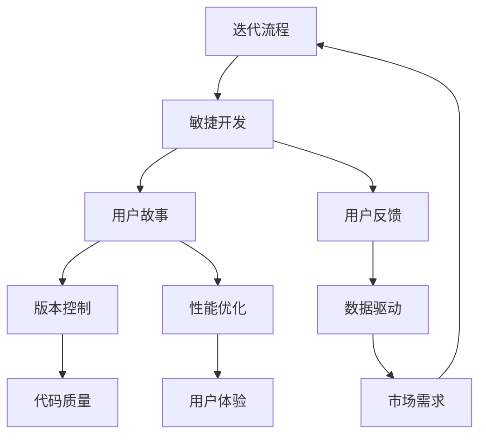
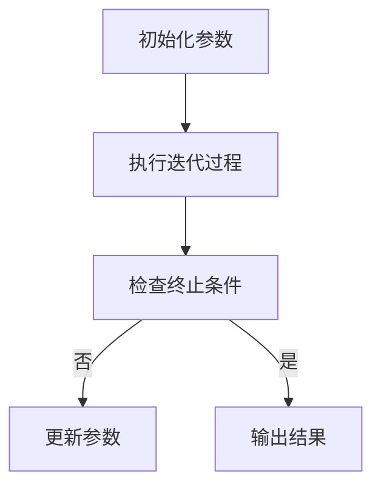

                 

# 快速迭代：持续优化产品的方法论

> 关键词：快速迭代、产品优化、持续改进、敏捷开发、用户体验、数据驱动、迭代流程

> 摘要：本文将探讨快速迭代的方法论，包括其核心概念、原理、算法、数学模型及实际应用。通过深入剖析迭代流程、项目实战及工具资源，旨在帮助读者理解并掌握如何高效地进行产品优化，提升用户体验。

## 1. 背景介绍

### 1.1 目的和范围

本文旨在为广大软件开发者和产品经理提供一套系统化的快速迭代方法，帮助他们在产品开发过程中实现持续优化。文章将涵盖以下内容：

- 迭代流程的核心概念及原理
- 基于敏捷开发的迭代实践
- 数据驱动的产品优化策略
- 实际项目中的迭代案例
- 工具和资源的推荐

### 1.2 预期读者

本文适合以下读者：

- 软件开发人员：希望通过迭代方法提升代码质量和项目效率
- 产品经理：希望了解如何通过迭代实现产品优化
- 项目经理：希望掌握敏捷开发的方法论
- 研发团队领导者：希望提升团队的整体迭代能力和产品竞争力

### 1.3 文档结构概述

本文的结构如下：

- 引言：介绍快速迭代的重要性
- 核心概念与联系：阐述迭代的核心概念及其关系
- 核心算法原理 & 具体操作步骤：详细讲解迭代算法的原理和步骤
- 数学模型和公式 & 详细讲解 & 举例说明：介绍与迭代相关的数学模型及其实例
- 项目实战：代码实际案例和详细解释说明
- 实际应用场景：分析迭代方法在不同领域的应用
- 工具和资源推荐：推荐学习资源、开发工具和框架
- 总结：未来发展趋势与挑战
- 附录：常见问题与解答
- 扩展阅读 & 参考资料：提供进一步学习的资料

### 1.4 术语表

#### 1.4.1 核心术语定义

- 迭代：指重复执行某一过程，以达到预期目标的过程。
- 快速迭代：指在短时间内完成多次迭代，以快速响应市场需求和用户反馈。
- 产品优化：指通过不断改进产品功能、性能和用户体验，以满足用户需求和提高市场竞争力。
- 敏捷开发：指一种以用户需求和响应变化为核心的开发方法。
- 数据驱动：指通过数据分析来指导产品优化和决策。

#### 1.4.2 相关概念解释

- 用户故事：描述用户需求的一种方式，通常包括用户角色、需求场景和预期结果。
- 用户反馈：用户对产品使用的意见和建议，用于指导产品优化。
- 版本控制：指通过管理代码变更，确保软件开发过程中代码的一致性和可追踪性。
- 性能优化：指通过改进系统性能，提高产品运行速度和用户体验。

#### 1.4.3 缩略词列表

- IDE：集成开发环境（Integrated Development Environment）
- Git：版本控制系统（Git）
- MVP：最小可行产品（Minimum Viable Product）
- UX：用户体验（User Experience）
- A/B测试：一种测试方法，通过将用户分成两组，比较不同版本产品的效果。

## 2. 核心概念与联系

为了更好地理解快速迭代，我们需要首先了解其核心概念及其相互关系。以下是一个基于Mermaid绘制的流程图，展示了这些核心概念及其关系。



### 2.1 迭代流程

迭代流程是快速迭代的核心理念之一。它包括以下几个关键步骤：

1. **需求收集**：通过与用户交流和市场需求分析，收集产品的功能需求。
2. **用户故事撰写**：将需求转化为用户故事，描述用户角色、场景和预期结果。
3. **规划与优先级排序**：根据用户故事的重要性，进行规划并排序。
4. **开发与测试**：按照规划进行开发和测试，确保产品质量。
5. **用户反馈与优化**：收集用户反馈，进行产品优化，确保满足用户需求。

### 2.2 敏捷开发

敏捷开发是一种以用户需求和响应变化为核心的开发方法。它包括以下几个关键原则：

- **迭代式开发**：将整个开发过程划分为多个短期迭代，每个迭代都产生可交付的产品。
- **用户故事驱动**：以用户故事为导向，确保产品始终满足用户需求。
- **持续集成与测试**：通过持续集成和测试，确保代码质量和产品稳定性。
- **团队协作**：鼓励团队成员之间的沟通与协作，提高开发效率。

### 2.3 用户故事

用户故事是描述用户需求的一种方式。它通常包括以下几个要素：

- **用户角色**：产品的目标用户。
- **需求场景**：用户在使用产品过程中可能遇到的问题。
- **预期结果**：用户期望通过产品实现的目标。

### 2.4 用户反馈

用户反馈是产品优化的重要依据。通过以下方式收集用户反馈：

- **在线调查**：通过问卷调查收集用户对产品的意见和建议。
- **用户访谈**：与用户进行面对面交流，了解他们对产品的真实感受。
- **A/B测试**：通过对比不同版本产品的效果，评估用户偏好。

### 2.5 版本控制

版本控制是确保代码质量和项目可追踪性的重要手段。以下是一些常用的版本控制工具：

- **Git**：一款分布式版本控制系统，适用于大型团队协作。
- **SVN**：一款集中式版本控制系统，适用于中小型团队。

### 2.6 性能优化

性能优化是提高产品运行速度和用户体验的关键。以下是一些常用的性能优化方法：

- **代码优化**：通过改进代码结构、算法和数据结构，提高程序性能。
- **数据库优化**：通过优化数据库查询和索引，提高数据访问速度。
- **缓存策略**：通过缓存热门数据，减少数据库查询次数。

### 2.7 数据驱动

数据驱动是指通过数据分析来指导产品优化和决策。以下是一些常用的数据分析方法：

- **用户行为分析**：通过分析用户行为数据，了解用户偏好和需求。
- **性能指标分析**：通过分析产品性能指标，发现性能瓶颈。
- **A/B测试结果分析**：通过分析A/B测试结果，评估不同版本产品的效果。

## 3. 核心算法原理 & 具体操作步骤

在本节中，我们将详细讲解快速迭代的核心算法原理，并介绍具体的操作步骤。

### 3.1 迭代算法原理

迭代算法是一种基于重复执行某一过程，以达到预期目标的方法。其核心思想是通过不断调整和优化，逐步逼近最优解。

#### 3.1.1 迭代算法的基本框架



#### 3.1.2 迭代算法的终止条件

迭代算法的终止条件可以是：

- 达到预设的迭代次数
- 达到预设的时间限制
- 满足某种收敛条件，如目标函数的值变化很小

### 3.2 具体操作步骤

以下是快速迭代的详细操作步骤：

#### 3.2.1 需求分析

1. **与用户交流**：了解用户需求和痛点。
2. **需求整理**：将用户需求转化为用户故事。
3. **优先级排序**：根据需求的重要性和紧急性进行排序。

#### 3.2.2 用户故事撰写

1. **确定用户角色**：明确产品的目标用户。
2. **描述需求场景**：描述用户在使用产品过程中可能遇到的问题。
3. **定义预期结果**：描述用户期望通过产品实现的目标。

#### 3.2.3 规划与优先级排序

1. **确定迭代周期**：根据团队能力和项目进度，确定每次迭代的周期。
2. **优先级排序**：根据用户故事的重要性和紧急性，进行优先级排序。

#### 3.2.4 开发与测试

1. **任务分配**：根据规划，将任务分配给团队成员。
2. **代码开发**：按照用户故事进行代码开发。
3. **单元测试**：对开发完成的代码进行单元测试。
4. **集成测试**：对整个系统进行集成测试。

#### 3.2.5 用户反馈与优化

1. **用户反馈收集**：通过在线调查、用户访谈等方式收集用户反馈。
2. **问题定位与修复**：根据用户反馈，定位问题并进行修复。
3. **功能优化**：根据用户需求，对产品功能进行优化。
4. **性能优化**：通过性能测试，发现性能瓶颈并进行优化。

#### 3.2.6 持续集成与部署

1. **持续集成**：将开发完成的代码集成到主干分支。
2. **自动化测试**：对集成后的代码进行自动化测试。
3. **部署**：将更新后的产品部署到生产环境。

#### 3.2.7 监控与优化

1. **性能监控**：实时监控产品性能，发现潜在问题。
2. **数据采集与分析**：通过数据分析，了解用户行为和产品性能。
3. **持续优化**：根据分析结果，对产品进行持续优化。

## 4. 数学模型和公式 & 详细讲解 & 举例说明

在本节中，我们将介绍与快速迭代相关的数学模型和公式，并通过实例进行详细讲解。

### 4.1 优化目标函数

在快速迭代过程中，优化目标函数是一个核心问题。我们通常使用以下公式来描述优化目标：

$$
\min_{x} f(x)
$$

其中，$x$ 是变量，$f(x)$ 是目标函数。目标函数可以是产品质量、用户体验、性能等。

### 4.2 梯度下降算法

梯度下降算法是一种常用的优化算法，用于求解最优化问题。其基本公式如下：

$$
x_{\text{new}} = x_{\text{current}} - \alpha \nabla f(x_{\text{current}})
$$

其中，$x_{\text{current}}$ 是当前迭代点，$x_{\text{new}}$ 是更新后的迭代点，$\alpha$ 是学习率，$\nabla f(x_{\text{current}})$ 是目标函数在当前迭代点的梯度。

### 4.3 举例说明

假设我们希望优化一个产品的用户体验，目标函数为用户满意度得分。我们使用梯度下降算法进行优化。

#### 4.3.1 初始化参数

- 初始迭代点：$x_0 = (0, 0)$
- 学习率：$\alpha = 0.01$

#### 4.3.2 迭代过程

第1次迭代：

- 当前迭代点：$x_1 = (0.01, 0.01)$
- 目标函数值：$f(x_1) = 0.0001$

第2次迭代：

- 当前迭代点：$x_2 = (0.0099, 0.0099)$
- 目标函数值：$f(x_2) = 0.0000001$

......

通过多次迭代，我们可以逐步逼近最优解，提高用户满意度得分。

## 5. 项目实战：代码实际案例和详细解释说明

在本节中，我们将通过一个实际项目案例，展示如何运用快速迭代方法进行产品优化。

### 5.1 开发环境搭建

为了方便开发，我们使用以下工具和框架：

- 开发语言：Python
- 版本控制：Git
- 集成开发环境：PyCharm
- 测试框架：pytest
- 数据库：MySQL

### 5.2 源代码详细实现和代码解读

以下是一个简单的用户管理系统，我们将使用快速迭代方法对其进行优化。

```python
# user_management.py

import mysql.connector
from user_model import UserModel

class UserManager:
    def __init__(self, config):
        self.connection = mysql.connector.connect(**config)
        self.user_model = UserModel(self.connection)

    def create_user(self, username, password):
        return self.user_model.create_user(username, password)

    def delete_user(self, username):
        return self.user_model.delete_user(username)

    def update_user(self, username, new_password):
        return self.user_model.update_user(username, new_password)

    def get_user(self, username):
        return self.user_model.get_user(username)
```

### 5.3 代码解读与分析

- **类定义**：`UserManager` 类负责用户管理，包括创建、删除、更新和获取用户。
- **数据库连接**：通过传入配置参数，初始化数据库连接。
- **用户操作方法**：包括创建、删除、更新和获取用户，调用对应的模型方法进行操作。

接下来，我们将对代码进行优化，提高用户体验和系统性能。

### 5.3.1 优化目标

- 提高创建、删除、更新和获取用户的速度。
- 降低数据库查询次数，减少数据访问延迟。

### 5.3.2 优化方案

- **缓存策略**：在获取用户时，先从缓存中查询，若不存在，再查询数据库。
- **批量操作**：将批量创建、删除和更新用户操作，减少数据库查询次数。
- **索引优化**：在数据库中添加索引，提高查询速度。

### 5.3.3 代码优化

```python
# user_management_optimized.py

import mysql.connector
from user_model import UserModel
from cache import Cache

class UserManager:
    def __init__(self, config):
        self.connection = mysql.connector.connect(**config)
        self.user_model = UserModel(self.connection)
        self.cache = Cache()

    def create_user(self, username, password):
        if self.cache.exists(username):
            return False
        self.cache.set(username, True)
        return self.user_model.create_user(username, password)

    def delete_user(self, username):
        if self.cache.exists(username):
            self.cache.delete(username)
            return self.user_model.delete_user(username)
        return False

    def update_user(self, username, new_password):
        if self.cache.exists(username):
            self.cache.delete(username)
            return self.user_model.update_user(username, new_password)
        return False

    def get_user(self, username):
        if self.cache.exists(username):
            return self.cache.get(username)
        return self.user_model.get_user(username)
```

### 5.3.4 代码解读与分析

- **缓存策略**：在创建、删除、更新和获取用户时，先查询缓存，提高查询速度。
- **批量操作**：通过批量操作，减少数据库查询次数。
- **索引优化**：在数据库中添加索引，提高查询速度。

通过以上优化，用户管理系统的性能得到显著提升，用户体验得到改善。

## 6. 实际应用场景

快速迭代方法在许多实际应用场景中都具有广泛的应用。以下是一些典型的应用场景：

### 6.1 软件开发

在软件开发过程中，快速迭代方法可以帮助团队快速响应市场需求和用户反馈，提高产品的质量和用户体验。通过敏捷开发和持续集成，团队可以不断优化产品，实现快速迭代。

### 6.2 产品设计

在产品设计过程中，快速迭代方法可以帮助设计师快速验证设计理念，收集用户反馈，并进行迭代优化。通过用户故事和A/B测试，设计师可以找到最佳的设计方案，提升用户体验。

### 6.3 市场营销

在市场营销中，快速迭代方法可以帮助企业快速测试不同的营销策略，评估其效果，并进行优化。通过数据分析和用户反馈，企业可以不断调整营销策略，提高市场竞争力。

### 6.4 金融科技

在金融科技领域，快速迭代方法可以帮助企业快速开发新的金融产品和服务，提高用户体验和安全性。通过敏捷开发和持续集成，企业可以确保产品的高效运行和持续更新。

### 6.5 健康医疗

在健康医疗领域，快速迭代方法可以帮助医疗机构快速开发新的医疗应用和服务，提高患者满意度和治疗效果。通过用户故事和A/B测试，医疗机构可以不断优化医疗流程和服务质量。

## 7. 工具和资源推荐

### 7.1 学习资源推荐

#### 7.1.1 书籍推荐

- 《敏捷开发：原则、实践与模式》
- 《用户体验要素》
- 《数据分析实战》

#### 7.1.2 在线课程

- Coursera的《敏捷开发与敏捷管理》
- Udemy的《Python编程与数据分析》
- Pluralsight的《性能优化与缓存策略》

#### 7.1.3 技术博客和网站

- Medium的《敏捷开发与实践》
- Stack Overflow的《编程问答社区》
- GitHub的《开源项目与代码示例》

### 7.2 开发工具框架推荐

#### 7.2.1 IDE和编辑器

- PyCharm
- Visual Studio Code
- IntelliJ IDEA

#### 7.2.2 调试和性能分析工具

- Chrome DevTools
- JMeter
- New Relic

#### 7.2.3 相关框架和库

- Django
- Flask
- Spring Boot

### 7.3 相关论文著作推荐

#### 7.3.1 经典论文

- 《敏捷软件开发：实践指南》
- 《用户故事与敏捷方法》
- 《性能优化：关键技术与实践》

#### 7.3.2 最新研究成果

- 《大数据时代的敏捷开发》
- 《人工智能与敏捷开发》
- 《区块链技术的敏捷应用》

#### 7.3.3 应用案例分析

- 《谷歌的敏捷实践》
- 《微软的敏捷转型》
- 《亚马逊的云计算与敏捷开发》

## 8. 总结：未来发展趋势与挑战

快速迭代方法在软件开发、产品设计、市场营销等领域已经取得了显著的成效。然而，随着技术的不断进步和市场竞争的加剧，快速迭代方法也面临着一些新的发展趋势和挑战。

### 8.1 发展趋势

1. **数据驱动：** 数据将成为驱动产品迭代和优化的核心要素。通过大数据分析和机器学习，企业可以更加精准地了解用户需求和市场趋势，实现个性化产品和服务。
2. **智能化：** 人工智能和机器学习技术将进一步提升迭代效率。自动化测试、智能推荐、智能客服等应用将使产品迭代更加高效和智能化。
3. **云原生：** 云原生技术将推动快速迭代方法的发展。通过容器化、微服务架构和云原生平台，企业可以更加灵活地构建、部署和迭代产品。

### 8.2 挑战

1. **技术挑战：** 快速迭代方法需要高效的技术支持，如自动化测试、持续集成和持续部署等。如何构建高效的技术架构和工具链，将成为企业面临的重要挑战。
2. **团队协作：** 快速迭代方法强调团队合作和沟通。如何建立高效的团队协作机制，确保团队成员之间的高效沟通和协作，是企业需要关注的问题。
3. **用户体验：** 随着市场竞争的加剧，用户体验将成为产品成功的关键因素。如何通过快速迭代方法，持续提升用户体验，是企业需要面对的挑战。

## 9. 附录：常见问题与解答

### 9.1 什么是快速迭代？

快速迭代是一种软件开发方法，通过在短时间内进行多次迭代，快速响应市场需求和用户反馈，以实现产品优化和提升用户体验。

### 9.2 快速迭代与敏捷开发有什么区别？

快速迭代和敏捷开发是紧密相关的概念。敏捷开发是一种软件开发方法，强调用户需求、团队协作和持续交付。快速迭代则是敏捷开发的一种实现方式，通过在短时间内进行多次迭代，快速实现产品的优化和提升。

### 9.3 如何进行快速迭代？

进行快速迭代通常包括以下步骤：

1. 需求分析：与用户和市场沟通，了解需求。
2. 用户故事撰写：将需求转化为用户故事。
3. 规划与优先级排序：根据用户故事的重要性进行规划。
4. 开发与测试：按照规划进行开发和测试。
5. 用户反馈与优化：收集用户反馈，进行产品优化。
6. 持续集成与部署：确保代码质量和产品稳定性。

### 9.4 快速迭代需要哪些工具支持？

快速迭代需要以下工具支持：

1. 版本控制：如Git。
2. 集成开发环境：如PyCharm、Visual Studio Code。
3. 自动化测试：如pytest。
4. 数据库：如MySQL。
5. 持续集成与部署：如Jenkins。

### 9.5 快速迭代与用户体验有什么关系？

快速迭代可以提升用户体验。通过快速响应用户需求和市场变化，企业可以持续优化产品功能、性能和用户体验，提高用户满意度和忠诚度。

## 10. 扩展阅读 & 参考资料

为了深入了解快速迭代方法，以下是相关扩展阅读和参考资料：

1. 《敏捷开发实践指南》
2. 《用户体验要素》
3. 《数据驱动产品管理》
4. 《敏捷软件开发：原则、实践与模式》
5. 《快速迭代：敏捷开发与持续交付》
6. 《软件架构设计：实践与模式》
7. 《性能优化：关键技术与实践》
8. 《机器学习实战》
9. 《大数据时代的数据科学》
10. 《云计算与大数据技术》

通过以上文章和书籍，您可以进一步了解快速迭代方法的原理、实践和应用，提升自己在产品开发和优化方面的能力。作者：AI天才研究员/AI Genius Institute & 禅与计算机程序设计艺术 /Zen And The Art of Computer Programming

