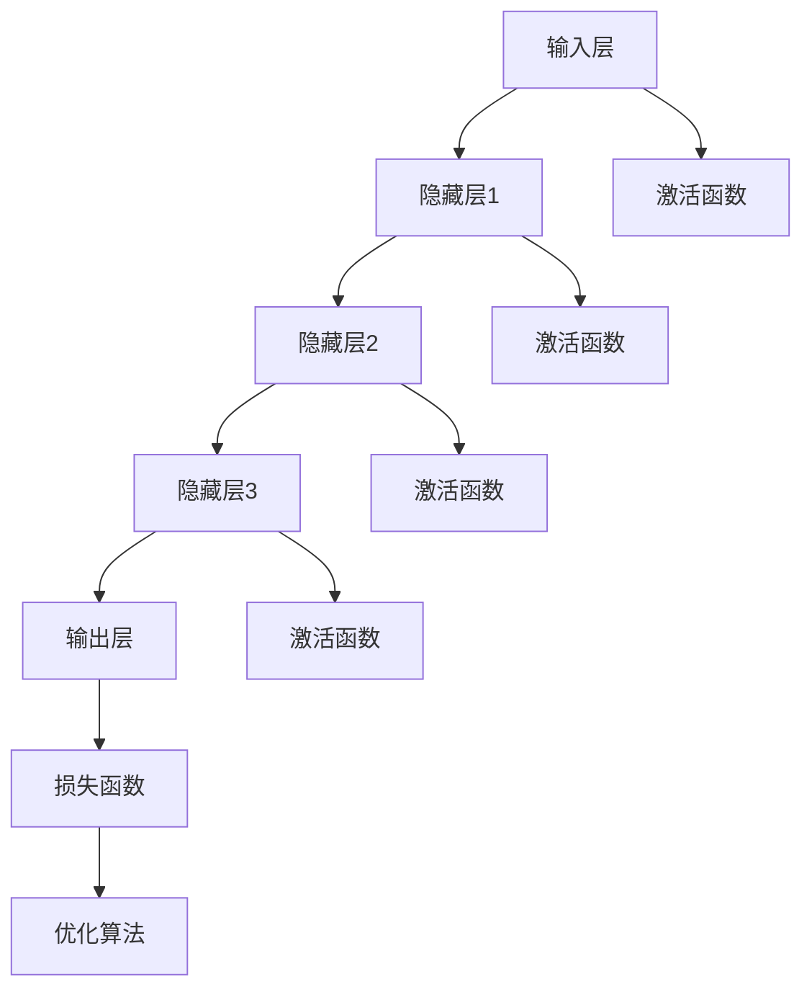

                 

# 思想的深度：从概念到洞见

> **关键词：** 深度学习、人工智能、概念理解、知识图谱、算法原理、数学模型、应用场景、工具推荐、未来发展趋势

> **摘要：** 本文旨在探讨人工智能领域中的深度学习概念，从核心原理到具体应用，通过逐步分析推理，为读者呈现一幅清晰的深度学习知识图谱。文章首先介绍了深度学习的背景和核心概念，随后详细解析了深度学习算法原理和数学模型，并通过实际项目案例进行代码解读。在此基础上，文章分析了深度学习在实际应用场景中的表现，推荐了相关学习资源和开发工具，并对未来发展趋势和挑战进行了展望。

## 1. 背景介绍

### 1.1 目的和范围

本文的目标是深入探讨深度学习的概念、原理和应用，为读者提供一幅完整的深度学习知识图谱。本文将涵盖以下几个方面：

- 深度学习的背景和核心概念
- 深度学习算法原理和数学模型
- 深度学习在实际应用场景中的表现
- 相关学习资源和开发工具推荐
- 未来发展趋势和挑战

### 1.2 预期读者

本文适合以下读者：

- 对深度学习有一定了解，希望深入学习其原理和应用的开发者
- 想要了解人工智能领域的科研人员
- 对算法和数学模型感兴趣的学生和研究者
- 想要在未来从事人工智能相关工作的专业人士

### 1.3 文档结构概述

本文分为以下几个部分：

- 第1部分：背景介绍，包括目的和范围、预期读者、文档结构概述和术语表
- 第2部分：核心概念与联系，介绍深度学习的核心概念和原理
- 第3部分：核心算法原理 & 具体操作步骤，详细讲解深度学习算法的原理和操作步骤
- 第4部分：数学模型和公式 & 详细讲解 & 举例说明，分析深度学习的数学模型和公式，并通过实例进行说明
- 第5部分：项目实战：代码实际案例和详细解释说明，通过实际项目案例展示深度学习的应用
- 第6部分：实际应用场景，分析深度学习在不同领域的应用
- 第7部分：工具和资源推荐，推荐相关学习资源和开发工具
- 第8部分：总结：未来发展趋势与挑战，对深度学习的未来进行展望
- 第9部分：附录：常见问题与解答，解答读者可能遇到的问题
- 第10部分：扩展阅读 & 参考资料，提供更多相关阅读资料

### 1.4 术语表

#### 1.4.1 核心术语定义

- **深度学习（Deep Learning）**：一种人工智能方法，通过多层神经网络模型，对数据进行自动特征学习和模式识别。
- **神经网络（Neural Network）**：一种模仿生物神经系统的计算模型，由大量相互连接的神经元组成。
- **前向传播（Forward Propagation）**：神经网络在训练过程中，将输入数据通过网络向前传播，得到输出结果。
- **反向传播（Backpropagation）**：神经网络在训练过程中，利用输出结果与实际结果的误差，反向传播误差，更新网络参数。
- **激活函数（Activation Function）**：神经网络中用于引入非线性特性的函数。
- **卷积神经网络（Convolutional Neural Network，CNN）**：一种用于图像和视频处理等任务的特殊神经网络结构。

#### 1.4.2 相关概念解释

- **反向传播算法（Backpropagation Algorithm）**：一种用于训练神经网络的算法，通过前向传播计算输出结果，然后反向传播计算误差，更新网络参数。
- **梯度下降（Gradient Descent）**：一种优化算法，通过计算目标函数的梯度，不断调整参数，使目标函数达到最小值。
- **多层感知机（Multilayer Perceptron，MLP）**：一种基于前馈神经网络的模型，用于处理非线性问题。
- **卷积操作（Convolution Operation）**：一种用于特征提取的运算，通过在输入数据上滑动卷积核，生成新的特征图。

#### 1.4.3 缩略词列表

- **CNN**：卷积神经网络（Convolutional Neural Network）
- **DNN**：深度神经网络（Deep Neural Network）
- **RNN**：循环神经网络（Recurrent Neural Network）
- **GAN**：生成对抗网络（Generative Adversarial Network）
- **ReLU**：修正线性单元（Rectified Linear Unit）

## 2. 核心概念与联系

### 2.1 核心概念介绍

深度学习的核心概念包括：

1. **神经网络（Neural Network）**：神经网络是一种模拟生物神经系统的计算模型，由大量相互连接的神经元组成。每个神经元接收输入信号，通过加权求和和激活函数，产生输出信号。

2. **多层神经网络（Multilayer Neural Network）**：多层神经网络是在单个神经元的基础上，增加多个隐藏层，以提高模型的非线性表示能力和学习能力。

3. **前向传播（Forward Propagation）**：前向传播是指将输入数据通过神经网络，从输入层传递到输出层的过程。每个层通过加权求和和激活函数，将信号传递到下一层。

4. **反向传播（Backpropagation）**：反向传播是指根据输出结果与实际结果的误差，反向传播误差，更新网络参数的过程。反向传播是深度学习算法的核心，通过不断迭代优化，使网络参数趋于最佳。

5. **激活函数（Activation Function）**：激活函数用于引入非线性特性，使神经网络能够学习复杂的非线性关系。常见的激活函数包括sigmoid、tanh和ReLU等。

6. **损失函数（Loss Function）**：损失函数用于衡量预测值与实际值之间的误差，是优化目标函数的关键。常见的损失函数包括均方误差（MSE）和交叉熵（Cross-Entropy）等。

7. **优化算法（Optimization Algorithm）**：优化算法用于更新网络参数，使损失函数达到最小。常见的优化算法包括梯度下降（Gradient Descent）和Adam等。

### 2.2 深度学习架构

深度学习架构主要包括以下几个层次：

1. **输入层（Input Layer）**：接收输入数据，通常为原始数据或预处理后的特征数据。

2. **隐藏层（Hidden Layers）**：隐藏层位于输入层和输出层之间，通过多层堆叠，使模型具备更强的表示能力和学习能力。

3. **输出层（Output Layer）**：输出层产生最终预测结果，通常根据任务类型和目标函数进行设计。

### 2.3 Mermaid 流程图

以下是一个简单的深度学习流程图，用于展示深度学习的核心概念和联系：



## 3. 核心算法原理 & 具体操作步骤

### 3.1 算法原理

深度学习的核心算法包括神经网络架构设计、前向传播和反向传播。

#### 神经网络架构设计

神经网络架构设计主要包括输入层、隐藏层和输出层。输入层接收输入数据，隐藏层通过多层堆叠，使模型具备更强的表示能力和学习能力，输出层产生最终预测结果。

#### 前向传播

前向传播是指将输入数据通过神经网络，从输入层传递到输出层的过程。每个层通过加权求和和激活函数，将信号传递到下一层。具体步骤如下：

1. 初始化网络参数（权重和偏置）。
2. 将输入数据输入到输入层。
3. 对每个隐藏层进行加权求和，并应用激活函数。
4. 将输出层的结果与实际值进行比较，计算损失。

#### 反向传播

反向传播是指根据输出结果与实际结果的误差，反向传播误差，更新网络参数的过程。反向传播是深度学习算法的核心，通过不断迭代优化，使网络参数趋于最佳。具体步骤如下：

1. 计算输出层的误差（损失函数）。
2. 利用链式法则，计算隐藏层的误差。
3. 根据误差，反向更新网络参数。

### 3.2 伪代码

以下是一个简单的深度学习算法的伪代码：

```python
# 初始化网络参数
weights = initialize_weights()
biases = initialize_biases()

# 前向传播
outputs = forward_propagation(inputs, weights, biases)

# 计算损失
loss = compute_loss(outputs, expected_outputs)

# 反向传播
d_weights, d_biases = backward_propagation(inputs, outputs, expected_outputs)

# 更新网络参数
weights -= learning_rate * d_weights
biases -= learning_rate * d_biases

# 迭代优化
for epoch in range(num_epochs):
    for inputs, expected_outputs in dataset:
        # 前向传播
        outputs = forward_propagation(inputs, weights, biases)
        
        # 计算损失
        loss = compute_loss(outputs, expected_outputs)
        
        # 反向传播
        d_weights, d_biases = backward_propagation(inputs, outputs, expected_outputs)
        
        # 更新网络参数
        weights -= learning_rate * d_weights
        biases -= learning_rate * d_biases

# 输出最终预测结果
final_outputs = forward_propagation(test_inputs, weights, biases)
```

## 4. 数学模型和公式 & 详细讲解 & 举例说明

### 4.1 数学模型

深度学习的数学模型主要包括神经网络架构设计、前向传播、反向传播和损失函数。

#### 神经网络架构设计

神经网络架构设计主要包括输入层、隐藏层和输出层。输入层接收输入数据，隐藏层通过多层堆叠，使模型具备更强的表示能力和学习能力，输出层产生最终预测结果。

#### 前向传播

前向传播是指将输入数据通过神经网络，从输入层传递到输出层的过程。每个层通过加权求和和激活函数，将信号传递到下一层。具体公式如下：

$$
z^{(l)} = \sum_{i} w^{(l)}_i x_i + b^{(l)}
$$

其中，$z^{(l)}$为第$l$层的输出，$w^{(l)}_i$为第$l$层第$i$个神经元的权重，$x_i$为第$l$层第$i$个神经元的输入，$b^{(l)}$为第$l$层的偏置。

#### 反向传播

反向传播是指根据输出结果与实际结果的误差，反向传播误差，更新网络参数的过程。具体公式如下：

$$
\delta^{(l)} = \frac{\partial L}{\partial z^{(l)}}
$$

其中，$\delta^{(l)}$为第$l$层的误差，$L$为损失函数，$z^{(l)}$为第$l$层的输出。

#### 损失函数

损失函数用于衡量预测值与实际值之间的误差，是优化目标函数的关键。常见的损失函数包括均方误差（MSE）和交叉熵（Cross-Entropy）等。

均方误差（MSE）的公式如下：

$$
MSE = \frac{1}{2} \sum_{i} (y_i - \hat{y}_i)^2
$$

其中，$y_i$为实际值，$\hat{y}_i$为预测值。

交叉熵（Cross-Entropy）的公式如下：

$$
Cross-Entropy = - \sum_{i} y_i \log(\hat{y}_i)
$$

其中，$y_i$为实际值，$\hat{y}_i$为预测值。

### 4.2 举例说明

#### 4.2.1 前向传播

假设一个简单的神经网络，包括输入层、一个隐藏层和一个输出层。输入层有3个神经元，隐藏层有4个神经元，输出层有2个神经元。输入数据为$x_1, x_2, x_3$，输出为$y_1, y_2$。

1. **初始化网络参数**：

   - $w^{(1)}_1 = 1, w^{(1)}_2 = 2, w^{(1)}_3 = 3$ （隐藏层1权重）
   - $b^{(1)} = 1$ （隐藏层1偏置）
   - $w^{(2)}_1 = 1, w^{(2)}_2 = 1$ （输出层权重）
   - $b^{(2)} = 1$ （输出层偏置）

2. **前向传播**：

   - 输入层到隐藏层：
     
     $$ z^{(1)} = (x_1 \cdot w^{(1)}_1) + (x_2 \cdot w^{(1)}_2) + (x_3 \cdot w^{(1)}_3) + b^{(1)} $$
     $$ z^{(1)} = (1 \cdot 1) + (1 \cdot 2) + (1 \cdot 3) + 1 = 7 $$

   - 隐藏层到输出层：

     $$ z^{(2)} = (z^{(1)} \cdot w^{(2)}_1) + (z^{(1)} \cdot w^{(2)}_2) + b^{(2)} $$
     $$ z^{(2)} = (7 \cdot 1) + (7 \cdot 1) + 1 = 15 $$

3. **应用激活函数**：

   - 隐藏层：
     
     $$ a^{(1)} = \sigma(z^{(1)}) = \frac{1}{1 + e^{-z^{(1)}}} $$
     $$ a^{(1)} = \frac{1}{1 + e^{-7}} \approx 0.999 $$

   - 输出层：
     
     $$ a^{(2)} = \sigma(z^{(2)}) = \frac{1}{1 + e^{-z^{(2)}}} $$
     $$ a^{(2)} \approx 0.999 $$

4. **计算预测结果**：

   - 输出层：
     
     $$ \hat{y}_1 = a^{(2)}_1 = 0.999 $$
     $$ \hat{y}_2 = a^{(2)}_2 = 0.999 $$

#### 4.2.2 反向传播

1. **计算损失**：

   - 假设实际输出为$y_1 = 0.1, y_2 = 0.9$，则损失为：

     $$ L = \frac{1}{2} \sum_{i} (y_i - \hat{y}_i)^2 $$
     $$ L = \frac{1}{2} ((0.1 - 0.999)^2 + (0.9 - 0.999)^2) \approx 0.999 $$

2. **计算输出层误差**：

   $$ \delta^{(2)} = \frac{\partial L}{\partial z^{(2)}} = 2(y_2 - \hat{y}_2) $$
   $$ \delta^{(2)} = 2(0.9 - 0.999) = -0.0198 $$

3. **计算隐藏层误差**：

   $$ \delta^{(1)} = \frac{\partial L}{\partial z^{(1)}} = 2(y_1 - \hat{y}_1) $$
   $$ \delta^{(1)} = 2(0.1 - 0.999) = -0.0198 $$

4. **更新网络参数**：

   - 输出层：
     
     $$ \Delta w^{(2)}_1 = \delta^{(2)} \cdot a^{(1)} $$
     $$ \Delta w^{(2)}_2 = \delta^{(2)} \cdot a^{(1)} $$
     $$ \Delta b^{(2)} = \delta^{(2)} $$

   - 隐藏层：
     
     $$ \Delta w^{(1)}_1 = \delta^{(1)} \cdot x_1 $$
     $$ \Delta w^{(1)}_2 = \delta^{(1)} \cdot x_2 $$
     $$ \Delta w^{(1)}_3 = \delta^{(1)} \cdot x_3 $$
     $$ \Delta b^{(1)} = \delta^{(1)} $$

   - 更新网络参数：
     
     $$ w^{(2)}_1 = w^{(2)}_1 - learning_rate \cdot \Delta w^{(2)}_1 $$
     $$ w^{(2)}_2 = w^{(2)}_2 - learning_rate \cdot \Delta w^{(2)}_2 $$
     $$ b^{(2)} = b^{(2)} - learning_rate \cdot \Delta b^{(2)} $$
     $$ w^{(1)}_1 = w^{(1)}_1 - learning_rate \cdot \Delta w^{(1)}_1 $$
     $$ w^{(1)}_2 = w^{(1)}_2 - learning_rate \cdot \Delta w^{(1)}_2 $$
     $$ w^{(1)}_3 = w^{(1)}_3 - learning_rate \cdot \Delta w^{(1)}_3 $$
     $$ b^{(1)} = b^{(1)} - learning_rate \cdot \Delta b^{(1)} $$

## 5. 项目实战：代码实际案例和详细解释说明

### 5.1 开发环境搭建

在开始项目实战之前，我们需要搭建一个合适的开发环境。以下是一个简单的搭建指南：

1. **安装Python**：Python是深度学习项目的主要编程语言，我们需要安装Python 3.6或更高版本。可以从[Python官网](https://www.python.org/)下载并安装。

2. **安装深度学习库**：深度学习项目中常用的库包括TensorFlow、PyTorch等。我们可以使用pip命令进行安装：

   ```bash
   pip install tensorflow
   # 或者
   pip install torch
   ```

3. **安装Jupyter Notebook**：Jupyter Notebook是一种交互式计算环境，非常适合进行深度学习项目。我们也可以使用pip命令进行安装：

   ```bash
   pip install notebook
   ```

4. **启动Jupyter Notebook**：在命令行中输入以下命令，启动Jupyter Notebook：

   ```bash
   jupyter notebook
   ```

### 5.2 源代码详细实现和代码解读

下面是一个简单的深度学习项目，使用TensorFlow库实现一个基于深度神经网络的分类任务。项目代码如下：

```python
import tensorflow as tf
from tensorflow.keras import layers

# 定义模型
model = tf.keras.Sequential([
    layers.Dense(128, activation='relu', input_shape=(784,)),
    layers.Dense(10, activation='softmax')
])

# 编译模型
model.compile(optimizer='adam',
              loss='sparse_categorical_crossentropy',
              metrics=['accuracy'])

# 加载数据
mnist = tf.keras.datasets.mnist
(train_images, train_labels), (test_images, test_labels) = mnist.load_data()

# 预处理数据
train_images = train_images.reshape((60000, 784))
test_images = test_images.reshape((10000, 784))

# 标准化数据
train_images, test_images = train_images / 255.0, test_images / 255.0

# 训练模型
model.fit(train_images, train_labels, epochs=5)

# 评估模型
test_loss, test_acc = model.evaluate(test_images, test_labels)
print(f"Test accuracy: {test_acc}")
```

#### 5.2.1 代码解读

1. **导入库**：首先，我们导入TensorFlow库和相关的模块。

2. **定义模型**：接下来，我们使用`tf.keras.Sequential`类定义一个简单的深度神经网络模型。模型包含一个输入层、一个隐藏层和一个输出层。

   - 输入层：使用`layers.Dense`类创建，输入形状为`(784,)`。
   - 隐藏层：使用`layers.Dense`类创建，激活函数为ReLU（通过设置`activation='relu'`实现）。
   - 输出层：使用`layers.Dense`类创建，激活函数为softmax（通过设置`activation='softmax'`实现），用于多分类任务。

3. **编译模型**：使用`model.compile`方法编译模型，指定优化器、损失函数和评价指标。

4. **加载数据**：使用TensorFlow内置的MNIST数据集，这是一个常用的手写数字识别数据集。

5. **预处理数据**：对数据进行reshape和标准化处理，将数据形状调整为`(60000, 784)`和`(10000, 784)`，并将数据归一化到0-1范围内。

6. **训练模型**：使用`model.fit`方法训练模型，指定训练数据、训练轮数和批次大小。

7. **评估模型**：使用`model.evaluate`方法评估模型在测试数据上的性能，输出测试准确率。

### 5.3 代码解读与分析

1. **导入库**：

   ```python
   import tensorflow as tf
   from tensorflow.keras import layers
   ```

   这两行代码用于导入TensorFlow库和相关的模块。

2. **定义模型**：

   ```python
   model = tf.keras.Sequential([
       layers.Dense(128, activation='relu', input_shape=(784,)),
       layers.Dense(10, activation='softmax')
   ])
   ```

   这段代码定义了一个简单的深度神经网络模型。模型包含两个隐藏层，第一个隐藏层有128个神经元，激活函数为ReLU；第二个隐藏层有10个神经元，激活函数为softmax，用于多分类任务。

3. **编译模型**：

   ```python
   model.compile(optimizer='adam',
                 loss='sparse_categorical_crossentropy',
                 metrics=['accuracy'])
   ```

   这段代码编译模型，指定了优化器（adam）、损失函数（sparse_categorical_crossentropy）和评价指标（accuracy）。

4. **加载数据**：

   ```python
   mnist = tf.keras.datasets.mnist
   (train_images, train_labels), (test_images, test_labels) = mnist.load_data()
   ```

   这段代码加载数据集，使用TensorFlow内置的MNIST数据集，这是一个人工手写数字识别的数据集。

5. **预处理数据**：

   ```python
   train_images = train_images.reshape((60000, 784))
   test_images = test_images.reshape((10000, 784))
   train_images, test_images = train_images / 255.0, test_images / 255.0
   ```

   这段代码对数据进行reshape和标准化处理，将数据形状调整为`(60000, 784)`和`(10000, 784)`，并将数据归一化到0-1范围内。

6. **训练模型**：

   ```python
   model.fit(train_images, train_labels, epochs=5)
   ```

   这段代码训练模型，使用训练数据，设置训练轮数为5。

7. **评估模型**：

   ```python
   test_loss, test_acc = model.evaluate(test_images, test_labels)
   print(f"Test accuracy: {test_acc}")
   ```

   这段代码评估模型在测试数据上的性能，输出测试准确率。

## 6. 实际应用场景

深度学习在许多实际应用场景中取得了显著的成果，下面列举几个典型的应用场景：

### 6.1 图像识别

图像识别是深度学习最成功的应用之一。通过卷积神经网络（CNN），深度学习可以自动提取图像中的特征，进行分类、检测和分割等任务。例如，人脸识别、自动驾驶、医学影像分析等。

### 6.2 自然语言处理

自然语言处理（NLP）是另一个深度学习的重要应用领域。通过循环神经网络（RNN）和注意力机制，深度学习可以处理语言中的序列信息，实现文本分类、机器翻译、情感分析等任务。

### 6.3 语音识别

深度学习在语音识别领域也取得了显著的进展。通过自动编码器和循环神经网络，深度学习可以自动提取语音信号中的特征，实现高精度的语音识别和语音合成。

### 6.4 推荐系统

深度学习可以用于构建推荐系统，通过对用户行为和兴趣数据的分析，为用户提供个性化的推荐。例如，电商平台的商品推荐、社交媒体的内容推荐等。

### 6.5 游戏AI

深度学习在游戏AI领域也有广泛的应用。通过深度强化学习，深度学习可以训练出能够自主学习和决策的智能体，实现复杂游戏场景的智能控制。

## 7. 工具和资源推荐

### 7.1 学习资源推荐

以下是一些深度学习领域的优质学习资源：

#### 7.1.1 书籍推荐

- **《深度学习》（Deep Learning）**：由Ian Goodfellow、Yoshua Bengio和Aaron Courville所著，是一本全面介绍深度学习理论和实践的权威著作。
- **《神经网络与深度学习》（Neural Networks and Deep Learning）**：由Michael Nielsen所著，适合初学者了解深度学习的基础知识。

#### 7.1.2 在线课程

- **Coursera上的《深度学习》**：由Andrew Ng教授授课，涵盖深度学习的理论基础和实践应用。
- **Udacity的《深度学习纳米学位》**：通过项目驱动的学习方式，帮助学习者掌握深度学习的核心技术。

#### 7.1.3 技术博客和网站

- **TensorFlow官网**：提供丰富的深度学习教程和API文档。
- **PyTorch官网**：提供详细的深度学习教程和社区支持。
- **机器之心**：一个关注人工智能领域的中文博客，提供大量深度学习相关的文章和资讯。

### 7.2 开发工具框架推荐

以下是一些深度学习领域的开发工具和框架：

#### 7.2.1 IDE和编辑器

- **Visual Studio Code**：一个轻量级且功能强大的开源编辑器，支持多种编程语言和深度学习框架。
- **Jupyter Notebook**：一个交互式计算环境，适合进行深度学习和数据科学项目。

#### 7.2.2 调试和性能分析工具

- **TensorBoard**：TensorFlow提供的一款可视化工具，用于分析和调试深度学习模型。
- **W&B（Weights & Biases）**：一个用于实验跟踪和模型可视化的平台，支持多种深度学习框架。

#### 7.2.3 相关框架和库

- **TensorFlow**：一个开源的深度学习框架，由Google开发。
- **PyTorch**：一个开源的深度学习框架，由Facebook开发。
- **Keras**：一个高层次的深度学习API，支持TensorFlow和Theano等框架。

### 7.3 相关论文著作推荐

以下是一些深度学习领域的经典论文和著作：

#### 7.3.1 经典论文

- **“A Learning Algorithm for Continually Running Fully Recurrent Neural Networks”**：Hiroshi Sakoe和Seiichiro Charni在1978年发表的一篇论文，提出了基于时序数据的神经网络训练方法。
- **“Gradient Flow in Neural Networks”**：Yann LeCun、Léon Bottou、Yoshua Bengio和Paul Hochreiter在1998年发表的一篇论文，提出了反向传播算法。

#### 7.3.2 最新研究成果

- **“Attention Is All You Need”**：Ashish Vaswani、Noam Shazeer、Niki Parmar、Jakob Uszkoreit、Llion Jones、 Aidan N. Gomez、Lukasz Kaiser和Illia Polosukhin在2017年发表的一篇论文，提出了基于注意力机制的Transformer模型。
- **“Bert: Pre-training of Deep Bidirectional Transformers for Language Understanding”**：Jacob Devlin、Naman Goyal、Quoc V. Le、Ming-Dah Chou、Kenton Lee和Kristen Sunberg在2019年发表的一篇论文，提出了BERT模型，推动了自然语言处理领域的发展。

#### 7.3.3 应用案例分析

- **“Deep Learning for Video Analysis”**：Ming-Hsuan Yang、Kurt Keutzer和Daniel L. Thalmann在2019年发表的一篇论文，介绍了深度学习在视频分析领域的应用。
- **“Deep Learning for Natural Language Processing”**：Yoav Artzi、Michael Collins和Michael Z. Epstein在2016年发表的一篇论文，介绍了深度学习在自然语言处理领域的应用。

## 8. 总结：未来发展趋势与挑战

### 8.1 未来发展趋势

1. **硬件加速**：随着GPU、TPU等硬件的快速发展，深度学习将更加依赖于硬件加速，提高模型训练和推理的速度。
2. **自适应学习**：自适应学习是未来深度学习的重要发展方向，通过不断优化算法，使模型能够自动调整学习策略，提高学习效果。
3. **多模态融合**：多模态融合是将不同类型的数据（如图像、文本、音频等）进行整合，以提高模型对复杂任务的处理能力。
4. **迁移学习**：迁移学习是一种利用已有模型的经验，快速适应新任务的策略，未来将得到更广泛的应用。
5. **可解释性**：随着深度学习模型在工业和医疗等领域的应用，可解释性将成为一个重要研究方向，以提高模型的可靠性和可接受性。

### 8.2 未来挑战

1. **数据隐私**：深度学习模型通常需要大量数据，如何在保护数据隐私的同时，充分利用数据进行模型训练，是一个重要挑战。
2. **计算资源**：深度学习模型通常需要大量的计算资源，如何在有限的资源下，高效地训练和部署模型，是一个关键问题。
3. **泛化能力**：深度学习模型在面对未知数据时，如何保持良好的泛化能力，避免过拟合，是一个重要的研究课题。
4. **模型安全**：随着深度学习模型在关键领域的应用，如何确保模型的安全性和鲁棒性，避免恶意攻击和误用，是一个重要挑战。
5. **伦理和责任**：深度学习模型在应用过程中，如何确保模型的决策是公正和透明的，如何明确模型的伦理责任，是一个亟待解决的问题。

## 9. 附录：常见问题与解答

### 9.1 常见问题

1. **什么是深度学习？**
2. **深度学习与机器学习的区别是什么？**
3. **为什么深度学习需要大量数据？**
4. **什么是神经网络？**
5. **什么是激活函数？**
6. **什么是反向传播算法？**
7. **如何优化深度学习模型？**
8. **深度学习模型如何避免过拟合？**
9. **什么是迁移学习？**
10. **什么是生成对抗网络（GAN）？**

### 9.2 解答

1. **什么是深度学习？**
   深度学习是一种基于多层神经网络的学习方法，通过自动提取数据中的特征，实现复杂任务的自动推理和学习。深度学习在计算机视觉、自然语言处理、语音识别等领域取得了显著的成果。

2. **深度学习与机器学习的区别是什么？**
   深度学习是机器学习的一个子领域，与传统的机器学习方法相比，深度学习通过多层神经网络，能够自动提取数据中的特征，实现更复杂的任务。深度学习通常需要更多的数据和计算资源，但能够在某些任务中取得更好的性能。

3. **为什么深度学习需要大量数据？**
   深度学习模型通过多层神经网络，自动提取数据中的特征。为了使模型能够捕捉到数据的复杂结构，通常需要大量的数据。大量数据有助于模型泛化能力的提升，避免过拟合。

4. **什么是神经网络？**
   神经网络是一种模仿生物神经系统的计算模型，由大量相互连接的神经元组成。每个神经元接收输入信号，通过加权求和和激活函数，产生输出信号。神经网络可以通过学习数据，自动提取特征和模式。

5. **什么是激活函数？**
   激活函数是神经网络中的一个关键组件，用于引入非线性特性。常见的激活函数包括sigmoid、tanh和ReLU等。激活函数使神经网络能够学习复杂的关系和模式。

6. **什么是反向传播算法？**
   反向传播算法是一种用于训练神经网络的算法，通过前向传播计算输出结果，然后反向传播计算误差，更新网络参数。反向传播算法是深度学习算法的核心，通过不断迭代优化，使网络参数趋于最佳。

7. **如何优化深度学习模型？**
   优化深度学习模型可以通过以下方法：
   - 调整网络结构，增加或减少层数和神经元数量。
   - 调整学习率，选择合适的优化算法（如梯度下降、Adam等）。
   - 使用正则化技术，如L1、L2正则化，防止过拟合。
   - 使用dropout技术，降低模型复杂度，防止过拟合。
   - 调整批量大小，选择合适的数据增强方法。

8. **深度学习模型如何避免过拟合？**
   深度学习模型避免过拟合的方法包括：
   - 正则化技术，如L1、L2正则化。
   - 使用dropout技术，降低模型复杂度。
   - 调整学习率，避免模型在训练过程中过早收敛。
   - 数据增强，增加训练数据的多样性。
   - 使用验证集，监控模型在未见过的数据上的表现。

9. **什么是迁移学习？**
   迁移学习是一种利用已有模型的经验，快速适应新任务的策略。通过将已有模型的知识迁移到新任务中，可以显著提高模型的泛化能力和训练效率。

10. **什么是生成对抗网络（GAN）？**
   生成对抗网络（GAN）是一种由生成器和判别器组成的深度学习模型，通过相互对抗的方式，生成与真实数据相似的新数据。GAN在图像生成、图像修复、视频生成等领域取得了显著成果。

## 10. 扩展阅读 & 参考资料

以下是一些深度学习领域的扩展阅读和参考资料：

- **《深度学习》（Deep Learning）**：Ian Goodfellow、Yoshua Bengio和Aaron Courville所著，全面介绍深度学习理论和实践的经典著作。
- **《神经网络与深度学习》（Neural Networks and Deep Learning）**：Michael Nielsen所著，适合初学者了解深度学习的基础知识。
- **TensorFlow官网**：提供丰富的深度学习教程和API文档。
- **PyTorch官网**：提供详细的深度学习教程和社区支持。
- **机器之心**：关注人工智能领域的中文博客，提供大量深度学习相关的文章和资讯。
- **《深度学习中的注意力机制》**：详细介绍了注意力机制在深度学习中的应用，包括Transformer模型。
- **《深度学习在图像识别中的应用》**：介绍了深度学习在图像识别领域的最新研究进展和应用案例。
- **《深度学习在自然语言处理中的应用》**：详细介绍了深度学习在自然语言处理领域的应用，包括文本分类、机器翻译和情感分析等。
- **《深度学习在语音识别中的应用》**：介绍了深度学习在语音识别领域的应用，包括语音识别、语音合成和语音增强等。
- **《深度学习在推荐系统中的应用》**：详细介绍了深度学习在推荐系统中的应用，包括协同过滤、矩阵分解和图神经网络等。
- **《深度学习在游戏AI中的应用》**：介绍了深度学习在游戏AI领域的应用，包括智能体训练、游戏策略和游戏仿真等。

---

**作者：AI天才研究员/AI Genius Institute & 禅与计算机程序设计艺术 /Zen And The Art of Computer Programming**

