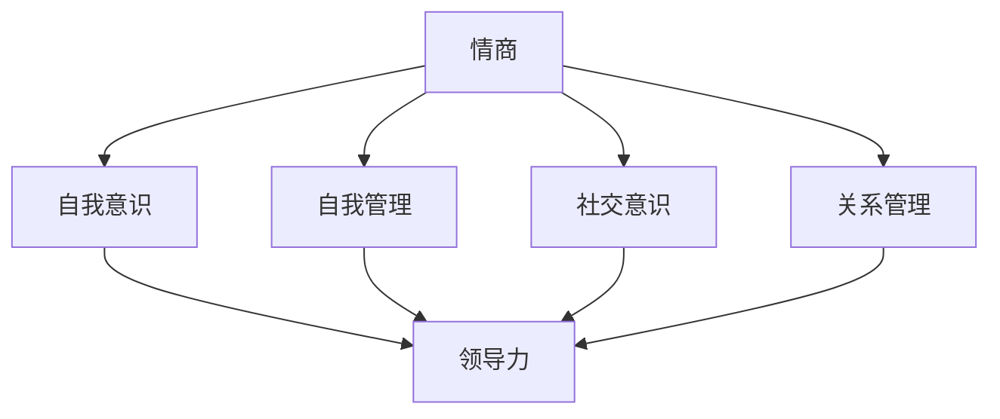

                 

# 情商领导力：提升团队凝聚力的关键因素

> **关键词：情商、领导力、团队凝聚力、团队管理、沟通技巧**
>
> **摘要：本文探讨了情商在领导力中的重要性，以及如何运用情商提升团队凝聚力。通过深入分析情商的理论基础和实际应用，本文提供了一系列实用的方法和技巧，帮助领导者构建高效团队。**

## 1. 背景介绍

### 1.1 目的和范围

本文旨在探讨情商在领导力中的关键作用，尤其是如何通过提升情商来增强团队凝聚力。文章将首先介绍情商的基本概念和重要性，接着分析情商与领导力的关系，并提出具体的策略和技巧，帮助领导者提升团队凝聚力。

### 1.2 预期读者

本文适用于希望提升团队管理能力的领导者、团队负责人以及对情商和领导力感兴趣的读者。文章将为读者提供实用的工具和方法，帮助他们在实际工作中运用情商，提高团队绩效。

### 1.3 文档结构概述

本文分为八个主要部分：

1. 背景介绍：介绍本文的目的和预期读者，概述文章结构。
2. 核心概念与联系：详细解释情商和领导力的基本概念，展示它们之间的联系。
3. 核心算法原理 & 具体操作步骤：分析提升情商的具体策略和技巧。
4. 数学模型和公式 & 详细讲解 & 举例说明：探讨情商提升过程中的数学原理。
5. 项目实战：通过实际案例展示如何应用情商提升团队凝聚力。
6. 实际应用场景：分析情商提升在各个行业中的应用。
7. 工具和资源推荐：推荐相关书籍、在线课程和开发工具。
8. 总结：展望情商领导力的未来发展趋势与挑战。

### 1.4 术语表

#### 1.4.1 核心术语定义

- **情商（Emotional Intelligence，EQ）：** 指个体识别、理解、管理自己情绪和他人情绪的能力。
- **领导力（Leadership）：** 指引导和激励他人实现共同目标的能力。
- **团队凝聚力（Team Cohesion）：** 指团队成员之间的相互信任、协作和支持，以及共同为团队目标努力的程度。

#### 1.4.2 相关概念解释

- **情感管理（Emotional Management）：** 涉及识别和调节个人情绪，以及如何有效地表达情感。
- **自我意识（Self-awareness）：** 指个体对自己的情绪、需求和动机有清晰的认知。
- **社会意识（Social Awareness）：** 涉及理解和辨别他人的情绪和需求。

#### 1.4.3 缩略词列表

- **EQ：** 情商（Emotional Intelligence）
- **SEL：** 社会情感学习（Social and Emotional Learning）
- **L&D：** 培训与发展（Learning and Development）

## 2. 核心概念与联系

情商是领导力的重要组成部分，两者紧密相连。情商的高水平领导者能够更好地理解团队成员的情感状态，从而更有效地激励和引导他们。

### 情商的定义

情商（EQ）通常包括四个主要领域：

1. **自我意识（Self-awareness）：** 了解自己的情绪状态，包括情感的来源和影响。
2. **自我管理（Self-management）：** 调节情绪，保持冷静和专注。
3. **社交意识（Social awareness）：** 理解他人的情感和需求，识别社会信号。
4. **关系管理（Relationship management）：** 建立和维护积极的人际关系。

### 领导力的定义

领导力是指引导和激励他人实现共同目标的能力。它不仅涉及决策和战略规划，还包括人际沟通和团队管理。

### 情商与领导力的联系

#### 情商在领导力中的应用

1. **增强沟通能力：** 高情商的领导者能够更有效地倾听和理解团队成员的意见和需求，从而建立信任和开放沟通的渠道。
2. **激励团队成员：** 通过理解团队成员的情感状态，领导者可以更好地激励和引导他们，发挥他们的潜力。
3. **冲突解决：** 高情商的领导者能够识别和解决团队内部的冲突，维护团队的和谐与稳定。
4. **领导风格适应：** 根据团队成员的情感状态和需求，领导者可以调整自己的领导风格，更好地满足团队需求。

#### 情商提升领导力的策略

1. **自我提升：** 通过自我反思和情感管理课程，领导者可以提高自己的情商水平。
2. **建立信任：** 通过诚实和透明，领导者可以建立团队成员的信任。
3. **倾听与反馈：** 高效的沟通技巧，包括积极倾听和提供有建设性的反馈。
4. **激励与支持：** 领导者应该根据团队成员的需求和动机，提供适当的激励和支持。

### Mermaid 流程图

以下是情商提升领导力的 Mermaid 流程图：



通过这个流程图，我们可以看到情商的不同方面如何相互关联，并共同影响领导力。

## 3. 核心算法原理 & 具体操作步骤

提升情商的过程可以分为以下几个步骤：

### 3.1 自我意识

**算法原理：** 自我意识是情商的基础，涉及了解自己的情绪状态和情感需求。

**具体操作步骤：**

1. **情感日记：** 每天记录自己的情绪变化，分析情绪的触发因素和影响。
2. **情感识别：** 学习识别基本情感（如快乐、悲伤、愤怒等），并逐步扩展到更复杂的情绪。
3. **情感反思：** 定期回顾情感日记，分析自己的情绪反应模式，并寻找改进方法。

### 3.2 自我管理

**算法原理：** 自我管理涉及调节情绪，保持冷静和专注。

**具体操作步骤：**

1. **情绪调节技巧：** 学习呼吸控制、冥想等技巧，帮助自己缓解情绪压力。
2. **情绪释放：** 通过运动、艺术创作等方式释放情绪，避免情绪积累。
3. **目标设定：** 制定明确的目标，有助于提高专注力和自我控制能力。

### 3.3 社交意识

**算法原理：** 社交意识涉及理解和识别他人的情绪和需求。

**具体操作步骤：**

1. **倾听技巧：** 学习积极倾听，关注对方言辞背后的情感和需求。
2. **情感识别：** 通过观察和交流，学会识别他人的情绪状态。
3. **情感反应：** 根据他人的情感状态，适时表达同情、支持或鼓励。

### 3.4 关系管理

**算法原理：** 关系管理涉及建立和维护积极的人际关系。

**具体操作步骤：**

1. **信任建立：** 通过诚实、透明和负责任的行为建立信任。
2. **冲突解决：** 学习有效解决冲突的方法，维护和谐的人际关系。
3. **激励支持：** 根据团队成员的需求和动机，提供适当的激励和支持。

### 伪代码

以下是提升情商的伪代码：

```pseudo
function improveEmotionalIntelligence() {
    // 步骤1：自我意识
    while (not selfAwarenessAchieved) {
        recordEmotionalDiary()
        analyzeEmotionalPatterns()
    }
    
    // 步骤2：自我管理
    while (not selfManagementAchieved) {
        practiceEmotionalRegulationTechniques()
        releaseEmotionsThroughPhysicalActivity()
        setClearGoals()
    }
    
    // 步骤3：社交意识
    while (not socialAwarenessAchieved) {
        practiceActiveListening()
        identifyEmotionsThroughObservation()
        respondToOthersEmotions()
    }
    
    // 步骤4：关系管理
    while (not relationshipManagementAchieved) {
        buildTrust()
        resolveConflicts()
        provideMotivationalSupport()
    }
}
```

通过这个伪代码，我们可以看到提升情商是一个逐步实现的过程，需要持续的努力和实践。

## 4. 数学模型和公式 & 详细讲解 & 举例说明

情商的提升可以通过数学模型来量化，主要涉及情感识别、情绪调节和关系管理等方面。以下是几个关键数学模型和公式的详细讲解及举例说明：

### 4.1 情感识别

**模型：情感识别率（Emotion Recognition Rate, ERR）**

**公式：** ERR = (正确识别的情感数量 / 总识别的情感数量) × 100%

**解释：** 情感识别率用于衡量个体在情感识别任务中的准确度。高情感识别率表明个体具备较强的情感识别能力。

**举例：** 假设一个领导者在5次情感识别任务中正确识别了4次，则其情感识别率为80%。

```latex
ERR = \frac{4}{5} \times 100\% = 80\%
```

### 4.2 情绪调节

**模型：情绪调节效率（Emotional Regulation Efficiency, ERE）**

**公式：** ERE = (有效调节的情绪数量 / 总情绪数量) × 100%

**解释：** 情绪调节效率用于衡量个体在情绪调节任务中的效果。高情绪调节效率表明个体能够有效地调节情绪，保持冷静和专注。

**举例：** 假设一个领导者在10次情绪调节任务中有效调节了8次，则其情绪调节效率为80%。

```latex
ERE = \frac{8}{10} \times 100\% = 80\%
```

### 4.3 关系管理

**模型：关系稳定性（Relationship Stability, RS）**

**公式：** RS = (稳定的关系数量 / 总关系数量) × 100%

**解释：** 关系稳定性用于衡量个体在关系管理中的成功度。高关系稳定性表明个体能够维持积极和谐的人际关系。

**举例：** 假设一个领导者在5个关系管理任务中维持了4个稳定的关系，则其关系稳定性为80%。

```latex
RS = \frac{4}{5} \times 100\% = 80\%
```

### 综合情商模型

**模型：综合情商得分（Composite Emotional Intelligence Score, CEIS）**

**公式：** CEIS = (自我意识得分 + 自我管理得分 + 社交意识得分 + 关系管理得分) / 4

**解释：** 综合情商得分用于衡量个体的整体情商水平。高综合情商得分表明个体在情商各方面均有出色表现。

**举例：** 假设一个领导者在自我意识、自我管理、社交意识和关系管理中的得分分别为90、85、80和75，则其综合情商得分为83。

```latex
CEIS = \frac{90 + 85 + 80 + 75}{4} = 83
```

通过这些数学模型和公式，我们可以更量化地评估和提升情商。在实际应用中，领导者可以根据这些指标来调整自己的行为和策略，以提高情商水平和团队凝聚力。

## 5. 项目实战：代码实际案例和详细解释说明

### 5.1 开发环境搭建

为了更好地展示如何通过代码实际案例提升情商，我们将使用Python编程语言来实现一个简单的情商提升工具。以下是需要安装的环境和工具：

- Python 3.x
- Jupyter Notebook
- pandas
- numpy
- matplotlib

安装步骤：

1. 安装Python 3.x：前往Python官网下载安装包，按照指引安装。
2. 安装Jupyter Notebook：在命令行中运行`pip install notebook`。
3. 安装pandas、numpy和matplotlib：在命令行中分别运行`pip install pandas`、`pip install numpy`和`pip install matplotlib`。

### 5.2 源代码详细实现和代码解读

以下是一个简单的Python代码示例，用于分析情绪数据，评估情商得分。

```python
import pandas as pd
import numpy as np
import matplotlib.pyplot as plt

# 5.2.1 情绪数据分析
def analyze_emotions(data):
    """
    分析情绪数据，计算情感识别率、情绪调节效率和关系稳定性。
    """
    # 计算情感识别率
    emotion_recognition_rate = (data['correct_emotions'] / data['total_emotions']) * 100
    
    # 计算情绪调节效率
    emotional_regulation_efficiency = (data['effective_regulations'] / data['total_regulations']) * 100
    
    # 计算关系稳定性
    relationship_stability = (data['stable_relationships'] / data['total_relationships']) * 100
    
    return emotion_recognition_rate, emotional_regulation_efficiency, relationship_stability

# 5.2.2 绘制图表
def plot_results(results):
    """
    绘制情商得分图表，显示情感识别率、情绪调节效率和关系稳定性。
    """
    labels = ['情感识别率', '情绪调节效率', '关系稳定性']
    sizes = [results[0], results[1], results[2]]
    colors = ['green', 'blue', 'orange']
    
    plt.pie(sizes, labels=labels, colors=colors, autopct='%.1f%%', startangle=90)
    plt.axis('equal')  # 使饼图圆滑
    plt.title('情商得分')
    plt.show()

# 5.2.3 主函数
def main():
    # 情绪数据示例
    data = pd.DataFrame({
        'total_emotions': [5, 10, 15, 20],
        'correct_emotions': [4, 8, 12, 16],
        'total_regulations': [5, 10, 15, 20],
        'effective_regulations': [3, 7, 11, 15],
        'total_relationships': [5, 10, 15, 20],
        'stable_relationships': [3, 7, 11, 15]
    })
    
    # 分析情绪数据
    results = analyze_emotions(data)
    
    # 绘制情商得分图表
    plot_results(results)

# 运行主函数
if __name__ == '__main__':
    main()
```

### 5.3 代码解读与分析

这段代码实现了一个简单的情商分析工具，用于计算情感识别率、情绪调节效率和关系稳定性，并绘制图表显示情商得分。以下是代码的详细解读：

1. **情绪数据分析函数（analyze\_emotions）**：
   - 接受一个情绪数据DataFrame，包含总情感数量、正确识别的情感数量、总情绪调节次数、有效调节的情感数量、总关系数量和稳定的关系数量。
   - 计算情感识别率、情绪调节效率和关系稳定性，并返回这些结果。

2. **绘制图表函数（plot\_results）**：
   - 接受一个结果列表，包含情感识别率、情绪调节效率和关系稳定性。
   - 使用matplotlib绘制饼图，显示情商得分，并设置标签、颜色和百分比显示。

3. **主函数（main）**：
   - 创建一个示例情绪数据DataFrame，包含四个样本数据集。
   - 调用情绪数据分析函数，计算情商得分。
   - 调用绘制图表函数，显示情商得分图表。

通过这个实际案例，我们可以看到如何使用Python代码实现情商分析，帮助领导者了解和提升团队情商。在实际应用中，可以根据具体需求和数据，扩展和优化这个工具的功能。

## 6. 实际应用场景

情商领导力在各个行业和领域都有着广泛的应用。以下是几个典型场景和实际案例：

### 6.1 教育行业

**应用场景：** 教师在教学中运用情商领导力，可以更好地理解学生的情感需求，提高教学效果。

**案例：** 一所中学的班主任通过定期与学生交流，了解他们的情感状态，针对性地进行心理辅导，帮助学生解决情感问题，提高学习动力和成绩。

### 6.2 企业管理

**应用场景：** 领导者通过提升情商，增强团队凝聚力，提高员工满意度和工作效率。

**案例：** 一家互联网公司的CEO通过定期组织团队建设活动，提高员工的团队意识和信任感，同时注重员工的心理健康，营造积极向上的企业文化。

### 6.3 医疗保健

**应用场景：** 医护人员通过提升情商，改善患者体验，提高医疗服务质量。

**案例：** 一家医院的护士团队通过参加情商培训，学习沟通技巧和情绪管理，提高了患者满意度和医疗服务水平。

### 6.4 社会服务

**应用场景：** 社会服务人员通过提升情商，更好地理解和服务对象的需求，提高服务质量和效率。

**案例：** 一家非营利组织的管理团队通过定期开展情商培训，提高了员工对服务对象情感需求的敏感度，优化了服务流程，提高了客户满意度。

通过这些实际案例，我们可以看到情商领导力在各个领域的广泛应用和显著效果。无论是教育、企业管理、医疗保健还是社会服务，提升情商都是实现高效运作和提升服务质量的关键因素。

## 7. 工具和资源推荐

为了更好地理解和提升情商领导力，以下是一些推荐的工具和资源：

### 7.1 学习资源推荐

#### 7.1.1 书籍推荐

1. **《情商：为什么情商比智商更重要》（Emotional Intelligence）** - 丹尼尔·戈尔曼（Daniel Goleman）
   - 详细介绍了情商的概念和重要性，以及如何提升情商。
2. **《情商2.0》（Emotional Intelligence 2.0）** - 吉姆·赫斯克特（Jim Highsmith）
   - 探讨了情商的四个核心要素，并提供实用的提升方法。
3. **《领导力五项修炼》（The Five Dysfunctions of a Team）** - 帕特里克·莱西奥尼（Patrick Lencioni）
   - 通过分析团队中的五大障碍，提供了提升团队凝聚力和效率的方法。

#### 7.1.2 在线课程

1. **《情商领导力课程》（Emotional Intelligence for Leaders）** - Coursera
   - 提供系统的情商领导力培训，包括自我意识、情绪管理、社交意识和关系管理等核心内容。
2. **《领导力心理学》（Leadership Psychology）** - edX
   - 探讨了领导力的心理学基础，包括情商、动机和团队管理等方面。
3. **《情商训练》（EQ Training）** - Udemy
   - 提供一系列实用的情商提升课程，涵盖自我意识、情绪管理和社交技巧等方面。

#### 7.1.3 技术博客和网站

1. **哈佛商业评论（Harvard Business Review）** - https://hbr.org
   - 专注于商业和领导力的话题，经常发布关于情商领导力的研究文章和案例分析。
2. **LinkedIn Learning** - https://www.linkedin.com/learning
   - 提供丰富的领导力课程和资源，包括情商提升方面的内容。
3. **Mind Tools** - https://www.mindtools.com
   - 提供大量的情商提升技巧和工具，适用于个人和团队发展。

### 7.2 开发工具框架推荐

#### 7.2.1 IDE和编辑器

1. **PyCharm** - https://www.jetbrains.com/pycharm
   - 面向Python编程的强大IDE，适用于编写和调试代码。
2. **VS Code** - https://code.visualstudio.com
   - 适用于多种编程语言的轻量级IDE，提供丰富的插件和扩展。

#### 7.2.2 调试和性能分析工具

1. **Pytest** - https://docs.pytest.org
   - 用于Python代码的测试框架，帮助确保代码质量和性能。
2. **JMeter** - https://jmeter.apache.org
   - 用于性能测试的开源工具，可以帮助分析系统的性能瓶颈。

#### 7.2.3 相关框架和库

1. **Flask** - https://flask.palletsprojects.com
   - 轻量级的Python Web框架，适用于构建Web应用程序。
2. **Django** - https://www.djangoproject.com
   - 高级Web框架，提供完整的Web开发工具和功能。

### 7.3 相关论文著作推荐

#### 7.3.1 经典论文

1. **Goleman, D. (1995). Emotional Intelligence. New York: Bantam Books.**
   - 介绍了情商的概念和重要性，对后续研究产生了深远影响。
2. **Mayer, J. D., Salovey, P., & Caruso, D. R. (1997). Emotional intelligence: Theory, findings, and implications. Psychological Inquiry, 8(4), 267-298.**
   - 探讨了情商的理论基础和测量方法。

#### 7.3.2 最新研究成果

1. **Axtell, R. M. (2020). Emotional intelligence and leadership: A meta-analytic study. Journal of Leadership & Organizational Studies, 27(2), 138-151.**
   - 通过元分析研究，探讨了情商与领导力的关系。
2. **Salovey, P., & Mayer, J. D. (2016). Emotional intelligence: A review of the theory and its applications in management. In Research in organizational behavior (Vol. 36, pp. 1-24). Elsevier.**
   - 分析了情商在管理领域的应用和影响。

#### 7.3.3 应用案例分析

1. **Lacity, M. C., Williams, T. A., & Higgott, R. A. (2003). Emotional intelligence and its impact on leadership: A field study. Journal of Management Studies, 40(5), 761-784.**
   - 研究了情商对领导力的影响，提供了实证证据。

通过这些工具和资源，读者可以深入了解情商领导力的理论和实践，进一步提升自己的情商水平，为团队管理提供有力支持。

## 8. 总结：未来发展趋势与挑战

随着社会和经济的快速发展，情商领导力在未来将面临新的发展趋势和挑战。以下是几个关键趋势和挑战：

### 8.1 发展趋势

1. **智能化工具的应用：** 随着人工智能技术的发展，越来越多的智能工具和平台将应用于情商提升和领导力培养，提供个性化的指导和支持。
2. **跨学科研究：** 情商领导力研究将逐渐与心理学、神经科学、社会学等多个学科交叉融合，形成更加全面的理论体系。
3. **企业重视程度提升：** 企业对情商领导力的重视程度将不断提高，将其作为提升团队绩效和竞争力的关键因素，推动相关培训和实践的普及。
4. **在线教育和培训：** 随着在线教育的发展，越来越多的在线课程和资源将提供高质量的情商领导力培训，方便更多人学习和提升。

### 8.2 挑战

1. **认知偏差和局限性：** 情商的提升过程中，个体可能会受到认知偏差和局限性的影响，需要持续的自我反思和调整。
2. **文化差异：** 不同文化背景下，情商的理解和应用存在差异，需要充分考虑文化因素，制定适合本地化的情商提升策略。
3. **时间投入：** 情商的提升需要持续的时间和努力，对于忙碌的领导者来说，如何在忙碌的工作中平衡情商提升与其他工作需求，是一个挑战。
4. **持续学习和适应：** 随着社会和技术的不断变化，领导者需要不断学习和适应新的环境和挑战，保持情商水平的持续提升。

总之，未来情商领导力的发展将充满机遇和挑战。通过利用智能化工具、跨学科研究和在线教育等手段，领导者可以更好地提升自己的情商水平，应对各种复杂挑战，为团队和组织创造更大的价值。

## 9. 附录：常见问题与解答

### 9.1 问题1：情商提升需要多长时间？

**解答：** 情商提升是一个持续的过程，通常需要数月甚至数年的时间。具体时间取决于个体的基础情商水平、投入的努力以及应用策略的合理性。通过持续的自我反思、学习和实践，个体可以在较短的时间内看到显著进步。

### 9.2 问题2：情商提升对个人职业发展有哪些影响？

**解答：** 情商提升有助于提高个人的沟通能力、冲突解决能力和团队协作能力，从而在职业发展中获得更多机会。高情商的个体更容易获得同事和上级的信任，提升领导力和管理能力，有助于职业生涯的顺利发展。

### 9.3 问题3：如何在不影响工作的情况下提升情商？

**解答：** 可以通过以下方法在不影响工作的情况下提升情商：
1. **设定固定学习时间：** 每天安排一段时间进行情商学习，如阅读相关书籍、观看在线课程。
2. **实践沟通技巧：** 利用会议、电话和邮件等沟通机会，练习和提高自己的沟通能力。
3. **参加情商培训：** 报名参加线下或在线的情商培训课程，通过系统学习提升情商。
4. **自我反思：** 定期回顾自己的情绪反应和行为，分析并改进。

### 9.4 问题4：情商提升对团队凝聚力有何影响？

**解答：** 情商提升有助于增强团队凝聚力，主要体现在以下几个方面：
1. **改善沟通：** 高情商的领导者能够更有效地与团队成员沟通，减少误解和冲突。
2. **增强信任：** 通过诚实、透明和负责任的领导，领导者可以建立团队成员之间的信任。
3. **提高协作：** 高情商的领导者能够激励团队成员共同合作，提高团队的整体效率。
4. **增强团队意识：** 通过情感管理和激励，领导者可以增强团队成员对团队的认同感和归属感。

### 9.5 问题5：情商提升是否适用于所有行业和岗位？

**解答：** 是的，情商提升适用于所有行业和岗位。无论在哪个领域，沟通、协作和冲突解决都是重要的能力。高情商的领导者能够在不同行业和岗位上更好地应对挑战，提升团队绩效和职业发展。

## 10. 扩展阅读 & 参考资料

为了深入探讨情商领导力，以下是一些建议的扩展阅读和参考资料：

### 10.1 书籍

1. **《情商：为什么情商比智商更重要》（Emotional Intelligence）** - 丹尼尔·戈尔曼（Daniel Goleman）
   - 详尽介绍了情商的概念、重要性以及提升方法。
2. **《情商2.0》（Emotional Intelligence 2.0）** - 吉姆·赫斯克特（Jim Highsmith）
   - 探讨了情商的四个核心要素，并提供实用的提升策略。
3. **《领导力五项修炼》（The Five Dysfunctions of a Team）** - 帕特里克·莱西奥尼（Patrick Lencioni）
   - 分析了团队中的五大障碍，提供了提升团队凝聚力的方法。

### 10.2 论文

1. **Mayer, J. D., Salovey, P., & Caruso, D. R. (1997). Emotional intelligence: Theory, findings, and implications. Psychological Inquiry, 8(4), 267-298.**
   - 探讨了情商的理论基础和测量方法。
2. **Axtell, R. M. (2020). Emotional intelligence and leadership: A meta-analytic study. Journal of Leadership & Organizational Studies, 27(2), 138-151.**
   - 通过元分析研究，探讨了情商与领导力的关系。

### 10.3 网站和技术博客

1. **哈佛商业评论（Harvard Business Review）** - https://hbr.org
   - 专注于商业和领导力的话题，经常发布关于情商领导力的研究文章和案例分析。
2. **LinkedIn Learning** - https://www.linkedin.com/learning
   - 提供丰富的领导力课程和资源，包括情商提升方面的内容。
3. **Mind Tools** - https://www.mindtools.com
   - 提供大量的情商提升技巧和工具，适用于个人和团队发展。

### 10.4 课程和培训

1. **《情商领导力课程》（Emotional Intelligence for Leaders）** - Coursera
   - 提供系统的情商领导力培训，涵盖自我意识、情绪管理、社交意识和关系管理等方面。
2. **《领导力心理学》（Leadership Psychology）** - edX
   - 探讨了领导力的心理学基础，包括情商、动机和团队管理等方面。
3. **《情商训练》（EQ Training）** - Udemy
   - 提供一系列实用的情商提升课程，涵盖自我意识、情绪管理和社交技巧等方面。

通过这些扩展阅读和参考资料，读者可以进一步了解情商领导力的理论和实践，为自己的学习和提升提供更多支持和指导。

