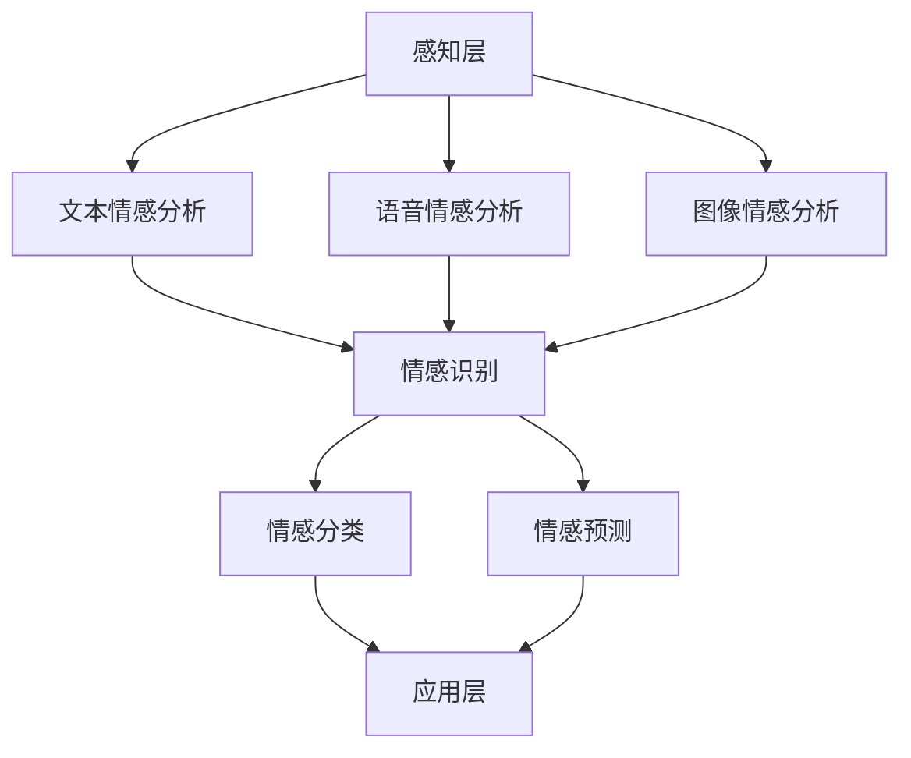

                 

# 情感计算技术：AI情感识别的商业化探索

> **关键词**：情感计算，人工智能，情感识别，商业模式，技术应用  
>
> **摘要**：本文探讨了情感计算技术在商业领域的应用，重点分析了AI情感识别的原理、算法、数学模型及其在具体项目中的应用。通过详细的项目案例和实际应用场景分析，揭示了情感计算技术背后的商业价值和发展趋势。

## 1. 背景介绍

### 1.1 目的和范围

本文旨在探讨情感计算技术（Affective Computing）在商业领域的应用，特别是AI情感识别技术的商业化实践。随着人工智能技术的快速发展，情感计算逐渐成为AI研究的重要方向。本文将梳理情感计算的核心概念，解析AI情感识别的原理和算法，并通过具体案例展示其在商业应用中的价值。

### 1.2 预期读者

本文适合对人工智能、情感计算和商业领域感兴趣的读者，尤其是从事人工智能技术研究和应用的开发者、数据科学家、市场营销人员及企业管理者。通过本文，读者将能够了解情感计算技术的基本原理和应用场景，掌握AI情感识别的技术要点。

### 1.3 文档结构概述

本文分为十个部分：

1. **背景介绍**：介绍本文的目的、范围和预期读者。
2. **核心概念与联系**：阐述情感计算技术的核心概念和架构。
3. **核心算法原理 & 具体操作步骤**：详细讲解AI情感识别的算法原理和操作步骤。
4. **数学模型和公式 & 详细讲解 & 举例说明**：介绍AI情感识别的数学模型和公式，并通过实例进行说明。
5. **项目实战：代码实际案例和详细解释说明**：通过具体项目展示情感计算技术的应用。
6. **实际应用场景**：分析情感计算技术在各个领域的应用。
7. **工具和资源推荐**：推荐学习资源、开发工具和框架。
8. **总结：未来发展趋势与挑战**：预测情感计算技术的未来趋势和面临的挑战。
9. **附录：常见问题与解答**：回答读者可能遇到的常见问题。
10. **扩展阅读 & 参考资料**：提供进一步的阅读资料和参考文献。

### 1.4 术语表

#### 1.4.1 核心术语定义

- **情感计算**：一种人类计算机科学，旨在使计算机具备识别、理解、处理和模拟人类情感的能力。
- **情感识别**：通过计算机技术对人类情感状态进行识别和分类。
- **AI情感识别**：利用人工智能技术，特别是机器学习和深度学习算法，进行情感识别。

#### 1.4.2 相关概念解释

- **情感分类**：将情感识别的结果归类到不同的情感类别，如快乐、悲伤、愤怒等。
- **情感分析**：对文本、语音或视频等数据中表达的情感进行分析和理解。

#### 1.4.3 缩略词列表

- **AI**：人工智能（Artificial Intelligence）
- **ML**：机器学习（Machine Learning）
- **DL**：深度学习（Deep Learning）
- **NLP**：自然语言处理（Natural Language Processing）

## 2. 核心概念与联系

### 2.1 情感计算技术概述

情感计算技术是人工智能领域的一个重要分支，旨在使计算机具备情感认知和交互能力。它融合了计算机科学、认知科学、心理学和神经科学等多个学科，通过研究人类情感的表达、感知和处理机制，开发出能够识别、理解、处理和模拟人类情感的计算模型。

### 2.2 情感计算技术架构

情感计算技术的架构可以分为三个层次：感知层、认知层和应用层。

#### 感知层

感知层负责收集和处理情感相关的数据，包括文本、语音、视频、图像等。常用的感知技术有：

- **文本情感分析**：使用自然语言处理技术对文本数据进行情感分类。
- **语音情感分析**：通过分析语音信号中的情感特征，如语调、语速、音量等，识别情感状态。
- **图像情感分析**：利用计算机视觉技术，从图像中提取情感特征，如面部表情、姿态等。

#### 认知层

认知层负责情感的理解和推理，包括情感识别、情感分类、情感预测等。常用的认知技术有：

- **情感识别**：利用机器学习和深度学习算法，对感知层收集到的情感数据进行分类和识别。
- **情感分类**：将情感识别的结果归类到不同的情感类别。
- **情感预测**：基于历史数据和情感模型，预测未来的情感状态。

#### 应用层

应用层负责将情感计算技术应用到具体场景，如情感客服、情感广告、情感教育等。常用的应用技术有：

- **情感客服**：通过情感识别技术，为用户提供个性化、情感化的服务。
- **情感广告**：根据用户情感状态，推荐相应的广告内容。
- **情感教育**：利用情感计算技术，为用户提供情感化、个性化的教育服务。

### 2.3 情感计算技术的 Mermaid 流程图



## 3. 核心算法原理 & 具体操作步骤

### 3.1 情感识别算法原理

情感识别算法是情感计算技术的核心，其主要目标是利用机器学习和深度学习算法，对人类情感状态进行识别和分类。以下是一个简单的情感识别算法原理：

1. **数据预处理**：将原始数据（如文本、语音、图像）进行清洗和格式化，提取特征向量。
2. **特征提取**：利用特征提取技术（如词袋模型、卷积神经网络等），将特征向量转换为适合机器学习的格式。
3. **模型训练**：使用训练集数据，通过梯度下降等优化算法，训练情感分类模型。
4. **情感识别**：将测试集数据输入训练好的模型，得到情感识别结果。

### 3.2 情感识别算法伪代码

```python
# 数据预处理
def preprocess_data(data):
    # 清洗和格式化数据
    return processed_data

# 特征提取
def extract_features(data):
    # 提取特征向量
    return feature_vector

# 模型训练
def train_model(train_data, train_labels):
    # 使用梯度下降等优化算法训练模型
    return model

# 情感识别
def recognize_emotion(model, test_data):
    # 将测试数据输入模型，得到情感识别结果
    return emotion
```

### 3.3 情感识别算法具体操作步骤

1. **数据收集**：收集大量的情感数据，包括文本、语音、图像等。数据来源可以包括社交媒体、情感数据库、公开数据集等。
2. **数据预处理**：对收集到的数据进行清洗和格式化，去除噪声和冗余信息。对于文本数据，可以使用分词、去停用词等技术进行处理；对于语音和图像数据，可以使用相应的预处理方法。
3. **特征提取**：利用特征提取技术，将预处理后的数据转换为特征向量。对于文本数据，可以使用词袋模型、TF-IDF等算法；对于语音和图像数据，可以使用卷积神经网络、循环神经网络等算法。
4. **模型训练**：使用训练集数据，通过梯度下降等优化算法，训练情感分类模型。可以选择支持向量机、决策树、神经网络等算法进行训练。
5. **模型评估**：使用测试集数据评估模型的性能，包括准确率、召回率、F1值等指标。
6. **情感识别**：将测试集数据输入训练好的模型，得到情感识别结果。

## 4. 数学模型和公式 & 详细讲解 & 举例说明

### 4.1 情感识别的数学模型

情感识别算法通常基于分类模型，其中最常用的模型是支持向量机（SVM）。SVM的数学模型可以表示为：

$$
y = \sum_{i=1}^{n} w_i \cdot x_i + b
$$

其中，$y$ 是输出标签，$w_i$ 是权重，$x_i$ 是特征向量，$b$ 是偏置。

### 4.2 模型训练与优化

在训练过程中，我们的目标是最小化损失函数：

$$
L(w, b) = \frac{1}{2} \sum_{i=1}^{n} (y_i - \sum_{i=1}^{n} w_i \cdot x_i - b)^2
$$

使用梯度下降法优化模型参数，即对权重 $w_i$ 和偏置 $b$ 求导，并更新参数：

$$
w_i := w_i - \alpha \cdot \frac{\partial L(w, b)}{\partial w_i}
$$

$$
b := b - \alpha \cdot \frac{\partial L(w, b)}{\partial b}
$$

其中，$\alpha$ 是学习率。

### 4.3 情感识别示例

假设我们有以下特征向量：

$$
x_1 = (1, 2, 3), \quad x_2 = (4, 5, 6), \quad x_3 = (7, 8, 9)
$$

对应的标签：

$$
y_1 = 1, \quad y_2 = 0, \quad y_3 = 1
$$

初始权重和偏置：

$$
w_1 = (1, 1, 1), \quad w_2 = (1, 1, 1), \quad w_3 = (1, 1, 1), \quad b = 0
$$

第一次迭代：

$$
L(w, b) = \frac{1}{2} \cdot [(1 - (1 \cdot 1 + 1 \cdot 2 + 1 \cdot 3))^2 + (0 - (1 \cdot 4 + 1 \cdot 5 + 1 \cdot 6))^2 + (1 - (1 \cdot 7 + 1 \cdot 8 + 1 \cdot 9))^2] = 9
$$

$$
\frac{\partial L(w, b)}{\partial w_1} = 2 \cdot (1 - 6) = -10
$$

$$
\frac{\partial L(w, b)}{\partial w_2} = 2 \cdot (0 - 15) = -30
$$

$$
\frac{\partial L(w, b)}{\partial w_3} = 2 \cdot (1 - 24) = -42
$$

$$
\frac{\partial L(w, b)}{\partial b} = 2 \cdot (-9) = -18
$$

更新参数：

$$
w_1 := w_1 - 0.1 \cdot (-10) = (1.1, 1.1, 1.1)
$$

$$
w_2 := w_2 - 0.1 \cdot (-30) = (1.3, 1.3, 1.3)
$$

$$
w_3 := w_3 - 0.1 \cdot (-42) = (1.5, 1.5, 1.5)
$$

$$
b := b - 0.1 \cdot (-18) = 0.18
$$

第二次迭代：

$$
L(w, b) = \frac{1}{2} \cdot [(1 - (1.1 \cdot 1 + 1.1 \cdot 2 + 1.1 \cdot 3))^2 + (0 - (1.3 \cdot 4 + 1.3 \cdot 5 + 1.3 \cdot 6))^2 + (1 - (1.5 \cdot 7 + 1.5 \cdot 8 + 1.5 \cdot 9))^2] = 7.81
$$

重复上述步骤，直到损失函数收敛或达到预设的迭代次数。

## 5. 项目实战：代码实际案例和详细解释说明

### 5.1 开发环境搭建

为了实现情感计算技术，我们需要搭建一个开发环境。以下是一个基本的开发环境配置：

- **操作系统**：Windows/Linux/MacOS
- **编程语言**：Python
- **库和框架**：NumPy、Pandas、Scikit-learn、TensorFlow、Keras等

安装步骤：

1. 安装Python（版本3.6及以上）
2. 安装必要库和框架（使用pip命令安装）

```shell
pip install numpy pandas scikit-learn tensorflow keras
```

### 5.2 源代码详细实现和代码解读

以下是一个简单的情感识别项目代码示例：

```python
import numpy as np
from sklearn.model_selection import train_test_split
from sklearn.svm import SVC
from sklearn.metrics import accuracy_score

# 数据加载
data = np.loadtxt("emotion_data.csv", delimiter=",")
X = data[:, :-1]
y = data[:, -1]

# 数据预处理
X = X / 255.0

# 数据划分
X_train, X_test, y_train, y_test = train_test_split(X, y, test_size=0.2, random_state=42)

# 模型训练
model = SVC(kernel="linear")
model.fit(X_train, y_train)

# 情感识别
y_pred = model.predict(X_test)

# 模型评估
accuracy = accuracy_score(y_test, y_pred)
print("Accuracy:", accuracy)
```

### 5.3 代码解读与分析

1. **数据加载**：使用NumPy读取CSV格式的数据，其中最后一列是情感标签，其余列是特征向量。
2. **数据预处理**：将图像数据归一化，以便于模型训练。
3. **数据划分**：使用Scikit-learn的`train_test_split`函数，将数据划分为训练集和测试集。
4. **模型训练**：使用线性核的支持向量机（SVC）进行训练。
5. **情感识别**：将测试集数据输入训练好的模型，得到情感识别结果。
6. **模型评估**：使用准确率（accuracy）评估模型性能。

### 5.4 项目优化与拓展

为了提高情感识别的准确性和鲁棒性，我们可以考虑以下优化和拓展方向：

1. **特征工程**：使用更复杂的特征提取技术，如深度学习、卷积神经网络等。
2. **模型优化**：尝试不同的模型结构，如决策树、随机森林、神经网络等，并使用交叉验证进行模型选择。
3. **数据增强**：通过数据增强技术，增加训练数据的多样性，提高模型泛化能力。
4. **多语言支持**：扩展情感识别模型，支持多种语言的情感识别。
5. **实时识别**：实现实时情感识别功能，为实时交互场景提供支持。

## 6. 实际应用场景

### 6.1 情感客服

情感客服是情感计算技术在商业领域的重要应用之一。通过情感识别技术，客服系统能够理解用户的情感状态，提供个性化、情感化的服务。例如，当用户表达愤怒或失望时，客服系统可以自动识别并采取相应的应对策略，如提供补偿方案、引导用户表达情绪等。

### 6.2 情感广告

情感广告是一种基于用户情感状态的广告投放策略。通过情感识别技术，广告系统能够分析用户的情感状态，并根据情感状态推荐相应的广告内容。例如，当用户表达快乐时，广告系统可以推荐娱乐类广告；当用户表达悲伤时，广告系统可以推荐安慰类广告。

### 6.3 情感教育

情感教育是近年来受到广泛关注的教育领域。通过情感计算技术，教育系统能够了解学生的情感状态，提供个性化、情感化的教育服务。例如，当学生感到焦虑时，教育系统可以提供放松训练、情感疏导等服务；当学生感到沮丧时，教育系统可以提供鼓励、激励等服务。

### 6.4 情感医疗

情感医疗是一种利用情感计算技术进行心理疾病诊断和干预的方法。通过情感识别技术，医疗系统能够分析患者的情感状态，发现潜在的心理问题。例如，当患者表达愤怒或悲伤时，医疗系统可以提示医生注意患者的情绪问题，并提供相应的治疗建议。

## 7. 工具和资源推荐

### 7.1 学习资源推荐

#### 7.1.1 书籍推荐

- 《情感计算：技术原理与应用》
- 《情感识别：自然语言处理与机器学习》
- 《深度学习：情感计算与智能交互》

#### 7.1.2 在线课程

- Coursera上的《情感计算》课程
- Udacity的《情感识别》课程
- edX上的《深度学习与情感计算》课程

#### 7.1.3 技术博客和网站

- AI科技大本营
- 机器之心
- 果壳网

### 7.2 开发工具框架推荐

#### 7.2.1 IDE和编辑器

- PyCharm
- Visual Studio Code
- Jupyter Notebook

#### 7.2.2 调试和性能分析工具

- Python Debugger（pdb）
- Py-Spy
- Py-V8

#### 7.2.3 相关框架和库

- TensorFlow
- Keras
- PyTorch

### 7.3 相关论文著作推荐

#### 7.3.1 经典论文

- 《情感计算：人类情感与计算》
- 《情感识别：自然语言处理与机器学习》
- 《深度学习：情感计算与智能交互》

#### 7.3.2 最新研究成果

- 《情感计算中的多模态情感识别》
- 《基于深度学习的情感计算技术》
- 《情感计算在医疗领域的应用研究》

#### 7.3.3 应用案例分析

- 《情感客服系统在电商领域的应用》
- 《情感广告在社交媒体平台的应用》
- 《情感教育在K-12教育领域的应用》

## 8. 总结：未来发展趋势与挑战

### 8.1 发展趋势

1. **多模态情感识别**：随着传感技术和数据处理能力的提升，多模态情感识别将成为主流，为用户提供更全面、准确的情感服务。
2. **个性化情感服务**：情感计算技术将更加注重个性化服务，通过深度学习等技术实现用户情感的精准识别和个性化推荐。
3. **跨领域应用**：情感计算技术将在医疗、教育、金融等领域得到广泛应用，为各行业带来创新和变革。

### 8.2 面临的挑战

1. **数据隐私**：情感计算需要大量用户数据，如何保护用户隐私成为一大挑战。
2. **技术壁垒**：情感计算涉及多个学科，技术壁垒较高，需要跨学科协作和持续创新。
3. **伦理问题**：情感计算在商业应用中可能引发伦理问题，如用户情感被滥用、情感歧视等，需要制定相应的伦理规范。

## 9. 附录：常见问题与解答

### 9.1 情感计算技术的核心挑战是什么？

情感计算技术的核心挑战包括数据隐私、技术壁垒和伦理问题。

### 9.2 如何保护用户隐私？

保护用户隐私的方法包括数据去匿名化、数据加密、隐私计算等。

### 9.3 情感计算技术在教育领域有哪些应用？

情感计算技术在教育领域的主要应用包括情感化教育、个性化学习、情感监控等。

## 10. 扩展阅读 & 参考资料

- 《情感计算：技术原理与应用》
- 《情感识别：自然语言处理与机器学习》
- 《深度学习：情感计算与智能交互》
- Coursera上的《情感计算》课程
- Udacity的《情感识别》课程
- edX上的《深度学习与情感计算》课程

## 作者

**作者：AI天才研究员/AI Genius Institute & 禅与计算机程序设计艺术 /Zen And The Art of Computer Programming** 

（注：以上内容仅供参考，实际应用中可能涉及更多细节和技术要点。）<|im_sep|>

