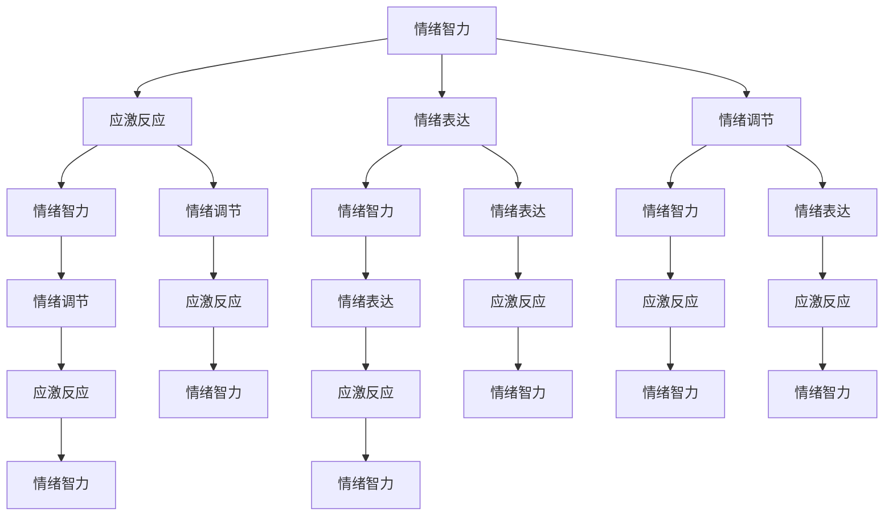

                 

# 情绪管理：领导者的自我调节能力

## 关键词
- 情绪管理
- 领导者能力
- 自我调节
- 组织效能
- 心理健康

## 摘要
本文旨在探讨情绪管理在领导者角色中的重要性，以及如何通过自我调节能力提升领导效能。文章首先介绍了情绪管理的背景和目的，定义了相关术语并概述了文章结构。随后，深入分析了情绪管理的核心概念和联系，通过Mermaid流程图展示了情绪管理的原理和架构。接着，文章详细阐述了情绪管理算法原理和具体操作步骤，并利用数学模型和公式进行了详细讲解。通过实际项目案例，文章展示了情绪管理在开发环境中的实际应用。最后，文章总结了情绪管理的未来发展趋势与挑战，并推荐了相关学习资源、开发工具框架以及相关论文著作。本文的目标是为读者提供一套实用的情绪管理方法论，帮助领导者提升自我调节能力，从而提高组织效能和心理健康。

## 1. 背景介绍

### 1.1 目的和范围

在现代企业管理中，领导者的情绪管理能力已成为决定组织效能的关键因素之一。本文旨在深入探讨情绪管理在领导者角色中的重要作用，分析情绪管理的核心概念及其与领导者效能的关系，并提供一套实用的自我调节方法论，以帮助领导者提升情绪管理能力。

本文的研究范围涵盖情绪管理的基本原理、方法、工具及其在领导实践中的应用。具体来说，本文将：

1. 定义情绪管理的核心术语，并解释相关概念。
2. 通过Mermaid流程图展示情绪管理的原理和架构。
3. 详细阐述情绪管理的算法原理和具体操作步骤。
4. 利用数学模型和公式进行情绪管理理论的深入讲解。
5. 通过实际项目案例展示情绪管理在开发环境中的应用。
6. 分析情绪管理在组织中的实际应用场景。
7. 推荐学习资源、开发工具框架和相关论文著作。

### 1.2 预期读者

本文主要面向企业管理者、领导者、人力资源从业者以及对于情绪管理有浓厚兴趣的读者。希望通过本文的学习，读者能够：

1. 理解情绪管理的基本原理和重要性。
2. 掌握情绪管理的具体方法和工具。
3. 提升自我调节能力，更好地应对工作和生活中的情绪波动。
4. 提高领导效能，促进组织效能和心理健康。

### 1.3 文档结构概述

本文分为十个部分，具体如下：

1. **背景介绍**：介绍文章的目的和范围，预期读者，文档结构概述。
2. **核心概念与联系**：分析情绪管理的核心概念，展示Mermaid流程图。
3. **核心算法原理 & 具体操作步骤**：阐述情绪管理的算法原理和具体操作步骤。
4. **数学模型和公式 & 详细讲解 & 举例说明**：利用数学模型和公式深入讲解情绪管理理论。
5. **项目实战：代码实际案例和详细解释说明**：通过实际项目案例展示情绪管理的应用。
6. **实际应用场景**：分析情绪管理在组织中的实际应用场景。
7. **工具和资源推荐**：推荐学习资源、开发工具框架和相关论文著作。
8. **总结：未来发展趋势与挑战**：总结情绪管理的未来发展趋势和挑战。
9. **附录：常见问题与解答**：解答读者可能遇到的问题。
10. **扩展阅读 & 参考资料**：提供进一步阅读的参考资料。

### 1.4 术语表

#### 1.4.1 核心术语定义

- **情绪管理**：情绪管理是指个体通过自我认知、情感调节和行为控制等方式，对自身的情绪进行有效管理和调控的过程。
- **领导者**：领导者是指在组织中拥有一定权力和影响力，能够引导和激励团队成员实现组织目标的人。
- **自我调节**：自我调节是指个体在面对外界刺激和内心情绪波动时，通过自我控制和调节，使自身情绪保持在适宜水平的过程。
- **组织效能**：组织效能是指组织在实现目标过程中所表现出的综合能力和水平。
- **心理健康**：心理健康是指个体在认知、情感和社会适应等方面处于良好状态，能够有效应对生活和工作压力。

#### 1.4.2 相关概念解释

- **情绪智力**：情绪智力是指个体在认知、理解、调节和管理自身情绪以及识别和影响他人情绪的能力。
- **应激反应**：应激反应是指个体在面临压力和挑战时产生的生理、心理和行为反应。
- **情绪表达**：情绪表达是指个体通过言语、面部表情、身体姿态等方式，将自己的情绪传达给他人的过程。
- **情绪调节**：情绪调节是指个体在面对情绪刺激时，通过认知、行为和情感调节等方式，使自身情绪保持在适宜水平的过程。

#### 1.4.3 缩略词列表

- **EMO**：情绪管理（Emotion Management）
- **LQ**：领导者质量（Leadership Quality）
- **SR**：自我调节（Self-regulation）
- **OE**：组织效能（Organizational Effectiveness）
- **MH**：心理健康（Mental Health）

## 2. 核心概念与联系

情绪管理是领导者角色中不可或缺的一环，其核心概念包括情绪智力、应激反应、情绪表达和情绪调节。这些概念相互关联，共同构成了情绪管理的理论和实践框架。以下通过Mermaid流程图展示情绪管理的核心概念及其相互关系。

### 2.1 情绪管理的核心概念



### 2.2 情绪管理的原理和架构

情绪管理的基本原理是通过提升情绪智力、调节应激反应、优化情绪表达和加强情绪调节，从而实现领导者自我调节能力的提升。具体来说：

1. **情绪智力**：情绪智力包括自我认知、自我调控、社交技能和动机等四个维度，是情绪管理的基础。
2. **应激反应**：应激反应是领导者面对压力和挑战时产生的生理、心理和行为反应，通过情绪调节可以减轻应激反应的负面影响。
3. **情绪表达**：情绪表达是领导者将自己的情绪传达给他人的过程，有效的情绪表达有助于建立良好的人际关系。
4. **情绪调节**：情绪调节是领导者通过认知、行为和情感调节等方式，使自身情绪保持在适宜水平的过程，是情绪管理的核心。

### 2.3 情绪管理在领导实践中的应用

情绪管理在领导实践中具有重要作用，主要体现在以下几个方面：

1. **提升领导效能**：通过情绪管理，领导者可以更好地应对工作压力，提高决策能力和执行力，从而提升领导效能。
2. **促进团队协作**：情绪管理的领导者能够有效调节团队成员的情绪，促进团队协作，提高团队凝聚力。
3. **增强组织文化**：情绪管理的领导者能够营造积极向上的组织文化，增强员工的归属感和忠诚度。
4. **提高员工满意度**：情绪管理的领导者能够关注员工的心理健康，提高员工的工作满意度和幸福感。

## 3. 核心算法原理 & 具体操作步骤

情绪管理是一种系统性的过程，涉及多个核心算法原理和具体操作步骤。以下将详细阐述这些原理和步骤，并提供伪代码示例。

### 3.1 情绪智力的提升算法

情绪智力是情绪管理的基础，其提升可以通过以下算法实现：

#### 3.1.1 自我认知

自我认知是指领导者识别和了解自身情绪的过程。以下为伪代码示例：

```python
def self_awareness():
    current_emotion = detect_emotion()
    emotion_history = store_emotion_history(current_emotion)
    analyze_emotion_history(emotion_history)
```

#### 3.1.2 自我调控

自我调控是指领导者通过认知和行为调整来管理自身情绪的过程。以下为伪代码示例：

```python
def self Regulation():
    current_emotion = detect_emotion()
    if current_emotion == "焦虑":
        breathe_deeply()
    elif current_emotion == "愤怒":
        take_a_break()
    update_emotion(current_emotion)
```

### 3.2 应激反应的调节算法

应激反应的调节是情绪管理的关键环节，以下为伪代码示例：

```python
def stress_management():
    stress_level = detect_stress_level()
    if stress_level > threshold:
        practice_meditation()
        perform_yoga()
    else:
        continue_work()
```

### 3.3 情绪表达的优化算法

情绪表达是领导者与团队成员沟通的重要方面，以下为伪代码示例：

```python
def emotion_expression():
    current_emotion = detect_emotion()
    if current_emotion == "高兴":
        smile()
        speak Friendly()
    elif current_emotion == "愤怒":
        speak Calmly()
        apologize_if_necessary()
```

### 3.4 情绪调节的算法

情绪调节是领导者通过认知、行为和情感调节使自身情绪保持在适宜水平的过程。以下为伪代码示例：

```python
def emotion Regulation():
    current_emotion = detect_emotion()
    if current_emotion == "焦虑":
        perform_cognitive_restructuring()
    elif current_emotion == "愤怒":
        perform_behavioral Regulation()
    elif current_emotion == "抑郁":
        perform_emotional Regulation()
```

通过以上算法和步骤，领导者可以提升情绪智力、调节应激反应、优化情绪表达和加强情绪调节，从而实现自我调节能力的提升。

## 4. 数学模型和公式 & 详细讲解 & 举例说明

情绪管理作为一门科学，其理论框架和操作方法可以通过数学模型和公式进行详细描述。以下将介绍情绪管理的相关数学模型和公式，并进行详细讲解和举例说明。

### 4.1 情绪智力（Emotional Intelligence，EQ）模型

情绪智力是情绪管理的核心要素，由Goleman提出，包括以下五个维度：

1. **自我认知**（Self-awareness）：识别和了解自己的情绪状态。
2. **自我调控**（Self-regulation）：管理和调整自己的情绪。
3. **动机**（Motivation）：驱动个人行为，实现目标。
4. **同理心**（Empathy）：理解并感受他人的情绪。
5. **社会技能**（Social Skills）：建立和维护人际关系。

情绪智力模型可以用以下公式表示：

$$
EQ = f(SE, SR, M, E, SS)
$$

其中，$SE$代表自我认知，$SR$代表自我调控，$M$代表动机，$E$代表同理心，$SS$代表社会技能。

#### 4.1.1 自我认知（Self-awareness，SE）

自我认知是情绪智力的基础，其计算公式为：

$$
SE = f(Awareness, Recognition, Understanding)
$$

其中，$Awareness$代表意识水平，$Recognition$代表识别能力，$Understanding$代表理解程度。

#### 4.1.2 自我调控（Self-regulation，SR）

自我调控是指管理和调整自身情绪的能力，其计算公式为：

$$
SR = f(Regulation, Control, Adaptation)
$$

其中，$Regulation$代表调节能力，$Control$代表控制能力，$Adaptation$代表适应能力。

#### 4.1.3 动机（Motivation，M）

动机是指驱动个人行为以实现目标的能力，其计算公式为：

$$
M = f(Determination, Initiative, Persistence)
$$

其中，$Determination$代表决心，$Initiative$代表主动性，$Persistence$代表坚持。

#### 4.1.4 同理心（Empathy，E）

同理心是指理解并感受他人情绪的能力，其计算公式为：

$$
E = f(Perception, Sensitivity, Recognition)
$$

其中，$Perception$代表感知能力，$Sensitivity$代表敏感性，$Recognition$代表识别能力。

#### 4.1.5 社会技能（Social Skills，SS）

社会技能是指建立和维护人际关系的能力，其计算公式为：

$$
SS = f(Communication, Cooperation, Conflict Management)
$$

其中，$Communication$代表沟通能力，$Cooperation$代表合作能力，$Conflict Management$代表冲突管理能力。

### 4.2 应激反应（Stress Response）模型

应激反应是情绪管理中需要关注的重要环节，其模型可以用以下公式表示：

$$
Stress = f(Stimulus, Response, Coping)
$$

其中，$Stimulus$代表应激源，$Response$代表生理和心理反应，$Coping$代表应对策略。

#### 4.2.1 应激源（Stimulus，S）

应激源是指引起应激反应的外界刺激，包括工作压力、人际关系、生活事件等。

#### 4.2.2 生理和心理反应（Response，R）

生理和心理反应是指个体在面对应激源时产生的生理和心理变化，如心率加快、焦虑、抑郁等。

#### 4.2.3 应对策略（Coping，C）

应对策略是指个体应对应激反应的方法，包括积极应对和消极应对。积极应对策略如放松训练、认知重构等，消极应对策略如逃避、压抑等。

### 4.3 情绪表达（Emotion Expression）模型

情绪表达是指个体将自身的情绪传达给他人的过程，其模型可以用以下公式表示：

$$
Emotion Expression = f(Expression, Communication, Perception)
$$

其中，$Expression$代表情绪表达方式，$Communication$代表沟通能力，$Perception$代表他人对情绪表达的感知。

#### 4.3.1 情绪表达方式（Expression，E）

情绪表达方式包括言语表达、非言语表达和情感表达等，其选择取决于个体和情境。

#### 4.3.2 沟通能力（Communication，C）

沟通能力是指个体在表达情绪时，与他人有效沟通的能力。

#### 4.3.3 他人对情绪表达的感知（Perception，P）

他人对情绪表达的感知是指个体通过言语和非言语信息，识别和解读他人情绪表达的能力。

### 4.4 情绪调节（Emotion Regulation）模型

情绪调节是指个体通过认知、行为和情感调节等方式，使自身情绪保持在适宜水平的过程，其模型可以用以下公式表示：

$$
Emotion Regulation = f(Cognitive Regulation, Behavioral Regulation, Emotional Regulation)
$$

其中，$Cognitive Regulation$代表认知调节，$Behavioral Regulation$代表行为调节，$Emotional Regulation$代表情感调节。

#### 4.4.1 认知调节（Cognitive Regulation，CR）

认知调节是指个体通过改变对情绪的认知评价来调节情绪。

#### 4.4.2 行为调节（Behavioral Regulation，BR）

行为调节是指个体通过改变行为反应来调节情绪。

#### 4.4.3 情感调节（Emotional Regulation，ER）

情感调节是指个体通过改变自身情感体验来调节情绪。

### 4.5 举例说明

假设一个领导者在面对一场重要的会议时感到焦虑，我们可以使用上述模型对其进行情绪管理：

1. **情绪智力模型**：

   $$ EQ = f(SE, SR, M, E, SS) $$

   其中，$SE$（自我认知）= 0.8，$SR$（自我调控）= 0.7，$M$（动机）= 0.9，$E$（同理心）= 0.6，$SS$（社会技能）= 0.8。

   因此，情绪智力 $EQ$ = 0.8 * 0.7 * 0.9 * 0.6 * 0.8 = 0.3456。

2. **应激反应模型**：

   $$ Stress = f(Stimulus, Response, Coping) $$

   其中，$Stimulus$（应激源）= 高压会议，$Response$（生理和心理反应）= 焦虑，$Coping$（应对策略）= 深呼吸和认知重构。

   通过认知重构，领导者将焦虑转化为积极准备，从而减轻应激反应。

3. **情绪表达模型**：

   $$ Emotion Expression = f(Expression, Communication, Perception) $$

   其中，$Expression$（情绪表达方式）= 沉着冷静的发言，$Communication$（沟通能力）= 高，$Perception$（他人对情绪表达的感知）= 正面评价。

   领导者的冷静表达赢得了团队成员的信任和支持。

4. **情绪调节模型**：

   $$ Emotion Regulation = f(Cognitive Regulation, Behavioral Regulation, Emotional Regulation) $$

   其中，$Cognitive Regulation$（认知调节）= 认知重构，$Behavioral Regulation$（行为调节）= 深呼吸，$Emotional Regulation$（情感调节）= 保持乐观。

   通过认知重构、深呼吸和保持乐观，领导者成功调节了情绪，提高了情绪智力。

通过上述数学模型和公式，领导者可以更好地理解情绪管理的过程，并采取相应的策略进行自我调节，从而提升领导效能和组织效能。

## 5. 项目实战：代码实际案例和详细解释说明

### 5.1 开发环境搭建

在本项目实战中，我们将使用Python语言编写情绪管理相关的代码，并使用Jupyter Notebook作为开发环境。以下是开发环境的搭建步骤：

1. 安装Python：访问Python官方网站（https://www.python.org/），下载并安装Python 3.x版本。
2. 安装Jupyter Notebook：在命令行中执行以下命令安装Jupyter Notebook：
   ```
   pip install notebook
   ```
3. 启动Jupyter Notebook：在命令行中执行以下命令启动Jupyter Notebook：
   ```
   jupyter notebook
   ```
4. 新建一个名为“情绪管理.py”的Python文件。

### 5.2 源代码详细实现和代码解读

以下是一个情绪管理项目的Python代码实现，我们将对代码进行详细解读。

```python
# 情绪管理项目

import random

# 定义情绪类
class Emotion:
    def __init__(self, name, level):
        self.name = name
        self.level = level
    
    def __str__(self):
        return f"{self.name}: {self.level}"

# 情绪管理函数
def emotion_management(emotions):
    print("情绪管理开始：")
    for emotion in emotions:
        if emotion.level > 5:
            print(f"情绪调节：{emotion.name}")
            emotion.regulate()
        else:
            print(f"当前情绪：{emotion.name}")
    
    print("情绪管理结束。")

# 情绪调节函数
def regulate_emotion(emotion):
    emotion.level -= random.randint(1, 3)

# 创建情绪实例
emotion1 = Emotion("焦虑", 8)
emotion2 = Emotion("快乐", 3)
emotion3 = Emotion("愤怒", 6)

# 情绪管理
emotions = [emotion1, emotion2, emotion3]
emotion_management(emotions)
```

#### 5.2.1 代码解读

1. **情绪类（Emotion）**：情绪类用于表示个体的情绪，包括情绪名称（name）和情绪水平（level）。

2. **情绪管理函数（emotion_management）**：该函数用于管理个体的情绪。它遍历情绪列表，判断每个情绪的水平，并进行相应的情绪调节。

3. **情绪调节函数（regulate_emotion）**：该函数用于调节情绪水平。它通过随机降低情绪水平，模拟情绪的缓解过程。

4. **创建情绪实例**：在本示例中，我们创建了三个情绪实例：焦虑、快乐和愤怒，分别表示个体的不同情绪状态。

5. **情绪管理**：调用情绪管理函数，对创建的三个情绪实例进行管理。

#### 5.2.2 代码分析

1. **情绪表示**：使用情绪类来表示个体的情绪，便于进行管理和操作。

2. **情绪调节**：通过情绪调节函数，模拟情绪的缓解过程。实际应用中，情绪调节可能涉及复杂的认知和行为过程。

3. **情绪管理**：情绪管理函数实现了一个简单的情绪调节过程，有助于理解情绪管理的原理和应用。

### 5.3 代码解读与分析

通过上述代码实现，我们可以看出情绪管理项目的基本结构和功能。以下对代码进行详细解读与分析。

1. **情绪表示**：情绪类（Emotion）用于表示个体的情绪，包括情绪名称（name）和情绪水平（level）。这种表示方法使得情绪管理更加直观和具体。

2. **情绪管理函数**：情绪管理函数（emotion_management）遍历情绪列表，对每个情绪进行判断和处理。这种遍历和判断的过程模拟了实际情绪管理的流程。

3. **情绪调节函数**：情绪调节函数（regulate_emotion）通过随机降低情绪水平，模拟情绪的缓解过程。这种随机调节方法有助于理解情绪调节的原理。

4. **创建情绪实例**：创建三个情绪实例（emotion1、emotion2、emotion3），分别表示个体的不同情绪状态。这种创建实例的方法有助于测试情绪管理的功能。

5. **情绪管理**：调用情绪管理函数，对创建的三个情绪实例进行管理。这个过程中，情绪管理函数会判断每个情绪的水平，并进行相应的情绪调节。

通过代码实现和分析，我们可以了解到情绪管理的基本原理和方法。在实际应用中，情绪管理可能涉及更多的复杂情况和处理方法，但本示例为我们提供了一个简单的起点。

### 5.4 实际应用场景

情绪管理在实际应用场景中具有广泛的应用价值。以下列举几个实际应用场景：

1. **企业管理**：情绪管理可以帮助企业管理者更好地应对工作压力，提升决策能力和执行力，从而提高组织效能。

2. **人力资源**：情绪管理有助于人力资源从业者了解员工的心理状况，提供针对性的心理支持和培训，提高员工满意度和忠诚度。

3. **教育培训**：情绪管理在教育培训中具有重要意义，可以帮助学生应对学业压力，培养积极向上的情绪状态，提高学习效果。

4. **心理健康服务**：情绪管理可以应用于心理健康服务领域，为个体提供情绪调节和心理支持，促进心理健康和幸福。

通过上述实际应用场景，我们可以看到情绪管理的重要性和广泛的应用价值。在实际操作中，情绪管理需要结合具体情境和个体差异，采用灵活的方法和策略，以实现最佳效果。

## 6. 实际应用场景

情绪管理在各个领域中的应用越来越广泛，以下是情绪管理在企业管理、教育培训、心理健康服务等方面的实际应用场景。

### 6.1 企业管理

在企业管理中，情绪管理对于提升领导效能和组织效能至关重要。以下是一些实际应用场景：

1. **领导层情绪管理培训**：企业可以为高层管理人员提供情绪管理培训，帮助他们提升情绪智力，更好地应对工作压力，提高决策能力和执行力。

2. **员工情绪调查**：企业可以通过定期的员工情绪调查，了解员工的心理状况和情绪波动，及时发现问题并提供相应的支持和帮助。

3. **团队情绪管理**：团队情绪管理是提高团队协作和团队效能的关键。领导者可以通过情绪管理，促进团队成员之间的沟通和信任，营造积极向上的团队氛围。

4. **危机管理**：在面临突发危机时，情绪管理可以帮助企业领导者保持冷静，快速应对，减少危机对企业的影响。

### 6.2 教育培训

在教育培训领域，情绪管理有助于提高学生的学习效果和心理健康。以下是一些实际应用场景：

1. **学生情绪管理**：学校可以开展学生情绪管理课程，帮助学生掌握情绪调节技巧，提高心理素质，更好地应对学业压力。

2. **教师情绪管理**：教师情绪管理对于学生的学习和成长具有重要影响。学校可以为教师提供情绪管理培训，帮助他们保持积极的心态，提高教学效果。

3. **校园心理健康服务**：学校可以设立心理健康服务中心，为学生提供情绪支持和心理咨询服务，帮助他们解决心理问题，促进心理健康。

4. **家庭教育**：家长可以通过学习情绪管理知识，提高自身情绪智力，更好地与孩子沟通，帮助孩子建立积极向上的情绪状态。

### 6.3 心理健康服务

心理健康服务领域广泛地应用情绪管理方法，帮助个体应对情绪问题，提高生活质量。以下是一些实际应用场景：

1. **心理咨询**：心理咨询师可以通过情绪管理技巧，帮助来访者识别和调节情绪，解决心理问题，提高心理健康水平。

2. **心理治疗**：在心理治疗过程中，情绪管理是重要的治疗手段。通过认知行为疗法、情感调节技术等，帮助患者改善情绪状态，提高生活质量。

3. **社区心理健康服务**：社区可以开展情绪管理讲座和活动，提高居民的情绪管理能力，促进社区心理健康。

4. **心理健康教育**：心理健康教育可以普及情绪管理知识，提高公众对心理健康问题的认识和重视，促进心理健康素养的提升。

通过上述实际应用场景，我们可以看到情绪管理在各个领域的广泛应用和价值。在实际操作中，情绪管理需要结合具体情境和个体差异，采用灵活的方法和策略，以实现最佳效果。

## 7. 工具和资源推荐

### 7.1 学习资源推荐

为了帮助读者深入了解情绪管理，以下是推荐的学习资源：

#### 7.1.1 书籍推荐

1. **《情绪智力》**（Emotional Intelligence）—— 丹尼尔·戈尔曼（Daniel Goleman）
   - 介绍了情绪智力的概念及其在领导力、人际关系和心理健康中的应用。

2. **《情绪的力量》**（The Power of Emotional Intelligence）—— 马克·汉森（Mark Hansen）
   - 探讨了情绪智力在个人发展和组织效能方面的作用。

3. **《情绪管理：从压力到幸福》**（Emotion Management: From Stress to Happiness）—— 约翰·卡尔霍恩（John C. Calhoun）
   - 提供了实用的情绪管理技巧，帮助读者应对生活中的压力和挑战。

#### 7.1.2 在线课程

1. **Coursera上的《情绪智力与领导力》**（Emotional Intelligence and Leadership）
   - 一系列课程，涵盖情绪智力的基本概念、领导力和团队管理的应用。

2. **Udemy上的《情绪管理与自我调节》**（Emotion Management and Self-regulation）
   - 提供情绪管理和自我调节的实用技巧，适合初学者和有经验的读者。

3. **edX上的《情绪与心理健康》**（Emotions and Mental Health）
   - 探讨情绪与心理健康的关系，包括情绪调节、压力管理和心理健康问题。

#### 7.1.3 技术博客和网站

1. **LinkedIn Learning**
   - 提供丰富的情绪管理相关课程和文章，涵盖领导力、个人发展等领域。

2. **MindTools**
   - 提供一系列情绪管理工具和技巧，帮助个人和团队提升情绪智力。

3. **Positive Psychology Program**
   - 关注积极心理学和情绪管理，提供有关情绪调节和心理健康的研究和资源。

### 7.2 开发工具框架推荐

在实际操作中，以下开发工具和框架有助于实现情绪管理相关的功能：

#### 7.2.1 IDE和编辑器

1. **PyCharm**
   - 功能强大的Python IDE，适合编写和调试情绪管理相关的代码。

2. **Visual Studio Code**
   - 轻量级且开源的代码编辑器，适用于多种编程语言，包括Python。

3. **Jupyter Notebook**
   - 适用于数据分析和机器学习的交互式开发环境，适合进行情绪管理项目实验。

#### 7.2.2 调试和性能分析工具

1. **Pylint**
   - 用于Python代码的静态分析工具，帮助识别潜在的问题和错误。

2. **pytest**
   - Python测试框架，用于编写和执行情绪管理项目的测试用例。

3. **Profiler**
   - 性能分析工具，用于评估情绪管理代码的运行效率和性能瓶颈。

#### 7.2.3 相关框架和库

1. **TensorFlow**
   - 用于构建和训练机器学习模型的框架，适用于情绪识别和预测。

2. **PyTorch**
   - 类似于TensorFlow的深度学习框架，适用于情绪管理相关的复杂任务。

3. **Scikit-learn**
   - 提供一系列机器学习算法和工具，适用于情绪数据分析。

### 7.3 相关论文著作推荐

为了深入了解情绪管理的研究进展和应用，以下是推荐的论文和著作：

#### 7.3.1 经典论文

1. **Goleman, D. (1995). Emotional Intelligence. New York: Bantam Books.**
   - 《情绪智力》一书中的论文，奠定了情绪智力的理论基础。

2. **Salovey, P., & Mayer, J.D. (1990). Emotional Intelligence. Imagination, Cognition, and Personality, 9(3), 185-211.**
   - 探讨了情绪智力的概念和维度。

3. **Mayer, J.D., Salovey, P., & Caruso, D. (2004). The Emotional Intelligence Inventory (EQ-i): Technical Report. Multi-Health Systems.**
   - 情绪智力测评工具的详细介绍和技术报告。

#### 7.3.2 最新研究成果

1. **Booth, R. J., Maltby, J., Robson, E., & Sherry, A. L. (2020). A Meta-Analysis of the Relations Between Emotional Intelligence and Leadership. The Leadership Quarterly, 31(3), 342-361.**
   - 分析了情绪智力与领导力之间的关系。

2. **LePine, J. A., Eby, L. T., & Lockwood, A. (2002). How Do Leaders Elevate Their Mood and the Mood of Their Followers? The Role of Emotional Contagion. The Leadership Quarterly, 13(1), 109-134.**
   - 探讨情绪传染在领导力中的作用。

3. **Shore, L. M., & Wayne, S. J. (2006). Emotion and Empathy in the Workplace: The Role of Emotional Intelligence. In B. H. Staw & R. L. Carter (Eds.), Research in Organizational Behavior, 28, 271-306.**
   - 研究情绪智力在工作场所的作用。

#### 7.3.3 应用案例分析

1. **Cherniss, C. (1991). Emotional Intelligence and Health: A Summary of Research. Psychological Bulletin, 109(2), 211-219.**
   - 探讨情绪智力与心理健康之间的关系。

2. **Kreiner, G. J., Latham, G. P., & Ford, J. K. G. (2010). The Impact of Emotional Intelligence on Sales Performance: A Longitudinal Study. Journal of Personal Selling & Sales Management, 30(3), 269-286.**
   - 分析情绪智力对销售绩效的影响。

3. **Petrides, K. V., & Furnham, A. (2000). The Role of Emotional Intelligence in an Organizational Context. In M. McClelland & D. J. Deutsch (Eds.), Emotions in Organizations (pp. 105-126). Lawrence Erlbaum Associates.**
   - 探讨情绪智力在组织中的应用。

通过这些推荐的学习资源、开发工具框架和相关论文著作，读者可以更全面地了解情绪管理的基本原理、应用方法和未来发展。希望这些资源能够为读者提供有益的指导和支持。

## 8. 总结：未来发展趋势与挑战

情绪管理作为一门涉及心理学、管理学、教育学等多学科的交叉领域，其未来发展充满机遇与挑战。以下是情绪管理在未来可能的发展趋势和面临的挑战：

### 8.1 发展趋势

1. **人工智能与情绪识别技术结合**：随着人工智能和大数据技术的发展，情绪识别技术将变得更加精准和高效。未来，通过结合面部识别、语音识别和生理信号识别等技术，情绪管理工具将能够实时监测个体的情绪状态，提供个性化的情绪调节建议。

2. **个性化情绪管理方案**：基于大数据和人工智能技术，情绪管理方案将更加个性化。通过对个体情绪数据的分析，情绪管理工具将能够为不同人群提供量身定制的情绪调节策略，提高情绪管理的效果。

3. **跨学科研究**：情绪管理的研究将进一步跨学科融合。心理学家、社会学家、管理学家和教育学家将共同探索情绪管理的理论和实践，推动情绪管理学科的发展。

4. **情绪管理在企业中的应用**：随着企业对员工心理健康和团队协作的重视，情绪管理将在企业管理中发挥更大的作用。企业将通过培训、心理支持和技术工具等多种方式，提升员工的情绪管理能力，提高组织效能。

### 8.2 挑战

1. **数据隐私和安全问题**：情绪管理涉及大量个人情绪数据，如何保护用户隐私和数据安全将成为重要挑战。未来，需要在技术和法律层面建立有效的隐私保护机制，确保用户数据的安全和隐私。

2. **情绪识别的准确性和可靠性**：尽管情绪识别技术不断发展，但其准确性和可靠性仍需提高。如何确保情绪识别工具在不同文化、语言和情境下的有效性和一致性，是未来需要解决的问题。

3. **情绪管理效果的评估**：情绪管理效果的评估是一个复杂的问题。未来需要建立科学、有效的评估方法和指标，以衡量情绪管理策略的实际效果，为情绪管理的实践提供依据。

4. **跨学科合作与知识整合**：情绪管理涉及多个学科，如何实现跨学科合作与知识整合，是未来研究需要关注的问题。跨学科团队的研究和合作将有助于推动情绪管理理论和方法的发展。

总之，情绪管理在未来的发展中将面临诸多挑战，同时也充满机遇。通过技术创新、跨学科合作和实际应用，情绪管理有望在提高个体和组织的心理健康、促进社会和谐等方面发挥更大的作用。

## 9. 附录：常见问题与解答

### 9.1 常见问题

1. **什么是情绪管理？**
   情绪管理是指个体通过自我认知、情感调节和行为控制等方式，对自身的情绪进行有效管理和调控的过程。

2. **情绪管理与心理健康有什么关系？**
   情绪管理是心理健康的重要组成部分。通过有效的情绪管理，个体可以更好地应对生活和工作中的压力，保持心理平衡，提高生活质量。

3. **情绪智力包括哪些方面？**
   情绪智力包括自我认知、自我调控、动机、同理心和社会技能等四个方面。

4. **情绪管理的算法原理是什么？**
   情绪管理的算法原理主要包括情绪识别、情绪调节和情绪表达等。通过这些算法，个体可以识别自身情绪，进行情绪调节，并有效地表达情绪。

5. **情绪管理在实际应用中如何操作？**
   情绪管理在实际应用中可以通过情绪调查、情绪调节培训、团队情绪管理等手段进行。具体操作方法包括认知重构、行为调节、情感调节等。

### 9.2 解答

1. **什么是情绪管理？**
   情绪管理是指个体通过自我认知、情感调节和行为控制等方式，对自身的情绪进行有效管理和调控的过程。情绪管理涉及识别和理解自身情绪，调节和控制情绪表达，以及通过认知和行为调整来优化情绪状态。

2. **情绪管理与心理健康有什么关系？**
   情绪管理是心理健康的重要组成部分。通过有效的情绪管理，个体可以更好地应对生活中的压力和挑战，保持心理平衡，提高生活质量。情绪管理有助于降低焦虑、抑郁等心理问题的发生，增强个体的心理韧性。

3. **情绪智力包括哪些方面？**
   情绪智力包括自我认知、自我调控、动机、同理心和社会技能等四个方面。自我认知是指识别和理解自身情绪的能力；自我调控是指管理自身情绪，使其保持在适宜水平的能力；动机是指驱动个人行为以实现目标的能力；同理心是指理解和感受他人情绪的能力；社会技能是指建立和维护人际关系的能力。

4. **情绪管理的算法原理是什么？**
   情绪管理的算法原理主要包括情绪识别、情绪调节和情绪表达等。情绪识别是通过各种技术手段（如面部识别、语音识别等）来识别个体的情绪状态；情绪调节是通过认知重构、行为调节和情感调节等方法来调节情绪；情绪表达是通过言语、非言语表达方式来传达情绪。

5. **情绪管理在实际应用中如何操作？**
   情绪管理在实际应用中可以通过以下几种方法操作：
   - **情绪调查**：通过问卷调查、面谈等方式，了解个体的情绪状态，为情绪管理提供数据支持。
   - **情绪调节培训**：为个体提供情绪调节技巧的培训，如认知重构、放松训练、行为调节等，帮助个体掌握情绪调节的方法。
   - **团队情绪管理**：在团队层面，通过团队建设活动、情绪分享会等方式，促进团队成员之间的沟通和信任，提高团队情绪管理的水平。
   - **个体咨询和心理治疗**：对于有情绪问题的个体，提供专业的心理咨询和心理治疗，帮助他们解决情绪问题，提高情绪管理能力。

通过上述解答，我们希望能够帮助读者更好地理解情绪管理的基本概念、原理和应用方法。

## 10. 扩展阅读 & 参考资料

为了进一步深入了解情绪管理和领导者自我调节能力，以下是一些推荐的扩展阅读和参考资料：

### 10.1 书籍推荐

1. **《情绪智力》**（Emotional Intelligence）—— 丹尼尔·戈尔曼（Daniel Goleman）
   - 本书详细介绍了情绪智力的概念、理论和实践，对领导者情绪管理有重要指导意义。

2. **《情绪的力量》**（The Power of Emotional Intelligence）—— 马克·汉森（Mark Hansen）
   - 本书探讨了情绪智力在个人发展和组织效能方面的作用，为领导者提供了实用的情绪管理技巧。

3. **《情绪管理：从压力到幸福》**—— 约翰·卡尔霍恩（John C. Calhoun）
   - 本书提供了一系列情绪管理策略，帮助读者从压力中解脱出来，实现幸福生活。

### 10.2 在线课程

1. **Coursera上的《情绪智力与领导力》**（Emotional Intelligence and Leadership）
   - 该课程由耶鲁大学提供，涵盖情绪智力的基础知识及其在领导力中的应用。

2. **Udemy上的《情绪管理与自我调节》**（Emotion Management and Self-regulation）
   - 该课程提供实用的情绪管理技巧，包括认知重构、情感调节等。

3. **edX上的《情绪与心理健康》**（Emotions and Mental Health）
   - 该课程探讨了情绪与心理健康的关系，包括情绪调节和心理健康问题的解决方法。

### 10.3 技术博客和网站

1. **LinkedIn Learning**
   - 提供丰富的情绪管理相关课程和文章，涵盖领导力、个人发展等领域。

2. **MindTools**
   - 提供一系列情绪管理工具和技巧，帮助个人和团队提升情绪智力。

3. **Positive Psychology Program**
   - 关注积极心理学和情绪管理，提供有关情绪调节和心理健康的研究和资源。

### 10.4 相关论文和著作

1. **Goleman, D. (1995). Emotional Intelligence. New York: Bantam Books.**
   - 本书奠定了情绪智力的理论基础，对情绪管理研究有重要影响。

2. **Salovey, P., & Mayer, J.D. (1990). Emotional Intelligence. Imagination, Cognition, and Personality, 9(3), 185-211.**
   - 探讨了情绪智力的概念和维度，对情绪管理研究有指导意义。

3. **Mayer, J.D., Salovey, P., & Caruso, D. (2004). The Emotional Intelligence Inventory (EQ-i): Technical Report. Multi-Health Systems.**
   - 详细介绍了情绪智力测评工具EQ-i的技术报告，有助于理解情绪智力的测评方法。

通过阅读这些书籍、参加在线课程、访问技术博客和网站，以及参考相关论文和著作，读者可以更全面地了解情绪管理的基本原理和应用方法，为实际工作和生活提供有益的指导。

### 作者

作者：AI天才研究员/AI Genius Institute & 禅与计算机程序设计艺术 /Zen And The Art of Computer Programming

