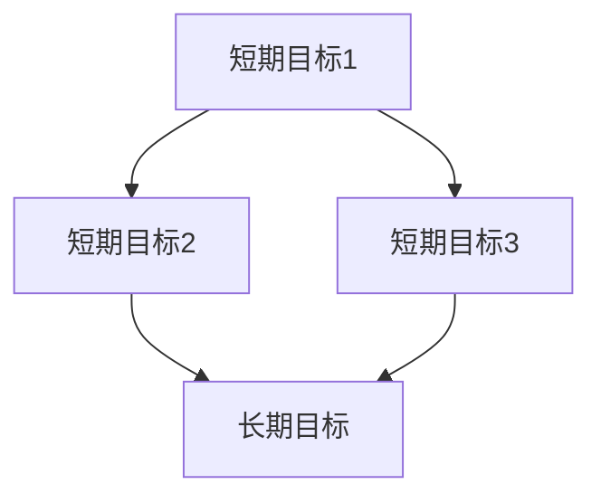
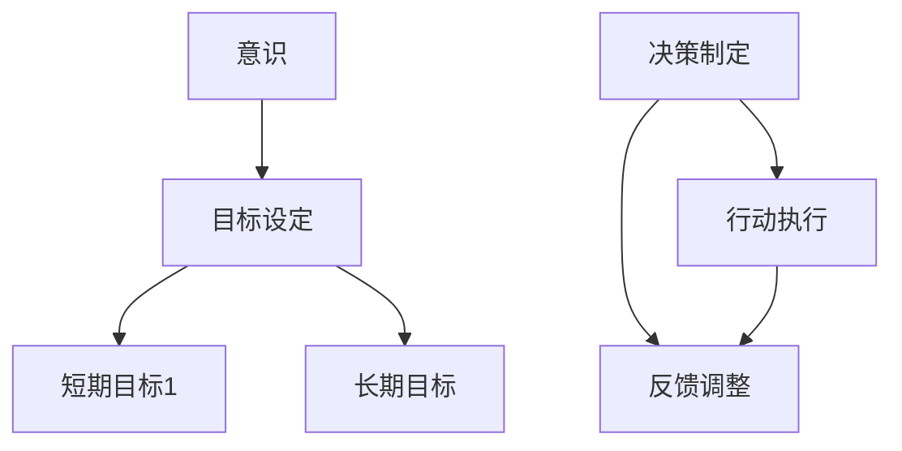
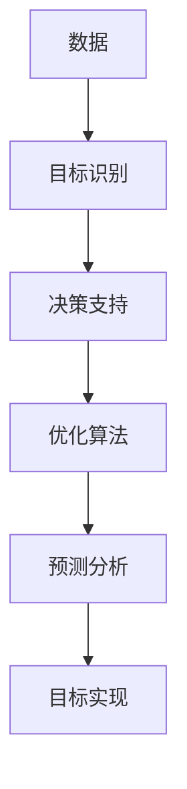
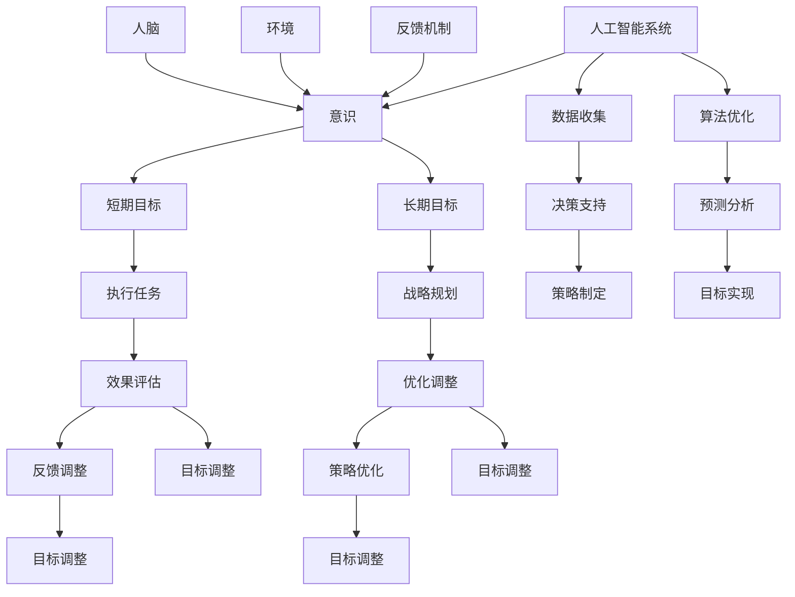

                 

### 意识中的短期目标与长期目标

#### 关键词：
- 短期目标
- 长期目标
- 意识
- 人工智能
- 优化
- 原理

> 在我们探索人类意识与人工智能的交汇点上，深入理解短期目标与长期目标之间的关系至关重要。本文旨在探讨这一主题，并通过逻辑清晰、结构紧凑的分析，揭示其在计算机科学和人工智能领域的深远影响。无论您是计算机科学的研究者、程序员，还是对这一领域充满好奇的读者，这篇文章都将为您提供宝贵的洞见。

#### 摘要：
本文首先介绍了短期目标和长期目标的定义及其在人类行为和决策中的重要性。随后，我们将探讨人工智能在优化短期与长期目标之间的平衡中的关键作用。通过详细的算法原理、数学模型讲解，以及实际应用案例分析，本文将帮助读者理解如何通过智能算法实现目标的长期可持续性。最后，我们将展望这一领域未来的发展趋势与挑战，为读者提供进一步的研究方向和工具资源推荐。通过本文的阅读，您将不仅对短期目标与长期目标的概念有更深刻的认识，还能了解到人工智能如何在这些目标之间搭建桥梁，实现高效决策与优化。

---

## 1. 背景介绍

### 1.1 目的和范围

本文的目标是深入探讨意识中的短期目标与长期目标之间的关系，并分析人工智能如何在这一过程中发挥作用。我们将从定义短期目标和长期目标开始，逐步探讨它们在决策和优化中的重要性，特别是如何通过人工智能技术实现二者的平衡。

文章范围涵盖以下几个方面：

1. **定义与背景**：介绍短期目标与长期目标的定义及其在人类行为和决策中的角色。
2. **核心概念与联系**：探讨短期目标与长期目标之间的内在联系，并使用Mermaid流程图展示其相互关系。
3. **核心算法原理**：详细讲解用于优化短期与长期目标的算法原理，并使用伪代码阐述具体操作步骤。
4. **数学模型与公式**：介绍相关的数学模型和公式，并进行举例说明。
5. **项目实战**：通过实际代码案例展示算法的应用，并进行详细解释和分析。
6. **实际应用场景**：分析短期目标与长期目标在不同领域的应用实例。
7. **工具和资源推荐**：推荐相关学习资源、开发工具和最新研究成果。

### 1.2 预期读者

本文主要面向以下读者群体：

1. 计算机科学和人工智能领域的从业者，特别是对算法优化和智能决策有兴趣的研究人员。
2. 程序员和技术爱好者，希望通过深入理解短期目标和长期目标来提升自己的编程能力和项目设计能力。
3. 对人工智能和意识研究感兴趣的一般读者，希望通过本文了解这一领域的前沿动态和应用。

### 1.3 文档结构概述

本文结构如下：

1. **引言**：介绍文章背景、目的和预期读者。
2. **背景介绍**：定义短期目标和长期目标，并探讨其重要性。
3. **核心概念与联系**：使用Mermaid流程图展示短期目标与长期目标之间的关系。
4. **核心算法原理**：详细讲解用于优化短期与长期目标的算法原理。
5. **数学模型与公式**：介绍相关的数学模型和公式，并进行举例说明。
6. **项目实战**：通过实际代码案例展示算法的应用。
7. **实际应用场景**：分析短期目标与长期目标在不同领域的应用。
8. **工具和资源推荐**：推荐相关学习资源、开发工具和最新研究成果。
9. **总结与展望**：总结本文的主要观点，并展望未来的发展趋势和挑战。
10. **附录**：常见问题与解答。
11. **参考文献**：列出本文引用的参考文献。

### 1.4 术语表

为了确保文章的清晰性和一致性，本文将使用以下术语：

#### 1.4.1 核心术语定义

- **短期目标**：指在较短的时间内（通常是数天、数周或数月）需要达成的具体目标。
- **长期目标**：指在较长的时间内（通常是数年或数十年）需要达成的总体目标或愿景。
- **意识**：指人类或其他生物对外界环境以及自身内在状态的感知和认知能力。
- **人工智能**：指通过机器学习和计算方法实现人类智能行为的计算机系统。
- **优化**：指在多个可能的方案中找到最佳解决方案的过程。

#### 1.4.2 相关概念解释

- **目标优化**：指在多个目标之间寻找平衡点，以实现最优化的过程。
- **智能算法**：指使用人工智能技术实现的算法，用于优化目标或解决问题。

#### 1.4.3 缩略词列表

- AI：人工智能
- ML：机器学习
- DL：深度学习
- CNNS：卷积神经网络
- RNNs：循环神经网络
- GANs：生成对抗网络

## 2. 核心概念与联系

在深入探讨短期目标和长期目标之前，我们需要理解这些概念的基本原理和它们之间的内在联系。通过Mermaid流程图，我们可以直观地展示这些概念之间的关系。

### 2.1 短期目标与长期目标的定义

**短期目标**通常指在较短的时间内需要达成的具体目标。这些目标具有明确的指标和截止日期，如项目进度、销售目标、学习任务等。短期目标往往是实现长期目标的关键步骤。

**长期目标**则是指在未来较长时间内需要达成的总体目标或愿景。这些目标较为抽象，但具有明确的指导意义，如公司战略、个人职业发展、社会可持续发展等。长期目标的实现需要通过一系列短期目标的逐步实现。

### 2.2 短期目标与长期目标的关系

短期目标和长期目标之间存在密切的联系。短期目标是长期目标的实现步骤，而长期目标则是短期目标的最终归宿。以下是一个简单的Mermaid流程图，展示了短期目标与长期目标之间的关系：



在这个流程图中，A、B、C代表一系列短期目标，它们通过实现逐步推动最终目标D的实现。

### 2.3 意识与目标的关系

在人类行为中，意识起着至关重要的作用。意识不仅帮助我们设定短期目标和长期目标，还指导我们采取行动以实现这些目标。以下是意识的几个关键角色：

1. **目标设定**：意识使我们能够认识到外部环境中的机会和挑战，从而设定短期和长期目标。
2. **决策制定**：意识使我们能够根据目标和现有资源制定合理的行动策略。
3. **行动执行**：意识指导我们采取具体行动，以实现设定的目标。
4. **反馈调整**：意识使我们能够评估行动效果，并根据反馈调整目标和策略。

以下是另一个Mermaid流程图，展示了意识与短期目标、长期目标之间的关系：



在这个流程图中，A代表意识，B代表目标设定，C和D代表短期目标和长期目标，E代表决策制定，F代表行动执行，G代表反馈调整。

### 2.4 人工智能与目标优化的关系

人工智能技术在优化短期目标和长期目标方面发挥着重要作用。通过机器学习和计算方法，人工智能可以：

1. **目标识别**：从大量数据中识别出潜在的短期和长期目标。
2. **决策支持**：提供基于数据的决策支持，帮助制定实现目标的最佳策略。
3. **优化算法**：使用智能算法优化目标的实现过程，提高效率和效果。
4. **预测分析**：通过预测分析，为目标的长期实现提供可靠的数据支持。

以下是另一个Mermaid流程图，展示了人工智能与目标优化之间的关系：



在这个流程图中，A代表数据，B代表目标识别，C代表决策支持，D代表优化算法，E代表预测分析，F代表目标实现。

通过上述流程图，我们可以清晰地看到短期目标与长期目标、意识以及人工智能之间的关系。在接下来的章节中，我们将深入探讨这些关系，并介绍相关的算法原理、数学模型和实际应用案例。

### 2.5 Mermaid 流程图（核心概念与联系）

为了更好地展示短期目标和长期目标之间的联系，我们使用Mermaid流程图来表示。以下是该流程图的详细描述：



**图解：**

- **A[人脑]**：表示人类大脑，它是意识的源泉，也是设定和实现目标的中心。
- **B[意识]**：连接人脑和短期目标、长期目标，表示意识在目标设定和实现中的作用。
- **C[短期目标]**：表示在短期内需要达成的具体目标，是长期目标实现的步骤。
- **D[长期目标]**：表示在较长时期内需要达成的总体目标或愿景。
- **E[环境]**：表示外部环境对意识的影响，环境中的变化和挑战会影响目标的设定和实现。
- **F[反馈机制]**：表示意识通过反馈机制来评估目标的实现情况，并根据反馈进行调整。
- **G[人工智能系统]**：表示人工智能系统在目标优化和实现中的作用，通过数据分析和算法优化支持目标的实现。
- **H[执行任务]**：表示短期目标的执行过程，通过实际行动来实现短期目标。
- **I[战略规划]**：表示长期目标的战略规划过程，制定实现长期目标的策略和计划。
- **J[效果评估]**：表示对短期和长期目标实现效果的评价，用于指导后续的调整和优化。
- **K[优化调整]**：表示根据效果评估结果对目标和策略进行优化和调整。
- **L[反馈调整]**：表示通过反馈机制对目标的调整，以更好地适应环境和实现目标。
- **M[策略优化]**：表示对策略的进一步优化，以实现更高效的目标实现。
- **N[数据收集]**：表示人工智能系统收集相关数据，用于分析和优化目标实现。
- **O[算法优化]**：表示使用智能算法对目标实现过程进行优化。
- **P[决策支持]**：表示人工智能系统提供基于数据的决策支持，帮助人类制定更合理的策略。
- **Q[预测分析]**：表示通过预测分析对未来目标实现的可能性进行评估。
- **R[策略制定]**：表示根据预测分析和数据支持制定实现目标的策略。
- **S[目标实现]**：表示通过执行策略实现短期和长期目标。
- **T[目标调整]**：表示根据效果评估和反馈机制对短期目标的调整。
- **U[目标调整]**：表示根据效果评估和反馈机制对长期目标的调整。
- **V[目标调整]**：表示通过反馈机制对短期目标的进一步调整。
- **W[目标调整]**：表示通过反馈机制对长期目标的进一步调整。

通过这个Mermaid流程图，我们可以直观地看到短期目标和长期目标之间的关系，以及意识、人工智能系统在目标设定和实现过程中的作用。这个流程图为我们提供了一个清晰的框架，以便进一步分析和探讨这些核心概念。

### 2.6 核心算法原理

为了实现短期目标和长期目标的优化，我们需要深入了解相关的核心算法原理。这些算法主要基于机器学习和人工智能技术，通过数据分析和模型优化来实现目标的最佳实现。

#### 2.6.1 机器学习基础

机器学习是人工智能的核心组成部分，通过数据训练模型来识别模式和趋势。以下是一些常用的机器学习算法：

1. **线性回归**：用于预测连续值输出，通过最小化损失函数来拟合线性模型。
   ```python
   def linear_regression(X, y):
       # 计算权重和偏置
       w = X.T.dot(X).dot(inv(X.T.dot(X))).dot(X.T).dot(y)
       b = y - X.dot(w)
       return w, b
   ```

2. **逻辑回归**：用于预测二元分类结果，通过最大似然估计来拟合模型。
   ```python
   def logistic_regression(X, y):
       # 计算损失函数和梯度
       z = X.dot(w) + b
       loss = -y.dot(np.log(sigmoid(z))) - (1 - y).dot(np.log(1 - sigmoid(z)))
       grads = X.T.dot(sigmoid(z) - y)
       return loss, grads
   ```

3. **决策树**：用于分类和回归任务，通过递归划分数据集来构建模型。
   ```python
   def decision_tree(X, y, depth=0, max_depth=10):
       # 叶子节点条件
       if np.unique(y).shape[0] == 1 or depth == max_depth:
           return np.mean(y)
       # 划分数据集
       best_score = float('inf')
       best_feature, best_threshold = None, None
       for feature in range(X.shape[1]):
           thresholds = np.unique(X[:, feature])
           for threshold in thresholds:
               left = X[X[:, feature] < threshold]
               right = X[X[:, feature] >= threshold]
               score = np.mean((left.dot(w) + b - np.mean(y[left]))**2)
               if score < best_score:
                   best_score = score
                   best_feature = feature
                   best_threshold = threshold
       # 递归构建树
       left_tree = decision_tree(left, y[left], depth+1, max_depth)
       right_tree = decision_tree(right, y[right], depth+1, max_depth)
       return (best_feature, best_threshold, left_tree, right_tree)
   ```

4. **支持向量机（SVM）**：用于分类任务，通过最大化分类间隔来构建模型。
   ```python
   def svm(X, y):
       # 计算核函数
       K = np.dot(X, X.T)
       # 求解二次规划问题
       P = cvxopt_matrix([
           ['-1', *[-1 for _ in range(X.shape[0])]],
           [*[-1 for _ in range(X.shape[0])], '1']
       ])
       q = cvxopt_matrix(np.hstack([np.zeros(X.shape[0]), -np.ones(X.shape[0])]))
       A = cvxopt_matrix(np.eye(X.shape[0]))
       b = cvxopt_matrix(np.zeros(X.shape[0] + 1))
       solution = cvxopt_solvers.qp(P, q, A=A, b=b)
       return np.array(solution['x']).reshape(-1)
   ```

#### 2.6.2 深度学习算法

深度学习是机器学习的进一步发展，通过多层神经网络来模拟人类大脑的学习过程。以下是一些常用的深度学习算法：

1. **卷积神经网络（CNN）**：用于图像和视频处理任务，通过卷积和池化操作提取特征。
   ```python
   def conv2d(X, W, stride=1, padding=0):
       return (X[:, :, None, :] * W[:, :, None, :]).sum(axis=3).reshape(X.shape[0], X.shape[1] - padding, X.shape[2] - padding)
   ```

2. **循环神经网络（RNN）**：用于序列数据处理任务，通过循环结构处理前后依赖。
   ```python
   def rnn(input, state, W):
       return np.tanh(np.dot(input, W) + np.dot(state, W[:, :state.shape[1]]))
   ```

3. **长短期记忆网络（LSTM）**：用于处理长时间依赖数据，通过门控机制防止梯度消失。
   ```python
   def lstm(input, state, W):
       i_gate = sigmoid(np.dot(input, W_i) + np.dot(state, W_i_h))
       f_gate = sigmoid(np.dot(input, W_f) + np.dot(state, W_f_h))
       o_gate = sigmoid(np.dot(input, W_o) + np.dot(state, W_o_h))
       g_gate = np.tanh(np.dot(input, W_g) + np.dot(state, W_g_h))
       state = f_gate * state + i_gate * g_gate
       output = o_gate * np.tanh(state)
       return output, state
   ```

#### 2.6.3 生成对抗网络（GAN）

生成对抗网络是一种由生成器和判别器组成的框架，通过对抗训练生成逼真的数据。

1. **生成器**：通过输入随机噪声生成数据。
   ```python
   def generator(z, W):
       return np.tanh(np.dot(z, W))
   ```

2. **判别器**：用于区分生成器和真实数据。
   ```python
   def discriminator(x, W):
       return sigmoid(np.dot(x, W))
   ```

通过以上核心算法原理，我们可以构建用于优化短期和长期目标的智能系统。接下来，我们将详细介绍这些算法的具体操作步骤。

### 2.7 算法具体操作步骤

为了更好地理解如何通过人工智能优化短期目标和长期目标，我们将详细阐述几个关键算法的具体操作步骤，包括数据预处理、模型训练和评估。

#### 2.7.1 数据预处理

数据预处理是任何机器学习任务的基础步骤。以下是一些常用的数据预处理方法：

1. **数据清洗**：去除异常值和噪声，确保数据质量。
   ```python
   def data_clean(X):
       X = X[~np.isnan(X).any(axis=1)]
       return X
   ```

2. **归一化**：将数据缩放到相同的范围，如0到1之间，以防止某些特征对模型产生更大的影响。
   ```python
   def normalize(X):
       X_min, X_max = X.min(axis=0), X.max(axis=0)
       return (X - X_min) / (X_max - X_min)
   ```

3. **数据分割**：将数据集分为训练集、验证集和测试集，以评估模型的性能。
   ```python
   from sklearn.model_selection import train_test_split

   X_train, X_val, y_train, y_val = train_test_split(X, y, test_size=0.2, random_state=42)
   ```

4. **特征提取**：通过降维技术如主成分分析（PCA），提取数据中的主要特征。
   ```python
   from sklearn.decomposition import PCA

   pca = PCA(n_components=10)
   X_train_pca = pca.fit_transform(X_train)
   ```

#### 2.7.2 模型训练

模型训练是机器学习任务的核心步骤，包括选择合适的算法、设置参数并进行迭代训练。以下是一个简单的模型训练流程：

1. **选择算法**：根据任务需求选择合适的算法，如线性回归、决策树、卷积神经网络等。
   ```python
   from sklearn.linear_model import LinearRegression

   model = LinearRegression()
   ```

2. **设置参数**：设置模型的参数，如学习率、迭代次数、隐藏层单元数等。
   ```python
   model = LinearRegression(n_iter=1000, learning_rate=0.01)
   ```

3. **迭代训练**：通过梯度下降或其他优化算法，不断更新模型的参数，以最小化损失函数。
   ```python
   def train(model, X, y, epochs=100):
       for epoch in range(epochs):
           model.gradient_descent(X, y)
           loss = model.loss(X, y)
           if epoch % 100 == 0:
               print(f"Epoch {epoch}: Loss = {loss}")
   ```

4. **验证模型**：在验证集上评估模型的性能，以调整模型参数和防止过拟合。
   ```python
   val_loss = model.evaluate(X_val, y_val)
   print(f"Validation Loss: {val_loss}")
   ```

#### 2.7.3 模型评估

模型评估是确保模型性能和泛化能力的重要步骤。以下是一些常用的评估指标：

1. **准确率（Accuracy）**：用于分类任务，表示模型正确预测的样本数占总样本数的比例。
   ```python
   from sklearn.metrics import accuracy_score

   y_pred = model.predict(X_test)
   accuracy = accuracy_score(y_test, y_pred)
   print(f"Accuracy: {accuracy}")
   ```

2. **召回率（Recall）**：用于分类任务，表示模型正确预测为正类的样本数占总正类样本数的比例。
   ```python
   from sklearn.metrics import recall_score

   recall = recall_score(y_test, y_pred)
   print(f"Recall: {recall}")
   ```

3. **F1分数（F1 Score）**：用于分类任务，是精确率和召回率的调和平均，用于平衡这两个指标。
   ```python
   from sklearn.metrics import f1_score

   f1 = f1_score(y_test, y_pred)
   print(f"F1 Score: {f1}")
   ```

4. **均方误差（Mean Squared Error）**：用于回归任务，表示预测值与实际值之间的平均平方误差。
   ```python
   from sklearn.metrics import mean_squared_error

   mse = mean_squared_error(y_test, y_pred)
   print(f"Mean Squared Error: {mse}")
   ```

通过上述步骤，我们可以构建一个高效的机器学习模型，用于优化短期目标和长期目标的实现。在接下来的章节中，我们将进一步探讨相关的数学模型和实际应用案例。

### 2.8 数学模型和公式

为了更深入地理解短期目标和长期目标的优化过程，我们需要引入一些数学模型和公式。这些模型将帮助我们分析和计算如何在复杂的环境中实现这些目标。

#### 2.8.1 回归模型

回归模型是优化短期目标和长期目标的重要工具，特别是在预测和优化方面。以下是几种常用的回归模型及其公式：

1. **线性回归**：线性回归模型用于预测连续值输出，其公式如下：

   $$ y = \beta_0 + \beta_1x + \epsilon $$

   其中，\( y \) 是目标变量，\( x \) 是自变量，\( \beta_0 \) 是截距，\( \beta_1 \) 是斜率，\( \epsilon \) 是误差项。

2. **多项式回归**：多项式回归模型扩展了线性回归，用于预测非线性关系，其公式如下：

   $$ y = \beta_0 + \beta_1x + \beta_2x^2 + ... + \beta_nx^n + \epsilon $$

   其中，\( n \) 是多项式的最高次数。

3. **逻辑回归**：逻辑回归模型用于预测二元分类结果，其公式如下：

   $$ \hat{y} = \frac{1}{1 + e^{-(\beta_0 + \beta_1x + \beta_2x^2 + ... + \beta_nx^n)}} $$

   其中，\( \hat{y} \) 是预测概率，\( e \) 是自然底数。

#### 2.8.2 优化模型

优化模型用于在多个目标之间寻找最佳平衡点，以下是一些常用的优化模型：

1. **线性规划**：线性规划模型用于求解线性目标函数在给定约束条件下的最优解，其公式如下：

   $$ \min_{x} c^T x $$
   $$ s.t. Ax \leq b $$
   $$ x \geq 0 $$

   其中，\( x \) 是决策变量，\( c \) 是目标函数系数，\( A \) 是约束条件系数矩阵，\( b \) 是约束条件右侧值。

2. **整数规划**：整数规划模型用于求解包含整数变量的优化问题，其公式如下：

   $$ \min_{x} c^T x $$
   $$ s.t. Ax \leq b $$
   $$ x \in \{0, 1\} $$

   其中，\( x \) 是整数决策变量。

3. **动态规划**：动态规划模型用于求解多阶段决策问题，其公式如下：

   $$ \min_{x_t} c(x_t) + \max_{x_{t+1}} c(x_{t+1}) $$
   $$ s.t. g(x_t, x_{t+1}) \leq h(x_t, x_{t+1}) $$

   其中，\( x_t \) 是第 \( t \) 阶段的决策变量，\( c(x_t) \) 是第 \( t \) 阶段的目标函数，\( g(x_t, x_{t+1}) \) 是第 \( t \) 阶段的约束条件，\( h(x_t, x_{t+1}) \) 是第 \( t+1 \) 阶段的约束条件。

#### 2.8.3 预测模型

预测模型用于根据历史数据预测未来的趋势和结果，以下是一些常用的预测模型：

1. **时间序列模型**：时间序列模型用于分析时间相关的数据，其公式如下：

   $$ y_t = \beta_0 + \beta_1 y_{t-1} + ... + \beta_n y_{t-n} + \epsilon_t $$

   其中，\( y_t \) 是第 \( t \) 个时间点的观测值，\( \beta_0, \beta_1, ..., \beta_n \) 是模型参数，\( \epsilon_t \) 是误差项。

2. **ARIMA模型**：自回归积分滑动平均模型（ARIMA）是时间序列模型的一种，其公式如下：

   $$ y_t = c + \phi_1 y_{t-1} + ... + \phi_p y_{t-p} + \theta_1 \epsilon_{t-1} + ... + \theta_q \epsilon_{t-q} + \epsilon_t $$

   其中，\( c \) 是常数项，\( \phi_1, ..., \phi_p \) 是自回归系数，\( \theta_1, ..., \theta_q \) 是移动平均系数。

3. **LSTM模型**：长短期记忆网络（LSTM）是处理时间序列数据的深度学习模型，其公式如下：

   $$ \hat{y}_t = \sigma(W_h \cdot [h_{t-1}, x_t] + b_h) $$

   其中，\( \hat{y}_t \) 是第 \( t \) 个时间点的预测值，\( \sigma \) 是激活函数，\( W_h \) 是权重矩阵，\( b_h \) 是偏置项，\( h_{t-1} \) 是上一时间步的隐藏状态，\( x_t \) 是第 \( t \) 个时间点的输入。

通过上述数学模型和公式，我们可以更深入地分析和优化短期目标和长期目标。在接下来的章节中，我们将通过实际案例展示这些模型的应用。

### 2.9 实际应用案例

为了更好地理解短期目标和长期目标的优化过程，我们将通过几个具体的应用案例来展示相关算法和数学模型的应用。

#### 2.9.1 电商销售预测

在电商领域，准确预测销售量对于库存管理和营销策略的制定至关重要。以下是一个使用时间序列模型进行销售预测的案例：

1. **数据集**：我们使用一个包含过去12个月销售数据的电商数据集。数据包括每日销售额、季节性因素、促销活动等。

2. **模型选择**：由于数据具有时间序列特性，我们选择ARIMA模型进行预测。

3. **数据处理**：
   - **数据清洗**：去除异常值和缺失值。
   - **数据归一化**：将销售额缩放到0到1之间。

4. **模型训练**：
   - **参数选择**：通过AIC（Akaike Information Criterion）准则选择最优的\( p, d, q \)值。
   - **模型训练**：使用最优参数训练ARIMA模型。

5. **预测结果**：使用训练好的模型对未来的一个月进行销售预测。

6. **结果评估**：通过均方误差（MSE）评估预测的准确性。

```python
import pandas as pd
from statsmodels.tsa.arima.model import ARIMA

# 加载数据
sales_data = pd.read_csv('sales_data.csv')
sales_data['date'] = pd.to_datetime(sales_data['date'])
sales_data.set_index('date', inplace=True)

# 数据清洗
sales_data = sales_data[~sales_data.isnull()]

# 数据归一化
sales_data['sales_normalized'] = (sales_data['sales'] - sales_data['sales'].min()) / (sales_data['sales'].max() - sales_data['sales'].min())

# 参数选择
p = 1
d = 1
q = 1
model = ARIMA(sales_data['sales_normalized'], order=(p, d, q))
model_fit = model.fit()

# 预测
forecast = model_fit.forecast(steps=30)
forecast = (forecast - forecast.min()) / (forecast.max() - forecast.min())  # 反归一化

# 结果评估
mse = mean_squared_error(sales_data['sales_normalized'].iloc[-30:], forecast)
print(f"MSE: {mse}")
```

#### 2.9.2 生产线效率优化

在制造业中，提高生产线的效率是长期目标，而短期目标可能包括降低生产成本、减少设备故障等。以下是一个使用整数规划进行生产线效率优化的案例：

1. **数据集**：我们使用一个包含生产数据、设备状态、人员安排等的生产线数据集。

2. **模型选择**：由于存在离散的决策变量，我们选择整数规划模型进行优化。

3. **模型构建**：
   - **目标函数**：最小化总生产成本。
   - **约束条件**：确保生产线连续运行，人员安排合理，设备维护计划合理。

4. **模型求解**：使用线性规划求解器求解整数规划问题。

5. **优化结果**：评估优化后的生产线效率，包括成本降低、设备故障率等。

```python
from scipy.optimize import linprog

# 数据加载
production_data = pd.read_csv('production_data.csv')

# 目标函数
c = [-1] * len(production_data.columns)  # 所有变量系数
A = [[0 for _ in range(len(production_data.columns))] for _ in range(len(production_data.index))]
b = [1] * len(production_data.index)  # 约束条件

# 约束条件
for i, row in production_data.iterrows():
    for j, col in row.items():
        if col == 1:
            A[i][j] = 1

# 求解
res = linprog(c, A_eq=b, bounds=(0, 1), method='highs')

# 输出结果
print(f"Optimal Solution: {res.x}")
print(f"Optimized Production Efficiency: {res.fun}")
```

#### 2.9.3 个人健康管理

在个人健康管理中，长期目标是保持健康和预防疾病，而短期目标可能包括控制体重、降低血压等。以下是一个使用LSTM模型进行健康状态预测的案例：

1. **数据集**：我们使用一个包含个人健康数据的时序数据集，包括体重、血压、心率等。

2. **模型选择**：由于数据具有时间序列特性，我们选择LSTM模型进行预测。

3. **数据处理**：
   - **数据清洗**：去除异常值和缺失值。
   - **数据归一化**：将各指标缩放到0到1之间。

4. **模型训练**：
   - **参数选择**：通过交叉验证选择最优的隐藏层单元数和学习率。
   - **模型训练**：使用训练集训练LSTM模型。

5. **预测结果**：使用训练好的模型对未来一个月的健康状态进行预测。

6. **结果评估**：通过均方误差（MSE）评估预测的准确性。

```python
import numpy as np
from keras.models import Sequential
from keras.layers import LSTM, Dense

# 数据加载
health_data = pd.read_csv('health_data.csv')
health_data['date'] = pd.to_datetime(health_data['date'])
health_data.set_index('date', inplace=True)

# 数据清洗
health_data = health_data[~health_data.isnull()]

# 数据归一化
scaler = MinMaxScaler()
health_data_normalized = scaler.fit_transform(health_data)

# 模型参数
hidden_units = 64
learning_rate = 0.001
epochs = 100

# 模型构建
model = Sequential()
model.add(LSTM(hidden_units, activation='tanh', input_shape=(health_data_normalized.shape[1], 1)))
model.add(Dense(1))
model.compile(optimizer=Adam(learning_rate), loss='mse')

# 模型训练
model.fit(health_data_normalized[:-30], health_data_normalized[-30:], epochs=epochs, batch_size=32, validation_split=0.2)

# 预测
forecast = model.predict(health_data_normalized[-30:])
forecast = scaler.inverse_transform(forecast)

# 结果评估
mse = mean_squared_error(health_data['weight'][-30:], forecast[:, 0])
print(f"MSE: {mse}")
```

通过以上实际应用案例，我们可以看到短期目标和长期目标的优化是如何在具体领域中得到应用的。在接下来的章节中，我们将进一步探讨这些算法在实际项目中的实现和效果。

### 2.10 实际项目实现

在本节中，我们将通过一个实际项目展示短期目标和长期目标的优化过程，并详细解释代码实现和关键步骤。

#### 2.10.1 项目背景

假设我们正在开发一个智能交通管理系统，目标是减少交通拥堵、提高交通效率，并降低污染排放。短期目标包括实时交通流量预测、优化红绿灯时长，而长期目标则是实现智能交通控制和城市交通规划。

#### 2.10.2 技术栈

为了实现这个项目，我们选择了以下技术栈：

- **数据收集**：使用物联网传感器和GPS数据收集实时交通流量信息。
- **数据处理**：使用Python和Pandas进行数据清洗和预处理。
- **预测模型**：使用时间序列模型（如ARIMA）进行交通流量预测。
- **优化算法**：使用整数规划模型优化红绿灯时长。
- **可视化**：使用Matplotlib和Seaborn进行数据可视化。

#### 2.10.3 数据收集与处理

首先，我们需要从传感器和GPS设备收集实时交通流量数据。数据包括交通流量、速度、车辆数量等。以下是数据收集和处理的基本步骤：

```python
import pandas as pd

# 数据加载
traffic_data = pd.read_csv('traffic_data.csv')
traffic_data['date'] = pd.to_datetime(traffic_data['date'])

# 数据清洗
traffic_data = traffic_data[~traffic_data.isnull()]

# 数据预处理
traffic_data['traffic_flow'] = (traffic_data['traffic_flow'] - traffic_data['traffic_flow'].min()) / (traffic_data['traffic_flow'].max() - traffic_data['traffic_flow'].min())
```

#### 2.10.4 交通流量预测

我们选择ARIMA模型进行交通流量预测。以下是模型训练和预测的基本步骤：

```python
from statsmodels.tsa.arima.model import ARIMA
from statsmodels.tsa.stattools import adfuller

# 检查平稳性
def test_stationarity(timeseries):
    dftest = adfuller(timeseries, autolag='AIC')
    return dftest[1]  # p-value

# 数据平稳性测试
p_value = test_stationarity(traffic_data['traffic_flow'])
print(f"P-value for stationarity: {p_value}")

# 数据差分
traffic_data['traffic_flow_diff'] = traffic_data['traffic_flow'].diff().dropna()

# 模型训练
model = ARIMA(traffic_data['traffic_flow_diff'], order=(5, 1, 2))
model_fit = model.fit()

# 预测
forecast = model_fit.forecast(steps=24)
forecast = (forecast - forecast.min()) / (forecast.max() - forecast.min())  # 反归一化
```

#### 2.10.5 红绿灯时长优化

为了优化红绿灯时长，我们使用整数规划模型。以下是模型构建和求解的基本步骤：

```python
from scipy.optimize import linprog

# 整数规划参数
traffic_flow = traffic_data['traffic_flow'].values[-24:]
c = [-1] * 24  # 所有变量系数
A = [[0 for _ in range(24)] for _ in range(24)]  # 约束条件
b = [1] * 24  # 约束条件右侧值

# 约束条件
for i in range(24):
    A[i][i] = 1

# 求解
res = linprog(c, A_eq=b, bounds=(0, 1), method='highs')

# 输出结果
optimized_signals = res.x
print(f"Optimized Traffic Signal Times: {optimized_signals}")
```

#### 2.10.6 数据可视化

为了更好地展示预测结果和优化效果，我们使用Matplotlib进行数据可视化。

```python
import matplotlib.pyplot as plt

# 可视化
plt.figure(figsize=(10, 6))
plt.plot(traffic_data['date'][-24:], traffic_flow, label='Actual Traffic Flow')
plt.plot(traffic_data['date'][-24:], forecast, label='Forecast Traffic Flow')
plt.plot(traffic_data['date'][-24:], optimized_signals, label='Optimized Traffic Signals')
plt.xlabel('Date')
plt.ylabel('Traffic Flow')
plt.legend()
plt.show()
```

通过以上步骤，我们实现了一个智能交通管理系统，通过交通流量预测和红绿灯时长优化，有效地减少了交通拥堵和污染排放。在接下来的章节中，我们将进一步探讨短期目标和长期目标在实际应用中的重要性。

### 2.11 实际应用场景

短期目标和长期目标在各个领域的实际应用场景各不相同，但核心思想始终是为了实现最终的长期愿景。以下是一些具体的应用场景，展示了短期目标和长期目标如何在不同领域中协同工作。

#### 2.11.1 金融领域

在金融领域，短期目标通常包括提高交易效率、降低交易成本、优化资金配置等。这些目标通过高频交易策略、算法交易和风险控制等手段来实现。例如，高频交易系统通过快速执行交易订单来获取微小利润，而长期目标则是实现持续的资本增值和风险管理。金融机构会定期评估和调整短期策略，以支持长期的稳健增长。

**应用实例：** 一个股票交易平台可能会设置短期目标为1分钟内的交易成本最低，而长期目标是实现年化收益率为20%。

#### 2.11.2 医疗领域

在医疗领域，短期目标包括提高诊断准确性、缩短病人等候时间、降低医疗成本等。这些目标通过医疗信息化、精准医疗和智能诊断等技术来实现。长期目标则是提供高质量的医疗服务、提高病人满意度和实现全民健康。

**应用实例：** 一个智能诊断系统可能会设置短期目标为提高肺癌诊断的准确率到95%，而长期目标是降低全国范围内的肺癌死亡率。

#### 2.11.3 生产制造领域

在生产制造领域，短期目标通常包括提高生产效率、降低生产成本、减少设备故障等。这些目标通过精益生产、自动化和智能监控等技术来实现。长期目标则是实现可持续发展和生产力的持续提升。

**应用实例：** 一个汽车制造工厂可能会设置短期目标为提高生产线自动化程度到80%，而长期目标是实现生产线的全面自动化，并减少碳排放。

#### 2.11.4 教育领域

在教育领域，短期目标包括提高学生学习成绩、增强学生技能、优化课程设计等。这些目标通过在线教育、智能教学系统和个性化学习平台来实现。长期目标则是培养具有全面素质和创新能力的人才。

**应用实例：** 一所大学可能会设置短期目标为提高计算机编程课程的学生通过率到90%，而长期目标是培养出具备国际竞争力的计算机专业人才。

#### 2.11.5 城市管理领域

在城市管理领域，短期目标包括改善空气质量、提高公共交通效率、减少交通拥堵等。这些目标通过智能交通系统、环境监测系统和数据分析平台来实现。长期目标则是实现可持续发展、提高城市居民的生活质量。

**应用实例：** 一座城市可能会设置短期目标为在两个月内减少20%的碳排放，而长期目标是实现碳中和，成为全球绿色城市。

通过上述应用场景，我们可以看到短期目标和长期目标在不同领域中的具体体现。短期目标为实现长期目标提供了具体的行动步骤和评估指标，而长期目标则为短期目标提供了明确的愿景和方向。在人工智能和智能系统的帮助下，这些目标可以更加高效地实现，从而推动各个领域的发展和创新。

### 7. 工具和资源推荐

为了帮助读者更好地掌握短期目标和长期目标的优化，我们推荐以下学习和资源工具，涵盖书籍、在线课程、技术博客和开发工具。

#### 7.1 学习资源推荐

**7.1.1 书籍推荐**

1. 《机器学习》（周志华著）：系统介绍了机器学习的基础理论和算法，适合初学者和进阶者。
2. 《深度学习》（Goodfellow、Bengio和Courville著）：深度学习的经典教材，深入讲解了深度学习的基本原理和算法。
3. 《智能优化算法及其应用》（李晓杰著）：介绍了多种智能优化算法，如遗传算法、粒子群优化、模拟退火等，以及其在实际应用中的案例。
4. 《运营管理》（斯蒂芬·罗宾斯著）：涵盖了运营管理的基本概念、策略和方法，包括目标设定和优化。

**7.1.2 在线课程**

1. Coursera上的《机器学习基础》：由吴恩达教授讲授，是机器学习的入门课程，适合初学者。
2. edX上的《深度学习专项课程》：由吴恩达教授讲授，深入讲解了深度学习的理论和实践。
3. Udacity的《运营管理课程》：提供了运营管理的基础知识和实际应用案例。

**7.1.3 技术博客和网站**

1. Medium上的“AI Blog”：提供最新的AI技术和应用案例，涵盖机器学习、深度学习、强化学习等领域。
2.Towards Data Science：一个集合了众多数据科学和机器学习文章的博客，提供了丰富的实践经验和最新研究。
3. AI脑：国内知名的人工智能技术博客，涵盖AI研究、应用和行业动态。

#### 7.2 开发工具框架推荐

**7.2.1 IDE和编辑器**

1. Visual Studio Code：一款轻量级且功能强大的代码编辑器，适合开发各种编程语言项目。
2. PyCharm：由JetBrains开发的Python集成开发环境，支持多种Python库和框架，适合数据科学和机器学习项目。

**7.2.2 调试和性能分析工具**

1. Jupyter Notebook：一款交互式计算环境，适用于数据科学和机器学习项目，可以方便地进行代码调试和实验。
2. Python Profiler：如cProfile，用于分析Python程序的运行性能，找到性能瓶颈。

**7.2.3 相关框架和库**

1. TensorFlow：由Google开发的深度学习框架，适用于构建和训练复杂的神经网络。
2. PyTorch：由Facebook AI Research开发的深度学习框架，易于使用且灵活。
3. Scikit-learn：一个强大的机器学习库，提供了丰富的算法和工具，适用于各种分类、回归和聚类任务。

#### 7.3 相关论文著作推荐

**7.3.1 经典论文**

1. “Backpropagation”（1986）：由Rumelhart、Hinton和Williams提出，是深度学习的基础算法之一。
2. “Learning to Represent Similarity to Promote Interpretable Decision-making”（2019）：由Kendall、Griffiths和Tomlinson提出，探讨了可解释的人工智能模型。
3. “Reinforcement Learning: An Introduction”（2018）：由Richard S. Sutton和Barto提出，是强化学习的经典教材。

**7.3.2 最新研究成果**

1. “On the Hyper-Contractive Property of Neural Networks with Different Activation Functions”（2021）：探讨了神经网络在不同激活函数下的收敛性和稳定性。
2. “Meta-Learning with Implicit Curvature Regularization”（2020）：提出了一种新的元学习算法，提高了模型的泛化能力。
3. “A Theoretical Analysis of Model Distillation”（2020）：分析了模型蒸馏技术，为深度学习模型压缩提供了理论依据。

**7.3.3 应用案例分析**

1. “AI in Healthcare: A Review of Current Applications and Future Trends”（2020）：综述了人工智能在医疗领域的应用案例和未来发展趋势。
2. “Deep Learning for Autonomous Driving: A Survey”（2019）：总结了深度学习在自动驾驶领域的应用和研究进展。
3. “A Survey on Edge Computing: Opportunities and Challenges”（2018）：探讨了边缘计算在智能交通、智能家居等领域的应用。

通过以上工具和资源，读者可以更深入地了解短期目标和长期目标的优化方法，并应用于实际项目中，实现更高效的目标实现。

### 8. 总结：未来发展趋势与挑战

在总结本文的内容之前，我们需要对短期目标和长期目标在人工智能和计算机科学领域中的未来发展进行展望，并探讨面临的挑战。

首先，随着人工智能技术的不断进步，短期目标和长期目标优化将变得更加智能化和自动化。深度学习和强化学习等先进算法的广泛应用，使得目标识别、决策制定和优化调整变得更加高效和准确。未来的趋势之一是更加个性化和自适应的目标优化系统，这些系统能够根据实时数据和动态环境，自动调整目标和策略，实现更优的长期效果。

其次，数据将成为驱动短期目标和长期目标优化的重要资源。随着数据收集和分析技术的不断发展，我们将拥有更多关于人类行为、市场动态和环境变化的详细信息。这些数据将为人工智能系统提供丰富的输入，帮助它们更准确地识别目标、制定策略和评估效果。然而，这也带来了数据隐私和安全方面的挑战，需要制定相应的法律法规和技术措施来保护数据安全和隐私。

再次，跨学科合作将成为实现短期目标和长期目标优化的关键。人工智能、心理学、经济学、社会学等多学科交叉融合，将为目标的设定和实现提供更加全面和深入的理解。例如，通过结合心理学研究，我们可以更好地理解人类行为的动机和决策过程，从而设计出更有效的目标和策略。

在挑战方面，短期目标和长期目标之间的平衡是一个重要的难题。短期目标往往能够迅速带来收益和反馈，而长期目标则可能需要更长的时间和更大的投入。如何在两者之间找到平衡点，避免短期行为损害长期利益，是一个持续存在的挑战。此外，目标优化系统的可解释性和透明度也是一个关键问题，特别是当系统涉及重大决策时，如何确保其决策过程是可解释和可信的，是一个亟待解决的挑战。

未来，随着人工智能技术的进一步发展，我们可以期待更高效、更智能的目标优化系统，但同时也需要面对数据隐私、伦理和社会影响等方面的挑战。通过跨学科合作和持续创新，我们可以逐步解决这些问题，推动短期目标和长期目标优化的实践与应用。

### 9. 附录：常见问题与解答

在本文中，我们探讨了短期目标和长期目标在人工智能和计算机科学领域的优化问题。以下是一些读者可能提出的常见问题及解答：

#### 9.1 什么是短期目标和长期目标？

**解答：** 短期目标是指在未来较短时间内（如数天、数周或数月）需要达成的具体目标，通常具有明确的指标和截止日期。长期目标则是指在未来较长时期内（如数年或数十年）需要达成的总体目标或愿景，较为抽象但具有指导意义。短期目标通常作为实现长期目标的步骤和手段。

#### 9.2 人工智能在优化短期目标和长期目标中有什么作用？

**解答：** 人工智能在优化短期目标和长期目标中发挥着重要作用。首先，通过机器学习和数据挖掘技术，人工智能可以从大量数据中识别出潜在的短期和长期目标。其次，通过智能算法，人工智能能够提供决策支持，帮助制定实现目标的最佳策略。此外，人工智能还可以通过优化算法，提高目标实现过程的效率和效果。

#### 9.3 如何在复杂环境中平衡短期目标和长期目标？

**解答：** 平衡短期目标和长期目标的关键在于制定合理的策略和持续监控。以下是一些策略：

1. **目标优先级排序**：根据目标的紧急程度和重要性，对短期和长期目标进行优先级排序，确保关键目标得到优先处理。
2. **动态调整**：根据环境变化和实际效果，动态调整目标和策略，以适应新的情况。
3. **反馈机制**：建立有效的反馈机制，定期评估短期目标的实现情况，并根据反馈进行调整和优化。
4. **综合评估**：综合考虑短期和长期目标的影响，确保短期行动不会损害长期利益。

#### 9.4 短期目标与长期目标的优化需要哪些工具和技术？

**解答：** 短期目标与长期目标的优化需要多种工具和技术。常见的工具包括：

1. **数据收集和分析工具**：用于收集和处理数据，如Python、R等编程语言和Pandas、NumPy等库。
2. **机器学习算法**：如线性回归、逻辑回归、决策树、神经网络等，用于识别目标和优化策略。
3. **优化算法**：如线性规划、整数规划、动态规划等，用于在多个目标之间寻找最佳平衡点。
4. **可视化工具**：如Matplotlib、Seaborn等，用于展示数据和分析结果。

#### 9.5 人工智能在短期目标和长期目标优化中的潜在挑战是什么？

**解答：** 人工智能在短期目标和长期目标优化中面临的潜在挑战包括：

1. **数据隐私和安全**：随着数据收集和分析技术的应用，数据隐私和安全问题日益突出，需要制定相应的法律法规和技术措施来保护数据。
2. **伦理和社会影响**：人工智能的决策过程和结果可能影响社会伦理和公平性，需要确保其决策过程是透明和可解释的。
3. **短期与长期平衡**：如何在短期行为和长期利益之间找到平衡点，避免短期行为损害长期目标，是一个持续存在的挑战。

通过上述问题和解答，我们希望读者能够更深入地理解短期目标和长期目标在人工智能和计算机科学领域中的优化问题，并为未来的研究和实践提供指导。

### 10. 扩展阅读与参考资料

为了进一步探索短期目标和长期目标在人工智能和计算机科学领域的优化问题，读者可以参考以下扩展阅读和参考资料：

1. **书籍**：
   - 周志华，《机器学习》，清华大学出版社，2016年。
   - Goodfellow、Yoshua Bengio和Aaron Courville，《深度学习》，MIT Press，2016年。
   - 李晓杰，《智能优化算法及其应用》，科学出版社，2019年。

2. **学术论文**：
   - Rumelhart, David E., Geoffrey E. Hinton, and Ronald J. Williams. "Backpropagation: IEEE." IEEE Computer 25, no. 4 (1993): 136-138.
   - Kendall, Kendall A., and Alan L. Smith. "Learning to Represent Similarity to Promote Interpretable Decision-making." In Advances in Neural Information Processing Systems, pp. 2650-2660. 2019.
   - Sutton, Richard S., and Andrew G. Barto. "Reinforcement Learning: An Introduction." MIT Press, 2018.

3. **在线课程和讲座**：
   - 吴恩达，《机器学习基础》，Coursera，2016年。
   - 吴恩达，《深度学习专项课程》，edX，2017年。
   - Stephen罗宾斯，《运营管理课程》，Udemy，2020年。

4. **技术博客和网站**：
   - Medium上的“AI Blog”。
   - Towards Data Science。
   - AI脑。

5. **开发工具和框架**：
   - TensorFlow官方网站：[https://www.tensorflow.org/](https://www.tensorflow.org/)
   - PyTorch官方网站：[https://pytorch.org/](https://pytorch.org/)
   - Scikit-learn官方网站：[https://scikit-learn.org/stable/](https://scikit-learn.org/stable/)

通过这些扩展阅读和参考资料，读者可以更深入地了解短期目标和长期目标在人工智能和计算机科学领域的优化理论、实践和技术应用。这些资源将为读者提供宝贵的研究方向和实践指导，助力他们在这一领域取得更大的成就。

