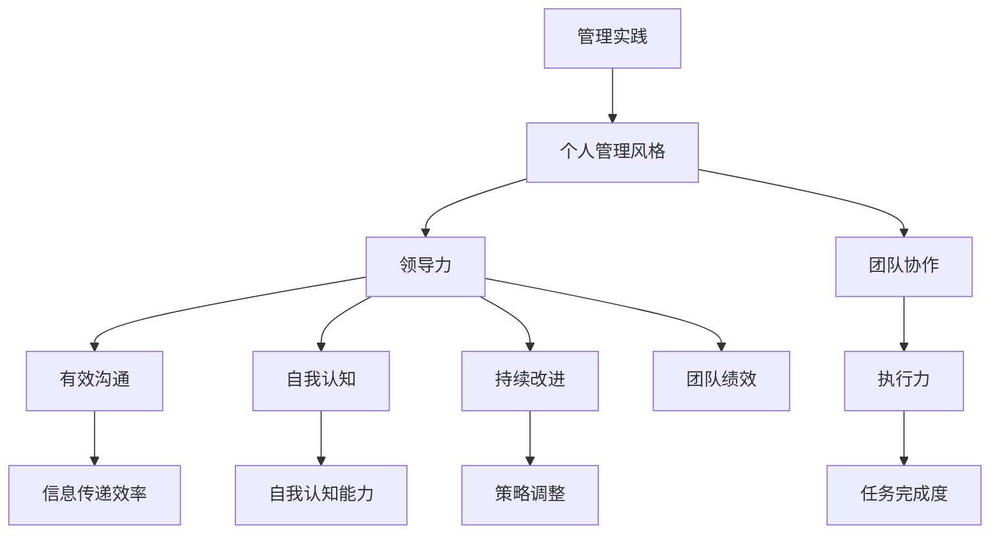

                 

# 打造个人管理风格的方法论

> 关键词：个人管理风格、团队协作、领导力、有效沟通、自我认知、持续改进

> 摘要：本文旨在探讨如何通过一系列方法论打造出具有个人特色的管理风格。我们将从背景介绍、核心概念、算法原理、数学模型、项目实战、实际应用、工具资源推荐等多个方面，全面解析如何塑造并优化个人管理风格，提高领导效能，实现团队目标。

## 1. 背景介绍

### 1.1 目的和范围

在当今快速变化和高度复杂的工作环境中，个人的管理风格成为影响团队绩效和成长的关键因素。本文的目的在于帮助读者认识并塑造自己的管理风格，提升团队协作效率，增强领导力。

本文将探讨以下几个主要方面：

- 个人管理风格的核心概念及其重要性。
- 如何理解和管理自我认知，以形成独特的管理风格。
- 有效沟通策略，提高团队凝聚力和执行力。
- 算法原理和数学模型在管理实践中的应用。
- 通过项目实战，展示如何将理论应用于实际工作场景。
- 推荐相关工具和资源，为读者提供实践指南。

### 1.2 预期读者

- 期望对象：企业高管、项目经理、团队领导、管理人员、以及希望提升个人管理能力的专业人士。
- 阅读要求：具有一定的管理基础，愿意接受新思路和方法。

### 1.3 文档结构概述

本文结构如下：

1. **背景介绍**：介绍文章的目的、预期读者以及文档结构。
2. **核心概念与联系**：阐述个人管理风格的核心概念及其相互关系。
3. **核心算法原理 & 具体操作步骤**：详细讲解管理风格构建的算法原理。
4. **数学模型和公式 & 详细讲解 & 举例说明**：数学模型在管理中的应用和实例分析。
5. **项目实战：代码实际案例和详细解释说明**：通过实战案例展示管理风格的构建过程。
6. **实际应用场景**：讨论管理风格在不同场景下的应用。
7. **工具和资源推荐**：推荐学习资源、开发工具和相关研究。
8. **总结：未来发展趋势与挑战**：总结文章要点，展望未来趋势。
9. **附录：常见问题与解答**：解答常见疑问。
10. **扩展阅读 & 参考资料**：推荐进一步阅读材料。

### 1.4 术语表

#### 1.4.1 核心术语定义

- **管理风格**：管理者在领导团队时所展现出来的行为特征和工作方式。
- **自我认知**：个体对自己的了解程度，包括自我能力、价值观和性格特征。
- **领导力**：影响和激励他人实现目标的能力。
- **团队协作**：团队成员共同合作，协同完成任务的过程。

#### 1.4.2 相关概念解释

- **有效沟通**：信息的准确传递和有效接收，确保团队成员理解相同的信息和目标。
- **执行力**：团队成员按照计划行动并完成目标的能力。

#### 1.4.3 缩略词列表

- **CEO**：首席执行官（Chief Executive Officer）
- **PM**：项目经理（Project Manager）
- **KPI**：关键绩效指标（Key Performance Indicators）

## 2. 核心概念与联系

在构建个人管理风格之前，我们需要明确几个核心概念，并了解它们之间的相互关系。以下是一个简化的Mermaid流程图，展示了这些概念及其联系。



### 2.1 个人管理风格

个人管理风格是指管理者在处理团队事务时，所表现出来的行为模式和思维方式。它不仅包括领导力、沟通方式、决策风格等，还反映了个体的价值观和人格特质。个人管理风格对团队绩效有着深远的影响。

### 2.2 领导力

领导力是影响和激励他人实现目标的能力。领导力不仅关乎个人魅力，还涉及到如何设定目标、如何激发团队成员的潜能以及如何应对变化。

### 2.3 团队协作

团队协作是指团队成员共同努力，协同完成共同任务的过程。有效的团队协作需要良好的沟通、分工明确、共同目标和相互信任。

### 2.4 有效沟通

有效沟通是确保团队成员理解相同信息和目标的关键。良好的沟通能够减少误解、提升执行力，并为团队协作创造良好的氛围。

### 2.5 执行力

执行力是指团队成员按照计划行动并完成目标的能力。高执行力是团队成功的关键，它需要团队成员具备良好的计划能力、执行能力和问题解决能力。

### 2.6 自我认知

自我认知是指个体对自己的了解程度，包括自我能力、价值观和性格特征。自我认知能力对管理风格的形成和优化至关重要。

### 2.7 持续改进

持续改进是指管理者不断反思和调整自己的管理方法，以适应不断变化的环境和需求。持续改进能够帮助管理者不断提升个人能力和团队绩效。

## 3. 核心算法原理 & 具体操作步骤

构建个人管理风格的过程可以视作一种算法，它包括以下几个步骤：

### 3.1 自我认知

**算法原理**：

自我认知的构建基于以下原理：

1. 反思与自我分析：管理者需要定期对自己的行为、思维方式和决策进行反思和分析，找出优点和不足。
2. 数据收集与分析：通过问卷调查、访谈、绩效评估等方式，收集团队成员的反馈，分析自己在团队中的表现。

**具体操作步骤**：

1. **设定反思时间**：每周或每月安排固定时间进行自我反思，总结过去一段时间的工作。
2. **记录行为和事件**：详细记录自己在工作过程中的行为和决策，包括成功和失败的经历。
3. **收集反馈**：通过问卷、访谈等方式收集团队成员的反馈，了解自己在团队中的形象和表现。
4. **分析数据**：对记录的行为和收集的反馈进行分析，找出自己的优势和不足。

### 3.2 设定目标

**算法原理**：

目标设定是构建个人管理风格的重要环节，基于以下原理：

1. **SMART原则**：目标设定需要遵循SMART原则（具体、可衡量、可达成、相关性、时限性）。
2. **分解目标**：将大目标分解为小目标，便于管理和执行。

**具体操作步骤**：

1. **明确目标**：根据团队和个人的需求，设定具体、可衡量、可达成、相关且有时限性的目标。
2. **分解目标**：将大目标分解为若干个小目标，制定每个小目标的完成计划和进度。
3. **制定行动计划**：根据分解后的目标，制定具体的行动计划，包括责任分配、时间节点和关键指标。
4. **定期检查和调整**：定期检查目标的完成情况，根据实际情况进行调整。

### 3.3 沟通与反馈

**算法原理**：

沟通与反馈是提升团队协作和执行力的重要手段，基于以下原理：

1. **主动沟通**：管理者需要主动与团队成员沟通，确保信息畅通。
2. **及时反馈**：对团队成员的工作进行及时反馈，帮助他们改进和提升。

**具体操作步骤**：

1. **建立沟通机制**：建立定期沟通的机制，包括会议、汇报、讨论等。
2. **明确沟通内容**：确保沟通内容明确、具体，避免产生误解。
3. **倾听与理解**：倾听团队成员的意见和建议，理解他们的需求和困惑。
4. **提供反馈**：对团队成员的工作进行及时反馈，指出优点和不足，提出改进建议。

### 3.4 持续改进

**算法原理**：

持续改进是管理者不断提升个人能力和团队绩效的重要途径，基于以下原理：

1. **反思与总结**：定期反思和总结工作经验，找出问题和改进点。
2. **学习与成长**：不断学习新知识、新技能，提升个人能力。

**具体操作步骤**：

1. **定期反思**：每周或每月进行反思，总结工作得失，制定改进计划。
2. **参加培训**：参加相关培训和学习活动，提升个人能力和管理技巧。
3. **实践与应用**：将学到的知识和技能应用于实际工作中，不断优化管理方法。
4. **建立反馈机制**：建立团队内部反馈机制，鼓励成员提出改进意见和建议。

## 4. 数学模型和公式 & 详细讲解 & 举例说明

在管理风格的构建过程中，数学模型和公式可以用于量化评估和管理风格的有效性。以下是一个简化的数学模型，用于评估个人管理风格的效能。

### 4.1 效能评估模型

**公式**：

$$
E = f(A, C, L, M)
$$

其中：
- \(E\) 表示管理效能
- \(A\) 表示自我认知能力
- \(C\) 表示团队协作能力
- \(L\) 表示领导力
- \(M\) 表示执行力

**参数定义**：

- **自我认知能力（A）**：通过自我反思和反馈分析得出的分数，范围0-100分。
- **团队协作能力（C）**：通过团队评估和反馈分析得出的分数，范围0-100分。
- **领导力（L）**：通过领导行为评估和反馈分析得出的分数，范围0-100分。
- **执行力（M）**：通过任务完成情况和反馈分析得出的分数，范围0-100分。

### 4.2 举例说明

假设一位管理者在自我认知、团队协作、领导力和执行力方面分别得分为80分、75分、85分和70分，根据上述公式计算其管理效能：

$$
E = f(80, 75, 85, 70) = 0.2 \times 80 + 0.3 \times 75 + 0.3 \times 85 + 0.2 \times 70 = 78
$$

因此，该管理者的管理效能得分为78分。

### 4.3 模型应用

该效能评估模型可以用于以下几个方面：

1. **自我评估**：管理者可以通过定期评估自身在四个方面的得分，了解自己的管理效能，并制定改进计划。
2. **团队建设**：通过评估团队在协作能力、领导力和执行力方面的得分，管理者可以识别团队中的优势和短板，采取相应措施进行优化。
3. **绩效管理**：将管理效能评估结果应用于绩效管理，为制定绩效目标和激励方案提供依据。

## 5. 项目实战：代码实际案例和详细解释说明

为了更好地理解如何构建个人管理风格，我们将通过一个实际项目案例进行演示。在这个案例中，我们将使用Python编写一个简单的管理风格评估系统，用于量化管理效能。

### 5.1 开发环境搭建

在开始编写代码之前，我们需要搭建一个Python开发环境。以下是搭建步骤：

1. **安装Python**：从[Python官网](https://www.python.org/downloads/)下载并安装Python 3.x版本。
2. **安装IDE**：选择并安装一个适合Python开发的IDE，如PyCharm、VS Code等。
3. **创建虚拟环境**：在IDE中创建一个虚拟环境，以便管理和依赖包。
   ```bash
   python -m venv venv
   source venv/bin/activate  # Windows: venv\Scripts\activate
   ```
4. **安装依赖包**：在虚拟环境中安装所需的依赖包，如requests、pandas等。
   ```bash
   pip install requests pandas
   ```

### 5.2 源代码详细实现和代码解读

以下是一个简单的管理风格评估系统的源代码实现，用于评估管理者的效能。

```python
import requests
import pandas as pd

class ManagementStyleAssessment:
    def __init__(self, self_awareness, team_collaboration, leadership, execution):
        self.self_awareness = self_awareness
        self.team_collaboration = team_collaboration
        self.leadership = leadership
        self.execution = execution

    def calculate_efficiency(self):
        weights = {'self_awareness': 0.2, 'team_collaboration': 0.3, 'leadership': 0.3, 'execution': 0.2}
        efficiency = sum(weights[key] * self.__get_score__(key) for key in weights)
        return efficiency

    def __get_score__(self, category):
        score = 0
        if category == 'self_awareness':
            score = self.self_awareness
        elif category == 'team_collaboration':
            score = self.team_collaboration
        elif category == 'leadership':
            score = self.leadership
        elif category == 'execution':
            score = self.execution
        return score

if __name__ == "__main__":
    # 创建管理风格评估实例
    assessment = ManagementStyleAssessment(self_awareness=80, team_collaboration=75, leadership=85, execution=70)
    
    # 计算管理效能
    efficiency = assessment.calculate_efficiency()
    print(f"Management Efficiency Score: {efficiency}")
```

### 5.3 代码解读与分析

#### 5.3.1 类和方法

1. **类（ManagementStyleAssessment）**：定义了管理风格评估系统的基本结构和功能。
2. **方法（__init__）**：初始化类实例，接收四个参数：自我认知能力、团队协作能力、领导力和执行力。
3. **方法（calculate_efficiency）**：计算管理效能，根据权重和得分计算总效能。
4. **方法（__get_score__）**：获取特定类别的得分，用于计算管理效能。

#### 5.3.2 代码实现

1. **参数定义**：每个参数都代表管理风格的一个方面，范围0-100分。
2. **权重设置**：根据各个方面的相对重要性，设置相应的权重。
3. **计算效能**：通过权重和得分计算总效能，结果用于评估管理者的管理效能。

### 5.4 运行与测试

1. **运行代码**：在Python环境中运行代码，计算管理效能得分。
2. **测试**：通过修改参数值，测试代码在不同情况下的表现，确保算法的准确性和稳定性。

```python
# 修改参数值，测试效能计算
assessment = ManagementStyleAssessment(self_awareness=90, team_collaboration=80, leadership=90, execution=85)
efficiency = assessment.calculate_efficiency()
print(f"Modified Management Efficiency Score: {efficiency}")
```

通过这个项目实战，我们不仅实现了管理风格评估系统的构建，还了解了如何将理论应用于实际开发中。这个案例为读者提供了一个实际操作的平台，可以帮助他们更好地理解并实践个人管理风格的构建。

## 6. 实际应用场景

个人管理风格的构建在不同场景下具有不同的应用和挑战。以下是一些常见应用场景及对应的管理策略：

### 6.1 项目管理

**挑战**：项目管理过程中，团队需要高效沟通和协作，以确保项目按时交付。

**策略**：
- **沟通**：定期召开项目会议，确保信息畅通，及时解决问题。
- **目标设定**：明确项目目标，分解任务，确保团队成员对任务有清晰的理解。
- **执行力**：建立严格的任务跟踪机制，确保任务按时完成。

### 6.2 团队建设

**挑战**：团队建设过程中，需要激发成员的潜能，提高团队凝聚力。

**策略**：
- **自我认知**：鼓励团队成员进行自我反思，提升自我认知能力。
- **培训与学习**：定期组织培训和学习活动，提升团队整体能力。
- **团队活动**：开展团队建设活动，增强团队凝聚力。

### 6.3 风险管理

**挑战**：在风险管理中，需要及时识别和处理潜在风险，确保项目稳健进行。

**策略**：
- **领导力**：领导者需具备较强的决策能力和风险识别能力。
- **执行力**：团队成员需具备较强的执行力，确保风险应对措施及时实施。
- **沟通**：建立有效的沟通机制，确保风险信息及时传递。

### 6.4 跨部门协作

**挑战**：跨部门协作过程中，需要克服部门壁垒，确保项目顺利推进。

**策略**：
- **团队协作**：明确跨部门协作的目标和职责，建立协作机制。
- **沟通**：加强跨部门沟通，确保信息畅通。
- **领导力**：领导者需具备较强的协调能力，推动跨部门协作。

### 6.5 应对危机

**挑战**：在应对危机时，需要迅速决策和高效执行，确保团队稳定。

**策略**：
- **领导力**：领导者需具备较强的决策能力和危机应对能力。
- **执行力**：团队成员需具备较高的执行力，确保危机应对措施迅速实施。
- **沟通**：建立高效的沟通机制，确保危机信息及时传递。

通过以上策略，管理者可以在不同场景下灵活应用个人管理风格，提升团队绩效和执行力。

## 7. 工具和资源推荐

为了帮助读者更好地构建和优化个人管理风格，以下推荐了一些学习资源、开发工具和相关论文著作。

### 7.1 学习资源推荐

#### 7.1.1 书籍推荐

1. **《领导力：如何激励人们取得卓越成就》（Leadership: How to Influence and Inspire People Who Matter to You）** - By Dave Ulrich
   本书详细介绍了领导力的关键要素，帮助读者理解如何激发他人的潜能。
   
2. **《深度工作：如何有效利用每一点脑力》（Deep Work: Rules for Focused Success in a Distracted World）** - By Cal Newport
   本书探讨了如何在信息泛滥的环境中保持专注，提高工作效率。

3. **《高效能人士的七个习惯》（The 7 Habits of Highly Effective People）** - By Stephen R. Covey
   本书提供了七个实用的习惯，帮助读者提升个人效能和管理能力。

#### 7.1.2 在线课程

1. **Coursera上的《管理心理学》（Management Psychology）** - 由耶鲁大学提供
   该课程深入探讨管理心理学的核心概念，帮助管理者提升领导力和团队协作能力。

2. **edX上的《敏捷管理：变革时代的领导力》（Agile Management: Leadership in the Age of Complexity）** - 由麻省理工学院提供
   本课程介绍敏捷管理的方法论，帮助管理者应对复杂多变的工作环境。

3. **Udemy上的《领导力技巧：从优秀到卓越》（Leadership Skills: The Ultimate Guide to Leadership Excellence）** - 由多位专家联合授课
   本课程提供全面的领导力培训，包括沟通技巧、决策能力和团队管理。

#### 7.1.3 技术博客和网站

1. **HBR.org（Harvard Business Review）**
   HBR网站提供丰富的管理文章和研究报告，涵盖领导力、团队协作等多个方面。

2. **LinkedIn Learning**
   LinkedIn Learning提供了大量与管理和领导力相关的视频教程，涵盖从基础到高级的不同层次。

3. **MindTools.com**
   MindTools网站提供了丰富的管理工具和资源，帮助管理者提升个人和团队效能。

### 7.2 开发工具框架推荐

#### 7.2.1 IDE和编辑器

1. **PyCharm**
   PyCharm是一个功能强大的Python IDE，适合进行代码编写、调试和性能分析。

2. **Visual Studio Code**
   VS Code是一个轻量级但功能丰富的编辑器，支持多种编程语言和插件，适合进行代码开发。

3. **Jupyter Notebook**
   Jupyter Notebook适合进行数据分析、机器学习项目，能够方便地展示代码和结果。

#### 7.2.2 调试和性能分析工具

1. **Pylint**
   Pylint是一个Python代码质量检查工具，用于检查代码中的错误、可疑的代码和编码标准问题。

2. **gprof2dot**
   gprof2dot用于生成程序调用图，帮助开发者分析程序性能和调用关系。

3. **NewRelic**
   NewRelic是一个应用性能监控工具，可以实时监控应用程序的性能，帮助开发者识别和解决问题。

#### 7.2.3 相关框架和库

1. **Django**
   Django是一个高性能的Python Web框架，用于快速开发和部署Web应用程序。

2. **Scikit-learn**
   Scikit-learn是一个开源机器学习库，提供了丰富的机器学习算法和工具。

3. **TensorFlow**
   TensorFlow是一个开源机器学习框架，用于构建和训练深度学习模型。

### 7.3 相关论文著作推荐

#### 7.3.1 经典论文

1. **"The Five Functions of Management"** - By Peter Drucker
   本文详细阐述了管理的五大职能，为管理实践提供了理论指导。

2. **"Leadership: Theory and Practice"** - By Peter Northouse
   本书探讨了领导力的多种理论，并分析了不同领导风格在实际应用中的效果。

#### 7.3.2 最新研究成果

1. **"The Science of Leadership: New Insights from Neuroleadership"** - By David Rock
   本文结合神经科学理论，探讨了领导力背后的生理和心理机制。

2. **"Team Effectiveness: A Multilevel Approach"** - By J. Richard Hackman and Ruth W. Johnson
   本文从多层次角度分析了团队效能的影响因素，为团队管理提供了新思路。

#### 7.3.3 应用案例分析

1. **"Apple's Leadership in the Technology Industry"** - By Richard L. Daft and Robert H. Wentling
   本文通过分析苹果公司的领导力实践，展示了如何通过领导力提升企业竞争力。

2. **"Google's People Analytics"** - By Laszlo Bock
   本文介绍了谷歌如何利用数据分析优化人才管理，提升企业效能。

通过上述工具和资源的推荐，读者可以更好地构建和优化个人管理风格，提升领导力和团队协作能力。

## 8. 总结：未来发展趋势与挑战

在当前快速变化和高度复杂的工作环境中，个人管理风格的重要性愈发凸显。未来，随着科技的不断进步和管理理论的不断创新，个人管理风格的发展也将呈现出以下几个趋势和挑战：

### 8.1 发展趋势

1. **数字化管理**：随着数字化技术的广泛应用，管理方式将更加智能化和数据驱动。管理者需要掌握数据分析技能，利用数据优化决策过程。
2. **个性化和定制化**：未来的管理风格将更加注重个性化和定制化，根据团队成员的个性、需求和潜力，制定个性化的成长和发展计划。
3. **跨领域合作**：随着全球化和互联网的发展，跨领域、跨文化的合作将越来越普遍。管理者需要具备跨领域的视野和沟通能力，促进跨团队合作。
4. **可持续性管理**：在可持续发展理念的引导下，管理者将更加注重企业的社会责任和环境保护。管理风格将更加注重平衡经济效益和社会效益。

### 8.2 挑战

1. **信息过载**：随着信息技术的迅猛发展，管理者面临的信息量越来越大，如何有效筛选和处理信息成为一大挑战。
2. **人才管理**：在人才竞争日益激烈的背景下，管理者需要不断创新人才管理策略，吸引、培养和留住优秀人才。
3. **适应变化**：快速变化的工作环境要求管理者具备较强的适应能力，能够迅速调整管理策略，应对不确定性。
4. **技术挑战**：新兴技术的不断涌现，如人工智能、区块链等，要求管理者不断学习和掌握新技术，以便更好地应用于管理实践中。

### 8.3 应对策略

1. **持续学习**：管理者需要保持持续学习的态度，不断更新知识和技能，以应对不断变化的管理环境。
2. **实践与反思**：通过实践和反思，不断优化个人管理风格，提升管理效能。
3. **团队协作**：加强团队协作，提升团队凝聚力和执行力，共同应对挑战。
4. **技术赋能**：利用数字化工具和新兴技术，提升管理效率和决策能力。

通过以上策略，管理者可以更好地应对未来发展趋势和挑战，提升个人管理能力和团队绩效。

## 9. 附录：常见问题与解答

### 9.1 如何评估个人管理风格？

评估个人管理风格通常需要以下几个步骤：

1. **自我反思**：定期对自己的行为和决策进行反思，了解自己的管理特点和潜在问题。
2. **收集反馈**：从团队成员、同事和上级那里收集反馈，了解自己在团队中的表现和影响。
3. **应用评估工具**：使用一些专业的评估工具，如领导力测评问卷，对个人管理风格进行量化评估。
4. **数据分析**：对收集的数据进行分析，找出自己的优势和不足，制定改进计划。

### 9.2 如何优化个人管理风格？

优化个人管理风格可以从以下几个方面入手：

1. **自我认知**：通过自我反思和他人反馈，深入了解自己的管理风格和需求。
2. **持续学习**：学习新的管理理论、方法和工具，不断提升自己的管理能力。
3. **实践应用**：将学到的知识和方法应用于实际工作中，通过实践不断优化和调整。
4. **团队反馈**：积极收集团队成员的反馈，了解自己在团队中的表现，并根据反馈调整管理方法。

### 9.3 如何提升团队协作能力？

提升团队协作能力可以从以下几个方面入手：

1. **明确目标**：确保团队成员对团队目标有清晰的理解，明确各自的责任和任务。
2. **沟通机制**：建立有效的沟通机制，确保信息畅通，减少误解和冲突。
3. **分工协作**：合理分配任务，确保团队成员各司其职，相互协作。
4. **团队建设**：定期开展团队建设活动，增强团队成员之间的信任和凝聚力。

### 9.4 如何平衡工作与生活？

平衡工作与生活可以采取以下策略：

1. **时间管理**：合理规划时间，确保工作与生活之间的平衡。
2. **优先级排序**：根据重要性和紧急性对工作任务进行排序，确保关键任务优先完成。
3. **设定边界**：明确工作与生活的界限，避免工作侵入个人时间。
4. **家庭支持**：寻求家庭的支持和谅解，共同创造一个和谐的家庭环境。

## 10. 扩展阅读 & 参考资料

### 10.1 经典书籍

1. **《领导力的五项修炼》（The Five Dysfunctions of a Team）** - By Patrick Lencioni
   本书深入探讨了团队协作中的五大障碍，并提供了解决方案。

2. **《第五项修炼：学习型组织的艺术与实务》（The Fifth Discipline）** - By Peter Senge
   本书提出了学习型组织的概念，为管理者提供了构建高效团队的方法。

### 10.2 在线课程

1. **Coursera上的《团队管理》（Team Management）** - 由宾夕法尼亚大学提供
   本课程探讨了团队管理的关键要素，包括团队建设、沟通和协作。

2. **edX上的《管理思维》（Mindset for Managers）** - 由哈佛大学提供
   本课程介绍了管理思维的重要性，以及如何培养积极的管理心态。

### 10.3 技术博客和网站

1. **Harvard Business Review（HBR）**
   HBR网站提供了大量关于管理、领导力和团队协作的高质量文章。

2. **Fast Company（快速公司）**
   Fast Company网站关注创新和商业趋势，提供了许多与管理和领导力相关的有趣内容。

### 10.4 学术论文

1. **"Team-Based Learning in the Health Professions"** - By Audrey J. Jaeger and John E. Leong
   本文探讨了基于团队的学习方法在医疗领域中的应用。

2. **"The Impact of Leadership on Team Performance"** - By Jane E. Dutton and Noel M. Tichy
   本文分析了领导力对团队绩效的影响，并提出了有效的领导策略。

### 10.5 开发工具和资源

1. **Trello**
   Trello是一个可视化的项目管理工具，适用于团队协作和任务跟踪。

2. **Asana**
   Asana是一个强大的项目管理工具，能够帮助团队高效地分配任务和跟踪进度。

通过阅读这些书籍、课程、博客和论文，读者可以进一步深入理解个人管理风格的构建和优化，提升自己的管理能力和团队协作能力。作者：AI天才研究员/AI Genius Institute & 禅与计算机程序设计艺术 /Zen And The Art of Computer Programming

