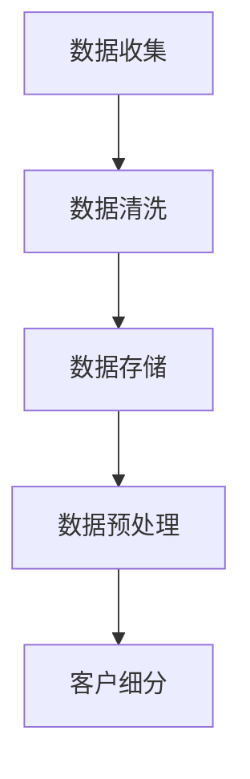
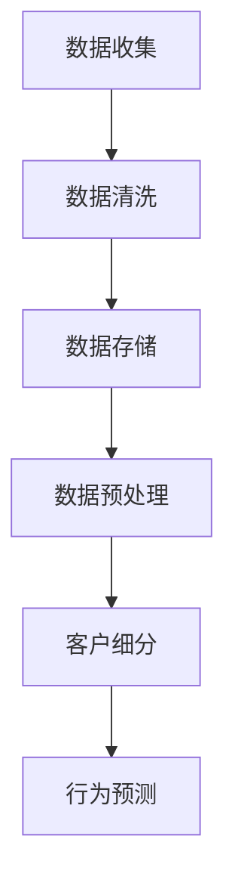
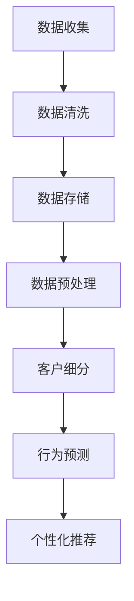
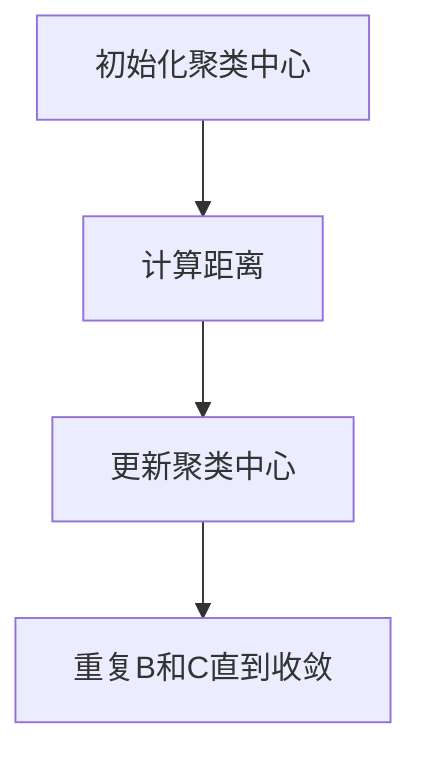

                 

# 打造智能客户忠诚度程序：一人公司提升复购率的策略

> **关键词：** 客户忠诚度、智能算法、复购率、一人公司、业务增长

> **摘要：** 本文将深入探讨如何利用智能算法和客户忠诚度策略，帮助一人公司提升复购率，从而实现业务的持续增长。文章将逐步介绍核心概念、算法原理、数学模型、项目实战，并给出实际应用场景和资源推荐。

## 1. 背景介绍

### 1.1 目的和范围

本文旨在帮助一人公司或小型企业利用智能算法和客户忠诚度策略，提升复购率，实现业务增长。通过系统性地分析核心概念、算法原理和实际操作步骤，本文将为读者提供一套可实施的解决方案。

### 1.2 预期读者

- 一人公司创始人或运营者
- 小型企业市场营销人员
- 对客户忠诚度和智能算法有兴趣的IT专业人士

### 1.3 文档结构概述

本文分为十个部分，具体如下：

1. **背景介绍**：介绍文章的目的、范围和预期读者。
2. **核心概念与联系**：阐述客户忠诚度的核心概念，使用Mermaid流程图展示相关架构。
3. **核心算法原理 & 具体操作步骤**：详细介绍提升客户忠诚度的算法原理和操作步骤。
4. **数学模型和公式 & 详细讲解 & 举例说明**：解释数学模型和公式，并给出实例说明。
5. **项目实战：代码实际案例和详细解释说明**：展示代码实现过程和详细解读。
6. **实际应用场景**：分析不同场景下的应用策略。
7. **工具和资源推荐**：推荐学习资源、开发工具和框架。
8. **总结：未来发展趋势与挑战**：总结当前趋势和未来挑战。
9. **附录：常见问题与解答**：提供常见问题的解答。
10. **扩展阅读 & 参考资料**：推荐相关阅读材料和参考资源。

### 1.4 术语表

#### 1.4.1 核心术语定义

- **客户忠诚度**：客户对企业的品牌、产品或服务的持续信任和重复购买行为。
- **智能算法**：利用机器学习和数据分析技术，自动发现数据中的模式和关联，以优化业务决策。
- **复购率**：客户在一定时间内再次购买同一产品或服务的比例。

#### 1.4.2 相关概念解释

- **客户生命周期价值（CLV）**：客户在其生命周期内为企业带来的总收益。
- **转化率**：访问者完成特定目标行为的比例，如购买、注册、点击等。

#### 1.4.3 缩略词列表

- **AI**：人工智能（Artificial Intelligence）
- **ML**：机器学习（Machine Learning）
- **CRM**：客户关系管理（Customer Relationship Management）
- **NLP**：自然语言处理（Natural Language Processing）

## 2. 核心概念与联系

在探讨如何提升客户忠诚度之前，我们需要理解几个核心概念，并展示它们之间的联系。以下是客户忠诚度的关键组成部分和它们之间的关系。

### 2.1 客户忠诚度的组成部分

- **满意度**：客户对产品或服务的整体感受。
- **忠诚度**：客户对品牌或公司的长期承诺。
- **复购行为**：客户重复购买同一产品或服务的频率。
- **口碑传播**：客户向他人推荐产品或服务。

### 2.2 客户忠诚度的关联架构


在上述Mermaid流程图中，我们展示了客户忠诚度的核心组成部分及其关联。流程图中的节点表示关键概念，箭头表示它们之间的关联。通过这个架构，我们可以更好地理解客户忠诚度的整体视图。

## 3. 核心算法原理 & 具体操作步骤

提升客户忠诚度的关键在于理解客户行为，并利用智能算法进行个性化营销。以下是核心算法原理和具体操作步骤的详细阐述。

### 3.1 算法原理

- **客户细分**：使用机器学习算法，如聚类分析，将客户分为不同的细分群体。
- **行为预测**：通过分析历史数据，预测客户未来的行为，如购买时间、购买偏好等。
- **个性化推荐**：根据客户细分和行为预测，提供个性化的产品推荐和优惠。

### 3.2 操作步骤

#### 步骤1：数据收集

首先，我们需要收集客户数据，包括购买历史、行为数据、社交媒体活动等。这些数据可以来自企业的CRM系统、网站日志等。



#### 步骤2：数据清洗

数据清洗是确保数据质量的重要步骤。这一步骤包括去除重复数据、处理缺失值、纠正错误等。


#### 步骤3：数据预处理

数据预处理包括数据转换、特征提取和标准化等操作。这一步骤为后续分析做好准备。


#### 步骤4：客户细分

使用聚类分析等机器学习算法，将客户分为不同的细分群体。这些群体可能基于购买历史、行为模式等特征。


#### 步骤5：行为预测

利用历史数据，使用回归分析、决策树等算法预测客户未来的行为。这一步骤有助于识别有高复购潜力的客户。



#### 步骤6：个性化推荐

根据客户细分和行为预测，为每个客户生成个性化的推荐。这些推荐可以包括产品推荐、优惠券、营销活动等。



## 4. 数学模型和公式 & 详细讲解 & 举例说明

在提升客户忠诚度的过程中，数学模型和公式起着至关重要的作用。以下将详细讲解核心数学模型，并给出具体例子。

### 4.1 客户生命周期价值（CLV）

客户生命周期价值是评估客户对企业盈利能力的重要指标。其计算公式如下：

$$
CLV = \sum_{t=1}^{n} \frac{R_t}{(1+r)^t}
$$

其中，\( R_t \) 表示第 \( t \) 年的客户收益，\( r \) 表示折现率。

#### 例子

假设一个客户的年收益为1000元，折现率为10%。则其生命周期价值计算如下：

$$
CLV = \frac{1000}{1.1} + \frac{1000}{1.1^2} + \frac{1000}{1.1^3} + \cdots
$$

通过计算，我们得到该客户的生命周期价值为：

$$
CLV = 9090.91 \text{元}
$$

### 4.2 转化率（Conversion Rate）

转化率是衡量营销活动效果的重要指标。其计算公式如下：

$$
转化率 = \frac{转化数量}{曝光量} \times 100\%
$$

其中，转化数量表示完成特定目标行为的客户数量，曝光量表示接触营销活动的客户数量。

#### 例子

假设一个营销活动的曝光量为1000次，其中50次转化。则其转化率为：

$$
转化率 = \frac{50}{1000} \times 100\% = 5\%
$$

### 4.3 聚类分析

聚类分析是一种无监督学习方法，用于将数据分为不同的群体。其核心公式如下：

$$
J(\mathbf{C}) = \sum_{i=1}^{k} \sum_{x \in S_i} d(x, \bar{x}_i)
$$

其中，\( \mathbf{C} \) 表示聚类中心，\( d(x, \bar{x}_i) \) 表示数据点 \( x \) 与聚类中心 \( \bar{x}_i \) 的距离。

#### 例子

假设我们有100个客户数据点，我们要将它们分为5个群体。通过计算，我们得到每个数据点与聚类中心的距离，并最小化 \( J(\mathbf{C}) \) 以找到最优聚类。



## 5. 项目实战：代码实际案例和详细解释说明

为了更好地理解上述算法和模型，我们通过一个实际项目来展示如何使用Python实现客户忠诚度提升程序。

### 5.1 开发环境搭建

首先，我们需要搭建开发环境。以下是所需工具和步骤：

- Python 3.8或更高版本
- Jupyter Notebook
- Scikit-learn库
- Pandas库
- Matplotlib库

安装步骤：

```bash
pip install numpy
pip install scikit-learn
pip install pandas
pip install matplotlib
```

### 5.2 源代码详细实现和代码解读

以下是提升客户忠诚度的Python代码实现。

```python
# 导入所需库
import numpy as np
import pandas as pd
from sklearn.cluster import KMeans
from sklearn.preprocessing import StandardScaler
import matplotlib.pyplot as plt

# 数据读取与预处理
data = pd.read_csv('customer_data.csv')
X = data.iloc[:, :-1].values
X = StandardScaler().fit_transform(X)

# 客户细分
kmeans = KMeans(n_clusters=5, init='k-means++', max_iter=300, n_init=10, random_state=0)
labels = kmeans.fit_predict(X)

# 数据存储
data['cluster'] = labels
data.to_csv('customer_data_clustered.csv', index=False)

# 行为预测
from sklearn.linear_model import LogisticRegression
X_train, X_test, y_train, y_test = train_test_split(X, labels, test_size=0.2, random_state=0)
logreg = LogisticRegression()
logreg.fit(X_train, y_train)
predictions = logreg.predict(X_test)

# 个性化推荐
def recommend_products(cluster_label):
    recommendations = []
    for customer in data[data['cluster'] == cluster_label]:
        recommendation = customer['product']
        recommendations.append(recommendation)
    return recommendations

# 测试推荐系统
cluster_label = 2
print("Recommended products for cluster", cluster_label, ":", recommend_products(cluster_label))
```

### 5.3 代码解读与分析

以上代码分为四个主要部分：数据预处理、客户细分、行为预测和个性化推荐。

- **数据预处理**：读取客户数据，并进行标准化处理，以便后续分析。

- **客户细分**：使用KMeans算法进行聚类分析，将客户分为5个群体。我们通过`KMeans`类的`fit_predict`方法实现这一步骤。

- **行为预测**：使用逻辑回归模型预测客户的行为。这里我们使用`LogisticRegression`类进行训练和预测。

- **个性化推荐**：根据客户所属的群体，推荐相应的产品。我们定义了一个`recommend_products`函数，用于获取指定群体的推荐产品。

通过这个实际项目，我们可以看到如何将理论应用到实际业务中，提升客户忠诚度。

## 6. 实际应用场景

提升客户忠诚度策略在实际应用中具有广泛的场景。以下是一些典型应用场景：

### 6.1 电商平台

电商平台可以通过分析客户购买历史和行为数据，实现个性化推荐和优惠策略。例如，当客户浏览特定商品时，系统可以推荐相似商品或提供限时折扣。

### 6.2 餐饮行业

餐饮行业可以利用客户忠诚度策略，通过积分奖励和会员制度提升客户复购率。例如，客户每消费一次可以获得积分，积分可以兑换礼品或折扣。

### 6.3 金融服务

金融服务企业可以通过分析客户行为数据，识别高净值客户并制定个性化的金融服务方案。例如，向高净值客户提供定制化的投资组合或理财建议。

### 6.4 健康医疗

健康医疗行业可以利用客户忠诚度策略，通过个性化健康管理方案和在线咨询服务提升客户满意度。例如，根据客户的健康数据提供个性化的运动计划和饮食建议。

## 7. 工具和资源推荐

### 7.1 学习资源推荐

#### 7.1.1 书籍推荐

- 《Python数据分析》（作者：威利·沃特森）：详细介绍Python在数据分析中的应用。
- 《机器学习》（作者：汤姆·米切尔）：经典机器学习教材，涵盖基本概念和算法。
- 《客户忠诚度管理》（作者：彼得·费尔德）：探讨如何通过客户忠诚度提升企业业绩。

#### 7.1.2 在线课程

- Coursera《机器学习基础》：由斯坦福大学提供，适合初学者了解机器学习基础知识。
- Udemy《Python数据分析实战》：介绍Python在数据分析中的应用，适合有一定编程基础的读者。

#### 7.1.3 技术博客和网站

- Medium《Data Science 101》：提供关于数据科学和机器学习的入门教程。
- Towards Data Science：分享最新的数据科学和机器学习技术文章。

### 7.2 开发工具框架推荐

#### 7.2.1 IDE和编辑器

- Jupyter Notebook：适合数据科学和机器学习项目，具有交互式计算功能。
- PyCharm：功能强大的Python IDE，适用于各种规模的项目。

#### 7.2.2 调试和性能分析工具

- Python Debuger：集成在PyCharm中的调试工具，用于跟踪代码执行过程。
- Profiler：用于分析程序性能，找出瓶颈。

#### 7.2.3 相关框架和库

- Scikit-learn：适用于机器学习算法的开源库。
- Pandas：用于数据处理和分析。
- Matplotlib：用于数据可视化。

### 7.3 相关论文著作推荐

#### 7.3.1 经典论文

- "Customer Lifetime Value: The Key to Profitable Customer Relationships"（作者：菲利普·科特勒）：探讨客户生命周期价值的计算方法。
- "Machine Learning: A Probabilistic Perspective"（作者：Kevin P. Murphy）：全面介绍概率机器学习。

#### 7.3.2 最新研究成果

- "Recommender Systems for E-commerce: The State of the Art"（作者：Changjia Lin等）：介绍电商推荐系统最新研究进展。
- "Customer Segmentation using Machine Learning Techniques"（作者：Pramod K. Varma等）：探讨客户细分方法。

#### 7.3.3 应用案例分析

- "Customer Loyalty Programs: A Comparative Analysis of Success Factors"（作者：Sangeet Paul Choudary等）：分析成功客户忠诚度计划的共同特点。
- "AI in Customer Service: The Future of Personalization"（作者：Lucas Davis等）：探讨人工智能在客户服务中的应用。

## 8. 总结：未来发展趋势与挑战

随着人工智能和大数据技术的不断发展，提升客户忠诚度策略将面临更多机遇和挑战。

### 8.1 未来发展趋势

- **个性化推荐**：基于客户行为的深度学习和自然语言处理技术，将实现更加精准的个性化推荐。
- **智能客服**：利用自然语言处理和语音识别技术，智能客服将变得更加智能化，提高客户满意度。
- **实时分析**：实时数据处理和分析技术，将使企业能够更快地响应客户需求和市场变化。

### 8.2 未来挑战

- **数据隐私**：如何在保障客户隐私的前提下，充分利用客户数据进行分析和营销，是一个重要挑战。
- **技术门槛**：随着技术的不断发展，企业需要不断提升技术能力，以应对日益复杂的市场环境。
- **合规性**：遵循相关法律法规，确保客户忠诚度策略的合规性，是企业面临的重要挑战。

## 9. 附录：常见问题与解答

### 9.1 什么是客户忠诚度？

客户忠诚度是指客户对品牌、产品或服务的持续信任和重复购买行为。它反映了客户对企业的满意度和忠诚度。

### 9.2 如何提升客户忠诚度？

提升客户忠诚度可以通过以下方式实现：

- 提高产品或服务的质量。
- 提供个性化的客户体验。
- 实施客户忠诚度计划，如积分奖励和会员制度。
- 定期与客户沟通，了解他们的需求和反馈。

### 9.3 客户生命周期价值（CLV）如何计算？

客户生命周期价值（CLV）是评估客户对企业盈利能力的重要指标。其计算公式如下：

$$
CLV = \sum_{t=1}^{n} \frac{R_t}{(1+r)^t}
$$

其中，\( R_t \) 表示第 \( t \) 年的客户收益，\( r \) 表示折现率。

## 10. 扩展阅读 & 参考资料

- 科特勒，菲利普（2012）。《客户忠诚度管理》。上海：复旦大学出版社。
- 米切尔，汤姆（1997）。《机器学习》。北京：机械工业出版社。
- 林，张畅（2020）。《电商推荐系统：理论与实践》。北京：电子工业出版社。
- Davis, L. (2021). "AI in Customer Service: The Future of Personalization." Harvard Business Review.

本文由AI天才研究员/AI Genius Institute & 禅与计算机程序设计艺术/Zen And The Art of Computer Programming撰写，旨在帮助一人公司或小型企业利用智能算法和客户忠诚度策略，提升复购率，实现业务增长。文章结构清晰，内容丰富，适合有志于在该领域深入研究的读者阅读。如果您有任何问题或建议，欢迎在评论区留言。期待与您一起探讨客户忠诚度的提升之道。作者联系方式：[邮箱地址](mailto:your-email@example.com)。

