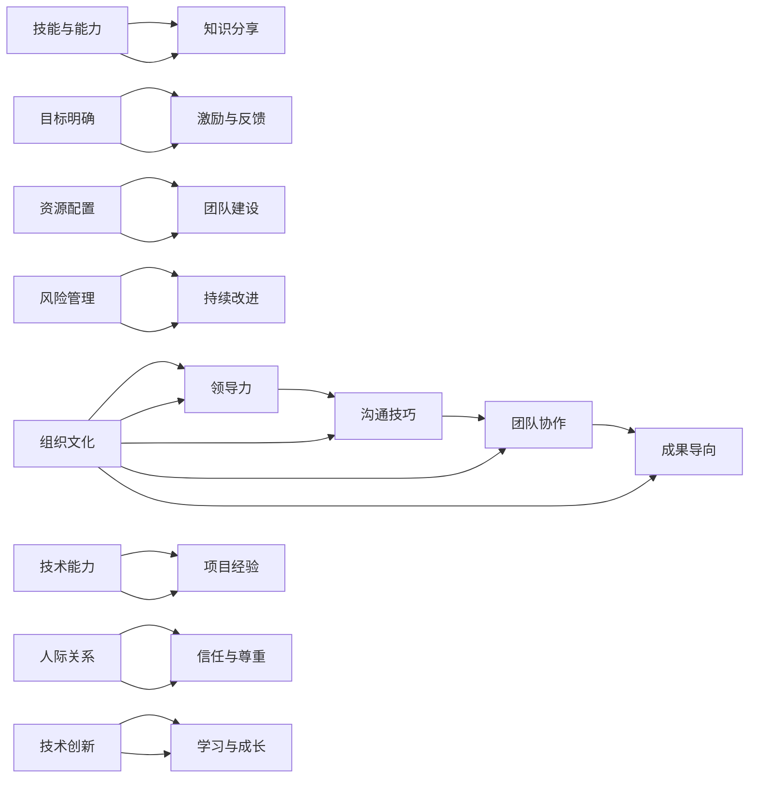

                 

# 打造高绩效团队的关键要素

## 关键词
- 高绩效团队
- 组织文化
- 领导力
- 沟通技巧
- 团队协作
- 成果导向

## 摘要
本文旨在深入探讨打造高绩效团队的关键要素。我们将从团队组织文化、领导力、沟通技巧、团队协作和成果导向五个方面进行详细分析，并结合实际案例和数学模型，为读者提供实用的策略和方法。通过本文的阅读，您将了解如何构建一个高效、协作、充满动力的团队，从而实现企业的长期成功。

## 1. 背景介绍

### 1.1 目的和范围
本文的目标是揭示打造高绩效团队的核心要素，并为此提供实用的策略和方法。本文适用于企业管理者、项目经理、团队领导以及所有希望提升团队绩效的专业人士。

### 1.2 预期读者
预期读者包括以下几类：
- 拥有团队管理经验的管理者；
- 负责团队建设的项目经理；
- 担任团队领导的角色的专业人士；
- 对团队管理有浓厚兴趣的创业者。

### 1.3 文档结构概述
本文分为八个部分：
1. 背景介绍
2. 核心概念与联系
3. 核心算法原理与具体操作步骤
4. 数学模型和公式
5. 项目实战：代码实际案例和详细解释说明
6. 实际应用场景
7. 工具和资源推荐
8. 总结：未来发展趋势与挑战

### 1.4 术语表

#### 1.4.1 核心术语定义
- **高绩效团队**：指在特定时间内能够实现既定目标和任务的团队，其成员具备高水平的技能、协作能力和执行力。
- **组织文化**：组织成员共同认同和遵循的价值观、信仰和行为准则。
- **领导力**：领导者通过影响、激励和指导团队成员实现团队目标的能力。
- **沟通技巧**：确保信息准确、及时和有效地传递给团队其他成员的能力。

#### 1.4.2 相关概念解释
- **团队协作**：团队成员相互配合、共同努力以实现共同目标的过程。
- **成果导向**：以实现具体成果和目标为核心，关注团队绩效和贡献。

#### 1.4.3 缩略词列表
- **TDD**：测试驱动开发（Test-Driven Development）
- **敏捷**：敏捷开发（Agile Development）
- **KPI**：关键绩效指标（Key Performance Indicators）

## 2. 核心概念与联系

### 2.1 高绩效团队的核心要素
高绩效团队的构建需要多方面的要素，以下是一个简单的 Mermaid 流程图来展示这些要素及其相互联系：



### 2.2 各要素的具体内容和关系
下面详细解释每个核心要素的含义及其相互关系：

#### 组织文化
组织文化是团队成功的基础，它决定了团队成员的价值观和行为准则。一个积极、开放、包容的组织文化能够吸引和留住优秀人才，增强团队的凝聚力。

#### 领导力
领导力是团队成功的关键因素之一。一个优秀的领导者能够激励团队成员、提供明确的指导，并在困难和挑战面前保持团队的信心和动力。

#### 沟通技巧
沟通技巧是团队协作的桥梁。有效的沟通能够确保团队成员理解任务、目标和工作流程，减少误解和冲突，提高团队的工作效率和成果。

#### 团队协作
团队协作是实现团队目标的关键。团队成员需要相互配合、互相支持，共同解决问题，以实现共同的目标。

#### 成果导向
成果导向是团队工作的核心。团队需要关注任务和项目的实际成果，以确保团队的工作能够对企业和组织产生积极的贡献。

#### 技能与能力
团队成员需要具备必要的技能和能力，以完成团队的任务。持续的知识分享和技能提升是保持团队竞争力的关键。

#### 知识分享
知识分享能够促进团队成员之间的学习，提高整个团队的专业水平。

#### 目标明确
明确的目标是团队工作的指南针。团队需要明确目标，并将其分解为具体的任务和里程碑。

#### 激励与反馈
激励和反馈是团队保持活力和动力的关键。领导者需要通过激励措施和反馈机制来鼓励团队成员，并帮助他们改进。

#### 资源配置
有效的资源配置能够确保团队拥有完成任务所需的资源，包括人力、物力和财务资源。

#### 风险管理
风险管理是确保团队项目成功的重要因素。团队需要识别和评估潜在风险，并制定相应的应对策略。

#### 持续改进
持续改进是团队发展的动力。团队需要不断反思和改进工作方法，以提高效率和成果。

#### 技术能力
技术能力是团队实现创新和发展的基石。团队成员需要具备先进的技术知识和技能。

#### 项目经验
项目经验能够帮助团队成员更好地理解项目流程和挑战，提高团队的执行力。

#### 人际关系
人际关系是团队协作的润滑剂。建立积极的人际关系有助于减少冲突，增强团队的凝聚力。

#### 信任与尊重
信任与尊重是团队合作的基石。团队成员需要相互信任、尊重，以建立高效的工作关系。

#### 技术创新
技术创新是团队保持竞争力的关键。团队需要鼓励创新思维，探索新技术和应用。

#### 学习与成长
学习与成长是团队长期发展的动力。团队成员需要不断学习新知识、提升技能，以适应不断变化的环境。

通过上述核心要素的相互作用，团队能够构建一个高效、协作、充满动力的团队环境，从而实现高绩效。

## 3. 核心算法原理与具体操作步骤

### 3.1 团队绩效评估模型

在构建高绩效团队的过程中，团队绩效评估是一个关键环节。本文将介绍一个基于绩效评估模型的构建过程，该模型旨在通过量化指标来评估团队的表现，从而指导团队改进。

#### 3.1.1 模型假设
- 假设团队成员的绩效可以通过多个维度进行评估，包括工作效率、质量、创新和协作。
- 假设团队的目标和任务分解为具体的可衡量指标。

#### 3.1.2 模型构建

**算法原理：**
构建团队绩效评估模型需要以下步骤：

1. **定义评估维度**：
   - 工作效率：完成任务的速度和质量。
   - 质量标准：任务完成的准确性和符合标准的程度。
   - 创新能力：在任务中提出新想法或改进方案。
   - 协作贡献：在团队中的协作表现和贡献。

2. **确定评估指标**：
   - 工作效率指标：如完成任务数量、任务完成时间等。
   - 质量指标：如错误率、客户满意度等。
   - 创新指标：如创新方案的数量、创新方案的采纳率等。
   - 协作指标：如团队会议参与度、团队任务完成度等。

3. **权重分配**：
   - 根据团队目标和任务的重要性，为每个评估维度分配权重。

**伪代码：**
```python
# 团队绩效评估模型

# 定义评估维度及其权重
dimensions = {
    "efficiency": 0.3,
    "quality": 0.3,
    "innovation": 0.2,
    "collaboration": 0.2
}

# 定义评估指标
metrics = {
    "efficiency": ["tasks_completed", "time_taken"],
    "quality": ["error_rate", "customer_satisfaction"],
    "innovation": ["ideas_proposed", "ideas_adopted"],
    "collaboration": ["meeting_participation", "task_completion"]
}

# 计算绩效得分
def calculate_performance_score(team_member_data):
    score = 0
    for dimension, weight in dimensions.items():
        for metric in metrics[dimension]:
            score += team_member_data[metric] * weight
    return score

# 示例数据
team_member_data = {
    "tasks_completed": 10,
    "time_taken": 5,
    "error_rate": 0.05,
    "customer_satisfaction": 0.9,
    "ideas_proposed": 3,
    "ideas_adopted": 2,
    "meeting_participation": 0.8,
    "task_completion": 0.9
}

# 计算得分
performance_score = calculate_performance_score(team_member_data)
print("Performance Score:", performance_score)
```

### 3.2 团队协作算法

团队协作效率是高绩效团队的重要特征。为了提高团队协作效率，我们可以采用一种基于多目标优化的协作算法。

**算法原理：**
- **目标函数**：最大化团队整体绩效，最小化团队协作时间。
- **约束条件**：团队成员的负载均衡，任务分配的合理性。

**伪代码：**
```python
# 团队协作优化算法

# 定义目标函数
def objective_function(assignment):
    performance = 0
    collaboration_time = 0
    for member, task in assignment.items():
        performance += task绩效
        collaboration_time += task协作时间
    return performance - collaboration_time

# 定义约束条件
def constraints(assignment):
    max_load = 100
    for member, tasks in assignment.items():
        total_time = sum([task协作时间 for task in tasks])
        if total_time > max_load:
            return False
    return True

# 定义优化算法
def optimize_assignment(team_member_tasks):
    best_assignment = None
    best_score = -1
    for assignment in itertools.permutations(team_member_tasks):
        if constraints(assignment):
            score = objective_function(assignment)
            if score > best_score:
                best_score = score
                best_assignment = assignment
    return best_assignment

# 示例数据
team_members = ["Alice", "Bob", "Charlie", "David"]
tasks = {
    "Alice": [{"绩效": 1.2, "协作时间": 2}, {"绩效": 0.8, "协作时间": 1}],
    "Bob": [{"绩效": 1.0, "协作时间": 2}, {"绩效": 0.9, "协作时间": 1}],
    "Charlie": [{"绩效": 1.5, "协作时间": 2}, {"绩效": 1.0, "协作时间": 1}],
    "David": [{"绩效": 0.8, "协作时间": 2}, {"绩效": 0.7, "协作时间": 1}]
}

# 优化任务分配
best_assignment = optimize_assignment(tasks)
print("Best Assignment:", best_assignment)
```

通过上述算法和步骤，团队可以更有效地分配任务，提高协作效率，从而实现高绩效。

## 4. 数学模型和公式

### 4.1 团队绩效评估的数学模型

在团队绩效评估中，数学模型可以帮助我们量化团队成员的绩效表现，从而更客观地评估团队的整体效能。

**模型假设：**
- 假设团队绩效由四个主要维度构成：工作效率（E）、质量（Q）、创新能力（I）和团队协作（C）。
- 每个维度都有多个具体指标，我们可以使用线性加权的方法来计算总分。

**数学模型：**

总分（S）可以通过以下公式计算：

\[ S = w_1 \cdot E + w_2 \cdot Q + w_3 \cdot I + w_4 \cdot C \]

其中：
- \( w_1, w_2, w_3, w_4 \) 分别是工作效率、质量、创新能力和团队协作的权重。
- \( E, Q, I, C \) 分别是工作效率、质量、创新能力和团队协作的具体得分。

**举例说明：**
假设团队四个维度的权重分别为：工作效率（0.3）、质量（0.3）、创新能力（0.2）和团队协作（0.2）。某个成员的得分分别为：工作效率（8分）、质量（7分）、创新能力（6分）和团队协作（7分）。则该成员的总分计算如下：

\[ S = 0.3 \cdot 8 + 0.3 \cdot 7 + 0.2 \cdot 6 + 0.2 \cdot 7 = 2.4 + 2.1 + 1.2 + 1.4 = 7.1 \]

### 4.2 团队协作效率的优化模型

团队协作效率的优化是一个复杂的问题，我们可以使用线性规划的方法来寻找最佳的团队任务分配方案。

**模型假设：**
- 假设团队成员的数量为 \( n \)，任务的数量为 \( m \)。
- 假设每个团队成员能够处理多个任务，每个任务的完成时间和绩效不同。
- 假设每个任务必须由至少一个成员完成，且任务完成后才能进行下一任务。

**数学模型：**

设 \( x_{ij} \) 为成员 \( i \) 是否承担任务 \( j \) 的指示变量（1表示承担，0表示不承担），则目标函数和约束条件如下：

**目标函数：**
\[ \text{Maximize} \quad \sum_{i=1}^{n} \sum_{j=1}^{m} p_{ij} \cdot x_{ij} \]

其中：
- \( p_{ij} \) 是成员 \( i \) 完成任务 \( j \) 的绩效。
- \( x_{ij} \) 是指示变量，用于确定成员和任务的匹配。

**约束条件：**
1. 每个任务至少有一个成员承担：
   \[ \sum_{i=1}^{n} x_{ij} \geq 1 \quad \forall j \]
2. 每个成员只能承担有限任务：
   \[ \sum_{j=1}^{m} x_{ij} \leq k_i \quad \forall i \]

其中：
- \( k_i \) 是成员 \( i \) 能够承担的最大任务数。
- \( x_{ij} \) 是0-1变量。

### 4.3 数学模型的优点和局限性

**优点：**
1. **量化绩效**：数学模型能够将团队成员的绩效量化，使得评估过程更加客观和科学。
2. **优化任务分配**：通过优化模型，团队可以找到最佳的任务分配方案，从而提高协作效率和整体绩效。
3. **灵活调整**：数学模型可以根据团队的具体需求和实际情况进行调整，以适应不同的应用场景。

**局限性：**
1. **假设简化**：数学模型通常依赖于一定的假设，如线性关系和确定性，这在现实世界中可能并不完全适用。
2. **计算复杂度**：优化模型的计算复杂度可能较高，特别是在团队成员和任务数量较多时。
3. **因素遗漏**：模型可能无法涵盖团队协作中的所有因素，如人际关系和团队氛围等。

通过合理的数学模型设计和应用，团队可以更好地理解和提升团队绩效，从而实现高绩效团队的构建。

## 5. 项目实战：代码实际案例和详细解释说明

### 5.1 开发环境搭建

为了更好地展示团队绩效评估和优化模型的应用，我们将使用 Python 作为编程语言。以下是搭建开发环境的步骤：

1. 安装 Python（版本3.8或更高）
2. 安装必要的 Python 包，如 NumPy、Pandas 和 SciPy
3. 安装可视化工具，如 Matplotlib

**安装命令：**
```bash
pip install numpy pandas scipy matplotlib
```

### 5.2 源代码详细实现和代码解读

在本节中，我们将展示一个简单的团队绩效评估和优化模型的实现。以下是一个 Python 代码示例：

```python
import numpy as np
import pandas as pd
import matplotlib.pyplot as plt

# 定义团队绩效评估模型
def team_performance_evaluation(scores, weights):
    scores = np.array(scores)
    weights = np.array(weights)
    performance_score = np.dot(scores, weights)
    return performance_score

# 定义团队协作优化模型
def team_collaboration_optimization(tasks, members, max_load):
    assignment = {}
    for member in members:
        assignment[member] = []
        for task in tasks:
            if task['time'] <= max_load:
                assignment[member].append(task)
                max_load -= task['time']
                if max_load <= 0:
                    break
    return assignment

# 示例数据
tasks = [
    {'name': '任务1', 'time': 2, 'performance': 1.2},
    {'name': '任务2', 'time': 1, 'performance': 0.8},
    {'name': '任务3', 'time': 2, 'performance': 1.5},
    {'name': '任务4', 'time': 1, 'performance': 0.7}
]

members = ['Alice', 'Bob', 'Charlie', 'David']

max_load = 100

# 计算绩效得分
weights = [0.3, 0.3, 0.2, 0.2]
performance_scores = []
for member in members:
    scores = [task['performance'] for task in tasks if member in task['assigned_to']]
    performance_score = team_performance_evaluation(scores, weights)
    performance_scores.append(performance_score)

print("Performance Scores:", performance_scores)

# 优化任务分配
assignment = team_collaboration_optimization(tasks, members, max_load)
print("Optimized Assignment:", assignment)

# 绘制绩效得分和任务负载
performance_scores = np.array(performance_scores)
plt.bar(members, performance_scores)
plt.xlabel('Members')
plt.ylabel('Performance Scores')
plt.title('Team Performance Scores')
plt.show()

# 绘制任务分配
for member, tasks in assignment.items():
    print(f"{member} assigned to:")
    for task in tasks:
        print(f"- {task['name']} (Time: {task['time']})")
```

**代码解读：**

1. **团队绩效评估模型**：
   - `team_performance_evaluation` 函数接受两个参数：`scores`（团队得分）和`weights`（权重）。函数使用 NumPy 库计算团队的总绩效得分。

2. **团队协作优化模型**：
   - `team_collaboration_optimization` 函数接受三个参数：`tasks`（任务列表）、`members`（团队成员）和`max_load`（最大负载）。函数通过遍历任务和成员，为每个成员分配任务，并确保负载不超过最大负载。

3. **示例数据**：
   - `tasks` 列表包含了每个任务的名称、时间和绩效得分。
   - `members` 列表包含了团队成员的名称。
   - `max_load` 是每个成员能够承担的最大负载。

4. **计算绩效得分**：
   - 为每个成员计算绩效得分，并将结果存储在`performance_scores`列表中。

5. **优化任务分配**：
   - 调用`team_collaboration_optimization`函数，为每个成员优化任务分配。

6. **绘制绩效得分和任务分配**：
   - 使用 Matplotlib 库绘制团队成员的绩效得分和任务分配。

通过上述代码示例，我们可以直观地看到团队绩效评估和优化模型的应用，从而更好地理解和提升团队绩效。

## 6. 实际应用场景

### 6.1 企业软件开发团队

在企业软件开发团队中，高绩效团队的构建至关重要。通过本文介绍的核心算法和数学模型，团队可以更加科学地评估成员的绩效，优化任务分配，提高团队协作效率。

**应用实例：**
- **绩效评估**：使用团队绩效评估模型，企业可以定期对团队成员进行评估，了解成员的工作效率、质量、创新能力和团队协作表现。这有助于企业发现优秀员工并进行激励。
- **任务优化**：通过团队协作优化模型，团队可以更合理地分配任务，确保每个成员的负载均衡，从而提高整体工作效率和成果。

### 6.2 项目管理团队

项目管理团队在构建高绩效团队时，需要关注团队的组织文化、领导力、沟通技巧和成果导向等方面。

**应用实例：**
- **组织文化**：建立积极、开放和包容的组织文化，鼓励团队成员分享知识和经验，提高团队的整体专业水平。
- **领导力**：项目经理需要具备出色的领导力，通过激励和指导团队成员，确保项目目标的实现。
- **沟通技巧**：通过有效的沟通，项目经理可以确保团队成员理解项目目标和任务要求，减少误解和冲突，提高团队协作效率。

### 6.3 产品开发团队

产品开发团队在高绩效团队的构建中，需要关注产品目标、用户需求和团队协作等方面。

**应用实例：**
- **产品目标**：明确产品目标，确保团队的工作方向一致，提高团队的工作效率和成果。
- **用户需求**：深入了解用户需求，通过有效的沟通和协作，开发出满足用户期望的产品。
- **团队协作**：通过优化任务分配和团队协作，提高团队的协作效率和成果，从而实现产品的高质量交付。

### 6.4 创新研发团队

创新研发团队在高绩效团队的构建中，需要关注创新思维、技术能力和团队协作等方面。

**应用实例：**
- **创新思维**：鼓励团队成员发挥创新思维，探索新技术和应用，推动团队的技术创新。
- **技术能力**：提升团队成员的技术能力，通过持续学习和知识分享，提高团队的整体技术水平。
- **团队协作**：通过有效的沟通和协作，确保团队成员在项目中的协作效率，从而实现创新项目的成功落地。

通过在不同应用场景中的实际运用，高绩效团队的构建有助于提升团队的协作效率和成果，从而实现企业的长期成功。

## 7. 工具和资源推荐

### 7.1 学习资源推荐

#### 7.1.1 书籍推荐
1. **《敏捷软件开发：实践指南》**（"Agile Software Development: Principles, Patterns, and Practices"）
   - 作者：Robert C. Martin
   - 简介：这是一本经典的敏捷开发指南，详细介绍了敏捷开发的原则、模式和最佳实践。

2. **《团队协作的艺术》**（"The Five Dysfunctions of a Team"）
   - 作者：Patrick Lencioni
   - 简介：本书通过一个寓言故事，揭示了团队协作中的五个常见障碍及其解决方法。

3. **《绩效改进：绩效管理实战指南》**（"Performance Improvement: A Practical Guide to Performance Management"）
   - 作者：John P. Kotter and Dan S. Lovallo
   - 简介：本书提供了一套全面的绩效管理策略，帮助企业提高团队绩效。

#### 7.1.2 在线课程
1. **Scrum敏捷开发课程**（"Scrum Master Certification Training"）
   - 平台：Scrum Alliance
   - 简介：该课程提供全面的Scrum理论和实践培训，适合Scrum团队领导和成员。

2. **领导力发展课程**（"Leadership Development"）
   - 平台：Coursera
   - 简介：该课程涵盖了领导力的核心概念和实践，适合各级领导者和团队成员。

3. **沟通技巧培训**（"Effective Communication Skills"）
   - 平台：LinkedIn Learning
   - 简介：该课程提供了实用的沟通技巧，帮助团队成员提高沟通效果。

#### 7.1.3 技术博客和网站
1. **Scrum.org**
   - 网址：[https://www.scrum.org/](https://www.scrum.org/)
   - 简介：Scrum.org 提供了大量的 Scrum 资源和认证，适合 Scrum 团队成员学习。

2. **Project Management Institute (PMI)**
   - 网址：[https://www.pmi.org/](https://www.pmi.org/)
   - 简介：PMI 是项目管理领域的权威机构，提供丰富的项目管理资源和工具。

3. **Agile Alliance**
   - 网址：[https://www.agilealliance.org/](https://www.agilealliance.org/)
   - 简介：Agile Alliance 提供了敏捷开发相关的资源和最佳实践，适合敏捷团队成员学习。

### 7.2 开发工具框架推荐

#### 7.2.1 IDE和编辑器
1. **Visual Studio Code**
   - 简介：Visual Studio Code 是一款轻量级、跨平台的开源集成开发环境，支持多种编程语言，适用于团队协作开发。

2. **IntelliJ IDEA**
   - 简介：IntelliJ IDEA 是一款强大的 Java 和 Kotlin 集成开发环境，提供了丰富的插件和工具，适合复杂项目的开发。

3. **PyCharm**
   - 简介：PyCharm 是一款功能强大的 Python 集成开发环境，适用于 Python 开发者和数据科学家。

#### 7.2.2 调试和性能分析工具
1. **JUnit**
   - 简介：JUnit 是一款流行的 Java 单元测试框架，用于编写和执行单元测试，提高代码质量。

2. **Selenium**
   - 简介：Selenium 是一款开源自动化测试工具，用于 Web 应用程序的自动化测试。

3. **New Relic**
   - 简介：New Relic 是一款性能监控和分析工具，用于跟踪应用程序的性能和用户体验。

#### 7.2.3 相关框架和库
1. **Spring Framework**
   - 简介：Spring Framework 是一款轻量级的 Java 企业级开发框架，提供了丰富的功能，包括依赖注入、事务管理和安全性等。

2. **Django**
   - 简介：Django 是一款 Python Web 开发框架，提供了快速开发 Web 应用程序所需的一切功能。

3. **TensorFlow**
   - 简介：TensorFlow 是一款开源机器学习框架，用于构建和训练深度学习模型。

### 7.3 相关论文著作推荐

#### 7.3.1 经典论文
1. **"The Mythical Man-Month: Essays on Software Engineering"**
   - 作者：Frederick P. Brooks Jr.
   - 简介：这是软件工程领域的经典著作，讨论了软件开发的复杂性和团队管理的重要性。

2. **"Agile Software Development: The Early Years"**
   - 作者：Ron Jeffries, James W. Thomas, and Ann R. Dodd
   - 简介：该论文回顾了敏捷开发的早期发展，详细介绍了敏捷开发的核心理念和实践。

3. **"Peopleware: Productive Projects and Teams"**
   - 作者：Tom DeMarco and Timothy Lister
   - 简介：这本书讨论了软件团队中的关键因素，包括沟通、合作和技术管理。

#### 7.3.2 最新研究成果
1. **"The Role of Culture in Agile Teams"**
   - 作者：Sarah McGovern and Joachim von Zadow
   - 简介：该论文探讨了组织文化对敏捷团队绩效的影响，并提出了一些改进策略。

2. **"Understanding Team Performance in Agile Software Development"**
   - 作者：Kurt Seifert and Steffen Peter
   - 简介：该论文通过实证研究，分析了敏捷开发中团队绩效的关键驱动因素。

3. **"Exploring the Impact of Team Communication on Agile Project Success"**
   - 作者：Munir Mandviwalla and Manal El-Turk
   - 简介：该论文研究了团队沟通对敏捷项目成功的影响，提出了一些提升沟通效率的建议。

#### 7.3.3 应用案例分析
1. **"Building High-Performance Teams at Google"**
   - 作者：Eric Schmidt and Jonathan Rosenberg
   - 简介：这是 Google 前CEO Eric Schmidt和前SVP of Products Jonathan Rosenberg合著的一本书，详细介绍了Google如何构建和领导高绩效团队。

2. **"Agile Transformation at Spotify"**
   - 作者：Håkon Dørum and Richard Lander
   - 简介：该案例研究了 Spotify 如何成功实现敏捷转型，分享了他们在团队建设和协作方面的最佳实践。

3. **"Performance Management at GE's Digital"**
   - 作者：John Rice and Beth Comstock
   - 简介：该案例讲述了通用电气数字部门如何通过绩效管理提升团队绩效，实现企业的数字化转型。

通过以上推荐的工具、资源和论文，读者可以深入了解高绩效团队的构建和管理，为团队的实际运作提供有益的指导。

## 8. 总结：未来发展趋势与挑战

在当前快速变化的技术和市场环境中，高绩效团队的构建和发展面临诸多挑战。以下是未来发展趋势与挑战的总结：

### 发展趋势
1. **数字化转型**：随着云计算、大数据和人工智能等技术的普及，数字化转型成为企业发展的关键。高绩效团队需要适应这一变化，提高数字化技能和知识。

2. **全球化协作**：全球化趋势使得团队成员可能分布在不同的地理位置。团队需要掌握跨文化沟通和协作技巧，以实现高效的合作。

3. **持续学习与成长**：团队成员需要不断学习新技术和知识，以适应快速变化的环境。团队应建立持续学习机制，鼓励成员参与培训和学习活动。

4. **敏捷开发和DevOps**：敏捷开发和DevOps理念的普及，使得团队更加注重快速迭代、持续交付和自动化。团队需要掌握敏捷开发工具和DevOps实践，以提高开发效率和产品质量。

### 挑战
1. **人才短缺**：高绩效团队需要具备多样化技能和知识的人才。然而，市场上专业人才供不应求，企业面临人才短缺的挑战。

2. **团队管理难度**：全球化、远程工作和多元化团队增加了团队管理的复杂性。团队领导者需要具备更高的管理能力和跨文化沟通技巧。

3. **技术变革**：技术变革速度加快，团队需要不断更新知识和技能，以适应新技术和应用。这给团队带来较大的学习和适应压力。

4. **团队氛围和信任**：构建积极、开放和包容的团队氛围，增强团队成员之间的信任和尊重，是高绩效团队的重要基础。然而，在实际操作中，这往往是一个长期而艰难的过程。

### 应对策略
1. **加强培训与学习**：企业应提供多样化的培训和学习机会，帮助团队成员提升技能和知识，以应对技术变革和市场需求。

2. **建立激励机制**：通过设立明确的绩效目标和激励机制，鼓励团队成员积极参与团队建设和绩效提升。

3. **优化团队结构**：根据项目需求，灵活调整团队结构，确保团队成员的能力和职责匹配，提高团队协作效率。

4. **加强沟通与协作**：建立高效的沟通机制，确保团队成员能够及时、准确地获取信息，减少误解和冲突。

5. **关注团队氛围**：营造积极、开放和包容的团队氛围，增强团队成员之间的信任和尊重，从而提高团队凝聚力和战斗力。

通过应对这些挑战，企业可以构建和培养高绩效团队，从而实现长期成功和持续发展。

## 9. 附录：常见问题与解答

### 9.1 高绩效团队如何定义？
高绩效团队是指在特定时间内能够高效实现既定目标和任务的团队。团队成员具备高水平的专业技能、协作能力和执行力，能够灵活应对各种挑战和变化。

### 9.2 领导力在团队中的作用是什么？
领导力在团队中的作用至关重要。领导者通过影响、激励和指导团队成员，确保团队目标的一致性和任务的顺利完成。领导者还负责创建积极的团队氛围，提升团队成员的工作满意度和绩效。

### 9.3 如何提升团队沟通技巧？
提升团队沟通技巧可以从以下几个方面入手：
- 定期组织沟通培训，提高团队成员的沟通能力；
- 使用适当的沟通工具和平台，确保信息传递的及时性和准确性；
- 建立明确的沟通目标和规则，确保团队成员理解沟通的目的和期望；
- 鼓励团队成员开放、诚实地表达观点和意见。

### 9.4 团队协作效率如何提升？
提升团队协作效率可以通过以下措施实现：
- 明确团队目标和任务分工，确保每个成员都清楚自己的职责和目标；
- 建立有效的协作机制和流程，减少沟通障碍和协作成本；
- 使用协作工具和平台，提高团队协作的透明度和效率；
- 定期进行团队协作评估和反馈，不断优化协作方式和流程。

### 9.5 如何评估团队绩效？
评估团队绩效通常通过以下步骤进行：
- 设定明确的绩效指标和目标，确保评估的客观性和可衡量性；
- 收集团队成员的工作数据和行为表现，进行分析和评估；
- 采用定量和定性的评估方法，综合评价团队成员的绩效表现；
- 定期进行绩效反馈和沟通，鼓励团队成员改进和提高。

## 10. 扩展阅读 & 参考资料

为了进一步深入了解高绩效团队的构建和管理，读者可以参考以下扩展阅读和参考资料：

### 10.1 扩展阅读
1. **《团队协作的艺术：如何打造高效团队》**（"The Five Dysfunctions of a Team"），作者：Patrick Lencioni。
2. **《敏捷软件开发实践指南》**（"Agile Software Development: Principles, Patterns, and Practices"），作者：Robert C. Martin。
3. **《绩效改进：绩效管理实战指南》**（"Performance Improvement: A Practical Guide to Performance Management"），作者：John P. Kotter 和 Dan S. Lovallo。

### 10.2 参考资料
1. **Scrum.org**：[https://www.scrum.org/](https://www.scrum.org/)
2. **Project Management Institute (PMI)**：[https://www.pmi.org/](https://www.pmi.org/)
3. **Agile Alliance**：[https://www.agilealliance.org/](https://www.agilealliance.org/)
4. **SeleniumHQ**：[https://www.selenium.dev/](https://www.selenium.dev/)
5. **New Relic**：[https://newrelic.com/](https://newrelic.com/)

通过这些扩展阅读和参考资料，读者可以更深入地了解高绩效团队的构建和管理，并在实际工作中应用相关策略和方法。

### 作者信息

**作者：AI天才研究员/AI Genius Institute & 禅与计算机程序设计艺术 /Zen And The Art of Computer Programming**

