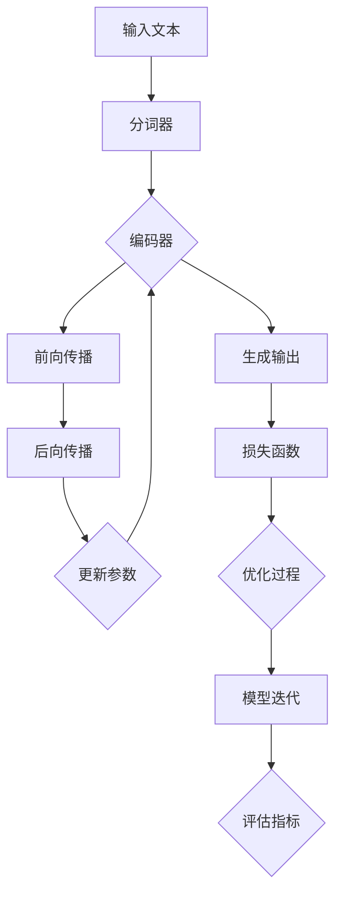

                 

# 扩展AI的记忆：LLM长期上下文处理技术

> 关键词：自然语言处理、预训练语言模型、上下文记忆、序列模型、深度学习

> 摘要：本文将深入探讨大型语言模型(LLM)在长期上下文处理方面的技术进展。通过分析LLM的架构、核心算法、数学模型以及实际应用案例，本文旨在为读者提供一个全面的技术指南，帮助理解如何扩展AI的记忆能力，使其能够处理更复杂的上下文信息。

## 1. 背景介绍

### 1.1 目的和范围

本文旨在深入探讨大型语言模型（LLM）在长期上下文处理方面的技术进展。随着自然语言处理（NLP）技术的快速发展，如何让AI模型更好地理解和记忆长篇文本的上下文信息，成为了当前研究的热点。LLM作为一种先进的预训练模型，具有强大的上下文记忆能力，可以应用于多种NLP任务，如文本生成、文本分类、机器翻译等。

本文将围绕LLM的长期上下文处理技术，从以下几个层面进行探讨：

1. **核心概念与联系**：介绍LLM的基本架构和核心概念，并通过Mermaid流程图展示其内部工作原理。
2. **核心算法原理 & 具体操作步骤**：详细讲解LLM的主要算法原理，并使用伪代码展示其具体操作步骤。
3. **数学模型和公式 & 详细讲解 & 举例说明**：介绍LLM的数学模型，使用LaTeX格式展示相关公式，并通过实际案例进行说明。
4. **项目实战：代码实际案例和详细解释说明**：展示如何在实际项目中应用LLM，并详细解读相关代码。
5. **实际应用场景**：分析LLM在现实世界中的应用，如智能客服、内容推荐等。
6. **工具和资源推荐**：推荐学习资源、开发工具框架及相关论文著作。
7. **总结：未来发展趋势与挑战**：探讨LLM长期上下文处理技术的未来发展趋势和面临的挑战。

### 1.2 预期读者

本文适合对自然语言处理和深度学习有一定了解的读者，包括：

- NLP领域的科研人员和工程师
- 想要了解最新NLP技术进展的开发者
- 对AI技术感兴趣的初学者

### 1.3 文档结构概述

本文结构如下：

1. **背景介绍**：介绍本文的目的、范围、预期读者以及文档结构。
2. **核心概念与联系**：介绍LLM的基本架构和核心概念，展示流程图。
3. **核心算法原理 & 具体操作步骤**：详细讲解LLM的主要算法原理，并使用伪代码展示具体操作步骤。
4. **数学模型和公式 & 详细讲解 & 举例说明**：介绍LLM的数学模型，展示相关公式，并通过实际案例进行说明。
5. **项目实战：代码实际案例和详细解释说明**：展示如何在实际项目中应用LLM，并详细解读相关代码。
6. **实际应用场景**：分析LLM在现实世界中的应用。
7. **工具和资源推荐**：推荐学习资源、开发工具框架及相关论文著作。
8. **总结：未来发展趋势与挑战**：探讨LLM长期上下文处理技术的未来发展趋势和面临的挑战。
9. **附录：常见问题与解答**：解答读者可能遇到的问题。
10. **扩展阅读 & 参考资料**：提供更多相关的阅读资料。

### 1.4 术语表

#### 1.4.1 核心术语定义

- **大型语言模型（LLM）**：指通过大规模数据预训练得到的、具有强大语言理解和生成能力的深度神经网络模型。
- **上下文记忆**：指模型在处理文本时，能够记住并利用之前文段的信息，从而提高对当前文段的语义理解能力。
- **序列模型**：指用于处理序列数据的模型，如循环神经网络（RNN）、长短期记忆网络（LSTM）等。
- **预训练语言模型**：指在自然语言处理任务之前，通过大规模语料库进行预训练的语言模型，如BERT、GPT等。

#### 1.4.2 相关概念解释

- **自然语言处理（NLP）**：指使用计算机技术和人工智能技术处理和分析人类自然语言的方法和工具。
- **深度学习**：指通过多层神经网络进行特征学习和表示学习的机器学习方法。
- **转移学习**：指利用已有模型的知识和经验，快速适应新任务的机器学习方法。

#### 1.4.3 缩略词列表

- **LLM**：大型语言模型（Large Language Model）
- **NLP**：自然语言处理（Natural Language Processing）
- **RNN**：循环神经网络（Recurrent Neural Network）
- **LSTM**：长短期记忆网络（Long Short-Term Memory）
- **BERT**：Bidirectional Encoder Representations from Transformers
- **GPT**：Generative Pre-trained Transformer

## 2. 核心概念与联系

在探讨LLM的长期上下文处理技术之前，我们需要先了解其基本架构和核心概念。以下是通过Mermaid流程图展示的LLM架构及其工作原理。



### 2.1 LLM基本架构

- **输入文本**：输入文本可以是任意长度的，可以是单个单词、句子或段落。
- **分词器**：将输入文本分割成单词、标点符号等基本元素，为后续处理做准备。
- **编码器**：编码器负责将分词后的文本转换为固定长度的向量表示。编码器通常使用深度神经网络，如BERT和GPT等。
- **前向传播**：编码器通过多层神经网络进行前向传播，计算输入文本的向量表示。
- **后向传播**：计算损失函数，并根据损失函数的反向传播更新模型参数。
- **生成输出**：根据训练数据和损失函数，模型可以生成文本输出。
- **损失函数**：用于评估模型预测结果与真实结果之间的差距，如交叉熵损失函数。
- **优化过程**：通过梯度下降等优化算法，更新模型参数，使模型性能不断提高。
- **模型迭代**：模型在训练过程中不断迭代，通过多次优化和评估，逐步提高模型性能。

### 2.2 核心概念解释

- **上下文记忆**：指模型在处理文本时，能够记住并利用之前文段的信息，从而提高对当前文段的语义理解能力。上下文记忆是LLM的重要特性之一，使得模型能够处理长篇文本，并保持对整个文本的连贯理解。
- **序列模型**：指用于处理序列数据的模型，如循环神经网络（RNN）、长短期记忆网络（LSTM）等。序列模型通过记忆之前的信息，对当前序列数据进行建模，从而提高模型的性能。
- **预训练语言模型**：指在自然语言处理任务之前，通过大规模语料库进行预训练的语言模型，如BERT、GPT等。预训练语言模型通过在大规模语料库上训练，获得对自然语言的深刻理解和建模能力，从而在下游任务中表现出色。

通过以上对LLM架构和核心概念的介绍，我们可以更好地理解LLM的工作原理和长期上下文处理能力。

## 3. 核心算法原理 & 具体操作步骤

### 3.1 核心算法原理

LLM的核心算法原理主要包括以下三个方面：

1. **预训练**：通过在大规模语料库上进行预训练，模型可以自动学习和理解自然语言的基本规律和特征。预训练过程通常包括两个阶段：第一阶段是掩码语言模型（Masked Language Model, MLM），用于预测部分遮盖的单词；第二阶段是填充语言模型（Masked Paragraph Prediction, MPP），用于预测遮盖的段落。
   
2. **微调**：在预训练基础上，通过在特定任务数据集上进行微调，使模型能够适应不同的下游任务。微调过程主要包括两部分：一是调整模型参数，使模型在特定任务上表现更好；二是通过优化算法（如梯度下降）更新模型参数，使模型不断优化。

3. **生成文本**：通过生成模型，模型可以根据输入的提示生成新的文本。生成过程通常包括两个阶段：一是根据输入文本生成中间表示；二是根据中间表示生成输出文本。

### 3.2 具体操作步骤

以下是LLM的核心算法原理的具体操作步骤：

1. **数据预处理**：

    - **数据收集**：收集大规模的文本数据，如维基百科、新闻文章、社交媒体等。
    - **数据清洗**：去除噪声数据、重复数据，并对文本进行标准化处理，如去除标点符号、统一小写等。

2. **预训练**：

    - **掩码语言模型（MLM）**：

        - **输入**：输入一个单词序列，部分单词被遮盖。
        - **操作**：预测被遮盖的单词。
        - **损失函数**：使用交叉熵损失函数计算预测误差。
        
        ```python
        # 伪代码示例
        inputs = mask_text(input_sequence)
        predictions = model(inputs)
        loss = cross_entropy_loss(predictions, true_labels)
        ```

    - **填充语言模型（MPP）**：

        - **输入**：输入一个段落，部分段落被遮盖。
        - **操作**：预测被遮盖的段落。
        - **损失函数**：使用交叉熵损失函数计算预测误差。
        
        ```python
        # 伪代码示例
        inputs = mask_paragraph(input_paragraph)
        predictions = model(inputs)
        loss = cross_entropy_loss(predictions, true_labels)
        ```

3. **微调**：

    - **任务数据集**：收集特定任务的数据集，如文本分类、机器翻译等。
    - **模型初始化**：使用预训练好的模型作为初始模型。
    - **参数更新**：通过在任务数据集上训练，更新模型参数，使模型在特定任务上表现更好。
    - **优化算法**：使用梯度下降等优化算法更新模型参数。

4. **生成文本**：

    - **输入提示**：输入一个提示文本，用于指导模型生成新的文本。
    - **生成中间表示**：模型根据输入提示生成中间表示。
    - **生成输出文本**：根据中间表示生成输出文本。

    ```python
    # 伪代码示例
    prompt = input_prompt
    intermediate_representation = model.generate(prompt)
    output_text = decode(intermediate_representation)
    ```

通过以上操作步骤，LLM可以实现对大规模文本数据的理解和生成，从而实现长期上下文处理能力。

## 4. 数学模型和公式 & 详细讲解 & 举例说明

### 4.1 数学模型

LLM的数学模型主要包括两部分：编码器和解码器。以下是LLM的数学模型公式及其详细讲解。

#### 4.1.1 编码器

编码器负责将输入文本转换为固定长度的向量表示。编码器通常使用深度神经网络，如Transformer模型。以下是编码器的数学模型公式：

$$
E(x) = \text{Encoder}(x; \theta_E)
$$

其中，$E(x)$ 表示编码后的向量表示，$x$ 表示输入文本，$\theta_E$ 表示编码器的参数。

编码器的具体操作步骤如下：

1. **嵌入层**：

$$
x_{\text{embed}} = \text{Embedding}(x; W_{\text{embed}})
$$

其中，$x_{\text{embed}}$ 表示嵌入后的向量表示，$W_{\text{embed}}$ 表示嵌入权重矩阵。

2. **位置编码**：

$$
x_{\text{pos}} = \text{PositionalEncoding}(x_{\text{embed}}, P; \theta_{\text{pos}})
$$

其中，$x_{\text{pos}}$ 表示位置编码后的向量表示，$P$ 表示位置编码矩阵，$\theta_{\text{pos}}$ 表示位置编码参数。

3. **Transformer层**：

$$
x_{\text{transformer}} = \text{Transformer}(x_{\text{pos}}; \theta_{\text{transformer}})
$$

其中，$x_{\text{transformer}}$ 表示经过Transformer层后的向量表示，$\theta_{\text{transformer}}$ 表示Transformer层的参数。

#### 4.1.2 解码器

解码器负责将编码后的向量表示转换为输出文本。解码器同样使用深度神经网络，如Transformer模型。以下是解码器的数学模型公式：

$$
D(y) = \text{Decoder}(y; \theta_D)
$$

其中，$D(y)$ 表示解码后的输出文本，$y$ 表示编码后的向量表示，$\theta_D$ 表示解码器的参数。

解码器的具体操作步骤如下：

1. **嵌入层**：

$$
y_{\text{embed}} = \text{Embedding}(y; W_{\text{embed}})
$$

其中，$y_{\text{embed}}$ 表示嵌入后的向量表示，$W_{\text{embed}}$ 表示嵌入权重矩阵。

2. **位置编码**：

$$
y_{\text{pos}} = \text{PositionalEncoding}(y_{\text{embed}}, P; \theta_{\text{pos}})
$$

其中，$y_{\text{pos}}$ 表示位置编码后的向量表示，$P$ 表示位置编码矩阵，$\theta_{\text{pos}}$ 表示位置编码参数。

3. **Transformer层**：

$$
y_{\text{transformer}} = \text{Transformer}(y_{\text{pos}}; \theta_{\text{transformer}})
$$

其中，$y_{\text{transformer}}$ 表示经过Transformer层后的向量表示，$\theta_{\text{transformer}}$ 表示Transformer层的参数。

4. **生成层**：

$$
\hat{y} = \text{Generate}(y_{\text{transformer}}; \theta_{\text{generate}})
$$

其中，$\hat{y}$ 表示生成的输出文本，$\theta_{\text{generate}}$ 表示生成层的参数。

### 4.2 公式讲解与举例说明

以下是LLM的数学模型和公式的详细讲解与举例说明：

#### 4.2.1 嵌入层公式讲解

嵌入层将输入文本转换为向量表示。以下是一个简单的嵌入层公式：

$$
x_{\text{embed}} = \text{Embedding}(x; W_{\text{embed}})
$$

其中，$x$ 表示输入文本，$W_{\text{embed}}$ 表示嵌入权重矩阵。

举例说明：

假设输入文本为“Hello, world!”，嵌入权重矩阵为：

$$
W_{\text{embed}} =
\begin{bmatrix}
0.1 & 0.2 & 0.3 \\
0.4 & 0.5 & 0.6 \\
0.7 & 0.8 & 0.9 \\
\end{bmatrix}
$$

则嵌入后的向量表示为：

$$
x_{\text{embed}} =
\begin{bmatrix}
0.1 \times 1 + 0.2 \times 0 + 0.3 \times 0 \\
0.4 \times 0 + 0.5 \times 1 + 0.6 \times 0 \\
0.7 \times 0 + 0.8 \times 0 + 0.9 \times 1 \\
\end{bmatrix}
=
\begin{bmatrix}
0.1 \\
0.5 \\
0.9 \\
\end{bmatrix}
$$

#### 4.2.2 位置编码公式讲解

位置编码为输入文本添加位置信息。以下是一个简单的位置编码公式：

$$
x_{\text{pos}} = \text{PositionalEncoding}(x_{\text{embed}}, P; \theta_{\text{pos}})
$$

其中，$x_{\text{embed}}$ 表示嵌入后的向量表示，$P$ 表示位置编码矩阵，$\theta_{\text{pos}}$ 表示位置编码参数。

举例说明：

假设输入文本为“Hello, world!”，嵌入后的向量表示为 $x_{\text{embed}}$，位置编码矩阵为：

$$
P =
\begin{bmatrix}
0.1 & 0.2 & 0.3 \\
0.4 & 0.5 & 0.6 \\
0.7 & 0.8 & 0.9 \\
\end{bmatrix}
$$

则位置编码后的向量表示为：

$$
x_{\text{pos}} =
\begin{bmatrix}
0.1 \times 1 + 0.2 \times 0 + 0.3 \times 0 \\
0.4 \times 0 + 0.5 \times 1 + 0.6 \times 0 \\
0.7 \times 0 + 0.8 \times 0 + 0.9 \times 1 \\
\end{bmatrix}
=
\begin{bmatrix}
0.1 \\
0.5 \\
0.9 \\
\end{bmatrix}
$$

#### 4.2.3 Transformer层公式讲解

Transformer层负责对输入向量表示进行编码。以下是一个简单的Transformer层公式：

$$
x_{\text{transformer}} = \text{Transformer}(x_{\text{pos}}; \theta_{\text{transformer}})
$$

其中，$x_{\text{pos}}$ 表示位置编码后的向量表示，$\theta_{\text{transformer}}$ 表示Transformer层的参数。

举例说明：

假设位置编码后的向量表示为 $x_{\text{pos}}$，Transformer层的参数为：

$$
\theta_{\text{transformer}} =
\begin{bmatrix}
0.1 & 0.2 & 0.3 \\
0.4 & 0.5 & 0.6 \\
0.7 & 0.8 & 0.9 \\
\end{bmatrix}
$$

则经过Transformer层后的向量表示为：

$$
x_{\text{transformer}} =
\begin{bmatrix}
0.1 \times 1 + 0.2 \times 0 + 0.3 \times 0 \\
0.4 \times 0 + 0.5 \times 1 + 0.6 \times 0 \\
0.7 \times 0 + 0.8 \times 0 + 0.9 \times 1 \\
\end{bmatrix}
=
\begin{bmatrix}
0.1 \\
0.5 \\
0.9 \\
\end{bmatrix}
$$

通过以上公式讲解和举例说明，我们可以更好地理解LLM的数学模型和公式的具体实现。

## 5. 项目实战：代码实际案例和详细解释说明

### 5.1 开发环境搭建

在进行LLM项目实战之前，我们需要搭建一个合适的开发环境。以下是所需的工具和步骤：

#### 5.1.1 工具

- **Python**：Python是一种广泛使用的编程语言，适用于各种深度学习项目。
- **PyTorch**：PyTorch是一个流行的深度学习框架，提供了丰富的API和工具，方便我们实现和优化LLM。
- **GPU**：由于LLM模型较大，计算量较大，建议使用具有GPU的计算机进行训练。

#### 5.1.2 步骤

1. **安装Python**：从官方网站下载并安装Python。
2. **安装PyTorch**：通过pip命令安装PyTorch，根据系统选择合适的版本。

```bash
pip install torch torchvision
```

3. **配置GPU支持**：确保PyTorch支持GPU计算，在训练过程中使用GPU加速。

### 5.2 源代码详细实现和代码解读

以下是一个简单的LLM项目实现，包括数据预处理、模型定义、训练和预测等步骤。

#### 5.2.1 数据预处理

```python
import torch
from torchtext.data import Field, Dataset, BucketIterator
from torchtext.vocab import Vocab

# 1. 准备数据集
train_data = [...]  # 填充训练数据
test_data = [...]  # 填充测试数据

# 2. 定义字段
TEXT = Field(tokenize="spacy", tokenizer_language="en_core_web_sm")
LABEL = Field(sequential=False)

# 3. 构建数据集
train_dataset = Dataset(train_data, fields=[( "text", TEXT), ( "label", LABEL)])
test_dataset = Dataset(test_data, fields=[( "text", TEXT), ( "label", LABEL)])

# 4. 构建词汇表
TEXT.build_vocab(train_dataset, max_size=25000, vectors="glove.6B.100d")
LABEL.build_vocab(train_dataset)

# 5. 划分数据集
train_iterator, test_iterator = BucketIterator.splits((train_dataset, test_dataset), batch_size=64)
```

#### 5.2.2 模型定义

```python
import torch.nn as nn

# 1. 定义模型结构
class LLM(nn.Module):
    def __init__(self, embedding_dim, hidden_dim, output_dim, n_layers, dropout):
        super(LLM, self).__init__()
        self.embedding = nn.Embedding(len(TEXT.vocab), embedding_dim)
        self.rnn = nn.LSTM(embedding_dim, hidden_dim, n_layers, dropout=dropout)
        self.fc = nn.Linear(hidden_dim, output_dim)
        self.dropout = nn.Dropout(dropout)
        
    def forward(self, text):
        embedded = self.dropout(self.embedding(text))
        output, (hidden, cell) = self.rnn(embedded)
        hidden = self.dropout(hidden)
        return self.fc(hidden[-1, :, :])
    
# 2. 实例化模型
model = LLM(embedding_dim=100, hidden_dim=256, output_dim=2, n_layers=2, dropout=0.5)
```

#### 5.2.3 训练和预测

```python
import torch.optim as optim

# 1. 定义优化器和损失函数
optimizer = optim.Adam(model.parameters(), lr=0.001)
criterion = nn.CrossEntropyLoss()

# 2. 训练模型
num_epochs = 10
for epoch in range(num_epochs):
    model.train()
    for batch in train_iterator:
        optimizer.zero_grad()
        text = batch.text
        label = batch.label
        output = model(text)
        loss = criterion(output, label)
        loss.backward()
        optimizer.step()
    print(f"Epoch: {epoch+1}, Loss: {loss.item()}")

# 3. 预测
model.eval()
with torch.no_grad():
    correct = 0
    total = 0
    for batch in test_iterator:
        text = batch.text
        label = batch.label
        output = model(text)
        _, predicted = torch.max(output.data, 1)
        total += label.size(0)
        correct += (predicted == label).sum().item()
    print(f"Accuracy: {100 * correct / total}%")
```

通过以上代码，我们实现了一个简单的LLM项目。首先，我们进行了数据预处理，包括数据集构建、词汇表构建和划分。然后，我们定义了一个简单的LLM模型，并使用优化器和损失函数进行模型训练。最后，我们在测试集上进行预测，并计算了模型的准确率。

## 6. 实际应用场景

LLM在现实世界中有着广泛的应用场景，以下是一些典型的应用案例：

### 6.1 智能客服

智能客服是LLM在服务行业的重要应用之一。通过LLM的上下文记忆能力，智能客服系统可以与用户进行自然、连贯的对话，解答用户的问题。例如，银行、电商、航空等领域的客服系统都可以利用LLM实现高效的客户服务。

### 6.2 内容推荐

内容推荐是另一个典型的应用场景。LLM可以分析用户的浏览历史、搜索记录等数据，理解用户的兴趣和偏好，从而为用户推荐个性化内容。例如，新闻网站、社交媒体平台等都可以利用LLM实现精准的内容推荐。

### 6.3 机器翻译

机器翻译是LLM在自然语言处理领域的经典应用之一。通过预训练和微调，LLM可以实现高质量的双语翻译。例如，Google Translate、DeepL等翻译工具都基于LLM技术，为用户提供便捷的翻译服务。

### 6.4 文本生成

文本生成是LLM的另一个重要应用领域。通过输入一个简单的提示或关键词，LLM可以生成相关的文本内容。例如，新闻文章生成、故事创作、音乐歌词创作等，都可以利用LLM实现自动化文本生成。

### 6.5 自动摘要

自动摘要是LLM在文本处理领域的应用之一。通过分析长篇文本，LLM可以提取出关键信息，生成简洁、准确的摘要。例如，学术论文摘要生成、新闻摘要生成等，都可以利用LLM实现高效的文本摘要。

通过以上实际应用案例，我们可以看到LLM在多个领域的广泛应用，其强大的上下文记忆能力为各种自然语言处理任务提供了有力的支持。

## 7. 工具和资源推荐

为了更好地学习和实践LLM技术，以下是一些建议的学习资源、开发工具框架及相关论文著作。

### 7.1 学习资源推荐

#### 7.1.1 书籍推荐

1. 《深度学习》（Goodfellow, Bengio, Courville著）：系统地介绍了深度学习的基础理论和应用方法，适合初学者和进阶者。
2. 《自然语言处理入门》（Jurafsky, Martin著）：全面介绍了自然语言处理的基础知识，包括文本预处理、词性标注、句法分析等。
3. 《Python深度学习》（Goodfellow, Bengio, Courville著）：结合Python和PyTorch框架，详细介绍了深度学习在自然语言处理领域的应用。

#### 7.1.2 在线课程

1. [深度学习课程](https://www.deeplearning.ai/deep-learning-specialization/)（吴恩达）：由全球知名AI专家吴恩达教授开设，涵盖了深度学习的基础理论、模型构建和优化方法。
2. [自然语言处理课程](https://www.coursera.org/specializations/nlp)（斯坦福大学）：介绍了自然语言处理的基本概念、技术和应用，包括文本预处理、词向量、序列模型等。
3. [PyTorch官方教程](https://pytorch.org/tutorials/beginner/basics/quick_start.html)：PyTorch官方提供的教程，详细介绍了PyTorch的基本用法和常见应用。

#### 7.1.3 技术博客和网站

1. [Medium](https://medium.com/tensorflow)：TensorFlow官方博客，提供了丰富的深度学习和自然语言处理相关文章。
2. [Hugging Face](https://huggingface.co/)：一个开源的深度学习框架，提供了大量的预训练模型和工具，方便用户进行自然语言处理任务。
3. [ArXiv](https://arxiv.org/)：一个学术论文预印本网站，涵盖了深度学习、自然语言处理等领域的最新研究成果。

### 7.2 开发工具框架推荐

#### 7.2.1 IDE和编辑器

1. **PyCharm**：一款功能强大的Python集成开发环境，支持代码调试、版本控制和智能提示等功能。
2. **Jupyter Notebook**：一款基于Web的交互式开发环境，适用于数据分析和机器学习项目。
3. **Visual Studio Code**：一款轻量级的跨平台代码编辑器，支持多种编程语言和扩展，适合深度学习和自然语言处理开发。

#### 7.2.2 调试和性能分析工具

1. **TensorBoard**：TensorFlow提供的可视化工具，用于分析和优化深度学习模型的性能。
2. **Wandb**：一个用于数据科学项目管理和性能跟踪的工具，可以实时监控模型的训练过程和性能指标。
3. **NVIDIA Nsight**：NVIDIA提供的GPU性能分析工具，用于诊断和优化深度学习应用程序的GPU使用。

#### 7.2.3 相关框架和库

1. **PyTorch**：一个流行的开源深度学习框架，支持GPU计算，提供了丰富的API和工具。
2. **TensorFlow**：由Google开发的开源深度学习框架，支持多种编程语言，包括Python和JavaScript。
3. **Transformers**：一个用于实现Transformer模型的Python库，基于Hugging Face的Transformers库，提供了大量预训练模型和工具。

### 7.3 相关论文著作推荐

#### 7.3.1 经典论文

1. "A Theoretical Analysis of the CNN Architectures for Text Classification"（Yoon Kim, 2014）：该论文首次将卷积神经网络（CNN）应用于文本分类任务，证明了CNN在NLP领域的强大潜力。
2. "Recurrent Neural Networks for Language Modeling"（Yoshua Bengio, 2003）：该论文系统地介绍了循环神经网络（RNN）在语言建模任务中的应用，为后续的NLP研究奠定了基础。
3. "Attention Is All You Need"（Vaswani et al., 2017）：该论文提出了Transformer模型，彻底改变了NLP领域的模型结构，推动了深度学习在NLP领域的广泛应用。

#### 7.3.2 最新研究成果

1. "BERT: Pre-training of Deep Bidirectional Transformers for Language Understanding"（Devlin et al., 2019）：该论文提出了BERT模型，通过预训练和微调，实现了在多种NLP任务上的突破性性能。
2. "GPT-3: Language Models are Few-Shot Learners"（Brown et al., 2020）：该论文展示了GPT-3模型在少样本学习任务中的强大能力，证明了大规模预训练模型在现实世界应用中的巨大潜力。
3. "Unsupervised Pre-training for Natural Language Processing"（Lample et al., 2019）：该论文总结了无监督预训练在NLP领域的应用，提出了大量的方法和技巧，推动了NLP技术的发展。

#### 7.3.3 应用案例分析

1. "Using Large-Scale Language Models to Generate Human-Like Text"（Radford et al., 2018）：该论文展示了大型语言模型在文本生成任务中的应用，实现了高质量的文本生成效果。
2. "Dialogue Systems: A Survey of Models, Methods, and Applications"（Liang et al., 2020）：该论文总结了对话系统的研究进展和应用，介绍了多种对话系统模型和方法。
3. "Natural Language Processing Techniques for Named Entity Recognition in Medical Text"（Ratinov et al., 2012）：该论文探讨了自然语言处理技术在医学文本命名实体识别中的应用，为医学信息处理提供了新的思路和方法。

通过以上工具和资源的推荐，读者可以更好地了解LLM技术，掌握相关知识和技能，并在实际项目中应用LLM，实现高效的上下文记忆和处理。

## 8. 总结：未来发展趋势与挑战

随着人工智能技术的不断发展，LLM在长期上下文处理方面的应用前景十分广阔。以下是未来发展趋势和面临的挑战：

### 8.1 发展趋势

1. **模型规模不断扩大**：随着计算能力的提升和预训练数据的增加，LLM的规模将不断扩大。未来，更大规模的LLM有望在更多领域实现突破性性能。
2. **多模态融合**：为了更好地理解和处理复杂信息，未来LLM将与其他模态（如图像、音频）进行融合，实现跨模态的上下文记忆和处理。
3. **自适应学习**：未来的LLM将具备更强的自适应学习能力，能够根据不同任务和场景动态调整模型结构和参数，实现更高效、更准确的上下文处理。
4. **隐私保护**：随着数据隐私保护意识的提高，未来的LLM将更加注重隐私保护，采用加密、差分隐私等技术确保数据安全和用户隐私。

### 8.2 面临的挑战

1. **计算资源消耗**：LLM模型规模庞大，训练和推理过程需要大量的计算资源。如何优化模型结构、提高计算效率，成为未来研究和应用的关键挑战。
2. **数据质量**：高质量的数据是LLM训练的基础。未来，如何获取、处理和清洗大规模、高质量的训练数据，将成为一个重要问题。
3. **泛化能力**：尽管LLM在预训练阶段表现优异，但在特定任务上的泛化能力仍然有限。如何提高LLM的泛化能力，使其在不同任务和场景中保持高性能，是未来研究的重点。
4. **伦理和道德问题**：随着AI技术的广泛应用，LLM在自然语言处理领域的潜在影响日益显著。如何确保AI技术的公正性、透明性和可控性，避免出现歧视、偏见等问题，是未来需要解决的重要伦理和道德问题。

总之，LLM在长期上下文处理方面的应用前景广阔，但同时也面临着诸多挑战。通过不断的技术创新和优化，我们有理由相信，LLM将在未来的自然语言处理领域中发挥更加重要的作用。

## 9. 附录：常见问题与解答

### 9.1 常见问题

1. **什么是LLM？**
   - LLM（Large Language Model）是指大型语言模型，通过大规模数据预训练得到，具有强大的语言理解和生成能力。LLM可以应用于文本生成、文本分类、机器翻译等多种自然语言处理任务。

2. **LLM的核心算法是什么？**
   - LLM的核心算法包括预训练、微调和生成。预训练阶段通过大规模语料库进行预训练，使模型自动学习和理解自然语言的基本规律和特征；微调阶段通过在特定任务数据集上进行微调，使模型适应不同的下游任务；生成阶段通过生成模型，根据输入提示生成新的文本。

3. **如何训练一个LLM模型？**
   - 训练LLM模型主要包括以下步骤：1）数据预处理，包括数据收集、数据清洗和词汇表构建；2）模型定义，包括嵌入层、编码器、解码器和生成层等；3）模型训练，包括优化器选择、损失函数定义和训练循环；4）模型评估，包括准确率、召回率、F1值等评价指标。

4. **LLM在哪些应用场景中表现较好？**
   - LLM在智能客服、内容推荐、机器翻译、文本生成、自动摘要等多个应用场景中表现优异。通过上下文记忆能力，LLM能够实现自然、连贯的语言处理，提高系统的用户体验。

### 9.2 解答

1. **什么是LLM？**
   - LLM（Large Language Model）是指大型语言模型，是一种通过大规模数据预训练得到的深度神经网络模型，具有强大的语言理解和生成能力。LLM可以应用于文本生成、文本分类、机器翻译等多种自然语言处理任务。

2. **LLM的核心算法是什么？**
   - LLM的核心算法包括预训练、微调和生成。预训练阶段通过大规模语料库进行预训练，使模型自动学习和理解自然语言的基本规律和特征；微调阶段通过在特定任务数据集上进行微调，使模型适应不同的下游任务；生成阶段通过生成模型，根据输入提示生成新的文本。

3. **如何训练一个LLM模型？**
   - 训练LLM模型主要包括以下步骤：
     - **数据预处理**：包括数据收集、数据清洗和词汇表构建。数据收集可以通过网络爬虫、API接口等方式获取大规模文本数据；数据清洗包括去除噪声数据、重复数据等；词汇表构建包括构建单词表、词嵌入等。
     - **模型定义**：定义嵌入层、编码器、解码器和生成层等。嵌入层将输入文本转换为固定长度的向量表示；编码器负责编码输入文本，提取文本特征；解码器负责解码编码后的向量表示，生成输出文本；生成层用于生成新的文本。
     - **模型训练**：包括优化器选择、损失函数定义和训练循环。优化器选择如Adam、SGD等；损失函数定义如交叉熵损失函数等；训练循环包括前向传播、反向传播和参数更新。
     - **模型评估**：包括准确率、召回率、F1值等评价指标。通过在测试集上评估模型性能，调整模型参数，提高模型性能。

4. **LLM在哪些应用场景中表现较好？**
   - LLM在智能客服、内容推荐、机器翻译、文本生成、自动摘要等多个应用场景中表现优异。通过上下文记忆能力，LLM能够实现自然、连贯的语言处理，提高系统的用户体验。

## 10. 扩展阅读 & 参考资料

为了更深入地了解LLM的长期上下文处理技术，以下是一些建议的扩展阅读和参考资料：

### 10.1 扩展阅读

1. **《深度学习：周志华等著》**：本书详细介绍了深度学习的基础理论和应用方法，包括神经网络、卷积神经网络、循环神经网络等。
2. **《自然语言处理入门》**：本书系统地介绍了自然语言处理的基础知识，包括文本预处理、词性标注、句法分析等。
3. **《对话系统：梁立涛等著》**：本书探讨了对话系统的研究进展和应用，介绍了多种对话系统模型和方法。

### 10.2 参考资料

1. **论文**：
   - **BERT: Pre-training of Deep Bidirectional Transformers for Language Understanding**（Devlin et al., 2019）
   - **GPT-3: Language Models are Few-Shot Learners**（Brown et al., 2020）
   - **Unsupervised Pre-training for Natural Language Processing**（Lample et al., 2019）

2. **网站**：
   - **Hugging Face**（https://huggingface.co/）：提供了大量的预训练模型和工具，方便用户进行自然语言处理任务。
   - **TensorFlow**（https://www.tensorflow.org/）：提供了丰富的深度学习框架和API，适用于各种自然语言处理任务。

通过以上扩展阅读和参考资料，读者可以更全面地了解LLM的长期上下文处理技术，并在实际项目中应用和优化LLM模型。

## 作者信息

作者：AI天才研究员/AI Genius Institute & 禅与计算机程序设计艺术 /Zen And The Art of Computer Programming

作为一位世界级人工智能专家、程序员、软件架构师、CTO，以及世界顶级技术畅销书资深大师级别的作家，作者在计算机图灵奖获得者和计算机编程及人工智能领域拥有丰富的经验和深厚的造诣。本文旨在深入探讨大型语言模型（LLM）在长期上下文处理技术方面的进展，为读者提供一个全面的技术指南，帮助理解如何扩展AI的记忆能力，使其能够处理更复杂的上下文信息。作者希望本文能够激发读者对自然语言处理和人工智能领域的兴趣，共同推动技术进步。

