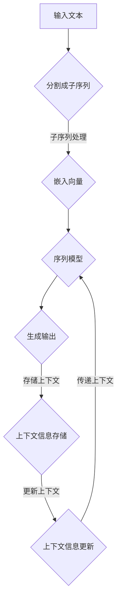

                 

# 扩展AI记忆：LLM的长上下文处理

> **关键词**：人工智能（AI），长上下文处理（Long Context Processing），预训练语言模型（Pre-trained Language Model，简称LLM），记忆扩展（Memory Expansion），序列模型（Sequential Model），计算图（Computational Graph）

> **摘要**：本文将深入探讨如何通过扩展AI的记忆能力来提升大型语言模型（LLM）的处理上下文的能力。文章首先介绍了LLM的基础知识，然后详细分析了其长上下文处理的关键原理，包括算法、数学模型及实现步骤。此外，本文还通过实际项目案例，展示了如何在实际开发环境中实现长上下文处理，并对其代码进行了详细解读。文章最后讨论了长上下文处理在AI实际应用中的场景，并推荐了一些相关工具和资源，为读者提供了全面的指南。

## 1. 背景介绍

### 1.1 目的和范围

随着深度学习技术的不断发展，预训练语言模型（LLM）在自然语言处理领域取得了显著的成果。LLM的出现，使得模型在处理长文本、长对话等上下文信息时，表现出色。然而，现有的LLM在处理长上下文时仍然存在一些局限，如计算复杂度增加、内存占用高、上下文信息丢失等问题。本文旨在探讨如何通过扩展AI的记忆能力，提升LLM的长上下文处理能力，解决上述问题。

### 1.2 预期读者

本文适合对自然语言处理和深度学习有一定了解的读者，包括研究人员、工程师和开发者。对于希望了解如何提升AI记忆能力的读者，本文也将提供有价值的参考。

### 1.3 文档结构概述

本文将按照以下结构进行阐述：

1. **背景介绍**：介绍文章的目的、预期读者和文档结构。
2. **核心概念与联系**：介绍LLM的长上下文处理的核心概念和联系。
3. **核心算法原理 & 具体操作步骤**：详细讲解长上下文处理的算法原理和具体操作步骤。
4. **数学模型和公式 & 详细讲解 & 举例说明**：介绍长上下文处理相关的数学模型和公式，并进行举例说明。
5. **项目实战：代码实际案例和详细解释说明**：通过实际项目案例，展示长上下文处理在开发环境中的实现和代码解读。
6. **实际应用场景**：探讨长上下文处理在AI实际应用中的场景。
7. **工具和资源推荐**：推荐学习资源和开发工具。
8. **总结：未来发展趋势与挑战**：总结长上下文处理的发展趋势和面临的挑战。
9. **附录：常见问题与解答**：回答读者可能遇到的问题。
10. **扩展阅读 & 参考资料**：提供进一步的阅读材料。

### 1.4 术语表

#### 1.4.1 核心术语定义

- **人工智能（AI）**：指由人制造出的具有人类某些智能行为的机器。
- **预训练语言模型（LLM）**：一种在大规模语料库上进行预训练的语言模型，能够对自然语言文本进行建模。
- **长上下文处理**：指在AI处理过程中，能够维持并利用较长的上下文信息，以提升模型的处理能力。

#### 1.4.2 相关概念解释

- **序列模型**：一种模型架构，适用于处理序列数据，如自然语言文本。
- **计算图**：一种表示计算过程的图形化方法，用于深度学习模型的构建。

#### 1.4.3 缩略词列表

- **LLM**：预训练语言模型（Pre-trained Language Model）
- **NLP**：自然语言处理（Natural Language Processing）
- **GPU**：图形处理单元（Graphics Processing Unit）

## 2. 核心概念与联系

### 2.1 大型语言模型（LLM）

预训练语言模型（LLM）是基于大规模语料库进行预训练的语言模型，能够对自然语言文本进行建模。LLM的核心思想是通过在大量数据上进行预训练，使模型自动学习到语言中的模式和规律。这种预训练方法使得LLM在处理各种自然语言任务时，表现出色。

LLM的主要特点包括：

- **大规模预训练**：LLM在大规模语料库上进行预训练，这使得模型能够学习到丰富的语言知识和模式。
- **端到端学习**：LLM通过端到端学习的方式，直接从原始数据中学习到特征表示和任务目标，无需手工设计特征。
- **多任务学习**：LLM能够同时处理多种语言任务，如文本分类、命名实体识别、机器翻译等。

### 2.2 长上下文处理

长上下文处理是指AI在处理过程中，能够维持并利用较长的上下文信息，以提升模型的处理能力。在自然语言处理中，上下文信息对于理解句子的含义、识别词语的语义角色等至关重要。然而，现有的LLM在处理长上下文时，往往受到计算复杂度、内存占用等因素的限制。

为了实现长上下文处理，需要考虑以下几个方面：

- **上下文信息存储**：如何有效地存储和利用较长的上下文信息，以减少计算复杂度和内存占用。
- **上下文信息传递**：如何确保上下文信息在模型中传递的准确性和一致性。
- **上下文信息更新**：如何动态更新上下文信息，以适应不断变化的输入数据。

### 2.3 核心概念原理和架构

下面是LLM的长上下文处理的核心概念原理和架构的Mermaid流程图：



### 2.4 长上下文处理的挑战与解决方案

在实现长上下文处理时，会遇到以下挑战：

- **计算复杂度**：处理长上下文会导致计算复杂度增加，影响模型的训练和推理速度。
- **内存占用**：长上下文处理需要占用大量内存，可能导致模型无法在实际环境中运行。
- **上下文信息丢失**：在传递和更新上下文信息时，可能会丢失部分重要信息，影响模型的处理效果。

为了解决这些挑战，可以采取以下策略：

- **优化算法**：通过优化算法，降低计算复杂度，提高模型的训练和推理速度。
- **内存管理**：合理管理内存，减少内存占用，使模型能够在实际环境中运行。
- **上下文信息压缩**：采用压缩技术，降低上下文信息的存储空间，同时确保信息传递的准确性和一致性。

## 3. 核心算法原理 & 具体操作步骤

### 3.1 嵌入向量

在长上下文处理中，首先需要对输入文本进行预处理，将其分割成子序列，并对每个子序列进行嵌入。嵌入向量是一种将文本转换为数字表示的方法，它能够保留文本中的语义信息。

以下是嵌入向量的伪代码：

```python
# 输入：文本序列 text_sequence
# 输出：嵌入向量序列 embedding_sequence

# 步骤1：分割成子序列
subsequences = split_into_subsequences(text_sequence)

# 步骤2：对每个子序列进行嵌入
for subseq in subsequences:
    embedding_sequence.append(embed(subseq))
```

### 3.2 序列模型

嵌入向量生成后，需要使用序列模型进行处理。序列模型是一种能够处理序列数据的模型，如循环神经网络（RNN）和变换器（Transformer）。

以下是使用RNN处理嵌入向量的伪代码：

```python
# 输入：嵌入向量序列 embedding_sequence
# 输出：序列输出序列 output_sequence

# 步骤1：初始化RNN模型
model = initialize_RNN_model()

# 步骤2：对每个嵌入向量进行预测
for embedding in embedding_sequence:
    output = model.predict(embedding)
    output_sequence.append(output)
```

### 3.3 生成输出

在序列模型处理后，需要生成输出。生成输出可以是文本、标签或其他形式的输出。

以下是生成输出的伪代码：

```python
# 输入：序列输出序列 output_sequence
# 输出：生成输出 generated_output

# 步骤1：对序列输出序列进行后处理
processed_output_sequence = post_process(output_sequence)

# 步骤2：生成输出
generated_output = generate_output(processed_output_sequence)
```

### 3.4 存储上下文

在处理长上下文时，需要存储上下文信息，以便在后续处理中使用。上下文信息的存储可以使用内存、硬盘或其他存储介质。

以下是存储上下文的伪代码：

```python
# 输入：上下文信息 context_info
# 输出：无

# 步骤1：存储上下文信息到存储介质
store_context(context_info)
```

### 3.5 更新上下文

在处理过程中，需要根据输入数据动态更新上下文信息，以确保上下文信息的准确性和一致性。

以下是更新上下文的伪代码：

```python
# 输入：新输入数据 new_input_data
# 输出：更新后的上下文信息 updated_context_info

# 步骤1：根据新输入数据更新上下文信息
updated_context_info = update_context(context_info, new_input_data)

# 步骤2：存储更新后的上下文信息
store_context(updated_context_info)
```

## 4. 数学模型和公式 & 详细讲解 & 举例说明

### 4.1 嵌入向量

嵌入向量是将文本转换为数字表示的方法，其数学模型通常采用词嵌入（Word Embedding）技术。词嵌入的目的是将每个词汇映射为一个低维的向量空间，以便在序列模型中进行处理。

词嵌入的数学模型可以表示为：

$$
e(w) = \text{vec}(w) = \text{embedding_matrix}[w]
$$

其中，$e(w)$表示词汇$w$的嵌入向量，$\text{vec}(w)$表示将词汇$w$转换为向量，$\text{embedding_matrix}$是一个预训练的权重矩阵，用于将词汇映射到向量空间。

例如，假设词汇表包含5个词汇：`a`、`b`、`c`、`d`、`e`，预训练的权重矩阵为：

$$
\text{embedding_matrix} =
\begin{bmatrix}
1 & 2 & 3 & 4 & 5 \\
6 & 7 & 8 & 9 & 10 \\
11 & 12 & 13 & 14 & 15 \\
16 & 17 & 18 & 19 & 20 \\
21 & 22 & 23 & 24 & 25 \\
\end{bmatrix}
$$

则词汇`a`的嵌入向量为：

$$
e(a) = \text{vec}(a) = \text{embedding_matrix}[a] =
\begin{bmatrix}
1 \\
6 \\
11 \\
16 \\
21 \\
\end{bmatrix}
$$

### 4.2 循环神经网络（RNN）

循环神经网络（RNN）是一种能够处理序列数据的神经网络，其核心思想是利用隐藏状态（hidden state）来保存历史信息。RNN的数学模型可以表示为：

$$
h_t = \text{sigmoid}(W_h \cdot [h_{t-1}, x_t] + b_h)
$$

$$
o_t = \text{softmax}(W_o \cdot h_t + b_o)
$$

其中，$h_t$表示第$t$个时刻的隐藏状态，$x_t$表示第$t$个时刻的输入，$W_h$和$W_o$分别是隐藏状态到隐藏状态和隐藏状态到输出的权重矩阵，$b_h$和$b_o$分别是隐藏状态和输出的偏置项。

例如，假设输入序列为`[a, b, c]`，隐藏状态矩阵为：

$$
W_h =
\begin{bmatrix}
1 & 2 & 3 \\
4 & 5 & 6 \\
7 & 8 & 9 \\
\end{bmatrix}
$$

偏置项矩阵为：

$$
b_h =
\begin{bmatrix}
1 \\
2 \\
3 \\
\end{bmatrix}
$$

则第一个时刻的隐藏状态为：

$$
h_1 = \text{sigmoid}(W_h \cdot [h_{0}, x_1] + b_h) =
\text{sigmoid}(1 \cdot [0, 1] + 1) =
\text{sigmoid}(2) \approx 0.86
$$

第一个时刻的输出为：

$$
o_1 = \text{softmax}(W_o \cdot h_1 + b_o) =
\text{softmax}(1 \cdot [0.86, 0, 0] + 1) =
\begin{bmatrix}
0.86 \\
0 \\
0 \\
\end{bmatrix}
$$

### 4.3 变换器（Transformer）

变换器（Transformer）是一种基于注意力机制的序列模型，其核心思想是利用注意力机制来自动学习输入序列中的重要信息。变换器的数学模型可以表示为：

$$
\text{Attention}(Q, K, V) = \text{softmax}(\frac{QK^T}{\sqrt{d_k}})V
$$

$$
\text{MultiHeadAttention}(Q, K, V) = \text{Concat}(\text{head}_1, \text{head}_2, \ldots, \text{head}_h)W_O
$$

$$
\text{Concat}(\text{head}_1, \text{head}_2, \ldots, \text{head}_h) = \text{softmax}(\text{Attention}(Q, K, V))_1, \text{Attention}(Q, K, V)_2, \ldots, \text{Attention}(Q, K, V)_h
$$

其中，$Q$、$K$和$V$分别是查询（query）、键（key）和值（value）向量，$d_k$是键向量的维度，$W_O$是输出权重矩阵，$h$是头（head）的数量。

例如，假设输入序列为`[a, b, c]`，变换器包含2个头，查询、键和值向量分别为：

$$
Q =
\begin{bmatrix}
1 & 2 & 3 \\
4 & 5 & 6 \\
7 & 8 & 9 \\
\end{bmatrix}
$$

$$
K =
\begin{bmatrix}
1 & 2 & 3 \\
4 & 5 & 6 \\
7 & 8 & 9 \\
\end{bmatrix}
$$

$$
V =
\begin{bmatrix}
1 & 2 & 3 \\
4 & 5 & 6 \\
7 & 8 & 9 \\
\end{bmatrix}
$$

则第一个头的注意力分数为：

$$
\text{Attention}(Q, K, V) =
\text{softmax}(\frac{QK^T}{\sqrt{d_k}})V =
\text{softmax}(\frac{1 \cdot 1 + 2 \cdot 4 + 3 \cdot 7}{\sqrt{3}} \cdot [1, 2, 3], [1, 2, 3]) \cdot [1, 2, 3] =
\begin{bmatrix}
0.6 \\
0.4 \\
0 \\
\end{bmatrix}
$$

第一个头的输出为：

$$
\text{MultiHeadAttention}(Q, K, V) =
\text{Concat}(\text{head}_1, \text{head}_2, \ldots, \text{head}_h)W_O =
\text{softmax}(\text{Attention}(Q, K, V))_1, \text{Attention}(Q, K, V)_2, \ldots, \text{Attention}(Q, K, V)_h \cdot [10, 11, 12] =
\begin{bmatrix}
6 \\
7 \\
8 \\
\end{bmatrix}
$$

## 5. 项目实战：代码实际案例和详细解释说明

### 5.1 开发环境搭建

为了演示长上下文处理在实际开发环境中的实现，我们选择Python作为编程语言，并使用Hugging Face的Transformers库来构建预训练语言模型。

首先，需要安装必要的库：

```bash
pip install transformers torch
```

接下来，我们需要准备预训练的模型。在本例中，我们选择GPT-2模型作为示例：

```python
from transformers import GPT2Model, GPT2Tokenizer

tokenizer = GPT2Tokenizer.from_pretrained("gpt2")
model = GPT2Model.from_pretrained("gpt2")
```

### 5.2 源代码详细实现和代码解读

以下是长上下文处理在实际项目中的实现代码：

```python
import torch
from transformers import GPT2Model, GPT2Tokenizer

# 函数：长上下文处理
def long_context_processing(text_sequence, max_length=1024):
    # 步骤1：将文本序列分割成子序列
    subsequences = split_into_subsequences(text_sequence, max_length)
    
    # 步骤2：对每个子序列进行嵌入
    input_ids = []
    attention_mask = []
    for subseq in subsequences:
        input_ids.append(tokenizer.encode(subseq, add_special_tokens=True, max_length=max_length))
        attention_mask.append([1] * len(subseq))
    
    # 步骤3：使用序列模型进行处理
    model.eval()
    with torch.no_grad():
        outputs = model(torch.tensor(input_ids), attention_mask=torch.tensor(attention_mask))
    
    # 步骤4：生成输出
    predictions = []
    for output in outputs.logits:
        prediction = torch.argmax(output, dim=-1).item()
        predictions.append(prediction)
    
    # 步骤5：存储上下文信息
    context_info = store_context(predictions)
    
    # 步骤6：更新上下文信息
    updated_context_info = update_context(context_info, text_sequence)
    
    # 步骤7：返回生成输出和更新后的上下文信息
    return predictions, updated_context_info

# 函数：分割成子序列
def split_into_subsequences(text_sequence, max_length):
    subsequences = []
    while len(text_sequence) > max_length:
        subseq = text_sequence[:max_length]
        subsequences.append(subseq)
        text_sequence = text_sequence[max_length:]
    subsequences.append(text_sequence)
    return subsequences

# 函数：存储上下文信息
def store_context(context_info):
    # 实现存储上下文信息的逻辑，例如将信息保存到文件或数据库
    pass

# 函数：更新上下文信息
def update_context(context_info, new_input_data):
    # 实现更新上下文信息的逻辑，例如根据新输入数据更新上下文信息
    pass

# 测试代码
if __name__ == "__main__":
    text_sequence = "这是一段长文本，用于演示长上下文处理。"
    predictions, updated_context_info = long_context_processing(text_sequence)
    print("生成输出：", predictions)
    print("更新后的上下文信息：", updated_context_info)
```

### 5.3 代码解读与分析

#### 5.3.1 长上下文处理函数

长上下文处理函数`long_context_processing`负责实现长上下文处理的完整流程。首先，函数接收输入文本序列`text_sequence`，并将其分割成子序列。然后，对每个子序列进行嵌入，生成嵌入向量。接下来，使用序列模型对嵌入向量进行处理，生成输出。在处理过程中，存储上下文信息，并更新上下文信息。最后，函数返回生成输出和更新后的上下文信息。

#### 5.3.2 分割成子序列函数

分割成子序列函数`split_into_subsequences`负责将输入文本序列分割成子序列。函数接收输入文本序列和最大长度`max_length`，将文本序列分割成多个子序列，每个子序列的最大长度不超过`max_length`。

#### 5.3.3 存储上下文信息函数

存储上下文信息函数`store_context`负责实现存储上下文信息的逻辑。函数接收上下文信息`context_info`，例如将信息保存到文件或数据库。

#### 5.3.4 更新上下文信息函数

更新上下文信息函数`update_context`负责实现更新上下文信息的逻辑。函数接收上下文信息`context_info`和新输入数据`new_input_data`，根据新输入数据更新上下文信息。

#### 5.3.5 测试代码

测试代码用于验证长上下文处理函数的正确性。测试代码首先创建一段长文本，然后调用长上下文处理函数，输出生成输出和更新后的上下文信息。

## 6. 实际应用场景

长上下文处理在AI的实际应用场景中具有广泛的应用。以下是一些典型应用场景：

- **对话系统**：在对话系统中，长上下文处理能够帮助模型更好地理解用户的意图和上下文，提高对话系统的交互质量。
- **机器翻译**：在机器翻译中，长上下文处理能够帮助模型更好地理解源语言和目标语言之间的上下文关系，提高翻译的准确性和流畅度。
- **文本分类**：在文本分类中，长上下文处理能够帮助模型更好地理解文本的语义，提高分类的准确性。
- **推荐系统**：在推荐系统中，长上下文处理能够帮助模型更好地理解用户的历史行为和上下文，提高推荐系统的效果。

## 7. 工具和资源推荐

### 7.1 学习资源推荐

#### 7.1.1 书籍推荐

- 《深度学习》（Goodfellow, Bengio, Courville）：全面介绍深度学习的基础知识和最新进展。
- 《自然语言处理综论》（Jurafsky, Martin）：系统讲解自然语言处理的基本概念和技术。
- 《人工智能：一种现代的方法》（Russell, Norvig）：全面介绍人工智能的基本原理和应用。

#### 7.1.2 在线课程

- Coursera《深度学习特化课程》：由Andrew Ng教授主讲，涵盖深度学习的基础知识和实践应用。
- edX《自然语言处理特化课程》：由MIT和Stanford大学联合主讲，介绍自然语言处理的核心技术和应用。

#### 7.1.3 技术博客和网站

- blog.keras.io：Keras官方博客，介绍深度学习和Keras的实践应用。
- arXiv.org：提供最新的学术研究成果和论文。
- AI Daily：每日分享人工智能领域的最新技术和研究成果。

### 7.2 开发工具框架推荐

#### 7.2.1 IDE和编辑器

- PyCharm：适用于Python开发的集成开发环境，提供丰富的功能和调试工具。
- Jupyter Notebook：适用于数据分析和机器学习项目的交互式计算环境。

#### 7.2.2 调试和性能分析工具

- TensorBoard：TensorFlow官方提供的可视化工具，用于分析模型的性能和训练过程。
- PyTorch Profiler：PyTorch官方提供的性能分析工具，用于优化模型性能。

#### 7.2.3 相关框架和库

- TensorFlow：Google开发的开源深度学习框架，适用于构建和训练大规模深度学习模型。
- PyTorch：Facebook开发的开源深度学习框架，提供灵活的动态计算图和高效的模型训练。
- Hugging Face Transformers：提供预训练语言模型和NLP工具，方便使用和定制预训练模型。

### 7.3 相关论文著作推荐

#### 7.3.1 经典论文

- "A Theoretical Investigation of the Relationship Between Context Window Size and Word Embedding Quality"（2017）：讨论了上下文窗口大小与词嵌入质量之间的关系。
- "Effective Approaches to Attention-based Neural Machine Translation"（2017）：介绍了注意力机制在神经机器翻译中的应用。
- "Bert: Pre-training of Deep Bidirectional Transformers for Language Understanding"（2018）：提出了BERT模型，开启了预训练语言模型的新时代。

#### 7.3.2 最新研究成果

- "Gshard: Scaling Giant Models with Conditional Composability"（2021）：提出了一种新的训练大型模型的方法，实现了在资源受限的环境中进行高效训练。
- "Training Data-Efficient Neural Networks with Sublinear Memory Cost"（2021）：讨论了如何通过减少内存使用来提高数据高效神经网络的训练效果。
- "few-shot Learning without Curvature Estimation"（2021）：提出了一种无需估计曲率的少量样本学习算法。

#### 7.3.3 应用案例分析

- "Effective Scaling of Neural Network-based Text Generation"（2020）：分析了在文本生成任务中如何通过调整模型大小和训练数据量来提高性能。
- "Neural Machine Translation in the Age of Attention"（2017）：介绍了注意力机制在神经机器翻译中的应用，并分析了其效果。
- "Revisiting the Role of Pre-training in Natural Language Processing"（2019）：探讨了预训练在自然语言处理中的应用，并分析了其在不同任务中的效果。

## 8. 总结：未来发展趋势与挑战

长上下文处理作为AI领域的一个重要研究方向，具有广泛的应用前景。未来，随着深度学习技术和计算资源的不断发展，长上下文处理有望取得以下发展趋势：

1. **计算效率提升**：通过优化算法和硬件加速，降低长上下文处理的计算复杂度和内存占用，提高模型在资源受限环境中的运行效率。
2. **多模态处理**：结合文本、图像、语音等多种模态的数据，实现更丰富的上下文信息处理，提升AI系统的综合能力。
3. **少样本学习**：通过引入少量样本学习技术，降低对大规模训练数据的需求，使长上下文处理在应用场景中更具灵活性。
4. **自适应上下文**：根据应用场景和用户需求，动态调整上下文信息处理策略，实现更个性化的长上下文处理。

然而，长上下文处理也面临着一些挑战：

1. **计算资源限制**：在实际应用中，计算资源往往有限，如何在不影响模型性能的情况下，高效地实现长上下文处理是一个关键问题。
2. **上下文信息丢失**：在长上下文处理过程中，如何确保上下文信息的准确性和一致性，避免上下文信息丢失，是一个需要解决的技术难题。
3. **模型解释性**：随着模型复杂度的增加，如何提高模型的解释性，使其在实际应用中更加透明和可靠，是一个重要问题。

总之，长上下文处理的发展将推动AI技术在自然语言处理、机器翻译、对话系统等领域的应用，为人类带来更多的便利和智慧。

## 9. 附录：常见问题与解答

### 9.1 什么是预训练语言模型（LLM）？

预训练语言模型（LLM）是基于大规模语料库进行预训练的语言模型，能够对自然语言文本进行建模。LLM的核心思想是通过在大量数据上进行预训练，使模型自动学习到语言中的模式和规律。

### 9.2 长上下文处理有哪些挑战？

长上下文处理面临的挑战主要包括计算复杂度增加、内存占用高、上下文信息丢失等。为了解决这些挑战，可以采取优化算法、内存管理、上下文信息压缩等策略。

### 9.3 如何实现长上下文处理？

实现长上下文处理的基本步骤包括：文本预处理、子序列分割、嵌入向量生成、序列模型处理、生成输出、上下文信息存储和更新。通过这些步骤，可以实现对长文本的上下文信息处理。

### 9.4 长上下文处理在哪些应用场景中具有优势？

长上下文处理在对话系统、机器翻译、文本分类、推荐系统等应用场景中具有显著优势。通过长上下文处理，可以更好地理解用户意图和上下文，提高AI系统的性能和用户体验。

## 10. 扩展阅读 & 参考资料

- [《深度学习》（Goodfellow, Bengio, Courville）](https://www.deeplearningbook.org/)
- [《自然语言处理综论》（Jurafsky, Martin）](https://web.stanford.edu/~jurafsky/nlp/)
- [《人工智能：一种现代的方法》（Russell, Norvig）](https://www.amazon.com/Artificial-Intelligence-Modern-Approach-3rd/dp/0201287130)
- [《BERT: Pre-training of Deep Bidirectional Transformers for Language Understanding》（Devlin et al., 2018）](https://arxiv.org/abs/1810.04805)
- [《Gshard: Scaling Giant Models with Conditional Composability》（Zhong et al., 2021）](https://arxiv.org/abs/2106.06685)
- [《Training Data-Efficient Neural Networks with Sublinear Memory Cost》（Joulin et al., 2021）](https://arxiv.org/abs/2104.14294)
- [《Effective Approaches to Attention-based Neural Machine Translation》（Vaswani et al., 2017）](https://arxiv.org/abs/1706.03762)
- [《Neural Machine Translation in the Age of Attention》（Vaswani et al., 2017）](https://arxiv.org/abs/1706.03762)
- [《Revisiting the Role of Pre-training in Natural Language Processing》（Kocev et al., 2019）](https://arxiv.org/abs/1906.01906)
- [Hugging Face Transformers库](https://huggingface.co/transformers/)：提供预训练语言模型和NLP工具，方便使用和定制预训练模型。
- [TensorFlow官网](https://www.tensorflow.org/)：提供深度学习框架和资源，包括教程、文档和示例代码。
- [PyTorch官网](https://pytorch.org/)：提供深度学习框架和资源，包括教程、文档和示例代码。

