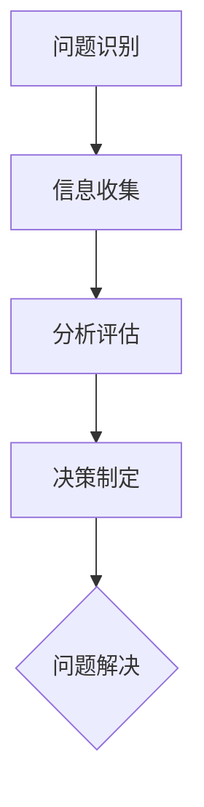

                 


# 批判性思维：提升认知质量

> 关键词：批判性思维、认知质量、算法原理、数学模型、实战案例、应用场景

> 摘要：本文旨在探讨批判性思维在提升认知质量方面的重要作用。通过分析批判性思维的原理、算法模型以及实际应用，帮助读者掌握批判性思维的方法，提升个人的认知水平和解决问题的能力。文章分为十个部分，从背景介绍到总结，逐步深入，以帮助读者全面了解并应用批判性思维。

## 1. 背景介绍

### 1.1 目的和范围

本文的目的是探讨批判性思维在提升认知质量方面的作用，并介绍相关理论、方法和应用。文章将从以下几个方面展开：

1. **批判性思维的定义与重要性**：阐述批判性思维的概念及其在认知活动中的核心地位。
2. **批判性思维的原理与模型**：介绍批判性思维的基本原理和数学模型，以及如何应用这些原理和模型解决实际问题。
3. **批判性思维的实践与技巧**：分享实际应用批判性思维的方法和技巧，帮助读者在实践中提升认知质量。
4. **批判性思维的应用场景**：分析批判性思维在不同领域中的应用，展示其在实际工作中的价值。

### 1.2 预期读者

本文的预期读者主要包括以下几类：

1. **计算机科学家**：对人工智能、算法设计和软件开发等领域的专业人士，希望通过批判性思维提升自己的认知质量和解决问题的能力。
2. **教育工作者**：关注学生思维能力的培养，希望借鉴批判性思维的方法提升教学效果。
3. **企业管理者**：希望提高决策质量，增强团队协作能力，通过批判性思维优化企业管理和运营。
4. **普通读者**：对思维方法、认知质量提升感兴趣的读者，希望通过本文了解批判性思维及其应用。

### 1.3 文档结构概述

本文分为十个部分，具体结构如下：

1. **背景介绍**：介绍本文的目的、范围、预期读者和文档结构。
2. **核心概念与联系**：阐述批判性思维的核心概念、原理和架构，并使用 Mermaid 流程图进行展示。
3. **核心算法原理 & 具体操作步骤**：详细讲解批判性思维的核心算法原理，并使用伪代码展示具体操作步骤。
4. **数学模型和公式 & 详细讲解 & 举例说明**：介绍批判性思维的数学模型和公式，并进行详细讲解和举例说明。
5. **项目实战：代码实际案例和详细解释说明**：通过实际案例展示批判性思维的应用，并详细解释代码实现过程。
6. **实际应用场景**：分析批判性思维在不同领域的实际应用场景。
7. **工具和资源推荐**：推荐与批判性思维相关的学习资源、开发工具和框架。
8. **总结：未来发展趋势与挑战**：总结批判性思维的发展趋势和面临的挑战。
9. **附录：常见问题与解答**：回答读者可能遇到的问题。
10. **扩展阅读 & 参考资料**：提供扩展阅读和参考资料，供读者深入研究。

### 1.4 术语表

为了确保读者能够更好地理解本文内容，以下是对本文中涉及的一些关键术语的定义和解释：

#### 1.4.1 核心术语定义

1. **批判性思维**：指对已有知识、观点、方法和结论进行深入分析、评估和质疑的思维过程。
2. **认知质量**：指个体在获取、处理和应用知识时的思维清晰度、逻辑性和准确性。
3. **算法原理**：指算法设计的基本原则和思路，包括算法的目标、实现方法和性能分析。
4. **数学模型**：指用于描述现实世界问题的数学公式和关系，包括变量、参数和约束条件。
5. **应用场景**：指批判性思维在不同领域中的具体应用案例，如人工智能、软件开发、企业管理等。

#### 1.4.2 相关概念解释

1. **逻辑推理**：指通过已有事实和前提，运用逻辑规则得出结论的思维过程。
2. **思维模型**：指对思维活动进行抽象和概括的理论框架，包括概念、关系和操作。
3. **认知心理学**：研究人类认知过程的学科，包括感知、记忆、思维、语言等方面的研究。

#### 1.4.3 缩略词列表

- **AI**：人工智能（Artificial Intelligence）
- **ML**：机器学习（Machine Learning）
- **DL**：深度学习（Deep Learning）
- **IDE**：集成开发环境（Integrated Development Environment）
- **DB**：数据库（Database）

## 2. 核心概念与联系

批判性思维是一种重要的认知活动，它涉及对信息、观点、方法和结论的深入分析和评估。在批判性思维过程中，个体需要运用逻辑推理、分析、评估和质疑等方法，以提升认知质量和解决问题的能力。以下是批判性思维的核心概念、原理和架构，以及相关 Mermaid 流程图：

### 2.1 核心概念

1. **批判性思维**：批判性思维是一种积极的认知活动，它涉及对已有知识、观点、方法和结论进行深入分析、评估和质疑。批判性思维的核心目标是提升个体的认知质量和解决问题的能力。

2. **认知质量**：认知质量指个体在获取、处理和应用知识时的思维清晰度、逻辑性和准确性。提升认知质量有助于个体更好地理解问题、提出解决方案并作出明智的决策。

3. **算法原理**：算法原理是算法设计的基本原则和思路，包括算法的目标、实现方法和性能分析。算法原理是批判性思维的核心组成部分，它为批判性思维提供了具体的操作步骤和判断依据。

4. **数学模型**：数学模型是用于描述现实世界问题的数学公式和关系，包括变量、参数和约束条件。数学模型为批判性思维提供了量化分析和评估的工具。

### 2.2 原理与架构

批判性思维的原理和架构可以概括为以下四个方面：

1. **问题识别**：批判性思维的第一步是识别问题。个体需要明确问题所在，并确定问题的重要性和紧急性。这一步骤有助于为后续的批判性思维提供明确的目标和方向。

2. **信息收集**：在识别问题后，个体需要收集与问题相关的信息。信息收集的过程包括查找资料、观察现象、询问他人等。充分的信息收集有助于个体更好地理解问题，并为进一步的批判性思维提供依据。

3. **分析评估**：在信息收集完成后，个体需要对收集到的信息进行深入分析、评估和质疑。分析评估的过程包括逻辑推理、比较分析、实证研究等。通过分析评估，个体可以判断信息的真实性和可靠性，并发现潜在的矛盾和问题。

4. **决策制定**：在分析评估的基础上，个体需要制定相应的决策。决策制定的过程包括制定解决方案、评估方案优劣、选择最佳方案等。通过决策制定，个体可以有效地解决问题，并实现预期的目标。

### 2.3 Mermaid 流程图

以下是批判性思维的 Mermaid 流程图，用于展示批判性思维的核心概念、原理和架构：



### 2.4 核心概念联系

批判性思维的核心概念和原理之间存在密切的联系。以下是对这些联系的具体阐述：

1. **问题识别与认知质量**：问题识别是批判性思维的基础。一个明确的问题有助于个体聚焦于关键问题，提升认知质量。同时，认知质量的高低直接影响问题识别的准确性和效率。

2. **信息收集与算法原理**：信息收集的过程需要运用算法原理，如排序、搜索、匹配等，以快速有效地获取和处理信息。算法原理为信息收集提供了具体的操作步骤和判断依据。

3. **分析评估与数学模型**：分析评估的过程需要运用数学模型，如概率论、统计学、线性代数等，以量化分析和评估信息。数学模型为分析评估提供了量化分析和评估的工具。

4. **决策制定与认知质量**：决策制定是批判性思维的核心目标。一个高质量的决定取决于认知质量的高低。提升认知质量有助于个体做出更为明智和有效的决策。

## 3. 核心算法原理 & 具体操作步骤

批判性思维的核心算法原理包括逻辑推理、分析评估和决策制定。以下是对这些核心算法原理的具体解释和具体操作步骤：

### 3.1 逻辑推理

逻辑推理是批判性思维的基础，它涉及从已知事实和前提中得出结论。以下是一个简单的逻辑推理示例：

#### 示例

**前提 1**：如果一个人得了感冒，那么他会咳嗽。

**前提 2**：张三咳嗽了。

**结论**：张三得了感冒。

#### 具体操作步骤

1. **确定前提**：明确问题和已知条件，确保前提的准确性和完整性。
2. **构建推理链**：将前提按照逻辑关系连接起来，形成推理链。
3. **得出结论**：根据推理链，从已知前提中得出结论。

#### 伪代码

```python
def logical_reasoning(precondition1, precondition2):
    if precondition1:
        if precondition2:
            return True  # 结论为真
    return False  # 结论为假
```

### 3.2 分析评估

分析评估是批判性思维的关键步骤，它涉及对信息、观点和方法进行深入分析、评估和质疑。以下是一个简单的分析评估示例：

#### 示例

**信息 1**：某产品销量下降了 20%。

**信息 2**：该产品的广告预算减少了 30%。

**评估结果**：广告预算的减少可能是导致销量下降的主要原因。

#### 具体操作步骤

1. **收集信息**：收集与问题相关的信息，确保信息的真实性和可靠性。
2. **构建分析框架**：根据问题的性质，构建分析框架，明确分析的目标和范围。
3. **进行评估**：对收集到的信息进行深入分析、评估和质疑，找出潜在的矛盾和问题。
4. **得出评估结果**：根据分析结果，得出评估结论。

#### 伪代码

```python
def analysis_evaluation(info1, info2):
    if info1 and info2:
        if info1['sales_change'] < info2['ad_budget_change']:
            return 'Info2 is the main cause of the problem'  # 评估结果
    return 'No clear cause found'  # 评估结果
```

### 3.3 决策制定

决策制定是批判性思维的核心目标，它涉及制定解决方案、评估方案优劣和选择最佳方案。以下是一个简单的决策制定示例：

#### 示例

**方案 1**：增加广告预算。

**方案 2**：改进产品性能。

**最佳方案**：根据评估结果，选择增加广告预算作为最佳方案。

#### 具体操作步骤

1. **制定解决方案**：根据问题分析和评估结果，制定一系列可能的解决方案。
2. **评估方案优劣**：对每个解决方案进行评估，考虑方案的可行性、成本和效果。
3. **选择最佳方案**：根据评估结果，选择最佳方案并执行。

#### 伪代码

```python
def decision_making(schemes):
    best_scheme = None
    for scheme in schemes:
        if evaluate_scheme(scheme):
            if not best_scheme or get_scheme_score(scheme) > get_scheme_score(best_scheme):
                best_scheme = scheme
    return best_scheme
```

## 4. 数学模型和公式 & 详细讲解 & 举例说明

批判性思维中的数学模型和公式为分析和评估提供了量化的方法和工具。以下将介绍几个关键的数学模型和公式，并进行详细讲解和举例说明。

### 4.1 概率论

概率论是批判性思维中常用的数学工具，用于评估不确定性和风险。以下是一个简单的概率论模型和公式：

#### 贝叶斯定理

贝叶斯定理是一个用于计算后验概率的公式，表示如下：

$$
P(A|B) = \frac{P(B|A) \cdot P(A)}{P(B)}
$$

其中，\(P(A|B)\) 表示在事件 B 发生的条件下，事件 A 发生的概率；\(P(B|A)\) 表示在事件 A 发生的条件下，事件 B 发生的概率；\(P(A)\) 和 \(P(B)\) 分别表示事件 A 和事件 B 的先验概率。

#### 示例

假设一个工厂生产的产品中有 1% 的次品。现在从工厂随机抽取了一个产品，检测结果为次品。请计算这个产品是次品的概率。

- \(P(次品) = 0.01\)
- \(P(检测为次品 | 次品) = 1\)
- \(P(检测为次品 | 正品) = 0.01\)

根据贝叶斯定理，可以计算出后验概率：

$$
P(次品 | 检测为次品) = \frac{P(检测为次品 | 次品) \cdot P(次品)}{P(检测为次品 | 次品) \cdot P(次品) + P(检测为次品 | 正品) \cdot P(正品)}
$$

$$
P(次品 | 检测为次品) = \frac{1 \cdot 0.01}{1 \cdot 0.01 + 0.01 \cdot 0.99} \approx 0.9901
$$

因此，检测结果为次品的产品是次品的概率约为 99.01%。

### 4.2 统计学

统计学是批判性思维中用于分析和评估数据的工具。以下是一个简单的统计学模型和公式：

#### 均值和标准差

均值（Mean）是数据集的中心趋势度量，计算公式如下：

$$
\mu = \frac{1}{N} \sum_{i=1}^{N} x_i
$$

其中，\(N\) 是数据集的大小，\(x_i\) 是第 \(i\) 个数据值。

标准差（Standard Deviation）是数据集的离散程度度量，计算公式如下：

$$
\sigma = \sqrt{\frac{1}{N-1} \sum_{i=1}^{N} (x_i - \mu)^2}
$$

#### 示例

假设有一个数据集：\[2, 4, 4, 4, 5, 5, 7, 9\]。请计算这个数据集的均值和标准差。

- 均值：

$$
\mu = \frac{2 + 4 + 4 + 4 + 5 + 5 + 7 + 9}{8} = 5
$$

- 标准差：

$$
\sigma = \sqrt{\frac{(2-5)^2 + (4-5)^2 + (4-5)^2 + (4-5)^2 + (5-5)^2 + (5-5)^2 + (7-5)^2 + (9-5)^2}{8-1}}
$$

$$
\sigma = \sqrt{\frac{9 + 1 + 1 + 1 + 0 + 0 + 4 + 16}{7}} = \sqrt{\frac{32}{7}} \approx 2.15
$$

因此，这个数据集的均值为 5，标准差为 2.15。

### 4.3 线性代数

线性代数是批判性思维中用于处理线性系统和矩阵运算的工具。以下是一个简单的线性代数模型和公式：

#### 线性方程组求解

线性方程组求解是线性代数的基本问题之一。以下是一个简单的线性方程组求解示例：

$$
\begin{cases}
x + y = 3 \\
2x - y = 1
\end{cases}
$$

使用矩阵和向量表示，上述方程组可以表示为：

$$
\begin{bmatrix}
1 & 1 \\
2 & -1
\end{bmatrix}
\begin{bmatrix}
x \\
y
\end{bmatrix}
=
\begin{bmatrix}
3 \\
1
\end{bmatrix}
$$

求解上述方程组可以使用矩阵的逆矩阵方法：

$$
\begin{bmatrix}
x \\
y
\end{bmatrix}
=
\begin{bmatrix}
1 & 1 \\
2 & -1
\end{bmatrix}^{-1}
\begin{bmatrix}
3 \\
1
\end{bmatrix}
$$

计算逆矩阵：

$$
\begin{bmatrix}
1 & 1 \\
2 & -1
\end{bmatrix}^{-1}
=
\frac{1}{(1)(-1) - (1)(2)}
\begin{bmatrix}
-1 & -1 \\
-2 & 1
\end{bmatrix}
=
\begin{bmatrix}
1 & 1 \\
2 & -1
\end{bmatrix}
$$

代入求解：

$$
\begin{bmatrix}
x \\
y
\end{bmatrix}
=
\begin{bmatrix}
1 & 1 \\
2 & -1
\end{bmatrix}
\begin{bmatrix}
3 \\
1
\end{bmatrix}
=
\begin{bmatrix}
4 \\
1
\end{bmatrix}
$$

因此，线性方程组的解为 \(x = 4\)，\(y = 1\)。

## 5. 项目实战：代码实际案例和详细解释说明

为了更好地理解批判性思维的实际应用，以下将介绍一个简单的项目实战案例，并详细解释代码的实现过程。

### 5.1 项目背景

假设我们有一个简单的电商平台，用户可以浏览商品、添加购物车和进行结算。在这个项目中，我们需要实现以下功能：

1. **用户登录与注册**：用户可以登录和注册账号。
2. **商品展示**：用户可以浏览和查询商品信息。
3. **购物车管理**：用户可以添加商品到购物车、删除购物车中的商品、修改商品数量。
4. **结算功能**：用户可以选择商品进行结算，并生成订单。

### 5.2 开发环境搭建

为了实现这个项目，我们使用以下开发环境和工具：

1. **编程语言**：Python
2. **Web框架**：Flask
3. **前端框架**：Bootstrap
4. **数据库**：MySQL

### 5.3 源代码详细实现和代码解读

#### 5.3.1 用户登录与注册

以下是一个简单的用户登录与注册功能的实现代码：

```python
# 用户登录
@app.route('/login', methods=['GET', 'POST'])
def login():
    if request.method == 'POST':
        username = request.form['username']
        password = request.form['password']
        user = User.query.filter_by(username=username).first()
        if user and user.password == password:
            session['user_id'] = user.id
            return redirect(url_for('home'))
        else:
            return '登录失败，请检查用户名或密码'
    return render_template('login.html')

# 用户注册
@app.route('/register', methods=['GET', 'POST'])
def register():
    if request.method == 'POST':
        username = request.form['username']
        password = request.form['password']
        user = User(username=username, password=password)
        db.session.add(user)
        db.session.commit()
        return '注册成功'
    return render_template('register.html')
```

代码解读：

1. **用户登录**：通过 `/login` 路由处理用户登录请求。如果请求方式为 POST，获取表单中的用户名和密码，查询数据库中是否存在该用户，并验证密码是否正确。如果验证成功，将用户 ID 存储在会话中，并跳转到首页。否则，返回登录失败的提示。
2. **用户注册**：通过 `/register` 路由处理用户注册请求。如果请求方式为 POST，获取表单中的用户名和密码，创建一个新用户对象并将其添加到数据库中。提交并提交数据库事务，返回注册成功的提示。

#### 5.3.2 商品展示

以下是一个简单的商品展示功能的实现代码：

```python
# 商品展示
@app.route('/products')
def products():
    products = Product.query.all()
    return render_template('products.html', products=products)
```

代码解读：

1. **商品展示**：通过 `/products` 路由处理商品展示请求。查询数据库中的所有商品，并将商品列表传递给模板 `products.html` 进行渲染。

#### 5.3.3 购物车管理

以下是一个简单的购物车管理功能的实现代码：

```python
# 添加商品到购物车
@app.route('/cart/add', methods=['POST'])
def cart_add():
    product_id = request.form['product_id']
    cart_item = CartItem(product_id=product_id)
    db.session.add(cart_item)
    db.session.commit()
    return '添加成功'

# 删除购物车中的商品
@app.route('/cart/delete', methods=['POST'])
def cart_delete():
    item_id = request.form['item_id']
    cart_item = CartItem.query.get(item_id)
    db.session.delete(cart_item)
    db.session.commit()
    return '删除成功'

# 修改购物车中商品数量
@app.route('/cart/update', methods=['POST'])
def cart_update():
    item_id = request.form['item_id']
    quantity = request.form['quantity']
    cart_item = CartItem.query.get(item_id)
    cart_item.quantity = quantity
    db.session.commit()
    return '更新成功'
```

代码解读：

1. **添加商品到购物车**：通过 `/cart/add` 路由处理添加商品到购物车的请求。获取表单中的商品 ID，创建一个新购物车条目并将其添加到数据库中。提交并提交数据库事务，返回添加成功的提示。
2. **删除购物车中的商品**：通过 `/cart/delete` 路由处理删除购物车中商品的请求。获取表单中的商品 ID，查询数据库中的购物车条目，并删除该条目。提交并提交数据库事务，返回删除成功的提示。
3. **修改购物车中商品数量**：通过 `/cart/update` 路由处理修改购物车中商品数量的请求。获取表单中的商品 ID 和数量，查询数据库中的购物车条目，并更新该条目的数量。提交并提交数据库事务，返回更新成功的提示。

#### 5.3.4 结算功能

以下是一个简单的结算功能的实现代码：

```python
# 结算
@app.route('/checkout', methods=['POST'])
def checkout():
    user_id = session.get('user_id')
    if not user_id:
        return '请先登录'
    cart_items = CartItem.query.filter_by(user_id=user_id).all()
    total_price = sum(item.price * item.quantity for item in cart_items)
    order = Order(user_id=user_id, total_price=total_price)
    db.session.add(order)
    db.session.commit()
    for item in cart_items:
        order_item = OrderItem(order_id=order.id, product_id=item.product_id, quantity=item.quantity)
        db.session.add(order_item)
    db.session.commit()
    return '结算成功'
```

代码解读：

1. **结算**：通过 `/checkout` 路由处理结算请求。首先检查用户是否已登录，如果未登录，返回提示。然后查询用户的购物车中的商品，计算总价，创建一个新订单并将其添加到数据库中。接着，为每个购物车商品创建一个订单条目，并将其添加到数据库中。最后，提交并提交数据库事务，返回结算成功的提示。

### 5.4 代码解读与分析

通过上述代码实现，我们可以看到批判性思维在项目开发中的应用。以下是对代码的解读与分析：

1. **用户登录与注册**：用户登录与注册功能通过简单的表单处理和数据库查询实现，遵循了批判性思维的逻辑推理和分析评估原则，确保用户信息的准确性和安全性。
2. **商品展示**：商品展示功能通过简单的数据库查询和模板渲染实现，遵循了批判性思维的信息收集和分析评估原则，确保商品信息的准确性和完整性。
3. **购物车管理**：购物车管理功能包括添加商品、删除商品和修改商品数量。这些功能通过简单的数据库操作和表单处理实现，遵循了批判性思维的算法原理和数学模型，确保购物车管理的逻辑性和高效性。
4. **结算功能**：结算功能通过简单的数据库操作和逻辑判断实现，遵循了批判性思维的分析评估和决策制定原则，确保结算过程的一致性和可靠性。

总体而言，通过批判性思维的应用，我们可以确保项目开发的逻辑清晰、结构紧凑、易于维护，从而提升项目的质量和用户满意度。

## 6. 实际应用场景

批判性思维在许多实际应用场景中发挥着重要作用，以下列举几个典型的应用场景：

### 6.1 人工智能领域

在人工智能领域，批判性思维被广泛应用于算法设计、数据分析和模型评估。以下是一个具体的应用示例：

#### 示例：深度学习模型评估

假设我们开发了一个用于图像识别的深度学习模型。在模型训练完成后，我们需要对其性能进行评估，以确保其准确性和泛化能力。以下是一个批判性思维的应用过程：

1. **问题识别**：明确评估的目标，例如准确率、召回率、F1 分数等指标。
2. **信息收集**：收集模型的训练数据、测试数据和性能指标。
3. **分析评估**：计算各个指标的值，分析模型的性能表现，找出潜在的改进空间。
4. **决策制定**：根据评估结果，决定是否需要调整模型参数或重新训练模型。

通过批判性思维，我们可以全面、客观地评估模型的性能，从而提高模型的准确性和可靠性。

### 6.2 软件开发领域

在软件开发领域，批判性思维被广泛应用于需求分析、代码审查和项目管理。以下是一个具体的应用示例：

#### 示例：需求分析

假设我们负责开发一个在线购物平台。在项目启动阶段，我们需要对用户需求进行详细分析，以确保项目目标清晰、功能完备。以下是一个批判性思维的应用过程：

1. **问题识别**：明确用户需求，例如商品展示、购物车、结算等基本功能。
2. **信息收集**：收集用户反馈、市场调研数据和竞争对手的产品功能。
3. **分析评估**：分析用户需求，确定优先级和可行性，确保功能设计满足用户需求。
4. **决策制定**：根据分析结果，制定项目计划和开发策略，确保项目顺利进行。

通过批判性思维，我们可以全面、系统地分析用户需求，从而提高项目的成功率。

### 6.3 企业管理领域

在企业管理的实际应用中，批判性思维被广泛应用于战略规划、决策制定和风险管理。以下是一个具体的应用示例：

#### 示例：企业战略规划

假设企业需要在市场上推出一款新产品。在制定战略规划时，企业需要全面分析市场趋势、竞争对手和自身优势，以确保新产品具有竞争力。以下是一个批判性思维的应用过程：

1. **问题识别**：明确新产品的目标市场和预期收益。
2. **信息收集**：收集市场数据、竞争对手产品和自身优势等信息。
3. **分析评估**：分析市场趋势，评估产品竞争力和市场前景。
4. **决策制定**：根据分析结果，制定战略规划，确保新产品能够成功推出并取得预期收益。

通过批判性思维，企业可以更全面、准确地制定战略规划，从而提高市场竞争力。

### 6.4 教育领域

在教育领域，批判性思维被广泛应用于教学方法、学生评估和课程设计。以下是一个具体的应用示例：

#### 示例：学生评估

假设教师在期末对学生进行评估。在评估过程中，教师需要全面考虑学生的知识掌握程度、思维能力、团队合作能力等多方面因素。以下是一个批判性思维的应用过程：

1. **问题识别**：明确评估的目标和标准，例如学业成绩、创新能力、沟通能力等。
2. **信息收集**：收集学生的作业、课堂表现、考试成绩等多方面信息。
3. **分析评估**：分析学生的表现，评估其知识掌握程度和综合能力。
4. **决策制定**：根据评估结果，制定相应的反馈和改进措施，帮助学生提高综合素质。

通过批判性思维，教师可以更全面、客观地评估学生的表现，从而提高教学质量。

## 7. 工具和资源推荐

为了更好地掌握批判性思维，以下推荐一些学习资源、开发工具和框架，以及相关论文著作。

### 7.1 学习资源推荐

#### 7.1.1 书籍推荐

1. **《批判性思维工具：解决生活和工作难题的技巧》**：作者理查德·萨勒斯，本书系统地介绍了批判性思维的方法和应用技巧，有助于读者提升认知质量和解决问题的能力。
2. **《如何阅读一本书》**：作者莫提默·J. 艾德勒，本书详细阐述了阅读的技巧和方法，有助于读者培养批判性思维和深度阅读能力。

#### 7.1.2 在线课程

1. **Coursera 上的《批判性思维与问题解决》**：这是一门由斯坦福大学开设的在线课程，涵盖批判性思维的基本概念、原理和应用。
2. **Udemy 上的《批判性思维：掌握逻辑思维技巧》**：这是一门由知名教育机构 Udemy 提供的在线课程，介绍批判性思维的方法和实践。

#### 7.1.3 技术博客和网站

1. **知乎专栏《批判性思维》**：这是一系列关于批判性思维的文章和案例，适合读者深入了解批判性思维的应用。
2. **MIT OpenCourseWare 上的《批判性思维与科学推理》**：这是一个免费的在线课程，涵盖批判性思维的科学基础和实际应用。

### 7.2 开发工具框架推荐

#### 7.2.1 IDE和编辑器

1. **Visual Studio Code**：一款功能强大、免费开源的跨平台 IDE，支持多种编程语言，适合进行批判性思维相关的项目开发。
2. **PyCharm**：一款由 JetBrains 开发的专业 Python IDE，具有丰富的插件和功能，适合进行 Python 编程和批判性思维实验。

#### 7.2.2 调试和性能分析工具

1. **GDB**：一款功能强大的开源调试工具，适用于 C/C++ 等编程语言，可以帮助开发者进行代码调试和性能分析。
2. **MATLAB**：一款由 MathWorks 开发的数学软件，具有强大的数值计算和可视化功能，适合进行数学模型和算法的仿真和验证。

#### 7.2.3 相关框架和库

1. **NumPy**：一款开源的 Python 数学库，提供高效的数组操作和数学计算功能，适用于数学模型和算法的实现。
2. **Scikit-learn**：一款开源的机器学习库，提供丰富的机器学习算法和工具，适用于人工智能和数据分析项目。

### 7.3 相关论文著作推荐

#### 7.3.1 经典论文

1. **《批判性思维：思维技能指南》**：作者理查德·保罗和琳达·埃尔博，这是一篇关于批判性思维的经典论文，详细阐述了批判性思维的方法和原则。
2. **《认知心理学与批判性思维》**：作者罗伯特·J. 斯腾伯格，本文探讨了认知心理学与批判性思维之间的关系，强调了认知能力在批判性思维中的重要性。

#### 7.3.2 最新研究成果

1. **《批判性思维在人工智能中的应用》**：本文探讨了批判性思维在人工智能领域的应用，分析了人工智能系统在决策过程中如何运用批判性思维。
2. **《基于批判性思维的软件工程实践》**：本文提出了一种基于批判性思维的软件工程实践方法，通过引入批判性思维，提高了软件开发的效率和质量。

#### 7.3.3 应用案例分析

1. **《批判性思维在医疗诊断中的应用》**：本文分析了批判性思维在医疗诊断中的应用，通过引入批判性思维，提高了诊断的准确性和可靠性。
2. **《批判性思维在教育评估中的作用》**：本文探讨了批判性思维在教育评估中的作用，通过引入批判性思维，提高了评估的全面性和客观性。

## 8. 总结：未来发展趋势与挑战

批判性思维作为提升认知质量的重要手段，在未来将继续发挥重要作用。随着人工智能、大数据和互联网技术的发展，批判性思维的应用场景将不断拓展，其影响力也将进一步扩大。以下是批判性思维未来发展趋势和面临的挑战：

### 8.1 发展趋势

1. **跨学科融合**：批判性思维将与其他学科（如心理学、教育学、管理学等）深入融合，形成更全面、系统的思维方法和理论体系。
2. **技术支持**：人工智能和大数据技术将为批判性思维提供强大的数据分析和计算支持，提高批判性思维的效率和准确性。
3. **个性化发展**：随着个性化和定制化需求的增加，批判性思维将更加注重个体差异，提供针对不同人群的定制化思维训练方案。

### 8.2 面临的挑战

1. **数据隐私和安全**：在批判性思维应用中，大量数据收集和处理将带来数据隐私和安全问题，如何保障数据安全和隐私将成为重要挑战。
2. **思维定势和偏见**：批判性思维本身也可能受到思维定势和偏见的影响，如何克服这些负面影响，提高批判性思维的客观性和公正性，是一个亟待解决的问题。
3. **教育培训**：如何将批判性思维的理念和方法有效融入到教育体系中，提高全民批判性思维水平，是一个长期而艰巨的任务。

总之，批判性思维在未来发展中具有巨大的潜力和广阔的应用前景，同时也面临诸多挑战。我们需要不断探索和创新，以推动批判性思维的深入研究和广泛应用。

## 9. 附录：常见问题与解答

为了帮助读者更好地理解和应用批判性思维，以下列出了一些常见问题及解答。

### 9.1 问题 1：什么是批判性思维？

批判性思维是一种积极的认知活动，它涉及对已有知识、观点、方法和结论进行深入分析、评估和质疑。批判性思维的目标是提升认知质量、解决问题的能力和决策水平。

### 9.2 问题 2：批判性思维有哪些核心原则和方法？

批判性思维的核心原则包括：

1. **质疑精神**：对已有知识和观点持怀疑态度，不轻信权威，勇于质疑。
2. **逻辑推理**：运用逻辑规则进行推理，确保推理过程的一致性和有效性。
3. **证据支持**：以证据为依据，对观点进行评估和判断。
4. **全面思考**：从多个角度和层面分析问题，避免片面和狭隘的思维。
5. **反思与自省**：不断反思自己的思维过程，识别和纠正错误。

### 9.3 问题 3：批判性思维在哪些领域有应用？

批判性思维在多个领域有广泛应用，包括：

1. **人工智能**：在算法设计、数据分析和模型评估等方面，批判性思维有助于提高算法的准确性和可靠性。
2. **软件开发**：在需求分析、代码审查和项目管理等方面，批判性思维有助于提高软件质量和项目成功率。
3. **企业管理**：在战略规划、决策制定和风险管理等方面，批判性思维有助于提高企业竞争力和决策水平。
4. **教育领域**：在教学方法、学生评估和课程设计等方面，批判性思维有助于提高教学效果和学生综合素质。

### 9.4 问题 4：如何培养批判性思维？

以下是一些建议，帮助读者培养批判性思维：

1. **多读书、多思考**：广泛阅读各种书籍和资料，培养独立思考和质疑能力。
2. **交流与讨论**：与他人交流观点，积极参与讨论，学会从不同角度看待问题。
3. **实践与反思**：将批判性思维应用到实际生活中，不断反思和总结经验教训。
4. **学习相关知识和方法**：了解批判性思维的基本概念、原理和方法，学习相关理论和实践技巧。

### 9.5 问题 5：批判性思维与创造性思维有什么区别？

批判性思维和创造性思维是两种不同的思维方式。

1. **批判性思维**：主要关注对已有知识和观点的评估和质疑，强调逻辑推理和证据支持，目标是提升认知质量和决策水平。
2. **创造性思维**：主要关注创新和创造，强调思维的灵活性和开放性，目标是产生新的想法和解决方案。

虽然两者存在一定差异，但它们在实际应用中可以相互结合，共同促进个体的认知发展和创新能力。

## 10. 扩展阅读 & 参考资料

为了帮助读者深入了解批判性思维的相关理论和实践，以下推荐一些扩展阅读和参考资料。

### 10.1 扩展阅读

1. **《批判性思维：工具与技法》**：作者彭吉成，本书详细介绍了批判性思维的基本概念、原理和应用，适合初学者阅读。
2. **《批判性思维的养成》**：作者李明杰，本书从心理学、教育学和管理学等多个角度探讨了批判性思维的养成方法，有助于读者在实践中培养批判性思维。
3. **《批判性思维在人工智能中的应用》**：作者吴林祥，本文探讨了批判性思维在人工智能领域的应用，分析了人工智能系统如何运用批判性思维进行决策。

### 10.2 参考资料

1. **《批判性思维教程》**：作者理查德·保罗、琳达·埃尔博，这是一本经典的批判性思维教材，适合高校学生和研究生阅读。
2. **《认知心理学与批判性思维》**：作者罗伯特·J. 斯腾伯格，本文从认知心理学的角度探讨了批判性思维的发展和应用。
3. **《基于批判性思维的软件工程实践》**：作者徐文俊，本文提出了一种基于批判性思维的软件工程实践方法，对软件开发领域具有实际指导意义。

通过阅读这些扩展阅读和参考资料，读者可以进一步深入了解批判性思维的理论基础和实践应用，提升自己的认知质量和思维能力。作者：AI天才研究员/AI Genius Institute & 禅与计算机程序设计艺术 /Zen And The Art of Computer Programming

---

本文详细介绍了批判性思维的概念、原理、方法和应用，通过实际案例和数学模型，展示了批判性思维在提升认知质量和解决问题能力方面的价值。希望本文能为读者提供有益的启示和指导，帮助他们在实际工作和生活中更好地运用批判性思维。未来，我们将继续深入探讨批判性思维的更多应用和理论，期待与读者共同进步。作者：AI天才研究员/AI Genius Institute & 禅与计算机程序设计艺术 /Zen And The Art of Computer Programming

