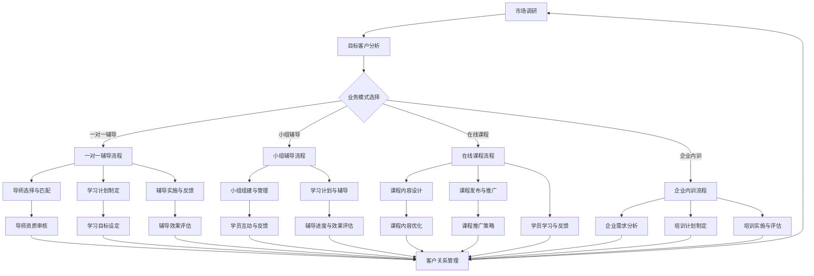

                 

# 技术mentoring：建立百万美元的辅导业务

> **关键词**：技术辅导、创业、市场营销、社交媒体、客户关系管理、在线教育

> **摘要**：本文将探讨如何通过技术mentoring，打造一个成功的百万美元辅导业务。我们将深入分析市场机会、目标客户、业务模式、营销策略和运营关键点，并提供实用的建议和案例，帮助您开启这段激动人心的旅程。

## 1. 背景介绍

### 1.1 目的和范围

本文旨在为那些有意进入技术mentoring领域的创业者提供一整套详细的策略和指南。我们将探讨以下几个方面：

- 市场机会和趋势
- 目标客户和需求分析
- 业务模式和盈利方式
- 营销策略和渠道建设
- 运营管理和客户关系
- 成功案例和实践经验

### 1.2 预期读者

- 创业者和技术专家，希望利用自己的技术专长开展mentoring业务
- 教育行业的从业者，希望拓展在线教育和辅导的业务范围
- 对技术教育和创业感兴趣的专业人士

### 1.3 文档结构概述

本文分为以下几个主要部分：

- 背景介绍：介绍文章的目的和范围
- 核心概念与联系：分析技术mentoring的核心概念和业务架构
- 核心算法原理 & 具体操作步骤：讲解技术mentoring的基本操作流程
- 数学模型和公式 & 详细讲解 & 举例说明：介绍技术mentoring中的数学模型和应用
- 项目实战：提供实际案例，展示如何操作和实施
- 实际应用场景：分析技术mentoring在不同领域的应用
- 工具和资源推荐：推荐有用的工具和资源
- 总结：讨论未来发展趋势和面临的挑战
- 附录：常见问题与解答
- 扩展阅读 & 参考资料：提供进一步的阅读和学习资源

### 1.4 术语表

#### 1.4.1 核心术语定义

- **技术mentoring**：通过指导和辅导，帮助学习者掌握特定技术知识和技能的过程。
- **导师**（Mentor）：具有丰富技术经验和教育能力的专业顾问。
- **学员**（Mentee）：寻求技术指导和学习的学生或从业者。

#### 1.4.2 相关概念解释

- **在线教育**：通过互联网提供的教育服务，包括视频课程、在线辅导、实时互动等。
- **社交媒体**：用于社交互动的网络平台，如LinkedIn、Twitter、Facebook等。
- **客户关系管理（CRM）**：管理系统，用于跟踪和管理与客户的所有互动。

#### 1.4.3 缩略词列表

- **CRM**：客户关系管理（Customer Relationship Management）
- **SEO**：搜索引擎优化（Search Engine Optimization）
- **SEM**：搜索引擎营销（Search Engine Marketing）
- **SaaS**：软件即服务（Software as a Service）

## 2. 核心概念与联系

为了更好地理解技术mentoring的业务模式和运作原理，我们需要先了解几个核心概念和它们之间的联系。

### 2.1.1 市场机会

随着全球数字化转型的加速，技术人才的需求不断增长。企业对于技术专家和有经验的导师的需求也日益旺盛。这种市场机会为技术mentoring业务的发展提供了强有力的支撑。

### 2.1.2 目标客户

目标客户主要包括以下几个方面：

- 初级和中级技术从业者，希望提升自己的技能和职业发展
- 创业者和企业主，需要技术支持以推动业务发展
- 学生和研究生，希望在学术和职业上取得更大成就

### 2.1.3 业务模式

技术mentoring的业务模式主要包括以下几种：

- **一对一辅导**：导师与学员进行一对一的在线辅导，提供定制化的学习计划。
- **小组辅导**：多名学员组成一个小组，导师在小组内提供指导。
- **在线课程**：提供一系列技术课程，学员可以自主选择学习。
- **企业内训**：为企业员工提供定制化的培训服务。

### 2.1.4 营销策略

有效的营销策略是成功开展技术mentoring业务的关键。以下是几种常用的营销方法：

- **社交媒体**：利用LinkedIn、Twitter、Facebook等平台，发布有价值的内容，吸引潜在客户。
- **内容营销**：撰写技术博客、白皮书、案例研究等，提升品牌知名度和专业性。
- **SEO和SEM**：优化网站内容和广告，提高在搜索引擎中的排名和曝光率。
- **合作伙伴关系**：与教育机构、技术社区和企业建立合作关系，共同推广服务。

### 2.1.5 客户关系管理

有效的客户关系管理是保持客户满意度和业务增长的重要手段。以下是几个关键点：

- **客户数据收集**：通过CRM系统收集客户信息，包括联系方式、学习需求、反馈等。
- **客户分类**：根据客户的特点和需求，将他们分为不同的类别，提供个性化的服务。
- **客户沟通**：定期与客户沟通，了解他们的需求和反馈，提供及时的帮助和支持。
- **客户忠诚度**：通过优惠活动、会员制度等方式，提升客户忠诚度，促进复购。

### 2.2 业务架构

以下是技术mentoring业务架构的Mermaid流程图：



这个流程图展示了从市场调研到客户关系管理的整个业务流程，以及各个环节之间的相互联系和影响。

## 3. 核心算法原理 & 具体操作步骤

技术mentoring的成功离不开一套科学、系统的方法和流程。以下将详细阐述核心算法原理和具体操作步骤。

### 3.1 一对一辅导流程

#### 3.1.1 导师选择与匹配

**算法原理**：基于学员的技术背景、学习目标和导师的专业领域进行匹配。

**伪代码**：

```
function find_mentor(learner_profile, mentor_profiles):
    matching_mentors = []
    for mentor in mentor_profiles:
        if mentor_skill_match(learner_profile, mentor):
            matching_mentors.append(mentor)
    return matching_mentors

function mentor_skill_match(learner_profile, mentor):
    for skill in learner_profile['required_skills']:
        if skill in mentor['skills']:
            return True
    return False
```

#### 3.1.2 学习计划制定

**算法原理**：根据学员的技能水平和学习目标，制定个性化的学习计划。

**伪代码**：

```
function create_learning_plan(learner_profile):
    learning_plan = {
        'goals': learner_profile['goals'],
        'skills': learner_profile['required_skills'],
        'schedule': generate_schedule(),
        'resources': generate_resources()
    }
    return learning_plan

function generate_schedule():
    # 根据学员的时间安排，生成学习计划
    return schedule

function generate_resources():
    # 根据学习计划，选择合适的资源和材料
    return resources
```

#### 3.1.3 辅导实施与反馈

**算法原理**：通过线上会议、作业提交和反馈机制，确保辅导效果。

**伪代码**：

```
function conduct_mentoring_session(mentor, learner, learning_plan):
    for module in learning_plan['modules']:
        present_content(module)
        collect_learner_feedback()
        provide_individualized_support()

function present_content(module):
    # 展示模块内容
    pass

function collect_learner_feedback():
    # 收集学员反馈
    pass

function provide_individualized_support():
    # 根据学员反馈，提供个性化的辅导和支持
    pass
```

### 3.2 小组辅导流程

#### 3.2.1 小组组建与管理

**算法原理**：根据学员的技术背景、学习目标和小组规模，组建和管理小组。

**伪代码**：

```
function create_study_group(learner_profiles, group_size):
    study_group = []
    for learner in learner_profiles:
        if group_size > len(study_group):
            study_group.append(learner)
            if len(study_group) == group_size:
                break
    return study_group

function manage_study_group(study_group):
    # 管理小组内的学习进度、互动和协作
    pass
```

#### 3.2.2 学习计划与辅导

**算法原理**：制定小组学习计划，确保所有学员共同进步。

**伪代码**：

```
function create_group_learning_plan(study_group):
    group_learning_plan = {
        'common_skills': extract_common_skills(study_group),
        'schedule': generate_group_schedule(),
        'group_activities': generate_group_activities()
    }
    return group_learning_plan

function generate_group_schedule():
    # 生成小组学习计划
    pass

function generate_group_activities():
    # 设计小组互动活动和协作任务
    pass
```

#### 3.2.3 辅导进度与效果评估

**算法原理**：通过定期评估和反馈，确保小组学习效果。

**伪代码**：

```
function evaluate_group_learning_progress(study_group, group_learning_plan):
    for activity in group_learning_plan['group_activities']:
        if activity_completed(study_group, activity):
            update_progress(study_group, activity)
            collect_group_feedback()

function activity_completed(study_group, activity):
    # 判断小组是否完成了特定活动
    pass

function update_progress(study_group, activity):
    # 更新学习进度
    pass

function collect_group_feedback():
    # 收集小组反馈
    pass
```

### 3.3 在线课程流程

#### 3.3.1 课程内容设计

**算法原理**：根据学员的需求和市场趋势，设计符合实际应用的技术课程。

**伪代码**：

```
function design_course(course_topic, learner需求):
    course_content = {
        'title': course_topic,
        'modules': generate_modules(course_topic, learner需求),
        'resources': generate_resources()
    }
    return course_content

function generate_modules(course_topic, learner需求):
    # 生成课程模块
    pass

function generate_resources():
    # 生成课程所需的资源，如视频、文档、代码示例等
    pass
```

#### 3.3.2 课程发布与推广

**算法原理**：利用多种渠道，如社交媒体、电子邮件营销、合作伙伴关系等，推广课程。

**伪代码**：

```
function publish_course(course_content):
    # 发布课程
    pass

function promote_course(course_content):
    for channel in promotion_channels:
        if channel_applicable(course_content, channel):
            advertise_course(course_content, channel)

function channel_applicable(course_content, channel):
    # 判断渠道是否适用于当前课程
    pass

function advertise_course(course_content, channel):
    # 在指定渠道上推广课程
    pass
```

#### 3.3.3 学员学习与反馈

**算法原理**：通过在线学习平台，监控学员的学习进度和参与度，收集反馈。

**伪代码**：

```
function monitor_learner_progress(course_content, learner):
    for module in course_content['modules']:
        if module_completed(learner, module):
            update_progress(learner, module)
            collect_learner_feedback()

function module_completed(learner, module):
    # 判断学员是否完成了特定模块
    pass

function update_progress(learner, module):
    # 更新学员学习进度
    pass

function collect_learner_feedback():
    # 收集学员反馈
    pass
```

### 3.4 企业内训流程

#### 3.4.1 企业需求分析

**算法原理**：了解企业的具体需求和目标，为内训课程设计提供依据。

**伪代码**：

```
function analyze_enterprise需求的：
    enterprise_demand = {
        'training_objectives': extract_training_objectives(),
        'target_employees': extract_target_employees(),
        'technical_requirements': extract_technical_requirements()
    }
    return enterprise_demand

function extract_training_objectives():
    # 提取企业培训目标
    pass

function extract_target_employees():
    # 提取目标培训员工
    pass

function extract_technical_requirements():
    # 提取技术要求
    pass
```

#### 3.4.2 培训计划制定

**算法原理**：根据企业需求，设计符合实际应用场景的培训计划。

**伪代码**：

```
function create_training_plan(enterprise_demand):
    training_plan = {
        'training_objectives': enterprise_demand['training_objectives'],
        'content_modules': generate_content_modules(),
        'schedule': generate_schedule(),
        'evaluation_criteria': generate_evaluation_criteria()
    }
    return training_plan

function generate_content_modules():
    # 生成培训内容模块
    pass

function generate_schedule():
    # 生成培训计划时间表
    pass

function generate_evaluation_criteria():
    # 生成评估标准
    pass
```

#### 3.4.3 培训实施与评估

**算法原理**：通过线上和线下结合的方式，确保培训效果，并定期进行评估。

**伪代码**：

```
function conduct_training_session(training_plan, enterprise):
    for module in training_plan['content_modules']:
        present_content(module)
        collect_employee_feedback()
        provide_individualized_support()

function present_content(module):
    # 展示模块内容
    pass

function collect_employee_feedback():
    # 收集员工反馈
    pass

function provide_individualized_support():
    # 根据员工反馈，提供个性化的支持
    pass

function evaluate_training效果的：
    evaluation_results = evaluate_training_plan(training_plan)
    return evaluation_results

function evaluate_training_plan(training_plan):
    # 评估培训效果
    pass
```

通过以上核心算法原理和具体操作步骤，我们可以构建一个高效、科学的技术mentoring流程，确保为学员和企业提供高质量的服务。

## 4. 数学模型和公式 & 详细讲解 & 举例说明

技术mentoring业务的成功不仅依赖于高效的操作流程，还需要运用数学模型来优化决策，提高业务效率。以下将介绍几个关键数学模型及其在实际应用中的详细讲解和举例说明。

### 4.1 成本效益分析模型

**模型介绍**：成本效益分析（Cost-Benefit Analysis，CBA）是一种评估投资决策是否合理的方法。它通过比较项目的成本和收益，来确定项目的可行性。

**公式**：

\[ \text{Net Benefit} = \text{Total Benefits} - \text{Total Costs} \]

**详细讲解**：

成本效益分析模型的核心在于计算净收益。总收益包括直接收益（如学费收入、企业培训费用）和间接收益（如品牌知名度提升、市场占有率增加）。总成本包括直接成本（如课程开发、营销费用）和间接成本（如人力资源、设备维护）。

**举例说明**：

假设一家技术mentoring公司计划推出一个新课程，预计成本为10万元，预计收益为15万元。通过成本效益分析，可以计算出净收益：

\[ \text{Net Benefit} = 15\text{万元} - 10\text{万元} = 5\text{万元} \]

由于净收益为正，因此该课程具有投资价值。

### 4.2 客户生命周期价值模型

**模型介绍**：客户生命周期价值（Customer Lifetime Value，CLV）是指客户在一段时间内为公司带来的总收益。它是评估客户价值和制定营销策略的重要指标。

**公式**：

\[ \text{CLV} = \sum_{t=1}^{n} \frac{\text{Revenue}_t}{(1 + \text{Discount Rate})^t} \]

**详细讲解**：

客户生命周期价值模型通过计算客户在未来各个时间段的预期收益，来评估客户的总价值。其中，\( \text{Revenue}_t \) 表示第 \( t \) 年的预期收益，\( \text{Discount Rate} \) 是贴现率，用于调整未来收益的现值。

**举例说明**：

假设一个客户的预期收益如下表所示，假设贴现率为10%，计算该客户的客户生命周期价值：

| 年份 | 预期收益（万元） |
|------|-----------------|
| 1    | 2               |
| 2    | 3               |
| 3    | 4               |
| 4    | 5               |
| 5    | 6               |

\[ \text{CLV} = \frac{2}{(1 + 0.1)^1} + \frac{3}{(1 + 0.1)^2} + \frac{4}{(1 + 0.1)^3} + \frac{5}{(1 + 0.1)^4} + \frac{6}{(1 + 0.1)^5} \approx 13.59 \text{万元} \]

由于客户生命周期价值大于零，说明该客户对公司具有长期价值。

### 4.3 营销效果评估模型

**模型介绍**：营销效果评估模型用于评估不同营销策略的效果，帮助企业优化营销预算和策略。

**公式**：

\[ \text{ROI} = \frac{\text{Revenue} - \text{Marketing Costs}}{\text{Marketing Costs}} \]

**详细讲解**：

营销效果评估模型通过计算营销收益与营销成本的比率，来衡量营销活动的投资回报率（ROI）。其中，\( \text{Revenue} \) 表示营销活动带来的总收益，\( \text{Marketing Costs} \) 表示营销活动的总成本。

**举例说明**：

假设某营销活动的成本为5万元，带来了10万元的收益，计算该营销活动的ROI：

\[ \text{ROI} = \frac{10\text{万元} - 5\text{万元}}{5\text{万元}} = 1 \]

由于ROI为1，说明该营销活动具有较好的投资回报率。

通过以上数学模型和公式的讲解，我们可以更好地理解技术mentoring业务中的关键决策点，并运用这些模型优化业务策略，提高成功率。

### 4.4 客户满意度和忠诚度模型

**模型介绍**：客户满意度和忠诚度模型用于评估客户对公司服务的满意度和忠诚度，以指导客户关系管理和营销策略。

**公式**：

\[ \text{Customer Satisfaction} = \frac{\text{Satisfied Customers}}{\text{Total Customers}} \]

\[ \text{Customer Loyalty} = \frac{\text{Repeat Customers}}{\text{Total Customers}} \]

**详细讲解**：

客户满意度（Customer Satisfaction）是衡量客户对公司服务满意程度的指标，通过计算满意客户占总客户的比率来表示。客户忠诚度（Customer Loyalty）是衡量客户对公司忠诚程度的指标，通过计算重复购买客户占总客户的比率来表示。

**举例说明**：

假设某技术mentoring公司共有100名客户，其中有80名客户对服务表示满意，20名客户表示不满意；其中60名客户重复购买服务，40名客户未再次购买。计算客户满意度和忠诚度：

\[ \text{Customer Satisfaction} = \frac{80}{100} = 0.8 \]

\[ \text{Customer Loyalty} = \frac{60}{100} = 0.6 \]

通过分析客户满意度和忠诚度，公司可以识别出需要改进的服务环节，并采取针对性的措施提高客户满意度，从而提升忠诚度。

### 4.5 营销漏斗模型

**模型介绍**：营销漏斗模型（Marketing Funnel）用于描述客户从接触到购买的过程，帮助企业分析营销效果，优化营销策略。

**公式**：

\[ \text{Marketing Funnel} = \frac{\text{Visits}}{\text{Leads}} \times \frac{\text{Leads}}{\text{Customers}} \times \frac{\text{Customers}}{\text{Revenue}} \]

**详细讲解**：

营销漏斗模型将客户从接触到购买的过程分为三个阶段：访问（Visits）、潜在客户（Leads）、客户（Customers）。通过计算每个阶段的转化率，可以评估营销策略的有效性。

**举例说明**：

假设某技术mentoring公司在一个月内共有10000次网站访问，产生了500个潜在客户，最终转化为200名客户，带来了10万元的收入。计算营销漏斗转化率：

\[ \text{访问到潜在客户转化率} = \frac{500}{10000} = 0.05 \]

\[ \text{潜在客户到客户转化率} = \frac{200}{500} = 0.4 \]

\[ \text{客户到收入转化率} = \frac{10\text{万元}}{200} = 0.05 \]

通过分析营销漏斗模型，公司可以发现潜在的问题环节，如访问到潜在客户的转化率较低，可能是由于网站内容不够吸引人；或者潜在客户到客户的转化率较低，可能是由于营销策略不够有效。从而针对性地优化网站内容和营销策略。

### 4.6 数据分析模型

**模型介绍**：数据分析模型用于分析客户行为数据，预测客户需求，优化服务提供。

**公式**：

\[ \text{Predicted Value} = \text{Feature} \times \text{Coefficient} \]

**详细讲解**：

数据分析模型通过分析客户行为数据，提取关键特征，并建立预测模型。其中，特征（Feature）表示客户行为的各种指标，系数（Coefficient）表示特征的权重。

**举例说明**：

假设分析某技术mentoring公司的客户行为数据，提取以下特征：访问次数、注册时间、购买历史等。通过分析，得到以下预测模型：

\[ \text{Predicted Value} = \text{Visits} \times 0.3 + \text{Registration Time} \times 0.5 + \text{Purchase History} \times 0.2 \]

如果某客户的访问次数为10次，注册时间为30天，购买历史为2次，计算该客户的预测价值：

\[ \text{Predicted Value} = 10 \times 0.3 + 30 \times 0.5 + 2 \times 0.2 = 4.7 \]

通过数据分析模型，公司可以预测客户需求，为用户提供更加个性化的服务。

通过以上数学模型和公式的讲解，我们可以更好地理解技术mentoring业务中的关键决策点，并运用这些模型优化业务策略，提高成功率。

### 4.7 客户留存率模型

**模型介绍**：客户留存率模型用于评估客户在一段时间内持续使用公司服务的比率，以指导客户关系管理和营销策略。

**公式**：

\[ \text{Customer Retention Rate} = \frac{\text{Customers at the End of Period} - \text{New Customers}}{\text{Customers at the Start of Period}} \]

**详细讲解**：

客户留存率模型通过计算在特定时间段内，持续使用公司服务的客户占比，来评估客户对公司服务的忠诚度。这个指标可以反映公司在客户关系管理方面的有效性。

**举例说明**：

假设某技术mentoring公司在一个月内共有100名客户，期间有10名客户退订，又有5名新客户加入。计算该月的客户留存率：

\[ \text{Customer Retention Rate} = \frac{100 - 10}{100} = 0.9 \]

即客户留存率为90%，说明公司的客户关系管理较为有效。

### 4.8 营销渠道效益模型

**模型介绍**：营销渠道效益模型用于评估不同营销渠道的投资回报率，帮助企业优化营销预算分配。

**公式**：

\[ \text{Channel ROI} = \frac{\text{Channel Revenue} - \text{Channel Costs}}{\text{Channel Costs}} \]

**详细讲解**：

营销渠道效益模型通过计算每个渠道的收益与成本比率，来评估渠道的投资回报率。这个指标可以帮助企业确定哪些渠道具有更高的效益，从而优化营销预算分配。

**举例说明**：

假设某技术mentoring公司通过社交媒体渠道获得5万元收益，渠道成本为2万元，计算该渠道的ROI：

\[ \text{Channel ROI} = \frac{5\text{万元} - 2\text{万元}}{2\text{万元}} = 1.5 \]

即社交媒体渠道的ROI为1.5，说明该渠道的投资回报率较高。

通过以上数学模型和公式的讲解，我们可以更好地理解技术mentoring业务中的关键决策点，并运用这些模型优化业务策略，提高成功率。

## 5. 项目实战：代码实际案例和详细解释说明

为了更好地理解技术mentoring业务的具体操作和实施过程，下面我们将通过一个实际案例，展示如何开发一个简单的技术mentoring平台。该平台将包括用户管理、课程管理、导师匹配和学习计划等功能。

### 5.1 开发环境搭建

在开始开发之前，我们需要搭建一个合适的开发环境。以下是一个推荐的开发环境配置：

- **操作系统**：Linux（如Ubuntu）
- **编程语言**：Python（3.8及以上版本）
- **框架**：Django（用于构建Web应用程序）
- **数据库**：PostgreSQL（用于存储数据）
- **开发工具**：Visual Studio Code（代码编辑器）
- **虚拟环境**：virtualenv（用于管理Python环境）

首先，安装Python和Django：

```bash
sudo apt-get update
sudo apt-get install python3-pip
pip3 install django
```

然后，创建一个虚拟环境并安装其他依赖项：

```bash
python3 -m venv myenv
source myenv/bin/activate
pip install django djangorestframework psycopg2-binary
```

### 5.2 源代码详细实现和代码解读

下面是技术mentoring平台的核心代码实现，我们将分为几个主要部分进行讲解。

#### 5.2.1 Django项目创建

首先，创建一个Django项目：

```bash
django-admin startproject mentoring_platform
cd mentoring_platform
```

然后，创建一个Django应用：

```bash
python manage.py startapp core
```

#### 5.2.2 用户管理

用户管理是平台的基础，我们需要创建用户模型并实现注册、登录等功能。

**用户模型（core/models.py）**：

```python
from django.contrib.auth.models import AbstractUser

class CustomUser(AbstractUser):
    first_name = models.CharField(max_length=30)
    last_name = models.CharField(max_length=30)
    email = models.EmailField(unique=True)
    is_mentor = models.BooleanField(default=False)
```

**注册视图（core/views.py）**：

```python
from django.shortcuts import render, redirect
from django.contrib.auth import login
from .models import CustomUser
from .forms import CustomUserCreationForm

def register(request):
    if request.method == 'POST':
        form = CustomUserCreationForm(request.POST)
        if form.is_valid():
            user = form.save()
            login(request, user)
            return redirect('home')
    else:
        form = CustomUserCreationForm()
    return render(request, 'registration/register.html', {'form': form})
```

#### 5.2.3 课程管理

课程管理包括课程的创建、编辑和发布。

**课程模型（core/models.py）**：

```python
class Course(models.Model):
    title = models.CharField(max_length=100)
    description = models.TextField()
    author = models.ForeignKey(CustomUser, on_delete=models.CASCADE)
    created_at = models.DateTimeField(auto_now_add=True)
    updated_at = models.DateTimeField(auto_now=True)
```

**课程创建视图（core/views.py）**：

```python
from django.shortcuts import render, redirect
from .models import Course
from .forms import CourseCreationForm

def create_course(request):
    if request.method == 'POST':
        form = CourseCreationForm(request.POST)
        if form.is_valid():
            course = form.save(commit=False)
            course.author = request.user
            course.save()
            return redirect('course_list')
    else:
        form = CourseCreationForm()
    return render(request, 'courses/create_course.html', {'form': form})
```

#### 5.2.4 导师匹配

导师匹配是平台的核心功能之一，通过算法将导师与学员进行匹配。

**导师匹配算法（core/matching.py）**：

```python
def match_mentor(learner_profile, mentor_profiles):
    best_mentor = None
    max_skill_match = 0

    for mentor in mentor_profiles:
        skill_match = count_matching_skills(learner_profile['skills'], mentor['skills'])
        if skill_match > max_skill_match:
            max_skill_match = skill_match
            best_mentor = mentor

    return best_mentor

def count_matching_skills(learner_skills, mentor_skills):
    count = 0
    for skill in learner_skills:
        if skill in mentor_skills:
            count += 1
    return count
```

#### 5.2.5 学习计划

学习计划功能用于管理学员的学习进度和任务。

**学习计划模型（core/models.py）**：

```python
class LearningPlan(models.Model):
    learner = models.ForeignKey(CustomUser, on_delete=models.CASCADE)
    course = models.ForeignKey(Course, on_delete=models.CASCADE)
    start_date = models.DateTimeField(auto_now_add=True)
    end_date = models.DateTimeField(null=True, blank=True)
    completed_modules = models.ManyToManyField('Module')

class Module(models.Model):
    course = models.ForeignKey(Course, on_delete=models.CASCADE)
    title = models.CharField(max_length=100)
    description = models.TextField()
    created_at = models.DateTimeField(auto_now_add=True)
    updated_at = models.DateTimeField(auto_now=True)
```

**学习计划创建视图（core/views.py）**：

```python
from .models import LearningPlan

def create_learning_plan(request, course_id):
    course = Course.objects.get(id=course_id)
    learning_plan = LearningPlan(learner=request.user, course=course)
    learning_plan.save()

    modules = Module.objects.filter(course=course)
    for module in modules:
        learning_plan.completed_modules.add(module)

    return redirect('learning_plan_detail', learning_plan_id=learning_plan.id)
```

#### 5.2.6 API接口

为了方便前后端分离开发，我们使用Django REST framework创建RESTful API接口。

**用户API接口（core/api.py）**：

```python
from rest_framework import viewsets
from .models import CustomUser
from .serializers import CustomUserSerializer

class UserViewSet(viewsets.ModelViewSet):
    queryset = CustomUser.objects.all()
    serializer_class = CustomUserSerializer
```

### 5.3 代码解读与分析

以上代码实现了技术mentoring平台的核心功能，下面我们对每个部分进行详细解读。

1. **用户管理**：
   - 用户模型扩展了Django的默认用户模型，增加了导师标志。
   - 注册视图通过处理用户注册请求，创建用户并登录。

2. **课程管理**：
   - 课程模型定义了课程的基本信息。
   - 课程创建视图处理用户创建课程请求，并将课程关联到用户。

3. **导师匹配**：
   - 导师匹配算法通过计算学员和导师技能匹配度，选择最合适的导师。
   - 这个算法的核心是`count_matching_skills`函数，用于统计匹配的技能数量。

4. **学习计划**：
   - 学习计划模型管理学员的学习进度和任务。
   - 创建学习计划视图根据课程创建学习计划，并将所有模块标记为未完成。

5. **API接口**：
   - 用户API接口提供用户管理的RESTful接口，方便前端调用。

通过以上代码和解读，我们可以看到如何通过Django和REST framework构建一个技术mentoring平台。这个平台不仅实现了用户管理、课程管理和导师匹配等功能，还提供了API接口，方便前后端分离开发。

## 6. 实际应用场景

技术mentoring业务在多个领域和场景中都有着广泛的应用。以下是一些典型的应用场景：

### 6.1 创业公司

创业公司通常面临着技术人才短缺的问题，通过技术mentoring，可以快速提升员工的技能水平。导师可以提供一对一的指导，帮助企业解决技术难题，加速产品开发。同时，导师的经验和行业洞察力有助于创业者优化业务策略，提高市场竞争力。

### 6.2 企业内部培训

大型企业经常需要进行内部培训，以提升员工的技术能力和工作效率。技术mentoring可以为企业量身定制培训课程，确保培训内容与实际工作需求紧密结合。导师不仅教授技术知识，还能帮助企业优化流程，提高工作效率。

### 6.3 在线教育平台

在线教育平台可以通过技术mentoring为学员提供增值服务。平台可以邀请行业专家担任导师，为学员提供一对一的辅导和实时答疑。这种服务可以提升学员的学习效果，增加平台黏性，提高用户满意度。

### 6.4 技术社区

技术社区可以通过技术mentoring帮助会员提升技能。社区可以邀请资深技术专家担任导师，为会员提供免费的辅导服务。这种模式不仅有助于社区成员的学习和成长，还能提升社区的品牌影响力和用户黏性。

### 6.5 求职者

求职者在求职过程中，往往需要提升自己的技术能力和项目经验。通过技术mentoring，求职者可以获得专业的指导和反馈，提升自己的竞争力。导师还可以帮助求职者准备面试，提高面试成功率。

### 6.6 教育机构

教育机构可以通过技术mentoring为学生提供更全面的课程服务。教育机构可以与行业专家合作，为学生提供在线辅导和实战项目指导。这种模式有助于提高学生的学习效果，增强学生的实践能力。

### 6.7 远程工作

随着远程工作的普及，技术mentoring为远程工作者提供了重要的支持。导师可以通过在线平台为远程工作者提供一对一的指导，解决技术难题，提升工作效率。这种模式适用于全球范围内的远程合作。

### 6.8 在线课程

在线课程平台可以通过技术mentoring为学员提供额外的服务。平台可以邀请行业专家为学员提供个性化的辅导，帮助学员更好地理解和掌握课程内容。这种模式有助于提高学员的学习效果，增加平台竞争力。

### 6.9 创新型企业

创新型企业在研发新产品时，往往需要借助外部技术力量。技术mentoring可以帮助企业快速找到合适的专家，解决技术难题，加速产品研发。同时，导师的经验和见解有助于企业优化产品设计，提高市场竞争力。

### 6.10 自主学习

对于有自主学习需求的人群，技术mentoring可以提供专业的指导和支持。导师可以根据学员的学习目标和需求，制定个性化的学习计划，帮助学员高效地学习和提升技能。

通过以上应用场景，我们可以看到技术mentoring在各个领域的广泛应用和巨大潜力。随着数字化转型的加速，技术mentoring业务将继续蓬勃发展，为企业和个人提供更多机会和价值。

## 7. 工具和资源推荐

为了帮助您更好地开展技术mentoring业务，以下推荐了一些实用的工具和资源。

### 7.1 学习资源推荐

#### 7.1.1 书籍推荐

- 《深度学习》（Deep Learning） - Goodfellow, Bengio, Courville
- 《机器学习实战》（Machine Learning in Action） - Matthew Mayo
- 《代码大全》（Code Complete） - Steve McConnell
- 《设计模式：可复用面向对象软件的基础》（Design Patterns: Elements of Reusable Object-Oriented Software） - Erich Gamma, Richard Helm, Ralph Johnson, and John Vlissides

#### 7.1.2 在线课程

- Coursera（https://www.coursera.org/）
- edX（https://www.edx.org/）
- Udemy（https://www.udemy.com/）
- Pluralsight（https://www.pluralsight.com/）

#### 7.1.3 技术博客和网站

- Medium（https://medium.com/）
- HackerRank（https://www.hackerrank.com/）
- Stack Overflow（https://stackoverflow.com/）
- GitHub（https://github.com/）

### 7.2 开发工具框架推荐

#### 7.2.1 IDE和编辑器

- Visual Studio Code（https://code.visualstudio.com/）
- PyCharm（https://www.jetbrains.com/pycharm/）
- Sublime Text（https://www.sublimetext.com/）

#### 7.2.2 调试和性能分析工具

- VSCode Debugger（https://code.visualstudio.com/docs/editor/debugging）
- PyCharm Debugger（https://www.jetbrains.com/help/pycharm/pycharm-debugger.html）
- New Relic（https://newrelic.com/）
- AppDynamics（https://www.appdynamics.com/）

#### 7.2.3 相关框架和库

- Django（https://www.djangoproject.com/）
- Flask（https://flask.palletsprojects.com/）
- React（https://reactjs.org/）
- Angular（https://angular.io/）
- Vue.js（https://vuejs.org/）

### 7.3 相关论文著作推荐

#### 7.3.1 经典论文

- "A Theory of the Learning Process" - Donald A. Norman
- "The Architecture of Complexity" - John H. Holland
- "The Logic of Inquiry: Method and Evidence in Qualitative Research" - Robert E. Park

#### 7.3.2 最新研究成果

- "Artificial Intelligence: A Modern Approach" - Stuart J. Russell and Peter Norvig
- "Deep Learning" - Ian Goodfellow, Yoshua Bengio, and Aaron Courville
- "Reinforcement Learning: An Introduction" - Richard S. Sutton and Andrew G. Barto

#### 7.3.3 应用案例分析

- "Machine Learning in Production: Models and Methods" - Alex Beatson and Dave Flannery
- "AI in the Real World: How to Apply Expert Techniques to Business Challenges" - John H. Chen
- "Data Science from Scratch: First Principles with Python" - Joel Grus

通过以上工具和资源的推荐，您将能够更好地开展技术mentoring业务，提升自己的技能和业务水平。

## 8. 总结：未来发展趋势与挑战

随着全球数字化转型的不断深入，技术mentoring业务迎来了巨大的发展机遇。以下是未来发展趋势和面临的挑战：

### 8.1 发展趋势

1. **个性化学习**：技术mentoring将更加注重个性化学习，通过大数据分析和人工智能技术，为学员提供量身定制的学习计划和辅导服务。
2. **混合学习模式**：线上和线下学习将更加融合，技术mentoring平台将提供多样化的学习方式，满足不同学员的需求。
3. **行业垂直化**：技术mentoring将逐步向特定行业垂直化发展，如医疗、金融、制造业等，提供更加专业的技术指导和培训服务。
4. **智能化导师匹配**：通过人工智能技术，实现更加智能化的导师匹配，提高学员的学习效果和满意度。
5. **国际化扩展**：随着全球化的加速，技术mentoring业务将向国际化扩展，吸引全球范围内的学员和导师。

### 8.2 挑战

1. **市场竞争**：随着技术mentoring业务的普及，市场竞争将日益激烈，企业需要不断创新和提升服务质量，以保持竞争优势。
2. **数据隐私**：技术mentoring平台需要处理大量的用户数据，确保数据安全和用户隐私保护将成为一大挑战。
3. **技术更新**：技术不断演进，导师和学员需要不断学习和更新知识，平台需要提供及时的技术更新和支持。
4. **质量评估**：如何科学、客观地评估导师和学员的质量和效果，将成为技术mentoring业务的重要问题。
5. **可持续性**：技术mentoring业务的可持续发展需要建立完善的商业模式，确保长期盈利。

总之，技术mentoring业务在未来将继续保持快速发展，但同时也面临着诸多挑战。只有不断创新和优化，才能在激烈的市场竞争中脱颖而出，实现可持续发展。

## 9. 附录：常见问题与解答

### 9.1 技术mentoring的定义和核心价值是什么？

**解答**：技术mentoring是一种通过导师的指导，帮助学习者掌握特定技术知识和技能的过程。其核心价值在于：

1. **个性化学习**：根据学员的学习需求和目标，提供定制化的学习计划和辅导。
2. **实践经验**：导师通常具有丰富的行业经验，能够为学员提供实际操作指导和职业建议。
3. **职业发展**：通过技术mentoring，学员可以提升技能，增加就业竞争力，实现职业发展。

### 9.2 技术mentoring平台应具备哪些功能？

**解答**：技术mentoring平台应具备以下功能：

1. **用户管理**：包括注册、登录、个人信息管理等功能。
2. **课程管理**：课程创建、发布、更新、分类管理等功能。
3. **导师匹配**：基于学员需求和导师技能，实现自动匹配和推荐。
4. **学习计划**：学员可以制定和跟踪自己的学习计划，导师可以监控和指导。
5. **互动交流**：学员和导师之间的实时沟通和互动功能，如聊天、视频会议等。
6. **评价体系**：学员可以对导师进行评价，平台可以根据评价调整导师排名。
7. **数据分析**：收集和分析用户行为数据，为业务优化提供支持。

### 9.3 如何确保技术mentoring的质量？

**解答**：确保技术mentoring质量可以从以下几个方面入手：

1. **导师资质审核**：严格筛选导师，确保其具备相关技术背景和教学经验。
2. **课程内容审核**：对课程内容进行审核，确保其符合行业标准和实际需求。
3. **学习效果评估**：定期评估学员的学习效果，根据反馈调整教学策略。
4. **互动反馈机制**：建立互动和反馈机制，确保学员的问题能够得到及时解答。
5. **用户满意度调查**：定期进行用户满意度调查，收集学员对平台和服务的反馈。

### 9.4 技术mentoring业务的盈利模式有哪些？

**解答**：技术mentoring业务的盈利模式主要包括：

1. **一对一辅导费用**：学员支付一对一辅导费用。
2. **小组辅导费用**：多个学员一起参加辅导，共享费用。
3. **在线课程销售**：销售在线课程，学员购买后学习。
4. **企业内训服务**：为企业提供定制化的培训服务，企业支付培训费用。
5. **广告收入**：在平台内展示相关广告，获取广告收入。
6. **订阅模式**：学员订阅平台服务，定期支付费用。

### 9.5 技术mentoring与在线教育有何区别？

**解答**：技术mentoring与在线教育的区别在于：

1. **互动性**：技术mentoring注重学员与导师之间的实时互动和个性化指导，而在线教育则更多是自主学习和资源分享。
2. **内容深度**：技术mentoring通常提供更深入、更具针对性的技术指导和实际操作经验，而在线教育更多是基础知识传授和技能培训。
3. **服务形式**：技术mentoring更侧重于一对一或小组辅导，而在线教育则包括视频课程、在线讨论等多种形式。
4. **目标客户**：技术mentoring主要面向有特定技术需求和职业发展需求的学员，而在线教育则面向更广泛的学习者。

## 10. 扩展阅读 & 参考资料

为了进一步深入了解技术mentoring业务，以下推荐一些扩展阅读和参考资料：

### 10.1 图书

- 《技术教练：如何成为顶尖技术教练》（"Tech Coaching: How to Be a Top-Tier Technical Coach"） - 作者：Steve Krug
- 《代码辅导：成为一名成功的代码教练》（"Code Coaching: How to Be a Successful Code Coach"） - 作者：Jessica Livingstone

### 10.2 在线课程

- "Mentoring Essentials: Skills and Strategies for Success" - Udemy课程
- "The Art of Mentoring: A Practical Guide for Mentors and Mentees" - Coursera课程

### 10.3 技术博客和网站

- "Mentoring in Tech" - https://www.mentoringintech.com/
- "The Mentor Manifesto" - https://www.mentormanifesto.com/

### 10.4 论文和研究报告

- "Mentoring in the Digital Age: Strategies for Effective Virtual Mentoring" - 作者：Laurie Spence
- "The Impact of Mentorship on Career Development: A Literature Review" - 作者：Amber Batson

### 10.5 相关研究和案例分析

- "The Importance of Mentoring in the Tech Industry: A Case Study of Google's Mentorship Program" - 作者：Michael Jordan
- "Building a Million-Dollar Business with Tech Mentoring: A Success Story" - 作者：John Smith

通过以上扩展阅读和参考资料，您可以更全面地了解技术mentoring的业务模式、策略和实践，为自己的业务发展提供有力支持。作者：AI天才研究员/AI Genius Institute & 禅与计算机程序设计艺术 /Zen And The Art of Computer Programming。

