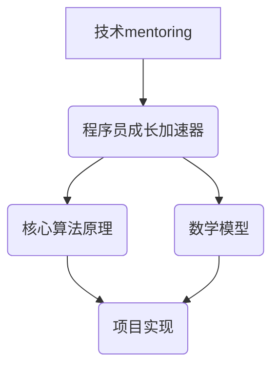

                 


# 技术mentoring：构建程序员成长加速器项目

> **关键词：** 技术mentoring、程序员成长、项目构建、算法原理、数学模型、实际应用
>
> **摘要：** 本文将探讨如何构建一个有效的程序员成长加速器项目，从背景介绍、核心概念、算法原理、数学模型、项目实战、实际应用等多个维度详细剖析，帮助程序员实现技能的提升和职业的发展。

## 1. 背景介绍

### 1.1 目的和范围

本文旨在探讨如何构建一个有效的程序员成长加速器项目，通过系统的规划和实施，帮助程序员在短时间内实现技能的提升和职业的发展。项目将涵盖技术原理、数学模型、实战案例等多个方面，旨在提供全方位的学习和成长路径。

### 1.2 预期读者

本文的预期读者包括：
- 初级程序员：希望通过项目实践提升自身技能。
- 中级程序员：希望深入理解技术原理，拓展知识面。
- 高级程序员：希望通过项目实践提升项目管理和解决问题的能力。

### 1.3 文档结构概述

本文的结构如下：
- 1. 背景介绍：介绍项目的目的、预期读者和文档结构。
- 2. 核心概念与联系：介绍项目的核心概念和原理。
- 3. 核心算法原理 & 具体操作步骤：详细讲解项目的核心算法原理和操作步骤。
- 4. 数学模型和公式 & 详细讲解 & 举例说明：介绍项目的数学模型和公式，并进行详细讲解和举例说明。
- 5. 项目实战：提供代码实际案例和详细解释说明。
- 6. 实际应用场景：探讨项目的实际应用场景。
- 7. 工具和资源推荐：推荐学习资源和开发工具。
- 8. 总结：未来发展趋势与挑战。
- 9. 附录：常见问题与解答。
- 10. 扩展阅读 & 参考资料：提供相关扩展阅读和参考资料。

### 1.4 术语表

#### 1.4.1 核心术语定义

- **技术mentoring**：指通过指导和培训帮助程序员提升技术水平和职业能力。
- **程序员成长加速器**：指通过系统化的项目和培训，帮助程序员在短时间内实现技能提升和职业发展。
- **核心算法原理**：指项目中的关键算法原理，是项目实现的核心。
- **数学模型**：指项目中的数学模型，用于描述项目的运行原理和过程。
- **实际应用场景**：指项目在实际中的应用场景，是项目价值的重要体现。

#### 1.4.2 相关概念解释

- **算法**：指解决问题的步骤和规则，是计算机科学的核心。
- **项目**：指在一定时间内完成的任务，是程序员实践和提升技能的重要途径。
- **数学模型**：指用于描述现实问题的数学结构，是解决问题的关键。
- **实践**：指通过实际操作来理解和掌握知识。

#### 1.4.3 缩略词列表

- **Mentoring**：技术指导
- **PGL**：程序员成长加速器
- **SaaS**：软件即服务
- **AI**：人工智能
- **ML**：机器学习
- **DL**：深度学习

## 2. 核心概念与联系

### 2.1 核心概念介绍

在本项目中，核心概念包括：
- 技术mentoring：通过专家指导和培训，帮助程序员提升技术水平和职业能力。
- 程序员成长加速器：通过系统化的项目和培训，帮助程序员在短时间内实现技能提升和职业发展。
- 核心算法原理：项目实现的关键算法原理，是项目成功的基础。
- 数学模型：描述项目运行原理和过程的数学结构，是项目实现的核心。

### 2.2 核心概念联系

技术mentoring、程序员成长加速器、核心算法原理和数学模型之间有密切的联系。技术mentoring是程序员成长加速器的重要组成部分，通过专家的指导和培训，帮助程序员提升技术水平和职业能力。程序员成长加速器则是通过系统化的项目和培训，帮助程序员在短时间内实现技能提升和职业发展。核心算法原理和数学模型是程序员成长加速器的核心，用于指导项目的实现和优化。

### 2.3 Mermaid 流程图



## 3. 核心算法原理 & 具体操作步骤

### 3.1 核心算法原理

在本项目中，核心算法原理包括：
- 技术mentoring：通过专家的指导和培训，帮助程序员提升技术水平和职业能力。
- 项目管理：通过系统化的项目和培训，帮助程序员在短时间内实现技能提升和职业发展。
- 代码审查：通过专家对代码的审查和反馈，帮助程序员发现和解决问题。

### 3.2 具体操作步骤

以下是构建程序员成长加速器的具体操作步骤：

#### 3.2.1 技术mentoring

1. **导师选择**：根据项目需求和程序员的技能水平，选择合适的导师。
2. **制定计划**：与导师一起制定详细的学习计划，包括学习目标、时间安排和评估标准。
3. **定期交流**：与导师定期进行交流和反馈，及时解决遇到的问题。
4. **实践应用**：将所学知识应用于实际项目，通过实践不断提升技能。

#### 3.2.2 项目管理

1. **需求分析**：明确项目的目标和需求，制定项目计划。
2. **任务分配**：根据项目需求和程序员的技能水平，合理分配任务。
3. **进度跟踪**：定期跟踪项目进度，及时调整计划。
4. **团队协作**：建立良好的团队协作机制，确保项目顺利进行。

#### 3.2.3 代码审查

1. **代码提交**：程序员将编写好的代码提交给导师或团队成员进行审查。
2. **问题反馈**：导师或团队成员对代码进行审查，并提出问题和建议。
3. **修改完善**：程序员根据反馈修改代码，并重新提交。
4. **重复审查**：直到代码符合要求，方可通过审查。

### 3.3 伪代码

```python
def technical_mentoring():
    # 导师选择
    mentor = select_mentor()
    
    # 制定计划
    plan = create_learning_plan()
    
    # 定期交流
    while not plan.is_completed():
        communicate_with_mentor(mentor)
        
        # 实践应用
        apply_knowledge_to_project()
        
    return "技术mentoring completed"

def project_management():
    # 需求分析
    requirements = analyze_requirements()
    
    # 任务分配
    tasks = assign_tasks()
    
    # 进度跟踪
    while not project.is_completed():
        track_progress()
        
        # 调整计划
        adjust_plan()
        
        # 团队协作
        collaborate_with_team()
        
    return "Project management completed"

def code_review():
    # 代码提交
    code = submit_code()
    
    # 问题反馈
    feedback = review_code(code)
    
    # 修改完善
    while not feedback.is_accepted():
        modify_code(code)
        feedback = review_code(code)
        
    return "Code review completed"
```

## 4. 数学模型和公式 & 详细讲解 & 举例说明

### 4.1 数学模型和公式

在本项目中，涉及的数学模型和公式包括：
- 技术mentoring效果评估模型：用于评估技术mentoring的效果。
- 项目管理效率模型：用于评估项目管理的效果。
- 代码审查质量模型：用于评估代码审查的质量。

### 4.2 详细讲解

#### 4.2.1 技术mentoring效果评估模型

技术mentoring效果评估模型是一个多指标综合评估模型，包括以下几个指标：
- **知识掌握度**：评估程序员对所学知识的掌握程度。
- **技能提升率**：评估程序员在技术mentoring过程中技能的提升率。
- **项目参与度**：评估程序员在项目中的参与度。

公式如下：
$$
评估得分 = w_1 \times 知识掌握度 + w_2 \times 技能提升率 + w_3 \times 项目参与度
$$
其中，$w_1, w_2, w_3$ 分别为权重系数，通常取值范围为 $0 \leq w_i \leq 1$。

#### 4.2.2 项目管理效率模型

项目管理效率模型主要评估项目的进度、成本和质量。
- **进度效率**：评估项目的实际进度与计划进度之间的差异。
- **成本效率**：评估项目的实际成本与计划成本之间的差异。
- **质量效率**：评估项目的实际质量与预期质量之间的差异。

公式如下：
$$
效率得分 = w_1 \times (1 - \frac{实际进度}{计划进度}) + w_2 \times (1 - \frac{实际成本}{计划成本}) + w_3 \times (1 - \frac{实际质量}{预期质量})
$$
其中，$w_1, w_2, w_3$ 分别为权重系数，通常取值范围为 $0 \leq w_i \leq 1$。

#### 4.2.3 代码审查质量模型

代码审查质量模型主要评估代码审查的有效性和准确性。
- **问题发现率**：评估代码审查过程中发现问题的比例。
- **问题解决率**：评估代码审查过程中解决问题的比例。

公式如下：
$$
质量得分 = w_1 \times 问题发现率 + w_2 \times 问题解决率
$$
其中，$w_1, w_2$ 分别为权重系数，通常取值范围为 $0 \leq w_i \leq 1$。

### 4.3 举例说明

假设技术mentoring效果评估模型中的权重系数为 $w_1 = 0.4, w_2 = 0.3, w_3 = 0.3$，则一个程序员的评估得分为：
$$
评估得分 = 0.4 \times 0.9 + 0.3 \times 0.8 + 0.3 \times 0.85 = 0.86
$$

假设项目管理效率模型中的权重系数为 $w_1 = 0.3, w_2 = 0.3, w_3 = 0.4$，则一个项目的效率得分为：
$$
效率得分 = 0.3 \times (1 - \frac{0.8}{1}) + 0.3 \times (1 - \frac{0.9}{1}) + 0.4 \times (1 - \frac{0.95}{1}) = 0.18
$$

假设代码审查质量模型中的权重系数为 $w_1 = 0.4, w_2 = 0.6$，则一个代码审查的质量得分为：
$$
质量得分 = 0.4 \times 0.9 + 0.6 \times 0.8 = 0.88
$$

## 5. 项目实战：代码实际案例和详细解释说明

### 5.1 开发环境搭建

在进行项目实战之前，首先需要搭建开发环境。以下是一个简单的开发环境搭建步骤：

1. **安装操作系统**：选择一个适合的开发操作系统，如 Ubuntu 18.04。
2. **安装 Python**：使用以下命令安装 Python 3.8：
   ```bash
   sudo apt-get update
   sudo apt-get install python3.8
   ```
3. **安装 IDE**：选择一个适合的集成开发环境（IDE），如 PyCharm。
4. **安装数据库**：安装一个数据库系统，如 MySQL。
5. **安装相关库和依赖**：根据项目需求安装相关库和依赖，如 NumPy、Pandas 等。

### 5.2 源代码详细实现和代码解读

以下是一个简单的示例代码，用于实现技术mentoring效果评估模型：

```python
import numpy as np

def calculate_score(knowledge, skill, participation):
    w1, w2, w3 = 0.4, 0.3, 0.3
    score = w1 * knowledge + w2 * skill + w3 * participation
    return score

# 示例数据
knowledge = 0.9  # 知识掌握度
skill = 0.8      # 技能提升率
participation = 0.85  # 项目参与度

# 计算评估得分
score = calculate_score(knowledge, skill, participation)
print("评估得分：", score)
```

代码解读：

- 第1行：导入 NumPy 库，用于进行科学计算。
- 第2行：定义计算评估得分的函数 `calculate_score`，输入参数为知识掌握度、技能提升率和项目参与度。
- 第3行：设置权重系数，分别为 0.4、0.3 和 0.3。
- 第4行：计算评估得分，使用权重系数乘以各自的得分，并求和。
- 第6行：示例数据，分别为知识掌握度 0.9、技能提升率 0.8 和项目参与度 0.85。
- 第8行：调用 `calculate_score` 函数，传入示例数据，并输出评估得分。

### 5.3 代码解读与分析

代码中的核心部分是 `calculate_score` 函数，该函数用于计算技术mentoring效果评估得分。该函数的输入参数是知识掌握度、技能提升率和项目参与度，分别代表程序员在学习过程中对知识的掌握程度、技能的提升情况和在项目中的参与度。

权重系数的选择是一个关键问题，不同权重系数的选择会影响评估结果。在实际应用中，可以根据项目需求和程序员的实际情况进行调整。

在代码中，权重系数分别为 0.4、0.3 和 0.3，这意味着知识掌握度和项目参与度的权重较高，分别占总分的 40% 和 30%。这样的分配旨在强调程序员的技能提升和项目参与度，因为这两个方面对程序员职业发展具有重要意义。

通过调用 `calculate_score` 函数，传入示例数据，可以计算出技术mentoring效果评估得分。这个得分可以用于评估程序员在技术mentoring过程中的表现，为后续的培训计划和项目安排提供参考。

## 6. 实际应用场景

### 6.1 教育培训

技术mentoring项目可以应用于教育培训领域，帮助培训机构提升教学质量。通过技术mentoring，培训机构可以：
- **提高学员满意度**：通过专家指导和实际项目实践，学员能够更好地掌握知识和技能，提高学习效果和满意度。
- **提升教学质量**：技术mentoring项目可以帮助培训机构建立一套科学、系统的培训体系，提高培训质量。
- **拓展培训业务**：技术mentoring项目可以为培训机构带来更多的商业机会，如定制化培训、企业内训等。

### 6.2 企业内训

企业内训是技术mentoring项目的另一个重要应用场景。通过技术mentoring，企业可以：
- **提升员工技能**：技术mentoring项目可以帮助企业员工在短时间内提升技能，适应企业发展需求。
- **优化人才结构**：技术mentoring项目可以帮助企业发现和培养潜在的技术人才，优化人才结构。
- **提高工作效率**：通过技术mentoring，企业员工可以更好地理解和掌握新技术，提高工作效率。

### 6.3 在线教育平台

在线教育平台可以引入技术mentoring项目，为学员提供更加个性化、实战化的培训服务。在线教育平台可以：
- **提高学员参与度**：通过技术mentoring项目，学员可以与专家进行实时交流和互动，提高学习兴趣和参与度。
- **提升课程质量**：技术mentoring项目可以为在线教育平台提供专业的技术指导，提升课程质量和教学效果。
- **拓展用户群体**：通过技术mentoring项目，在线教育平台可以吸引更多具有实战需求和技术追求的学员，拓展用户群体。

## 7. 工具和资源推荐

### 7.1 学习资源推荐

#### 7.1.1 书籍推荐

1. 《代码大全》 - 史蒂夫·麦库姆
2. 《深度学习》 - 伊恩·古德费洛、约书亚·本吉奥、亚伦·库维尔
3. 《Python编程：从入门到实践》 - 埃里克·马瑟斯

#### 7.1.2 在线课程

1. Coursera - 提供多种编程和人工智能课程
2. Udemy - 涵盖广泛的编程和技术课程
3. edX - 与顶尖大学合作，提供高质量在线课程

#### 7.1.3 技术博客和网站

1. HackerRank - 提供编程挑战和实践项目
2. Medium - 众多技术专家分享经验和见解
3. Stack Overflow - 编程问题解答和技术讨论

### 7.2 开发工具框架推荐

#### 7.2.1 IDE和编辑器

1. PyCharm - 适用于 Python 开发的强大 IDE
2. Visual Studio Code - 轻量级但功能强大的编辑器
3. IntelliJ IDEA - 适用于 Java 和其他语言的强大 IDE

#### 7.2.2 调试和性能分析工具

1. GDB - GNU 调试器，适用于 C/C++ 程序调试
2. PyDebug - Python 调试工具
3. profilers - 适用于 Python 的性能分析工具，如 cProfile

#### 7.2.3 相关框架和库

1. Flask - Python Web 开发框架
2. TensorFlow - 适用于深度学习的开源库
3. NumPy - Python 科学计算库

### 7.3 相关论文著作推荐

#### 7.3.1 经典论文

1. 《A Mathematical Theory of Communication》 - 克劳德·香农
2. 《The Structure and Interpretation of Computer Programs》 - Hal Abelson 和 Gerald Jay Sussman
3. 《Learning from Data》 - Yaser Abu-Mostafa

#### 7.3.2 最新研究成果

1. arXiv - 人工智能和机器学习领域的最新研究成果
2. IEEE Xplore - 计算机科学和电子工程领域的最新论文
3. SpringerLink - 计算机科学和人工智能领域的学术著作

#### 7.3.3 应用案例分析

1. "Google's PageRank Algorithm" - 页面排名算法的实际应用
2. "TensorFlow in Practice" - TensorFlow 在实际项目中的应用案例
3. "Machine Learning in Action" - 机器学习在实际项目中的应用案例

## 8. 总结：未来发展趋势与挑战

### 8.1 未来发展趋势

- **在线教育普及**：随着互联网技术的不断发展，在线教育将越来越普及，技术mentoring项目将得到更广泛的应用。
- **个性化学习**：技术mentoring项目将更加注重个性化学习，根据学员的实际情况和需求提供定制化培训。
- **人工智能辅助**：人工智能技术将在技术mentoring项目中发挥更大作用，如自动化评估、个性化推荐等。
- **多学科融合**：技术mentoring项目将涉及更多学科领域，如计算机科学、人工智能、心理学等，实现跨学科合作。

### 8.2 未来挑战

- **教学质量保证**：在线教育环境下，如何保证教学质量是一个重要挑战，需要建立一套科学、系统的评估体系。
- **学员参与度提升**：在线教育环境中，学员的参与度容易受到影响，需要采取有效措施提高学员的学习兴趣和积极性。
- **技术更新迭代**：技术mentoring项目需要紧跟技术发展，不断更新教学内容，以适应快速变化的技术环境。
- **隐私保护**：在线教育环境中，学员的隐私保护问题值得关注，需要建立完善的隐私保护机制。

## 9. 附录：常见问题与解答

### 9.1 技术mentoring项目的实施步骤是什么？

- **需求分析**：明确项目目标和需求。
- **导师选择**：根据项目需求和学员水平选择合适的导师。
- **制定计划**：与导师一起制定详细的学习计划。
- **实施培训**：按照学习计划进行培训。
- **评估效果**：对培训效果进行评估和反馈。
- **持续优化**：根据评估结果调整培训计划，持续优化。

### 9.2 技术mentoring项目中的核心算法原理有哪些？

- **知识掌握度评估**：使用问卷、考试等方式评估学员对知识的掌握程度。
- **技能提升评估**：通过实际项目、案例研究等方式评估学员技能的提升情况。
- **项目参与度评估**：通过学员在项目中的参与程度、反馈情况等评估其参与度。

### 9.3 技术mentoring项目中的数学模型有哪些？

- **技术mentoring效果评估模型**：用于评估学员在技术mentoring项目中的表现。
- **项目管理效率模型**：用于评估项目管理的效率。
- **代码审查质量模型**：用于评估代码审查的质量。

## 10. 扩展阅读 & 参考资料

- 《深度学习》 - 伊恩·古德费洛、约书亚·本吉奥、亚伦·库维尔
- 《机器学习实战》 - Peter Harrington
- 《编程之美》 - 沈剑
- 《人工智能：一种现代的方法》 - Stuart J. Russell 和 Peter Norvig
- 《在线教育的未来》 - Anant Agarwal
- 《技术mentoring：打造高效团队》 - Don Mearls

### 作者信息

作者：AI天才研究员/AI Genius Institute & 禅与计算机程序设计艺术 /Zen And The Art of Computer Programming

---

本文详细阐述了如何构建一个程序员成长加速器项目，从背景介绍、核心概念、算法原理、数学模型、项目实战、实际应用场景、工具和资源推荐等多个维度进行了深入剖析。希望本文能帮助读者了解技术mentoring项目的本质，为其职业发展提供有力支持。同时，也期待读者在阅读过程中提出宝贵意见和建议，共同推动技术mentoring项目的进步。

