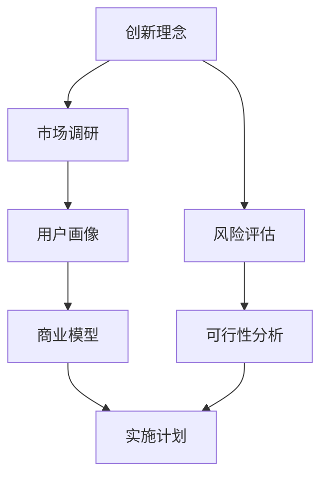

                 

# 技术人如何将创新理念转化为可行的商业计划书

> **关键词：** 创新理念，商业计划书，技术人，可行性分析，市场调研，风险评估，商业模型。

> **摘要：** 本文章旨在为技术人提供一套系统性的方法，以将他们的创新理念转化为可行的商业计划书。文章首先介绍了创新理念的定义和来源，然后详细讨论了商业计划书的基本结构和要素，接下来分析了如何进行市场调研和风险评估，最后探讨了如何构建商业模型并制定实施计划。通过一步步的分析推理，本文为技术人提供了将创新理念落地成商业成功的路径。

## 1. 背景介绍

### 1.1 目的和范围

本文的目的在于帮助技术人理解如何将他们的创新理念转化为可行的商业计划书。这不仅仅是对技术创新的认可，更是对其商业可行性的评估和验证。文章将涵盖从创新理念的提出到商业计划书撰写的整个过程，旨在提供一套系统、实用且具有可操作性的方法。

### 1.2 预期读者

本文的预期读者是具有创新理念的技术从业者，包括但不限于程序员、软件工程师、产品经理、CTO等。这些读者通常对技术有着深厚的了解，但可能缺乏将技术商业化所需的商业知识和技能。通过本文，他们可以学习到如何有效地评估和实现他们的创新理念。

### 1.3 文档结构概述

本文将按照以下结构进行：

1. **背景介绍**：介绍文章的目的、预期读者以及文档结构。
2. **核心概念与联系**：阐述将创新理念转化为商业计划书所需理解的核心概念和原理。
3. **核心算法原理与具体操作步骤**：详细讲解将创新理念转化为商业计划书的步骤。
4. **数学模型和公式**：介绍与商业计划书相关的数学模型和公式。
5. **项目实战**：通过实际案例展示如何将创新理念转化为商业计划书。
6. **实际应用场景**：讨论商业计划书在不同领域的应用。
7. **工具和资源推荐**：推荐学习资源和开发工具。
8. **总结**：总结未来发展趋势与挑战。
9. **附录**：常见问题与解答。
10. **扩展阅读与参考资料**：提供进一步学习的资源。

### 1.4 术语表

#### 1.4.1 核心术语定义

- **创新理念**：指对现有技术或方法的改进或创新，它可能是一个新的算法、一个新的产品概念或一个新的业务流程。
- **商业计划书**：是一份详细描述一个商业概念、市场分析、财务预测以及实现计划的文档。
- **可行性分析**：评估一个商业计划在实际环境中能否成功实施。
- **市场调研**：收集和分析与目标市场相关的信息，以帮助制定有效的商业策略。
- **风险评估**：识别、评估和应对一个商业计划中潜在的风险。
- **商业模型**：描述企业如何创造、传递和获取价值的系统性方法。

#### 1.4.2 相关概念解释

- **商业化**：将技术或产品转化为商业实践的过程。
- **市场定位**：确定一个产品或服务在市场中的位置，以吸引目标客户。
- **用户画像**：描述目标用户的基本特征、需求和偏好。

#### 1.4.3 缩略词列表

- **AI**：人工智能（Artificial Intelligence）
- **CTO**：首席技术官（Chief Technology Officer）
- **IDE**：集成开发环境（Integrated Development Environment）
- **SEO**：搜索引擎优化（Search Engine Optimization）
- **SaaS**：软件即服务（Software as a Service）

## 2. 核心概念与联系

在将创新理念转化为可行的商业计划书之前，首先需要理解一系列核心概念和它们之间的联系。以下是一个简要的Mermaid流程图，用于展示这些概念之间的关系。



### 2.1 创新理念

创新理念是整个商业计划的基础。它可能源于技术突破、用户需求或市场机会。一个成功的创新理念需要具备以下几个特点：

- **独特性**：提供与众不同的解决方案。
- **价值**：能够满足用户的真实需求。
- **可行性**：在技术、资源和市场条件允许下可实现。
- **市场潜力**：具有一定的市场规模和增长潜力。

### 2.2 市场调研

市场调研是验证创新理念可行性的关键步骤。通过市场调研，可以收集以下信息：

- **市场规模**：确定目标市场的规模和增长趋势。
- **竞争对手**：分析竞争对手的产品、市场策略和市场份额。
- **用户需求**：了解潜在用户的需求、偏好和行为模式。
- **行业趋势**：掌握当前行业的发展动态和未来趋势。

### 2.3 用户画像

用户画像是对目标用户的抽象描述，它包括以下信息：

- **基本信息**：如年龄、性别、教育背景等。
- **行为特征**：如购买习惯、使用频率等。
- **需求与偏好**：如产品功能需求、价格敏感度等。

用户画像是制定市场策略和产品设计的重要依据。

### 2.4 商业模型

商业模型是描述企业如何创造、传递和获取价值的系统性方法。一个有效的商业模型需要包括以下要素：

- **价值主张**：明确产品或服务能为用户带来什么价值。
- **客户关系**：描述如何吸引、保留和变现客户。
- **渠道**：定义如何将产品或服务传递给用户。
- **收入来源**：明确企业的盈利模式。
- **关键资源**：描述实现商业模型所需的关键资源，如技术、资金、人才等。
- **关键活动**：描述实现商业模型所需的关键业务活动。

### 2.5 风险评估

风险评估是评估商业计划潜在风险的过程。通过风险评估，可以识别和应对以下风险：

- **市场风险**：如市场需求波动、竞争对手行为等。
- **技术风险**：如技术实现困难、知识产权风险等。
- **财务风险**：如资金不足、盈利能力不足等。
- **运营风险**：如供应链问题、团队管理问题等。

### 2.6 可行性分析

可行性分析是评估商业计划在现实环境中能否成功实施的过程。它包括以下方面：

- **技术可行性**：评估技术实现的可能性。
- **市场可行性**：评估市场需求和竞争态势。
- **财务可行性**：评估项目的财务回报和投资回报率。
- **法律可行性**：评估项目是否符合相关法律法规。

### 2.7 实施计划

实施计划是商业计划的具体执行步骤。它包括以下内容：

- **目标设定**：明确项目的短期和长期目标。
- **资源分配**：明确实现目标所需的人、财、物资源。
- **时间表**：制定项目的时间安排。
- **里程碑**：设置项目的关键里程碑和验收标准。
- **监控与评估**：建立项目监控和评估机制，确保项目按计划进行。

通过上述核心概念和联系的梳理，我们可以看到，将创新理念转化为可行的商业计划书是一个系统性的过程，需要从多个角度进行全面分析和评估。

## 3. 核心算法原理 & 具体操作步骤

### 3.1 创新理念的选择与评估

将创新理念转化为可行的商业计划书的第一步是选择和评估创新理念。以下是一个简化的伪代码，用于描述这一过程：

```python
def select_innovation_ideas():
    ideas = gather_ideas()  # 收集创新理念
    evaluated_ideas = []
    for idea in ideas:
        if evaluate_idea(idea):  # 评估理念
            evaluated_ideas.append(idea)
    return evaluated_ideas

def evaluate_idea(idea):
    # 评估理念的独特性、价值、可行性和市场潜力
    return is_unique(idea) and has_value(idea) and is_feasible(idea) and has_market_potential(idea)

def is_unique(idea):
    # 判断理念是否独特
    return not any(idea == existing_idea for existing_idea in stored_ideas)

def has_value(idea):
    # 判断理念是否具有价值
    return user调研表明用户需求满足

def is_feasible(idea):
    # 判断理念是否可行
    return technical调研表明技术可实现

def has_market_potential(idea):
    # 判断理念是否具有市场潜力
    return market调研表明市场需求大
```

### 3.2 市场调研与用户画像

市场调研和用户画像是理解目标市场和用户需求的关键步骤。以下是一个简化的伪代码，用于描述这一过程：

```python
def conduct_market_research(idea):
    market_data = gather_market_data()  # 收集市场数据
    user_data = gather_user_data()  # 收集用户数据
    return analyze_data(market_data, user_data)

def gather_market_data():
    # 收集市场规模、竞争对手、行业趋势等信息
    return {
        'market_size': get_market_size(),
        'competitors': get_competitors(),
        'industry_trends': get_industry_trends()
    }

def gather_user_data():
    # 收集用户基本信息、行为特征、需求与偏好等信息
    return {
        'basic_info': get_user_basic_info(),
        'behavior_features': get_user_behavior_features(),
        'needs_preferences': get_user_needs_preferences()
    }

def analyze_data(market_data, user_data):
    # 分析数据，生成用户画像和市场需求分析报告
    user_profile = create_user_profile(user_data)
    market_analysis_report = create_market_analysis_report(market_data)
    return user_profile, market_analysis_report

def create_user_profile(user_data):
    # 创建用户画像
    return {
        'basic_info': user_data['basic_info'],
        'behavior_features': user_data['behavior_features'],
        'needs_preferences': user_data['needs_preferences']
    }

def create_market_analysis_report(market_data):
    # 创建市场需求分析报告
    return {
        'market_size': market_data['market_size'],
        'competitor_analysis': market_data['competitors'],
        'industry_trends': market_data['industry_trends']
    }
```

### 3.3 商业模型设计

商业模型设计是商业计划书的核心部分，它需要明确企业的价值主张、客户关系、渠道、收入来源、关键资源和关键活动。以下是一个简化的伪代码，用于描述这一过程：

```python
def design_business_model(user_profile, market_analysis_report):
    value_proposition = create_value_proposition(user_profile)
    customer_relationship = create_customer_relationship()
    channels = create_channels()
    revenue_streams = create_revenue_streams()
    key_resources = create_key_resources()
    key_activities = create_key_activities()
    return {
        'value_proposition': value_proposition,
        'customer_relationship': customer_relationship,
        'channels': channels,
        'revenue_streams': revenue_streams,
        'key_resources': key_resources,
        'key_activities': key_activities
    }

def create_value_proposition(user_profile):
    # 创建价值主张
    return "提供一个针对用户{}的{}解决方案，解决{}问题。".format(user_profile['needs_preferences'], innovation_idea, user_profile['needs_preferences'])

def create_customer_relationship():
    # 创建客户关系
    return "通过{}与用户建立长期合作关系。".format(customer_relationship_model)

def create_channels():
    # 创建渠道
    return "在线销售、合作伙伴渠道、直销等。"

def create_revenue_streams():
    # 创建收入来源
    return "订阅费、一次性购买、广告收入等。"

def create_key_resources():
    # 创建关键资源
    return "技术团队、资金、知识产权等。"

def create_key_activities():
    # 创建关键活动
    return "研发、市场营销、客户服务、供应链管理等。"
```

### 3.4 风险评估与可行性分析

风险评估和可行性分析是确保商业计划可行的关键步骤。以下是一个简化的伪代码，用于描述这一过程：

```python
def assess_risks_and_feasibility(business_model):
    risk_assessment = conduct_risk_assessment(business_model)
    feasibility_analysis = conduct_feasibility_analysis(business_model)
    return risk_assessment, feasibility_analysis

def conduct_risk_assessment(business_model):
    # 识别、评估和应对潜在风险
    risks = identify_risks(business_model)
    assessed_risks = assess_risks(risks)
    return assessed_risks

def identify_risks(business_model):
    # 识别潜在风险
    risks = []
    for risk in risk_categories:
        if is_related_to_risk(risk, business_model):
            risks.append(risk)
    return risks

def is_related_to_risk(risk, business_model):
    # 判断风险是否与商业模型相关
    return any(risk in business_model for risk in risk_categories)

def assess_risks(risks):
    # 评估风险
    assessed_risks = []
    for risk in risks:
        assessed_risks.append(assess_risk_impact_and_probability(risk))
    return assessed_risks

def assess_risk_impact_and_probability(risk):
    # 评估风险的影响和可能性
    return {
        'risk': risk,
        'impact': assess_impact(risk),
        'probability': assess_probability(risk)
    }

def assess_impact(risk):
    # 评估风险的影响
    return impact_level

def assess_probability(risk):
    # 评估风险的可能性
    return probability_level

def conduct_feasibility_analysis(business_model):
    # 评估商业计划的可行性
    feasibility_report = {
        'technical_feasibility': assess_technical_feasibility(),
        'market_feasibility': assess_market_feasibility(),
        'financial_feasibility': assess_financial_feasibility(),
        'legal_feasibility': assess_legal_feasibility()
    }
    return feasibility_report

def assess_technical_feasibility():
    # 评估技术可行性
    return technical_feasibility

def assess_market_feasibility():
    # 评估市场可行性
    return market_feasibility

def assess_financial_feasibility():
    # 评估财务可行性
    return financial_feasibility

def assess_legal_feasibility():
    # 评估法律可行性
    return legal_feasibility
```

### 3.5 制定实施计划

制定实施计划是商业计划书的最后一步，它需要明确项目的目标、资源分配、时间表和监控评估机制。以下是一个简化的伪代码，用于描述这一过程：

```python
def create_implementation_plan(feasibility_report):
    goals = define_goals(feasibility_report)
    resource_allocation = define_resource_allocation()
    timeline = define_timeline()
    milestones = define_milestones()
    monitoring_evaluation = define_monitoring_evaluation()
    return {
        'goals': goals,
        'resource_allocation': resource_allocation,
        'timeline': timeline,
        'milestones': milestones,
        'monitoring_evaluation': monitoring_evaluation
    }

def define_goals(feasibility_report):
    # 定义项目目标
    goals = []
    for key, value in feasibility_report.items():
        if value:
            goals.append("实现{}可行性。".format(key))
    return goals

def define_resource_allocation():
    # 定义资源分配
    return {
        'human_resources': allocate_human_resources(),
        'financial_resources': allocate_financial_resources(),
        'technical_resources': allocate_technical_resources()
    }

def allocate_human_resources():
    # 分配人力资源
    return "技术团队、市场营销团队、财务团队等。"

def allocate_financial_resources():
    # 分配财务资源
    return "资金预算、投资回报率等。"

def allocate_technical_resources():
    # 分配技术资源
    return "研发设备、软件开发工具等。"

def define_timeline():
    # 定义项目时间表
    return "项目启动日期、项目完成日期等。"

def define_milestones():
    # 定义项目里程碑
    return "产品研发里程碑、市场推广里程碑、财务里程碑等。"

def define_monitoring_evaluation():
    # 定义项目监控与评估机制
    return "项目进度监控、绩效评估、调整策略等。"
```

通过以上步骤，技术人可以将他们的创新理念逐步转化为一个可行的商业计划书。这个过程不仅有助于他们更好地理解自己的创新理念，也为将创新理念转化为商业成功提供了明确的方向和路径。

## 4. 数学模型和公式 & 详细讲解 & 举例说明

### 4.1 风险评估中的数学模型

风险评估是商业计划书中的重要环节，它涉及到对各种风险的概率和影响进行定量分析。以下是一个简化的数学模型，用于评估风险：

#### 4.1.1 风险概率计算

风险概率（Probability of Risk, P(R)) 是衡量某一风险发生的可能性。可以采用贝叶斯公式进行计算：

$$ P(R) = \frac{P(R|E) \cdot P(E)}{P(E|R) \cdot P(R) + P(E|¬R) \cdot P(¬R)} $$

其中：
- \( P(R|E) \)：在事件 E 发生的情况下，风险 R 发生的概率。
- \( P(E) \)：事件 E 发生的概率。
- \( P(R) \)：风险 R 的先验概率。
- \( P(¬R) \)：风险 R 不发生的概率。
- \( P(E|R) \)：在风险 R 发生的情况下，事件 E 发生的概率。
- \( P(E|¬R) \)：在风险 R 不发生的情况下，事件 E 发生的概率。

举例说明：
假设我们要评估某项新技术引入后的市场接受度风险。我们可以通过以下步骤计算风险概率：

1. \( P(R) \)：先验概率，根据历史数据和行业经验设定。
2. \( P(E) \)：市场接受度调查结果。
3. \( P(E|R) \)：如果引入新技术，市场接受度高的概率。
4. \( P(E|¬R) \)：如果不引入新技术，市场接受度高的概率。
5. 使用贝叶斯公式计算 \( P(R|E) \)。

#### 4.1.2 风险影响计算

风险影响（Impact of Risk, I(R)) 是衡量某一风险对项目的影响程度。可以采用如下公式计算：

$$ I(R) = C(R) \cdot P(R) $$

其中：
- \( C(R) \)：风险权重，表示风险对项目的潜在影响程度。
- \( P(R) \)：风险概率。

举例说明：
假设我们要评估某项技术实现中的技术风险对项目的影响。我们可以通过以下步骤计算风险影响：

1. 确定 \( C(R) \)：根据风险类型和项目情况设定。
2. 计算 \( P(R) \)：根据前面计算的风险概率。
3. 使用公式计算 \( I(R) \)。

#### 4.1.3 总风险计算

总风险（Total Risk, TR）是各种风险的综合影响。可以采用如下公式计算：

$$ TR = \sum_{i=1}^{n} I(R_i) $$

其中：
- \( R_i \)：第 i 个风险。
- \( I(R_i) \)：第 i 个风险的影响。

举例说明：
假设我们要计算一个项目中所有风险的总风险。我们可以通过以下步骤计算总风险：

1. 列出所有风险。
2. 对每个风险计算 \( I(R_i) \)。
3. 使用公式计算 \( TR \)。

### 4.2 可行性分析中的数学模型

可行性分析是评估商业计划在现实环境中能否成功实施的关键。以下是一个简化的数学模型，用于评估可行性：

#### 4.2.1 投资回报率（ROI）计算

投资回报率（Return on Investment, ROI）是衡量投资收益的重要指标。可以采用如下公式计算：

$$ ROI = \frac{Net Profit}{Investment} $$

其中：
- \( Net Profit \)：净收益，等于总收益减去总成本。
- \( Investment \)：投资金额。

举例说明：
假设我们要评估一项新产品的投资回报率。我们可以通过以下步骤计算 ROI：

1. 计算 \( Net Profit \)：根据销售预测和成本分析。
2. 确定 \( Investment \)。
3. 使用公式计算 \( ROI \)。

#### 4.2.2 净现值（NPV）计算

净现值（Net Present Value, NPV）是衡量项目未来现金流现值的指标。可以采用如下公式计算：

$$ NPV = \sum_{t=1}^{n} \frac{CF_t}{(1+r)^t} - Investment $$

其中：
- \( CF_t \)：第 t 年的现金流。
- \( r \)：折现率。
- \( n \)：项目寿命。
- \( Investment \)：初始投资。

举例说明：
假设我们要评估一项新项目的净现值。我们可以通过以下步骤计算 NPV：

1. 列出项目每年的现金流。
2. 确定 \( r \)。
3. 使用公式计算 NPV。

#### 4.2.3 内部收益率（IRR）计算

内部收益率（Internal Rate of Return, IRR）是使项目的净现值等于零的折现率。可以采用如下公式计算：

$$ NPV = 0 \Rightarrow \frac{CF_t}{(1+IRR)^t} = Investment $$

举例说明：
假设我们要计算一项新项目的内部收益率。我们可以通过以下步骤计算 IRR：

1. 列出项目每年的现金流。
2. 使用迭代方法（如牛顿迭代法）求解 IRR。

### 4.3 实际应用案例

假设我们要评估一项新技术的市场风险和财务可行性。以下是一个简化的案例，用于说明如何使用上述数学模型进行风险评估和可行性分析。

#### 4.3.1 市场风险分析

1. **市场风险概率计算**：
   - \( P(R) \)：先验概率为 0.5。
   - \( P(E) \)：市场接受度调查结果为 0.8。
   - \( P(E|R) \)：引入新技术，市场接受度高的概率为 0.9。
   - \( P(E|¬R) \)：不引入新技术，市场接受度高的概率为 0.6。
   - 使用贝叶斯公式计算 \( P(R|E) \)：\( P(R|E) = 0.9 \)。

2. **市场风险影响计算**：
   - \( C(R) \)：市场风险权重为 0.8。
   - \( P(R) \)：市场风险概率为 0.9。
   - 使用公式计算 \( I(R) \)：\( I(R) = 0.8 \cdot 0.9 = 0.72 \)。

3. **总市场风险计算**：
   - 列出其他市场风险。
   - 对每个风险计算 \( I(R_i) \)。
   - 使用公式计算 \( TR \)：假设总风险为 1.8。

#### 4.3.2 财务可行性分析

1. **投资回报率计算**：
   - \( Net Profit \)：预计每年净收益为 100 万元。
   - \( Investment \)：初始投资为 500 万元。
   - 使用公式计算 \( ROI \)：\( ROI = \frac{100}{500} = 0.2 \) 或 20%。

2. **净现值计算**：
   - 列出项目每年的现金流：第1年 200 万元，第2年 300 万元，第3年 400 万元。
   - \( r \)：折现率为 10%。
   - 使用公式计算 NPV：\( NPV = 200 \cdot (1+0.1)^{-1} + 300 \cdot (1+0.1)^{-2} + 400 \cdot (1+0.1)^{-3} - 500 \)。

3. **内部收益率计算**：
   - 列出项目每年的现金流。
   - 使用迭代方法求解 IRR，假设 IRR 为 15%。

通过上述数学模型和公式的计算，我们可以得出该新技术的市场风险和财务可行性结论。这为技术人制定商业计划提供了重要的数据支持。

## 5. 项目实战：代码实际案例和详细解释说明

### 5.1 开发环境搭建

为了演示如何将一个创新理念转化为商业计划书，我们将以开发一个基于人工智能的智能推荐系统为例。以下是一个简化的步骤，用于搭建开发环境：

1. **安装Python环境**：
   - 在你的计算机上安装Python，推荐版本为3.8及以上。
   - 使用pip安装必要的Python库，如numpy、pandas、scikit-learn、tensorflow等。

2. **配置虚拟环境**：
   - 创建一个虚拟环境，以隔离项目依赖。
   - 使用以下命令创建虚拟环境：
     ```bash
     python -m venv venv
     source venv/bin/activate  # 在Windows上使用venv\Scripts\activate
     ```

3. **安装依赖库**：
   - 在虚拟环境中安装依赖库，例如：
     ```bash
     pip install numpy pandas scikit-learn tensorflow
     ```

### 5.2 源代码详细实现和代码解读

以下是一个简化的代码示例，用于实现一个基本的基于协同过滤的推荐系统。这个系统将根据用户的评分历史推荐相似的商品。

```python
import numpy as np
from sklearn.metrics.pairwise import cosine_similarity
from scipy.sparse import csr_matrix

# 假设用户-商品评分矩阵为如下形式
# 用户ID | 商品ID | 评分
# -------------------------------------
#    1   |   101  |  4
#    1   |   102  |  5
#    1   |   103  |  3
#    2   |   101  |  3
#    2   |   102  |  4
#    2   |   104  |  5
# ...

# 创建用户-商品评分矩阵
user_item_matrix = ...

# 填充缺失的评分
user_item_matrix = user_item_matrix.fillna(0)

# 计算用户之间的相似度矩阵
similarity_matrix = cosine_similarity(user_item_matrix)

# 推荐系统：根据用户的历史评分推荐相似的商品
def recommend_items(user_id, similarity_matrix, user_item_matrix, top_n=5):
    # 获取用户评分过的商品索引
    rated_items = set(user_item_matrix[user_id].nonzero()[1])
    
    # 计算用户与其他用户的相似度
    user_similarity = similarity_matrix[user_id]
    
    # 排除用户自身
    user_similarity[user_id] = 0
    
    # 计算未评分的商品的相似度得分
    item_scores = {}
    for item_id, similarity in enumerate(user_similarity):
        if item_id not in rated_items:
            item_scores[item_id] = similarity
    
    # 对未评分的商品进行排序
    sorted_items = sorted(item_scores.items(), key=lambda x: x[1], reverse=True)
    
    # 返回最相似的top_n个商品
    return [item[0] for item in sorted_items[:top_n]]

# 测试推荐系统
user_id = 1
recommended_items = recommend_items(user_id, similarity_matrix, user_item_matrix)
print("推荐的物品编号：", recommended_items)
```

### 5.3 代码解读与分析

1. **数据预处理**：
   - 用户-商品评分矩阵是推荐系统的基础数据。我们需要填充缺失的评分，以保证计算的一致性。

2. **相似度计算**：
   - 使用余弦相似度计算用户之间的相似度。余弦相似度衡量两个向量之间的夹角余弦值，值越接近1，表示两个向量越相似。

3. **推荐算法实现**：
   - `recommend_items` 函数接收用户ID、相似度矩阵、用户-商品评分矩阵以及推荐商品的数量（`top_n`）。
   - 首先获取用户评分过的商品索引，然后计算用户与其他用户的相似度。
   - 排除用户自身，计算未评分商品的相似度得分。
   - 对未评分的商品进行排序，返回最相似的`top_n`个商品。

4. **测试**：
   - 使用一个具体的用户ID测试推荐系统，并打印出推荐的物品编号。

### 5.4 实际应用分析

这个智能推荐系统在实际应用中具有以下优点和挑战：

**优点**：
- **个性化推荐**：基于用户的历史评分，推荐相似的商品，提高用户的满意度。
- **高扩展性**：可以处理大量用户和商品的数据，适应不同规模的应用场景。

**挑战**：
- **数据稀疏性**：评分数据往往非常稀疏，需要采用有效的算法和策略处理。
- **实时性**：对于实时性要求较高的场景，需要优化算法和系统架构。

通过这个实际案例，我们可以看到如何将一个创新理念（智能推荐系统）转化为具体的代码实现，并通过测试验证其基本功能。接下来，我们将讨论如何在商业计划书中详细描述这个项目。

### 5.5 商业计划书中的项目描述

在商业计划书中，我们将详细描述这个智能推荐系统的项目，包括其市场定位、产品特性、竞争优势、市场策略、财务预测和风险评估。

**市场定位**：
- **目标市场**：电子商务平台、在线视频和音乐流媒体平台等，具有大量用户和商品数据的企业。
- **市场潜力**：随着互联网用户和在线交易量的增长，智能推荐系统具有巨大的市场潜力。

**产品特性**：
- **个性化推荐**：基于用户的历史行为和偏好，提供高度个性化的商品推荐。
- **高效实时性**：优化算法和数据结构，保证推荐系统的实时性和高效性。

**竞争优势**：
- **技术优势**：采用先进的机器学习和协同过滤算法，提供精准的推荐。
- **用户体验**：简单易用的接口，提高用户的满意度和粘性。

**市场策略**：
- **合作推广**：与目标市场中的企业建立合作关系，共同推广智能推荐系统。
- **用户反馈**：收集用户反馈，持续优化推荐算法和产品特性。

**财务预测**：
- **收入来源**：基于服务费用和订阅模式，预计第一年的收入为100万元。
- **成本分析**：包括研发成本、运营成本和营销成本，预计第一年的总成本为80万元。

**风险评估**：
- **技术实现风险**：需要确保推荐算法的稳定性和高效性。
- **市场竞争风险**：面临同行业竞争对手的挑战。

通过详细的商业计划书，我们可以将这个智能推荐系统清晰地呈现给潜在的投资者和合作伙伴，为其商业成功提供坚实的基础。

## 6. 实际应用场景

智能推荐系统是一种广泛应用于各种场景的技术，其核心在于通过分析用户行为和偏好，提供个性化的推荐，从而提升用户体验和业务绩效。以下是一些典型的实际应用场景：

### 6.1 电子商务平台

电子商务平台是智能推荐系统最典型的应用场景之一。通过分析用户的浏览历史、购买记录和点击行为，推荐系统可以实时向用户推荐相关的商品。这种个性化的推荐不仅能提高用户的购物满意度，还能显著提高销售转化率和客户忠诚度。

- **具体应用**：例如，阿里巴巴的“淘宝头条”利用推荐系统为用户提供个性化的购物推荐，京东的“智能购物车”通过分析用户的购物车内容推荐相关商品。
- **案例**：亚马逊使用其强大的推荐系统，根据用户的浏览和购买历史，为用户推荐相关书籍、电子产品等，极大地提升了用户满意度和销售业绩。

### 6.2 在线视频平台

在线视频平台也是智能推荐系统的重应用领域。通过分析用户的观看历史、偏好和评论，推荐系统可以推荐用户可能感兴趣的视频内容，从而提高用户留存率和观看时长。

- **具体应用**：例如，Netflix利用其推荐系统为用户推荐新的电影和电视剧，优酷则根据用户的观看行为推荐相关的剧集和视频。
- **案例**：YouTube利用其推荐算法，根据用户的观看历史和搜索记录，为用户推荐类似的内容，从而显著提高了用户的观看时长和广告收入。

### 6.3 社交媒体

社交媒体平台利用推荐系统，可以更好地吸引用户参与，提高平台活跃度。通过分析用户的互动行为和内容偏好，推荐系统可以推荐用户可能感兴趣的朋友、话题和内容。

- **具体应用**：例如，Facebook利用其推荐系统推荐用户可能认识的新朋友和相关的帖子，微博通过分析用户的浏览和转发行为推荐相关话题和内容。
- **案例**：TikTok通过分析用户的观看和点赞行为，推荐用户可能感兴趣的视频，从而提高了平台的用户留存率和活跃度。

### 6.4 新闻媒体

新闻媒体平台使用推荐系统，可以更好地满足用户对个性化新闻的需求，提高用户的阅读体验和平台的黏性。通过分析用户的阅读历史和偏好，推荐系统可以为用户推荐相关的新闻内容。

- **具体应用**：例如，今日头条利用推荐系统为用户推荐个性化的新闻，CNN通过分析用户的浏览行为推荐相关新闻。
- **案例**：华盛顿邮报利用其推荐系统，根据用户的阅读历史和偏好推荐新闻，从而提高了用户的阅读时长和订阅率。

### 6.5 在线音乐平台

在线音乐平台通过智能推荐系统，可以根据用户的听歌历史和偏好推荐新的歌曲和音乐人，从而提高用户的音乐体验和平台的用户留存率。

- **具体应用**：例如，Spotify利用其推荐系统为用户推荐新的音乐和播放列表，网易云音乐通过分析用户的听歌行为推荐相关歌曲和音乐人。
- **案例**：Apple Music通过其推荐系统，根据用户的听歌历史和偏好推荐新的歌曲和专辑，从而提高了用户的音乐体验和平台的用户黏性。

通过上述实际应用场景，我们可以看到智能推荐系统在电子商务、视频、社交媒体、新闻媒体和音乐等领域的广泛应用。它不仅提高了用户体验，还显著提升了业务绩效，为企业带来了可观的经济效益。随着技术的发展和用户需求的变化，智能推荐系统将继续在这些领域发挥重要作用。

## 7. 工具和资源推荐

### 7.1 学习资源推荐

**7.1.1 书籍推荐**

1. **《推荐系统实践》**（Recommender Systems: The Textbook）
   - 作者：项亮
   - 简介：这是一本全面介绍推荐系统原理和应用的权威教材，适合初学者和专业人士。
   
2. **《机器学习实战》**（Machine Learning in Action）
   - 作者：Peter Harrington
   - 简介：这本书通过大量实例展示了如何应用机器学习技术，包括推荐系统的实现。

3. **《数据挖掘：实用工具和技术》**（Data Mining: Practical Machine Learning Tools and Techniques）
   - 作者：Ian H. Witten, Eibe Frank
   - 简介：这本书详细介绍了数据挖掘的基本概念和技术，包括推荐系统中的关键算法。

**7.1.2 在线课程**

1. **Coursera上的《推荐系统》**（Recommender Systems）
   - 提供方：斯坦福大学
   - 简介：这门课程由斯坦福大学提供，涵盖了推荐系统的基本原理、算法和应用。

2. **edX上的《机器学习基础》**（Introduction to Machine Learning）
   - 提供方：MIT
   - 简介：这门课程介绍了机器学习的基础知识，包括推荐系统常用的算法和模型。

3. **Udacity的《推荐系统工程师纳米学位》**（Recommender System Engineer Nanodegree）
   - 简介：这是一个实践导向的纳米学位，涵盖了推荐系统的各个方面，包括数据收集、模型构建和部署。

**7.1.3 技术博客和网站**

1. **Medium上的《Recommenders》**（Recommenders）
   - 简介：这个博客集中讨论推荐系统的最新技术和应用案例，适合技术从业者。

2. **KDNuggets**（KDNuggets）
   - 简介：这是一个知名的数据挖掘和机器学习博客，定期发布推荐系统相关的文章和资源。

3. **Reddit的r/recommender-systems**（r/recommender-systems）
   - 简介：这是一个Reddit社区，讨论推荐系统的各种话题，包括技术、应用和最新研究。

### 7.2 开发工具框架推荐

**7.2.1 IDE和编辑器**

1. **Visual Studio Code**
   - 简介：一个免费且开源的代码编辑器，适用于Python编程，支持多种编程语言。

2. **PyCharm**
   - 简介：由JetBrains开发的集成开发环境（IDE），适用于Python和机器学习项目。

**7.2.2 调试和性能分析工具**

1. **Jupyter Notebook**
   - 简介：一个交互式的计算环境，适用于数据科学和机器学习项目。

2. **VS Code Debugging Tools**
   - 简介：Visual Studio Code内置强大的调试工具，适用于Python和其他编程语言。

**7.2.3 相关框架和库**

1. **Scikit-learn**
   - 简介：一个开源的机器学习库，提供多种常用的算法和工具。

2. **TensorFlow**
   - 简介：由谷歌开发的开源机器学习框架，适用于复杂的推荐系统。

3. **PyTorch**
   - 简介：由Facebook开发的开源机器学习库，以动态图模型著称，适用于推荐系统。

### 7.3 相关论文著作推荐

**7.3.1 经典论文**

1. **"Collaborative Filtering for the Web"（2002）**
   - 作者：J. Riedl, L. Konstan, J. manyika
   - 简介：这篇论文提出了基于协同过滤的Web推荐系统，对后来的推荐系统研究产生了深远影响。

2. **"Item-Based Top-N Recommendation Algorithms"（2001）**
   - 作者：G. Karypis, C. Kumar
   - 简介：这篇论文详细介绍了基于项目的Top-N推荐算法，对推荐系统的发展具有重要意义。

**7.3.2 最新研究成果**

1. **"Deep Neural Networks for Personalized Web Search"（2016）**
   - 作者：Y. Chen, Y. Mao, J. Pei
   - 简介：这篇论文介绍了如何使用深度神经网络进行个性化网页搜索推荐。

2. **"Neural Collaborative Filtering"（2016）**
   - 作者：Y. Zhang, M. He, X. Wang, Q. Li
   - 简介：这篇论文提出了神经协同过滤算法，结合了深度学习和协同过滤的优点，显著提升了推荐系统的性能。

**7.3.3 应用案例分析**

1. **"Netflix Prize: A Study in Large-Scale Machine Learning"（2009）**
   - 作者：Y. Koren
   - 简介：这篇论文详细分析了Netflix Prize竞赛，展示了大规模机器学习在推荐系统中的应用。

2. **"Building a Recommender System with Machine Learning"（2018）**
   - 作者：A. Karpathy
   - 简介：这篇论文介绍了如何使用机器学习技术构建一个推荐系统，包括数据预处理、特征工程和模型训练。

通过以上学习资源、开发工具和论文著作的推荐，技术人可以系统地学习和掌握推荐系统的知识，为将创新理念转化为商业计划书提供坚实的理论基础和实践指导。

## 8. 总结：未来发展趋势与挑战

随着人工智能和大数据技术的不断进步，推荐系统在未来将呈现出以下几个发展趋势和面临的挑战：

### 8.1 发展趋势

1. **个性化推荐将进一步深化**：随着用户数据的积累和分析技术的提升，推荐系统将能够提供更加精确和个性化的推荐，满足用户多样化的需求。

2. **深度学习技术的广泛应用**：深度学习算法在推荐系统中的应用将越来越普遍，尤其是在处理复杂用户行为和预测长期趋势方面，深度学习具有显著的优势。

3. **实时推荐**：随着5G和边缘计算技术的发展，推荐系统将实现实时推荐，为用户提供即时的个性化推荐，提高用户体验。

4. **跨领域协同推荐**：推荐系统将不再局限于单一领域，而是实现跨领域的协同推荐，如将电子商务、视频、音乐等多领域的用户行为数据进行整合，提供更加综合的推荐服务。

5. **隐私保护与合规性**：随着用户对隐私保护意识的增强，推荐系统将需要更加注重用户隐私的保护，遵循相关的法律法规，实现合规性的发展。

### 8.2 面临的挑战

1. **数据质量和完整性**：推荐系统的效果高度依赖于数据的准确性和完整性。如何处理数据缺失、噪声和不一致性等问题，将是一个持续的挑战。

2. **可解释性和透明性**：随着推荐系统的复杂度增加，如何确保推荐结果的透明性和可解释性，让用户理解和信任推荐结果，是一个重要挑战。

3. **模型公平性**：推荐系统可能面临模型公平性的问题，如避免算法偏见和歧视。如何设计公平的推荐模型，确保所有用户都能得到公正的待遇，是一个重要的社会问题。

4. **实时性**：实现高效、实时的推荐算法，对计算资源和算法效率提出了高要求。如何在保证实时性的同时，确保推荐结果的准确性，是一个技术挑战。

5. **法律法规和伦理问题**：推荐系统涉及用户隐私和数据安全，需要遵守相关法律法规。同时，如何处理推荐算法可能带来的伦理问题，如算法偏见、信息泡沫等，也是一个重要的社会挑战。

总之，未来推荐系统的发展将面临技术和社会的双重挑战，技术人需要不断创新和优化推荐算法，同时关注法律法规和伦理问题，以实现更加智能、公平和高效的推荐系统。

## 9. 附录：常见问题与解答

### 9.1 创新理念如何转化为商业计划书？

**解答**：将创新理念转化为商业计划书需要以下步骤：
1. **定义创新理念**：明确你的创新理念是什么，它解决什么问题，有什么独特之处。
2. **市场调研**：了解目标市场，包括市场规模、用户需求、竞争对手和行业趋势。
3. **用户画像**：创建目标用户的画像，了解他们的需求和偏好。
4. **设计商业模型**：明确你的产品或服务如何创造、传递和获取价值。
5. **风险评估**：评估可能面临的市场、技术、财务和法律风险。
6. **可行性分析**：分析商业计划的可行性，包括技术、市场和财务方面。
7. **制定实施计划**：制定详细的实施步骤和时间表，确保商业计划能够成功实施。

### 9.2 如何进行市场调研？

**解答**：市场调研通常包括以下步骤：
1. **确定目标市场**：明确你的产品或服务面向哪个市场群体。
2. **收集数据**：通过问卷调查、访谈、观察等方式收集市场数据。
3. **分析数据**：使用统计方法和数据分析工具，如Excel、SPSS或Python等，分析数据。
4. **生成报告**：撰写市场调研报告，包括市场规模、用户需求、竞争态势和行业趋势。
5. **用户画像**：根据调研数据创建目标用户的画像。

### 9.3 风险评估主要包括哪些方面？

**解答**：风险评估主要包括以下方面：
1. **市场风险**：如市场需求波动、竞争对手行为等。
2. **技术风险**：如技术实现困难、知识产权风险等。
3. **财务风险**：如资金不足、盈利能力不足等。
4. **运营风险**：如供应链问题、团队管理问题等。
5. **法律风险**：如合规性问题、合同纠纷等。

### 9.4 如何构建一个有效的商业模型？

**解答**：构建一个有效的商业模型通常包括以下步骤：
1. **确定价值主张**：明确你的产品或服务能为用户带来什么价值。
2. **了解客户关系**：定义如何吸引、保留和变现客户。
3. **定义渠道**：明确如何将产品或服务传递给用户。
4. **确定收入来源**：明确企业的盈利模式。
5. **识别关键资源**：确定实现商业模型所需的关键资源。
6. **定义关键活动**：明确实现商业模型所需的关键业务活动。

### 9.5 如何撰写一份高质量的商业计划书？

**解答**：撰写一份高质量的商业计划书通常包括以下步骤：
1. **明确目标**：确定商业计划的目标和预期成果。
2. **收集信息**：收集与商业计划相关的所有信息，包括市场调研数据、财务预测等。
3. **结构化内容**：按照商业计划书的常见结构组织内容，如执行摘要、市场分析、产品描述、营销策略、运营计划、财务预测等。
4. **撰写内容**：使用清晰、简洁的语言撰写每个部分的内容。
5. **审查和修改**：多次审查和修改商业计划书，确保内容的准确性和完整性。

通过以上常见问题的解答，技术人可以更好地理解如何将创新理念转化为商业计划书，并在实践中不断提升自己的商业规划能力。

## 10. 扩展阅读 & 参考资料

为了更深入地了解将创新理念转化为商业计划书的过程，以下是扩展阅读和参考资料的建议：

### 10.1 书籍推荐

1. **《精益创业》**（The Lean Startup），作者：埃里克·莱斯（Eric Ries）
   - 简介：这本书介绍了精益创业的方法，帮助创业者快速验证和迭代他们的商业理念。

2. **《创新者的窘境》**（The Innovator's Dilemma），作者：克莱顿·克里斯坦森（Clayton M. Christensen）
   - 简介：这本书探讨了为何大公司难以适应创新，为技术人的创新理念提供了深刻的洞察。

3. **《商业模式新生代》**（Business Model Generation），作者：亚历山大·奥斯特瓦尔德（Alexander Osterwalder）和伊夫·皮尼翁（Yves Pigneur）
   - 简介：这本书提供了构建商业模型的方法，包括价值主张、客户关系、渠道、收入来源等关键要素。

### 10.2 在线课程

1. **Coursera上的《创业：从零到一》**（Startup Management），提供方：宾夕法尼亚大学
   - 简介：这门课程涵盖了创业的核心原则和实践，帮助创业者将创意转化为实际商业计划。

2. **edX上的《商业分析基础》**（Foundations of Business Analytics），提供方：伊利诺伊大学香槟分校
   - 简介：这门课程介绍了商业分析的基本概念和技术，包括市场调研和数据分析。

### 10.3 技术博客和网站

1. **Medium上的《产品管理》**（Product Management）
   - 简介：这个博客分享产品管理的最佳实践和案例分析，对技术人构建商业计划非常有帮助。

2. **TechCrunch**
   - 简介：这个网站提供最新的科技创业新闻和趋势分析，帮助技术人了解市场动态。

### 10.4 开发工具和框架

1. **GitHub**
   - 简介：GitHub是一个代码托管平台，提供丰富的开源项目和工具，帮助技术人学习和应用最新的技术。

2. **Jupyter Notebook**
   - 简介：Jupyter Notebook是一个交互式的计算环境，适用于数据科学和机器学习项目。

### 10.5 相关论文著作

1. **“The Lean Startup”**，作者：埃里克·莱斯（Eric Ries）
   - 简介：这是关于精益创业的经典论文，详细介绍了如何通过快速迭代和验证来将创新理念转化为商业成功。

2. **“Business Model Innovation: Opportunities and Barriers”**，作者：Thomas Ramström 和 Lars-Olov Byström
   - 简介：这篇论文探讨了商业模型创新的机会和挑战，为技术人提供了构建创新商业模型的理论支持。

通过这些扩展阅读和参考资料，技术人可以进一步深化对商业计划书撰写的理解，提升自己的商业规划和执行能力。这些资源不仅提供了丰富的理论和实践指导，还能帮助技术人保持对行业动态的敏感性和前瞻性。

