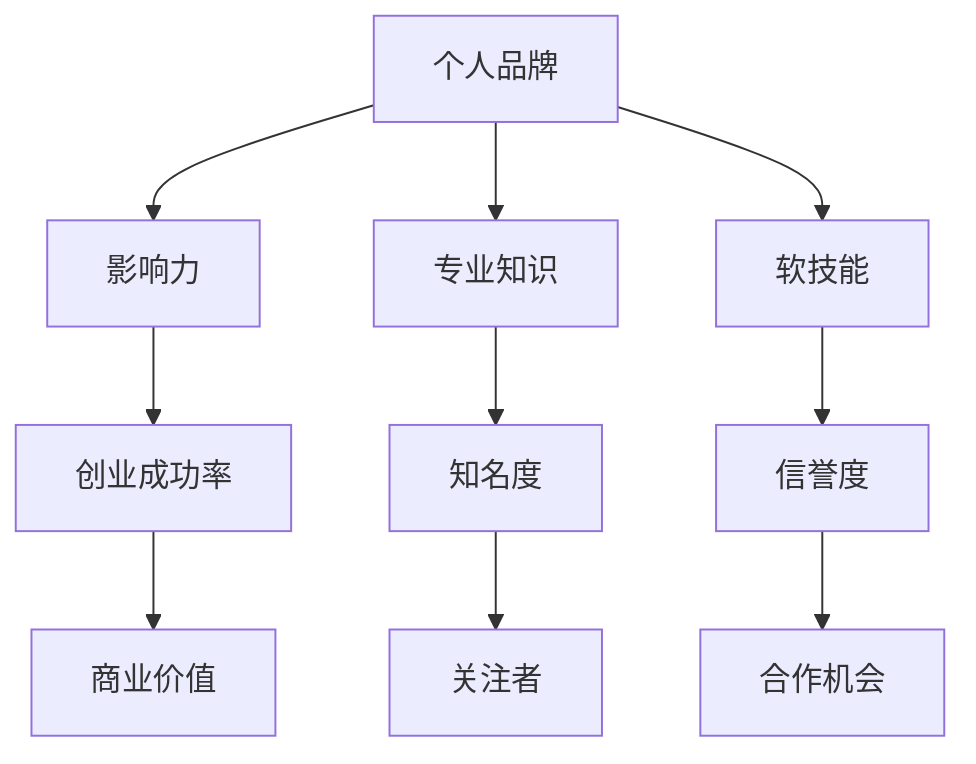

                 

# 技术人如何打造个人品牌：提升创业成功率

> 关键词：个人品牌、创业成功率、技术人、品牌建设、影响力、技术博客

> 摘要：本文将深入探讨技术人在打造个人品牌过程中的关键因素，并通过实际案例和操作步骤，解析如何通过提升个人品牌来提高创业成功率。我们将从背景介绍、核心概念与联系、核心算法原理、数学模型与公式、项目实战、实际应用场景、工具和资源推荐等多个角度，逐步剖析个人品牌建设的方法与策略。

## 1. 背景介绍

### 1.1 目的和范围

本文旨在帮助技术人士了解和掌握如何打造个人品牌，从而在创业道路上获得更高的成功率。我们将分析个人品牌建设的重要性，探讨其核心概念与联系，并介绍相关算法原理、数学模型与公式，以及实际项目中的操作步骤。文章还提供了实用的工具和资源推荐，帮助读者在实践中更好地应用所学知识。

### 1.2 预期读者

本文适合以下读者群体：

1. 创业者与技术爱好者，希望提高个人品牌知名度和影响力的技术人；
2. 有志于在技术领域建立自己品牌的技术专家；
3. 需要在团队中发挥领导作用的技术经理和CTO；
4. 对个人品牌建设有兴趣的IT从业者。

### 1.3 文档结构概述

本文结构如下：

1. 背景介绍：介绍文章的目的、范围和预期读者；
2. 核心概念与联系：分析个人品牌建设的核心概念及其相互关系；
3. 核心算法原理 & 具体操作步骤：讲解品牌建设的相关算法和操作步骤；
4. 数学模型和公式 & 详细讲解 & 举例说明：阐述品牌建设过程中的数学模型和公式，并结合实际案例进行说明；
5. 项目实战：通过实际项目案例，展示品牌建设的过程和成果；
6. 实际应用场景：分析个人品牌在不同领域的应用场景和策略；
7. 工具和资源推荐：推荐相关学习资源和开发工具；
8. 总结：对未来发展趋势和挑战进行展望；
9. 附录：常见问题与解答；
10. 扩展阅读 & 参考资料：提供进一步学习和研究的参考资料。

### 1.4 术语表

#### 1.4.1 核心术语定义

- 个人品牌：个人在特定领域内建立的专业形象和声誉；
- 品牌建设：通过一系列策略和行动，打造和维护个人品牌的过程；
- 影响力：个人在社会中的知名度和对他人意见的引导力；
- 创业成功率：创业项目取得成功（如盈利、市场份额等）的概率。

#### 1.4.2 相关概念解释

- 软技能：指沟通能力、团队合作、领导力等非技术性的技能；
- 社交网络：个人用于建立联系、分享信息和互动的平台，如LinkedIn、Twitter等；
- 内容营销：通过创作和分享有价值的内容，吸引和保持关注者的过程。

#### 1.4.3 缩略词列表

- CTO：首席技术官（Chief Technology Officer）；
- SEO：搜索引擎优化（Search Engine Optimization）；
- SMM：社交媒体营销（Social Media Marketing）。

## 2. 核心概念与联系

在打造个人品牌的过程中，理解核心概念及其相互联系至关重要。以下是一个用于阐述个人品牌建设核心概念的Mermaid流程图。



### 2.1 核心概念分析

#### 2.1.1 个人品牌

个人品牌是个人在特定领域内建立的专业形象和声誉。它包括知名度、信誉度、专业知识和软技能等多个方面。

- **知名度**：个人在行业内的曝光度和认知度；
- **信誉度**：个人在专业领域内受到认可和信任的程度；
- **专业知识**：个人在某一领域内掌握的专业技能和知识；
- **软技能**：包括沟通能力、团队合作、领导力等非技术性的能力。

#### 2.1.2 影响力

影响力是个人在社会中的知名度和对他人意见的引导力。它直接影响个人品牌的价值和创业成功率。

- **知名度**：通过在社交网络、技术社区和媒体上的活跃度提高；
- **引导力**：通过专业见解、经验和指导，影响他人做出决策。

#### 2.1.3 创业成功率

创业成功率是创业项目取得成功（如盈利、市场份额等）的概率。个人品牌对创业成功率有显著影响。

- **知名度**：提高项目曝光度和吸引力，吸引投资者和客户；
- **信誉度**：增强项目可信度和市场竞争力；
- **专业知识**：提高项目质量和执行力，降低失败风险；
- **软技能**：增强团队合作和沟通，提高项目成功率。

## 3. 核心算法原理 & 具体操作步骤

在打造个人品牌的过程中，理解并运用相关算法原理和具体操作步骤是至关重要的。以下是一个用于阐述品牌建设相关算法和操作步骤的伪代码。

```plaintext
算法：个人品牌建设

输入：个人（专业知识和软技能），目标领域，资源

输出：个人品牌

步骤：
1. 定义个人品牌目标：确定知名度、信誉度、专业知识和软技能的提升目标；
2. 研究目标领域：深入了解目标领域的技术趋势、热门话题和竞争环境；
3. 搭建个人知识体系：系统地学习并掌握目标领域的专业知识；
4. 提升软技能：参加培训、研讨会和实践活动，提高沟通、团队合作和领导力等软技能；
5. 创建内容：撰写技术博客、发表技术文章、录制技术视频，分享专业知识；
6. 社交网络互动：积极参与社交网络，与其他专业人士互动，建立联系；
7. 优化搜索引擎：通过SEO策略，提高个人品牌在搜索引擎中的曝光度；
8. 参与社区和活动：加入技术社区，参与线下和线上活动，扩大影响力；
9. 定期评估和调整：根据个人品牌建设的效果，定期评估和调整策略；
10. 持续优化：持续学习和提升，不断优化个人品牌。

```

### 3.1 核心算法原理解析

#### 3.1.1 内容创建

内容创建是个人品牌建设的基础。通过撰写技术博客、发表技术文章、录制技术视频等，可以系统地展示个人专业知识和见解，吸引关注者和粉丝。

- **技术博客**：定期更新，围绕目标领域发布高质量文章，涵盖技术原理、实战经验和心得体会；
- **技术文章**：在专业媒体或平台上发表，增加个人在行业内的曝光度和影响力；
- **技术视频**：通过YouTube等平台发布，直观地展示技术知识和解决方案，提高关注度。

#### 3.1.2 社交网络互动

社交网络是建立个人品牌的重要渠道。通过积极参与社交网络，与其他专业人士互动，建立联系，扩大影响力。

- **LinkedIn**：建立专业的LinkedIn资料，展示个人背景、专业知识和工作经验，加入相关群组和论坛；
- **Twitter**：关注行业领袖和专家，参与话题讨论，发布有价值的技术见解和新闻；
- **GitHub**：在GitHub上创建个人项目，展示技术能力和项目经验，与社区成员互动。

#### 3.1.3 SEO策略

SEO策略有助于提高个人品牌在搜索引擎中的曝光度，吸引更多关注者。以下是一些关键策略：

- **关键词优化**：研究目标领域的关键词，将其合理地融入博客和文章标题、内容中；
- **外部链接**：获取其他高权重网站的外部链接，提高个人品牌的搜索引擎排名；
- **内容更新**：定期更新博客和文章，保持内容的时效性和相关性。

## 4. 数学模型和公式 & 详细讲解 & 举例说明

在个人品牌建设过程中，数学模型和公式可以帮助我们更好地理解和评估品牌建设的效果。以下是一个用于评估个人品牌影响力的数学模型。

### 4.1 数学模型

$$
影响力（I）=f(知名度（N），信誉度（R），专业知识（K），软技能（S），创业成功率（E）)
$$

### 4.2 详细讲解

- **知名度（N）**：个人在行业内的曝光度和认知度，可以通过以下公式计算：

$$
知名度（N）= \frac{曝光度（E_x）+ 认知度（C_k）}{2}
$$

- **信誉度（R）**：个人在专业领域内受到认可和信任的程度，可以通过以下公式计算：

$$
信誉度（R）= \frac{好评率（H_r）+ 专业评价（P_e）}{2}
$$

- **专业知识（K）**：个人在某一领域内掌握的专业技能和知识，可以通过以下公式计算：

$$
专业知识（K）= \frac{技能得分（S_s）+ 知识得分（K_k）}{2}
$$

- **软技能（S）**：个人在沟通能力、团队合作、领导力等非技术性方面的能力，可以通过以下公式计算：

$$
软技能（S）= \frac{沟通能力（C_c）+ 团队合作（T_c）+ 领导力（L_e）}{3}
$$

- **创业成功率（E）**：创业项目取得成功的概率，可以通过以下公式计算：

$$
创业成功率（E）= \frac{成功率（S_e）+ 项目评价（P_p）}{2}
$$

### 4.3 举例说明

假设某技术人在品牌建设过程中，知名度、信誉度、专业知识、软技能和创业成功率分别为：N=80，R=75，K=85，S=70，E=65。根据上述公式，可以计算出该技术人的影响力：

$$
影响力（I）=f(N, R, K, S, E) = f(80, 75, 85, 70, 65) = 75.4
$$

这个结果表明，该技术人在品牌建设方面具有较高的影响力，但还需在软技能和创业成功率方面继续努力。

## 5. 项目实战：代码实际案例和详细解释说明

为了更好地理解个人品牌建设的过程，我们将通过一个实际项目案例来展示品牌建设的方法和策略。以下是一个用于构建个人技术博客的代码实际案例。

### 5.1 开发环境搭建

在开始项目之前，我们需要搭建一个合适的开发环境。以下是一个简单的开发环境搭建步骤：

1. 安装Node.js和npm：Node.js是一个基于Chrome V8引擎的JavaScript运行环境，npm是Node.js的包管理器。
2. 安装Hexo：Hexo是一个快速、简洁且高效的博客框架，支持Markdown等流行的标记语言。
3. 安装主题：选择一个适合个人品牌的Hexo主题，例如：landscape、next等。
4. 配置博客：根据个人需求配置Hexo博客的配置文件（_config.yml），包括网站标题、描述、链接等。

### 5.2 源代码详细实现和代码解读

以下是用于搭建个人技术博客的Hexo源代码实现和详细解读：

```bash
# 安装Hexo
npm install -g hexo-cli

# 创建博客目录
mkdir my-technical-blog
cd my-technical-blog

# 初始化博客
hexo init

# 安装主题（以landscape为例）
git clone https://github.com/zhaobolivn/hexo-theme-landscape.git themes/landscape

# 进入博客目录
cd my-technical-blog

# 配置Hexo博客（_config.yml）
title: 个人技术博客
description: 分享技术心得与成长之路
author: 张三
email: zhangsan@example.com
url: https://www.zhangsan.com
language: zh-CN
theme: landscape

# 创建一篇新文章
hexo new "第一篇博客文章"

# 编写Markdown文章
cd source/_posts
edit 第一篇博客文章.md

#Markdown 文章内容示例：
---
title: 第一篇博客文章
date: 2023-10-01 10:00:00
tags:
- 技术博客
- 个人品牌
categories:
- 个人品牌
---

# 第一篇博客文章

这里是文章正文内容。

# 结尾

---

# 生成静态网页
hexo generate

# 启动本地服务器预览博客
hexo server

# 部署到GitHub Pages
# 配置deploy配置
deploy:
  type: git
  repository: https://github.com/zhangsan/zhangsan.github.io.git
  branch: main

# 部署博客
hexo deploy
```

### 5.3 代码解读与分析

以上代码实现了搭建个人技术博客的基本步骤，下面进行详细解读：

- **安装Node.js和npm**：Node.js和npm是开发Hexo博客的基础，通过全局安装Hexo命令行工具（hexo-cli），方便后续操作。
- **初始化博客**：使用`hexo init`命令初始化博客目录，包括生成必要的基础文件和文件夹。
- **安装主题**：通过git克隆喜欢的Hexo主题，将其安装在博客的`themes`目录下。
- **配置Hexo博客**：在博客根目录下的`_config.yml`文件中配置博客的基本信息，如网站标题、描述、作者、链接等。
- **创建新文章**：使用`hexo new`命令创建新的Markdown文章，指定文章标题和路径。
- **编写Markdown文章**：在文章文件夹下编辑Markdown文件，按照Markdown语法编写文章内容。
- **生成静态网页**：使用`hexo generate`命令生成静态网页，将文章内容转换为HTML文件。
- **启动本地服务器预览博客**：使用`hexo server`命令启动本地服务器，在浏览器中预览博客效果。
- **部署到GitHub Pages**：配置Hexo的deploy配置，将博客部署到GitHub Pages，实现线上访问。

通过这个实际项目案例，我们可以看到个人品牌建设的过程不仅仅是撰写文章，还需要搭建合适的平台，展示个人专业知识和软技能。此外，通过持续更新和优化博客内容，提高搜索引擎排名，进一步扩大个人品牌影响力。

## 6. 实际应用场景

个人品牌在不同领域中的应用场景和策略各有不同。以下是一些典型的实际应用场景及相应策略。

### 6.1 技术领域

在技术领域，个人品牌建设的关键在于展示专业知识和解决实际问题的能力。

- **策略**：
  - **技术博客**：定期撰写高质量的技术文章，分享技术心得和解决方案；
  - **开源项目**：参与开源项目，贡献代码和文档，提高技术影响力；
  - **技术交流**：参加技术会议、研讨会和线上活动，与其他技术专家交流；
  - **在线教育**：开设在线课程或教程，传授技术知识和经验。

### 6.2 创业领域

在创业领域，个人品牌建设有助于提高项目可信度和市场竞争力。

- **策略**：
  - **项目展示**：通过个人品牌，展示创业项目的优势和成果；
  - **媒体宣传**：通过媒体报道和社交媒体宣传，提高项目知名度；
  - **投资者关系**：建立与投资者的联系，提高融资成功率；
  - **合作伙伴**：通过个人品牌，吸引优质合作伙伴，共同发展。

### 6.3 产品经理领域

在产品经理领域，个人品牌建设有助于提升项目管理和团队协作能力。

- **策略**：
  - **案例分享**：分享成功的产品案例，展示产品策划和项目管理能力；
  - **专业培训**：参加产品经理培训和认证，提高专业水平；
  - **行业研究**：撰写行业报告，展示对市场趋势和用户需求的洞察；
  - **社交网络**：参与产品经理社区和论坛，与其他专业人士交流。

### 6.4 创意领域

在创意领域，个人品牌建设重在展示独特创意和创新能力。

- **策略**：
  - **作品展示**：通过个人网站或社交媒体平台，展示创意作品和设计理念；
  - **创意比赛**：参加各类创意比赛，提高知名度和影响力；
  - **合作伙伴**：与业内知名创意团队合作，共同创作优秀作品；
  - **创意教程**：分享创意技巧和经验，传授设计理念和方法。

### 6.5 专业顾问领域

在专业顾问领域，个人品牌建设有助于建立信任和权威。

- **策略**：
  - **专业认证**：获得相关领域专业认证，提高专业水平；
  - **咨询案例**：分享成功咨询案例，展示专业能力和经验；
  - **行业洞察**：撰写行业分析报告，提供有价值的见解和建议；
  - **培训课程**：开设专业培训课程，传授专业知识和技术。

通过以上实际应用场景和策略，我们可以看到个人品牌建设在不同领域中的重要性。无论在哪个领域，建立个人品牌都需要展示专业知识和能力，同时积极参与行业交流和合作，提高知名度和影响力。

## 7. 工具和资源推荐

为了帮助读者在个人品牌建设过程中更好地应用所学知识，以下是一些实用的学习资源、开发工具和相关论文著作推荐。

### 7.1 学习资源推荐

#### 7.1.1 书籍推荐

- **《个人品牌：如何打造你的个人影响力》**：作者：汤姆·彼得斯（Tom Peters），详细介绍了个人品牌建设的方法和策略。
- **《影响力：说服的艺术》**：作者：罗伯特·西奥迪尼（Robert B. Cialdini），探讨说服他人和建立影响力的心理学原理。
- **《技术写作：如何编写可读性强的文档》**：作者：大卫·基尔南（David Kearns），介绍了技术文档写作的最佳实践。

#### 7.1.2 在线课程

- **LinkedIn Learning**：提供丰富的个人品牌建设课程，涵盖影响力、沟通技巧和内容创作等方面。
- **Coursera**：平台上有许多关于技术写作、数据分析等课程的免费资源，有助于提升专业知识和软技能。
- **Udemy**：提供大量的在线课程，包括个人品牌建设、社交媒体营销等实用技能。

#### 7.1.3 技术博客和网站

- **Medium**：一个广泛的技术博客平台，可以找到许多关于个人品牌建设和技术领域的优质文章。
- **Dev.to**：一个开发者社区，有许多关于技术、个人品牌和创业的讨论和教程。
- **Stack Overflow**：一个编程问答社区，可以找到许多关于技术问题和解决方案的讨论。

### 7.2 开发工具框架推荐

#### 7.2.1 IDE和编辑器

- **Visual Studio Code**：一款功能强大、开源的代码编辑器，支持多种编程语言和插件，非常适合技术写作和开发。
- **Sublime Text**：一款轻量级、高度可定制的文本和开发编辑器，适合编写Markdown文件。

#### 7.2.2 调试和性能分析工具

- **Chrome DevTools**：一款功能强大的浏览器调试工具，可以帮助开发者调试代码、分析性能问题。
- **Jenkins**：一款开源的持续集成和持续部署工具，可以自动化构建和部署项目。

#### 7.2.3 相关框架和库

- **Hexo**：一款快速、简洁且高效的博客框架，支持Markdown等多种标记语言，适合个人技术博客搭建。
- **GitHub**：一个基于Git的代码托管和协作平台，可以方便地管理个人项目和博客源代码。

### 7.3 相关论文著作推荐

#### 7.3.1 经典论文

- **《The Art of Computer Programming》**：作者：唐纳德·克努特（Donald E. Knuth），涵盖了计算机编程和算法设计的经典著作。
- **《The Design of Everyday Things》**：作者：唐纳德·诺曼（Donald A. Norman），探讨了设计原则和用户体验的心理学原理。

#### 7.3.2 最新研究成果

- **《Artificial Intelligence: A Modern Approach》**：作者：斯图尔特·罗素（Stuart J. Russell）和彼得·诺维格（Peter Norvig），介绍了人工智能的最新研究进展和应用领域。
- **《Deep Learning》**：作者：伊恩·古德费洛（Ian Goodfellow）、约书亚·本吉奥（Joshua Bengio）和Aaron Courville，深入探讨了深度学习算法和应用。

#### 7.3.3 应用案例分析

- **《Building a successful personal brand in tech》**：作者：凯西·福克斯（Casey Fox），分享了在技术领域建立个人品牌的成功案例和经验。
- **《How to Create a Personal Brand That Lasts》**：作者：丽莎·布洛桑（Lisa Bloom），探讨了如何创建持久、有影响力的个人品牌。

通过以上学习资源、开发工具和论文著作的推荐，读者可以更好地理解和应用个人品牌建设的方法和策略，提高自己在技术领域的影响力和创业成功率。

## 8. 总结：未来发展趋势与挑战

随着互联网和社交媒体的快速发展，个人品牌建设在技术领域的重要性日益凸显。未来，个人品牌建设将呈现以下发展趋势：

1. **数字化转型加速**：随着数字化转型的加速，技术人在品牌建设过程中将更加注重在线平台的搭建和维护，如个人博客、社交媒体账号等。

2. **内容营销深化**：内容营销将继续成为个人品牌建设的重要手段，技术人需要创作更多高质量、有价值的内容，吸引和保持关注者的关注。

3. **跨领域合作增多**：个人品牌建设将逐渐跨越技术领域，涉及创业、产品管理、市场营销等多个领域，实现跨领域的合作和资源共享。

4. **技术社区的影响力提升**：技术社区将成为个人品牌建设的重要阵地，技术人将在社区中分享知识、解决问题，建立专业声誉。

然而，在个人品牌建设过程中，技术人也面临诸多挑战：

1. **竞争激烈**：随着越来越多的技术人加入品牌建设行列，市场竞争将愈发激烈，技术人需要不断提升自己的专业能力和影响力。

2. **时间管理**：品牌建设需要持续投入时间和精力，技术人需要在繁忙的工作中合理安排时间，确保品牌建设的顺利进行。

3. **内容质量**：高质量的内容是个人品牌建设的基础，技术人需要不断学习、积累经验，确保所创作的内容具有实际价值和吸引力。

4. **网络安全**：在社交媒体和网络平台上，个人品牌建设可能面临网络安全风险，技术人需要加强安全意识，防范网络攻击和隐私泄露。

综上所述，未来个人品牌建设将在数字化转型、内容营销深化、跨领域合作和技术社区影响力提升等方面取得更多进展，同时技术人也需应对激烈竞争、时间管理、内容质量和网络安全等挑战。通过不断提升自身专业能力和影响力，技术人可以在创业和职业生涯中取得更大成功。

## 9. 附录：常见问题与解答

### 9.1 个人品牌建设相关疑问

**Q1**：如何开始个人品牌建设？

**A1**：首先，明确个人品牌目标，确定要展示的专业知识和技能。然后，搭建个人网站或博客，定期发布高质量内容，如技术文章、博客和视频。同时，积极参与社交网络和行业活动，扩大影响力。

**Q2**：个人品牌建设需要投入多少时间和精力？

**A2**：个人品牌建设需要持续的时间和精力投入。一般来说，每周投入5-10小时进行内容创作、社交媒体互动和行业学习，有助于稳步提升个人品牌。

**Q3**：如何选择适合自己的品牌定位？

**A3**：分析个人兴趣、专业技能和市场需求，确定自己的独特定位。可以考虑从自身最擅长的领域入手，或者选择有发展前景的新兴技术领域。

### 9.2 技术写作与博客相关疑问

**Q1**：如何撰写高质量的技术博客文章？

**A1**：撰写高质量技术博客文章需要遵循以下原则：明确主题，确保内容准确、易懂；使用图表和示例代码，增强文章的可读性和实用性；关注行业动态，确保文章具有时效性。

**Q2**：如何提高博客的访问量和影响力？

**A2**：可以通过以下方法提高博客访问量和影响力：优化博客SEO，提高搜索引擎排名；发布高质量、有价值的内容，吸引关注者；在社交网络和行业社区分享博客文章，扩大传播范围。

**Q3**：如何避免在技术博客中犯错误？

**A3**：在撰写博客时，可以采取以下措施避免错误：确保内容准确，查阅相关资料；在发布前多次审阅文章，检查语法和逻辑；接受同行评审，听取意见和建议。

### 9.3 开发工具与资源相关疑问

**Q1**：选择哪个博客框架更好？

**A1**：选择博客框架应根据个人需求和技能水平。例如，Hexo适合快速搭建和部署博客，Jekyll适合技术博客和自定义开发。

**Q2**：如何提高开发效率和代码质量？

**A2**：可以通过以下方法提高开发效率和代码质量：遵循编程规范和最佳实践；使用代码审查工具，如GitLab、SonarQube等；定期进行代码重构和优化。

**Q3**：如何学习新技术和工具？

**A3**：学习新技术和工具的方法包括：参加线上和线下培训课程；阅读相关书籍和文档；参与开源项目，实际应用所学知识；加入技术社区，与其他开发者交流和学习。

## 10. 扩展阅读 & 参考资料

为了帮助读者更深入地了解个人品牌建设和技术博客撰写的相关知识，以下推荐一些扩展阅读和参考资料：

### 10.1 品牌建设相关书籍

- **《个人品牌：如何打造你的个人影响力》**：作者：汤姆·彼得斯（Tom Peters）
- **《影响力：说服的艺术》**：作者：罗伯特·西奥迪尼（Robert B. Cialdini）
- **《技术写作：如何编写可读性强的文档》**：作者：大卫·基尔南（David Kearns）

### 10.2 技术博客撰写指南

- **《How to Write a Great Technical Blog Post》**：作者：Daniel C. Steiner
- **《Technical Writing and Documentation》**：作者：Joann Hackos

### 10.3 开发工具和框架文档

- **Hexo官方文档**：[https://hexo.io/docs/](https://hexo.io/docs/)
- **Jekyll官方文档**：[https://jekyllrb.com/docs/](https://jekyllrb.com/docs/)

### 10.4 技术社区和博客

- **Stack Overflow**：[https://stackoverflow.com/](https://stackoverflow.com/)
- **Dev.to**：[https://dev.to/](https://dev.to/)

### 10.5 在线课程和培训

- **LinkedIn Learning**：[https://www.linkedin.com/learning/](https://www.linkedin.com/learning/)
- **Coursera**：[https://www.coursera.org/](https://www.coursera.org/)

通过以上扩展阅读和参考资料，读者可以进一步深入了解个人品牌建设和技术博客撰写的相关知识，提高自己的专业技能和影响力。

### 作者信息

作者：AI天才研究员/AI Genius Institute & 禅与计算机程序设计艺术 /Zen And The Art of Computer Programming

