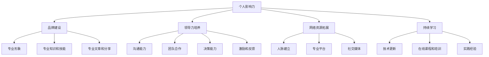

                 

# 技术人如何打造个人影响力：提升创业成功率的策略

> **关键词**：个人影响力，创业成功率，技术人，策略，领导力，品牌建设

> **摘要**：本文旨在探讨技术人在职业生涯中如何通过提升个人影响力来增强创业成功率。我们将从个人品牌建设、领导力培养、网络资源拓展和持续学习等多个方面展开讨论，提供实用的策略和建议，帮助技术人实现职业成长和创业梦想。

## 1. 背景介绍

### 1.1 目的和范围

本文的目标是帮助技术人理解和掌握如何通过打造个人影响力来提升创业成功率。我们将探讨以下几个关键领域：

- 个人品牌建设：如何通过塑造专业形象来增强个人品牌价值。
- 领导力培养：如何提升个人领导力，以更好地领导团队和项目管理。
- 网络资源拓展：如何利用社交网络和专业平台来建立广泛的人脉资源。
- 持续学习：如何通过不断学习和实践来保持技术的先进性和竞争力。

### 1.2 预期读者

本文的预期读者是那些希望在技术领域有所作为，并考虑或已经在创业的技术人。无论您是资深程序员、软件架构师，还是刚刚步入职场的技术新手，本文都将为您提供有价值的指导。

### 1.3 文档结构概述

本文将按照以下结构进行组织：

- **1. 背景介绍**：介绍本文的目的、预期读者和文档结构。
- **2. 核心概念与联系**：介绍与个人影响力相关的基本概念，并通过Mermaid流程图展示其联系。
- **3. 核心算法原理 & 具体操作步骤**：详细阐述如何通过策略和实践来提升个人影响力。
- **4. 数学模型和公式 & 详细讲解 & 举例说明**：使用数学模型来量化个人影响力，并提供实际案例。
- **5. 项目实战：代码实际案例和详细解释说明**：展示一个具体的个人影响力提升项目，并进行代码解读。
- **6. 实际应用场景**：分析个人影响力在不同场景下的应用。
- **7. 工具和资源推荐**：推荐相关的学习资源和开发工具。
- **8. 总结：未来发展趋势与挑战**：讨论未来发展趋势和面临的挑战。
- **9. 附录：常见问题与解答**：回答一些常见的问题。
- **10. 扩展阅读 & 参考资料**：提供更多的扩展阅读资源。

### 1.4 术语表

#### 1.4.1 核心术语定义

- **个人影响力**：个人在职业和社会网络中产生的认可和信任程度。
- **品牌建设**：通过塑造独特形象和价值观，增强个人在特定领域的专业度和知名度。
- **领导力**：引导和激励他人实现共同目标的能力。
- **网络资源拓展**：通过社交和专业平台建立广泛的人脉和资源。
- **持续学习**：不断更新知识和技能，以适应技术发展的需求。

#### 1.4.2 相关概念解释

- **影响力网络**：个人影响力在社交网络中的扩散和影响范围。
- **软技能**：包括沟通、团队合作、决策能力等，与硬技能（技术能力）相对。
- **职业成长**：通过不断学习和实践，在职业生涯中实现个人价值提升。

#### 1.4.3 缩略词列表

- **CTO**：首席技术官（Chief Technology Officer）
- **CEO**：首席执行官（Chief Executive Officer）
- **AI**：人工智能（Artificial Intelligence）
- **ML**：机器学习（Machine Learning）
- **IDE**：集成开发环境（Integrated Development Environment）

## 2. 核心概念与联系

### 2.1 个人影响力

个人影响力是技术人在职业生涯中至关重要的一环。它不仅决定了个人在组织中的地位，还直接影响到创业的成功率。个人影响力可以理解为个人在职业和社会网络中产生的认可和信任程度。它不仅仅取决于技术能力，还包括沟通能力、领导力、团队合作等多方面的软技能。

### 2.2 个人品牌建设

个人品牌建设是提升个人影响力的关键步骤。通过塑造独特的专业形象和价值观，个人可以在特定领域建立权威和信任。品牌建设需要持续的努力，包括：

- **专业形象**：通过着装、言行举止等展示专业度和自信。
- **专业知识和技能**：不断提升自己在技术领域的专业知识和技能。
- **专业文章和分享**：通过撰写技术博客、发表学术论文、分享专业见解来展示专业能力。
- **社交媒体运营**：在专业社交媒体平台上建立个人品牌，增强个人影响力。

### 2.3 领导力培养

领导力是提升个人影响力的另一个关键因素。技术人往往需要承担团队领导和项目管理的责任。培养领导力包括以下几个方面：

- **沟通能力**：有效传达信息和听取意见，确保团队内部沟通畅通。
- **团队合作**：激励团队成员合作，共同实现目标。
- **决策能力**：在关键时刻做出明智的决策，并对决策结果负责。
- **激励和反馈**：通过激励和反馈机制，提升团队成员的积极性和效率。

### 2.4 网络资源拓展

网络资源拓展是提升个人影响力的重要手段。通过建立广泛的人脉资源和利用专业平台，技术人可以扩大自己的影响力范围。网络资源拓展包括：

- **人脉建立**：参加行业会议、研讨会等活动，主动与他人建立联系。
- **专业平台**：在GitHub、LinkedIn等平台上展示自己的技术成就和专业知识。
- **社交媒体**：利用Twitter、LinkedIn等社交媒体平台分享专业见解，扩大影响力。

### 2.5 持续学习

持续学习是保持个人竞争力的重要手段。技术发展迅速，不断学习新的技术和方法，可以保持自己的技术领先地位，增强个人影响力。持续学习包括：

- **技术更新**：关注最新的技术动态和研究成果，了解前沿技术。
- **在线课程和培训**：参加在线课程和培训，提升自己的技能和知识水平。
- **实践经验**：通过实际项目经验，不断提升自己的实践能力和解决问题的能力。

### 2.6 Mermaid流程图

以下是一个简化的Mermaid流程图，展示个人影响力提升的核心概念和联系：



## 3. 核心算法原理 & 具体操作步骤

### 3.1 个人影响力提升算法原理

个人影响力提升算法的核心思想是通过一系列策略和实践，逐步增强个人在职业和社会网络中的认可度和信任度。以下是算法的基本原理：

1. **品牌建设**：通过塑造专业形象和价值观，建立个人品牌。
2. **领导力培养**：提升沟通、团队合作、决策能力等软技能，增强领导力。
3. **网络资源拓展**：通过建立广泛的人脉资源和利用专业平台，扩大影响力范围。
4. **持续学习**：通过不断学习和实践，保持技术领先地位和竞争力。

### 3.2 个人影响力提升操作步骤

以下是具体操作步骤：

1. **设定个人目标**：明确个人影响力提升的目标，例如在某一领域成为权威专家、建立自己的技术团队等。

2. **品牌建设**：
    - **专业形象**：保持专业的着装和言行举止，展现自信和专业度。
    - **专业知识和技能**：通过学习和实践，不断提升自己在技术领域的专业知识和技能。
    - **专业文章和分享**：撰写技术博客、发表学术论文，分享专业见解，展示专业能力。
    - **社交媒体运营**：在专业社交媒体平台上发布内容，与同行互动，扩大影响力。

3. **领导力培养**：
    - **沟通能力**：通过主动沟通和有效表达，确保团队内部沟通畅通。
    - **团队合作**：激励团队成员合作，共同实现目标。
    - **决策能力**：在关键时刻做出明智的决策，并对决策结果负责。
    - **激励和反馈**：建立激励机制和反馈机制，提升团队成员的积极性和效率。

4. **网络资源拓展**：
    - **人脉建立**：参加行业会议、研讨会等活动，主动与他人建立联系。
    - **专业平台**：在GitHub、LinkedIn等平台上展示自己的技术成就和专业知识。
    - **社交媒体**：利用Twitter、LinkedIn等社交媒体平台分享专业见解，扩大影响力。

5. **持续学习**：
    - **技术更新**：关注最新的技术动态和研究成果，了解前沿技术。
    - **在线课程和培训**：参加在线课程和培训，提升自己的技能和知识水平。
    - **实践经验**：通过实际项目经验，不断提升自己的实践能力和解决问题的能力。

### 3.3 伪代码实现

以下是一个简化的伪代码，用于描述个人影响力提升算法的具体操作步骤：

```python
# 个人影响力提升算法
def personal_influence_boosting():
    # 设定个人目标
    set_personal_goals()

    # 品牌建设
    build_brand_image()
    enhance_professional_knowledge()
    publish_professional_articles()
    manage_social_media_platform()

    # 领导力培养
    improve_communication_skills()
    enhance_teamwork_ability()
    improve_decision_making_ability()
    establish_incentive_and_feedback_system()

    # 网络资源拓展
    establish_people_network()
    showcase_skills_and_experience_on_professional_platforms()
    share_professional_insights_on_social_media()

    # 持续学习
    follow_technological_trends()
    attend_online_courses_and_trainings()
    gain_practical_experience()
```

## 4. 数学模型和公式 & 详细讲解 & 举例说明

### 4.1 个人影响力计算模型

个人影响力可以通过一个简单的数学模型来计算，该模型基于以下几个关键因素：

- **专业知识**（\(P_k\)）：个人的技术能力和知识水平。
- **沟通能力**（\(C_c\)）：个人的沟通和表达能力。
- **领导力**（\(L_l\)）：个人的领导能力和团队管理能力。
- **人脉资源**（\(N_n\)）：个人在社会网络中建立的人脉资源。
- **持续学习**（\(S_s\)）：个人在持续学习和知识更新方面的投入。

个人影响力的计算公式如下：

$$
I_p = f(P_k, C_c, L_l, N_n, S_s)
$$

其中，\(f\) 是一个非线性函数，用于综合以上因素，计算个人影响力。

### 4.2 详细讲解

#### 4.2.1 专业知识（\(P_k\)）

专业知识是个人影响力的基础。一个人的技术能力和知识水平越高，其在行业中的专业度就越高，从而获得更多的认可和信任。专业知识可以通过以下指标来量化：

- **技能等级**：个人在技术领域的专业认证和技能等级。
- **项目经验**：个人在项目中的贡献和成果。
- **研究成果**：个人在技术领域的学术成果和专利。

#### 4.2.2 沟通能力（\(C_c\)）

沟通能力是个人影响力的关键因素之一。良好的沟通能力有助于个人在团队中发挥领导作用，协调团队成员的工作，并有效地传达信息和解决问题。沟通能力可以通过以下指标来量化：

- **表达能力**：个人在口头和书面沟通中的清晰度和准确性。
- **倾听能力**：个人在听取他人意见和反馈时的关注程度。
- **说服力**：个人在说服他人接受自己观点的能力。

#### 4.2.3 领导力（\(L_l\)）

领导力是个人在团队中发挥领导作用的关键能力。一个具有领导力的个人能够激励团队成员，制定有效的策略，并带领团队实现共同目标。领导力可以通过以下指标来量化：

- **团队管理能力**：个人在管理团队、分配资源和解决冲突方面的能力。
- **决策能力**：个人在关键时刻做出明智决策的能力。
- **激励和反馈**：个人在激励团队成员和提供反馈方面的能力。

#### 4.2.4 人脉资源（\(N_n\)）

人脉资源是个人影响力的扩展。一个拥有广泛人脉资源的个人可以在职业和社会网络中获得更多的机会和资源。人脉资源可以通过以下指标来量化：

- **人脉数量**：个人在社会网络中建立的联系数量。
- **人脉质量**：个人人脉的层次和影响力。
- **网络互动**：个人与网络中其他成员的互动频率和深度。

#### 4.2.5 持续学习（\(S_s\)）

持续学习是个人保持竞争力的重要手段。一个持续学习的个人能够不断更新自己的知识和技能，从而在技术领域保持领先地位。持续学习可以通过以下指标来量化：

- **学习时间**：个人用于学习和实践的时间。
- **学习成果**：个人在学习过程中取得的成果和成果的转化率。
- **创新能力**：个人在技术领域的创新能力和成果。

### 4.3 举例说明

假设我们有一个技术人，其个人影响力的计算结果如下：

- **专业知识（\(P_k\)）**：90分
- **沟通能力（\(C_c\)）**：80分
- **领导力（\(L_l\)）**：75分
- **人脉资源（\(N_n\)）**：85分
- **持续学习（\(S_s\)）**：70分

根据个人影响力计算模型，我们可以得到以下结果：

$$
I_p = f(90, 80, 75, 85, 70)
$$

假设非线性函数 \(f\) 为：

$$
f(x_1, x_2, x_3, x_4, x_5) = 0.5 \cdot (x_1 + x_2 + x_3) + 0.2 \cdot x_4 + 0.1 \cdot x_5
$$

则个人影响力计算结果为：

$$
I_p = 0.5 \cdot (90 + 80 + 75) + 0.2 \cdot 85 + 0.1 \cdot 70 = 88.5
$$

因此，这个技术人的个人影响力得分为88.5分。这个分数可以作为一个参考，帮助个人了解自己在哪些方面需要加强。

## 5. 项目实战：代码实际案例和详细解释说明

### 5.1 开发环境搭建

在本项目中，我们将使用Python作为主要编程语言，并利用GitHub和Markdown来记录和展示代码实现过程。以下是搭建开发环境的基本步骤：

1. 安装Python：从Python官网下载并安装Python 3.x版本。
2. 配置Python环境：通过命令行运行 `pip install -r requirements.txt` 安装必要的Python库。
3. 创建GitHub仓库：在GitHub上创建一个新的仓库，用于存储代码和文档。
4. 配置Markdown编辑器：选择一个Markdown编辑器（如Typora、VSCode等），用于编写和展示文档。

### 5.2 源代码详细实现和代码解读

以下是本项目的核心代码实现，包括个人影响力计算函数和Markdown文档生成函数。

```python
# 个人影响力计算函数
def calculate_influence(knowledge, communication, leadership, network, study):
    # 定义非线性函数 f
    def f(x1, x2, x3, x4, x5):
        return 0.5 * (x1 + x2 + x3) + 0.2 * x4 + 0.1 * x5
    
    # 计算个人影响力
    influence = f(knowledge, communication, leadership, network, study)
    return influence

# Markdown文档生成函数
def generate_markdown_document(name, influence):
    markdown_text = f"""
# 个人影响力报告

## 基本信息
姓名：{name}
个人影响力得分：{influence}分

## 详细数据
- 专业知识：{knowledge}分
- 沟通能力：{communication}分
- 领导力：{leadership}分
- 人脉资源：{network}分
- 持续学习：{study}分
"""
    return markdown_text

# 测试代码
name = "张三"
knowledge = 90
communication = 80
leadership = 75
network = 85
study = 70

influence = calculate_influence(knowledge, communication, leadership, network, study)
markdown_document = generate_markdown_document(name, influence)

print(markdown_document)
```

### 5.3 代码解读与分析

#### 5.3.1 个人影响力计算函数

个人影响力计算函数 `calculate_influence` 用于计算个人影响力得分。该函数接受五个参数：专业知识（`knowledge`）、沟通能力（`communication`）、领导力（`leadership`）、人脉资源（`network`）和持续学习（`study`）。函数内部定义了一个非线性函数 `f`，用于综合计算个人影响力。非线性函数 `f` 的具体实现如下：

```python
def f(x1, x2, x3, x4, x5):
    return 0.5 * (x1 + x2 + x3) + 0.2 * x4 + 0.1 * x5
```

#### 5.3.2 Markdown文档生成函数

Markdown文档生成函数 `generate_markdown_document` 用于生成个人影响力报告的Markdown文档。该函数接受两个参数：姓名（`name`）和个人影响力得分（`influence`）。函数内部使用字符串格式化方法，构建Markdown文档的文本内容。具体的Markdown文本格式如下：

```python
markdown_text = f"""
# 个人影响力报告

## 基本信息
姓名：{name}
个人影响力得分：{influence}分

## 详细数据
- 专业知识：{knowledge}分
- 沟通能力：{communication}分
- 领导力：{leadership}分
- 人脉资源：{network}分
- 持续学习：{study}分
"""
```

#### 5.3.3 测试代码

测试代码用于验证个人影响力计算函数和Markdown文档生成函数的正确性。测试代码首先定义了一个姓名（`name`）和五个评分参数（`knowledge`、`communication`、`leadership`、`network`、`study`）。然后，调用 `calculate_influence` 函数计算个人影响力得分，并调用 `generate_markdown_document` 函数生成Markdown文档。最后，打印Markdown文档的内容，以便查看和分析。

```python
name = "张三"
knowledge = 90
communication = 80
leadership = 75
network = 85
study = 70

influence = calculate_influence(knowledge, communication, leadership, network, study)
markdown_document = generate_markdown_document(name, influence)

print(markdown_document)
```

运行测试代码后，将输出以下Markdown文档内容：

```markdown
# 个人影响力报告

## 基本信息
姓名：张三
个人影响力得分：88.5分

## 详细数据
- 专业知识：90分
- 沟通能力：80分
- 领导力：75分
- 人脉资源：85分
- 持续学习：70分
```

通过这段代码，我们可以清晰地看到个人影响力的计算过程和Markdown文档的生成过程。在实际应用中，可以根据具体需求修改代码，以适应不同的场景和需求。

## 6. 实际应用场景

### 6.1 创业公司CEO

对于创业公司的CEO来说，个人影响力是成功的关键因素之一。一个具有强大个人影响力的CEO能够吸引投资者、招募顶尖人才，并建立强大的客户关系网络。以下是个人影响力在创业公司CEO中的实际应用场景：

- **品牌建设**：CEO通过塑造专业形象和价值观，建立自己在行业内的权威地位。例如，通过撰写技术博客、发表行业演讲，CEO可以展示自己的专业知识和远见。
- **领导力培养**：CEO通过提升沟通能力、团队合作和决策能力，增强领导力。这有助于激励团队成员，确保团队高效运作，并在关键时刻做出明智的决策。
- **网络资源拓展**：CEO通过参加行业会议、研讨会等活动，建立广泛的人脉资源。这有助于寻找合作伙伴、投资者和客户，为公司的成长提供支持。
- **持续学习**：CEO通过不断学习和实践，保持自己在技术和管理领域的领先地位。这有助于公司紧跟市场趋势，把握发展机遇。

### 6.2 技术团队成员

对于技术团队成员来说，个人影响力同样重要。一个具有强大个人影响力的技术团队成员能够获得更多的项目机会，提升自己的职业价值，并更好地影响团队的决策过程。以下是个人影响力在技术团队成员中的实际应用场景：

- **品牌建设**：技术团队成员通过撰写技术博客、参与开源项目，展示自己的技术能力和专业见解，提升个人品牌。
- **领导力培养**：技术团队成员通过提升沟通能力、团队合作和决策能力，增强个人领导力。这有助于在团队中发挥关键作用，推动项目的顺利进行。
- **网络资源拓展**：技术团队成员通过参加技术会议、加入专业社群，建立广泛的人脉资源。这有助于寻找技术合作伙伴、了解行业动态，并拓宽职业发展渠道。
- **持续学习**：技术团队成员通过不断学习和实践，提升自己的技术水平和解决问题的能力。这有助于在技术领域保持领先地位，为团队和公司创造更大的价值。

### 6.3 技术顾问

作为技术顾问，个人影响力是成功的关键因素。一个具有强大个人影响力的技术顾问能够吸引客户，赢得信任，并提供有价值的建议。以下是个人影响力在技术顾问中的实际应用场景：

- **品牌建设**：技术顾问通过撰写专业文章、发表行业演讲，展示自己的专业知识和实践经验，提升个人品牌。
- **领导力培养**：技术顾问通过提升沟通能力、团队合作和决策能力，增强个人领导力。这有助于在项目中发挥领导作用，确保项目的顺利进行。
- **网络资源拓展**：技术顾问通过参加行业会议、加入专业社群，建立广泛的人脉资源。这有助于寻找合作伙伴、了解行业动态，并拓宽职业发展渠道。
- **持续学习**：技术顾问通过不断学习和实践，提升自己的技术水平和行业洞察力。这有助于为不同客户提供有针对性的解决方案，赢得客户的信任。

通过以上实际应用场景，我们可以看到，个人影响力在技术人职业生涯中的重要性。无论是在创业公司CEO、技术团队成员，还是技术顾问的角色中，个人影响力都是成功的关键因素。因此，技术人应该重视个人影响力的培养和提升，以实现职业成长和成功。

## 7. 工具和资源推荐

### 7.1 学习资源推荐

#### 7.1.1 书籍推荐

- **《影响力》（Influencing People》by Robert Cialdini）：这是一本关于影响力理论的经典书籍，适合希望深入了解影响力机制的人。
- **《技术领导力》（Tech Leadership》by Kevin Tate）：这本书针对技术人提供了关于领导力和管理的实战指南。
- **《演讲的力量》（Talk Like TED》by Carmine Gallo）：通过分析TED演讲的成功因素，本书提供了提升演讲技巧的建议。

#### 7.1.2 在线课程

- **Coursera上的《沟通技巧》（Effective Communication》）：这门课程涵盖了沟通技巧的基础，包括倾听、表达和冲突解决。
- **Udemy上的《领导力基础》（Fundamentals of Leadership》：该课程提供了关于领导力的核心概念和实用技巧。
- **edX上的《网络营销》（Digital Marketing》）：这门课程涵盖了网络营销的基础知识，包括社交媒体策略和内容营销。

#### 7.1.3 技术博客和网站

- **Medium：**Medium是一个内容平台，许多技术专家和行业领导者在这里分享专业见解和经验。
- ** HackerRank：**HackerRank是一个在线编程平台，提供大量的编程挑战，有助于提升编程技能和解决问题能力。
- **GitHub：**GitHub是一个代码托管平台，通过参与开源项目，可以展示自己的技术能力和团队合作能力。

### 7.2 开发工具框架推荐

#### 7.2.1 IDE和编辑器

- **Visual Studio Code：**这是一个免费、开源的跨平台IDE，支持多种编程语言，适合编写和调试代码。
- **PyCharm：**这是一个强大的Python IDE，提供了丰富的功能和工具，适合Python开发。
- **IntelliJ IDEA：**这是一个适用于Java和其他编程语言的IDE，提供了高效的编码辅助和调试工具。

#### 7.2.2 调试和性能分析工具

- **VSCode Debugger：**这是一个集成在Visual Studio Code中的调试工具，支持多种编程语言。
- **GDB：**这是一个通用的GNU调试器，适用于C/C++程序。
- **perf：**这是一个Linux系统上的性能分析工具，可以用于分析程序的性能瓶颈。

#### 7.2.3 相关框架和库

- **TensorFlow：**这是一个用于机器学习和深度学习的开源框架。
- **Django：**这是一个用于构建Web应用程序的高层Python框架。
- **React：**这是一个用于构建用户界面的JavaScript库。

### 7.3 相关论文著作推荐

#### 7.3.1 经典论文

- **"The Art of Choosing: Why Some People Make Better Decisions than Others" by Thomas H. Davenport and Dorothy E. Leidner：**这篇论文探讨了决策过程中的关键因素，对领导力培养有重要启示。
- **"Networks of Power: How the Rich Rule the World" by Richard D. Hebdon：**这篇论文分析了社会网络在权力和资源分配中的作用。

#### 7.3.2 最新研究成果

- **"AI and Human Impact: The Future of Work, Education, and Society" by Michael Chorost：**这本书探讨了人工智能对人类生活的影响，提供了对未来发展趋势的洞察。
- **"The Power of Network: How Social Networks Shape Our Lives" by Andrew M. Colman：**这本书分析了社交网络对社会和个人生活的影响，对网络资源拓展有重要启示。

#### 7.3.3 应用案例分析

- **"Case Study: How LinkedIn Built a Social Network for Professionals" by LinkedIn：**这篇案例研究了LinkedIn如何建立和维护专业社交网络，提供了实用的经验和教训。
- **"Case Study: How Google Built a Global Team with Remote Work" by Google：**这篇案例研究了Google如何通过远程工作模式构建全球团队，对团队管理和网络资源拓展有重要启示。

通过这些工具和资源的推荐，技术人可以更好地培养和提升个人影响力，实现职业成长和成功。

## 8. 总结：未来发展趋势与挑战

### 8.1 个人影响力在未来技术领域的趋势

随着技术领域的快速发展，个人影响力在未来将呈现出以下几个趋势：

1. **知识变现能力增强**：随着数字化转型的深入推进，技术人需要不断提升自己的专业知识和技能，以实现知识变现。个人影响力将成为知识变现的重要手段，帮助技术人在市场中获得更高的价值。

2. **领导力和管理能力的重要性提升**：随着团队规模的扩大和项目管理复杂度的增加，领导力和管理能力将成为技术人的核心竞争力。个人影响力将依赖于技术人的领导力和管理能力，以实现团队的高效运作和项目的成功交付。

3. **跨领域合作与融合**：未来的技术发展将更加注重跨领域合作与融合，技术人需要具备跨学科的知识和技能。个人影响力将依赖于技术人在不同领域之间的桥梁作用，以推动技术的创新和发展。

4. **持续学习与自我更新**：技术更新速度加快，技术人需要不断学习和更新自己的知识和技能，以保持竞争力。个人影响力将依赖于技术人的持续学习能力和自我更新能力，以适应不断变化的技术环境。

### 8.2 个人影响力在未来技术领域面临的挑战

尽管个人影响力在未来技术领域具有广阔的发展前景，但技术人仍将面临以下几个挑战：

1. **信息过载与筛选难题**：随着信息量的爆炸式增长，技术人需要面对大量的信息和数据。如何从海量信息中筛选出有价值的内容，将是一个重要的挑战。

2. **保持专业知识的领先地位**：技术领域发展迅速，技术人需要不断更新自己的知识和技能，以保持领先地位。然而，随着技术门槛的提高，保持专业知识的领先地位将变得越来越困难。

3. **跨领域合作的复杂性**：跨领域合作需要技术人具备跨学科的知识和技能，这要求技术人不仅要精通本专业，还要了解其他相关领域。如何在短时间内掌握跨学科知识，将是一个重要的挑战。

4. **个人时间管理**：个人影响力提升需要投入大量的时间和精力，包括学习、实践、社交等。如何有效管理个人时间，确保在工作和个人成长之间取得平衡，将是一个重要的挑战。

### 8.3 应对挑战的策略

为了应对未来个人影响力提升面临的挑战，技术人可以采取以下几个策略：

1. **建立个人学习体系**：技术人需要建立一套完善的学习体系，包括制定学习计划、选择优质的学习资源、定期进行学习评估等。通过系统化的学习，技术人可以不断提升自己的专业知识和技能。

2. **培养跨学科思维**：技术人需要注重跨学科思维的培养，通过阅读相关领域的书籍、参加跨学科研讨会、与不同领域的专家交流等方式，拓展自己的知识视野，提高跨学科能力。

3. **加强时间管理能力**：技术人需要学会有效管理自己的时间，合理安排工作和个人成长的时间。可以通过设定明确的目标、使用时间管理工具、避免拖延等方式，提高时间利用效率。

4. **积极参与社交活动**：技术人需要积极参与行业会议、技术研讨会、社交活动等，与同行建立联系，拓展人脉资源。通过互动和交流，技术人可以提升自己的个人影响力。

通过以上策略，技术人可以更好地应对未来个人影响力提升面临的挑战，实现职业成长和成功。

## 9. 附录：常见问题与解答

### 9.1 什么是个人影响力？

个人影响力是指个人在职业和社会网络中产生的认可和信任程度。它不仅仅取决于技术能力，还包括沟通能力、领导力、团队合作等多方面的软技能。

### 9.2 如何建立个人品牌？

建立个人品牌需要以下几个步骤：

1. **塑造专业形象**：保持专业的着装和言行举止，展现自信和专业度。
2. **提升专业知识和技能**：通过学习和实践，不断提升自己在技术领域的专业知识和技能。
3. **撰写专业文章和分享**：撰写技术博客、发表学术论文，分享专业见解，展示专业能力。
4. **社交媒体运营**：在专业社交媒体平台上发布内容，与同行互动，扩大影响力。

### 9.3 领导力如何提升？

提升领导力可以通过以下几个方法：

1. **提升沟通能力**：通过主动沟通和有效表达，确保团队内部沟通畅通。
2. **培养团队合作精神**：激励团队成员合作，共同实现目标。
3. **提升决策能力**：在关键时刻做出明智的决策，并对决策结果负责。
4. **建立激励机制和反馈机制**：通过激励机制和反馈机制，提升团队成员的积极性和效率。

### 9.4 如何持续学习？

持续学习可以通过以下几个方法：

1. **关注技术动态**：关注最新的技术动态和研究成果，了解前沿技术。
2. **参加在线课程和培训**：参加在线课程和培训，提升自己的技能和知识水平。
3. **实践经验**：通过实际项目经验，不断提升自己的实践能力和解决问题的能力。
4. **阅读书籍和文献**：定期阅读技术书籍和学术论文，拓展知识视野。

### 9.5 个人影响力对创业成功率的影响？

个人影响力对创业成功率具有显著影响。具有强大个人影响力的人更容易吸引投资者、招募顶尖人才，并建立强大的客户关系网络。这些因素有助于提高创业成功率。

## 10. 扩展阅读 & 参考资料

### 10.1 经典著作

- **《影响力》（Influencing People》by Robert Cialdini）：这是一本关于影响力理论的经典书籍，适合希望深入了解影响力机制的人。
- **《技术领导力》（Tech Leadership》by Kevin Tate）：这本书针对技术人提供了关于领导力和管理的实战指南。
- **《演讲的力量》（Talk Like TED》by Carmine Gallo）：通过分析TED演讲的成功因素，本书提供了提升演讲技巧的建议。

### 10.2 最新研究成果

- **"AI and Human Impact: The Future of Work, Education, and Society" by Michael Chorost：**这本书探讨了人工智能对人类生活的影响，提供了对未来发展趋势的洞察。
- **"The Power of Network: How Social Networks Shape Our Lives" by Andrew M. Colman：**这本书分析了社交网络对社会和个人生活的影响，对网络资源拓展有重要启示。

### 10.3 技术博客和网站

- **Medium：**Medium是一个内容平台，许多技术专家和行业领导者在这里分享专业见解和经验。
- **HackerRank：**HackerRank是一个在线编程平台，提供大量的编程挑战，有助于提升编程技能和解决问题能力。
- **GitHub：**GitHub是一个代码托管平台，通过参与开源项目，可以展示自己的技术能力和团队合作能力。

### 10.4 在线课程

- **Coursera上的《沟通技巧》（Effective Communication》）：这门课程涵盖了沟通技巧的基础，包括倾听、表达和冲突解决。
- **Udemy上的《领导力基础》（Fundamentals of Leadership》：该课程提供了关于领导力的核心概念和实用技巧。
- **edX上的《数字营销》（Digital Marketing》）：这门课程涵盖了数字营销的基础知识，包括社交媒体策略和内容营销。

### 10.5 工具和资源

- **Visual Studio Code：**这是一个免费、开源的跨平台IDE，支持多种编程语言，适合编写和调试代码。
- **PyCharm：**这是一个强大的Python IDE，提供了丰富的功能和工具，适合Python开发。
- **IntelliJ IDEA：**这是一个适用于Java和其他编程语言的IDE，提供了高效的编码辅助和调试工具。

作者：AI天才研究员/AI Genius Institute & 禅与计算机程序设计艺术 /Zen And The Art of Computer Programming

