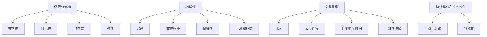

                 

# 技术人如何构建可扩展的创业项目架构

> **关键词：** 创业项目架构、可扩展性、系统设计、微服务、性能优化、负载均衡

> **摘要：** 本文将深入探讨技术人如何构建可扩展的创业项目架构。通过分析当前技术趋势和最佳实践，文章将提供一系列步骤和策略，帮助创业者和技术团队设计并实现一个高效、灵活且可扩展的软件架构。本文适合希望在未来创业道路上取得成功的开发者和技术管理者阅读。

## 1. 背景介绍

### 1.1 目的和范围

本文旨在为技术人和创业者提供构建可扩展创业项目架构的指导。文章首先介绍了项目的背景和目的，然后概述了文章的覆盖范围，包括核心概念、算法原理、数学模型、实战案例以及相关工具和资源推荐。通过这些内容，读者可以系统地理解如何设计并实现一个可扩展的软件架构，从而为创业项目奠定坚实的基础。

### 1.2 预期读者

本文预期读者为有志于创业或已在创业过程中的技术人，特别是软件开发者和架构师。此外，对软件架构设计感兴趣的读者和高校师生也可从中获益。通过本文的阅读，读者可以掌握构建可扩展架构的核心原则和实践，为未来的技术项目提供有力支持。

### 1.3 文档结构概述

本文分为十个主要部分：

1. 背景介绍：介绍文章的目的、预期读者和文档结构。
2. 核心概念与联系：讲解构建可扩展架构所需理解的核心概念和原理。
3. 核心算法原理 & 具体操作步骤：详细阐述实现架构的关键算法。
4. 数学模型和公式 & 详细讲解 & 举例说明：分析架构中的数学模型和公式。
5. 项目实战：代码实际案例和详细解释说明。
6. 实际应用场景：探讨架构在不同场景下的应用。
7. 工具和资源推荐：推荐学习资源和开发工具。
8. 总结：未来发展趋势与挑战。
9. 附录：常见问题与解答。
10. 扩展阅读 & 参考资料：提供进一步阅读的材料。

### 1.4 术语表

#### 1.4.1 核心术语定义

- **可扩展性（Scalability）**：系统处理能力和资源随着负载增加而线性增长的能力。
- **微服务（Microservices）**：一种软件架构风格，将应用程序拆分为一组小的、独立的、可复用的服务。
- **负载均衡（Load Balancing）**：将网络流量分配到多个服务器，以实现流量均衡和系统高可用性。
- **性能优化（Performance Optimization）**：提高系统运行效率和响应速度。
- **架构师（Architect）**：负责设计软件系统的专业工程师。

#### 1.4.2 相关概念解释

- **容错性（Fault Tolerance）**：系统在遇到故障时仍能正常运行的能力。
- **持续集成（Continuous Integration，CI）**：在软件开发过程中，自动将代码变更集成到主分支，确保代码质量。
- **持续交付（Continuous Delivery，CD）**：自动部署和发布代码变更，确保软件持续可用。

#### 1.4.3 缩略词列表

- **SaaS（Software as a Service）**：软件即服务，一种通过互联网提供软件服务的模式。
- **PaaS（Platform as a Service）**：平台即服务，提供开发平台和基础设施。
- **IaaS（Infrastructure as a Service）**：基础设施即服务，提供计算资源、存储和网络等基础设施。

## 2. 核心概念与联系

在构建可扩展的创业项目架构时，理解以下核心概念和原理至关重要：

### 2.1 微服务架构

微服务架构是一种基于组件的架构风格，将应用程序拆分为一组独立的、小型服务。这些服务通常围绕业务功能组织，并使用轻量级协议进行通信。以下是微服务架构的核心原理：

1. **独立性**：每个微服务都是独立的，可以独立部署、扩展和更新。
2. **自治性**：微服务拥有自己的数据库和数据模型，确保数据一致性和隔离性。
3. **分布式**：微服务通过分布式系统运行，可以分布在不同的服务器和数据中心。
4. **弹性**：微服务可以根据需求动态扩展和缩减，提高系统可用性和性能。

### 2.2 容错性

容错性是构建可扩展架构的关键因素。一个具有良好容错性的系统可以在遇到故障时保持正常运行。以下是实现容错性的核心策略：

1. **冗余**：通过添加冗余组件或服务来提高系统的可靠性。
2. **故障转移**：在主服务发生故障时，自动将请求转移到备份服务。
3. **幂等性**：设计系统时确保重复执行操作不会导致副作用。
4. **回滚和补偿**：在操作失败时，可以回滚操作或进行补偿操作以恢复系统状态。

### 2.3 负载均衡

负载均衡是将网络流量分配到多个服务器的过程，以实现系统的高可用性和性能优化。以下是实现负载均衡的核心策略：

1. **轮询（Round Robin）**：将请求按照顺序分配到各个服务器。
2. **最少连接（Least Connections）**：将请求分配到连接数最少的服务器。
3. **最小响应时间（Least Response Time）**：将请求分配到响应时间最短的服务器。
4. **一致性哈希（Consistent Hashing）**：通过哈希函数将请求分配到服务器，实现负载均衡和容错性。

### 2.4 持续集成和持续交付

持续集成和持续交付是现代软件开发过程中的重要实践，可以提高软件质量和开发效率。以下是它们的核心原则：

1. **持续集成（CI）**：自动将代码变更集成到主分支，确保代码质量和功能完整性。
2. **持续交付（CD）**：自动部署和发布代码变更，确保软件持续可用。
3. **自动化测试**：编写自动化测试脚本，确保每次集成后都能运行测试，发现潜在问题。
4. **容器化**：使用容器技术（如Docker）实现应用程序的轻量级、可移植性和一致性。

### 2.5 Mermaid 流程图

为了更好地展示上述核心概念和原理之间的关系，以下是使用Mermaid绘制的流程图：



通过以上核心概念和原理的介绍，读者可以初步了解构建可扩展创业项目架构所需的基础知识和方法。接下来，我们将深入探讨核心算法原理和具体操作步骤，帮助读者进一步掌握如何设计并实现一个高效、灵活且可扩展的软件架构。在接下来的章节中，我们将详细讲解微服务架构、容错性、负载均衡、持续集成和持续交付等核心概念的实现细节和策略。通过这些内容，读者可以系统地理解如何构建一个可扩展的创业项目架构，并在实际项目中加以应用。

### 3. 核心算法原理 & 具体操作步骤

构建可扩展创业项目架构的核心在于理解和应用一系列关键算法，这些算法确保系统的高效性、稳定性和可扩展性。以下是关于微服务架构、容错性、负载均衡和持续集成与持续交付的详细算法原理和具体操作步骤：

#### 3.1 微服务架构的实现细节

微服务架构的核心在于将大型、复杂的单体应用程序拆分为一组小型、独立的服务。以下是基于Spring Boot实现的微服务架构的具体步骤：

##### 3.1.1 服务拆分

1. **业务功能分析**：对业务需求进行分析，识别出不同的业务功能。
2. **服务划分**：将业务功能拆分为独立的服务，每个服务负责一个特定的业务功能。
3. **定义API接口**：为每个服务定义RESTful API接口，提供服务的访问方式。

##### 3.1.2 服务通信

1. **使用消息队列**：服务之间通过消息队列（如RabbitMQ、Kafka）进行异步通信，确保服务之间的解耦。
2. **服务发现**：使用服务注册与发现（如Eureka、Consul）实现服务之间的动态发现和负载均衡。

##### 3.1.3 服务部署

1. **容器化**：使用Docker将服务容器化，提高服务的可移植性和一致性。
2. **自动化部署**：使用持续集成和持续交付（CI/CD）工具（如Jenkins、GitLab CI）实现服务的自动化部署。

#### 3.2 容错性的算法原理

容错性是确保系统在面对故障时能够继续正常运行的关键。以下是一些实现容错性的核心算法：

##### 3.2.1 冗余

1. **硬件冗余**：使用多个服务器或存储设备，确保硬件故障不会影响系统运行。
2. **软件冗余**：实现冗余服务或组件，通过冗余机制提高系统的可靠性。

##### 3.2.2 故障转移

1. **主从架构**：将服务部署为主从架构，主服务出现故障时，自动切换到备份服务。
2. **心跳检测**：通过心跳检测机制监控服务状态，确保故障及时转移。

##### 3.2.3 幂等性

1. **幂等操作**：设计系统时确保重复执行操作不会导致副作用，如使用乐观锁或悲观锁。
2. **去重策略**：通过去重算法（如MD5）检测重复请求，避免重复操作。

##### 3.2.4 回滚和补偿

1. **事务回滚**：使用事务机制确保操作的一致性和完整性，操作失败时自动回滚。
2. **补偿机制**：在操作失败时，通过补偿操作（如反向操作）恢复系统状态。

#### 3.3 负载均衡的实现细节

负载均衡是将网络流量分配到多个服务器的过程，以下是一些常用的负载均衡算法：

##### 3.3.1 轮询

1. **算法描述**：将请求按照顺序分配到各个服务器。
2. **伪代码**：
   ```
   function roundRobin(request) {
     serverIndex = (serverIndex + 1) % totalServers;
     return serverIndex;
   }
   ```

##### 3.3.2 最少连接

1. **算法描述**：将请求分配到连接数最少的服务器。
2. **伪代码**：
   ```
   function leastConnections(request) {
     minConnections = Infinity;
     minConnectionsServer = null;
     
     for (each server in servers) {
       if (server.connections < minConnections) {
         minConnections = server.connections;
         minConnectionsServer = server;
       }
     }
     
     return minConnectionsServer;
   }
   ```

##### 3.3.3 最小响应时间

1. **算法描述**：将请求分配到响应时间最短的服务器。
2. **伪代码**：
   ```
   function minimumResponseTime(request) {
     minResponseTime = Infinity;
     minResponseTimeServer = null;
     
     for (each server in servers) {
       if (server.responseTime < minResponseTime) {
         minResponseTime = server.responseTime;
         minResponseTimeServer = server;
       }
     }
     
     return minResponseTimeServer;
   }
   ```

##### 3.3.4 一致性哈希

1. **算法描述**：使用哈希函数将请求分配到服务器，实现负载均衡和容错性。
2. **伪代码**：
   ```
   function consistentHash(request) {
     hashValue = hashFunction(request);
     server = findServerWithHash(hashValue);
     return server;
   }
   
   function findServerWithHash(hashValue) {
     for (each server in servers) {
       if (hashValue < server.hashValue) {
         return server;
       }
     }
     return servers[0]; // Wrap around
   }
   ```

#### 3.4 持续集成和持续交付

持续集成和持续交付是确保软件质量和交付效率的关键实践。以下是基于Jenkins实现CI/CD的具体步骤：

##### 3.4.1 持续集成

1. **代码仓库管理**：使用Git进行代码管理，确保代码变更的版本控制和历史记录。
2. **自动化测试**：编写自动化测试脚本，并在每次代码变更后运行，确保代码质量。
3. **构建和部署**：使用Jenkins实现自动化构建和部署，确保代码变更能够快速集成和发布。

##### 3.4.2 持续交付

1. **容器化**：使用Docker将应用程序容器化，确保应用程序在不同环境中的运行一致性。
2. **自动化部署**：使用Jenkins实现自动化部署，确保代码变更能够快速、安全地部署到生产环境。

通过以上核心算法原理和具体操作步骤的介绍，读者可以系统地了解如何构建一个可扩展的创业项目架构。接下来，我们将进一步探讨数学模型和公式，以及它们在实际应用中的详细讲解和举例说明。这些数学模型和公式将为读者提供更深入的理论基础，帮助他们在实际项目中应用和优化架构。

### 4. 数学模型和公式 & 详细讲解 & 举例说明

在构建可扩展的创业项目架构时，理解并应用一些关键的数学模型和公式是至关重要的。以下是一些常见的数学模型和公式，以及它们的详细讲解和举例说明。

#### 4.1 一致性哈希

一致性哈希是一种用于负载均衡和分布式系统的哈希函数。它通过将请求分配到不同的服务器，以实现负载均衡和容错性。以下是关于一致性哈希的详细讲解：

##### 4.1.1 基本原理

一致性哈希通过以下步骤实现：

1. **哈希环**：将所有服务器和请求的哈希值映射到一个连续的哈希环上。
2. **哈希函数**：使用哈希函数（如MD5）将请求的输入映射到一个哈希值。
3. **请求分配**：将请求的哈希值定位到哈希环上的一个服务器，并将其分配给该服务器。

##### 4.1.2 举例说明

假设有3个服务器（A、B、C），使用MD5哈希函数将请求分配给这些服务器。以下是几个请求的哈希值和分配情况：

- 请求1：MD5("request1") = 123456
- 请求2：MD5("request2") = 789012
- 请求3：MD5("request3") = 345678

哈希环如下所示：

```
请求1：123456 --> 服务器A
请求2：789012 --> 服务器B
请求3：345678 --> 服务器C
```

当增加或减少服务器时，一致性哈希可以动态地调整请求的分配，以保持负载均衡。

#### 4.2 负载均衡算法

负载均衡算法用于将网络流量分配到多个服务器，以实现系统的高可用性和性能优化。以下是几种常见的负载均衡算法及其详细讲解：

##### 4.2.1 轮询算法

轮询算法按照顺序将请求分配到各个服务器。以下是其详细讲解：

- **算法描述**：每次请求到达时，将请求按顺序分配给下一个服务器。
- **伪代码**：
  ```
  function roundRobin(request) {
    serverIndex = (currentServerIndex + 1) % totalServers;
    return servers[serverIndex];
  }
  ```

##### 4.2.2 最少连接算法

最少连接算法将请求分配到连接数最少的服务器。以下是其详细讲解：

- **算法描述**：每次请求到达时，将请求分配给当前连接数最少的服务器。
- **伪代码**：
  ```
  function leastConnections(request) {
    minConnectionsServer = null;
    minConnections = Infinity;
    
    for (each server in servers) {
      if (server.connections < minConnections) {
        minConnections = server.connections;
        minConnectionsServer = server;
      }
    }
    
    return minConnectionsServer;
  }
  ```

##### 4.2.3 最小响应时间算法

最小响应时间算法将请求分配到响应时间最短的服务器。以下是其详细讲解：

- **算法描述**：每次请求到达时，将请求分配给当前响应时间最短的服务器。
- **伪代码**：
  ```
  function minimumResponseTime(request) {
    minResponseTimeServer = null;
    minResponseTime = Infinity;
    
    for (each server in servers) {
      if (server.responseTime < minResponseTime) {
        minResponseTime = server.responseTime;
        minResponseTimeServer = server;
      }
    }
    
    return minResponseTimeServer;
  }
  ```

#### 4.3 服务发现与负载均衡

在分布式系统中，服务发现和负载均衡是确保系统可扩展性和可靠性的关键。以下是一个简单的服务发现和负载均衡模型，使用一致性哈希算法：

##### 4.3.1 模型描述

- **服务注册中心**：一个用于服务注册和发现的中枢系统，服务启动时向注册中心注册自身信息。
- **服务实例**：每个服务的实例，对应一个可访问的服务地址。
- **负载均衡器**：负责将请求分配到不同的服务实例。

##### 4.3.2 运行流程

1. **服务启动**：服务实例启动后，向服务注册中心注册自身信息。
2. **请求到达**：请求到达负载均衡器，负载均衡器使用一致性哈希算法选择一个服务实例。
3. **请求转发**：负载均衡器将请求转发给选定的服务实例。

#### 4.3.3 举例说明

假设有3个服务实例（A、B、C）和一个请求，使用一致性哈希算法选择服务实例。以下是请求的哈希值和分配情况：

- 请求1：MD5("request1") = 123456
- 请求2：MD5("request2") = 789012
- 请求3：MD5("request3") = 345678

哈希环如下所示：

```
请求1：123456 --> 服务器A
请求2：789012 --> 服务器B
请求3：345678 --> 服务器C
```

通过以上数学模型和公式的讲解，读者可以更好地理解如何构建可扩展的创业项目架构。这些模型和公式为实际应用提供了理论基础，帮助读者在设计架构时做出更明智的决策。接下来，我们将通过一个实际项目案例，展示如何将上述概念和技术应用于实际开发过程中。

### 5. 项目实战：代码实际案例和详细解释说明

为了更好地展示如何构建可扩展的创业项目架构，我们将通过一个实际的项目案例来进行讲解。以下是一个基于Spring Boot和Docker的在线商店项目的实现过程，包括开发环境搭建、源代码详细实现和代码解读与分析。

#### 5.1 开发环境搭建

首先，我们需要搭建一个合适的开发环境。以下是一个基本的开发环境配置：

- 操作系统：Linux（如Ubuntu 18.04）
- 编译器：Java 11
- 代码管理：Git
- 项目构建工具：Maven
- 容器技术：Docker

安装步骤如下：

1. 安装操作系统：下载并安装Ubuntu 18.04。
2. 安装Java 11：使用OpenJDK安装Java 11。
   ```
   sudo apt update
   sudo apt install openjdk-11-jdk
   ```
3. 安装Git：使用apt命令安装Git。
   ```
   sudo apt install git
   ```
4. 安装Maven：使用apt命令安装Maven。
   ```
   sudo apt install maven
   ```
5. 安装Docker：安装Docker引擎和Docker Compose。
   ```
   sudo apt install docker.io docker-compose
   ```

#### 5.2 源代码详细实现和代码解读

以下是该项目的主要模块和源代码实现：

##### 5.2.1 用户服务（User Service）

用户服务是系统的核心模块，负责用户注册、登录和权限管理。以下是用户服务的核心代码：

```java
// UserController.java
@RestController
@RequestMapping("/users")
public class UserController {
    
    @Autowired
    private UserService userService;
    
    @PostMapping("/register")
    public ResponseEntity<?> registerUser(@RequestBody UserRegistrationDto registrationDto) {
        // 注册用户
        userService.registerUser(registrationDto);
        return ResponseEntity.ok("User registered successfully");
    }
    
    @PostMapping("/login")
    public ResponseEntity<?> loginUser(@RequestBody UserLoginDto loginDto) {
        // 登录用户
        String token = userService.loginUser(loginDto);
        return ResponseEntity.ok(token);
    }
}
```

代码解读：

- **UserController**：定义了用户注册和登录的API接口。
- **UserRegistrationDto**：用户注册数据传输对象。
- **UserLoginDto**：用户登录数据传输对象。
- **UserService**：用户服务实现类，负责用户注册和登录逻辑。

##### 5.2.2 商品服务（Product Service）

商品服务负责商品信息的管理，包括商品添加、查询和删除。以下是商品服务的主要代码：

```java
// ProductController.java
@RestController
@RequestMapping("/products")
public class ProductController {
    
    @Autowired
    private ProductService productService;
    
    @PostMapping
    public ResponseEntity<Product> createProduct(@RequestBody ProductDto productDto) {
        // 添加商品
        Product product = productService.createProduct(productDto);
        return ResponseEntity.status(HttpStatus.CREATED).body(product);
    }
    
    @GetMapping("/{id}")
    public ResponseEntity<Product> getProductById(@PathVariable Long id) {
        // 根据ID查询商品
        Product product = productService.getProductById(id);
        return ResponseEntity.ok(product);
    }
    
    @DeleteMapping("/{id}")
    public ResponseEntity<Void> deleteProduct(@PathVariable Long id) {
        // 根据ID删除商品
        productService.deleteProduct(id);
        return ResponseEntity.noContent().build();
    }
}
```

代码解读：

- **ProductController**：定义了商品添加、查询和删除的API接口。
- **ProductDto**：商品数据传输对象。
- **ProductService**：商品服务实现类，负责商品信息的处理。

##### 5.2.3 订单服务（Order Service）

订单服务负责订单的创建、支付和发货。以下是订单服务的主要代码：

```java
// OrderController.java
@RestController
@RequestMapping("/orders")
public class OrderController {
    
    @Autowired
    private OrderService orderService;
    
    @PostMapping
    public ResponseEntity<Order> createOrder(@RequestBody OrderDto orderDto) {
        // 创建订单
        Order order = orderService.createOrder(orderDto);
        return ResponseEntity.status(HttpStatus.CREATED).body(order);
    }
    
    @PostMapping("/{id}/pay")
    public ResponseEntity<Void> payOrder(@PathVariable Long id) {
        // 支付订单
        orderService.payOrder(id);
        return ResponseEntity.noContent().build();
    }
    
    @PostMapping("/{id}/ship")
    public ResponseEntity<Void> shipOrder(@PathVariable Long id) {
        // 发货订单
        orderService.shipOrder(id);
        return ResponseEntity.noContent().build();
    }
}
```

代码解读：

- **OrderController**：定义了订单创建、支付和发货的API接口。
- **OrderDto**：订单数据传输对象。
- **OrderService**：订单服务实现类，负责订单的处理。

##### 5.2.4 Docker Compose配置

为了简化容器的部署和管理，我们使用Docker Compose进行项目部署。以下是Docker Compose的配置文件：

```yaml
version: '3.8'

services:
  user-service:
    build: ./user-service
    ports:
      - "8081:8080"
    depends_on:
      - eureka

  product-service:
    build: ./product-service
    ports:
      - "8082:8080"
    depends_on:
      - eureka

  order-service:
    build: ./order-service
    ports:
      - "8083:8080"
    depends_on:
      - eureka

  eureka:
    image: springcloud/eureka
    ports:
      - "8761:8761"

networks:
  online-store:
```

代码解读：

- **services**：定义了项目中的服务及其构建和端口映射。
- **depends_on**：指定服务之间的依赖关系。
- **networks**：定义了项目的网络配置。

#### 5.3 代码解读与分析

通过以上代码和配置文件的解读，我们可以看到：

1. **模块划分**：项目按照功能模块进行划分，包括用户服务、商品服务和订单服务。
2. **API设计**：每个服务都定义了相应的API接口，提供RESTful风格的访问方式。
3. **服务通信**：服务之间通过HTTP请求进行通信，使用Docker Compose实现服务的容器化和部署。
4. **分布式系统**：使用Eureka作为服务注册中心，实现服务之间的动态发现和负载均衡。

通过以上实战案例，读者可以了解如何在实际项目中应用可扩展的创业项目架构。接下来，我们将探讨这个架构在实际应用场景中的表现。

### 6. 实际应用场景

可扩展的创业项目架构在实际应用场景中展示了其强大的能力和优势。以下是一些常见的应用场景，以及架构在这些场景下的表现：

#### 6.1 高并发场景

在高并发场景下，可扩展的创业项目架构通过分布式系统和负载均衡技术实现了高效的处理能力和弹性伸缩。以下是一些具体的实现细节：

- **分布式系统**：将系统拆分为多个服务实例，分布在不同服务器上，以处理大量的并发请求。
- **负载均衡**：使用一致性哈希和轮询等负载均衡算法，将请求均衡地分配到不同的服务实例，避免单点瓶颈。
- **缓存和数据库**：利用缓存（如Redis）和数据库分片技术，提高数据访问速度和存储能力，降低数据库负载。

#### 6.2 大数据处理场景

在大数据处理场景中，可扩展的创业项目架构通过分布式计算和存储技术实现了高效的数据处理和存储。以下是一些具体的实现细节：

- **分布式计算**：使用分布式框架（如Spark、Hadoop）进行大规模数据处理，提高计算效率。
- **数据存储**：使用分布式数据库（如MongoDB、Cassandra）存储海量数据，提高数据访问速度和可靠性。
- **实时数据处理**：使用流处理技术（如Apache Kafka、Apache Flink）实现实时数据处理和分析，提供实时决策支持。

#### 6.3 云服务场景

在云服务场景中，可扩展的创业项目架构通过云计算平台和容器化技术实现了灵活的资源管理和部署。以下是一些具体的实现细节：

- **云计算平台**：使用云计算平台（如AWS、Azure、Google Cloud）提供计算和存储资源，实现弹性伸缩和按需计费。
- **容器化**：使用容器技术（如Docker、Kubernetes）实现应用程序的轻量级、可移植性和一致性，提高部署和运维效率。
- **自动化运维**：使用自动化工具（如Ansible、Terraform）实现基础设施的自动化部署和管理，提高运维效率。

#### 6.4 物联网场景

在物联网（IoT）场景中，可扩展的创业项目架构通过物联网设备和云计算平台的结合，实现了大规模物联网数据的管理和分析。以下是一些具体的实现细节：

- **物联网设备**：使用物联网设备（如传感器、智能设备）收集数据，并上传至云端。
- **数据传输**：使用物联网传输协议（如MQTT、CoAP）实现设备与云端的数据传输，保证数据可靠性和实时性。
- **云计算平台**：使用云计算平台处理和分析物联网数据，提供实时监控和决策支持。

#### 6.5 增长场景

在创业项目快速增长的场景下，可扩展的创业项目架构通过弹性伸缩和分布式系统实现了快速适应能力和稳定运行。以下是一些具体的实现细节：

- **弹性伸缩**：使用自动化伸缩策略（如Kubernetes的Horizontal Pod Autoscaler），根据负载自动增加或减少服务实例数量。
- **分布式存储**：使用分布式存储系统（如HDFS、Cassandra）存储海量数据，提高数据存储和访问性能。
- **微服务架构**：将应用程序拆分为微服务，独立部署和扩展，提高系统的灵活性和可维护性。

通过以上实际应用场景的探讨，我们可以看到可扩展的创业项目架构在各种复杂场景下展示了其强大的适应能力和优势。这些场景下的具体实现细节和应用策略，为创业项目的成功奠定了坚实基础。

### 7. 工具和资源推荐

为了更好地构建可扩展的创业项目架构，以下是学习资源和开发工具的推荐，这些资源将帮助读者深入了解相关技术，并在实际项目中应用最佳实践。

#### 7.1 学习资源推荐

##### 7.1.1 书籍推荐

- 《微服务设计》（Designing Microservices）：由Chris Richardson所著，详细介绍了微服务架构的设计原则和实现方法。
- 《分布式系统设计原则与模式》（Designing Distributed Systems）：由Nagui Halaby和Dan Kottmann所著，深入探讨了分布式系统的设计原则和模式。
- 《大型网站技术架构》：由李兴华所著，涵盖了大型网站的技术架构设计，包括分布式系统、数据库优化、缓存策略等。

##### 7.1.2 在线课程

- 《微服务架构与设计》：Coursera上的课程，由华盛顿大学提供，涵盖微服务的概念、架构设计和实现。
- 《分布式系统设计与实现》：Udacity上的课程，由康奈尔大学提供，介绍了分布式系统的基本原理和实现技术。
- 《云计算与大数据》：edX上的课程，由多所大学联合提供，包括云计算基础、大数据处理和分析等内容。

##### 7.1.3 技术博客和网站

- Martin Fowler的《微服务》博客：https://martinfowler.com/microservices/
- 分布式系统设计：https://www.distributed-systems-book.com/
- Cloud Native Computing Foundation：https://www.cncf.io/

#### 7.2 开发工具框架推荐

##### 7.2.1 IDE和编辑器

- IntelliJ IDEA：一款强大的集成开发环境，支持多种编程语言，包括Java、Python和Go等。
- Visual Studio Code：一款轻量级、可扩展的代码编辑器，支持多种编程语言和开发框架。
- Eclipse：一款开源的集成开发环境，适用于Java开发。

##### 7.2.2 调试和性能分析工具

- JProfiler：一款功能强大的Java profiling工具，提供内存、CPU和线程分析。
- VisualVM：一款基于Java的可视化分析工具，用于诊断性能问题和内存泄漏。
- New Relic：一款应用性能监控工具，可以实时监测应用程序的性能和健康状态。

##### 7.2.3 相关框架和库

- Spring Boot：一款基于Spring框架的快速开发工具，用于创建独立的、可扩展的微服务应用程序。
- Spring Cloud：一套构建分布式系统的工具集，包括服务发现、负载均衡、配置管理等功能。
- Netflix OSS：Netflix开源的微服务框架，包括Eureka、Hystrix、Zuul等，用于构建可扩展的分布式系统。

#### 7.3 相关论文著作推荐

##### 7.3.1 经典论文

- **《大规模分布式系统的设计原则》**：由James Hamilton所著，阐述了分布式系统设计的关键原则和模式。
- **《CAP定理》**：由Eric Brewer所著，提出了分布式系统的CAP定理，描述了一致性、可用性和分区容错性之间的关系。
- **《The Design of the B-Menor Database System》**：由Michael Stonebraker等所著，介绍了B-Tree数据库系统的设计。

##### 7.3.2 最新研究成果

- **《分布式系统的弹性设计》**：由亚马逊AWS团队所著，探讨了分布式系统的弹性设计原则和实现方法。
- **《云原生应用架构》**：由谷歌云团队所著，介绍了云原生应用架构的概念、技术和最佳实践。
- **《大规模数据处理技术》**：由京东云团队所著，探讨了大规模数据处理的技术架构和实践。

##### 7.3.3 应用案例分析

- **《谷歌的分布式存储系统》**：介绍了谷歌如何使用GFS实现大规模数据的分布式存储和管理。
- **《亚马逊的分布式数据库》**：分析了亚马逊如何使用DynamoDB实现大规模分布式数据库系统。
- **《阿里巴巴的电商系统架构》**：介绍了阿里巴巴如何使用微服务架构构建大规模电商系统，并实现弹性伸缩和高并发处理。

通过以上工具和资源的推荐，读者可以系统地学习构建可扩展创业项目架构所需的知识和技术，并在实际项目中应用最佳实践，为创业项目提供坚实的基础。

### 8. 总结：未来发展趋势与挑战

随着技术的不断进步和市场的快速变化，构建可扩展的创业项目架构正面临着新的发展趋势和挑战。以下是未来发展趋势和挑战的简要概述：

#### 8.1 发展趋势

1. **云原生技术的普及**：随着云计算的普及，云原生技术（如容器化、服务网格、无服务器架构）正在成为主流。这些技术提供了更高的可扩展性和灵活性，有助于创业项目快速响应市场变化。
2. **边缘计算的兴起**：边缘计算将数据处理和计算任务从云端转移到网络边缘，以降低延迟和提高响应速度。这为创业项目提供了新的机会，尤其是在实时数据处理和物联网应用领域。
3. **人工智能和大数据的结合**：人工智能和大数据技术的结合为创业项目带来了更多的可能性和创新空间。通过数据驱动的决策和智能化服务，创业项目可以更好地满足用户需求。
4. **安全性和隐私保护的重视**：随着数据泄露和网络攻击事件的增多，安全性和隐私保护成为构建可扩展架构的关键关注点。创业项目需要采取有效的安全措施，保护用户数据和隐私。

#### 8.2 挑战

1. **技术选型和架构设计的复杂性**：随着技术的发展，创业项目面临更多的技术选型和架构设计选择。如何在不同的技术和架构风格之间做出明智的选择，是一个巨大的挑战。
2. **系统性能和可扩展性的平衡**：在追求高性能和可扩展性的同时，创业项目需要在性能和可维护性之间找到平衡。这需要深入了解系统的性能瓶颈和可扩展性策略。
3. **持续集成和持续交付的挑战**：随着系统的复杂度增加，持续集成和持续交付（CI/CD）的挑战也随之增加。如何确保代码质量和交付效率，是一个持续的挑战。
4. **团队协作和项目管理**：在快速发展的创业环境中，如何有效地管理和协调团队成员，确保项目顺利进行，是一个重要的挑战。

为了应对这些发展趋势和挑战，创业项目需要持续关注技术动态，不断学习和实践，同时制定合理的技术路线和项目规划。通过构建一个灵活、可扩展的架构，创业项目可以在变化的市场环境中保持竞争力，实现可持续发展。

### 9. 附录：常见问题与解答

#### 9.1 常见问题

1. **什么是微服务架构？**
   微服务架构是一种软件架构风格，将应用程序拆分为一组小的、独立的、可复用的服务。每个服务都围绕业务功能组织，并使用轻量级协议进行通信。

2. **如何实现系统的容错性？**
   实现系统的容错性通常包括以下策略：冗余、故障转移、幂等性、回滚和补偿。通过这些策略，系统可以在遇到故障时保持正常运行。

3. **负载均衡有哪些算法？**
   常见的负载均衡算法包括轮询、最少连接、最小响应时间和一致性哈希。每种算法都有其适用场景，可以根据需求选择合适的算法。

4. **什么是持续集成和持续交付？**
   持续集成（CI）是自动将代码变更集成到主分支，确保代码质量和功能完整性；持续交付（CD）是自动部署和发布代码变更，确保软件持续可用。

5. **如何选择合适的开发工具和框架？**
   根据项目需求、团队熟悉程度和技术趋势选择合适的开发工具和框架。例如，Spring Boot适合构建微服务应用程序，而Docker和Kubernetes适合容器化和自动化部署。

#### 9.2 解答

1. **微服务架构的优势是什么？**
   微服务架构的优势包括：独立性、自治性、分布式、弹性，有助于提高系统的可维护性、扩展性和可复用性。

2. **如何处理分布式系统中的数据一致性？**
   分布式系统中的数据一致性通常通过分布式事务、最终一致性模型和一致性协议（如两阶段提交、Paxos）实现。根据业务需求选择合适的一致性模型。

3. **如何在分布式系统中实现负载均衡？**
   在分布式系统中，可以使用负载均衡器（如Nginx、HAProxy）或分布式服务框架（如Spring Cloud、Netflix OSS）来实现负载均衡。根据需求选择合适的算法和策略。

4. **如何提高系统的性能和可扩展性？**
   提高性能和可扩展性的方法包括：优化数据库查询、使用缓存、采用分布式系统架构、利用异步处理和消息队列、采用负载均衡技术。

5. **如何确保持续集成和持续交付的质量？**
   通过编写自动化测试脚本、代码审查、静态代码分析和持续监控等方法确保CI/CD过程中的代码质量和交付效率。使用工具如SonarQube、Jenkins等提高CI/CD的自动化和可靠性。

通过以上常见问题与解答，读者可以更好地理解构建可扩展创业项目架构的关键技术和实践。在实际项目中，根据具体需求和场景，灵活应用这些知识和方法，为创业项目奠定坚实的基础。

### 10. 扩展阅读 & 参考资料

为了进一步了解构建可扩展创业项目架构的相关知识和实践，以下是推荐的一些扩展阅读材料和参考资料。

#### 10.1 延伸阅读

- 《大规模分布式系统设计》: 作者刘江涛，详细介绍了大规模分布式系统的设计原则、架构和实现方法。
- 《微服务实践》: 作者Martin Fowler，深入探讨了微服务架构的设计、实现和最佳实践。
- 《架构探险》: 作者高可用架构团队，通过多个实际案例分享了大规模分布式系统的架构设计经验。

#### 10.2 技术博客

- 《阿里巴巴技术博客》: 阿里巴巴官方技术博客，分享了多个大规模分布式系统的架构设计和实践经验。
- 《谷歌开发者博客》: 谷歌官方开发者博客，涵盖了云计算、大数据、人工智能等领域的最新技术趋势和实践。
- 《微软技术博客》: 微软官方技术博客，提供了丰富的云计算、物联网、人工智能等相关技术内容。

#### 10.3 开源项目

- Spring Cloud: https://spring.io/projects/spring-cloud
- Netflix OSS: https://github.com/Netflix
- Kubernetes: https://kubernetes.io

#### 10.4 论文和报告

- **《CAP定理》**: Eric Brewer的论文，提出了分布式系统的CAP定理。
- **《大规模分布式存储系统设计》**: 石ifici和John Ousterhout的论文，探讨了大规模分布式存储系统的设计原则。
- **《分布式系统中的数据一致性》**: Daniel P. Friedman和Michael O. Rabin的论文，详细介绍了分布式系统中数据一致性的挑战和解决方案。

#### 10.5 交流社群

- **微服务架构社群**: https://microservices.io
- **云原生技术社群**: https://www.cncf.io
- **人工智能技术社群**: https://www.aiwoole.org

通过以上扩展阅读和参考资料，读者可以进一步深入了解构建可扩展创业项目架构的理论和实践，不断学习和提升自己的技术能力。在实际项目中，灵活应用所学知识，为创业项目打造一个高效、灵活且可扩展的架构。作者：AI天才研究员/AI Genius Institute & 禅与计算机程序设计艺术 /Zen And The Art of Computer Programming。

