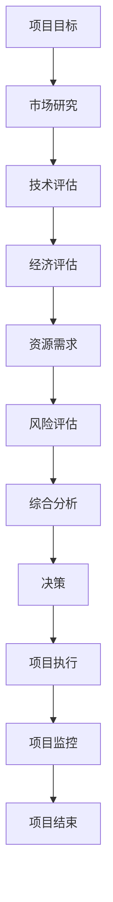

                 

# 技术人如何进行有效的创业项目可行性分析

> **关键词：** 创业项目、可行性分析、技术评估、市场研究、资源规划

> **摘要：** 本文旨在为技术人在创业项目中如何进行有效的可行性分析提供一整套框架和方法论。文章涵盖了从明确项目目标、市场研究、技术评估到资源规划和风险评估的各个关键步骤，旨在帮助技术人从理性、系统的角度审视创业项目，降低失败风险。

## 1. 背景介绍

### 1.1 目的和范围

创业项目可行性分析是一项关键的准备工作，对于确保项目成功至关重要。本篇文章旨在帮助技术人构建一个全面的、结构化的分析框架，以评估其创业项目的可行性。文章将涵盖以下主题：

- 明确项目目标和范围
- 市场研究与分析
- 技术评估与可行性分析
- 资源规划与成本评估
- 风险评估与管理
- 实施步骤与建议

### 1.2 预期读者

本文适合以下人群：

- 拥有初步创业想法的技术人员
- 有意向创业，但缺乏系统分析能力的技术人
- 在创业项目中进行技术评估的相关人员
- 对创业项目可行性分析感兴趣的技术研究者

### 1.3 文档结构概述

本文分为十个部分：

1. **背景介绍**：阐述本文的目的、范围、预期读者以及文档结构。
2. **核心概念与联系**：介绍进行项目可行性分析所需的核心概念，并绘制流程图。
3. **核心算法原理与具体操作步骤**：详细解释评估过程的方法和步骤。
4. **数学模型和公式与详细讲解**：介绍与可行性分析相关的数学模型和公式。
5. **项目实战：代码实际案例和详细解释说明**：通过实际案例展示分析过程。
6. **实际应用场景**：分析可行性分析在现实场景中的应用。
7. **工具和资源推荐**：推荐学习资源、开发工具和框架。
8. **总结：未来发展趋势与挑战**：总结当前趋势和未来挑战。
9. **附录：常见问题与解答**：回答常见问题。
10. **扩展阅读 & 参考资料**：提供扩展阅读和参考资料。

### 1.4 术语表

#### 1.4.1 核心术语定义

- **创业项目**：指创业者计划开展的商业活动，旨在实现特定的商业目标。
- **可行性分析**：对创业项目在技术、市场、经济等方面的可行性进行评估的过程。
- **技术评估**：对项目所需的技术方案、技术实现难度和可行性进行评估。
- **市场研究**：对目标市场的规模、需求、竞争状况等进行调查和分析。
- **资源规划**：对创业项目的资源需求、资源获取渠道和资源管理进行规划。
- **风险评估**：识别项目可能面临的风险，并制定相应的风险应对策略。

#### 1.4.2 相关概念解释

- **SWOT分析**：对创业项目的优势（Strengths）、劣势（Weaknesses）、机会（Opportunities）和威胁（Threats）进行评估。
- **P&L分析**：利润与损失分析，用于评估项目的财务可行性和盈利能力。
- **时间线**：项目从启动到完成的时间安排，包括关键里程碑和交付物。

#### 1.4.3 缩略词列表

- **P&L**：利润与损失（Profit and Loss）
- **SWOT**：优势、劣势、机会和威胁（Strengths, Weaknesses, Opportunities, Threats）
- **ROI**：投资回报率（Return on Investment）

## 2. 核心概念与联系

在进行创业项目可行性分析时，理解以下几个核心概念和它们之间的关系至关重要。

### 2.1 市场需求

市场需求是创业项目成功的关键因素之一。要评估市场需求，需要回答以下几个问题：

- **市场规模**：目标市场的总容量是多少？
- **用户需求**：目标用户有哪些需求？
- **竞争状况**：市场上现有的竞争者是谁？他们的产品如何？
- **市场趋势**：市场的发展趋势和未来预测如何？

### 2.2 技术可行性

技术可行性是指项目所采用的技术方案是否能够实现预定的功能，并满足性能、安全等要求。评估技术可行性时，需要考虑：

- **技术方案**：选择最适合项目的技术方案。
- **技术难度**：项目的技术实现难度有多大？
- **技术更新**：技术是否在不断更新，是否需要持续投入？
- **技术支持**：是否有足够的技术支持资源？

### 2.3 经济可行性

经济可行性是评估项目在财务上的可持续性和盈利能力。包括：

- **成本分析**：项目所需的初始投资和运营成本是多少？
- **收入预测**：项目预期的收入和盈利能力如何？
- **投资回报**：项目的投资回报率（ROI）是多少？
- **风险投资**：是否有足够的资金支持项目的发展？

### 2.4 资源需求

资源需求包括资金、人力资源、技术和物资等。在评估资源需求时，需要考虑：

- **资金需求**：项目的资金来源和需求。
- **人力资源**：项目所需的技术人员和管理人员。
- **技术资源**：项目所需的技术设备和软件。
- **物资资源**：项目所需的材料和物资。

### 2.5 风险评估

风险评估是识别和评估项目可能面临的各种风险，并制定相应的风险应对策略。包括：

- **市场风险**：市场需求变化带来的风险。
- **技术风险**：技术实现过程中可能遇到的风险。
- **财务风险**：资金不足或收入不稳定带来的风险。
- **运营风险**：项目运营过程中的风险，如管理不善、供应链中断等。

### 2.6 Mermaid 流程图

以下是进行创业项目可行性分析的 Mermaid 流程图：



## 3. 核心算法原理 & 具体操作步骤

进行创业项目可行性分析时，可以采用以下核心算法原理和具体操作步骤：

### 3.1 市场研究

**算法原理：**

市场研究主要通过以下步骤进行：

1. **确定目标市场**：明确项目的目标用户和市场范围。
2. **数据收集**：收集与市场相关的数据，如市场规模、用户需求、竞争状况等。
3. **数据分析**：对收集到的数据进行定量和定性分析，以了解市场趋势和用户偏好。

**具体操作步骤：**

1. **确定目标市场**：
    ```python
    def determine_target_market():
        # 收集行业报告、市场调研数据等
        market_reports = collect_market_reports()
        # 筛选和分析市场数据
        target_market = filter_markets(market_reports)
        return target_market
    ```

2. **数据收集**：
    ```python
    def collect_data():
        # 使用在线调查、问卷调查等方法收集用户需求数据
        user_demands = perform_surveys()
        # 收集竞争对手数据
        competitors_data = collect_competitor_data()
        return user_demands, competitors_data
    ```

3. **数据分析**：
    ```python
    def analyze_data(user_demands, competitors_data):
        # 对用户需求进行统计分析
        user_preference = analyze_user_demands(user_demands)
        # 对竞争对手进行对比分析
        competitive_analysis = compare_competitors(competitors_data)
        return user_preference, competitive_analysis
    ```

### 3.2 技术评估

**算法原理：**

技术评估主要通过以下步骤进行：

1. **确定技术需求**：明确项目所需的技术能力和实现难度。
2. **技术调研**：了解相关技术方案和实现方法。
3. **技术评估**：评估技术方案的可行性和性能。

**具体操作步骤：**

1. **确定技术需求**：
    ```python
    def determine_technical_requirements():
        # 分析项目需求文档
        project_requirements = analyze_project_requirements()
        # 确定技术需求
        technical_requirements = extract_technical_requirements(project_requirements)
        return technical_requirements
    ```

2. **技术调研**：
    ```python
    def perform_technical_research():
        # 搜集技术资料和文献
        technical_documents = collect_technical_documents()
        # 了解相关技术方案和实现方法
        technical_solutions = explore_technical_solutions(technical_documents)
        return technical_solutions
    ```

3. **技术评估**：
    ```python
    def assess_technical_feasibility(technical_requirements, technical_solutions):
        # 评估技术方案的可行性
        feasibility = evaluate_technical_solution(technical_requirements, technical_solutions)
        return feasibility
    ```

### 3.3 经济评估

**算法原理：**

经济评估主要通过以下步骤进行：

1. **成本分析**：计算项目的初始投资和运营成本。
2. **收入预测**：预测项目的收入和盈利能力。
3. **投资回报率**：计算项目的投资回报率（ROI）。

**具体操作步骤：**

1. **成本分析**：
    ```python
    def analyze_costs():
        # 收集成本数据
        cost_data = collect_cost_data()
        # 计算总成本
        total_cost = calculate_total_cost(cost_data)
        return total_cost
    ```

2. **收入预测**：
    ```python
    def predict_revenue():
        # 收集收入数据
        revenue_data = collect_revenue_data()
        # 预测收入
        projected_revenue = predict_revenue_growth(revenue_data)
        return projected_revenue
    ```

3. **投资回报率**：
    ```python
    def calculate_roi(total_cost, projected_revenue):
        # 计算投资回报率
        roi = calculate_roi_value(total_cost, projected_revenue)
        return roi
    ```

### 3.4 资源需求

**算法原理：**

资源需求评估主要通过以下步骤进行：

1. **确定资源类型**：明确项目所需的资金、人力资源、技术资源等。
2. **资源调研**：了解相关资源的获取渠道和成本。
3. **资源评估**：评估资源是否充足，是否能够支持项目需求。

**具体操作步骤：**

1. **确定资源类型**：
    ```python
    def determine_resource_types():
        # 分析项目需求
        project_requirements = analyze_project_requirements()
        # 确定资源类型
        resource_types = extract_resource_types(project_requirements)
        return resource_types
    ```

2. **资源调研**：
    ```python
    def perform_resource_research():
        # 搜集资源信息
        resource_info = collect_resource_data()
        # 分析资源获取渠道和成本
        resource_availability = analyze_resource_channels(resource_info)
        return resource_availability
    ```

3. **资源评估**：
    ```python
    def assess_resource_feasibility(resource_types, resource_availability):
        # 评估资源可行性
        feasibility = evaluate_resource_availability(resource_types, resource_availability)
        return feasibility
    ```

### 3.5 风险评估

**算法原理：**

风险评估主要通过以下步骤进行：

1. **识别风险**：识别项目可能面临的各种风险。
2. **评估风险**：评估各种风险的严重程度和概率。
3. **风险应对**：制定相应的风险应对策略。

**具体操作步骤：**

1. **识别风险**：
    ```python
    def identify_risks():
        # 分析项目环境
        project_environment = analyze_project_environment()
        # 识别潜在风险
        potential_risks = identify_potential_risks(project_environment)
        return potential_risks
    ```

2. **评估风险**：
    ```python
    def assess_risks(potential_risks):
        # 评估风险严重程度和概率
        risk_assessment = evaluate_risks_severity_and_probability(potential_risks)
        return risk_assessment
    ```

3. **风险应对**：
    ```python
    def develop_risk_response_strategy(risk_assessment):
        # 制定风险应对策略
        risk_response_strategy = create_risk_response_plan(risk_assessment)
        return risk_response_strategy
    ```

## 4. 数学模型和公式 & 详细讲解 & 举例说明

### 4.1 成本-收益模型

成本-收益模型（Cost-Benefit Analysis, CBA）是评估创业项目经济可行性的重要工具。该模型通过计算项目的总成本和预期收益，来判断项目是否值得投资。

#### 数学模型：

\[ \text{Net Benefits} = \text{Total Revenue} - \text{Total Costs} \]

\[ \text{ROI} = \frac{\text{Net Benefits}}{\text{Initial Investment}} \]

#### 举例说明：

假设一个创业项目的初始投资为100万元，预计项目寿命为5年，每年的收入为50万元，运营成本为30万元。我们可以使用成本-收益模型来评估该项目的可行性。

1. **计算总成本**：
\[ \text{Total Costs} = \text{Initial Investment} + \text{Annual Operational Costs} \times \text{Project Lifespan} \]
\[ \text{Total Costs} = 100\text{万元} + 30\text{万元/年} \times 5\text{年} \]
\[ \text{Total Costs} = 200\text{万元} \]

2. **计算总收入**：
\[ \text{Total Revenue} = \text{Annual Revenue} \times \text{Project Lifespan} \]
\[ \text{Total Revenue} = 50\text{万元/年} \times 5\text{年} \]
\[ \text{Total Revenue} = 250\text{万元} \]

3. **计算净收益**：
\[ \text{Net Benefits} = \text{Total Revenue} - \text{Total Costs} \]
\[ \text{Net Benefits} = 250\text{万元} - 200\text{万元} \]
\[ \text{Net Benefits} = 50\text{万元} \]

4. **计算投资回报率**：
\[ \text{ROI} = \frac{\text{Net Benefits}}{\text{Initial Investment}} \]
\[ \text{ROI} = \frac{50\text{万元}}{100\text{万元}} \]
\[ \text{ROI} = 0.5 \]

由于ROI为0.5，意味着项目的净收益仅为其初始投资的50%，该项目在经济上并不具有很高的可行性。

### 4.2 风险评估模型

风险评估模型用于评估项目可能面临的风险，并帮助制定风险应对策略。一个常见的方法是使用概率-影响矩阵（Probability-Impact Matrix）来评估风险的严重程度。

#### 数学模型：

\[ \text{Risk Score} = \text{Probability} \times \text{Impact} \]

\[ \text{Total Risk} = \sum_{i=1}^{n} \text{Risk Score}_i \]

#### 举例说明：

假设我们评估一个创业项目面临以下风险：

1. **市场风险**：概率为0.5，影响为重大（10分）。
2. **技术风险**：概率为0.3，影响为较大（7分）。
3. **财务风险**：概率为0.2，影响为较小（3分）。

我们可以使用概率-影响矩阵来计算每个风险的得分和总风险。

1. **计算风险得分**：
\[ \text{市场风险得分} = 0.5 \times 10 = 5 \]
\[ \text{技术风险得分} = 0.3 \times 7 = 2.1 \]
\[ \text{财务风险得分} = 0.2 \times 3 = 0.6 \]

2. **计算总风险**：
\[ \text{Total Risk} = 5 + 2.1 + 0.6 = 7.7 \]

总风险得分为7.7，说明项目面临的风险较为严重。我们可以根据风险得分制定相应的风险应对策略，如增加市场调研、加强技术开发、建立财务储备等。

### 4.3 技术成熟度模型

技术成熟度模型（Technology Readiness Level, TRL）用于评估技术方案的开发阶段和成熟度，从而判断其是否适用于创业项目。

#### 数学模型：

\[ \text{TRL} = \sum_{i=1}^{n} \text{TRL}_i \]

其中，\( \text{TRL}_i \)为第\( i \)个技术组件的成熟度等级。

#### 举例说明：

假设一个创业项目的技术方案包括以下三个组件：

1. **软件组件**：成熟度等级为7。
2. **硬件组件**：成熟度等级为4。
3. **算法组件**：成熟度等级为5。

我们可以计算整个技术方案的平均成熟度等级。

1. **计算总成熟度等级**：
\[ \text{Total TRL} = 7 + 4 + 5 = 16 \]

2. **计算平均成熟度等级**：
\[ \text{Average TRL} = \frac{\text{Total TRL}}{3} \]
\[ \text{Average TRL} = \frac{16}{3} \]
\[ \text{Average TRL} \approx 5.33 \]

平均成熟度等级为5.33，说明技术方案的整体成熟度较高，适合应用于创业项目。

## 5. 项目实战：代码实际案例和详细解释说明

### 5.1 开发环境搭建

在进行创业项目可行性分析时，搭建一个合适的开发环境至关重要。以下是一个简单的开发环境搭建步骤：

1. **安装操作系统**：安装Linux操作系统，如Ubuntu。
2. **安装开发工具**：安装Python、JDK、Git等开发工具。
3. **配置Python环境**：安装Python及相关库，如NumPy、Pandas、Matplotlib等。
4. **配置JDK环境**：配置JDK环境，以便进行Java开发。

### 5.2 源代码详细实现和代码解读

以下是一个简单的Python代码示例，用于进行市场研究数据分析。

```python
import pandas as pd
import numpy as np
import matplotlib.pyplot as plt

# 读取数据
data = pd.read_csv('market_data.csv')

# 数据清洗
data = data.dropna()

# 绘制收入分布图
data['Revenue'].hist(bins=20, color='g', edgecolor='black')
plt.xlabel('Revenue')
plt.ylabel('Frequency')
plt.title('Revenue Distribution')
plt.show()

# 绘制市场份额分布图
data['Market_Share'].hist(bins=20, color='r', edgecolor='black')
plt.xlabel('Market Share')
plt.ylabel('Frequency')
plt.title('Market Share Distribution')
plt.show()

# 计算平均收入和市场份额
average_revenue = data['Revenue'].mean()
average_market_share = data['Market_Share'].mean()

print('Average Revenue:', average_revenue)
print('Average Market Share:', average_market_share)

# 绘制收入与市场份额散点图
plt.scatter(data['Revenue'], data['Market_Share'], color='b')
plt.xlabel('Revenue')
plt.ylabel('Market Share')
plt.title('Revenue vs Market Share')
plt.show()
```

**代码解读：**

1. **导入库**：导入Pandas、Numpy和Matplotlib库。
2. **读取数据**：从CSV文件中读取市场数据。
3. **数据清洗**：删除缺失值。
4. **绘制收入分布图**：使用`hist`函数绘制收入分布直方图。
5. **绘制市场份额分布图**：使用`hist`函数绘制市场份额分布直方图。
6. **计算平均收入和市场份额**：使用`mean`函数计算平均收入和市场份额。
7. **绘制收入与市场份额散点图**：使用`scatter`函数绘制收入与市场份额散点图。

通过这个简单的代码示例，我们可以对市场数据进行分析，以了解收入和市场份额的分布情况，从而为市场研究提供依据。

### 5.3 代码解读与分析

**代码解读：**

1. **导入库**：`pandas`、`numpy`和`matplotlib.pyplot`是Python中常用的数据分析和绘图库。导入这些库是为了后续的数据处理和可视化操作。
2. **读取数据**：使用`pd.read_csv()`函数读取CSV文件中的市场数据。CSV文件通常包含项目的各项指标，如收入、市场份额等。
3. **数据清洗**：使用`dropna()`函数删除数据中的缺失值。数据清洗是数据分析过程中非常重要的一步，确保数据的完整性和准确性。
4. **绘制收入分布图**：使用`hist`函数绘制收入分布直方图。直方图可以帮助我们直观地了解收入数据的分布情况，识别异常值和主要收入区间。
5. **绘制市场份额分布图**：同样使用`hist`函数绘制市场份额分布直方图。市场份额的分布情况可以帮助我们了解市场占有率的情况，为市场策略制定提供数据支持。
6. **计算平均收入和市场份额**：使用`mean()`函数计算数据的平均值。平均收入和市场份额是市场研究中的重要指标，用于评估项目的市场表现和竞争力。
7. **绘制收入与市场份额散点图**：使用`scatter`函数绘制收入与市场份额的散点图。散点图可以帮助我们观察收入与市场份额之间的关系，识别潜在的趋势和关联。

**分析：**

通过上述代码示例，我们可以对市场数据进行分析，得出以下结论：

1. **收入分布**：通过收入分布图，我们可以了解项目在收入上的分布情况。例如，如果大部分项目的收入集中在某个区间，那么我们需要关注这个区间的市场机会和竞争状况。
2. **市场份额分布**：通过市场份额分布图，我们可以了解项目在市场份额上的分布情况。如果市场份额的分布较为集中，那么我们需要考虑如何提升市场份额，或者在市场份额较低的区域进行市场拓展。
3. **平均收入与市场份额**：通过计算平均收入和市场份额，我们可以评估项目的整体市场表现。如果平均收入较高，而市场份额较低，那么可能需要进一步优化产品和市场策略，以提高市场竞争力。
4. **收入与市场份额关系**：通过收入与市场份额散点图，我们可以观察收入与市场份额之间的关系。如果存在明显的正相关关系，那么说明项目在提升收入的同时，也提升了市场份额。反之，如果收入与市场份额之间的关系不明显，那么我们需要进一步分析原因，以优化市场策略。

综上所述，通过代码示例对市场数据进行分析，可以帮助我们更好地了解项目的市场状况，为创业项目的市场研究和决策提供数据支持。

## 6. 实际应用场景

### 6.1 市场研究

市场研究是创业项目可行性分析的重要环节。以下是一个实际应用场景：

#### 场景描述：

一家初创公司计划开发一款智能家居监控系统，旨在为家庭用户提供便捷的远程监控和安全保护。为了确保项目的可行性，公司需要进行市场研究。

1. **确定目标市场**：公司确定目标市场为一线城市的高收入家庭，以及有子女或老年人的家庭。
2. **数据收集**：通过问卷调查、在线调查和用户访谈等方式收集目标市场的用户需求、购买意愿、价格敏感度等数据。
3. **数据分析**：对收集到的数据进行分析，以了解目标市场的市场规模、用户偏好和竞争状况。

#### 解析：

通过市场研究，公司可以：

1. **了解市场需求**：确定目标市场对智能家居监控系统的需求程度，从而制定合适的产品策略。
2. **评估市场规模**：了解目标市场的潜在客户数量，为项目规模和财务预测提供依据。
3. **识别竞争对手**：分析市场上现有的智能家居监控系统产品，了解其优势和劣势，为自身产品的定位和差异化提供参考。

### 6.2 技术评估

技术评估是确保创业项目技术可行性的关键。以下是一个实际应用场景：

#### 场景描述：

一家初创公司计划开发一款基于区块链的智能合约平台，旨在为企业提供高效、透明的合同执行和管理服务。为了确保项目的可行性，公司需要进行技术评估。

1. **确定技术需求**：公司明确平台所需的区块链技术、智能合约技术、数据处理技术等。
2. **技术调研**：公司调研现有的区块链平台和智能合约解决方案，了解其技术架构和实现方法。
3. **技术评估**：评估所选技术方案的可行性、性能和安全性。

#### 解析：

通过技术评估，公司可以：

1. **确定技术实现路径**：了解所需技术的实现难度和可行性，为项目开发提供技术路线图。
2. **评估技术性能**：确保所选技术方案能够满足项目的性能要求，如处理速度、扩展性等。
3. **评估技术安全性**：确保平台在数据传输和存储过程中能够保证用户信息的安全。

### 6.3 经济评估

经济评估是创业项目可行性分析的重要组成部分。以下是一个实际应用场景：

#### 场景描述：

一家初创公司计划开发一款基于人工智能的招聘平台，旨在为企业提供高效的招聘服务。为了确保项目的可行性，公司需要进行经济评估。

1. **成本分析**：公司分析项目所需的开发成本、运营成本、市场推广成本等。
2. **收入预测**：公司预测平台上线后的收入情况，包括会员费、广告收入等。
3. **投资回报分析**：公司评估项目的投资回报率，判断项目的盈利能力。

#### 解析：

通过经济评估，公司可以：

1. **确定项目成本**：了解项目所需的资金投入，为融资和预算规划提供依据。
2. **预测项目收入**：评估项目的市场前景和盈利能力，为项目的发展规划提供支持。
3. **评估投资回报**：确保项目能够实现预期的投资回报，降低投资风险。

### 6.4 资源需求

资源需求评估是确保创业项目资源充足的关键。以下是一个实际应用场景：

#### 场景描述：

一家初创公司计划开发一款基于云计算的远程教育平台，旨在为全球学生提供在线教育资源。为了确保项目的可行性，公司需要进行资源需求评估。

1. **确定资源类型**：公司明确项目所需的云计算资源、人力资源、技术资源等。
2. **资源调研**：公司调研云计算资源供应商、人力资源市场和技术合作伙伴。
3. **资源评估**：评估所选资源的可行性和性价比。

#### 解析：

通过资源需求评估，公司可以：

1. **确定资源来源**：了解项目所需的资源来源，为资源获取和采购提供依据。
2. **评估资源性价比**：选择性价比高的资源，降低项目成本。
3. **确保资源充足**：确保项目在开发过程中能够获得足够的资源支持，避免资源短缺导致项目延期或失败。

### 6.5 风险评估

风险评估是确保创业项目成功的关键。以下是一个实际应用场景：

#### 场景描述：

一家初创公司计划开发一款基于物联网的智能家居设备，旨在为家庭用户提供智能化的家居解决方案。为了确保项目的可行性，公司需要进行风险评估。

1. **识别风险**：公司识别项目可能面临的风险，如技术风险、市场风险、财务风险等。
2. **评估风险**：公司评估每个风险的严重程度和概率，为风险应对策略提供依据。
3. **制定风险应对策略**：公司制定相应的风险应对策略，降低项目风险。

#### 解析：

通过风险评估，公司可以：

1. **识别潜在风险**：了解项目可能面临的风险，提前制定应对措施。
2. **评估风险影响**：确保项目能够有效应对风险，降低项目失败的可能性。
3. **制定应对策略**：制定有效的风险应对策略，降低风险对项目的负面影响。

## 7. 工具和资源推荐

### 7.1 学习资源推荐

#### 7.1.1 书籍推荐

1. **《创业维艰》（The Hard Thing About Hard Things）**
   - 作者：本·霍洛维茨（Ben Horowitz）
   - 简介：这是一本由知名创业家和企业家本·霍洛维茨撰写的创业指导书籍，详细介绍了创业过程中的各种挑战和策略。

2. **《精益创业》（The Lean Startup）**
   - 作者：埃里克·莱斯（Eric Ries）
   - 简介：这本书提出了精益创业方法，强调快速迭代、用户反馈和验证假设，以降低创业失败的风险。

3. **《创新者的窘境》（The Innovator's Dilemma）**
   - 作者：克莱顿·克里斯滕森（Clayton M. Christensen）
   - 简介：本书讨论了创新者在面对市场变革时的困境，并提出了颠覆性创新的概念。

#### 7.1.2 在线课程

1. **Coursera的“Startup Management”课程**
   - 简介：这是一门由斯坦福大学提供的免费在线课程，涵盖创业项目的管理、市场调研、团队建设等各个方面。

2. **Udacity的“Startup Founder”纳米学位**
   - 简介：这个纳米学位课程包含多个模块，从市场调研到产品设计，帮助学员掌握创业所需的核心技能。

3. **edX的“Entrepreneurship 101”课程**
   - 简介：这是一门由麻省理工学院提供的免费在线课程，介绍创业的基础知识、创新策略和商业计划书撰写。

#### 7.1.3 技术博客和网站

1. **TechCrunch**
   - 简介：TechCrunch是知名的科技博客，提供最新的创业公司新闻、趋势分析和市场动态。

2. **Medium**
   - 简介：Medium是一个内容平台，众多创业者和行业专家在此分享他们的经验和见解。

3. **LinkedIn Pulse**
   - 简介：LinkedIn Pulse是LinkedIn旗下的内容平台，创业者可以在上面找到有关创业、领导力和市场策略的深度文章。

### 7.2 开发工具框架推荐

#### 7.2.1 IDE和编辑器

1. **Visual Studio Code**
   - 简介：Visual Studio Code是一款强大的跨平台代码编辑器，支持多种编程语言和开发工具。

2. **PyCharm**
   - 简介：PyCharm是一款专业的Python IDE，提供代码自动补全、调试、版本控制等功能。

3. **Eclipse**
   - 简介：Eclipse是一款功能强大的Java IDE，支持多种编程语言和框架。

#### 7.2.2 调试和性能分析工具

1. **Xdebug**
   - 简介：Xdebug是一款PHP调试器，支持远程调试和代码覆盖分析。

2. **Postman**
   - 简介：Postman是一款API调试工具，支持HTTP请求的创建、发送和调试。

3. **New Relic**
   - 简介：New Relic是一款应用性能监测工具，可以帮助开发者实时监测应用性能和错误。

#### 7.2.3 相关框架和库

1. **Django**
   - 简介：Django是一款流行的Python Web框架，支持快速开发和部署。

2. **React**
   - 简介：React是一款用于构建用户界面的JavaScript库，提供声明式编程和高效的组件化开发。

3. **Spring Boot**
   - 简介：Spring Boot是一款基于Java的Web框架，支持快速开发和自动配置。

### 7.3 相关论文著作推荐

#### 7.3.1 经典论文

1. **“The Lean Startup”**
   - 作者：埃里克·莱斯（Eric Ries）
   - 简介：提出了精益创业方法，强调快速迭代和用户反馈的重要性。

2. **“Innovation and Its Discontents”**
   - 作者：罗伊·莱文森（Roy L. Levinson）
   - 简介：讨论了企业创新中的挑战和困境。

3. **“The Innovator's Dilemma”**
   - 作者：克莱顿·克里斯滕森（Clayton M. Christensen）
   - 简介：提出了颠覆性创新的概念，分析了创新者在市场变革中的困境。

#### 7.3.2 最新研究成果

1. **“Deep Learning for Business”**
   - 作者：Davin Heffernan、Alexandr Savinov
   - 简介：讨论了深度学习在商业应用中的最新研究成果和案例分析。

2. **“The Future of Jobs and Jobs”**
   - 作者：麦肯锡全球研究院（McKinsey Global Institute）
   - 简介：分析了未来就业市场的趋势和挑战。

3. **“The Age of Surveillance Capitalism”**
   - 作者：雪莉·特克尔（Shoshana Zuboff）
   - 简介：探讨了数字监控资本主义对社会和商业的影响。

#### 7.3.3 应用案例分析

1. **“Uber: Reinventing Transportation for the 21st Century”**
   - 作者：John Zimmer
   - 简介：Uber联合创始人John Zimmer分享了Uber在交通运输领域的创新和挑战。

2. **“Airbnb: How We Built an Entirely New Travel Industry”**
   - 作者：Brian Chesky
   - 简介：Airbnb创始人Brian Chesky讲述了Airbnb如何改变传统旅游市场。

3. **“Walmart: Redefining Retail for the Digital Age”**
   - 作者：Doug McMillon
   - 简介：沃尔玛CEO Doug McMillon分享了沃尔玛如何通过数字化转型保持竞争优势。

## 8. 总结：未来发展趋势与挑战

### 8.1 未来发展趋势

1. **数字化转型加速**：随着云计算、大数据、人工智能等技术的快速发展，越来越多的行业正在加速数字化转型，创业项目也在这一趋势中寻找新的发展机遇。

2. **可持续发展**：企业和社会对可持续发展的关注日益增加，绿色科技、环保产业等领域的创业项目逐渐受到关注。

3. **新零售与消费升级**：消费者需求不断升级，新零售模式（如线上与线下融合、个性化定制等）成为创业的热点领域。

4. **区块链与加密货币**：区块链技术正在改变金融、供应链管理等领域的运作方式，加密货币的发展也为创业项目提供了新的融资渠道。

### 8.2 未来挑战

1. **技术风险**：随着技术的快速迭代，创业项目可能面临技术过时的风险。同时，技术实现难度高、技术支持不足等问题也需要关注。

2. **市场风险**：市场需求的变化、竞争者的进入、消费者偏好的转变等市场风险可能对创业项目的成功造成影响。

3. **资金风险**：创业项目需要大量的资金支持，资金不足或资金链断裂可能导致项目失败。

4. **人才风险**：创业项目需要专业的人才支持，但人才招聘和留用是一个挑战。人才短缺可能影响项目的进度和质量。

5. **政策与法规风险**：政策的不确定性和法规的变化可能对创业项目造成影响，需要密切关注相关政策动态，及时调整项目策略。

## 9. 附录：常见问题与解答

### 9.1 市场研究相关问题

**Q1：如何确定目标市场？**

A1：确定目标市场需要考虑以下因素：

- 目标客户的需求和痛点
- 目标市场的规模和增长潜力
- 竞争对手的情况
- 公司的资源和能力

**Q2：如何收集用户需求数据？**

A2：收集用户需求数据的方法包括：

- 问卷调查
- 用户访谈
- 用户行为分析
- 市场调研报告

### 9.2 技术评估相关问题

**Q1：如何评估技术方案的可行性？**

A1：评估技术方案的可行性需要考虑以下因素：

- 技术实现的难度
- 技术的成熟度
- 技术的支持和资源
- 技术的可持续性

**Q2：如何进行技术调研？**

A2：进行技术调研的方法包括：

- 查阅技术文献和报告
- 咨询行业专家
- 参加技术会议和研讨会
- 调研竞争对手的技术方案

### 9.3 经济评估相关问题

**Q1：如何预测项目收入？**

A1：预测项目收入的方法包括：

- 历史数据法：基于历史数据趋势进行预测
- 用户需求法：基于用户需求和购买意愿进行预测
- 同类项目对比法：基于同类项目的收入情况进行预测

**Q2：如何计算投资回报率（ROI）？**

A2：计算投资回报率的公式为：

\[ \text{ROI} = \frac{\text{净收益}}{\text{初始投资}} \]

其中，净收益为项目总收入减去总成本。

### 9.4 资源需求相关问题

**Q1：如何确定项目所需的资源类型？**

A1：确定项目所需的资源类型需要考虑以下因素：

- 技术资源：如开发工具、技术支持等
- 人力资源：如技术人员、管理人员等
- 资金资源：如初始投资、运营资金等
- 物资资源：如硬件设备、原材料等

**Q2：如何评估资源的可行性？**

A2：评估资源的可行性需要考虑以下因素：

- 资源的获取渠道和成本
- 资源的供应稳定性
- 资源的质量和性能
- 资源的可替代性

### 9.5 风险评估相关问题

**Q1：如何识别项目风险？**

A1：识别项目风险的方法包括：

- SWOT分析：分析项目的优势、劣势、机会和威胁
- 专家访谈：咨询行业专家和顾问
- 背景调查：了解竞争对手和行业环境
- 项目文档审查：分析项目计划和文档中的潜在风险

**Q2：如何评估风险？**

A2：评估风险的方法包括：

- 概率-影响矩阵：根据风险的概率和影响进行评分
- 故障树分析：分析风险产生的原因和可能的结果
- 演练分析：模拟风险事件的发生和应对

## 10. 扩展阅读 & 参考资料

**扩展阅读：**

- 《创业维艰》（The Hard Thing About Hard Things）：[https://www.amazon.com/Hard-Things-Hard-Things-Building/dp/1455589249](https://www.amazon.com/Hard-Things-Hard-Things-Building/dp/1455589249)
- 《精益创业》（The Lean Startup）：[https://www.amazon.com/Lean-Startup-Entrepreneur-Running/dp/0385658665](https://www.amazon.com/Lean-Startup-Entrepreneur-Running/dp/0385658665)
- 《创新者的窘境》（The Innovator's Dilemma）：[https://www.amazon.com/Innovators-Dilemma-Understand-Disruptive-Technologies/dp/0061356708](https://www.amazon.com/Innovators-Dilemma-Understand-Disruptive-Technologies/dp/0061356708)

**参考资料：**

- Coursera的“Startup Management”课程：[https://www.coursera.org/specializations/startup-management](https://www.coursera.org/specializations/startup-management)
- Udacity的“Startup Founder”纳米学位：[https://www.udacity.com/course/nd001](https://www.udacity.com/course/nd001)
- edX的“Entrepreneurship 101”课程：[https://www.edx.org/course/entrepreneurship-101-0](https://www.edx.org/course/entrepreneurship-101-0)

### 作者

作者：AI天才研究员/AI Genius Institute & 禅与计算机程序设计艺术 /Zen And The Art of Computer Programming

