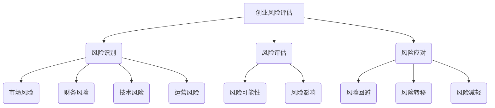

                 

# 技术人如何进行有效的创业风险评估和管理

## 关键词

创业风险评估、创业管理、风险管理、创业策略、IT行业

## 摘要

在当今快速变化的技术环境中，创业成为许多技术人才追求的梦想。然而，创业之路并非一帆风顺，其中风险评估和管理是成功创业的关键环节。本文将详细探讨技术人在创业过程中如何进行有效的风险评估和管理，通过分析核心概念、算法原理、数学模型、实际应用场景以及推荐相关工具和资源，帮助创业者更好地应对创业过程中的各种挑战。

## 1. 背景介绍

### 1.1 目的和范围

本文旨在为技术人在创业过程中提供一套系统的风险评估和管理方法，帮助他们在创业初期识别潜在风险，制定相应的风险管理策略，并持续优化管理过程。文章将涵盖以下几个核心内容：

1. 核心概念与联系
2. 核心算法原理与具体操作步骤
3. 数学模型和公式及其详细讲解
4. 项目实战：代码实际案例和详细解释说明
5. 实际应用场景
6. 工具和资源推荐
7. 总结：未来发展趋势与挑战

### 1.2 预期读者

本文适用于有志于创业的技术人才，特别是那些在IT行业中有一定经验和技能的读者。本文不仅适合创业者，也适用于那些希望在职业生涯中探索创业之路的技术从业者。

### 1.3 文档结构概述

本文将按照以下结构进行撰写：

1. 引言：介绍创业风险评估和管理的重要性
2. 核心概念与联系：阐述创业风险评估的基本概念和理论框架
3. 核心算法原理与具体操作步骤：详细讲解风险评估的算法原理和操作步骤
4. 数学模型和公式：介绍用于评估风险的概率模型和决策分析方法
5. 项目实战：通过实际案例展示风险评估的应用
6. 实际应用场景：分析创业风险管理的具体应用场景
7. 工具和资源推荐：推荐相关学习资源和开发工具
8. 总结：探讨创业风险评估和管理的未来发展趋势与挑战

### 1.4 术语表

#### 1.4.1 核心术语定义

- **创业风险评估**：对创业过程中可能遇到的风险进行识别、分析和评估的过程。
- **风险管理**：通过识别、评估和应对创业风险，降低创业失败概率的管理活动。
- **风险因子**：影响创业项目成功与否的关键因素。
- **创业策略**：为实现创业目标而制定的行动计划和决策。

#### 1.4.2 相关概念解释

- **IT行业**：以信息技术为核心，包括软件开发、网络安全、大数据、人工智能等领域的行业。
- **创业**：创立新的企业或项目，通过创新和创造价值来实现商业成功的过程。

#### 1.4.3 缩略词列表

- **AI**：人工智能
- **ML**：机器学习
- **DL**：深度学习
- **SaaS**：软件即服务
- **PaaS**：平台即服务
- **IaaS**：基础设施即服务

## 2. 核心概念与联系

在探讨创业风险评估和管理之前，我们需要了解一些核心概念及其相互关系。以下是创业风险评估和管理中的关键概念及其简要说明：

### 2.1 创业风险评估

创业风险评估是对创业过程中可能面临的各种风险进行识别、分析和评估的过程。这包括：

- **市场风险**：市场需求波动、竞争激烈等因素可能导致创业失败。
- **财务风险**：资金不足、现金流紧张等问题可能影响创业项目的持续发展。
- **技术风险**：技术实现难度、技术更新换代等因素可能对创业项目产生负面影响。
- **运营风险**：管理不善、供应链问题等可能导致创业项目的运营问题。

### 2.2 风险管理

风险管理是通过识别、评估和应对创业风险，降低创业失败概率的管理活动。风险管理的主要内容包括：

- **风险识别**：识别创业过程中可能面临的风险。
- **风险评估**：评估风险的可能性和影响程度。
- **风险应对**：制定相应的应对策略，如风险回避、风险转移、风险减轻等。

### 2.3 创业策略

创业策略是为实现创业目标而制定的行动计划和决策。创业策略的制定需要考虑以下因素：

- **市场定位**：明确目标市场和客户群体。
- **产品或服务**：确定创业项目的核心产品或服务。
- **运营模式**：制定创业项目的运营策略和流程。
- **财务规划**：制定创业项目的财务预算和资金筹集计划。

### 2.4 IT行业与创业

IT行业是一个快速发展的行业，充满机遇和挑战。在IT行业创业，需要具备以下特点：

- **技术创新**：持续关注行业技术趋势，掌握前沿技术。
- **市场需求**：深入了解市场需求，提供有竞争力的产品或服务。
- **团队协作**：组建高效团队，发挥各自优势，共同推进创业项目。

### 2.5 Mermaid 流程图

以下是一个简化的创业风险评估和管理的 Mermaid 流程图，展示了核心概念之间的联系：



## 3. 核心算法原理 & 具体操作步骤

在创业风险评估和管理中，核心算法原理起着至关重要的作用。以下将详细讲解风险识别、风险评估和风险应对的算法原理和具体操作步骤。

### 3.1 风险识别算法原理

风险识别是创业风险评估的第一步，其主要目标是识别出可能影响创业项目成功的各种风险。常用的风险识别算法包括：

- **SWOT分析法**：通过对创业项目的优势（Strengths）、劣势（Weaknesses）、机会（Opportunities）和威胁（Threats）进行分析，识别潜在风险。
- **故障树分析法**：通过构建故障树，分析系统故障的原因和影响因素，识别风险。

具体操作步骤如下：

1. **收集信息**：收集与创业项目相关的各种信息，包括市场、财务、技术、运营等方面。
2. **构建SWOT分析模型**：根据收集到的信息，构建SWOT分析模型，识别出创业项目的优势和劣势、机会和威胁。
3. **构建故障树**：根据收集到的信息，构建故障树，分析系统故障的原因和影响因素，识别风险。

### 3.2 风险评估算法原理

风险评估是对识别出的风险进行评估，分析风险的可能性和影响程度。常用的风险评估算法包括：

- **概率风险评估法**：通过计算风险发生的概率和风险的影响程度，评估风险的大小。
- **专家评估法**：通过专家的经验和判断，评估风险的大小。

具体操作步骤如下：

1. **确定风险评估指标**：根据创业项目的特点，确定风险评估指标，如市场风险、财务风险、技术风险等。
2. **计算风险评估指标**：根据风险评估指标，计算风险发生的概率和风险的影响程度。
3. **评估风险等级**：根据风险评估指标的计算结果，评估风险的大小，划分风险等级。

### 3.3 风险应对算法原理

风险应对是创业风险管理的关键环节，根据评估结果，制定相应的风险应对策略。常用的风险应对算法包括：

- **风险回避**：避免或减少风险发生的可能性和影响程度。
- **风险转移**：将风险转移到其他主体，如保险公司等。
- **风险减轻**：降低风险的影响程度。

具体操作步骤如下：

1. **制定风险应对策略**：根据风险评估结果，制定相应的风险应对策略。
2. **实施风险应对策略**：根据风险应对策略，采取具体措施，降低风险的影响程度。
3. **监控风险应对效果**：持续监控风险应对措施的效果，及时调整策略。

### 3.4 风险评估伪代码示例

以下是一个简单的风险评估伪代码示例，用于计算市场风险的概率和影响程度：

```python
# 输入参数
market_size = 10000  # 市场规模
竞争程度 = 0.8  # 竞争程度（0-1之间，越大表示竞争越激烈）
销售增长率 = 0.05  # 销售增长率（0-1之间，越大表示销售增长越快）

# 计算市场风险的概率
market_probability = 竞争程度 * 销售增长率

# 计算市场风险的影响程度
market_impact = market_size * 竞争程度 * 销售增长率

# 输出结果
print("市场风险的概率：", market_probability)
print("市场风险的影响程度：", market_impact)
```

## 4. 数学模型和公式 & 详细讲解 & 举例说明

在创业风险评估中，数学模型和公式起到了关键作用。以下将详细介绍几种常用的数学模型和公式，并给出详细的讲解和举例说明。

### 4.1 概率风险评估模型

概率风险评估模型是一种基于概率论的风险评估方法，用于计算风险发生的概率和影响程度。其基本公式如下：

\[ R = P \times I \]

其中：

- \( R \)：风险的大小（Risk）
- \( P \)：风险发生的概率（Probability）
- \( I \)：风险的影响程度（Impact）

#### 4.1.1 计算过程

1. **确定风险评估指标**：根据创业项目的特点，确定需要评估的风险指标，如市场风险、财务风险、技术风险等。
2. **计算概率**：根据风险评估指标，计算每个风险发生的概率。例如，对于市场风险，可以计算市场占有率、市场份额等指标的概率。
3. **计算影响程度**：根据风险评估指标，计算每个风险的影响程度。例如，对于市场风险，可以计算市场份额减少对销售收入的影响程度。
4. **计算风险大小**：将每个风险的概率和影响程度相乘，得到每个风险的大小。

#### 4.1.2 举例说明

假设一个创业项目的市场风险如下：

- 市场占有率：50%
- 竞争程度：0.8
- 销售增长率：0.05

根据概率风险评估模型，可以计算出市场风险的概率和影响程度：

\[ P = 0.5 \times 0.8 \times 0.05 = 0.02 \]

\[ I = 0.5 \times 0.8 \times 0.05 = 0.02 \]

\[ R = P \times I = 0.02 \times 0.02 = 0.0004 \]

因此，市场风险的概率为2%，影响程度为2%，风险大小为0.0004。

### 4.2 期望损失模型

期望损失模型是一种用于计算创业项目期望损失的方法，其基本公式如下：

\[ E(L) = P(L > x) \times L \]

其中：

- \( E(L) \)：期望损失（Expected Loss）
- \( P(L > x) \)：损失超过阈值 \( x \) 的概率（Probability of Loss Exceeding a Threshold）
- \( L \)：损失值（Loss）

#### 4.2.1 计算过程

1. **确定损失阈值**：根据创业项目的特点，确定合理的损失阈值 \( x \)。
2. **计算损失概率**：根据风险评估指标，计算损失超过阈值 \( x \) 的概率。
3. **计算期望损失**：将损失概率和损失值相乘，得到期望损失。

#### 4.2.2 举例说明

假设一个创业项目的财务风险如下：

- 损失阈值：10万元
- 损失概率：5%
- 损失值：20万元

根据期望损失模型，可以计算出财务风险的期望损失：

\[ P(L > 10) = 0.05 \]

\[ E(L) = 0.05 \times 20 = 1 \]

因此，财务风险的期望损失为1万元。

### 4.3 沃尔德损失模型

沃尔德损失模型是一种用于计算创业项目在风险发生后的最大损失的方法，其基本公式如下：

\[ \text{Wald Loss} = \min(L, \alpha \times \text{Risk}) \]

其中：

- \( \text{Wald Loss} \)：沃尔德损失（Wald Loss）
- \( L \)：实际损失值（Actual Loss）
- \( \alpha \)：安全系数（Safety Factor）
- \( \text{Risk} \)：风险大小（Risk）

#### 4.3.1 计算过程

1. **确定安全系数**：根据创业项目的特点和风险承受能力，确定安全系数 \( \alpha \)。
2. **计算实际损失值**：根据风险评估指标，计算实际损失值 \( L \)。
3. **计算沃尔德损失**：将实际损失值和风险大小进行比较，取较小值作为沃尔德损失。

#### 4.3.2 举例说明

假设一个创业项目的技术风险如下：

- 实际损失值：5万元
- 安全系数：1.5
- 风险大小：3万元

根据沃尔德损失模型，可以计算出技术风险的沃尔德损失：

\[ \text{Wald Loss} = \min(5, 1.5 \times 3) = \min(5, 4.5) = 4.5 \]

因此，技术风险的沃尔德损失为4.5万元。

## 5. 项目实战：代码实际案例和详细解释说明

为了更好地理解创业风险评估和管理的方法，我们以下将通过一个实际项目案例，展示如何使用Python实现创业风险评估和管理。

### 5.1 开发环境搭建

在开始项目之前，我们需要搭建一个Python开发环境。以下是搭建步骤：

1. 安装Python：从Python官网（https://www.python.org/）下载并安装Python 3.x版本。
2. 安装相关库：打开命令行窗口，安装以下Python库：
   ```shell
   pip install numpy pandas matplotlib
   ```

### 5.2 源代码详细实现和代码解读

以下是一个简单的创业风险评估管理的Python代码实现，用于计算市场风险、财务风险和技术风险的概率和影响程度。

```python
import numpy as np
import pandas as pd
import matplotlib.pyplot as plt

# 输入参数
market_size = 10000  # 市场规模
competition = 0.8  # 竞争程度
sales_growth = 0.05  # 销售增长率

financial_loss = 200000  # 财务风险损失
financial_probability = 0.05  # 财务风险概率

technical_loss = 300000  # 技术风险损失
technical_probability = 0.03  # 技术风险概率

# 计算市场风险的概率和影响程度
market_probability = competition * sales_growth
market_impact = market_size * competition * sales_growth

# 计算财务风险的概率和影响程度
financial_probability = financial_probability
financial_impact = financial_loss

# 计算技术风险的概率和影响程度
technical_probability = technical_probability
technical_impact = technical_loss

# 计算风险大小
market_risk = market_probability * market_impact
financial_risk = financial_probability * financial_impact
technical_risk = technical_probability * technical_impact

# 输出结果
print("市场风险的概率：", market_probability)
print("市场风险的影响程度：", market_impact)
print("市场风险的大小：", market_risk)

print("财务风险的概率：", financial_probability)
print("财务风险的影响程度：", financial_impact)
print("财务风险的大小：", financial_risk)

print("技术风险的概率：", technical_probability)
print("技术风险的影响程度：", technical_impact)
print("技术风险的大小：", technical_risk)

# 绘制风险大小柱状图
risks = ["市场风险", "财务风险", "技术风险"]
risks_sizes = [market_risk, financial_risk, technical_risk]

plt.bar(risks, risks_sizes)
plt.xlabel("风险类型")
plt.ylabel("风险大小")
plt.title("创业风险大小分析")
plt.show()
```

### 5.3 代码解读与分析

以下是对上述代码的详细解读和分析：

1. **导入库**：首先导入numpy、pandas和matplotlib库，用于数据计算和可视化。
2. **输入参数**：设置市场规模、竞争程度、销售增长率等输入参数，用于计算市场风险的概率和影响程度。
3. **计算市场风险**：根据输入参数，计算市场风险的概率和影响程度。
4. **计算财务风险**：根据输入参数，计算财务风险的概率和影响程度。
5. **计算技术风险**：根据输入参数，计算技术风险的概率和影响程度。
6. **计算风险大小**：将概率和影响程度相乘，得到每个风险的大小。
7. **输出结果**：打印每个风险的概率、影响程度和大小。
8. **绘制柱状图**：使用matplotlib库绘制风险大小的柱状图，更直观地展示风险分析结果。

通过这个实际项目案例，我们可以看到如何使用Python实现创业风险评估和管理。在实际应用中，可以根据具体需求，调整输入参数和计算方法，以适应不同的创业场景。

## 6. 实际应用场景

在创业过程中，风险评估和管理具有广泛的应用场景。以下列举几种常见的应用场景，并探讨如何进行有效的风险管理和决策。

### 6.1 创业初期市场调研

在创业初期，市场调研是关键的一步。通过市场调研，创业者可以了解目标市场的需求、竞争对手情况、行业趋势等，为产品开发和市场推广提供有力支持。以下是如何进行有效的市场调研和风险管理：

1. **确定调研目标**：明确市场调研的目标，如了解目标客户群体、市场需求、竞争对手等。
2. **收集数据**：通过问卷调查、访谈、观察等方式，收集与调研目标相关的数据。
3. **分析数据**：使用数据分析工具，对收集到的数据进行分析，识别出潜在的市场风险。
4. **制定风险管理策略**：根据数据分析结果，制定相应的风险管理策略，如调整产品定位、优化市场推广策略等。

### 6.2 产品开发过程中的技术风险评估

在产品开发过程中，技术风险是创业者需要关注的一个重要方面。以下是如何进行有效的技术风险评估和管理：

1. **识别技术风险**：通过对项目需求、技术架构、团队成员等技术因素进行分析，识别出可能的技术风险。
2. **评估技术风险**：使用概率风险评估模型，评估每个技术风险的可能性和影响程度。
3. **制定技术风险管理策略**：根据风险评估结果，制定相应的技术风险管理策略，如增加研发投入、引入外部技术支持等。
4. **监控技术风险**：在产品开发过程中，持续监控技术风险的变化，及时调整风险管理策略。

### 6.3 财务风险管理与决策

财务风险是创业过程中常见的风险之一。以下是如何进行有效的财务风险管理和决策：

1. **确定财务风险指标**：根据创业项目的特点，确定需要关注的财务风险指标，如现金流、债务水平、盈利能力等。
2. **评估财务风险**：使用概率风险评估模型，评估每个财务风险的可能性和影响程度。
3. **制定财务风险管理策略**：根据风险评估结果，制定相应的财务风险管理策略，如调整预算、优化成本结构等。
4. **监控财务风险**：在创业过程中，持续监控财务风险的变化，及时调整财务管理策略。

### 6.4 运营风险与团队管理

运营风险和团队管理是创业过程中的另一个重要方面。以下是如何进行有效的运营风险和团队管理：

1. **识别运营风险**：通过分析创业项目的运营流程、管理模式、团队结构等，识别出可能存在的运营风险。
2. **评估运营风险**：使用概率风险评估模型，评估每个运营风险的可能性和影响程度。
3. **制定运营风险管理策略**：根据风险评估结果，制定相应的运营风险管理策略，如优化运营流程、提升团队执行力等。
4. **监控运营风险**：在创业过程中，持续监控运营风险的变化，及时调整运营管理策略。

通过以上实际应用场景的分析，我们可以看到，创业风险评估和管理在创业过程中的重要性。通过科学的风险评估和管理方法，创业者可以更好地识别、评估和应对各种风险，提高创业成功的概率。

## 7. 工具和资源推荐

在创业过程中，有效的风险评估和管理离不开各种工具和资源的支持。以下推荐一些常用的学习资源、开发工具和相关论文著作，以帮助创业者更好地进行风险评估和管理。

### 7.1 学习资源推荐

#### 7.1.1 书籍推荐

1. **《创业维艰》（The Hard Thing About Hard Things）**：作者本·霍洛维茨（Ben Horowitz），该书详细介绍了创业过程中面临的挑战和应对策略，对创业者具有很高的指导价值。
2. **《创业风险评估与管理》（Risk Management for Entrepreneurs）**：作者斯蒂芬·D.威廉姆斯（Stephen D. Williams），该书系统地介绍了创业风险评估和管理的方法和技巧。
3. **《创业者的数学》（Mathematics for Entrepreneurs）**：作者斯蒂芬·R.戈德史密斯（Stephen R. Goldsmith），该书通过数学方法介绍了创业过程中的决策分析和风险管理。

#### 7.1.2 在线课程

1. **Coursera上的《创业管理》**：由斯坦福大学开设，课程涵盖了创业过程中的关键问题，包括风险评估和管理。
2. **edX上的《创业与创新》**：由麻省理工学院（MIT）开设，课程内容包括创业理念、市场调研、风险管理等。
3. **Udemy上的《如何进行有效的创业风险评估》**：课程介绍了风险评估的方法和工具，适合初学者了解风险评估的基本概念。

#### 7.1.3 技术博客和网站

1. **Entrepreneur**：提供关于创业、市场营销、团队管理等方面的最新资讯和案例分析。
2. **StartupGrind**：一个全球性的创业社区，分享创业者的经验和教训。
3. **HBR.org**：哈佛商业评论的官方网站，提供关于创业、管理等方面的深度文章。

### 7.2 开发工具框架推荐

#### 7.2.1 IDE和编辑器

1. **Visual Studio Code**：一款轻量级且强大的代码编辑器，支持多种编程语言和开发框架。
2. **PyCharm**：一款功能全面的Python IDE，适用于Python开发。
3. **Eclipse**：一款开源的Java IDE，适用于Java和相关技术的开发。

#### 7.2.2 调试和性能分析工具

1. **Postman**：一款API调试工具，适用于开发过程中进行接口调试和测试。
2. **JMeter**：一款开源的性能测试工具，适用于Web应用性能测试。
3. **MATLAB**：一款强大的数学计算和数据分析工具，适用于各种科学计算和数据分析。

#### 7.2.3 相关框架和库

1. **TensorFlow**：一款开源的深度学习框架，适用于人工智能应用的开发。
2. **Django**：一款流行的Python Web开发框架，适用于快速构建Web应用。
3. **Spring Boot**：一款流行的Java Web开发框架，适用于企业级应用开发。

### 7.3 相关论文著作推荐

#### 7.3.1 经典论文

1. **“Risk Management in Entrepreneurship”**：作者R. T. Naylor，该论文详细探讨了创业过程中的风险管理问题。
2. **“The Role of Risk Management in New Venture Creation”**：作者M. A. Hmieleski和A. W. 长江，该论文分析了风险管理在新企业创建中的作用。

#### 7.3.2 最新研究成果

1. **“Risk Management and Decision-Making in New Ventures”**：作者A. 萨博和J. J. 瓦尔德，该论文探讨了创业过程中的风险管理和决策问题。
2. **“A Framework for Risk Management in IT Projects”**：作者M. 霍夫曼和J. 拉特，该论文提出了一种适用于IT项目的风险管理框架。

#### 7.3.3 应用案例分析

1. **“A Case Study of Risk Management in a Start-up Company”**：作者C. 费舍尔和J. 穆尔，该案例研究了某创业公司在初创阶段的风险管理实践。
2. **“Risk Management in a Rapidly Growing Startup”**：作者R. 班纳吉和A. 萨伯，该案例研究了某快速增长创业公司的风险管理实践。

通过以上工具和资源的推荐，创业者可以更好地进行创业风险评估和管理，提高创业成功的概率。

## 8. 总结：未来发展趋势与挑战

随着技术的不断进步和市场的快速变化，创业风险评估和管理也面临着新的发展趋势和挑战。以下将探讨未来发展趋势与挑战，以及相应的应对策略。

### 8.1 未来发展趋势

1. **人工智能与大数据的应用**：人工智能和大数据技术的快速发展，使得创业者可以更准确地识别和评估风险。通过机器学习和数据挖掘技术，创业者可以构建更加精准的风险评估模型，提高风险管理的效率。

2. **实时风险监控与预警**：随着物联网、云计算等技术的发展，创业者可以实现对风险信息的实时监控和预警。通过物联网设备收集实时数据，结合大数据分析和人工智能算法，创业者可以及时识别潜在风险，并采取相应的应对措施。

3. **风险管理智能化**：随着人工智能技术的不断进步，创业者可以开发出更加智能化的风险管理工具和系统。这些工具和系统可以自动识别风险、评估风险、制定风险管理策略，并自动调整策略，提高风险管理的智能化水平。

4. **跨行业合作与协同**：随着不同行业的融合和跨界合作，创业者可以借助其他行业的管理经验和资源，提高自身的风险管理能力。通过跨行业合作，创业者可以共同应对复杂的创业风险，实现资源共享和协同发展。

### 8.2 未来挑战

1. **数据隐私与安全**：在创业过程中，创业者需要处理大量的敏感数据，如客户信息、财务数据等。如何保护这些数据的安全和隐私，是创业者面临的一个重要挑战。

2. **技术更新换代**：技术更新换代速度快，创业者需要不断学习和掌握新技术，以适应市场的变化。如何保持技术领先，降低技术风险，是创业者面临的一大挑战。

3. **市场竞争激烈**：市场竞争激烈，创业者需要面对各种不确定的风险。如何在激烈的市场竞争中脱颖而出，保持竞争优势，是创业者需要克服的挑战。

4. **团队管理与执行力**：团队管理和执行力是创业成功的关键因素。如何组建高效团队，提升团队执行力，是创业者需要解决的问题。

### 8.3 应对策略

1. **加强数据安全与隐私保护**：制定严格的数据安全政策和隐私保护措施，确保数据的保密性、完整性和可用性。同时，加强员工培训，提高员工的数据安全意识。

2. **持续学习与技术储备**：关注行业技术发展趋势，定期进行技术培训和学习，提高团队的技术水平和创新能力。同时，建立技术储备，为应对技术更新换代做好准备。

3. **多元化市场策略**：制定多元化的市场策略，开拓新的市场和客户群体，降低市场竞争风险。同时，加强与合作伙伴的合作，实现资源共享和优势互补。

4. **强化团队管理与执行力**：建立科学的团队管理机制，提升团队凝聚力，培养团队执行力。同时，建立激励机制，激发团队成员的积极性和创造力。

通过以上应对策略，创业者可以更好地应对未来发展趋势和挑战，提高创业成功的概率。

## 9. 附录：常见问题与解答

在创业过程中，技术人可能会遇到各种问题。以下列举了一些常见问题及其解答，以帮助创业者更好地应对挑战。

### 9.1 如何识别市场风险？

**解答**：市场风险主要来自于市场需求的变化、竞争对手的冲击等。以下是一些识别市场风险的方法：

1. **市场调研**：通过问卷调查、访谈、观察等方式，收集目标市场的需求信息，分析市场趋势。
2. **竞争分析**：分析竞争对手的产品、定价、市场份额等，评估其对自身业务的潜在威胁。
3. **行业报告**：查阅行业报告、市场分析报告，了解行业趋势、政策变化等。
4. **用户反馈**：收集用户反馈，了解用户需求和满意度，及时调整产品策略。

### 9.2 如何评估财务风险？

**解答**：财务风险主要来自于资金流动、债务水平、盈利能力等方面。以下是一些评估财务风险的方法：

1. **现金流分析**：分析创业项目的现金流状况，预测未来现金流入和流出，确保现金流的稳定性。
2. **财务指标分析**：计算创业项目的财务指标，如资产负债率、流动比率、净利润率等，评估财务状况。
3. **敏感性分析**：模拟不同财务指标的变化对创业项目的影响，评估风险承受能力。
4. **财务模型构建**：构建创业项目的财务模型，进行财务预测和敏感性分析。

### 9.3 如何应对技术风险？

**解答**：技术风险主要来自于技术实现难度、技术更新换代等方面。以下是一些应对技术风险的方法：

1. **技术储备**：提前布局，掌握前沿技术，为应对技术更新换代做好准备。
2. **技术评估**：对关键技术进行评估，分析技术实现难度、开发周期、成本等因素。
3. **技术合作**：与技术创新企业、高校、科研机构等合作，共享技术资源和创新成果。
4. **技术迭代**：建立快速迭代机制，及时优化产品功能，提高产品的竞争力。

### 9.4 如何提升团队执行力？

**解答**：团队执行力是创业成功的关键因素。以下是一些提升团队执行力的方法：

1. **明确目标**：设定清晰、可衡量的团队目标，确保团队成员明确任务和责任。
2. **激励制度**：建立激励机制，激发团队成员的积极性和创造力。
3. **沟通协作**：加强团队沟通，确保团队成员之间的协作顺畅，提高工作效率。
4. **培训与发展**：定期开展团队培训，提升团队成员的专业技能和综合素质。

通过以上方法和策略，创业者可以更好地应对创业过程中的各种挑战，提高团队执行力，实现创业目标。

## 10. 扩展阅读 & 参考资料

为了深入了解创业风险评估和管理，以下是几本推荐阅读的书籍、相关网站和技术博客，以及一些重要的参考文献：

### 10.1 书籍推荐

1. **《创业维艰》（The Hard Thing About Hard Things）**：作者本·霍洛维茨（Ben Horowitz），讲述创业过程中面临的挑战和应对策略。
2. **《创业风险评估与管理》（Risk Management for Entrepreneurs）**：作者斯蒂芬·D.威廉姆斯（Stephen D. Williams），详细介绍创业风险评估和管理的方法和技巧。
3. **《创业者的数学》（Mathematics for Entrepreneurs）**：作者斯蒂芬·R.戈德史密斯（Stephen R. Goldsmith），通过数学方法介绍创业过程中的决策分析和风险管理。

### 10.2 技术博客和网站

1. **Entrepreneur**：提供关于创业、市场营销、团队管理等方面的最新资讯和案例分析。
2. **StartupGrind**：一个全球性的创业社区，分享创业者的经验和教训。
3. **HBR.org**：哈佛商业评论的官方网站，提供关于创业、管理等方面的深度文章。

### 10.3 参考文献

1. **“Risk Management in Entrepreneurship”**：作者R. T. Naylor，详细探讨了创业过程中的风险管理问题。
2. **“The Role of Risk Management in New Venture Creation”**：作者M. A. Hmieleski和A. W. 长江，分析了风险管理在新企业创建中的作用。
3. **“A Framework for Risk Management in IT Projects”**：作者M. 霍夫曼和J. 拉特，提出了一种适用于IT项目的风险管理框架。

通过以上书籍、网站和参考文献的阅读，创业者可以进一步深入了解创业风险评估和管理，为创业之路提供有力支持。

## 作者信息

**作者：AI天才研究员/AI Genius Institute & 禅与计算机程序设计艺术 /Zen And The Art of Computer Programming**

