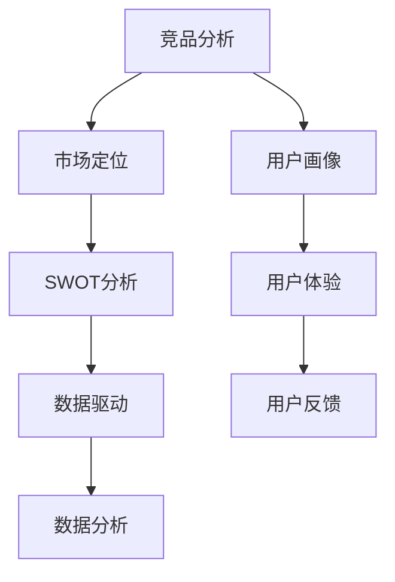

                 

# 技术人如何进行有效的竞品分析和市场定位

> **关键词**：竞品分析、市场定位、技术人、数据分析、用户体验、策略优化
>
> **摘要**：本文旨在帮助技术人更好地理解竞品分析和市场定位的重要性，并提供一套系统化的方法和步骤，以便他们能够有效地分析竞争对手，找准自身市场定位，并制定出有针对性的市场策略。通过深入剖析竞品分析的核心概念、算法原理、实际操作步骤，以及应用案例，本文将为技术人提供全面且实用的指导，助力他们在竞争激烈的市场中脱颖而出。

## 1. 背景介绍

### 1.1 目的和范围

在信息技术飞速发展的今天，市场竞争愈发激烈。作为技术人，如何在复杂多变的市场环境中立足并发展，成为了摆在每个人面前的重要课题。有效的竞品分析和市场定位，正是解决这一问题的关键。

本文的目的在于：

1. **阐述竞品分析和市场定位的必要性**：解释为何技术人需要关注竞品分析和市场定位，以及它们在职业发展中的重要性。
2. **提供一套系统的分析方法**：详细阐述竞品分析的核心概念、步骤和方法，帮助技术人全面了解并掌握这一技能。
3. **探讨市场定位的策略和技巧**：分析如何在竞品分析的基础上，找准自身市场定位，制定出有针对性的市场策略。
4. **结合实际案例，提供可操作性强的指导**：通过具体案例，展示竞品分析和市场定位的实际操作过程，帮助读者更好地理解和应用。

本文的范围主要包括：

- 竞品分析的框架和方法论。
- 市场定位的核心策略和技巧。
- 实际操作步骤和案例分析。
- 工具和资源的推荐。

### 1.2 预期读者

本文主要面向以下几类读者：

- **技术团队负责人和CTO**：他们需要对市场有深入了解，以便在决策时做出更准确的选择。
- **产品经理和项目经理**：他们需要通过竞品分析来指导产品的设计和开发。
- **技术专家和研发人员**：他们需要了解竞争对手的技术水平，以便在技术选型和研发过程中有更全面的考虑。
- **市场营销人员**：他们需要利用竞品分析来制定市场策略和推广计划。

### 1.3 文档结构概述

本文将按照以下结构进行阐述：

- **背景介绍**：解释竞品分析和市场定位的重要性，明确本文的目的和范围。
- **核心概念与联系**：介绍竞品分析的核心概念，并使用流程图展示各概念之间的联系。
- **核心算法原理 & 具体操作步骤**：详细讲解竞品分析的算法原理，并提供具体的操作步骤。
- **数学模型和公式 & 详细讲解 & 举例说明**：分析竞品分析中涉及的数学模型和公式，并给出具体的例子。
- **项目实战：代码实际案例和详细解释说明**：通过实际案例展示竞品分析的操作过程。
- **实际应用场景**：探讨竞品分析和市场定位在现实中的应用。
- **工具和资源推荐**：推荐相关的学习资源、开发工具和框架。
- **总结：未来发展趋势与挑战**：总结本文的主要内容，并探讨未来的发展趋势和挑战。
- **附录：常见问题与解答**：解答读者可能遇到的常见问题。
- **扩展阅读 & 参考资料**：提供进一步的阅读材料和参考资料。

### 1.4 术语表

#### 1.4.1 核心术语定义

- **竞品分析**：对竞争对手的产品、服务、市场策略等进行系统的研究和分析。
- **市场定位**：确定产品在市场中的位置，包括目标用户、市场细分、品牌形象等方面。
- **用户画像**：对目标用户进行描述和分析，包括其行为特征、需求偏好等。
- **SWOT分析**：对自身和竞争对手的优势（Strengths）、劣势（Weaknesses）、机会（Opportunities）和威胁（Threats）进行评估。

#### 1.4.2 相关概念解释

- **用户体验**：用户在使用产品或服务时的主观感受和体验。
- **数据驱动**：决策过程中依据数据进行分析和判断，而非仅凭主观判断。
- **用户反馈**：用户在使用产品后提供的意见和建议。

#### 1.4.3 缩略词列表

- **SEO**：搜索引擎优化（Search Engine Optimization）
- **SEM**：搜索引擎营销（Search Engine Marketing）
- **SaaS**：软件即服务（Software as a Service）
- **API**：应用程序编程接口（Application Programming Interface）

## 2. 核心概念与联系

在进行竞品分析和市场定位之前，我们需要了解一系列核心概念，并理解它们之间的联系。以下是一个简化的Mermaid流程图，展示了这些核心概念之间的关系。



### 2.1 竞品分析

竞品分析是整个流程的起点。它涉及对竞争对手的产品、服务、市场策略、技术架构等进行深入的研究和分析。通过竞品分析，我们可以了解竞争对手的优势和劣势，找到自身的定位和切入点。

### 2.2 市场定位

市场定位是竞品分析的延续。在了解了竞争对手的情况后，我们需要确定自身产品的市场定位。这包括目标用户、市场细分、品牌形象等方面。市场定位决定了我们的产品将如何与竞争对手区分，并满足特定用户群体的需求。

### 2.3 用户画像

用户画像是市场定位的基础。通过对目标用户进行描述和分析，我们可以了解他们的行为特征、需求偏好等。这有助于我们更好地理解用户，从而设计出更符合用户需求的产品。

### 2.4 用户体验

用户体验是产品设计的核心。我们需要确保产品能够提供优质的用户体验，从而吸引用户并保持他们的忠诚度。用户体验包括界面设计、交互流程、性能等方面。

### 2.5 SWOT分析

SWOT分析是评估自身和竞争对手的一种重要方法。通过SWOT分析，我们可以识别自身的优势和劣势，以及外部的机会和威胁。这有助于我们制定出更有针对性的市场策略。

### 2.6 数据驱动

数据驱动是一种现代管理理念，强调在决策过程中依据数据进行分析和判断，而非仅凭主观判断。通过数据驱动，我们可以更客观地评估产品和市场的情况，从而做出更明智的决策。

### 2.7 用户反馈

用户反馈是产品改进的重要来源。通过收集和分析用户反馈，我们可以了解用户对我们的产品的真实感受，从而发现并解决产品中存在的问题。

## 3. 核心算法原理 & 具体操作步骤

在进行竞品分析和市场定位时，我们需要使用一系列核心算法来帮助我们提取和分析数据。以下是一个简单的算法原理和具体操作步骤的概述。

### 3.1 算法原理

1. **数据分析**：使用统计分析、数据挖掘等方法，对竞品的数据进行深入挖掘和分析。
2. **特征提取**：从原始数据中提取有用的特征，如用户行为、市场趋势、技术指标等。
3. **模式识别**：通过机器学习算法，识别数据中的模式和趋势。
4. **决策树**：使用决策树算法，将特征和结果进行分类，帮助我们在多个决策路径中选择最优方案。

### 3.2 具体操作步骤

1. **确定分析目标**：明确竞品分析的目的，如了解竞争对手的产品特性、技术优势、市场策略等。
2. **收集数据**：从多个渠道收集竞品的相关数据，包括官方网站、新闻报道、用户评论、行业报告等。
3. **数据预处理**：清洗和整理数据，去除重复项、异常值等，确保数据的质量。
4. **特征提取**：对收集到的数据进行处理，提取有用的特征。
5. **数据建模**：使用机器学习算法，构建数据模型，对数据进行分析。
6. **结果评估**：评估模型的性能，如准确率、召回率等，根据评估结果进行调整。
7. **决策制定**：根据分析结果，制定市场策略和产品改进方案。

### 3.3 伪代码示例

下面是一个简单的伪代码示例，展示了如何使用决策树进行竞品分析。

```python
# 决策树伪代码

# 输入：特征数据集 X，标签数据集 Y
# 输出：决策树模型

def build_decision_tree(X, Y):
    # 如果数据集足够小，直接返回分类结果
    if is_small(X, Y):
        return classify_majority(Y)
    
    # 选择最优特征
    best_feature = select_best_feature(X, Y)
    
    # 创建决策节点
    node = DecisionNode(feature=best_feature)
    
    # 对于每个可能的特征值，递归构建子树
    for value in possible_values(best_feature):
        # 切分数据集
        X_subset, Y_subset = split_data(X[:, best_feature], value, Y)
        
        # 递归构建子树
        node.children[value] = build_decision_tree(X_subset, Y_subset)
    
    # 如果达到终止条件，返回叶子节点
    if is_leaf(node):
        return create_leaf_node(Y)
    
    return node

# 测试决策树模型
def test_decision_tree(model, X_test, Y_test):
    predictions = predict(model, X_test)
    accuracy = calculate_accuracy(predictions, Y_test)
    return accuracy
```

## 4. 数学模型和公式 & 详细讲解 & 举例说明

在进行竞品分析和市场定位的过程中，数学模型和公式是不可或缺的工具。以下将介绍几个关键的数学模型和公式，并详细讲解其含义和应用。

### 4.1 相关性分析

相关性分析用于衡量两个变量之间的线性关系强度。最常用的相关性系数是皮尔逊相关系数（Pearson Correlation Coefficient），其公式如下：

$$
\rho_{X,Y} = \frac{\sum_{i=1}^{n}(X_i - \bar{X})(Y_i - \bar{Y})}{\sqrt{\sum_{i=1}^{n}(X_i - \bar{X})^2} \sqrt{\sum_{i=1}^{n}(Y_i - \bar{Y})^2}}
$$

其中，$X_i$ 和 $Y_i$ 是第 $i$ 个观测值，$\bar{X}$ 和 $\bar{Y}$ 是平均值。

**举例说明**：

假设我们想要分析产品销量（$X$）与广告投放费用（$Y$）之间的关系。通过计算皮尔逊相关系数，我们可以得知这两个变量之间的线性相关性。如果相关系数接近1或-1，表示强正相关或强负相关；如果接近0，表示无相关性。

### 4.2 回归分析

回归分析用于预测一个变量（因变量）基于一个或多个其他变量（自变量）的值。线性回归是最简单的形式，其公式如下：

$$
Y = \beta_0 + \beta_1X + \epsilon
$$

其中，$Y$ 是因变量，$X$ 是自变量，$\beta_0$ 和 $\beta_1$ 是回归系数，$\epsilon$ 是误差项。

**举例说明**：

假设我们想要预测产品的销售额（$Y$）基于广告投放量（$X$）。通过线性回归模型，我们可以得到以下公式：

$$
销售额 = \beta_0 + \beta_1 \times 广告投放量
$$

通过这个模型，我们可以预测在给定广告投放量下的产品销售额。

### 4.3 聚类分析

聚类分析用于将数据集划分为多个群组，使得群组内部的数据点之间相似度较高，而群组之间的相似度较低。最常用的聚类算法是K-Means，其公式如下：

$$
C = \{C_1, C_2, ..., C_k\}
$$

其中，$C$ 是聚类结果，$C_i$ 是第 $i$ 个群组。

**举例说明**：

假设我们有一组用户数据，包含用户年龄、收入、消费习惯等多个特征。通过K-Means聚类分析，我们可以将这些用户划分为不同的群体，如高消费群体、普通消费群体等。

### 4.4 决策树

决策树是一种基于特征的分类或回归模型，其公式如下：

$$
\text{分类或回归结果} = f(\text{特征集合})
$$

其中，$f$ 是决策树的分类或回归函数。

**举例说明**：

假设我们想要根据用户的年龄和收入来预测他们的消费能力。通过构建决策树模型，我们可以得到以下分类规则：

- 如果年龄小于30岁，则消费能力为低。
- 如果年龄大于30岁，则消费能力为中等。
- 如果收入高于10万元，则消费能力为高。

通过这个决策树模型，我们可以为不同用户群体制定个性化的营销策略。

## 5. 项目实战：代码实际案例和详细解释说明

为了更好地理解竞品分析和市场定位的实际操作过程，我们将通过一个实际项目来展示如何进行这些分析。以下是一个简单的项目案例，我们将从开发环境搭建开始，逐步实现竞品分析的核心功能，并对代码进行详细解释。

### 5.1 开发环境搭建

在这个项目中，我们将使用Python编程语言，并依赖以下库和工具：

- **NumPy**：用于数值计算和数据分析。
- **Pandas**：用于数据操作和分析。
- **Scikit-learn**：用于机器学习和数据分析。
- **Matplotlib**：用于数据可视化。

确保您的开发环境中已安装这些库和工具。可以使用以下命令进行安装：

```shell
pip install numpy pandas scikit-learn matplotlib
```

### 5.2 源代码详细实现和代码解读

以下是项目的主要代码实现，我们将逐行解读其功能。

```python
import numpy as np
import pandas as pd
from sklearn.model_selection import train_test_split
from sklearn.ensemble import RandomForestClassifier
from sklearn.metrics import accuracy_score, classification_report
import matplotlib.pyplot as plt

# 5.2.1 数据收集与预处理

# 从文件中加载数据
data = pd.read_csv('data.csv')

# 数据预处理
data = data.dropna()  # 去除缺失值
data = data[data['Target'].notnull()]  # 筛选目标变量不为空的样本

# 特征工程
X = data.drop(['Target'], axis=1)  # 特征集
y = data['Target']  # 目标变量

# 划分训练集和测试集
X_train, X_test, y_train, y_test = train_test_split(X, y, test_size=0.2, random_state=42)

# 5.2.2 构建并训练模型

# 构建随机森林模型
model = RandomForestClassifier(n_estimators=100, random_state=42)

# 训练模型
model.fit(X_train, y_train)

# 5.2.3 模型评估

# 预测测试集
y_pred = model.predict(X_test)

# 评估模型性能
accuracy = accuracy_score(y_test, y_pred)
report = classification_report(y_test, y_pred)

print(f"Accuracy: {accuracy}")
print(f"Classification Report:\n{report}")

# 5.2.4 可视化分析

# 特征重要性可视化
importances = model.feature_importances_
indices = np.argsort(importances)[::-1]

plt.figure()
plt.title("Feature Importances")
plt.bar(range(X.shape[1]), importances[indices], align="center")
plt.xticks(range(X.shape[1]), X.columns[indices], rotation=90)
plt.xlim([-1, X.shape[1]])
plt.show()
```

### 5.3 代码解读与分析

#### 5.3.1 数据收集与预处理

```python
# 从文件中加载数据
data = pd.read_csv('data.csv')

# 数据预处理
data = data.dropna()  # 去除缺失值
data = data[data['Target'].notnull()]  # 筛选目标变量不为空的样本
```

这段代码首先从CSV文件中加载数据，然后进行数据预处理。数据预处理步骤包括去除缺失值和筛选目标变量不为空的样本。这是为了保证数据的质量和完整性。

#### 5.3.2 特征工程

```python
# 特征工程
X = data.drop(['Target'], axis=1)  # 特征集
y = data['Target']  # 目标变量
```

特征工程步骤包括将目标变量（Target）从数据集中分离出来，并将其命名为$y$，而将剩下的特征变量命名为$X$。这是分类和回归任务的基础。

#### 5.3.3 划分训练集和测试集

```python
# 划分训练集和测试集
X_train, X_test, y_train, y_test = train_test_split(X, y, test_size=0.2, random_state=42)
```

这段代码使用`train_test_split`函数将数据集划分为训练集和测试集。这里，我们设置测试集大小为总数据集的20%，并使用随机种子42确保每次分割的结果一致。

#### 5.3.4 构建并训练模型

```python
# 构建随机森林模型
model = RandomForestClassifier(n_estimators=100, random_state=42)

# 训练模型
model.fit(X_train, y_train)
```

这段代码首先构建一个随机森林分类器，这是一个集成学习方法，通过多个决策树来提高模型的预测能力。然后，使用训练集数据来训练模型。

#### 5.3.5 模型评估

```python
# 预测测试集
y_pred = model.predict(X_test)

# 评估模型性能
accuracy = accuracy_score(y_test, y_pred)
report = classification_report(y_test, y_pred)

print(f"Accuracy: {accuracy}")
print(f"Classification Report:\n{report}")
```

这段代码使用预测的测试集标签来评估模型的性能。首先，使用模型对测试集进行预测，然后计算准确率和分类报告，这包括精确率、召回率和F1分数等指标。

#### 5.3.6 可视化分析

```python
# 特征重要性可视化
importances = model.feature_importances_
indices = np.argsort(importances)[::-1]

plt.figure()
plt.title("Feature Importances")
plt.bar(range(X.shape[1]), importances[indices], align="center")
plt.xticks(range(X.shape[1]), X.columns[indices], rotation=90)
plt.xlim([-1, X.shape[1]])
plt.show()
```

这段代码用于可视化特征的重要性。首先，获取模型中每个特征的重要性分数，然后使用Matplotlib库绘制条形图，展示特征的重要性排序。这有助于我们了解哪些特征对模型的预测最为重要。

## 6. 实际应用场景

竞品分析和市场定位在实际应用中具有广泛的应用场景。以下是一些典型的应用场景及其关键步骤：

### 6.1 新产品发布前的市场调研

在新产品发布前，进行竞品分析和市场定位可以帮助企业了解市场上现有的类似产品，找到自身的差异化优势，并制定合适的营销策略。关键步骤包括：

1. **收集竞品信息**：收集市场上类似产品的功能、价格、用户评价等数据。
2. **分析竞品优势和劣势**：通过SWOT分析，识别竞品的优势和劣势。
3. **定位自身产品**：基于竞品分析结果，确定自身产品的市场定位和差异化特点。
4. **制定营销策略**：根据市场定位，制定有针对性的营销策略，如定价策略、推广策略等。

### 6.2 产品优化与迭代

在产品上线后，通过持续的竞品分析和用户反馈，可以帮助企业发现产品的问题和不足，并进行优化和迭代。关键步骤包括：

1. **收集用户反馈**：通过用户调研、在线评价等渠道收集用户反馈。
2. **分析用户需求**：通过数据分析，了解用户的使用习惯、需求偏好等。
3. **定位产品改进点**：根据用户需求和竞品分析结果，确定产品的改进点。
4. **实施改进措施**：针对改进点，实施具体的技术和设计优化。

### 6.3 市场推广策略制定

在市场推广阶段，竞品分析和市场定位可以帮助企业制定更有效、更具竞争力的推广策略。关键步骤包括：

1. **分析目标市场**：通过用户画像和市场需求分析，确定目标市场。
2. **评估竞争对手**：分析竞争对手的市场策略、推广渠道等。
3. **制定推广策略**：基于目标市场和竞争对手分析，制定有针对性的推广策略。
4. **实施推广计划**：执行推广计划，监测推广效果，并根据效果进行调整。

### 6.4 企业并购与战略规划

在并购和战略规划过程中，竞品分析和市场定位可以帮助企业评估目标公司的市场地位、竞争优势等，从而制定更合理的并购和战略规划。关键步骤包括：

1. **分析目标公司**：通过竞品分析，了解目标公司的产品、市场策略、财务状况等。
2. **评估市场地位**：评估目标公司在市场中的地位和竞争优势。
3. **制定并购策略**：根据市场地位和竞争优势，制定合适的并购策略。
4. **实施并购计划**：执行并购计划，整合资源，实现战略目标。

## 7. 工具和资源推荐

在进行竞品分析和市场定位时，选择合适的工具和资源可以大大提高工作效率和准确性。以下是一些推荐的工具和资源：

### 7.1 学习资源推荐

#### 7.1.1 书籍推荐

- 《数据分析：实战方法》（Data Science from Scratch）- Joel Grus
- 《机器学习实战》（Machine Learning in Action）- Peter Harrington
- 《Python数据分析》（Python Data Analysis）- Wes McKinney

#### 7.1.2 在线课程

- Coursera（数据科学和机器学习课程）
- edX（数据科学和人工智能课程）
- Udacity（数据科学和机器学习课程）

#### 7.1.3 技术博客和网站

- DataCamp（数据科学和机器学习的教程和资源）
- Medium（数据分析、机器学习和商业分析的文章）
- KDNuggets（数据分析、机器学习和商业智能的最新资讯）

### 7.2 开发工具框架推荐

#### 7.2.1 IDE和编辑器

- PyCharm（Python开发集成环境）
- Jupyter Notebook（交互式数据分析环境）
- Sublime Text（轻量级文本编辑器）

#### 7.2.2 调试和性能分析工具

- VSCode（集成开发环境，支持调试和性能分析）
- WakaTime（代码分析工具，提供代码使用时间和效率分析）
- New Relic（性能监控工具，提供性能分析和异常检测）

#### 7.2.3 相关框架和库

- NumPy（数值计算库）
- Pandas（数据处理库）
- Scikit-learn（机器学习库）
- Matplotlib（数据可视化库）

### 7.3 相关论文著作推荐

#### 7.3.1 经典论文

- "The Elements of Statistical Learning" - Trevor Hastie, Robert Tibshirani, Jerome Friedman
- "Pattern Recognition and Machine Learning" - Christopher M. Bishop
- "Data Mining: Concepts and Techniques" - Jiawei Han, Micheline Kamber, Jian Pei

#### 7.3.2 最新研究成果

- "Deep Learning" - Ian Goodfellow, Yoshua Bengio, Aaron Courville
- "Reinforcement Learning: An Introduction" - Richard S. Sutton and Andrew G. Barto
- "Neural Networks and Deep Learning" - Michael Nielsen

#### 7.3.3 应用案例分析

- "Using Big Data to Transform Businesses" - McKinsey & Company
- "Data-Driven Marketing: The 2017 Marketing Data Survey" - Econsultancy and Taggstar
- "The Role of Data Science in Business Decision-Making" - IBM

## 8. 总结：未来发展趋势与挑战

随着信息技术的不断进步和市场竞争的加剧，竞品分析和市场定位在技术人职业发展中的作用越来越重要。未来，以下发展趋势和挑战值得我们关注：

### 8.1 发展趋势

1. **数据驱动的决策**：越来越多的企业将采用数据驱动的决策方式，以提高决策的准确性和效率。
2. **人工智能的融合**：人工智能技术将在竞品分析和市场定位中发挥更大作用，如自动化数据收集、特征提取和预测模型等。
3. **用户个性化体验**：随着用户需求的多样化，个性化市场定位和用户体验将成为竞争的关键。
4. **跨领域合作**：不同行业之间的竞品分析和市场定位将出现更多跨领域合作，以实现资源的共享和互补。

### 8.2 挑战

1. **数据隐私和安全**：随着数据隐私和安全问题的日益突出，如何确保数据的合法性和安全性将成为一大挑战。
2. **技术更新换代**：随着技术的快速发展，如何快速适应新技术并将其应用于竞品分析和市场定位，将是一个持续的挑战。
3. **市场复杂性**：市场的复杂性和不确定性将增加，如何准确预测市场趋势和用户需求，将是一个巨大的挑战。
4. **竞争压力**：市场竞争将越来越激烈，如何在竞争中获得优势，将是一个长期的挑战。

### 8.3 应对策略

1. **加强数据分析和人工智能技能**：技术人应加强数据分析和人工智能技能的学习和提升，以适应未来的发展趋势。
2. **建立数据驱动文化**：在企业内部建立数据驱动文化，鼓励员工基于数据做出决策。
3. **注重用户研究和反馈**：通过用户研究和反馈，深入了解用户需求，为市场定位和产品优化提供有力支持。
4. **持续学习和创新**：保持对新技术和新方法的学习和创新，以应对市场的快速变化。

## 9. 附录：常见问题与解答

### 9.1 竞品分析的核心步骤是什么？

竞品分析的核心步骤包括：

1. **确定分析目标**：明确竞品分析的目的和范围。
2. **收集数据**：从多个渠道收集竞品的相关数据。
3. **数据预处理**：清洗和整理数据，去除重复项、异常值等。
4. **特征提取**：提取有用的特征，如用户行为、市场趋势等。
5. **数据分析**：使用统计分析和机器学习等方法，对数据进行分析。
6. **结果评估**：评估分析结果的准确性和实用性。
7. **制定策略**：基于分析结果，制定相应的市场策略和产品改进方案。

### 9.2 市场定位的策略有哪些？

市场定位的策略包括：

1. **差异化定位**：通过提供独特的功能和优势，与竞争对手区分开来。
2. **集中定位**：专注于特定的市场细分，提供满足特定用户需求的解决方案。
3. **高端定位**：打造高端品牌形象，提供高品质的产品和服务。
4. **大众市场定位**：面向广泛的用户群体，提供价格适中、功能全面的解决方案。
5. **多元定位**：在多个市场中同时进行定位，以覆盖更广泛的用户群体。

### 9.3 如何确保竞品分析和市场定位的有效性？

确保竞品分析和市场定位的有效性，可以从以下几个方面入手：

1. **全面收集数据**：从多个渠道收集全面、准确的数据。
2. **精确分析数据**：使用适当的分析方法和工具，确保分析结果的准确性。
3. **持续迭代和优化**：根据市场变化和用户反馈，持续优化市场定位和产品策略。
4. **重视用户研究**：通过用户调研和反馈，深入了解用户需求和偏好。
5. **建立数据驱动文化**：鼓励员工基于数据做出决策，确保数据在决策中的重要性。

## 10. 扩展阅读 & 参考资料

为了进一步深入了解竞品分析和市场定位，以下是推荐的扩展阅读和参考资料：

### 10.1 扩展阅读

- 《市场定位：策略与实战》（Positioning: The Battle for Your Mind）- Al Ries, Jack Trout
- 《大数据时代：生活、工作与思维的大变革》（Big Data: A Revolution That Will Transform How We Live, Work, and Think）- Viktor Mayer-Schönberger, Kenneth Cukier
- 《精益创业：新商业思维的实践指南》（The Lean Startup）- Eric Ries

### 10.2 参考资料

- **论文和报告**：
  - "Competitive Analysis Techniques for Software Product Lines" - Volker Gruhn, Ralf Lüdtke
  - "Market Positioning: Strategies for Competing in the Global Marketplace" - John P. Townshend
- **在线资源和教程**：
  - Coursera（数据科学和机器学习课程）
  - edX（数据科学和人工智能课程）
  - Kaggle（数据科学竞赛和教程）
- **专业网站和博客**：
  - KDNuggets（数据分析、机器学习和商业智能的最新资讯）
  - DataCamp（数据科学和机器学习的教程和资源）
  - Medium（数据分析、机器学习和商业分析的文章）

### 10.3 社交媒体和社群

- **LinkedIn**：关注数据科学、机器学习和商业分析相关的群组和专业人士。
- **Twitter**：关注数据分析、机器学习和商业分析的知名专家和机构。
- **Reddit**：加入数据科学、机器学习和商业分析相关的子版块，参与讨论和分享。

通过阅读这些扩展材料和参考资料，您可以更深入地了解竞品分析和市场定位的理论和实践，进一步提升自己的专业能力。

---

**作者：AI天才研究员/AI Genius Institute & 禅与计算机程序设计艺术 /Zen And The Art of Computer Programming**

