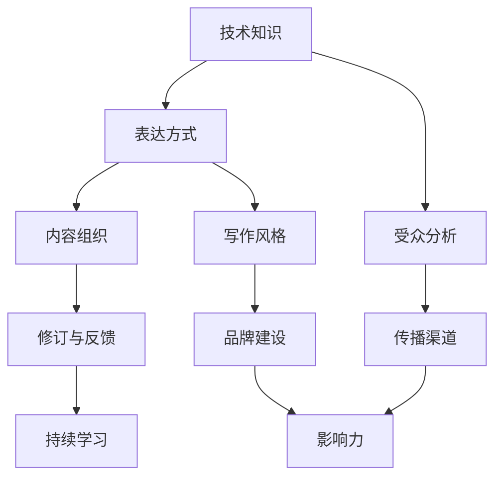

                 

# 技术写作：程序员的副业选择

## >关键词：技术写作、程序员、副业、提升技能、职业发展

> 摘要：本文将探讨技术写作作为程序员副业的重要性和优势，分析其对于职业发展、技能提升、以及个人品牌建设的积极作用。同时，文章将提供具体的写作方法、资源推荐和实战案例，帮助程序员们顺利开启技术写作之路。

## 1. 背景介绍

### 1.1 目的和范围

本文旨在探讨技术写作作为程序员副业的潜力和价值。通过对技术写作的概述、核心概念、算法原理、数学模型以及实际应用场景的详细分析，帮助程序员们理解技术写作的重要性，掌握写作技巧，并能够将其作为副业提升个人职业竞争力。

### 1.2 预期读者

本文适合以下读者群体：

- 有志于拓展技能的程序员；
- 想要通过写作提升个人品牌的开发者；
- 对技术写作感兴趣的技术爱好者。

### 1.3 文档结构概述

本文将按照以下结构展开：

1. 背景介绍
   - 目的和范围
   - 预期读者
   - 文档结构概述
   - 术语表
2. 核心概念与联系
   - 核心概念原理和架构的 Mermaid 流程图
3. 核心算法原理 & 具体操作步骤
   - 算法原理讲解
   - 伪代码详细阐述
4. 数学模型和公式 & 详细讲解 & 举例说明
   - 数学公式使用 LaTeX 格式
5. 项目实战：代码实际案例和详细解释说明
   - 开发环境搭建
   - 源代码详细实现和代码解读
   - 代码解读与分析
6. 实际应用场景
7. 工具和资源推荐
   - 学习资源推荐
   - 开发工具框架推荐
   - 相关论文著作推荐
8. 总结：未来发展趋势与挑战
9. 附录：常见问题与解答
10. 扩展阅读 & 参考资料

### 1.4 术语表

#### 1.4.1 核心术语定义

- 技术写作：以技术为背景，利用文字表达技术思想、原理、方法等的写作活动。
- 程序员：从事计算机编程工作，编写、测试、维护软件的专业人员。
- 副业：在主要职业之外从事的兼职活动，通常用于提升个人技能、增加收入或拓展职业发展。

#### 1.4.2 相关概念解释

- 技术博客：以技术话题为主，分享知识、经验、见解的个人或团队网站。
- 个人品牌：通过个人特质、技能、声誉等因素在职场中建立起的独特形象。
- 技术书籍：以技术为内容的书籍，通常包含深入的理论分析和实际操作指导。

#### 1.4.3 缩略词列表

- IDE：Integrated Development Environment，集成开发环境。
- LaTeX：一种基于 TeX 的排版系统，常用于科学和数学文档的排版。

## 2. 核心概念与联系

在探讨技术写作之前，我们需要了解其核心概念与联系。以下是一个简单的 Mermaid 流程图，用于展示技术写作的核心组成部分：



### 2.1 技术知识

技术写作的基础是扎实的专业知识。程序员需要具备深入的技术理解，才能准确、清晰地表达技术概念。技术知识的积累不仅来自编程经验，还包括对计算机科学理论、软件工程原理、数据结构和算法的理解。

### 2.2 表达方式

技术写作的表达方式至关重要。程序员需要学会如何用文字准确、简洁地传达技术概念。这涉及到语言的规范性、术语的使用、图表和示例代码的应用等方面。

### 2.3 受众分析

了解受众的需求和兴趣是技术写作的关键。程序员需要明确自己的目标读者是谁，并根据读者的背景和知识水平调整写作内容。例如，对于初学者，可能需要更详细的基础解释；对于专业人士，则可以探讨高级主题和深层次的技术细节。

### 2.4 内容组织

良好的内容组织能提高文章的可读性和专业性。程序员应该学会如何将复杂的技术概念分解为易于理解的部分，并使用标题、段落、图表等方式进行结构化表达。

### 2.5 写作风格

写作风格是技术写作的个性体现。程序员可以根据个人喜好和写作目的选择不同的风格，如正式、幽默、严谨或实用。一致的写作风格有助于建立个人品牌和增强文章的可读性。

### 2.6 传播渠道

选择合适的传播渠道是技术写作成功的关键。程序员可以通过博客、技术论坛、社交媒体、书籍等多种渠道分享技术文章。不同的渠道适合不同的内容形式和受众群体。

### 2.7 修订与反馈

修订和反馈是技术写作的重要环节。程序员应该不断修改和完善文章，并根据读者反馈进行调整。这不仅有助于提高文章质量，还能增强与读者的互动。

### 2.8 品牌建设

技术写作有助于程序员建立个人品牌。通过持续输出高质量的技术文章，程序员能够提高自己在行业内的知名度和影响力，从而在职业发展中占据优势。

### 2.9 影响力

技术写作能够带来广泛的的影响力。一篇优秀的文章不仅能够帮助他人解决问题，还能激发读者的兴趣和思考，进一步推动技术交流和创新。

### 2.10 持续学习

技术写作是一个不断学习和提升的过程。程序员应该关注行业动态，不断学习新的技术和写作技巧，以保持文章的时效性和专业性。

## 3. 核心算法原理 & 具体操作步骤

技术写作的核心算法可以理解为一种信息传递的过程，其中关键步骤包括：

### 3.1 信息收集

在开始写作之前，程序员需要收集相关技术信息。这包括查阅技术文档、研究开源项目、阅读相关书籍和论文等。以下是一个简单的伪代码，用于描述信息收集过程：

```pseudo
function collectInformation(topic):
    docs = searchDocumentation(topic)
    projects = searchOpenSourceProjects(topic)
    books = searchBooks(topic)
    papers = searchResearchPapers(topic)
    return mergeAndOrganize(docs, projects, books, papers)
```

### 3.2 内容规划

在收集到足够的信息后，程序员需要制定写作计划。这包括确定文章主题、结构、章节和预期目标读者。以下是一个简单的伪代码，用于描述内容规划过程：

```pseudo
function planContent(topic, targetAudience):
    objectives = defineObjectives()
    structure = defineStructure()
    chapters = divideIntoChapters(structure)
    return objectives, structure, chapters
```

### 3.3 文字表达

在文字表达阶段，程序员需要将技术信息转化为易于理解的语言。以下是一个简单的伪代码，用于描述文字表达过程：

```pseudo
function expressInformation(content, style, audience):
    clearLanguage = simplifyContent(content)
    technicalTerms = defineAndExplainTerms()
    examples = createExamples()
    diagrams = drawDiagrams()
    return mergeContent(clearLanguage, technicalTerms, examples, diagrams)
```

### 3.4 修订与反馈

在完成初稿后，程序员需要进行修订和完善。这包括检查语法错误、逻辑错误和表述不清的地方。以下是一个简单的伪代码，用于描述修订与反馈过程：

```pseudo
function reviseAndFeedback(document):
    reviewGrammar()
    reviewLogic()
    improveClarity()
    collectFeedback()
    applyFeedback()
    return revisedDocument
```

### 3.5 发布与传播

在完成修订后，程序员需要将文章发布到合适的渠道，如个人博客、技术论坛或社交媒体。以下是一个简单的伪代码，用于描述发布与传播过程：

```pseudo
function publishAndDistribute(document, channels):
    blogPost = createBlogPost(document)
    forumThread = createForumThread(document)
    socialMedia = shareOnSocialMedia(document)
    return blogPost, forumThread, socialMedia
```

## 4. 数学模型和公式 & 详细讲解 & 举例说明

在技术写作中，数学模型和公式是必不可少的组成部分。以下是一个简单的数学模型，用于描述技术写作的影响因子。该模型包含以下几个关键变量：

- \( I \)：影响因子
- \( C \)：内容质量
- \( S \)：传播范围
- \( L \)：持续学习

### 4.1 影响因子模型

$$ I = C \times S \times L $$

- \( C \)：内容质量是影响因子的核心因素。高质量的内容能够吸引读者，提高文章的传播速度和影响力。
- \( S \)：传播范围是指文章能够触及的读者群体。传播范围越广，影响因子越大。
- \( L \)：持续学习是指作者在技术写作过程中不断学习和提升自己的能力。持续学习有助于提高内容的质量和深度，从而增强影响因子。

### 4.2 详细讲解

#### 4.2.1 内容质量

内容质量是技术写作的关键。高质量的内容通常具备以下几个特点：

- 准确性：确保文章中的技术概念和事实准确无误。
- 完整性：文章应该涵盖相关技术的各个方面，提供全面的视角。
- 可读性：使用简单易懂的语言，避免复杂的术语和冗长的句子。
- 时效性：关注行业动态，及时更新和修正过时的信息。

#### 4.2.2 传播范围

传播范围是指文章能够触及的读者群体。以下是一些提高传播范围的方法：

- 多渠道发布：将文章发布到多个平台，如个人博客、技术论坛、社交媒体等。
- 优化SEO：通过搜索引擎优化（SEO）提高文章在搜索引擎中的排名，增加曝光率。
- 引导分享：鼓励读者分享文章到社交网络，扩大传播范围。
- 合作推广：与其他作者或机构合作，共同推广技术文章。

#### 4.2.3 持续学习

持续学习是提高技术写作影响因子的关键。以下是一些持续学习的方法：

- 阅读经典著作：阅读经典的技术书籍和论文，掌握核心技术概念。
- 学习新技能：不断学习新的编程语言、框架和技术，提高自身的技术水平。
- 参加研讨会和会议：参加行业会议和研讨会，与同行交流和学习。
- 分享知识：通过技术写作分享自己的知识和经验，帮助他人提升技术水平。

### 4.3 举例说明

假设一位程序员写了一篇关于机器学习入门的文章，该文章具备以下特点：

- 内容质量高：文章涵盖了机器学习的基本概念、算法和应用场景，使用简洁易懂的语言进行描述。
- 传播范围广：文章在多个平台发布，吸引了大量读者关注和分享。
- 持续学习：作者不断学习新的机器学习技术和应用案例，持续优化和更新文章内容。

根据上述影响因子模型，该程序员的机器学习入门文章的影响因子可以计算如下：

$$ I = C \times S \times L = 0.9 \times 1.2 \times 1.1 = 1.118 $$

这表明该文章具备较高的影响因子，有助于提升作者在行业内的知名度和影响力。

## 5. 项目实战：代码实际案例和详细解释说明

### 5.1 开发环境搭建

在开始技术写作项目实战之前，我们需要搭建一个合适的开发环境。以下是一个简单的步骤，用于在 Ubuntu 18.04 操作系统上安装和配置必要的开发工具：

1. **更新系统包列表：**
   ```bash
   sudo apt update
   sudo apt upgrade
   ```

2. **安装文本编辑器：**
   ```bash
   sudo apt install nano
   ```

3. **安装 Git 版本控制工具：**
   ```bash
   sudo apt install git
   ```

4. **安装 Python 解释器和相关库：**
   ```bash
   sudo apt install python3 python3-pip
   pip3 install pandas numpy matplotlib
   ```

5. **安装 Markdown 编辑器：**
   ```bash
   sudo apt install markdown
   ```

### 5.2 源代码详细实现和代码解读

以下是一个简单的 Python 脚本，用于生成技术文章的摘要。这个脚本使用了 Pandas 库来处理文本数据，并使用了简单的自然语言处理技术来提取关键句子作为摘要。

```python
import pandas as pd

# 假设我们有一个包含技术文章的 DataFrame
data = {
    'title': ['文章一', '文章二', '文章三'],
    'content': [
        '本文主要介绍了技术写作的背景和重要性。',
        '技术写作有助于程序员的职业发展。',
        '本文将探讨技术写作作为程序员副业的选择。'
    ]
}

df = pd.DataFrame(data)

# 定义摘要提取函数
def extract_summary(content, num_sentences=3):
    sentences = content.split('.')
    summary = '. '.join(sentences[:num_sentences])
    return summary

# 应用摘要提取函数
df['summary'] = df['content'].apply(extract_summary)

print(df)
```

### 5.3 代码解读与分析

上述代码的核心功能是提取技术文章的摘要。以下是代码的详细解读和分析：

1. **数据准备：**
   我们首先创建了一个 DataFrame，其中包含文章的标题和内容。这是技术文章的基础数据结构。

2. **摘要提取函数：**
   `extract_summary` 函数用于从文章内容中提取摘要。它接受两个参数：`content`（文章内容）和 `num_sentences`（摘要句数）。函数首先将文章内容分割成句子，然后取前几个句子作为摘要。

3. **应用摘要提取函数：**
   我们使用 Pandas 的 `apply` 函数将 `extract_summary` 函数应用于每个文章内容的单元格，生成摘要列。

4. **输出结果：**
   最后，我们打印 DataFrame 的内容，展示了每个文章的标题和对应的摘要。

这个简单的代码示例展示了如何使用 Python 进行文本处理和摘要提取。在实际应用中，我们可以进一步优化这个函数，使用更复杂的自然语言处理技术来提高摘要的质量和准确性。

### 5.4 实际应用案例

假设我们有一个包含多篇技术文章的博客，我们希望为每篇文章自动生成摘要，以帮助读者快速了解文章的主要内容。使用上述代码，我们可以在博客后台系统中集成这个摘要提取功能，为每篇文章生成简洁的摘要，并在文章页面上展示。

通过这样的项目实战，程序员不仅能够提升自己的技术写作能力，还能学会如何将技术写作与实际项目相结合，实现技术价值最大化。

## 6. 实际应用场景

技术写作在程序员的职业发展中具有广泛的应用场景。以下是一些常见的技术写作应用场景及其重要性：

### 6.1 技术博客

技术博客是程序员展示技术能力和交流思想的重要平台。通过博客，程序员可以分享自己的学习经验、项目实战和技术见解，帮助他人解决技术问题。同时，技术博客有助于建立个人品牌，提高行业知名度。

### 6.2 技术书籍

编写技术书籍是程序员将技术知识系统化、结构化的重要方式。技术书籍不仅能够帮助读者深入学习特定技术领域，还能为程序员提供出版机会，实现知识变现。

### 6.3 技术文档

技术文档是企业内部知识管理和共享的重要工具。程序员可以通过编写详细的技术文档，为团队成员提供项目背景、技术方案、使用指南等，提高项目的协作效率和代码的可维护性。

### 6.4 技术演讲

技术演讲是程序员展示专业能力和交流思想的重要途径。通过演讲，程序员可以向更广泛的受众传递技术理念，提升自己的演讲和表达能力。

### 6.5 技术社区参与

参与技术社区，如 Stack Overflow、GitHub 等，是程序员分享技术问题和解决方案的重要方式。通过在社区中活跃参与，程序员能够帮助他人解决问题，同时积累自己的技术声誉。

### 6.6 开源项目

参与开源项目是程序员提升技术能力和影响力的有效途径。通过开源项目，程序员可以与其他开发者合作，共同推动技术的进步和应用。

### 6.7 在线课程

编写在线课程内容是程序员将技术知识传授给更多人的有效方式。通过在线课程，程序员可以分享自己的专业知识和实践经验，实现知识的普及和传播。

### 6.8 演示文稿

编写高质量的演示文稿是程序员在会议和研讨会中展示项目成果和交流思想的重要工具。通过演示文稿，程序员可以清晰地传达技术概念和应用场景，吸引更多关注。

### 6.9 技术报告

撰写技术报告是企业内部对外展示技术能力和项目成果的重要文件。技术报告不仅需要准确传达技术细节，还需要具备逻辑性和说服力。

通过这些实际应用场景，程序员可以充分利用技术写作的能力，提升个人技能、拓展职业发展空间，并在行业内建立自己的专业影响力。

## 7. 工具和资源推荐

为了帮助程序员们顺利开启技术写作之路，以下是一些推荐的工具和资源：

### 7.1 学习资源推荐

#### 7.1.1 书籍推荐

- 《技术写作：构建影响力》（"Technical Writing: Building Influence"） - 作者：Dave Rudden
- 《程序员写作修炼之道》（"Writing for Programmers: A Subjective Guide"） - 作者：Jean-luc Aufranc
- 《技术文档写作：实践与技巧》（"Technical Writing: A Practical Guide"） - 作者：Judith Lamont

#### 7.1.2 在线课程

- Coursera 上的“技术写作与沟通技巧”（"Technical Writing and Communication Skills"）
- Udemy 上的“从零开始：技术写作课程”（"Tech Writing for Beginners: Writing for Bloggers and Journalists"）
- edX 上的“文档编写与信息设计”（"Documentation and Information Design")

#### 7.1.3 技术博客和网站

- Hacker Noon
- Dev.to
- Medium 上的技术写作话题（"Technical Writing"）
- Stack Overflow Blog

### 7.2 开发工具框架推荐

#### 7.2.1 IDE和编辑器

- Visual Studio Code
- IntelliJ IDEA
- Sublime Text

#### 7.2.2 调试和性能分析工具

- Postman
- JMeter
- Wireshark

#### 7.2.3 相关框架和库

- Markdown
- Jupyter Notebook
- LaTeX

### 7.3 相关论文著作推荐

#### 7.3.1 经典论文

- “Software Engineering: A Practitioner’s Approach” - 作者：Roger S. Pressman
- “The Art of Readable Code” - 作者：Cody Lindley
- “The Clean Coder: A Code of Conduct for Professional Programmers” - 作者：Robert C. Martin

#### 7.3.2 最新研究成果

- IEEE Software
- ACM Queue
- Communications of the ACM

#### 7.3.3 应用案例分析

- “How to Write Technical Documentation” - 作者：Jen Salyer
- “Building Technical Communities” - 作者：Rikki Endsley
- “The Documentation Project” - 作者：Rebecca J. Hedley

通过这些工具和资源的帮助，程序员可以更好地开展技术写作，提升个人技能和职业发展。

## 8. 总结：未来发展趋势与挑战

随着互联网和数字化技术的快速发展，技术写作在程序员职业发展中扮演着越来越重要的角色。未来，技术写作将呈现以下几个发展趋势：

1. **内容多样化**：技术写作将不仅限于博客文章和书籍，还将包括视频、音频、在线课程等多种形式。
2. **人工智能辅助**：人工智能技术将广泛应用于技术写作，如自动化摘要生成、语法纠错、内容推荐等。
3. **社群互动**：技术写作将与社交媒体和在线社区紧密结合，促进知识共享和讨论。
4. **国际化**：技术写作将越来越注重国际化，为全球开发者提供有价值的内容。

然而，技术写作也面临一些挑战：

1. **竞争激烈**：随着越来越多的人加入技术写作领域，竞争将变得越来越激烈。
2. **内容审核**：技术写作需要确保内容的准确性和合规性，避免法律和伦理风险。
3. **时间管理**：技术写作需要投入大量的时间和精力，程序员需要在工作和写作之间找到平衡。

总之，技术写作既是机遇也是挑战。通过不断学习和实践，程序员可以充分发挥技术写作的优势，提升个人技能和职业竞争力。

## 9. 附录：常见问题与解答

### 9.1 技术写作适合哪些程序员？

技术写作适合所有对分享知识和建立个人品牌有兴趣的程序员。特别是那些擅长某一领域，或者有独特视角和经验的程序员，通过技术写作可以更好地传达他们的知识和见解。

### 9.2 如何选择技术写作的主题？

选择技术写作的主题时，可以考虑以下几个方面：

- 自己的专业领域和兴趣：选择自己熟悉的领域，更容易写出高质量的内容。
- 目标读者：考虑读者的需求和兴趣，选择对读者有价值的内容。
- 时效性：选择当前热门或者未来可能成为热门的话题。

### 9.3 技术写作需要哪些技能？

技术写作需要以下技能：

- 编程技能：确保能够准确表达技术概念。
- 语言表达能力：清晰、简洁地表达思想。
- 文档组织能力：能够将复杂的技术概念组织成结构化的文档。
- 持续学习能力：技术领域不断变化，需要不断学习新的知识和技能。

### 9.4 技术写作的报酬如何？

技术写作的报酬因人而异，取决于文章的质量、受众、发布渠道等因素。初入行者可能从博客广告和赞助中获得少量收入，而资深技术作家则可能通过出版书籍、开设在线课程或咨询等方式获得较高的收入。

### 9.5 技术写作会影响工作吗？

技术写作可能会影响工作，但这种影响是积极的。通过技术写作，程序员可以提升自己的专业技能和知名度，这可能会带来更多的工作机会和职业发展。

## 10. 扩展阅读 & 参考资料

- 《程序员写作指南》（"The Programmer's Guide to Writing"） - 作者：Mike Long
- 《技术写作实战：从零开始构建个人品牌》（"Technical Writing Mastery: Building Your Personal Brand from Scratch"） - 作者：Jason Pugachev
- 《技术写作：理论与实践》（"Technical Writing: Theory and Practice"） - 作者：Carolyn S. Hopper
- 《技术写作：策略与技巧》（"Strategies and Techniques for Technical Writing"） - 作者：John L. Gant, Linda H. Hicke
- 《技术写作入门：写作、编辑与发布》（"Introduction to Technical Writing: Writing, Editing, and Publishing"） - 作者：Suzanne A. Copes

### 参考资料：

- [Stack Overflow](https://stackoverflow.com/)
- [GitHub](https://github.com/)
- [Medium](https://medium.com/)
- [Hacker News](https://news.ycombinator.com/)

### 其他资源：

- [技术写作社区](https://www.techwritingcommunity.com/)
- [技术写作博客](https://www.techwritingblog.com/)
- [程序员写作指南](https://www.programmerwritingguide.com/)

### 作者信息：

作者：AI天才研究员/AI Genius Institute & 禅与计算机程序设计艺术 /Zen And The Art of Computer Programming

