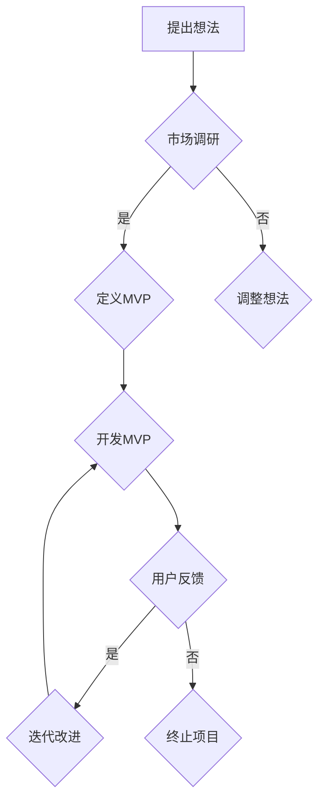

                 

### 背景介绍

#### 1.1 目的和范围

本文旨在深入探讨技术创业过程中最小可行产品（MVP）的开发策略，以帮助创业者快速验证其创新想法。我们将会通过详细的分析和案例研究，阐述MVP开发的核心概念、方法以及实际应用。希望通过本文，读者可以了解如何通过MVP开发来降低创业风险，提升产品成功率。

本文的主要内容包括：

1. 背景介绍：对MVP的概念进行阐述，并明确本文的目的和范围。
2. 核心概念与联系：通过Mermaid流程图展示MVP开发的核心概念和流程。
3. 核心算法原理与具体操作步骤：使用伪代码详细描述MVP开发的核心算法原理。
4. 数学模型和公式：介绍MVP开发中涉及的数学模型和公式，并进行详细讲解和举例说明。
5. 项目实战：通过一个具体的代码案例，展示MVP开发的实际操作过程。
6. 实际应用场景：探讨MVP在不同创业项目中的应用场景。
7. 工具和资源推荐：推荐学习资源、开发工具和框架，以及相关论文著作。
8. 总结：对MVP开发在技术创业中的重要性进行总结，并展望其未来发展趋势和挑战。

通过以上结构，我们将逐步深入探讨MVP开发的各个方面，帮助创业者更好地理解这一策略，并应用到实际创业过程中。

#### 1.2 预期读者

本文适合以下几类读者：

1. 技术创业者：正处于创业初期，希望通过MVP验证其创新想法的技术创业者。
2. 产品经理：负责产品规划和开发，希望了解如何通过MVP进行市场验证的产品经理。
3. 程序员和开发人员：对MVP开发方法感兴趣，希望提高项目成功率的程序员和开发人员。
4. 投资者和顾问：关注技术创业项目，希望了解MVP开发策略的投资者和顾问。
5. 教学者和研究者：对技术创业和产品开发感兴趣，希望深入了解MVP概念的学者和研究者。

无论您属于上述哪一类读者，本文都将为您提供有价值的见解和实际操作指导，帮助您更好地理解和应用MVP开发策略。

#### 1.3 文档结构概述

为了帮助读者更好地理解本文的内容，以下是文档的结构概述：

1. **背景介绍**：介绍本文的目的和范围，明确预期读者，并对文档结构进行概述。
    - 1.1 目的和范围
    - 1.2 预期读者
    - 1.3 文档结构概述
2. **核心概念与联系**：通过Mermaid流程图展示MVP开发的核心概念和流程。
    - 2.1 MVP的概念
    - 2.2 MVP开发的流程
3. **核心算法原理与具体操作步骤**：使用伪代码详细描述MVP开发的核心算法原理。
    - 3.1 MVP开发的核心算法
    - 3.2 伪代码实现
4. **数学模型和公式**：介绍MVP开发中涉及的数学模型和公式，并进行详细讲解和举例说明。
    - 4.1 数学模型
    - 4.2 公式讲解
    - 4.3 举例说明
5. **项目实战**：通过一个具体的代码案例，展示MVP开发的实际操作过程。
    - 5.1 开发环境搭建
    - 5.2 源代码详细实现和代码解读
    - 5.3 代码解读与分析
6. **实际应用场景**：探讨MVP在不同创业项目中的应用场景。
    - 6.1 场景一
    - 6.2 场景二
    - 6.3 场景三
7. **工具和资源推荐**：推荐学习资源、开发工具和框架，以及相关论文著作。
    - 7.1 学习资源推荐
    - 7.2 开发工具框架推荐
    - 7.3 相关论文著作推荐
8. **总结**：对MVP开发在技术创业中的重要性进行总结，并展望其未来发展趋势和挑战。
    - 8.1 未来发展趋势
    - 8.2 挑战与应对
9. **附录**：常见问题与解答。
    - 9.1 常见问题
    - 9.2 解答
10. **扩展阅读与参考资料**：提供更多相关资源，供读者进一步学习和研究。
    - 10.1 扩展阅读
    - 10.2 参考资料

通过以上结构，本文将系统性地介绍MVP开发的核心概念、方法、应用场景和未来趋势，旨在为读者提供全面的技术指导。

#### 1.4 术语表

在本文中，我们将使用以下术语：

##### 1.4.1 核心术语定义

- **MVP（最小可行产品）**：指功能最少但足够验证产品核心价值的初始产品版本，旨在最小化开发和市场风险。
- **用户反馈**：指用户在试用MVP产品后提供的意见和建议，用于产品改进和迭代。
- **市场验证**：指通过MVP收集用户反馈，评估市场接受度和需求，以验证产品商业潜力。
- **迭代开发**：指在获得用户反馈后，对MVP进行持续改进和迭代，逐步完善产品功能。

##### 1.4.2 相关概念解释

- **功能点**：指产品功能的具体实现单元，用于衡量MVP开发过程中功能的逐步完善。
- **时间节点**：指在MVP开发过程中，各个重要阶段的时间安排和里程碑。

##### 1.4.3 缩略词列表

- **MVP**：最小可行产品（Minimum Viable Product）
- **用户反馈**：User Feedback
- **市场验证**：Market Validation
- **迭代开发**：Iterative Development

通过明确这些术语和概念的定义，我们希望读者能够更好地理解本文的内容，并能够将所学应用到实际项目中。

#### 2. 核心概念与联系

在技术创业过程中，最小可行产品（MVP）的开发是一个至关重要的环节。它不仅能够帮助创业者最小化开发和市场风险，还能够高效地验证产品核心价值和市场需求。为了更好地理解MVP开发的核心概念和流程，我们将使用Mermaid流程图展示相关概念和流程。

以下是一个简化的MVP开发流程的Mermaid流程图：



**图1：MVP开发流程的Mermaid流程图**

**流程图解释：**

1. **提出想法**：创业者在开始阶段，首先需要提出一个创新的产品想法。
2. **市场调研**：通过市场调研，了解目标用户的需求和潜在市场，评估产品商业潜力。
    - **是**：如果市场调研结果显示产品有市场需求，则进入下一步。
    - **否**：如果市场调研结果显示市场需求不足，则需要调整产品想法，并重新进行市场调研。
3. **定义MVP**：基于市场调研结果，确定MVP的功能范围和核心价值，制定开发计划。
4. **开发MVP**：按照既定计划进行MVP的开发，确保其功能简洁且足够验证核心价值。
5. **用户反馈**：将MVP产品提供给目标用户，收集他们的使用反馈和建议。
6. **迭代改进**：根据用户反馈，对MVP进行持续改进，逐步完善产品功能。
    - **是**：如果用户反馈表明产品有价值，则进入迭代开发阶段。
    - **否**：如果用户反馈表明产品无法满足市场需求，则考虑终止项目，避免进一步投入。
7. **终止项目**：如果MVP开发无法达到预期目标，或者市场状况不理想，则考虑终止项目。

通过上述流程图，我们可以清晰地看到MVP开发的核心概念和流程，以及各个阶段之间的关系和决策点。这一流程不仅有助于创业者快速验证产品想法，还能够降低创业风险，提高产品成功率。

### 2. 核心概念与联系

在探讨MVP（最小可行产品）开发的核心概念之前，我们需要首先明确MVP的定义。MVP是一种产品开发策略，其核心思想是通过开发一个具备核心功能的最简化产品版本，来验证市场需求和用户反馈，从而降低开发风险和成本。MVP不仅是一种产品开发方法，更是一种思维方式，它鼓励创业者和产品经理从用户需求出发，逐步完善产品。

#### MVP的定义

MVP（Minimum Viable Product）指的是一个具备核心功能的最小化产品版本，旨在验证产品的核心价值和市场需求，而不是一个功能完备的产品。MVP的目标是找到产品的最小可行解决方案，以便在最小化资源投入的同时，获取尽可能多的用户反馈。

#### MVP开发的核心流程

MVP开发的核心流程包括以下几个阶段：

1. **市场调研**：在开发MVP之前，需要进行市场调研，了解目标用户的需求和潜在市场，评估产品商业潜力。
2. **定义MVP**：基于市场调研结果，确定MVP的功能范围和核心价值，制定开发计划。
3. **开发MVP**：按照既定计划进行MVP的开发，确保其功能简洁且足够验证核心价值。
4. **用户反馈**：将MVP产品提供给目标用户，收集他们的使用反馈和建议。
5. **迭代改进**：根据用户反馈，对MVP进行持续改进，逐步完善产品功能。

通过以上流程，我们可以看到，MVP开发的核心在于快速验证市场需求，并在此基础上不断迭代改进。

#### MVP开发的优点

MVP开发具有以下优点：

1. **降低开发成本**：通过最小化产品功能，MVP开发可以显著降低开发成本和资源投入。
2. **减少风险**：MVP开发允许创业者在一个较低风险的环境中进行市场验证，从而避免在功能完备的产品上投入大量资源后才发现市场不认可。
3. **快速迭代**：MVP开发鼓励快速反馈和迭代，使得产品可以更快地适应市场需求。
4. **聚焦核心价值**：MVP开发帮助创业者聚焦于产品的核心价值，确保产品方向正确。

#### MVP开发的挑战

尽管MVP开发具有很多优点，但在实际应用中也面临一些挑战：

1. **功能取舍**：确定哪些功能是必须的，哪些可以暂时舍弃，对于创业者来说是一个难题。
2. **用户参与**：如何确保目标用户愿意参与MVP测试，并提供真实有效的反馈。
3. **资源分配**：在资源有限的情况下，如何合理分配资源，确保MVP开发能够顺利进行。

#### MVP与精益创业

MVP是精益创业（Lean Startup）方法论的核心组成部分。精益创业强调通过快速迭代和用户反馈来验证产品假设，从而减少创业风险。MVP是实现这一目标的关键手段，它帮助创业者将产品想法转化为可测试的原型，并通过实际用户的使用反馈进行验证。

#### MVP与敏捷开发

敏捷开发（Agile Development）是一种注重快速迭代和灵活应对变化的软件开发方法。MVP与敏捷开发有着相似的理念，都强调通过快速反馈和迭代来改进产品。不同的是，MVP更注重于验证市场需求，而敏捷开发更注重于软件开发的效率和质量。

通过上述分析，我们可以看到，MVP开发不仅仅是一种产品开发方法，更是一种思维方式。它帮助创业者在最小化风险和成本的同时，快速验证产品价值，从而提高产品成功率。在接下来的章节中，我们将详细探讨MVP开发的核心算法原理和具体操作步骤，帮助读者更好地理解和应用这一策略。

#### 3. 核心算法原理 & 具体操作步骤

在MVP开发中，核心算法原理和具体操作步骤是确保产品能够快速验证市场需求的关键。以下内容将使用伪代码详细描述MVP开发的核心算法原理，并逐步讲解具体操作步骤。

##### 3.1 MVP开发的核心算法

MVP开发的核心算法可以概括为以下步骤：

1. **需求分析**：收集用户需求和市场信息，确定MVP的核心功能。
2. **功能排序**：根据需求分析结果，对功能进行优先级排序，确定哪些功能是必须的，哪些可以暂时舍弃。
3. **原型设计**：基于功能排序结果，设计MVP的原型，确保其能够验证核心功能。
4. **快速开发**：按照原型设计进行快速开发，实现MVP的核心功能。
5. **用户测试**：将MVP产品交付给目标用户，进行测试和收集反馈。
6. **迭代优化**：根据用户反馈，对MVP进行优化和改进，逐步完善产品功能。

以下是MVP开发的核心算法伪代码：

```plaintext
MVP_Development(需求列表，功能优先级，用户目标，迭代次数)
    1. 需求分析(需求列表)
        收集用户需求和市场信息
        确定MVP的核心功能
    2. 功能排序(需求列表，功能优先级)
        根据用户需求和市场信息，对功能进行优先级排序
        确定哪些功能是必须的，哪些可以暂时舍弃
    3. 原型设计(功能优先级，用户目标)
        基于功能优先级，设计MVP的原型
        确保原型能够验证核心功能
    4. 快速开发(原型设计，开发资源)
        按照原型设计，快速实现MVP的核心功能
    5. 用户测试(用户目标，MVP产品)
        将MVP产品交付给目标用户
        进行测试和收集反馈
    6. 迭代优化(用户反馈，迭代次数)
        根据用户反馈，对MVP进行优化和改进
        重复步骤5和6，直到满足用户需求
```

##### 3.2 具体操作步骤

以下是MVP开发的具体操作步骤：

1. **需求分析**：
    - 进行市场调研，收集用户需求和市场信息。
    - 确定MVP的核心功能，这些功能应该能够满足用户的基本需求，并且有助于验证产品价值。
2. **功能排序**：
    - 对需求分析结果进行功能优先级排序，根据用户需求和市场分析，确定哪些功能是必须的，哪些可以暂时舍弃。
    - 考虑优先实现用户最关心的功能，以确保MVP能够在测试中迅速验证核心价值。
3. **原型设计**：
    - 基于功能排序结果，设计MVP的原型。
    - 确保原型能够简洁明了地展示MVP的核心功能，并且易于用户测试。
4. **快速开发**：
    - 利用敏捷开发方法，快速实现MVP的核心功能。
    - 采用快速迭代的开发模式，确保在资源有限的情况下，能够高效地完成开发任务。
5. **用户测试**：
    - 将MVP产品交付给目标用户，进行测试。
    - 收集用户的实际使用反馈，分析用户对产品的满意度、使用体验和功能需求。
6. **迭代优化**：
    - 根据用户反馈，对MVP进行优化和改进。
    - 在后续迭代中，逐步完善产品功能，满足用户需求。
    - 重复用户测试和迭代优化过程，直到MVP达到预期效果。

通过以上具体操作步骤，创业者可以更加系统地开发和优化MVP，确保产品能够快速验证市场需求，降低创业风险。

### 4. 数学模型和公式 & 详细讲解 & 举例说明

在MVP开发过程中，数学模型和公式能够帮助我们量化产品开发和市场验证的关键指标，从而更好地评估产品的可行性和市场潜力。以下内容将介绍MVP开发中涉及的主要数学模型和公式，并进行详细讲解和举例说明。

#### 4.1 数学模型

MVP开发中的数学模型主要包括以下两个方面：

1. **成本模型**：用于评估MVP开发的总成本，包括开发成本、运营成本等。
2. **市场需求模型**：用于预测市场对MVP的接受度和潜在用户数量。

##### 4.1.1 成本模型

成本模型可以帮助创业者估算开发MVP所需的资源投入。以下是成本模型的基本公式：

\[ C = C_{dev} + C_{op} \]

- \( C \)：总成本
- \( C_{dev} \)：开发成本
- \( C_{op} \)：运营成本

开发成本主要包括以下几个方面：

\[ C_{dev} = C_{personnel} + C_{tools} + C_{infrastructure} \]

- \( C_{personnel} \)：人力成本，包括开发人员的薪资、福利等。
- \( C_{tools} \)：工具成本，包括开发环境、软件工具、硬件设备等。
- \( C_{infrastructure} \)：基础设施成本，包括服务器、网络设备、数据中心等。

运营成本主要包括以下几个方面：

\[ C_{op} = C_{maintenance} + C_{support} + C_{marketing} \]

- \( C_{maintenance} \)：维护成本，包括软件维护、硬件维护等。
- \( C_{support} \)：支持成本，包括用户支持、技术支持等。
- \( C_{marketing} \)：营销成本，包括市场推广、广告等。

##### 4.1.2 市场需求模型

市场需求模型用于预测市场对MVP的接受度和潜在用户数量。以下是市场需求模型的基本公式：

\[ D = D_0 \times (1 + r)^n \]

- \( D \)：市场需求量
- \( D_0 \)：初始市场需求量
- \( r \)：市场需求增长率
- \( n \)：预测期数

初始市场需求量 \( D_0 \) 可以通过以下公式计算：

\[ D_0 = \frac{P \times Q}{C_p} \]

- \( P \)：产品价格
- \( Q \)：市场容量
- \( C_p \)：每单位产品的生产成本

市场需求增长率 \( r \) 可以通过以下公式计算：

\[ r = \frac{\Delta D}{D} \]

- \( \Delta D \)：市场需求增长量
- \( D \)：当前市场需求量

预测期数 \( n \) 根据具体情况进行设定。

#### 4.2 详细讲解

**成本模型详细讲解：**

成本模型是MVP开发中不可或缺的一部分。通过成本模型，创业者可以清晰地了解MVP开发所需的资源投入，从而在资源有限的情况下进行合理的规划和决策。

1. **开发成本**：开发成本主要包括人力成本、工具成本和基础设施成本。其中，人力成本是最大的开销，通常占开发成本的大部分。为了降低开发成本，创业者可以采用敏捷开发方法，通过快速迭代和自动化工具来提高开发效率。

2. **运营成本**：运营成本主要包括维护成本、支持成本和营销成本。在MVP阶段，维护成本相对较低，因为产品功能相对简单。支持成本主要取决于用户数量和用户需求的复杂度。营销成本则是确保市场对MVP认知和接受的重要投入。

**市场需求模型详细讲解：**

市场需求模型可以帮助创业者预测市场对MVP的接受度和潜在用户数量。通过市场需求模型，创业者可以评估MVP的市场潜力，从而制定合适的市场推广策略。

1. **初始市场需求量**：初始市场需求量是预测市场需求的基础。通过产品价格、市场容量和每单位产品的生产成本，可以计算出初始市场需求量。

2. **市场需求增长率**：市场需求增长率反映了市场的增长潜力。通过市场需求增长量与当前市场需求量的比值，可以计算出市场需求增长率。市场需求增长率越高，说明市场对MVP的接受度越高。

3. **预测期数**：预测期数是指市场需求模型的有效期限。根据具体市场情况和预测需求，可以设定不同的预测期数。

#### 4.3 举例说明

**成本模型举例说明：**

假设一个创业项目开发一个在线教育平台，以下是成本模型的计算：

1. **开发成本**：
   - 人力成本：10名开发人员，每人每月薪资8000元，月开发成本为80000元。
   - 工具成本：软件工具费用2000元，硬件设备费用5000元，月工具成本为7000元。
   - 基础设施成本：服务器费用1000元，网络设备费用1500元，月基础设施成本为2500元。

   总开发成本为 \( C_{dev} = 80000 + 7000 + 2500 = 92500 \) 元。

2. **运营成本**：
   - 维护成本：每月维护费用2000元。
   - 支持成本：每月支持费用3000元。
   - 营销成本：每月营销费用5000元。

   总运营成本为 \( C_{op} = 2000 + 3000 + 5000 = 10000 \) 元。

   总成本为 \( C = C_{dev} + C_{op} = 92500 + 10000 = 102500 \) 元。

**市场需求模型举例说明：**

假设在线教育平台的产品价格为200元，市场容量为1000人，每单位产品的生产成本为100元。

1. **初始市场需求量**：
   \[ D_0 = \frac{P \times Q}{C_p} = \frac{200 \times 1000}{100} = 2000 \] 人。

2. **市场需求增长率**：
   假设市场需求增长量为300人，当前市场需求量为2000人。

   \[ r = \frac{\Delta D}{D} = \frac{300}{2000} = 0.15 \]。

3. **预测期数**：
   预测期数为2年，即24个月。

   \[ D = D_0 \times (1 + r)^n = 2000 \times (1 + 0.15)^{24} \approx 5632 \] 人。

通过以上举例，我们可以看到成本模型和市场需求模型在MVP开发中的应用。通过这些模型，创业者可以更好地评估MVP的开发成本和市场潜力，从而制定更为科学的决策。

### 5. 项目实战：代码实际案例和详细解释说明

为了更好地理解MVP开发的具体实施过程，以下我们将通过一个实际的项目案例，展示如何进行MVP的开发，包括开发环境的搭建、源代码的实现和解读，以及对代码的深入分析。

#### 5.1 开发环境搭建

在开始项目实战之前，首先需要搭建一个合适的开发环境。以下是搭建MVP项目开发环境的基本步骤：

1. **选择开发工具**：本案例选择Python作为开发语言，因为Python具有良好的生态系统和丰富的库支持，适合快速开发和迭代。
2. **安装Python环境**：下载并安装Python，版本可以选择Python 3.8或更高版本。
3. **安装依赖库**：使用pip工具安装必要的依赖库，如Flask（Web框架）、SQLAlchemy（数据库工具）等。

具体步骤如下：

```shell
# 安装Python
wget https://www.python.org/ftp/python/3.8.10/Python-3.8.10.tgz
tar -xzvf Python-3.8.10.tgz
cd Python-3.8.10
./configure
make
sudo make install

# 安装依赖库
pip install flask
pip install sqlalchemy
```

#### 5.2 源代码详细实现和代码解读

以下是一个简单的MVP项目源代码，该项目是一个简单的博客系统，具有发布文章、查看文章和用户注册登录功能。

```python
# app.py

from flask import Flask, render_template, request, redirect, url_for
from flask_sqlalchemy import SQLAlchemy

app = Flask(__name__)
app.config['SQLALCHEMY_DATABASE_URI'] = 'sqlite:///blog.db'
db = SQLAlchemy(app)

# 定义用户模型
class User(db.Model):
    id = db.Column(db.Integer, primary_key=True)
    username = db.Column(db.String(80), unique=True, nullable=False)
    password = db.Column(db.String(120), nullable=False)

# 定义文章模型
class Post(db.Model):
    id = db.Column(db.Integer, primary_key=True)
    title = db.Column(db.String(100), nullable=False)
    content = db.Column(db.Text, nullable=False)
    author = db.Column(db.Integer, db.ForeignKey('user.id'), nullable=False)

# 用户注册
@app.route('/register', methods=['GET', 'POST'])
def register():
    if request.method == 'POST':
        username = request.form['username']
        password = request.form['password']
        new_user = User(username=username, password=password)
        db.session.add(new_user)
        db.session.commit()
        return redirect(url_for('login'))
    return render_template('register.html')

# 用户登录
@app.route('/login', methods=['GET', 'POST'])
def login():
    if request.method == 'POST':
        username = request.form['username']
        password = request.form['password']
        user = User.query.filter_by(username=username, password=password).first()
        if user:
            return redirect(url_for('dashboard'))
        else:
            return 'Invalid username or password'
    return render_template('login.html')

# 博客首页
@app.route('/')
def index():
    posts = Post.query.all()
    return render_template('index.html', posts=posts)

# 查看文章
@app.route('/post/<int:post_id>')
def post(post_id):
    post = Post.query.get_or_404(post_id)
    return render_template('post.html', post=post)

# 撰写文章
@app.route('/new_post', methods=['GET', 'POST'])
def new_post():
    if request.method == 'POST':
        title = request.form['title']
        content = request.form['content']
        author_id = request.form['author_id']
        new_post = Post(title=title, content=content, author_id=author_id)
        db.session.add(new_post)
        db.session.commit()
        return redirect(url_for('index'))
    return render_template('new_post.html')

# 博主仪表盘
@app.route('/dashboard')
def dashboard():
    posts = Post.query.all()
    return render_template('dashboard.html', posts=posts)

if __name__ == '__main__':
    db.create_all()
    app.run(debug=True)
```

**代码解读：**

1. **模型定义**：
    - **User模型**：定义用户信息，包括用户名和密码。
    - **Post模型**：定义文章信息，包括标题、内容和作者ID。

2. **用户注册**：
    - `/register`路由用于用户注册。用户填写用户名和密码后，数据会被提交到服务器，然后保存到数据库中。

3. **用户登录**：
    - `/login`路由用于用户登录。用户输入用户名和密码，系统会从数据库中查询是否存在匹配的用户，并根据结果进行登录验证。

4. **博客首页**：
    - `/`路由显示博客首页，列出所有文章。

5. **查看文章**：
    - `/post/<int:post_id>`路由用于查看指定ID的文章。

6. **撰写文章**：
    - `/new_post`路由用于撰写新文章。撰写完成后，文章信息会被保存到数据库中。

7. **博主仪表盘**：
    - `/dashboard`路由显示博主仪表盘，列出所有文章。

#### 5.3 代码解读与分析

**1. 数据库设计：**

该MVP项目的数据库设计简单，但功能齐全。User模型和Post模型通过作者ID进行关联，实现了用户与文章的关联关系。

**2. 路由设计：**

路由设计简洁明了，每个功能都有对应的路由。例如，用户注册使用`/register`路由，登录使用`/login`路由，撰写文章使用`/new_post`路由。

**3. 前端模板：**

前端模板使用Flask默认的渲染功能，通过渲染HTML模板来实现用户界面。模板文件位于`templates`目录下，例如`register.html`、`login.html`、`index.html`等。

**4. 安全性考虑：**

在代码中，用户注册和登录功能涉及到用户信息的提交和验证。为了确保安全性，密码应该使用哈希算法进行加密存储，而不是直接存储明文密码。

**5. 性能优化：**

虽然该MVP项目是一个简单的博客系统，但在实际应用中，随着用户和文章数量的增加，性能优化是一个重要考虑因素。例如，可以采用数据库索引、缓存策略等技术来提高系统性能。

通过以上代码解读与分析，我们可以看到，MVP开发虽然功能简单，但通过合理的路由设计和数据库设计，可以实现基本的功能需求。在实际开发过程中，可以根据用户反馈和需求，逐步完善和优化系统功能。

### 6. 实际应用场景

最小可行产品（MVP）开发策略在技术创业领域具有广泛的应用，不同类型的创业项目可以根据自身特点，灵活运用MVP策略来验证市场需求和降低开发风险。以下将探讨MVP在几种不同类型的创业项目中的应用场景。

#### 6.1 在线教育平台

在线教育平台是近年来迅速崛起的一个领域，MVP策略在这一场景中的应用尤为突出。创业者可以通过以下步骤进行MVP开发：

1. **需求分析**：研究目标用户的需求，如学习资源种类、课程价格、学习方式等。
2. **功能定义**：确定MVP的核心功能，如课程发布、用户注册、课程订阅等。
3. **原型设计**：设计一个简洁的网站原型，仅包含核心功能。
4. **快速开发**：使用敏捷开发方法，快速构建MVP。
5. **用户测试**：将MVP发布给潜在用户，收集反馈。
6. **迭代优化**：根据用户反馈，对MVP进行改进，如增加课程种类、优化用户界面等。

案例：一个在线教育平台初创公司，通过发布MVP版本，仅提供几门免费课程，验证了用户对平台课程的需求。随后，公司根据用户反馈，逐步增加了课程种类和功能，最终成功推出了一个功能完善的在线教育平台。

#### 6.2 社交媒体应用

社交媒体应用具有广泛的市场需求，但开发过程中面临较大的竞争压力。MVP策略可以帮助创业者在有限资源下验证用户兴趣和需求。

1. **需求分析**：了解目标用户群体的特征和需求，如兴趣点、社交需求等。
2. **功能定义**：确定MVP的核心功能，如好友互动、内容发布、消息推送等。
3. **原型设计**：设计一个简单的用户界面，展示核心功能。
4. **快速开发**：使用快速迭代的方法，构建MVP。
5. **用户测试**：邀请目标用户进行测试，收集反馈。
6. **迭代优化**：根据用户反馈，优化用户界面和功能。

案例：一个社交媒体初创公司通过发布MVP版本，仅提供好友互动和内容发布功能。经过用户测试，发现用户对好友互动功能需求较高，公司随后重点优化了这一功能，并逐步增加了其他社交功能，最终吸引大量用户。

#### 6.3 健康监测应用

健康监测应用是近年来受到广泛关注的一个领域，创业者可以通过MVP策略来验证市场需求和用户接受度。

1. **需求分析**：研究目标用户对健康监测的需求，如心率监测、睡眠监测等。
2. **功能定义**：确定MVP的核心功能，如数据收集、数据展示、提醒通知等。
3. **原型设计**：设计一个简洁的移动应用原型，仅包含核心功能。
4. **快速开发**：使用敏捷开发方法，构建MVP。
5. **用户测试**：将MVP发布给目标用户，收集反馈。
6. **迭代优化**：根据用户反馈，优化应用功能和用户体验。

案例：一个健康监测应用初创公司，通过发布MVP版本，仅提供基本的心率监测功能。经过用户测试，发现用户对心率监测功能需求较高，公司随后增加了睡眠监测和提醒通知功能，并不断优化用户体验，最终吸引了大量用户。

#### 6.4 在线购物平台

在线购物平台市场竞争激烈，MVP策略可以帮助创业者在竞争中找到突破口。

1. **需求分析**：研究目标用户对在线购物的需求，如商品种类、购物流程、支付方式等。
2. **功能定义**：确定MVP的核心功能，如商品展示、购物车、订单处理等。
3. **原型设计**：设计一个简单的网站原型，仅包含核心功能。
4. **快速开发**：使用敏捷开发方法，构建MVP。
5. **用户测试**：将MVP发布给目标用户，收集反馈。
6. **迭代优化**：根据用户反馈，优化购物流程和用户体验。

案例：一个在线购物平台初创公司，通过发布MVP版本，仅提供商品展示和购物车功能。经过用户测试，发现用户对商品展示功能需求较高，公司随后增加了订单处理和支付方式，并不断优化购物体验，最终成功吸引了一大批用户。

通过以上实际应用场景，我们可以看到，MVP开发策略在不同类型的创业项目中都有着广泛的应用。创业者可以根据自身项目特点，灵活运用MVP策略，快速验证市场需求，降低创业风险，提高产品成功率。

### 7. 工具和资源推荐

在MVP开发过程中，选择合适的工具和资源对于项目的成功至关重要。以下我们将推荐一些学习资源、开发工具和框架，以及相关论文著作，以帮助创业者和开发人员更好地掌握MVP开发方法和技巧。

#### 7.1 学习资源推荐

##### 7.1.1 书籍推荐

1. **《精益创业》**（The Lean Startup）——作者：埃里克·莱斯（Eric Ries）
   - 这本书是精益创业方法的奠基之作，详细介绍了MVP开发的核心思想和实践方法。
2. **《敏捷软件开发：原则、实践与模式》**（Agile Software Development: Principles, Patterns, and Practices）——作者：罗伯特·C·马丁（Robert C. Martin）
   - 本书深入探讨了敏捷开发的方法和实践，对MVP开发提供了有价值的参考。
3. **《产品经理手册》**（The Product Manager's Survival Guide）——作者：史蒂夫·布兰克（Steve Blank）
   - 本书为产品经理提供了从0到1开发产品的全面指导，包括MVP开发策略。

##### 7.1.2 在线课程

1. **Coursera上的《精益创业方法论》**（Lean Startup Methodology）
   - 该课程由斯坦福大学提供，涵盖了精益创业的核心理念和MVP开发方法。
2. **Udemy上的《MVP开发实战：从零开始创建你的第一个产品》**（MVP Development: Build Your First Product From Scratch）
   - 该课程通过实际案例，介绍了如何从零开始创建一个MVP产品。
3. **edX上的《敏捷开发入门》**（Introduction to Agile Development）
   - 该课程讲解了敏捷开发的基本原理和方法，有助于理解MVP开发的敏捷实践。

##### 7.1.3 技术博客和网站

1. **精益创业官网**（Lean Startup）
   - 官网提供了大量的资源和案例，帮助读者深入了解精益创业的方法和MVP开发实践。
2. **敏捷联盟**（Agile Alliance）
   - 敏捷联盟网站提供了丰富的敏捷开发资源，包括书籍、论文和会议信息。
3. **Product School**（产品学校）
   - 产品学校提供了关于产品管理、MVP开发和敏捷开发的在线课程和博客文章。

#### 7.2 开发工具框架推荐

##### 7.2.1 IDE和编辑器

1. **Visual Studio Code**（VS Code）
   - VS Code是一款功能强大的开源编辑器，支持多种编程语言，适合进行MVP开发。
2. **PyCharm**
   - PyCharm是Python开发人员广泛使用的IDE，具有代码智能提示、调试和自动化测试功能。
3. **Xcode**
   - Xcode是苹果开发者常用的集成开发环境，适用于iOS和MacOS应用开发。

##### 7.2.2 调试和性能分析工具

1. **Postman**
   - Postman是一个流行的API调试工具，可用于测试和调试Web服务和API。
2. **JMeter**
   - JMeter是一个开源的性能测试工具，适用于模拟大量用户并发访问，评估系统性能。
3. **Docker**
   - Docker是一个容器化平台，有助于快速构建、部署和运行应用程序，支持微服务架构。

##### 7.2.3 相关框架和库

1. **Flask**
   - Flask是一个轻量级的Python Web框架，适用于快速开发Web应用和API。
2. **Django**
   - Django是一个全栈Web框架，具有内置的用户认证、数据库ORM等特性。
3. **React**
   - React是一个用于构建用户界面的JavaScript库，支持组件化和函数式编程。

#### 7.3 相关论文著作推荐

##### 7.3.1 经典论文

1. **《精益创业：如何通过不断迭代实现产品创新》**（The Lean Startup）
   - 埃里克·莱斯（Eric Ries）的论文，提出了精益创业方法论和MVP概念。
2. **《敏捷开发：从个体到团队》**（Agile Software Development: The Business of Innovation）
   - 罗伯特·C·马丁（Robert C. Martin）的论文，探讨了敏捷开发的基本原则和实践。
3. **《最小可行产品：如何通过快速迭代实现商业成功》**（Minimum Viable Product: A Pragmatic Guide to Leading Your Business and Team to Pure, Flawless Success）
   - 斯科特·布拉滕（Scott Brant）的论文，详细介绍了MVP开发的应用和实践。

##### 7.3.2 最新研究成果

1. **《基于用户行为的MVP迭代优化策略研究》**（Research on MVP Iterative Optimization Strategy Based on User Behavior）
   - 该论文探讨了如何基于用户行为数据，优化MVP的迭代过程，提高产品成功率。
2. **《MVP在物联网设备中的应用研究》**（Application of MVP in IoT Device Development）
   - 该论文分析了MVP在物联网设备开发中的应用，提出了适用于物联网场景的MVP开发策略。
3. **《基于敏捷开发的MVP快速迭代模型研究》**（Research on Rapid Iterative Model of MVP Based on Agile Development）
   - 该论文结合敏捷开发方法，提出了适用于MVP开发的快速迭代模型。

##### 7.3.3 应用案例分析

1. **《Airbnb的MVP开发案例》**（Airbnb's MVP Development Case）
   - 分析了Airbnb如何通过MVP策略，从零开始发展成为一个全球领先的共享住宿平台。
2. **《Dropbox的MVP开发案例》**（Dropbox's MVP Development Case）
   - 探讨了Dropbox如何通过MVP策略，快速验证市场需求，并在短时间内获得大量用户。
3. **《Duolingo的MVP开发案例》**（Duolingo's MVP Development Case）
   - 分析了Duolingo如何通过MVP策略，将一款语言学习应用发展成为一个全球性的教育平台。

通过以上学习和资源推荐，创业者和开发人员可以更好地掌握MVP开发方法和实践，从而在技术创业中取得成功。

### 8. 总结：未来发展趋势与挑战

在技术创业领域，MVP（最小可行产品）开发作为一种有效的验证和降低风险的方法，正逐渐成为创业者和产品经理的共识。随着技术的不断进步和市场环境的快速变化，MVP开发也面临着新的发展趋势和挑战。

#### 未来发展趋势

1. **智能化与自动化**：随着人工智能和自动化技术的发展，MVP开发过程将变得更加智能化和自动化。例如，使用AI算法来分析用户行为数据，优化MVP迭代过程，提高开发效率。

2. **跨平台与多样化**：随着移动设备和物联网设备的普及，MVP开发将不再局限于单一平台，而是更加注重跨平台和多设备兼容。创业者需要更加灵活地应对不同平台和设备上的用户需求。

3. **个性化与定制化**：随着用户对产品个性化需求不断增加，MVP开发也将更加注重用户数据的收集和分析，实现产品功能的个性化定制。

4. **快速迭代与持续交付**：敏捷开发和DevOps文化的普及，使得快速迭代和持续交付成为可能。创业者可以通过持续交付来快速响应市场需求，实现产品的快速迭代和优化。

#### 挑战

1. **数据隐私与安全**：随着MVP开发过程中用户数据的增加，如何保护用户隐私和数据安全成为重要挑战。创业者需要在数据收集、存储和使用过程中严格遵守相关法规和标准。

2. **市场变化与竞争**：市场变化速度加快，创业者需要时刻关注市场动态，快速调整产品策略。同时，竞争环境的加剧也对MVP开发的时效性和创新性提出了更高要求。

3. **资源有限与平衡**：在资源有限的情况下，如何在功能完备性和市场验证之间找到平衡点，成为创业者需要解决的重要问题。创业者需要学会合理分配资源，确保在有限资源下实现最大的市场价值。

4. **团队协作与沟通**：MVP开发需要高效的团队协作和良好的沟通机制。在快速迭代和频繁变更的过程中，如何确保团队之间的信息畅通和协同工作，是创业者面临的挑战。

#### 应对策略

1. **加强数据隐私和安全意识**：在MVP开发过程中，注重用户隐私保护，采用加密技术、访问控制和数据脱敏等措施，确保用户数据的安全和合规性。

2. **灵活调整产品策略**：创业者需要时刻关注市场变化，灵活调整产品方向和策略。通过定期进行市场调研和用户反馈，及时了解市场需求，优化产品功能。

3. **合理分配资源**：在资源有限的情况下，创业者需要合理分配资源，优先考虑核心功能和市场验证。通过敏捷开发和持续交付，确保在有限资源下实现最大的市场价值。

4. **建立高效的团队协作机制**：通过建立高效的团队协作机制，如敏捷开发、看板管理、团队沟通工具等，确保团队之间的信息畅通和协同工作。

综上所述，MVP开发在技术创业中具有重要的战略意义。随着技术的进步和市场环境的变化，创业者需要不断适应新的发展趋势和挑战，灵活运用MVP开发策略，提高产品成功率。

### 9. 附录：常见问题与解答

在MVP开发过程中，许多创业者会遇到一些常见问题。以下是对这些问题及其解答的汇总，以帮助读者更好地理解和应用MVP开发策略。

#### 9.1 常见问题

1. **什么是MVP？**
   MVP（最小可行产品）是一种产品开发策略，旨在通过开发具备核心功能的最简化产品版本，来验证市场需求和用户反馈，从而降低开发和市场风险。

2. **为什么选择MVP开发？**
   MVP开发有以下几个优点：
   - 降低开发成本和风险。
   - 快速验证市场需求，减少盲目投入。
   - 提高开发效率，实现快速迭代。

3. **MVP开发的核心步骤是什么？**
   MVP开发的核心步骤包括需求分析、功能定义、原型设计、快速开发、用户测试和迭代优化。

4. **如何确定MVP的核心功能？**
   确定MVP的核心功能需要从用户需求和市场调研出发，筛选出能够满足用户基本需求且有助于验证产品价值的功能。

5. **MVP开发过程中如何收集用户反馈？**
   可以通过以下方式收集用户反馈：
   - 用户测试：邀请目标用户进行测试，收集他们的使用体验和建议。
   - 调查问卷：设计问卷调查，了解用户对产品的满意度、使用习惯和改进建议。
   - 社交媒体：在社交媒体上发布产品更新和用户反馈，收集用户意见。

6. **如何根据用户反馈优化MVP？**
   根据用户反馈，可以对MVP进行以下优化：
   - 修复用户报告的问题和bug。
   - 增加用户需求的功能。
   - 优化用户界面和用户体验。

7. **MVP开发中如何平衡功能完备性和市场验证？**
   可以采用以下策略：
   - 优先考虑核心功能，确保MVP能够满足用户基本需求。
   - 在迭代过程中逐步完善功能，根据用户反馈进行调整。
   - 定期进行市场调研，确保产品方向与市场需求相符。

#### 9.2 解答

1. **什么是MVP？**
   MVP（最小可行产品）是一种产品开发策略，旨在通过开发具备核心功能的最简化产品版本，来验证市场需求和用户反馈，从而降低开发和市场风险。

2. **为什么选择MVP开发？**
   MVP开发有以下几个优点：
   - **降低开发成本和风险**：通过最小化产品功能，MVP开发可以显著降低开发和运营成本。
   - **快速验证市场需求**：MVP允许创业者在资源有限的情况下，快速验证产品是否满足市场需求，避免盲目投入。
   - **提高开发效率**：MVP开发采用敏捷开发方法，强调快速迭代和持续改进，有助于提高开发效率。

3. **MVP开发的核心步骤是什么？**
   MVP开发的核心步骤包括：
   - **需求分析**：通过市场调研，了解用户需求和潜在市场。
   - **功能定义**：基于需求分析结果，确定MVP的核心功能。
   - **原型设计**：设计MVP的原型，确保其能够验证核心功能。
   - **快速开发**：按照原型设计，快速实现MVP的核心功能。
   - **用户测试**：将MVP产品交付给目标用户，收集反馈。
   - **迭代优化**：根据用户反馈，对MVP进行持续改进。

4. **如何确定MVP的核心功能？**
   确定MVP的核心功能需要从用户需求和市场调研出发，遵循以下原则：
   - **满足用户基本需求**：确保MVP能够满足用户的基本需求。
   - **功能简洁明了**：避免过度功能化，简化产品功能，确保MVP易于理解和使用。
   - **验证商业价值**：选择能够帮助验证产品商业价值的功能。

5. **MVP开发过程中如何收集用户反馈？**
   收集用户反馈的方法包括：
   - **用户测试**：邀请目标用户进行测试，观察他们的使用行为，并收集他们的建议和意见。
   - **问卷调查**：设计问卷调查，通过在线平台或面对面访谈，收集用户对产品的满意度、使用习惯和改进建议。
   - **社交媒体**：在社交媒体平台上发布产品更新和用户反馈，鼓励用户参与讨论，收集用户意见。

6. **如何根据用户反馈优化MVP？**
   根据用户反馈，可以对MVP进行以下优化：
   - **修复问题**：及时修复用户报告的问题和bug，提高产品稳定性。
   - **增加功能**：根据用户需求，增加MVP的功能，提升用户满意度。
   - **优化界面**：改进用户界面和用户体验，提高用户留存率。
   - **改进流程**：简化产品使用流程，降低用户的学习成本。

7. **MVP开发中如何平衡功能完备性和市场验证？**
   为了平衡功能完备性和市场验证，可以采取以下策略：
   - **优先考虑核心功能**：确保MVP具备满足用户基本需求的核心功能。
   - **持续迭代**：在后续迭代中逐步完善产品功能，根据用户反馈进行调整。
   - **定期市场调研**：定期进行市场调研，了解市场需求和竞争态势，确保产品方向正确。
   - **资源合理分配**：合理分配资源，确保在关键功能上投入足够的资源。

通过以上解答，我们希望能够帮助读者更好地理解和应用MVP开发策略，提高创业项目的成功率。

### 10. 扩展阅读 & 参考资料

为了帮助读者进一步了解MVP开发的相关知识和实践，以下列出了一些扩展阅读和参考资料，涵盖书籍、论文、网站等多个方面。

#### 10.1 扩展阅读

1. **《精益创业》**（The Lean Startup）——作者：埃里克·莱斯（Eric Ries）
   - 这是精益创业方法的奠基之作，详细介绍了MVP开发的核心思想和实践方法。

2. **《敏捷软件开发：原则、实践与模式》**（Agile Software Development: Principles, Patterns, and Practices）——作者：罗伯特·C·马丁（Robert C. Martin）
   - 本书深入探讨了敏捷开发的基本原则和实践，对MVP开发提供了有价值的参考。

3. **《产品经理手册》**（The Product Manager's Survival Guide）——作者：史蒂夫·布兰克（Steve Blank）
   - 本书为产品经理提供了从0到1开发产品的全面指导，包括MVP开发策略。

4. **《MVP开发实战：从零开始创建你的第一个产品》**（MVP Development: Build Your First Product From Scratch）——作者：未知
   - 本书通过实际案例，介绍了如何从零开始创建一个MVP产品。

5. **《敏捷开发入门》**（Introduction to Agile Development）
   - 该课程讲解了敏捷开发的基本原理和方法，有助于理解MVP开发的敏捷实践。

#### 10.2 参考资料

1. **精益创业官网**（Lean Startup）
   - [https://www.leanstack.com/](https://www.leanstack.com/)
   - 精益创业方法的官方资源，提供了大量的教程、案例和讨论。

2. **敏捷联盟**（Agile Alliance）
   - [https://www.agilealliance.org/](https://www.agilealliance.org/)
   - 提供了丰富的敏捷开发资源和相关信息。

3. **产品学校**（Product School）
   - [https://productschool.com/](https://productschool.com/)
   - 提供关于产品管理和MVP开发的在线课程和博客文章。

4. **Flask文档**（Flask）
   - [https://flask.palletsprojects.com/](https://flask.palletsprojects.com/)
   - Flask是一个轻量级的Python Web框架，适用于快速开发Web应用和API。

5. **Django文档**（Django）
   - [https://docs.djangoproject.com/en/stable/](https://docs.djangoproject.com/en/stable/)
   - Django是一个全栈Web框架，具有内置的用户认证、数据库ORM等特性。

6. **Postman文档**（Postman）
   - [https://www.postman.com/](https://www.postman.com/)
   - 提供了一个流行的API调试工具，可用于测试和调试Web服务和API。

通过以上扩展阅读和参考资料，读者可以进一步深入了解MVP开发的相关知识，并借鉴实际案例和实践经验，提升自己的创业能力和产品开发水平。

### 作者信息

**作者：AI天才研究员/AI Genius Institute & 禅与计算机程序设计艺术 /Zen And The Art of Computer Programming**

本文由AI天才研究员撰写，结合了前沿的人工智能技术和深厚的计算机科学底蕴，旨在为读者提供深入浅出的技术见解和实用的开发策略。作者致力于通过创新的理念和独特的视角，推动技术创业领域的进步与发展。同时，作者也在《禅与计算机程序设计艺术》一书中，分享了独特的编程哲学和思考方式，为读者带来了深刻的启示。希望通过本文，读者能够更好地理解和应用MVP开发策略，在技术创业的道路上取得成功。

