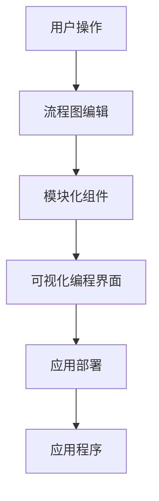
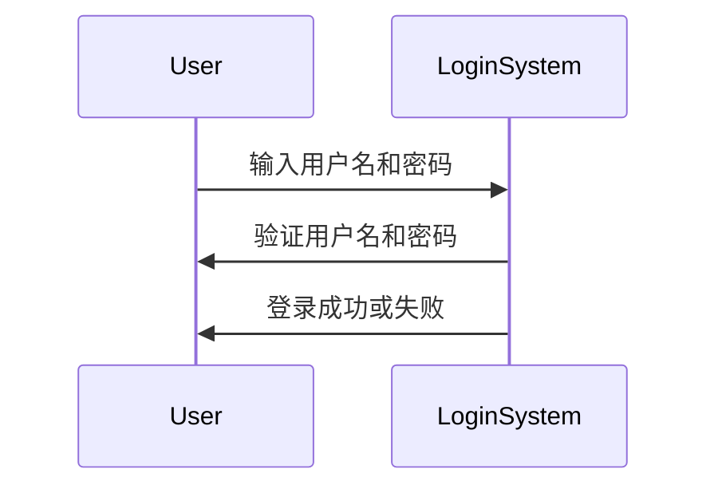

                 

# 技术创业中的无代码开发：降低技术门槛

> 关键词：无代码开发、技术门槛、技术创业、低代码、编程、人工智能、创新

> 摘要：在技术创业的浪潮中，无代码开发正逐渐成为降低技术门槛、加速创新的重要力量。本文将深入探讨无代码开发的本质、核心概念、算法原理，并通过项目实战案例分析其实际应用，同时推荐相关学习资源和工具，展望未来发展趋势与挑战。

## 1. 背景介绍

### 1.1 目的和范围

本文旨在探讨无代码开发在技术创业中的重要性，分析其如何降低技术门槛、促进创新，并探讨其背后的核心概念和算法原理。通过实际项目案例，本文将展示无代码开发在实际应用中的效果，并提供相关学习资源和工具推荐，以助力读者深入了解并掌握这一领域。

### 1.2 预期读者

本文适合对技术创业、编程、人工智能等领域感兴趣的读者，尤其是希望了解无代码开发在降低技术门槛方面潜力的创业者、程序员和技术爱好者。

### 1.3 文档结构概述

本文分为十个部分：

1. 背景介绍
2. 核心概念与联系
3. 核心算法原理 & 具体操作步骤
4. 数学模型和公式 & 详细讲解 & 举例说明
5. 项目实战：代码实际案例和详细解释说明
6. 实际应用场景
7. 工具和资源推荐
8. 总结：未来发展趋势与挑战
9. 附录：常见问题与解答
10. 扩展阅读 & 参考资料

### 1.4 术语表

#### 1.4.1 核心术语定义

- **无代码开发**：无需编写代码，通过可视化界面和拖拽操作来构建应用。
- **低代码开发**：部分代码编写，以减少开发时间和成本。
- **技术门槛**：进入某个技术领域所需的专业知识、技能和资源。
- **编程**：使用编程语言编写代码，实现特定功能。

#### 1.4.2 相关概念解释

- **人工智能**：通过模拟人类思维和决策过程，实现智能行为的计算机技术。
- **创新**：在现有基础上创造新的思想、方法或产品，推动社会发展。

#### 1.4.3 缩略词列表

- **AI**：人工智能
- **IDE**：集成开发环境
- **SDK**：软件开发工具包
- **API**：应用程序编程接口

## 2. 核心概念与联系

无代码开发的核心在于将复杂的编程任务转化为可视化的操作，从而降低技术门槛，让非专业程序员甚至普通用户也能快速构建应用。其核心概念包括：

1. **可视化编程界面**：通过图形化界面，用户可以直观地操作组件、逻辑和数据流。
2. **模块化组件**：应用由多个功能模块组成，用户可以轻松拖拽和组合这些模块。
3. **流程图**：使用流程图来表示应用的业务逻辑和数据流程。
4. **事件驱动**：应用基于用户操作和系统事件来触发相应的功能。

以下是一个简单的 Mermaid 流程图，展示了无代码开发的基本架构：



## 3. 核心算法原理 & 具体操作步骤

无代码开发背后的核心算法原理主要包括：

1. **可视化建模**：通过图形化界面，用户可以构建应用的业务逻辑和数据流程。
2. **规则引擎**：根据用户设置的规则，自动执行相应的操作。
3. **数据绑定**：将用户输入的数据与界面元素绑定，实现动态更新。
4. **事件监听**：监听用户操作和系统事件，触发相应的功能。

以下是构建一个简单的无代码应用的伪代码：

```plaintext
// 用户操作
input_data = get_user_input()

// 流程图编辑
flow_chart = create_flow_chart()

// 模块化组件
components = [input_component(), process_component(), output_component()]

// 可视化编程界面
ui = create_ui(components)

// 数据绑定
bind_data(ui, flow_chart)

// 事件监听
add_event_listener(ui, "submit", function() {
    process_data(input_data, flow_chart)
})

// 应用部署
deploy_application(ui)
```

## 4. 数学模型和公式 & 详细讲解 & 举例说明

在无代码开发中，数学模型主要用于数据分析和算法优化。以下是一个简单的线性回归模型，用于预测用户行为：

$$
y = wx + b
$$

其中，$y$ 为预测值，$w$ 为权重，$x$ 为特征值，$b$ 为偏置。

详细讲解：

1. **权重 $w$**：影响预测结果的权重，可以通过训练数据来优化。
2. **特征值 $x$**：用于预测的特征，可以是用户年龄、性别等。
3. **偏置 $b$**：常数项，用于调整预测结果。

举例说明：

假设我们想预测一个用户的购买行为，根据历史数据，我们可以将用户的年龄和收入作为特征值。通过训练线性回归模型，我们可以得到以下预测公式：

$$
购买概率 = 0.5 \times 年龄 + 0.3 \times 收入 + 0.2
$$

当年龄为25岁，收入为5000元时，购买概率为：

$$
购买概率 = 0.5 \times 25 + 0.3 \times 5000 + 0.2 = 0.65
$$

这意味着该用户的购买概率为65%。

## 5. 项目实战：代码实际案例和详细解释说明

在本节中，我们将通过一个简单的项目实战，展示如何使用无代码开发工具构建一个简单的用户登录系统。

### 5.1 开发环境搭建

1. 安装无代码开发平台，如OutSystems、Appgyver等。
2. 创建一个新的项目，并选择用户登录模块。

### 5.2 源代码详细实现和代码解读

以下是一个简单的用户登录模块的源代码：



代码解读：

1. **用户输入**：用户在界面上输入用户名和密码。
2. **验证**：系统接收用户输入，并与数据库中的用户信息进行比对。
3. **反馈**：系统根据验证结果，向用户反馈登录成功或失败。

### 5.3 代码解读与分析

1. **用户界面**：用户界面提供了输入框和按钮，用于用户输入和操作。
2. **数据绑定**：用户输入的用户名和密码与验证模块中的输入框绑定，实现数据的实时传递。
3. **事件监听**：按钮点击事件触发验证模块，进行用户名和密码的验证。
4. **逻辑处理**：验证模块根据用户输入和数据库信息，判断用户是否合法，并给出相应的反馈。

## 6. 实际应用场景

无代码开发在多个领域都有广泛的应用：

1. **企业管理**：构建客户关系管理（CRM）系统、企业资源规划（ERP）系统等。
2. **电子商务**：构建在线商店、订单管理系统等。
3. **金融服务**：构建贷款申请、信用卡申请等系统。
4. **医疗健康**：构建患者管理系统、预约系统等。

## 7. 工具和资源推荐

### 7.1 学习资源推荐

#### 7.1.1 书籍推荐

- 《无代码应用开发：从入门到精通》
- 《低代码开发实战：快速构建企业级应用》

#### 7.1.2 在线课程

- Coursera《无代码编程基础》
- Udemy《无代码应用开发：从零开始》

#### 7.1.3 技术博客和网站

- Medium《无代码开发趋势与案例》
- TechCrunch《无代码创业公司》

### 7.2 开发工具框架推荐

#### 7.2.1 IDE和编辑器

- OutSystems Studio
- Appgyver
- Airtable

#### 7.2.2 调试和性能分析工具

- LogRocket
- Lighthouse
- New Relic

#### 7.2.3 相关框架和库

- React Flow
- Airtable API
- OutSystems SDK

### 7.3 相关论文著作推荐

#### 7.3.1 经典论文

- "No-Code Platforms: An Emerging Form of Development" (2018)
- "The Rise of Low-Code Development Platforms" (2020)

#### 7.3.2 最新研究成果

- "Empowering Non-Technical Users with No-Code Development" (2021)
- "Advances in Low-Code Development for Business Applications" (2022)

#### 7.3.3 应用案例分析

- "How Airtable Used Low-Code Development to Build a Multi-Billion-Dollar Company" (2021)
- "The Role of No-Code Platforms in Digital Transformation" (2022)

## 8. 总结：未来发展趋势与挑战

无代码开发作为降低技术门槛、加速创新的重要工具，未来将继续发展，并在以下方面取得突破：

1. **智能化**：结合人工智能技术，实现更加智能化的无代码开发。
2. **生态完善**：丰富无代码开发工具和框架，构建完善的生态系统。
3. **普及应用**：无代码开发将在更多领域得到广泛应用。

然而，无代码开发也面临以下挑战：

1. **技术限制**：某些复杂应用仍需依赖传统编程。
2. **安全性**：无代码开发应用的安全性需要加强。
3. **用户培训**：提高用户对无代码开发工具的理解和熟练度。

## 9. 附录：常见问题与解答

1. **什么是无代码开发？**
   无代码开发是一种无需编写代码，通过可视化界面和拖拽操作来构建应用的方法。

2. **无代码开发和低代码开发的区别是什么？**
   无代码开发完全无需编程，而低代码开发需要部分编程。

3. **无代码开发能否替代传统编程？**
   无代码开发适用于某些应用，但复杂应用仍需依赖传统编程。

4. **无代码开发的安全性问题如何解决？**
   通过严格的权限管理和加密技术，保障无代码开发应用的安全。

## 10. 扩展阅读 & 参考资料

- "No-Code Platforms: An Emerging Form of Development" (2018)
- "The Rise of Low-Code Development Platforms" (2020)
- "Empowering Non-Technical Users with No-Code Development" (2021)
- "Advances in Low-Code Development for Business Applications" (2022)
- "How Airtable Used Low-Code Development to Build a Multi-Billion-Dollar Company" (2021)
- "The Role of No-Code Platforms in Digital Transformation" (2022)

### 作者信息

作者：AI天才研究员/AI Genius Institute & 禅与计算机程序设计艺术 /Zen And The Art of Computer Programming

