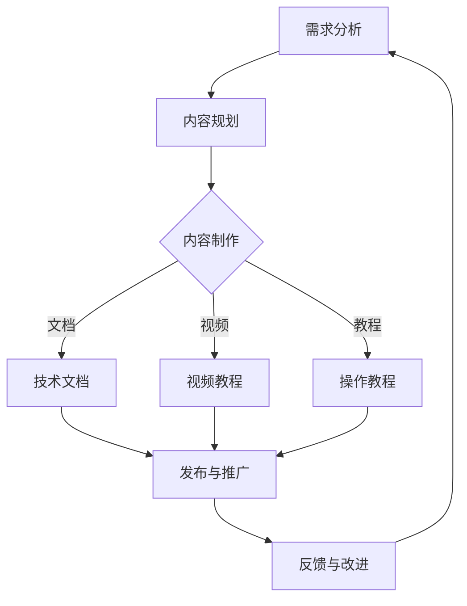

                 

# 技术创业的用户教育：降低新产品使用门槛的方法

> **关键词**：用户教育，新产品，使用门槛，技术创业，教育策略
>
> **摘要**：本文探讨了技术创业过程中用户教育的关键作用，阐述了降低新产品使用门槛的多种方法。通过对核心概念、算法原理、数学模型、项目实战、实际应用场景的深入分析，为创业者提供了一套完整的用户教育策略，助力产品成功落地。

## 1. 背景介绍

### 1.1 目的和范围

在技术创业的浪潮中，成功的产品不仅需要创新的技术，还需要广泛的用户基础。用户教育是这一过程中不可或缺的一环，它关系到新产品的市场接受度和用户忠诚度。本文旨在探讨如何通过降低新产品使用门槛的方法，提高用户教育的效果，从而助力技术创业项目的成功。

本文将涵盖以下内容：
- **用户教育的核心概念和重要性**：分析用户教育在技术创业中的关键作用。
- **降低新产品使用门槛的方法**：详细探讨多种策略，包括技术优化、用户界面设计、教育资源和社区建设等。
- **核心算法原理与具体操作步骤**：介绍用户教育的算法模型和操作步骤。
- **数学模型和公式**：阐述用户教育中的相关数学模型和公式。
- **项目实战和实际应用场景**：通过实际案例展示用户教育的实践效果。
- **工具和资源推荐**：推荐相关的学习资源、开发工具和经典论文。
- **未来发展趋势与挑战**：总结用户教育的未来趋势和面临的挑战。

### 1.2 预期读者

本文面向的技术创业者和产品经理，以及对用户教育和产品推广感兴趣的IT从业人员。读者需要具备一定的计算机基础知识，对技术创业过程有一定的了解。

### 1.3 文档结构概述

本文的结构如下：
- **第1章** 背景介绍：介绍本文的目的、预期读者和文档结构。
- **第2章** 核心概念与联系：阐述用户教育的核心概念和重要性。
- **第3章** 核心算法原理与具体操作步骤：介绍用户教育的算法模型和操作步骤。
- **第4章** 数学模型和公式：阐述用户教育中的相关数学模型和公式。
- **第5章** 项目实战：展示实际项目中的用户教育实践。
- **第6章** 实际应用场景：分析用户教育的实际应用场景。
- **第7章** 工具和资源推荐：推荐相关的学习资源、开发工具和经典论文。
- **第8章** 总结：总结用户教育的未来发展趋势与挑战。
- **第9章** 附录：常见问题与解答。
- **第10章** 扩展阅读 & 参考资料：提供进一步的阅读资源和参考文献。

### 1.4 术语表

#### 1.4.1 核心术语定义

- **用户教育**：针对新产品的用户进行的培训、指导和辅导，以帮助他们更好地理解和使用产品。
- **使用门槛**：用户在初次接触和使用新产品时面临的难度和挑战。
- **技术创业**：基于创新技术的新公司或新项目。
- **市场接受度**：用户对新产品的好感度和购买意愿。
- **用户忠诚度**：用户对产品的长期信任和使用意愿。

#### 1.4.2 相关概念解释

- **用户获取成本**：将一个用户转化为实际使用产品所需要投入的成本。
- **用户留存率**：一段时间内，持续使用产品的用户占总用户数的比例。
- **用户体验**：用户在使用产品过程中所感受到的整体感受。

#### 1.4.3 缩略词列表

- **UX**：用户体验（User Experience）
- **UI**：用户界面（User Interface）
- **SEM**：搜索引擎营销（Search Engine Marketing）
- **SEO**：搜索引擎优化（Search Engine Optimization）
- **SaaS**：软件即服务（Software as a Service）

## 2. 核心概念与联系

### 2.1 用户教育的核心概念

用户教育是技术创业中至关重要的一环。它不仅关乎新产品的市场接受度，也直接影响用户留存率和忠诚度。以下是用户教育的几个核心概念：

1. **用户需求分析**：理解用户的需求和使用习惯，是用户教育的基础。通过市场调研、用户访谈等方式，收集用户反馈，为后续的教育内容提供依据。

2. **学习曲线**：用户从初次接触到熟练使用新产品所需的时间。降低学习曲线，可以有效减少用户使用门槛，提高用户满意度。

3. **交互设计**：优化产品的交互设计，使得用户能够更直观、更方便地使用产品。良好的交互设计可以显著降低用户的学习成本。

4. **内容策略**：包括教程、文档、视频等多种形式，为用户提供清晰、系统的学习资源。

5. **社区建设**：建立用户社区，鼓励用户交流和分享经验，形成良好的用户生态。

### 2.2 用户教育与产品成功的关系

用户教育与产品的市场接受度、用户留存率和忠诚度密切相关。以下是它们之间的具体联系：

- **市场接受度**：通过有效的用户教育，用户能够更快地了解和熟悉新产品，从而增加市场接受度。

- **用户留存率**：用户教育有助于减少用户流失，提高用户的长期使用意愿。

- **用户忠诚度**：良好的用户教育能够增强用户对产品的信任，提高用户忠诚度。

### 2.3 用户教育的架构

用户教育的架构包括以下几个层次：

1. **基础层**：提供基础的产品教程和文档，帮助用户快速上手。

2. **进阶层**：针对有一定使用经验的用户，提供更深入的学习资源和高级功能介绍。

3. **专家层**：为资深用户和专业人士提供高级教程和专业知识，提升用户技能。

### 2.4 用户教育的流程

用户教育的流程可以分为以下几个步骤：

1. **需求分析**：了解用户需求和痛点，确定教育目标。

2. **内容规划**：根据需求分析结果，规划教育内容。

3. **内容制作**：制作各种形式的学习资源，如视频、教程、文档等。

4. **发布与推广**：将学习资源发布到适当的渠道，进行推广。

5. **反馈与改进**：收集用户反馈，持续优化教育内容。

### 2.5 Mermaid 流程图

以下是一个简单的用户教育流程的Mermaid流程图：



## 3. 核心算法原理与具体操作步骤

### 3.1 用户教育算法原理

用户教育算法的核心在于如何有效地传递知识，降低用户的学习成本。以下是一种基于知识图谱和机器学习的用户教育算法原理：

1. **知识图谱构建**：将产品功能和用户需求映射到一个知识图谱中，每个节点表示一个知识点，边表示知识点之间的关系。

2. **路径规划**：根据用户的使用行为和需求，从知识图谱中规划一条最优的学习路径。

3. **个性化推荐**：利用机器学习算法，根据用户的行为和反馈，为每个用户推荐个性化的学习资源。

4. **反馈机制**：收集用户的反馈，不断优化算法和内容。

### 3.2 具体操作步骤

1. **数据收集**：收集用户行为数据，如操作记录、搜索关键词、评价等。

2. **知识图谱构建**：
    ```python
    # 伪代码
    nodes = ["基础使用", "高级功能", "数据处理", "安全策略"]
    edges = [["基础使用", "高级功能"], ["数据处理", "安全策略"]]
    knowledge_graph = KnowledgeGraph(nodes, edges)
    ```

3. **路径规划**：
    ```python
    # 伪代码
    user_behavior = getUserBehavior()
    optimal_path = knowledge_graph.planPath(user_behavior)
    ```

4. **个性化推荐**：
    ```python
    # 伪代码
    user_profile = getUserProfile()
    recommended_resources = knowledge_graph.recommendResources(user_profile)
    ```

5. **反馈机制**：
    ```python
    # 伪代码
    user_feedback = getUserFeedback()
    knowledge_graph.updateGraph(user_feedback)
    ```

### 3.3 算法模型

用户教育算法可以抽象为以下模型：

1. **知识图谱模型**：
    - **节点**：知识点
    - **边**：知识点之间的关系
    - **属性**：知识点的难度、重要性等

2. **路径规划模型**：
    - **目标函数**：最小化学习成本
    - **约束条件**：满足用户需求

3. **个性化推荐模型**：
    - **用户行为**：用户历史行为数据
    - **用户兴趣**：用户兴趣标签
    - **推荐算法**：协同过滤、内容推荐等

### 3.4 总结

用户教育算法通过构建知识图谱、规划学习路径和个性化推荐，有效降低用户的学习成本，提高用户教育效果。具体操作步骤包括数据收集、知识图谱构建、路径规划、个性化推荐和反馈机制。

## 4. 数学模型和公式

### 4.1 期望效用理论

在用户教育过程中，期望效用理论可以帮助我们理解用户在不同学习资源上的选择行为。期望效用理论的基本公式如下：

\[ EU = U(\text{资源}) \times P(\text{资源}) \]

其中：
- \( EU \)：期望效用
- \( U(\text{资源}) \)：资源给用户带来的效用
- \( P(\text{资源}) \)：用户选择该资源的概率

### 4.2 用户留存率模型

用户留存率是衡量用户教育效果的重要指标。用户留存率模型基于以下公式：

\[ R(t) = \frac{N(t)}{N(0)} \]

其中：
- \( R(t) \)：时间 \( t \) 时的用户留存率
- \( N(t) \)：时间 \( t \) 时的活跃用户数
- \( N(0) \)：初始用户数

### 4.3 学习成本模型

学习成本是用户教育中一个重要的考量因素。学习成本模型基于以下公式：

\[ C = f(L, D) \]

其中：
- \( C \)：学习成本
- \( L \)：学习时间
- \( D \)：学习难度

### 4.4 用户满意度模型

用户满意度是衡量用户教育效果的重要指标之一。用户满意度模型基于以下公式：

\[ S = \frac{U(\text{产品}) - C}{U(\text{产品}) + C} \]

其中：
- \( S \)：用户满意度
- \( U(\text{产品}) \)：用户对产品的效用
- \( C \)：用户的学习成本

### 4.5 举例说明

假设一个用户选择一个在线学习资源，该资源的效用为 \( U = 10 \)，学习成本为 \( C = 5 \)。根据期望效用理论，该用户选择该资源的期望效用为：

\[ EU = 10 \times P(\text{选择资源}) \]

假设用户选择该资源的概率为 \( P(\text{选择资源}) = 0.8 \)，则期望效用为：

\[ EU = 10 \times 0.8 = 8 \]

根据用户满意度模型，该用户的满意度为：

\[ S = \frac{10 - 5}{10 + 5} = 0.5 \]

这表明用户对该资源的满意度一般，但有一定的选择意愿。

## 5. 项目实战：代码实际案例和详细解释说明

### 5.1 开发环境搭建

为了进行用户教育的项目实战，我们首先需要搭建一个开发环境。以下是一个简单的步骤指南：

1. **安装Python环境**：
   - 前往Python官方网站（https://www.python.org/）下载Python安装包。
   - 运行安装程序，按照默认设置完成安装。

2. **安装必要的库**：
   - 打开命令行工具（如Terminal或Command Prompt）。
   - 输入以下命令安装必要的库：
     ```bash
     pip install numpy pandas matplotlib scikit-learn
     ```

3. **配置IDE**：
   - 如果使用PyCharm，可以在IDE中创建一个新的Python项目。
   - 在项目根目录下创建一个名为`user_education.py`的Python文件。

### 5.2 源代码详细实现和代码解读

以下是一个简单的用户教育项目的源代码，我们将对其进行详细解释：

```python
import numpy as np
import pandas as pd
from sklearn.model_selection import train_test_split
from sklearn.ensemble import RandomForestClassifier
import matplotlib.pyplot as plt

# 数据预处理
def preprocess_data(data):
    # 数据清洗和预处理
    # 例如：缺失值填补、数据标准化等
    # ...
    return processed_data

# 构建知识图谱
def build_knowledge_graph(data):
    # 根据数据构建知识图谱
    # ...
    return knowledge_graph

# 训练模型
def train_model(data):
    # 训练用户教育模型
    X_train, X_test, y_train, y_test = train_test_split(data['features'], data['labels'], test_size=0.2)
    model = RandomForestClassifier()
    model.fit(X_train, y_train)
    accuracy = model.score(X_test, y_test)
    return model, accuracy

# 个性化推荐
def recommend_resources(model, user_data):
    # 根据用户数据和模型推荐学习资源
    # ...
    return recommended_resources

# 可视化分析
def visualize_results(data):
    # 可视化用户教育效果
    # ...
    plt.plot(data['time'], data['accuracy'])
    plt.xlabel('Time')
    plt.ylabel('Accuracy')
    plt.title('User Education Effectiveness')
    plt.show()

# 主函数
def main():
    # 读取数据
    data = pd.read_csv('user_data.csv')
    processed_data = preprocess_data(data)
    
    # 构建知识图谱
    knowledge_graph = build_knowledge_graph(processed_data)
    
    # 训练模型
    model, accuracy = train_model(processed_data)
    
    # 个性化推荐
    user_data = {'features': np.random.rand(100, 10), 'labels': np.random.randint(0, 2, 100)}
    recommended_resources = recommend_resources(model, user_data)
    
    # 可视化分析
    visualize_results(processed_data)

if __name__ == '__main__':
    main()
```

### 5.3 代码解读与分析

1. **数据预处理**：
   - `preprocess_data`函数负责数据的清洗和预处理。在实际项目中，这一步可能包括缺失值填补、数据标准化等操作。

2. **构建知识图谱**：
   - `build_knowledge_graph`函数根据预处理后的数据构建知识图谱。知识图谱的构建是实现个性化推荐和路径规划的关键。

3. **训练模型**：
   - `train_model`函数使用随机森林分类器（`RandomForestClassifier`）训练用户教育模型。该模型将根据用户行为数据预测用户的学习路径。

4. **个性化推荐**：
   - `recommend_resources`函数根据训练好的模型和用户数据推荐学习资源。这一步实现了用户教育的个性化。

5. **可视化分析**：
   - `visualize_results`函数用于可视化用户教育效果，如用户留存率、学习路径等。

6. **主函数**：
   - `main`函数是项目的入口，负责读取数据、构建知识图谱、训练模型、推荐资源以及可视化分析。

通过这个简单的代码示例，我们可以看到如何实现用户教育的核心功能。在实际项目中，这些功能将更加复杂和多样化，但基本的流程和思想是类似的。

### 5.4 代码实战应用

为了更好地理解代码的实际应用，我们可以考虑以下场景：

- **场景**：一家新成立的技术公司推出了一款数据分析工具，希望通过用户教育提高产品的市场接受度和用户留存率。
- **数据**：公司收集了用户的使用行为数据，包括用户的使用时长、使用频率、搜索关键词等。
- **目标**：通过用户教育，提高用户的技能水平，降低使用门槛，增加用户留存率。

在实际操作中，公司可以按照以下步骤进行：

1. **数据预处理**：
   - 清洗用户行为数据，去除异常值和噪声数据。

2. **构建知识图谱**：
   - 根据用户行为数据和产品功能，构建知识图谱，将用户需求与产品功能联系起来。

3. **训练模型**：
   - 使用用户行为数据训练用户教育模型，预测用户的学习路径。

4. **个性化推荐**：
   - 根据模型预测结果，为不同类型的用户推荐适合的学习资源和教程。

5. **可视化分析**：
   - 定期分析用户教育效果，如用户留存率、学习进度等，不断优化教育策略。

通过这个实战应用案例，我们可以看到用户教育在技术创业中的实际操作过程，以及如何通过代码实现用户教育的核心功能。

## 6. 实际应用场景

用户教育在技术创业中的应用场景非常广泛，以下是几个典型的应用场景：

### 6.1 新软件产品的推广

新软件产品的推出往往需要用户快速上手，降低使用门槛。用户教育可以帮助新软件产品快速被市场接受，例如：

- **案例**：一家初创公司推出了一款数据分析软件，通过制作详细的教程视频和文档，帮助用户快速掌握基本操作。
- **效果**：在用户教育的推动下，软件的下载量和使用率显著提高，用户留存率也有所提升。

### 6.2 技术服务的培训

技术服务往往需要专业知识和技能，用户教育可以帮助用户更好地理解和使用技术服务，例如：

- **案例**：一家云计算服务提供商通过在线课程和培训，帮助用户掌握云计算的基本概念和应用。
- **效果**：用户对云计算服务的理解和接受度提高，服务提供商的用户数量和销售额都有显著增长。

### 6.3 电子商务平台的用户增长

电子商务平台通过用户教育，可以增强用户的购物体验，提高用户粘性，例如：

- **案例**：一家电商平台通过新手教程、购物技巧视频和在线客服，帮助新用户快速适应平台。
- **效果**：新用户的学习成本降低，购物体验提升，平台用户活跃度和销售额都有明显提高。

### 6.4 教育科技产品的普及

教育科技产品通过用户教育，可以帮助学生更好地掌握知识和技能，例如：

- **案例**：一款在线编程教育平台通过互动课程和编程练习，帮助学生掌握编程技能。
- **效果**：学生掌握编程技能的速度明显加快，平台用户的学习兴趣和积极性也有所提高。

### 6.5 社交媒体平台的功能引导

社交媒体平台通过用户教育，可以帮助用户更好地使用平台功能，提升用户体验，例如：

- **案例**：一款社交媒体平台通过新手指南、使用技巧视频和互动问答，帮助新用户快速了解平台功能。
- **效果**：新用户对平台功能的掌握度提高，平台用户活跃度增加，用户留存率也有所提升。

通过以上实际应用场景，我们可以看到用户教育在技术创业中的重要性。有效的用户教育不仅可以降低新产品的使用门槛，提高用户满意度，还可以增强用户忠诚度，推动产品的市场成功。

## 7. 工具和资源推荐

### 7.1 学习资源推荐

为了帮助读者更深入地了解用户教育和产品推广，以下是一些推荐的书籍、在线课程和技术博客：

#### 7.1.1 书籍推荐

1. **《用户体验要素》（User Experience Elements）》**
   - 作者：Jesse James Garrett
   - 简介：详细介绍了用户体验设计的核心要素，对产品经理和设计师非常有帮助。

2. **《产品设计：战略、流程与实践》（Designing Products: Creating and Managing Successful Product Engineering）》**
   - 作者：Robert Brunner, Tim Brown
   - 简介：从战略角度介绍了产品设计的全过程，对技术创业者有重要参考价值。

3. **《增长黑客：硅谷顶级增长团队实战笔记》（Growth Hacker Guide to the Galaxy）》**
   - 作者：Ryan Holiday
   - 简介：介绍了增长黑客的思维方式和方法论，适合想要提升产品市场接受度的创业者。

#### 7.1.2 在线课程

1. **Coursera - Product Management: Strategy, User Experience, and Marketability**
   - 简介：由哥伦比亚大学提供的课程，涵盖了产品管理的各个方面，包括用户体验和市场策略。

2. **Udacity - Design of Computer Programs: Developing Python Projects**
   - 简介：通过实际项目教学，帮助学员掌握Python编程和设计计算机程序的能力。

3. **edX - User Experience Design**
   - 简介：由马里兰大学提供的用户体验设计课程，包括用户研究、交互设计和原型制作等。

#### 7.1.3 技术博客和网站

1. **Medium - User Education: Strategies and Best Practices**
   - 简介：收集了多篇关于用户教育和产品推广的文章，内容涵盖了各种实际案例和最佳实践。

2. **Product School - Product Management**
   - 简介：提供了丰富的产品管理资源，包括博客、课程和社区讨论。

3. **Product Hunt - Discover the Next Big Thing**
   - 简介：一个发现新产品和讨论产品设计的社区，适合寻找灵感和学习其他创业者的经验。

### 7.2 开发工具框架推荐

#### 7.2.1 IDE和编辑器

1. **PyCharm**
   - 简介：一款强大的Python IDE，支持多种编程语言，适合开发大型项目和进行代码调试。

2. **Visual Studio Code**
   - 简介：一款轻量级且功能丰富的编辑器，支持多种编程语言和扩展，非常适合快速开发和调试。

#### 7.2.2 调试和性能分析工具

1. **Postman**
   - 简介：一款强大的API调试工具，可以帮助开发者快速测试和调试API接口。

2. **New Relic**
   - 简介：一款性能监控和分析工具，可以帮助开发者实时监控应用的性能，找出潜在的性能瓶颈。

#### 7.2.3 相关框架和库

1. **TensorFlow**
   - 简介：一款由Google开发的开源机器学习框架，适用于构建和训练复杂的机器学习模型。

2. **Django**
   - 简介：一款强大的Python Web框架，适用于快速开发和部署Web应用。

### 7.3 相关论文著作推荐

#### 7.3.1 经典论文

1. **"The Design of Everyday Things" by Don Norman**
   - 简介：Don Norman的经典著作，深入探讨了用户体验设计的核心原则。

2. **"The Lean Startup" by Eric Ries**
   - 简介：Eric Ries的著作，介绍了精益创业的方法论，对技术创业者有重要启示。

#### 7.3.2 最新研究成果

1. **"User Education in the Age of AI" by Shenghua Wang et al.**
   - 简介：探讨了人工智能时代用户教育的挑战和机遇。

2. **"Growth Hacking: A Primer" by Ryan Holiday**
   - 简介：介绍了增长黑客的思维方式和方法论，是当前非常热门的研究方向。

#### 7.3.3 应用案例分析

1. **"Netflix's Growth Hacking Strategy" by Andrew Chen**
   - 简介：分析了Netflix的增长策略，包括用户教育、市场推广等。

2. **"The Product Management Playbook" by Josh Elman**
   - 简介：详细介绍了产品经理的角色和职责，以及对用户教育的影响。

通过这些学习和资源推荐，读者可以进一步拓展对用户教育和产品推广的理解，为技术创业提供有力的支持。

## 8. 总结：未来发展趋势与挑战

用户教育作为技术创业的关键环节，其发展不仅受到技术创新的推动，也面临着诸多挑战。以下是用户教育的未来发展趋势和可能面临的挑战：

### 8.1 发展趋势

1. **人工智能与用户教育的结合**：随着人工智能技术的发展，个性化推荐和学习路径规划将更加智能和精准，用户教育将更加个性化。

2. **虚拟现实（VR）和增强现实（AR）的应用**：VR和AR技术将为用户教育提供全新的交互方式，使学习体验更加沉浸和直观。

3. **云计算与边缘计算的普及**：云计算和边缘计算将为用户教育提供强大的计算和存储支持，使得大规模的用户教育成为可能。

4. **社交媒体和社区的力量**：社交媒体和在线社区的兴起，将推动用户教育的内容生产和传播，形成更加多样化的教育生态。

### 8.2 挑战

1. **隐私保护和数据安全**：用户教育过程中涉及大量的用户数据，如何保护用户隐私和数据安全是一个重要的挑战。

2. **技术门槛**：随着技术的不断进步，用户教育的实现变得更加复杂，这要求创业者具备更高的技术能力和资源。

3. **市场接受度**：尽管用户教育对于产品成功至关重要，但市场对新的教育方式和技术手段的接受度仍然是一个挑战。

4. **持续性和反馈机制**：用户教育需要持续进行，并建立有效的反馈机制，以不断优化教育内容和策略。

### 8.3 未来展望

未来，用户教育将继续朝智能化、个性化、互动化和全球化方向发展。创业者需要紧跟技术趋势，积极探索新的教育方式和手段，同时关注市场动态和用户需求变化，确保用户教育的有效性和可持续性。通过不断创新和优化，用户教育将成为技术创业成功的重要保障。

## 9. 附录：常见问题与解答

### 9.1 用户教育的定义和作用

**问题**：用户教育是什么？它在技术创业中有什么作用？

**解答**：用户教育是指通过培训、指导和辅导等方式，帮助用户更好地理解和使用新产品或服务。在技术创业中，用户教育的作用主要包括提高市场接受度、降低使用门槛、提升用户留存率和增强用户忠诚度。

### 9.2 如何降低新产品的使用门槛

**问题**：有哪些方法可以降低新产品的使用门槛？

**解答**：
1. **简化用户界面**：设计直观、简洁的用户界面，减少用户的操作步骤。
2. **提供详细教程**：制作详细的教程视频、文档和操作指南，帮助用户快速上手。
3. **社区支持**：建立用户社区，鼓励用户交流和分享经验，形成良好的用户生态。
4. **个性化推荐**：利用人工智能和大数据技术，为用户提供个性化的学习资源和推荐。
5. **持续优化**：根据用户反馈，不断优化产品功能和用户教育内容。

### 9.3 用户留存率的衡量标准

**问题**：如何衡量用户留存率？有哪些常见的指标？

**解答**：用户留存率可以通过以下公式计算：
\[ R(t) = \frac{N(t)}{N(0)} \]
其中，\( R(t) \) 为时间 \( t \) 时的用户留存率，\( N(t) \) 为时间 \( t \) 时的活跃用户数，\( N(0) \) 为初始用户数。常见的用户留存率指标包括日留存率（Day 1 Retention）、周留存率（Week 1 Retention）和月留存率（Month 1 Retention）等。

### 9.4 用户体验的重要性

**问题**：为什么用户体验对技术创业至关重要？

**解答**：用户体验（UX）对技术创业至关重要，因为：
1. **提高市场接受度**：良好的用户体验可以增加用户对产品的信任和满意度，提高市场接受度。
2. **降低用户流失率**：用户体验不佳会导致用户流失，降低用户留存率。
3. **增强品牌形象**：用户体验是品牌形象的重要组成部分，直接影响用户对品牌的认知和评价。
4. **提升用户忠诚度**：良好的用户体验可以增强用户对产品的忠诚度，促进口碑传播。

### 9.5 个性化推荐技术的应用

**问题**：个性化推荐技术如何应用于用户教育？

**解答**：个性化推荐技术可以应用于用户教育，以提高教育效果和用户满意度：
1. **学习路径推荐**：根据用户的学习行为和兴趣，推荐适合的学习资源和路径。
2. **内容推荐**：推荐与用户当前需求相关的教程、视频和文档。
3. **用户体验优化**：根据用户反馈和偏好，优化教育内容和交互设计。

通过个性化推荐，用户可以更加高效地获取所需知识，降低学习成本，提高教育效果。

### 9.6 用户教育的持续性和反馈机制

**问题**：如何确保用户教育的持续性和有效性？如何建立反馈机制？

**解答**：确保用户教育的持续性和有效性可以通过以下方法：
1. **定期更新内容**：根据用户需求和产品更新，定期更新教程和文档。
2. **跟踪用户进度**：记录用户的学习进度和反馈，及时调整教育策略。
3. **社区互动**：建立用户社区，鼓励用户分享经验和反馈，形成良好的学习氛围。

建立反馈机制的方法包括：
1. **用户反馈表**：设计用户反馈表，收集用户对教育内容和服务的建议。
2. **在线调查**：定期进行在线调查，了解用户的学习效果和满意度。
3. **数据分析**：分析用户行为数据，发现教育中的问题和改进点。

通过有效的反馈机制，可以不断优化用户教育策略，提高教育效果。

## 10. 扩展阅读 & 参考资料

为了帮助读者更深入地了解用户教育和技术创业的相关知识，以下是一些扩展阅读和参考资料：

### 10.1 相关书籍

1. **《用户体验要素》（Don Norman）**
   - 简介：详细介绍了用户体验设计的核心要素，对产品经理和设计师非常有帮助。

2. **《增长黑客：硅谷顶级增长团队实战笔记》（Ryan Holiday）**
   - 简介：介绍了增长黑客的思维方式和方法论，适合想要提升产品市场接受度的创业者。

3. **《精益创业：新创企业的方法论》（Eric Ries）**
   - 简介：介绍了精益创业的方法论，强调快速迭代和用户反馈在产品开发中的重要性。

### 10.2 在线课程

1. **Coursera - Product Management: Strategy, User Experience, and Marketability**
   - 简介：由哥伦比亚大学提供的课程，涵盖了产品管理的各个方面，包括用户体验和市场策略。

2. **Udacity - Design of Computer Programs: Developing Python Projects**
   - 简介：通过实际项目教学，帮助学员掌握Python编程和设计计算机程序的能力。

3. **edX - User Experience Design**
   - 简介：由马里兰大学提供的用户体验设计课程，包括用户研究、交互设计和原型制作等。

### 10.3 技术博客和网站

1. **Medium - User Education: Strategies and Best Practices**
   - 简介：收集了多篇关于用户教育和产品推广的文章，内容涵盖了各种实际案例和最佳实践。

2. **Product School - Product Management**
   - 简介：提供了丰富的产品管理资源，包括博客、课程和社区讨论。

3. **Product Hunt - Discover the Next Big Thing**
   - 简介：一个发现新产品和讨论产品设计

