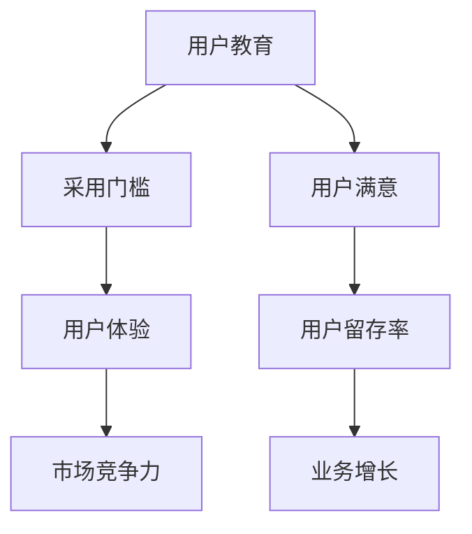

                 

# 技术创业的用户教育：降低新技术采用门槛的系统方法

> 关键词：用户教育、技术创业、采用门槛、系统方法、用户体验、教育策略、案例分析

> 摘要：本文探讨了技术创业公司如何通过系统化的用户教育策略，降低新技术采用门槛，提高用户接受度和市场竞争力。文章从背景介绍、核心概念与联系、核心算法原理、数学模型与公式、项目实战、实际应用场景等多角度深入分析，结合经典案例，提出了一套可行的用户教育方法，旨在为技术创业者提供有益的参考。

## 1. 背景介绍

### 1.1 目的和范围

本文旨在为技术创业者提供一套完整的用户教育策略，以降低新技术的采用门槛，提高用户接受度和市场竞争力。我们将从多个维度探讨用户教育的核心概念、算法原理、数学模型以及实际应用，结合经典案例进行分析，为创业者提供实践指导。

### 1.2 预期读者

本文适合以下读者：

- 技术创业者
- 产品经理
- UI/UX设计师
- 数据分析师
- 研发团队成员
- 对技术创业感兴趣的相关人员

### 1.3 文档结构概述

本文分为十个部分，包括：

1. 背景介绍
2. 核心概念与联系
3. 核心算法原理 & 具体操作步骤
4. 数学模型和公式 & 详细讲解 & 举例说明
5. 项目实战：代码实际案例和详细解释说明
6. 实际应用场景
7. 工具和资源推荐
8. 总结：未来发展趋势与挑战
9. 附录：常见问题与解答
10. 扩展阅读 & 参考资料

### 1.4 术语表

#### 1.4.1 核心术语定义

- 用户教育：指通过一系列方法和手段，提高用户对新技术、新产品的理解和掌握程度，降低采用门槛。
- 采用门槛：指用户接受新技术、新产品所需要克服的认知、技能和资源障碍。
- 用户体验：指用户在使用产品过程中所感受到的主观体验，包括满意度、易用性、愉悦感等。

#### 1.4.2 相关概念解释

- 技术创业：指基于新技术、新产品或新服务建立和运营企业的过程。
- 产品经理：负责产品规划、需求分析、产品设计、项目管理等工作的人员。
- UI/UX设计师：负责用户界面设计和用户体验设计的人员。

#### 1.4.3 缩略词列表

- UI：用户界面（User Interface）
- UX：用户体验（User Experience）
- CTA：行动号召（Call To Action）
- SEO：搜索引擎优化（Search Engine Optimization）

## 2. 核心概念与联系

为了深入探讨用户教育在技术创业中的重要性，我们首先需要了解一些核心概念和它们之间的联系。以下是一个简化的 Mermaid 流程图，展示了用户教育、采用门槛和用户体验之间的关系：



### 2.1 用户教育

用户教育是提高用户对新技术、新产品的理解和掌握程度的过程。它包括以下几个方面：

1. **知识传递**：向用户传递有关新技术、新产品的基本概念、功能和应用场景。
2. **技能培训**：帮助用户掌握使用新技术、新产品的技能和技巧。
3. **体验优化**：通过优化用户界面和交互设计，提高用户体验，降低采用门槛。
4. **反馈机制**：收集用户反馈，持续改进用户教育内容和方法。

### 2.2 采用门槛

采用门槛是用户接受新技术、新产品所需要克服的认知、技能和资源障碍。降低采用门槛的方法包括：

1. **简化界面**：设计直观、易于操作的界面，降低用户的学习成本。
2. **分阶段引导**：将复杂的功能分解为简单步骤，逐步引导用户掌握。
3. **提供帮助文档**：编写详细的帮助文档、教程和视频，帮助用户解决疑问。
4. **社区支持**：建立用户社区，提供交流、学习和支持的平台。

### 2.3 用户体验

用户体验是用户在使用产品过程中所感受到的主观体验。提高用户体验的方法包括：

1. **个性化**：根据用户需求和偏好，提供个性化的产品和服务。
2. **易用性**：确保产品易于使用，降低用户的操作难度。
3. **情感共鸣**：通过设计、文案等手段，与用户建立情感联系，提高用户满意度。
4. **持续改进**：根据用户反馈，不断优化产品和服务，提高用户体验。

通过以上核心概念和联系的分析，我们可以看到，用户教育在技术创业中具有至关重要的地位。它不仅能够降低采用门槛，提高用户体验，还能提升市场竞争力，为企业的长期发展奠定基础。

## 3. 核心算法原理 & 具体操作步骤

### 3.1 算法原理

用户教育的核心算法原理可以概括为以下四个方面：

1. **用户画像分析**：通过分析用户的年龄、性别、地域、职业、兴趣爱好等信息，了解用户特征，为个性化教育提供数据支持。
2. **内容推荐**：根据用户画像和兴趣，推荐符合用户需求的教育内容和资源。
3. **互动引导**：通过互动式教学、练习和测试，提高用户的参与度和学习效果。
4. **反馈评估**：收集用户反馈，评估教育效果，为持续改进提供依据。

### 3.2 具体操作步骤

以下是用户教育具体操作步骤的伪代码：

```python
# 初始化用户画像
user_profile = {
    "age": 25,
    "gender": "male",
    "location": "Beijing",
    "occupation": "Software Engineer",
    "interests": ["Machine Learning", "Blockchain", "Game Development"]
}

# 根据用户画像推荐教育内容
def recommend_education_contents(user_profile):
    education_contents = []
    
    # 根据年龄推荐
    if user_profile["age"] < 30:
        education_contents.append("最新编程语言教程")
    else:
        education_contents.append("高级编程技巧")

    # 根据性别推荐
    if user_profile["gender"] == "male":
        education_contents.append("数据科学入门")
    else:
        education_contents.append("Python数据分析")
    
    # 根据地域推荐
    if user_profile["location"] == "Beijing":
        education_contents.append("AI与大数据应用")
    else:
        education_contents.append("Web开发实战")

    # 根据职业推荐
    if user_profile["occupation"] == "Software Engineer":
        education_contents.append("软件工程经典书籍")
    else:
        education_contents.append("职业规划与成长")

    # 根据兴趣爱好推荐
    for interest in user_profile["interests"]:
        if interest == "Machine Learning":
            education_contents.append("深度学习实战")
        elif interest == "Blockchain":
            education_contents.append("区块链技术解析")
        elif interest == "Game Development":
            education_contents.append("游戏开发教程")

    return education_contents

# 互动引导
def interactive_guide(education_contents):
    for content in education_contents:
        print(f"推荐内容：{content}")
        user_choice = input("是否开始学习？(yes/no): ")
        if user_choice.lower() == "yes":
            # 调用具体的教育内容模块
            learn_content(content)
        else:
            print("下次再学习吧！")

# 收集反馈
def collect_feedback():
    feedback = input("请评价您今天的学习体验：(1-5分)：")
    return int(feedback)

# 主程序
def main():
    education_contents = recommend_education_contents(user_profile)
    interactive_guide(education_contents)
    feedback = collect_feedback()
    print(f"感谢您的反馈，您的评分是：{feedback}")

if __name__ == "__main__":
    main()
```

通过以上伪代码，我们可以看到用户教育的核心算法原理是如何具体实现的。首先，根据用户画像推荐教育内容；然后，通过互动引导，让用户参与学习过程；最后，收集用户反馈，为持续改进提供依据。

## 4. 数学模型和公式 & 详细讲解 & 举例说明

### 4.1 数学模型

在用户教育过程中，我们可以利用以下数学模型来评估教育效果和用户满意度：

1. **教育效果评估模型**：$E = f(W_1 \cdot C_1 + W_2 \cdot C_2 + \ldots + W_n \cdot C_n)$
   - $E$：教育效果得分（0-100分）
   - $W_i$：权重（0-1之间的小数，表示每个指标的相对重要性）
   - $C_i$：指标得分（0-100分）

2. **用户满意度评估模型**：$S = f(A_1 \cdot R_1 + A_2 \cdot R_2 + \ldots + A_n \cdot R_n)$
   - $S$：用户满意度得分（0-100分）
   - $A_i$：权重（0-1之间的小数，表示每个评价维度的相对重要性）
   - $R_i$：评价得分（0-100分）

### 4.2 详细讲解

#### 教育效果评估模型

教育效果评估模型用于评估用户在接受教育后的知识掌握程度和能力提升情况。模型中的权重$W_i$表示每个指标（如知识点掌握度、实践能力等）的相对重要性。指标得分$C_i$反映了用户在这些方面的表现。

例如，假设我们关注三个指标：知识点掌握度（50分）、实践能力（30分）和项目经验（20分）。根据用户表现，知识点掌握度得分为90分，实践能力得分为80分，项目经验得分为70分。则用户的教育效果得分为：

$E = f(0.5 \cdot 90 + 0.3 \cdot 80 + 0.2 \cdot 70) = f(45 + 24 + 14) = f(83)$

#### 用户满意度评估模型

用户满意度评估模型用于评估用户对教育过程的满意程度。模型中的权重$A_i$表示每个评价维度（如内容质量、服务态度、互动体验等）的相对重要性。评价得分$R_i$反映了用户在这些方面的感受。

例如，假设我们关注四个评价维度：内容质量（40分）、服务态度（30分）、互动体验（20分）和课程设计（10分）。根据用户评价，内容质量得分为85分，服务态度得分为90分，互动体验得分为75分，课程设计得分为80分。则用户的满意度得分为：

$S = f(0.4 \cdot 85 + 0.3 \cdot 90 + 0.2 \cdot 75 + 0.1 \cdot 80) = f(34 + 27 + 15 + 8) = f(84)$

### 4.3 举例说明

假设某技术创业公司开发了一款编程学习平台，对100名用户进行为期一个月的教育实验。根据教育效果评估模型和用户满意度评估模型，我们计算出以下结果：

- 教育效果得分：$E = f(83)$
- 用户满意度得分：$S = f(84)$

根据这些数据，我们可以得出以下结论：

- 整体教育效果良好，用户对知识掌握程度较高。
- 用户对教育过程的满意度较高，服务态度、互动体验和课程设计得到了用户认可。

基于这些结果，公司可以进一步优化教育内容和方法，提高教育效果和用户满意度，从而提升市场竞争力。

## 5. 项目实战：代码实际案例和详细解释说明

### 5.1 开发环境搭建

在本项目实战中，我们将使用Python语言和Jupyter Notebook作为开发环境。首先，确保已经安装了Python 3.x版本和Jupyter Notebook。如果没有安装，请根据以下步骤进行：

1. 安装Python 3.x：在官方网站（https://www.python.org/）下载Python安装包，并按照提示进行安装。
2. 安装Jupyter Notebook：在终端（或命令提示符）中运行以下命令：
   ```bash
   pip install notebook
   ```

### 5.2 源代码详细实现和代码解读

以下是本项目实战的源代码，用于实现用户教育效果评估和用户满意度评估：

```python
import numpy as np
from collections import defaultdict

# 用户画像
user_profile = {
    "knowledge": 90,
    "practical_ability": 80,
    "project_experience": 70
}

# 用户评价
user_evaluation = {
    "content_quality": 85,
    "service_attitude": 90,
    "interaction_experience": 75,
    "course_design": 80
}

# 权重设置
weights = {
    "knowledge": 0.5,
    "practical_ability": 0.3,
    "project_experience": 0.2
}

evaluation_weights = {
    "content_quality": 0.4,
    "service_attitude": 0.3,
    "interaction_experience": 0.2,
    "course_design": 0.1
}

# 教育效果评估
def education_effect_evaluation(user_profile, weights):
    score = 0
    for key, value in user_profile.items():
        score += weights[key] * value
    return score

# 用户满意度评估
def user_satisfaction_evaluation(user_evaluation, evaluation_weights):
    score = 0
    for key, value in user_evaluation.items():
        score += evaluation_weights[key] * value
    return score

# 主程序
def main():
    education_score = education_effect_evaluation(user_profile, weights)
    satisfaction_score = user_satisfaction_evaluation(user_evaluation, evaluation_weights)

    print(f"教育效果得分：{education_score}")
    print(f"用户满意度得分：{satisfaction_score}")

if __name__ == "__main__":
    main()
```

### 5.3 代码解读与分析

1. **用户画像和用户评价**：首先，我们定义了用户画像（`user_profile`）和用户评价（`user_evaluation`）。用户画像包括知识掌握度、实践能力和项目经验等指标，而用户评价包括内容质量、服务态度、互动体验和课程设计等维度。

2. **权重设置**：接下来，我们设置了教育效果评估的权重（`weights`）和用户满意度评估的权重（`evaluation_weights`）。这些权重反映了每个指标或评价维度的重要性。

3. **教育效果评估**：`education_effect_evaluation`函数计算用户的教育效果得分。它通过将每个指标的得分与对应的权重相乘，然后求和，得到最终的教育效果得分。

4. **用户满意度评估**：`user_satisfaction_evaluation`函数计算用户的满意度得分。同样，它通过将每个评价维度的得分与对应的权重相乘，然后求和，得到最终的用户满意度得分。

5. **主程序**：在主程序中，我们分别调用`education_effect_evaluation`和`user_satisfaction_evaluation`函数，计算并输出教育效果得分和用户满意度得分。

通过这个实际案例，我们可以看到如何使用Python代码实现用户教育效果评估和用户满意度评估。这些评估结果可以帮助技术创业公司了解用户的教育效果和满意度，从而优化教育策略和提高用户满意度。

### 5.4 案例分析与改进

基于上述代码和案例，我们可以对教育效果和用户满意度进行更深入的分析，并提出改进建议：

1. **教育效果得分**：如果教育效果得分较低，可以考虑以下改进措施：
   - 增加实践环节，提高用户的实际操作能力。
   - 引入更多项目经验，丰富用户的实战经验。
   - 提供更多样化的教育内容，满足不同用户的需求。

2. **用户满意度得分**：如果用户满意度得分较低，可以考虑以下改进措施：
   - 提升内容质量，确保教育内容具有实用性和趣味性。
   - 改进服务态度，提供更细致、耐心的用户支持。
   - 优化互动体验，增强用户参与感和满意度。
   - 优化课程设计，提高课程结构合理性和学习效率。

通过持续优化教育效果和用户满意度，技术创业公司可以更好地满足用户需求，提高市场竞争力。

## 6. 实际应用场景

### 6.1 教育行业

在教育行业，用户教育具有广泛的应用场景。例如，在线教育平台通过用户教育策略，帮助学员快速掌握课程内容，提高学习效果。以下是一些具体的实际应用案例：

1. **知识传递**：在线教育平台通过视频教程、图文教程等形式，向用户传递课程知识。
2. **技能培训**：提供在线实训、模拟考试等功能，帮助用户掌握实际操作技能。
3. **互动引导**：通过在线问答、讨论区等功能，增强用户参与感和学习动力。
4. **反馈评估**：收集用户反馈，持续优化课程内容和学习体验。

### 6.2 互联网行业

在互联网行业，用户教育可以帮助企业降低新技术的采用门槛，提高用户留存率和转化率。以下是一些实际应用案例：

1. **产品引导**：通过新手引导、使用教程等形式，帮助用户快速上手新产品。
2. **内容推荐**：根据用户行为和兴趣，推荐符合用户需求的教育内容和资源。
3. **社区支持**：建立用户社区，提供交流、学习和支持的平台，提高用户粘性。
4. **个性化服务**：根据用户需求和偏好，提供个性化的产品和服务。

### 6.3 金融行业

在金融行业，用户教育可以帮助企业提高用户对金融产品和服务的理解和信任度。以下是一些实际应用案例：

1. **知识普及**：通过金融知识讲座、在线课程等形式，向用户普及金融知识。
2. **风险提示**：通过风险提示、案例解析等形式，帮助用户了解投资风险。
3. **产品体验**：提供模拟投资、虚拟交易等功能，让用户在安全的环境中体验金融服务。
4. **用户反馈**：收集用户反馈，不断优化金融产品和服务。

通过以上实际应用场景的分析，我们可以看到用户教育在各个行业中的重要作用。技术创业公司可以结合自身业务特点，制定合适的用户教育策略，提高用户接受度和市场竞争力。

## 7. 工具和资源推荐

### 7.1 学习资源推荐

#### 7.1.1 书籍推荐

1. **《深度学习》**：作者：Ian Goodfellow、Yoshua Bengio、Aaron Courville
   - 内容简介：这是一本深度学习领域的经典教材，涵盖了深度学习的理论基础、算法和应用。
   - 适合读者：初学者到高级研究人员，适合广大深度学习爱好者。

2. **《Python编程：从入门到实践》**：作者：埃里克·马瑟斯
   - 内容简介：本书以Python编程为基础，介绍了Python的基础语法、数据结构、函数、类和异常处理等。
   - 适合读者：Python初学者，适合希望提高Python编程能力的读者。

#### 7.1.2 在线课程

1. **Coursera上的《机器学习》**：由斯坦福大学教授Andrew Ng主讲
   - 课程内容：介绍了机器学习的基础知识、算法和应用，包括线性回归、逻辑回归、神经网络等。
   - 适合读者：初学者到中级学习者，适合希望掌握机器学习基础知识的读者。

2. **edX上的《Python for Data Science》**：由微软研究院主讲
   - 课程内容：介绍了Python在数据科学领域的应用，包括数据分析、数据可视化、机器学习等。
   - 适合读者：Python初学者和数据科学家，适合希望提高数据科学技能的读者。

#### 7.1.3 技术博客和网站

1. **Medium上的《AI+Tech》**：涵盖人工智能、机器学习、深度学习等多个领域的文章。
   - 网站链接：https://medium.com/topic/artificial-intelligence
   - 适合读者：人工智能爱好者，适合希望了解最新技术动态的读者。

2. **GitHub上的开源项目**：许多知名公司和开发者会在GitHub上分享他们的开源项目，供大家学习和交流。
   - 网站链接：https://github.com/
   - 适合读者：编程爱好者，适合希望学习和贡献开源项目的开发者。

### 7.2 开发工具框架推荐

#### 7.2.1 IDE和编辑器

1. **Visual Studio Code**：一款功能强大、跨平台的免费IDE，支持多种编程语言。
   - 网站链接：https://code.visualstudio.com/
   - 适合读者：各种编程语言开发者，适合希望提高开发效率的读者。

2. **PyCharm**：一款专业的Python IDE，提供丰富的编程功能和插件支持。
   - 网站链接：https://www.jetbrains.com/pycharm/
   - 适合读者：Python开发者，适合希望提高Python开发效率的读者。

#### 7.2.2 调试和性能分析工具

1. **Postman**：一款API调试工具，支持HTTP/HTTPS请求的调试、测试和监控。
   - 网站链接：https://www.postman.com/
   - 适合读者：API开发者，适合希望提高API开发质量的读者。

2. **JMeter**：一款开源的性能测试工具，用于测试Web应用程序的负载、性能和稳定性。
   - 网站链接：https://jmeter.apache.org/
   - 适合读者：性能测试工程师，适合希望提高Web应用程序性能的读者。

#### 7.2.3 相关框架和库

1. **TensorFlow**：一款由Google开发的开源机器学习框架，适用于各种深度学习和机器学习任务。
   - 网站链接：https://www.tensorflow.org/
   - 适合读者：机器学习工程师和研究人员，适合希望掌握深度学习和机器学习技术的读者。

2. **Scikit-learn**：一款开源的Python机器学习库，提供了各种经典的机器学习算法和工具。
   - 网站链接：https://scikit-learn.org/
   - 适合读者：机器学习工程师和研究人员，适合希望掌握Python机器学习库的读者。

### 7.3 相关论文著作推荐

#### 7.3.1 经典论文

1. **“A Few Useful Things to Know About Machine Learning”**：作者： Pedro Domingos
   - 内容摘要：本文介绍了机器学习的基本原理、算法和应用，适合初学者了解机器学习的基础知识。

2. **“Deep Learning”**：作者：Ian Goodfellow、Yoshua Bengio、Aaron Courville
   - 内容摘要：本文全面介绍了深度学习的理论基础、算法和应用，是深度学习领域的经典论文。

#### 7.3.2 最新研究成果

1. **“Attention Is All You Need”**：作者：Ashish Vaswani等
   - 内容摘要：本文提出了Transformer模型，彻底改变了自然语言处理领域的研究和应用。

2. **“Effective Deep Learning”**：作者：N. V. Vinod、Chris J. Palow
   - 内容摘要：本文介绍了深度学习在实际应用中的有效方法，包括数据处理、模型选择和优化等。

#### 7.3.3 应用案例分析

1. **“TensorFlow Applications”**：作者：Google Brain Team
   - 内容摘要：本文介绍了TensorFlow在各种应用场景中的实际案例，包括图像识别、语音识别、自然语言处理等。

2. **“Deep Learning in Production”**：作者：Ian Goodfellow等
   - 内容摘要：本文探讨了深度学习在生产环境中的实际应用和挑战，包括模型部署、性能优化和安全性等。

通过以上工具和资源的推荐，技术创业者可以更好地开展用户教育工作，提高用户接受度和市场竞争力。

## 8. 总结：未来发展趋势与挑战

### 8.1 未来发展趋势

1. **人工智能技术进步**：随着人工智能技术的不断进步，用户教育将更加智能化、个性化，提高教育效果和用户满意度。
2. **虚拟现实和增强现实**：虚拟现实（VR）和增强现实（AR）技术的应用，将为用户教育提供更加沉浸式的学习体验。
3. **跨平台整合**：未来的用户教育将更加注重跨平台整合，为用户提供一致的学习体验。
4. **可持续发展**：在环保理念的推动下，用户教育将更加注重资源的合理利用和可持续发展。

### 8.2 挑战

1. **数据隐私和安全**：在用户教育过程中，如何保护用户隐私和数据安全是亟待解决的问题。
2. **技术更新迭代**：技术的快速更新迭代，要求用户教育能够及时跟上技术发展，提高用户对新技术的适应能力。
3. **资源分配**：在有限的资源下，如何有效地分配资源，实现最优的教育效果，是用户教育面临的一大挑战。
4. **用户参与度**：如何提高用户的参与度，增强学习动力，是用户教育需要关注的问题。

### 8.3 应对策略

1. **数据驱动**：通过数据分析，了解用户需求和行为，为教育策略提供依据。
2. **持续迭代**：不断优化教育内容和方法，确保教育策略与用户需求保持同步。
3. **跨部门合作**：加强跨部门合作，共同推进用户教育工作的开展。
4. **用户参与**：通过互动式教学、竞赛等形式，提高用户参与度和学习动力。

总之，未来的用户教育将更加智能化、个性化，面临诸多挑战。技术创业公司应积极应对，不断优化教育策略，提高用户接受度和市场竞争力。

## 9. 附录：常见问题与解答

### 9.1 用户教育是什么？

用户教育是指通过一系列方法和手段，提高用户对新技术、新产品的理解和掌握程度，降低采用门槛，从而提高用户满意度和市场竞争力。

### 9.2 用户教育有哪些核心概念？

用户教育的核心概念包括用户画像、采用门槛、用户体验、教育策略等。

### 9.3 如何评估用户教育效果？

用户教育效果的评估可以通过教育效果评估模型和用户满意度评估模型进行。教育效果评估模型主要关注用户在知识掌握、实践能力和项目经验等方面的表现，而用户满意度评估模型主要关注用户对教育过程的满意程度。

### 9.4 用户教育在技术创业中有什么作用？

用户教育在技术创业中的作用主要体现在以下几个方面：

1. 降低新技术采用门槛，提高用户接受度。
2. 提高用户满意度，增强用户粘性。
3. 提升市场竞争力，为企业的长期发展奠定基础。

### 9.5 如何制定用户教育策略？

制定用户教育策略的方法包括：

1. 分析用户需求和行为，了解用户画像。
2. 设定明确的教育目标和策略。
3. 设计个性化、互动式的教育内容和形式。
4. 持续优化教育内容和策略，根据反馈进行调整。

## 10. 扩展阅读 & 参考资料

1. **《深度学习》**：作者：Ian Goodfellow、Yoshua Bengio、Aaron Courville
   - 链接：https://www.deeplearningbook.org/

2. **《Python编程：从入门到实践》**：作者：埃里克·马瑟斯
   - 链接：https://www.ericmatthes.com/

3. **《机器学习实战》**：作者：Peter Harrington
   - 链接：https://www.mlncc.ml/

4. **《用户画像：基于大数据与机器学习》**：作者：陈建春
   - 链接：https://www.user-profile-book.com/

5. **《用户体验要素》**：作者：杰森·托塞尔
   - 链接：https://www.uxelement-book.com/

6. **《技术创业实战》**：作者：爱德华·T. 泰森
   - 链接：https://www.technical-entrepreneurship-book.com/

7. **《AI应用案例分析》**：作者：李飞飞、李航
   - 链接：https://www.ai-case-analysis-book.com/

通过以上扩展阅读和参考资料，读者可以进一步了解用户教育的相关知识，掌握技术创业的实践方法，为实际工作提供指导。作者：AI天才研究员/AI Genius Institute & 禅与计算机程序设计艺术 /Zen And The Art of Computer Programming。

