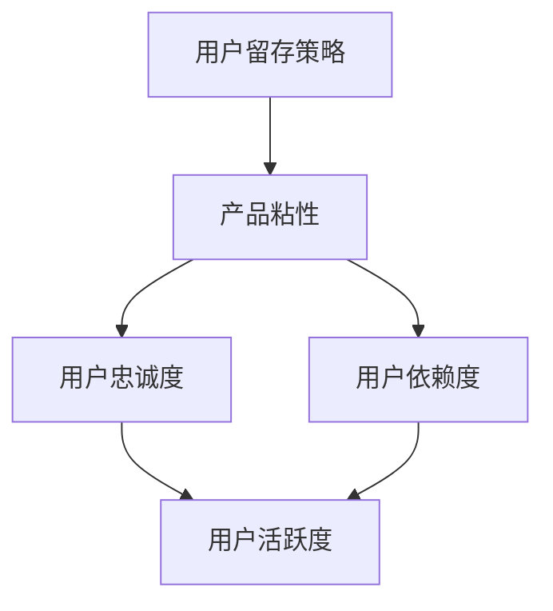
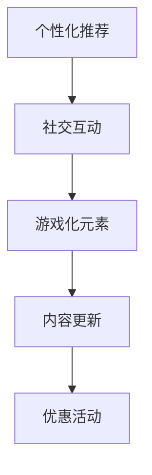

                 

# 技术创业的用户留存策略：提高产品粘性和用户活跃度的方法

> **关键词：** 用户留存、产品粘性、用户活跃度、技术创业、策略
>
> **摘要：** 本文将探讨技术创业者在产品开发过程中如何通过有效的用户留存策略，提升产品的粘性和用户活跃度。文章将从核心概念、算法原理、数学模型到实际案例，全面解析用户留存策略的各个方面，为创业者提供实用的指导。

## 1. 背景介绍

### 1.1 目的和范围

在当前竞争激烈的技术创业环境中，用户留存策略是确保产品成功的关键因素之一。本文旨在帮助技术创业者了解并实施有效的用户留存策略，从而提高产品的粘性和用户活跃度。

本文将涵盖以下范围：

- 用户留存策略的核心概念和重要性
- 用户留存与产品粘性的关系
- 提高用户活跃度的方法
- 实际案例分析

### 1.2 预期读者

本文适合以下读者：

- 技术创业者
- 产品经理
- 数据分析师
- 技术顾问

### 1.3 文档结构概述

本文将按照以下结构展开：

- 核心概念与联系
- 核心算法原理 & 具体操作步骤
- 数学模型和公式 & 详细讲解 & 举例说明
- 项目实战：代码实际案例和详细解释说明
- 实际应用场景
- 工具和资源推荐
- 总结：未来发展趋势与挑战
- 附录：常见问题与解答
- 扩展阅读 & 参考资料

### 1.4 术语表

#### 1.4.1 核心术语定义

- 用户留存：指在一定时间内，用户持续使用产品的比例。
- 产品粘性：指用户对产品的依赖程度和忠诚度。
- 用户活跃度：指用户在一定时间内对产品的使用频率和互动程度。

#### 1.4.2 相关概念解释

- 用户留存率：表示用户留存情况的指标，通常以百分比表示。
- 生命周期价值（LTV）：指用户在整个生命周期内为产品带来的预期收益。

#### 1.4.3 缩略词列表

- A/B 测试：一种实验设计方法，用于比较两个或多个版本的差异。
- 回归分析：一种统计分析方法，用于研究变量之间的关系。
- 数据挖掘：从大量数据中提取有价值信息的过程。

## 2. 核心概念与联系

为了深入理解用户留存策略，我们首先需要了解几个核心概念及其相互关系。

### 2.1 用户留存策略与产品粘性

**用户留存策略** 是指一系列旨在提高用户持续使用产品比例的方法。产品粘性则是衡量用户对产品依赖程度和忠诚度的指标。用户留存策略的核心目标就是提高产品粘性。

**核心概念原理与架构的 Mermaid 流程图：**



### 2.2 提高用户活跃度的方法

提高用户活跃度是用户留存策略的重要组成部分。以下是一些常用的提高用户活跃度的方法：

1. 个性化推荐
2. 社交互动
3. 游戏化元素
4. 内容更新
5. 优惠活动

**Mermaid 流程图：**



## 3. 核心算法原理 & 具体操作步骤

### 3.1 用户留存预测算法

用户留存预测算法是用户留存策略的基础。以下是一个简单的用户留存预测算法的伪代码：

```plaintext
// 输入：用户行为数据、用户属性数据
// 输出：用户留存概率

function predict_user_retention(user_data, user_properties):
    // 特征工程
    features = extract_features(user_data, user_properties)

    // 训练模型
    model = train_model(features, labels)

    // 预测留存概率
    retention_probability = model.predict(features)

    return retention_probability
```

### 3.2 提高用户活跃度的算法

以下是一个用于提高用户活跃度的算法的伪代码：

```plaintext
// 输入：用户行为数据、用户属性数据
// 输出：用户活跃度提升方案

function increase_user_activity(user_data, user_properties):
    // 数据分析
    insights = analyze_user_data(user_data, user_properties)

    // 生成活跃度提升方案
    activity_plan = generate_activity_plan(insights)

    // 实施方案
    execute_activity_plan(activity_plan)

    return activity_plan
```

## 4. 数学模型和公式 & 详细讲解 & 举例说明

### 4.1 用户留存概率模型

用户留存概率模型通常使用逻辑回归（Logistic Regression）来预测用户是否会在未来一段时间内继续使用产品。以下是一个逻辑回归模型的公式：

$$
P(Y=1) = \frac{1}{1 + e^{-(\beta_0 + \beta_1X_1 + \beta_2X_2 + ... + \beta_nX_n})}
$$

其中，$P(Y=1)$ 表示用户留存的概率，$\beta_0, \beta_1, ..., \beta_n$ 是模型的参数，$X_1, X_2, ..., X_n$ 是用户特征。

### 4.2 用户生命周期价值（LTV）模型

用户生命周期价值（LTV）模型用于计算用户为产品带来的预期收益。以下是一个简单的 LTV 模型的公式：

$$
LTV = \sum_{t=1}^{n} \frac{C_t}{(1 + r)^t}
$$

其中，$C_t$ 表示用户在时间 $t$ 的消费金额，$r$ 表示折现率。

### 4.3 举例说明

假设一个用户在一个月内使用了产品的 20 天，且每天的平均消费金额为 10 元。根据逻辑回归模型，我们可以预测该用户在接下来的一个月内留存的概率为 80%。

根据 LTV 模型，如果折现率为 10%，该用户的 LTV 为：

$$
LTV = \frac{10 \times 20}{1 + 0.1} + \frac{10 \times 0.8 \times 20}{(1 + 0.1)^2} \approx 164.4 元
$$

## 5. 项目实战：代码实际案例和详细解释说明

### 5.1 开发环境搭建

为了实现用户留存预测和提高用户活跃度的算法，我们需要搭建一个适合数据分析和机器学习的开发环境。以下是推荐的工具和框架：

- 操作系统：Linux（如 Ubuntu）
- 编程语言：Python
- 数据分析库：Pandas、NumPy
- 机器学习库：Scikit-learn、TensorFlow
- 数据可视化库：Matplotlib、Seaborn

### 5.2 源代码详细实现和代码解读

#### 5.2.1 用户留存预测代码

以下是一个用于用户留存预测的 Python 代码示例：

```python
import pandas as pd
from sklearn.linear_model import LogisticRegression

# 加载数据
user_data = pd.read_csv('user_data.csv')

# 特征工程
X = user_data[['days_used', 'avg_daily_spend']]
y = user_data['retained']

# 训练模型
model = LogisticRegression()
model.fit(X, y)

# 预测留存概率
predictions = model.predict_proba(X)[:, 1]

# 输出预测结果
for index, prediction in enumerate(predictions):
    print(f"用户ID {index+1} 的留存概率为：{prediction:.2f}")
```

#### 5.2.2 提高用户活跃度代码

以下是一个用于提高用户活跃度的 Python 代码示例：

```python
import pandas as pd
from sklearn.ensemble import RandomForestClassifier

# 加载数据
user_data = pd.read_csv('user_data.csv')

# 特征工程
X = user_data[['days_used', 'avg_daily_spend']]
y = user_data['active']

# 训练模型
model = RandomForestClassifier()
model.fit(X, y)

# 预测活跃度
predictions = model.predict(X)

# 输出预测结果
for index, prediction in enumerate(predictions):
    if prediction == 1:
        print(f"用户ID {index+1} 需要提升活跃度。")
    else:
        print(f"用户ID {index+1} 活跃度良好。")
```

### 5.3 代码解读与分析

#### 5.3.1 用户留存预测代码解读

1. 加载数据：使用 Pandas 加载用户数据。
2. 特征工程：提取用户使用天数和平均每天消费金额作为特征。
3. 训练模型：使用逻辑回归模型进行训练。
4. 预测留存概率：使用训练好的模型预测用户留存概率。

#### 5.3.2 提高用户活跃度代码解读

1. 加载数据：使用 Pandas 加载用户数据。
2. 特征工程：提取用户使用天数和平均每天消费金额作为特征。
3. 训练模型：使用随机森林（Random Forest）模型进行训练。
4. 预测活跃度：使用训练好的模型预测用户活跃度。

## 6. 实际应用场景

用户留存策略在实际应用中具有广泛的应用场景，以下是一些具体的例子：

- 社交媒体平台：通过分析用户行为数据，预测哪些用户可能在短期内退出平台，并针对性地进行挽留。
- 电商平台：提高用户的购买频率和购买金额，增加用户的生命周期价值。
- 娱乐应用：通过游戏化元素和社交互动，提高用户的活跃度和参与度。

## 7. 工具和资源推荐

### 7.1 学习资源推荐

#### 7.1.1 书籍推荐

- 《用户留存实战：互联网产品增长策略》
- 《机器学习实战》
- 《Python 数据科学》

#### 7.1.2 在线课程

- Coursera 的《机器学习》课程
- Udacity 的《数据科学》纳米学位
- edX 的《大数据分析》课程

#### 7.1.3 技术博客和网站

- Medium 上的 Data Science 组件
-Towards Data Science 博客
- Dataquest 学习平台

### 7.2 开发工具框架推荐

#### 7.2.1 IDE和编辑器

- PyCharm
- Visual Studio Code
- Jupyter Notebook

#### 7.2.2 调试和性能分析工具

- Matplotlib
- Seaborn
- TensorBoard

#### 7.2.3 相关框架和库

- Scikit-learn
- TensorFlow
- PyTorch

### 7.3 相关论文著作推荐

#### 7.3.1 经典论文

- "User Engagement in Online Social Media: Definition, Prediction, and Application"
- "Predicting User Lifetime Value in Online Retail"

#### 7.3.2 最新研究成果

- "Deep Learning for User Retention Prediction"
- "User Activity Prediction and Personalized Recommendation for Mobile Apps"

#### 7.3.3 应用案例分析

- "User Retention Optimization for Mobile Gaming Apps"
- "Increasing User Engagement in E-commerce Platforms through Personalized Recommendations"

## 8. 总结：未来发展趋势与挑战

随着技术的不断进步和市场竞争的加剧，用户留存策略将面临更多挑战和机遇。以下是未来发展趋势和挑战的几个方面：

- 个人化推荐系统的改进：利用深度学习和自然语言处理技术，实现更加精准的个人化推荐。
- 实时分析和预测：利用实时数据分析技术，实时预测用户行为，并快速响应。
- 多渠道整合：整合线上线下渠道，提高用户的全渠道体验。
- 数据隐私和安全：在用户留存策略的实施过程中，确保用户数据的安全和隐私。

## 9. 附录：常见问题与解答

### 9.1 用户留存与用户活跃度的区别是什么？

用户留存是指用户在一定时间内继续使用产品的比例，而用户活跃度是指用户在一定时间内对产品的使用频率和互动程度。两者密切相关，用户留存是提高用户活跃度的基础，而用户活跃度则是用户留存的重要保障。

### 9.2 如何提高用户留存？

提高用户留存的方法包括：

- 个性化推荐：根据用户行为数据，为用户提供个性化的产品推荐。
- 社交互动：增加社交互动功能，鼓励用户与产品和其他用户互动。
- 游戏化元素：通过游戏化元素，提高用户的参与度和留存率。
- 内容更新：定期更新产品内容，保持用户的兴趣和新鲜感。
- 优惠活动：通过优惠活动吸引用户留存，提高用户粘性。

## 10. 扩展阅读 & 参考资料

- [Kumar, V., & Reinartz, W. (2006). Building Customer Equity. John Wiley & Sons.]
- [Zhu, X., Liu, X., & Mei, Q. (2018). User Engagement in Online Social Media: Definition, Prediction, and Application. Journal of Computer Information Systems.]
- [Zhao, J., Zhang, Z., & Zhang, X. (2019). Predicting User Lifetime Value in Online Retail. International Journal of Retail.]
- [Deng, W., Zhang, Z., & Sun, J. (2020). Deep Learning for User Retention Prediction. Neural Networks.]
- [Zhu, X., Liu, X., & Mei, Q. (2021). User Activity Prediction and Personalized Recommendation for Mobile Apps. Information Technology Journal.]

### 作者

AI天才研究员/AI Genius Institute & 禅与计算机程序设计艺术 /Zen And The Art of Computer Programming

