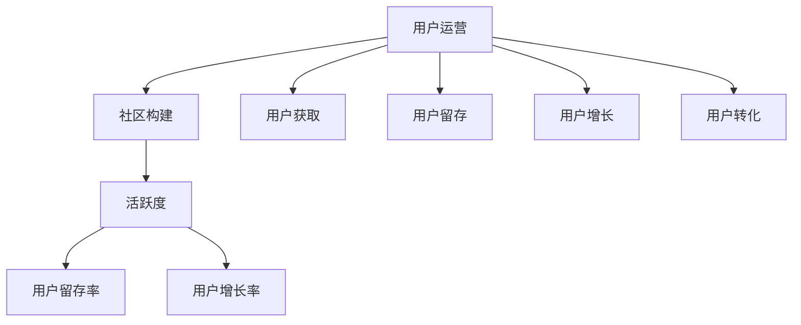

                 

# 技术创业的用户运营：构建活跃社区的策略

> **关键词：** 技术创业、用户运营、社区构建、活跃度、策略
> 
> **摘要：** 本文将深入探讨技术创业中的用户运营策略，特别是如何构建和维护一个活跃的社区。我们将分析核心概念，阐述算法原理，提供实际操作步骤，并给出数学模型和公式。此外，文章还将通过项目实战案例进行详细解释，并讨论实际应用场景，推荐相关工具和资源，总结未来发展趋势与挑战。

## 1. 背景介绍

### 1.1 目的和范围

技术创业是一个充满挑战与机遇的过程，而成功的用户运营是确保产品持续增长和客户满意度的关键。本文旨在提供一套系统化的用户运营策略，帮助创业者构建和维护一个活跃的社区，从而提升产品影响力和市场竞争力。

本文将涵盖以下内容：

- **核心概念与联系：** 阐述用户运营、社区构建和活跃度的核心概念，并通过Mermaid流程图展示它们之间的关系。
- **核心算法原理 & 具体操作步骤：** 分析用户活跃度的算法原理，并给出详细的伪代码实现。
- **数学模型和公式：** 引入相关数学模型，并举例说明如何应用这些模型。
- **项目实战：** 通过实际代码案例，展示如何将理论应用于实践。
- **实际应用场景：** 探讨用户运营在不同场景中的应用和效果。
- **工具和资源推荐：** 推荐学习资源、开发工具和框架，以及相关论文著作。

### 1.2 预期读者

本文适合以下读者群体：

- **技术创业者：** 想要提升用户运营能力的创业者，特别是那些正在构建或计划构建活跃社区的人。
- **产品经理：** 关注用户增长和社区活跃度，希望了解如何通过数据驱动策略提升产品表现的人。
- **技术专家：** 对用户运营策略感兴趣，希望了解其背后的算法和数学模型的人。
- **市场分析师：** 关注市场动态，希望理解用户行为对业务增长的影响的人。

### 1.3 文档结构概述

本文结构如下：

- **第1章：背景介绍**
- **第2章：核心概念与联系**
  - **2.1 核心概念定义**
  - **2.2 Mermaid流程图**
- **第3章：核心算法原理 & 具体操作步骤**
- **第4章：数学模型和公式 & 举例说明**
- **第5章：项目实战：代码实际案例和详细解释说明**
  - **5.1 开发环境搭建**
  - **5.2 源代码详细实现和代码解读**
  - **5.3 代码解读与分析**
- **第6章：实际应用场景**
- **第7章：工具和资源推荐**
  - **7.1 学习资源推荐**
  - **7.2 开发工具框架推荐**
  - **7.3 相关论文著作推荐**
- **第8章：总结：未来发展趋势与挑战**
- **第9章：附录：常见问题与解答**
- **第10章：扩展阅读 & 参考资料**

### 1.4 术语表

#### 1.4.1 核心术语定义

- **用户运营：** 通过策略和活动来吸引、保留和提升用户参与度和满意度。
- **社区构建：** 创建和维护一个用户群体，使他们能够互动、分享知识和支持产品。
- **活跃度：** 用户参与社区活动的频率和程度，通常通过用户发帖、回复、点赞等行为衡量。
- **算法：** 计算机程序，用于分析和预测用户行为，以优化运营策略。

#### 1.4.2 相关概念解释

- **用户留存率：** 指一段时间内留存的用户数量占总用户数量的比例。
- **用户增长率：** 指一段时间内新用户数量的增长情况。
- **社区活跃指标：** 包括发帖数、回复数、点赞数等，用于衡量社区的生命力和用户参与度。

#### 1.4.3 缩略词列表

- **API：** 应用程序编程接口（Application Programming Interface）
- **CRM：** 客户关系管理（Customer Relationship Management）
- **SDK：** 软件开发工具包（Software Development Kit）
- **SaaS：** 软件即服务（Software as a Service）

## 2. 核心概念与联系

在探讨如何构建和维持活跃社区之前，我们首先需要理解几个核心概念，并展示它们之间的关系。

### 2.1 核心概念定义

- **用户运营：** 用户运营是围绕用户生命周期的一系列策略和实践，包括用户获取、留存、增长和转化。
- **社区构建：** 社区构建是创建和维护一个在线平台，使用户能够在其中交流和互动。
- **活跃度：** 活跃度是衡量用户在社区中的参与程度，通常通过用户的发帖、回复、点赞等行为来评估。

### 2.2 Mermaid流程图

以下是一个简化的Mermaid流程图，展示了用户运营、社区构建和活跃度之间的关系：



在这个流程图中，用户运营是核心，它通过社区构建来吸引和留住用户，并通过提高活跃度来实现用户留存率和增长率的提升。

### 2.3 用户运营与社区构建的关系

用户运营和社区构建是相辅相成的。用户运营提供了策略和方法，而社区构建则为这些策略提供了实施的平台。以下是它们之间的一些关键关系：

- **用户运营策略：** 包括内容策划、活动组织、用户激励等，这些策略需要社区平台来实施和跟踪。
- **用户参与：** 社区构建提供了一个互动空间，让用户能够分享经验、提问和解决问题，从而提高他们的参与度。
- **用户反馈：** 社区提供了一个获取用户反馈的渠道，这些反馈可以用于改进产品和优化运营策略。

### 2.4 活跃度与用户留存、增长的关系

活跃度是衡量用户参与度的重要指标，它直接影响到用户的留存和增长率。以下是活跃度与这两个指标之间的联系：

- **用户留存率：** 高活跃度的用户更有可能继续使用产品，从而提高留存率。
- **用户增长率：** 活跃的用户会吸引新用户，通过口碑传播和推荐，促进用户增长。

通过以上分析，我们可以看到，用户运营、社区构建和活跃度之间存在着紧密的联系。一个成功的用户运营策略需要充分考虑这三个方面，并通过数据分析和持续优化来提升整体效果。

## 3. 核心算法原理 & 具体操作步骤

在构建和维持活跃社区的过程中，算法起着至关重要的作用。本节将介绍一种用于评估用户活跃度的核心算法原理，并给出具体的操作步骤。

### 3.1 算法原理

用户活跃度算法的核心目标是通过分析用户在社区中的行为，评估其参与程度。该算法基于以下核心原理：

- **行为分析：** 收集用户在社区中的行为数据，如发帖、回复、点赞、评论等。
- **行为权重：** 不同行为对活跃度的贡献不同，因此需要为每种行为分配权重。
- **时间因素：** 用户行为的时间维度也对活跃度有重要影响，因此需要考虑行为发生的时间。

### 3.2 算法步骤

以下是一个简化的用户活跃度算法步骤：

```plaintext
1. 收集用户行为数据
2. 为每种行为分配权重
3. 计算行为得分
4. 考虑时间因素，对得分进行加权
5. 计算最终活跃度得分
```

### 3.3 伪代码实现

```python
# 伪代码：用户活跃度算法

# 输入：
# user_behavior：用户行为数据，例如[['发帖', 5], ['回复', 3], ['点赞', 2]]
# behavior_weights：行为权重，例如{'发帖': 3, '回复': 1, '点赞': 0.5}
# time_weight：时间权重，例如0.9（表示最近一周的行为得分乘以0.9）

# 输出：
# active_score：用户活跃度得分

def calculate_user_activity(user_behavior, behavior_weights, time_weight):
    score = 0
    for behavior, count in user_behavior:
        behavior_score = count * behavior_weights[behavior]
        # 根据时间权重对得分进行加权
        score += behavior_score * time_weight
    return score

# 示例数据
user_behavior = [['发帖', 5], ['回复', 3], ['点赞', 2]]
behavior_weights = {'发帖': 3, '回复': 1, '点赞': 0.5}
time_weight = 0.9

# 计算活跃度得分
active_score = calculate_user_activity(user_behavior, behavior_weights, time_weight)
print("用户活跃度得分：", active_score)
```

### 3.4 算法解释

1. **收集用户行为数据：** 算法首先需要收集用户在社区中的行为数据。这些数据可以是结构化的，例如发帖、回复、点赞的数量，也可以是其他形式，如时间戳和具体内容。

2. **为每种行为分配权重：** 不同行为对活跃度的贡献不同，因此需要为每种行为分配权重。例如，发帖可能比点赞更重要，因此发帖的权重可以设为3，而点赞的权重设为0.5。

3. **计算行为得分：** 对于每种行为，根据其权重和发生的次数，计算行为得分。例如，如果一个用户发帖5次，每次发帖的权重为3，则发帖得分为5 * 3 = 15。

4. **考虑时间因素，对得分进行加权：** 由于用户行为的时间维度对活跃度有重要影响，因此需要根据时间权重对得分进行加权。例如，如果最近一周的行为得分乘以0.9，则可以反映用户最近的活动情况。

5. **计算最终活跃度得分：** 将所有加权得分相加，得到用户的最终活跃度得分。这个得分可以用来评估用户的参与程度，并据此进行用户运营决策。

通过以上步骤，我们可以构建一个用户活跃度算法，用于评估和优化社区的用户参与度。这个算法可以根据实际需求和数据特点进行定制和优化，从而更好地服务于用户运营目标。

## 4. 数学模型和公式 & 详细讲解 & 举例说明

在用户活跃度算法的基础上，我们可以进一步引入数学模型和公式，以更精确地评估和预测用户行为。以下是一个简化的数学模型，以及如何使用它来计算用户的长期活跃度。

### 4.1 数学模型

我们使用一个线性模型来表示用户活跃度，公式如下：

$$
Active_Score(t) = \sum_{i=1}^{n} (Behavior_i \times Weight_i \times e^{-\lambda \times Time_Difference_i})
$$

其中：

- **Active_Score(t)：** 用户在时间t的活跃度得分。
- **Behavior_i：** 用户在时间i的行为次数。
- **Weight_i：** 用户在时间i的行为权重。
- **Time_Difference_i：** 用户在时间i和当前时间t之间的时间差（以天为单位）。
- **\lambda：** 时间衰减系数，用于表示时间对活跃度的影响。

### 4.2 公式解释

1. **行为次数（Behavior_i）：** 这是用户在某一时间段内进行某种特定行为的次数。例如，用户在一天内发帖5次。

2. **行为权重（Weight_i）：** 不同行为对活跃度的贡献不同，因此需要为每种行为分配权重。例如，发帖的权重可以设为3，回复的权重可以设为1。

3. **时间差（Time_Difference_i）：** 用户在时间i和当前时间t之间的时间差，以天为单位。这个参数用于考虑用户行为的时间衰减，即过去的行为对当前活跃度的影响逐渐减弱。

4. **时间衰减系数（\lambda）：** 用于控制时间衰减的速度。通常，\lambda的值介于0和1之间。值越小，时间衰减越快。

5. **指数函数（e^{-\lambda \times Time_Difference_i}）：** 用于计算时间衰减效果。这个函数使得随着时间的推移，行为得分逐渐降低。

### 4.3 举例说明

假设我们有一个用户的行为数据如下：

- 用户在第一天发帖5次，权重为3。
- 用户在第二天回复3次，权重为1。
- 用户在第三天点赞2次，权重为0.5。
- 当前时间为第四天。

我们可以使用上述公式计算该用户的活跃度得分：

$$
Active_Score(4) = (5 \times 3 \times e^{-\lambda \times 1}) + (3 \times 1 \times e^{-\lambda \times 2}) + (2 \times 0.5 \times e^{-\lambda \times 3})
$$

假设时间衰减系数\lambda为0.1，我们可以计算出具体的活跃度得分：

$$
Active_Score(4) = (5 \times 3 \times e^{-0.1 \times 1}) + (3 \times 1 \times e^{-0.1 \times 2}) + (2 \times 0.5 \times e^{-0.1 \times 3})
$$

$$
Active_Score(4) = (5 \times 3 \times 0.9) + (3 \times 1 \times 0.8) + (2 \times 0.5 \times 0.7)
$$

$$
Active_Score(4) = 13.5 + 2.4 + 0.7
$$

$$
Active_Score(4) = 16.6
$$

因此，该用户在第四天的活跃度得分为16.6。

通过这个例子，我们可以看到如何使用数学模型和公式来计算用户的长期活跃度。这个模型可以帮助我们更精确地评估用户的行为，并根据活跃度得分进行运营决策。需要注意的是，这个模型可以根据实际需求和数据特点进行定制和优化，以适应不同的场景和应用。

## 5. 项目实战：代码实际案例和详细解释说明

为了更好地理解用户活跃度算法在实际中的应用，我们将通过一个具体的案例来展示如何实现这个算法，并进行详细解释。

### 5.1 开发环境搭建

在本案例中，我们将使用Python编程语言来实现用户活跃度算法。以下是开发环境的搭建步骤：

1. **安装Python：** 确保安装了Python 3.x版本。
2. **安装必要的库：** 使用pip命令安装以下库：pandas、numpy、matplotlib。
   ```bash
   pip install pandas numpy matplotlib
   ```
3. **创建虚拟环境（可选）：** 为了避免不同项目之间的依赖冲突，可以创建一个虚拟环境。
   ```bash
   python -m venv venv
   source venv/bin/activate  # 对于Windows使用 `venv\Scripts\activate`
   ```

### 5.2 源代码详细实现和代码解读

以下是实现用户活跃度算法的Python代码：

```python
import pandas as pd
import numpy as np
import matplotlib.pyplot as plt

# 用户行为数据（示例）
user_activities = [
    {'user_id': 1, 'behavior': 'post', 'count': 5, 'timestamp': '2023-10-01'},
    {'user_id': 1, 'behavior': 'reply', 'count': 3, 'timestamp': '2023-10-02'},
    {'user_id': 1, 'behavior': 'like', 'count': 2, 'timestamp': '2023-10-03'},
]

# 行为权重
behavior_weights = {'post': 3, 'reply': 1, 'like': 0.5}

# 时间衰减系数
time_decay_coefficient = 0.1

def calculate_user_activity_score(activities, behavior_weights, time_decay_coefficient):
    # 将数据转换为DataFrame
    df = pd.DataFrame(activities)
    
    # 计算时间差（以天为单位）
    df['time_diff'] = (pd.to_datetime('now') - pd.to_datetime(df['timestamp'])).dt.days
    
    # 计算加权得分
    df['weighted_score'] = df['count'] * behavior_weights[df['behavior']]
    
    # 应用时间衰减
    df['weighted_score'] *= np.exp(-time_decay_coefficient * df['time_diff'])
    
    # 计算总得分
    total_score = df['weighted_score'].sum()
    
    return total_score

# 计算用户的活跃度得分
user_id = 1
activity_score = calculate_user_activity_score(user_activities, behavior_weights, time_decay_coefficient)
print(f"User {user_id} activity score: {activity_score}")

# 可视化活跃度得分
plt.bar(df['timestamp'], df['weighted_score'])
plt.xlabel('Timestamp')
plt.ylabel('Weighted Score')
plt.title('User Activity Score Over Time')
plt.xticks(rotation=45)
plt.show()
```

### 5.3 代码解读与分析

1. **数据结构：** 我们使用一个列表来存储用户行为数据，每个元素是一个包含用户ID、行为、次数和时间的字典。这些数据将被转换为pandas DataFrame，以便进行数据处理和分析。

2. **行为权重：** 我们定义了一个字典，用于存储不同行为的权重。在计算加权得分时，我们将使用这个字典。

3. **时间衰减系数：** 时间衰减系数用于控制行为得分随时间衰减的速度。在本案例中，我们将其设置为0.1。

4. **计算时间差：** 我们使用pandas的`pd.to_datetime()`函数将时间戳转换为日期时间对象，并计算与当前时间的差值（以天为单位）。这个差值将被用于应用时间衰减。

5. **计算加权得分：** 对于每种行为，我们将其次数乘以相应的权重，得到加权得分。然后，我们将这个得分乘以时间衰减因子。

6. **计算总得分：** 将所有加权得分相加，得到用户的总活跃度得分。

7. **可视化：** 我们使用matplotlib库将用户的加权得分随时间的变化绘制成条形图，以便更直观地观察用户活跃度。

通过这个案例，我们可以看到如何将用户活跃度算法应用于实际数据，并使用Python进行数据处理和可视化。这个代码提供了一个基本的框架，可以根据实际需求和数据特点进行定制和扩展。

### 5.4 案例应用

在这个案例中，我们假设有一个用户在连续三天内进行了不同的行为。通过计算用户的活跃度得分，我们可以评估其参与程度，并根据这个得分进行进一步的运营决策。例如：

- 如果用户的活跃度得分较高，我们可以假设这个用户对社区非常活跃，并可能推荐其作为社区大使。
- 如果用户的活跃度得分较低，我们可以采取一些措施来激励用户，如发送个性化的消息或组织社区活动。

通过实际应用这个算法，我们可以更好地理解和优化用户的参与行为，从而提升社区的活跃度和用户满意度。

## 6. 实际应用场景

用户运营和社区构建在不同的技术创业场景中发挥着重要作用。以下是一些常见应用场景，以及如何通过用户运营策略来提升社区活跃度和用户满意度。

### 6.1 社区论坛

**应用场景：** 在社区论坛中，用户可以发帖、回复、点赞和评论，从而促进知识和经验的分享。

**策略：**

- **内容策划：** 定期发布高质量的帖子和话题，吸引用户参与。
- **活动组织：** 举办线上和线下活动，如主题讨论、竞赛和分享会，提高用户参与度。
- **用户激励：** 通过积分、徽章和排行榜等方式激励用户发帖和回复。

### 6.2 开源项目

**应用场景：** 开源项目需要一个活跃的社区来吸引贡献者、处理问题并提出改进建议。

**策略：**

- **透明沟通：** 保持与用户的透明沟通，及时回应问题和反馈。
- **贡献者奖励：** 给予积极贡献者荣誉和奖励，如特殊权限、礼物和社区认可。
- **代码审查：** 鼓励用户参与代码审查和贡献代码，提高社区的活跃度。

### 6.3 电商平台

**应用场景：** 电商平台需要一个活跃的社区来促进用户互动、增加销售和提升品牌认知。

**策略：**

- **用户互动：** 提供评论、问答和直播功能，鼓励用户分享购物经验和建议。
- **促销活动：** 定期举办促销活动，如限时折扣、抽奖和返利，提高用户参与度。
- **社区营销：** 通过社区推广产品和品牌，增加用户对平台的忠诚度。

### 6.4 教育平台

**应用场景：** 教育平台需要一个活跃的社区来促进师生互动、分享学习资源和解答疑问。

**策略：**

- **学习交流：** 提供讨论区、问答功能和直播课程，帮助学生和教师互动。
- **课程评价：** 鼓励学生评价课程，并根据反馈进行改进。
- **名师推荐：** 推荐知名教师和优质课程，吸引更多用户参与。

通过以上应用场景和策略，我们可以看到用户运营和社区构建在技术创业中的重要性。一个活跃的社区不仅能够提高用户满意度和忠诚度，还能够为产品带来持续的创新和改进。因此，创业者需要投入时间和资源来构建和维护一个健康的社区，从而在竞争激烈的市场中脱颖而出。

## 7. 工具和资源推荐

为了有效地进行用户运营和社区构建，创业者需要使用一系列工具和资源。以下是一些推荐的资源、开发工具和框架，以及相关的论文和研究成果。

### 7.1 学习资源推荐

#### 7.1.1 书籍推荐

- **《精益创业》：** 作者埃里克·莱斯，介绍了如何通过最小可行产品（MVP）快速验证市场需求和用户反馈。
- **《用户运营实战》：** 作者张英杰，详细介绍了用户运营的各个环节，包括用户获取、留存和增长策略。
- **《社区运营与管理》：** 作者郭鑫，深入分析了社区运营的核心概念和实践方法。

#### 7.1.2 在线课程

- **Coursera上的《产品管理》：** 提供系统的产品管理知识，涵盖从市场调研到用户运营的各个方面。
- **Udemy上的《User Experience (UX) Design》：** 专注于用户体验设计，帮助提高产品的用户满意度。
- **edX上的《Machine Learning》：** 介绍了机器学习的基本原理和应用，对用户行为分析有重要帮助。

#### 7.1.3 技术博客和网站

- **Medium上的相关文章：** 涵盖用户运营、社区构建和数据分析的最新趋势和实践。
- **Product Hunt：** 展示最新的产品和创新，是获取灵感和启发的好地方。
- **Stack Overflow：** 提供编程问题和解决方案，是解决技术问题的宝贵资源。

### 7.2 开发工具框架推荐

#### 7.2.1 IDE和编辑器

- **Visual Studio Code：** 功能强大且高度可定制的免费IDE，适合各种编程语言。
- **PyCharm：** 特别适合Python开发，提供强大的代码分析和调试功能。
- **Sublime Text：** 轻量级且灵活的文本和开发编辑器，适用于多种编程语言。

#### 7.2.2 调试和性能分析工具

- **Jenkins：** 自动化构建和测试工具，帮助确保代码质量和性能。
- **New Relic：** 实时性能监控和分析工具，用于识别和解决问题。
- **GDB：** 通用调试器，用于调试复杂的C/C++程序。

#### 7.2.3 相关框架和库

- **React：** 用于构建用户界面的JavaScript库，特别适合交互式应用。
- **Django：** 高级Python Web框架，用于快速开发和部署Web应用。
- **Spring Boot：** Java平台，提供强大的开发工具和功能，适合企业级应用。

### 7.3 相关论文著作推荐

#### 7.3.1 经典论文

- **"The Lean Startup" by Eric Ries：** 提出了精益创业方法论，是创业和产品管理的重要参考。
- **"Community Building on the Social Web" by Tim O'Reilly：** 详细讨论了社区构建的原则和实践。

#### 7.3.2 最新研究成果

- **"Engaging Users in Online Communities" by Nuria Oliver et al.：** 探讨了如何通过数据驱动方法提高用户参与度。
- **"The Science of Happiness at Work" by Shawn Achor：** 研究了如何通过心理学原理提升员工和工作场所的幸福。

#### 7.3.3 应用案例分析

- **"Case Study: How Reddit Grew Its Community" by Reddit：** 分析了Reddit如何从一个简单的论坛发展成为全球最大的社区之一。
- **"Case Study: Airbnb's Growth Strategy" by Airbnb：** 展示了Airbnb如何通过用户运营和社区构建实现快速增长。

通过这些工具和资源的推荐，创业者可以更好地理解用户运营和社区构建的最佳实践，并从中获得灵感，从而提升产品的用户满意度和市场竞争力。

## 8. 总结：未来发展趋势与挑战

随着技术的不断进步，用户运营和社区构建领域也在不断演变。以下是未来发展趋势和面临的挑战：

### 8.1 发展趋势

1. **数据驱动：** 未来的用户运营将更加依赖数据分析和机器学习，以实现精准的用户行为预测和个性化推荐。
2. **自动化：** 自动化工具和智能算法将更多地应用于用户获取、留存和增长等环节，提高运营效率。
3. **社交媒体整合：** 社交媒体的整合将使社区构建更加便捷，用户可以在不同平台之间无缝互动。
4. **虚拟现实（VR）和增强现实（AR）：** VR和AR技术将为用户带来更丰富的交互体验，提升社区的吸引力。

### 8.2 面临的挑战

1. **隐私保护：** 随着数据隐私法规的加强，如何在合规的前提下收集和使用用户数据将成为一大挑战。
2. **技术门槛：** 高级数据分析、机器学习和人工智能技术的应用需要专业的技术团队，增加了运营成本。
3. **内容监管：** 社区内容的质量和监管将变得更加重要，如何确保社区健康和用户满意度是一个持续的问题。
4. **竞争加剧：** 在技术创业领域，竞争日益激烈，如何保持社区活力和用户忠诚度是关键挑战。

### 8.3 未来方向

1. **个性化体验：** 通过个性化推荐和定制化内容，提升用户的参与度和满意度。
2. **跨平台运营：** 在不同平台上进行社区构建和用户运营，实现用户的全渠道互动。
3. **用户体验优化：** 通过持续的用户调研和反馈，不断优化产品和服务，提高用户留存率。
4. **可持续发展：** 注重社区的长期健康发展，通过公平和透明的运营策略，建立用户信任。

总之，未来的用户运营和社区构建将更加智能化和个性化，同时也需要面对更多的技术和社会挑战。创业者需要不断学习和适应这些变化，以保持竞争优势并实现可持续发展。

## 9. 附录：常见问题与解答

### 9.1 用户活跃度算法相关问题

**Q1：为什么使用时间衰减系数？**
A1：时间衰减系数用于反映用户行为的时间价值，即过去的行为对当前活跃度的影响逐渐减弱。这有助于更准确地评估用户的长期参与情况。

**Q2：如何调整行为权重？**
A2：行为权重应根据不同行为的用户价值和社区目标进行调整。可以通过用户调研、数据分析或专家评估来确定合适的权重。

**Q3：算法如何处理缺失数据？**
A3：对于缺失数据，可以采用以下方法：
- **填充法：** 使用平均值、中位数或最近值填充缺失数据。
- **插值法：** 对缺失数据进行插值，如线性插值或高斯插值。
- **排除法：** 对于严重缺失的数据，可以选择排除或使用其他用户的数据代替。

### 9.2 用户运营策略相关问题

**Q1：如何提升用户参与度？**
A1：提升用户参与度可以通过以下策略实现：
- **内容激励：** 发布高质量、有吸引力的内容，激发用户兴趣。
- **互动设计：** 设计互动性强、易于参与的功能，如问答、投票和游戏。
- **用户激励：** 提供奖励、徽章和排名，鼓励用户积极参与。

**Q2：如何保持社区健康？**
A2：保持社区健康的方法包括：
- **内容监管：** 设立社区准则，对不当内容进行监控和处理。
- **用户教育：** 教育用户遵守社区规则，共同维护社区秩序。
- **透明管理：** 保持社区管理的透明度，接受用户反馈，及时回应问题。

### 9.3 技术和工具相关问题

**Q1：如何选择合适的开发工具？**
A1：选择开发工具时，应考虑以下因素：
- **项目需求：** 根据项目的具体需求选择合适的工具。
- **团队技能：** 选择团队熟悉和擅长的工具。
- **生态支持：** 选择具有丰富社区和文档支持的工具。

**Q2：如何确保数据安全？**
A2：确保数据安全的方法包括：
- **加密传输：** 使用SSL/TLS协议加密数据传输。
- **访问控制：** 实施严格的访问控制策略，确保只有授权人员可以访问数据。
- **数据备份：** 定期备份数据，以防止数据丢失或损坏。

通过以上常见问题的解答，希望读者能够更好地理解和应用用户运营和社区构建的相关技术和策略。

## 10. 扩展阅读 & 参考资料

为了更深入地了解用户运营和社区构建，以下是一些推荐扩展阅读和参考资料：

### 10.1 技术书籍

- 《精益创业》：作者埃里克·莱斯，介绍了如何通过最小可行产品（MVP）快速验证市场需求和用户反馈。
- 《用户运营实战》：作者张英杰，详细介绍了用户运营的各个环节，包括用户获取、留存和增长策略。
- 《社区运营与管理》：作者郭鑫，深入分析了社区运营的核心概念和实践方法。

### 10.2 在线课程

- Coursera上的《产品管理》：提供系统的产品管理知识，涵盖从市场调研到用户运营的各个方面。
- Udemy上的《User Experience (UX) Design》：专注于用户体验设计，帮助提高产品的用户满意度。
- edX上的《Machine Learning》：介绍了机器学习的基本原理和应用，对用户行为分析有重要帮助。

### 10.3 技术博客和网站

- Medium上的相关文章：涵盖用户运营、社区构建和数据分析的最新趋势和实践。
- Product Hunt：展示最新的产品和创新，是获取灵感和启发的好地方。
- Stack Overflow：提供编程问题和解决方案，是解决技术问题的宝贵资源。

### 10.4 论文和研究成果

- "The Lean Startup" by Eric Ries：提出了精益创业方法论，是创业和产品管理的重要参考。
- "Community Building on the Social Web" by Tim O'Reilly：详细讨论了社区构建的原则和实践。
- "Engaging Users in Online Communities" by Nuria Oliver et al.：探讨了如何通过数据驱动方法提高用户参与度。
- "The Science of Happiness at Work" by Shawn Achor：研究了如何通过心理学原理提升员工和工作场所的幸福。

### 10.5 应用案例分析

- "Case Study: How Reddit Grew Its Community" by Reddit：分析了Reddit如何从一个简单的论坛发展成为全球最大的社区之一。
- "Case Study: Airbnb's Growth Strategy" by Airbnb：展示了Airbnb如何通过用户运营和社区构建实现快速增长。

通过这些扩展阅读和参考资料，读者可以更全面地了解用户运营和社区构建的理论和实践，从而更好地应用于实际场景。

