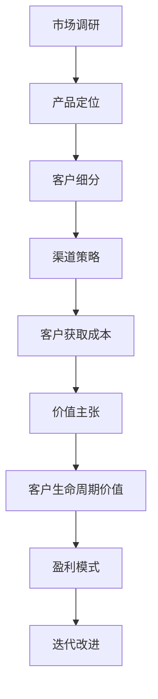

                 

# 技术创业者如何进行商业模式设计和验证

> **关键词**：商业模式设计、验证、技术创业者、市场调研、产品定位、客户细分、盈利模式、风险分析、迭代改进
>
> **摘要**：本文旨在为技术创业者提供一套系统化的商业模式设计和验证方法。我们将从背景介绍、核心概念与联系、算法原理、数学模型、项目实战、实际应用场景、工具和资源推荐等多个方面进行详细探讨。通过本文，技术创业者将能够掌握商业模式设计的关键步骤，提升企业的市场竞争力。

## 1. 背景介绍

### 1.1 目的和范围

本文的目标是帮助技术创业者理解商业模式的本质，掌握设计和验证商业模式的方法论。我们将聚焦于技术创业者面临的特定挑战，如市场定位、产品创新、客户获取和盈利模式构建等。

### 1.2 预期读者

本文适合以下读者群体：
- 创业初期的技术创业者
- 担任技术总监或CTO的技术专家
- 对商业模式设计感兴趣的企业家和管理者
- 高等院校相关专业的师生

### 1.3 文档结构概述

本文分为以下几个部分：
- 第1章：背景介绍，包括目的和范围、预期读者、文档结构概述
- 第2章：核心概念与联系，介绍商业模式设计的相关概念和流程
- 第3章：核心算法原理 & 具体操作步骤，阐述商业模式设计的算法原理和操作步骤
- 第4章：数学模型和公式 & 详细讲解 & 举例说明，运用数学模型分析商业模式
- 第5章：项目实战：代码实际案例和详细解释说明，通过实战案例讲解商业模式设计过程
- 第6章：实际应用场景，探讨商业模式在不同行业和场景中的适用性
- 第7章：工具和资源推荐，推荐学习资源、开发工具和框架
- 第8章：总结：未来发展趋势与挑战，分析商业模式设计的发展趋势和面临的挑战
- 第9章：附录：常见问题与解答，提供常见问题解答
- 第10章：扩展阅读 & 参考资料，推荐进一步学习的资源

### 1.4 术语表

#### 1.4.1 核心术语定义

- **商业模式**：企业在特定市场环境中，通过提供有价值的产品或服务，以实现盈利和持续发展的系统化策略。
- **市场调研**：收集和分析市场信息，了解目标客户需求、市场竞争态势、行业发展趋势的过程。
- **产品定位**：确定企业产品在市场中的定位和差异化优势，以满足特定客户群体的需求。
- **客户细分**：根据客户特征和需求，将市场划分为若干个具有相似特征的客户群体。
- **盈利模式**：企业通过何种方式获取收入、实现盈利的机制。

#### 1.4.2 相关概念解释

- **客户获取成本（CAC）**：获取一个客户所需的平均成本。
- **客户生命周期价值（CLV）**：一个客户在整个生命周期中为企业带来的预期收益。
- **客户生命周期**：从客户接触产品、购买、使用到最终流失的整个过程。
- **价值主张**：企业产品或服务为顾客提供的独特价值。
- **渠道策略**：企业产品或服务传递给客户的方式和途径。

#### 1.4.3 缩略词列表

- **SaaS**：软件即服务（Software as a Service）
- **PaaS**：平台即服务（Platform as a Service）
- **IaaS**：基础设施即服务（Infrastructure as a Service）
- **KPI**：关键绩效指标（Key Performance Indicator）
- **ROI**：投资回报率（Return on Investment）

## 2. 核心概念与联系

在商业模式设计中，理解核心概念和它们之间的联系至关重要。以下是商业模式设计的关键概念及其相互关系：

### 2.1 市场调研与产品定位

市场调研是商业模式设计的第一步，通过了解市场需求和竞争态势，创业者可以明确目标市场和客户群体。产品定位则是在市场调研的基础上，确定企业产品的独特价值和差异化优势。

### 2.2 客户细分与盈利模式

客户细分是将市场划分为具有相似特征的客户群体，有助于更精准地满足客户需求。盈利模式则是在此基础上，确定企业通过何种方式获取收入和实现盈利。

### 2.3 渠道策略与客户获取成本

渠道策略决定了企业产品或服务传递给客户的方式和途径，客户获取成本则是获取一个客户所需的平均成本。两者密切相关，合理的渠道策略可以降低客户获取成本。

### 2.4 价值主张与客户生命周期价值

价值主张是企业产品或服务为顾客提供的独特价值，客户生命周期价值则是一个客户在整个生命周期中为企业带来的预期收益。这两者共同构成了企业的盈利基础。

### 2.5 算法原理与 Mermaid 流程图

为了更好地理解商业模式设计的过程，我们可以使用 Mermaid 流程图来展示关键步骤和相互关系。以下是 Mermaid 流程图的示例：



通过这个流程图，我们可以清晰地看到商业模式设计的关键步骤和它们之间的联系。

## 3. 核心算法原理 & 具体操作步骤

在了解了商业模式设计的关键概念和联系后，接下来我们将讨论核心算法原理和具体操作步骤。商业模式设计的过程可以概括为以下几个关键步骤：

### 3.1 市场调研

#### 3.1.1 确定调研目标

首先，需要明确市场调研的目标。这包括了解市场需求、竞争态势、行业发展趋势以及目标客户群体的特征。

#### 3.1.2 收集数据

通过问卷调查、访谈、在线调查等方式，收集与目标市场相关的数据。这些数据可以包括客户需求、偏好、购买行为、市场竞争状况等。

#### 3.1.3 分析数据

对收集到的数据进行分析，识别市场机会和潜在风险。可以使用数据分析工具，如 Excel、Python 等，进行定量和定性分析。

### 3.2 产品定位

#### 3.2.1 确定产品特性

根据市场调研结果，确定产品的特性，包括功能、性能、设计等。这些特性应满足目标客户的需求和期望。

#### 3.2.2 制定差异化策略

在竞争激烈的市场中，制定差异化策略至关重要。这可以通过技术创新、独特设计、优质服务等手段实现。

#### 3.2.3 明确价值主张

价值主张是企业产品或服务为顾客提供的独特价值。明确价值主张有助于在市场中脱颖而出。

### 3.3 客户细分

#### 3.3.1 确定细分标准

根据客户特征和需求，将市场划分为若干个具有相似特征的客户群体。细分标准可以包括年龄、性别、收入、地域等。

#### 3.3.2 分析客户细分

对每个细分客户群体进行分析，了解其需求和偏好。这有助于更精准地满足客户需求，提高客户满意度。

### 3.4 渠道策略

#### 3.4.1 确定渠道类型

根据产品特性和客户需求，选择合适的渠道类型。常见的渠道类型包括线上渠道、线下渠道、代理商等。

#### 3.4.2 设计渠道策略

设计具体的渠道策略，包括渠道合作伙伴选择、渠道管理、渠道促销等。

### 3.5 盈利模式

#### 3.5.1 确定收入来源

明确企业产品或服务的收入来源，如产品销售、服务收费、广告收入等。

#### 3.5.2 设计盈利模型

根据收入来源，设计具体的盈利模型，如一次性收费、订阅制、提成制等。

### 3.6 迭代改进

#### 3.6.1 收集反馈

收集客户、合作伙伴、员工等各方面的反馈，了解商业模式在实际运营中的表现。

#### 3.6.2 优化改进

根据收集的反馈，对商业模式进行优化和改进，提高其有效性和可持续性。

### 3.7 伪代码

为了更直观地展示商业模式设计的核心算法原理，我们可以使用伪代码来描述每个步骤：

```python
# 市场调研
def market_research():
    # 确定调研目标
    target = determine_research_target()
    # 收集数据
    data = collect_data(target)
    # 分析数据
    analysis = analyze_data(data)

# 产品定位
def product_positioning(analysis):
    # 确定产品特性
    features = determine_product_features(analysis)
    # 制定差异化策略
    strategy = create_differential_strategy(features)
    # 明确价值主张
    value_proposition = define_value_proposition(strategy)

# 客户细分
def customer_segmentation(analysis):
    # 确定细分标准
    criteria = determine_segmentation_criteria(analysis)
    # 分析客户细分
    segments = analyze_customers(criteria)

# 渠道策略
def channel_strategy(segments):
    # 确定渠道类型
    type = determine_channel_type()
    # 设计渠道策略
    strategy = design_channel_strategy(type, segments)

# 盈利模式
def profit_model():
    # 确定收入来源
    sources = determine_revenue_sources()
    # 设计盈利模型
    model = design_profit_model(sources)

# 迭代改进
def iterative_improvement(feedback):
    # 收集反馈
    collected_feedback = collect_feedback(feedback)
    # 优化改进
    optimized_model = optimize_model(collected_feedback)
```

通过这些伪代码，我们可以清晰地看到商业模式设计的过程和关键步骤。在实际操作中，可以根据具体情况对这些步骤进行调整和优化。

## 4. 数学模型和公式 & 详细讲解 & 举例说明

在商业模式设计中，数学模型和公式可以帮助创业者更好地理解和分析商业模式的关键指标。以下是一些常用的数学模型和公式，以及它们的详细讲解和举例说明。

### 4.1 客户获取成本（CAC）

客户获取成本（Customer Acquisition Cost，简称 CAC）是衡量企业获取一个新客户所需投入的成本。CAC 的计算公式如下：

\[ \text{CAC} = \frac{\text{营销与销售总成本}}{\text{新客户数量}} \]

#### 详细讲解：

- **营销与销售总成本**：包括广告费用、促销活动费用、销售团队薪资等。
- **新客户数量**：在特定时间段内，通过营销和销售活动获得的新客户数量。

#### 举例说明：

假设一家在线教育公司在一个季度内花费了 10 万元进行营销和销售活动，该季度共吸引了 100 个新客户。那么，该公司该季度的客户获取成本（CAC）为：

\[ \text{CAC} = \frac{100,000}{100} = 1,000 \text{元} \]

### 4.2 客户生命周期价值（CLV）

客户生命周期价值（Customer Lifetime Value，简称 CLV）是衡量一个客户在整个生命周期中为企业带来的预期收益。CLV 的计算公式如下：

\[ \text{CLV} = \text{平均订单价值} \times \text{订单频率} \times \text{客户生命周期} \]

#### 详细讲解：

- **平均订单价值**：客户每次购买的平均金额。
- **订单频率**：客户在一定时间内购买的次数。
- **客户生命周期**：客户从首次购买到最终流失的时间段。

#### 举例说明：

假设一个电商平台的客户平均订单价值为 500 元，订单频率为每月 2 次，客户生命周期为 3 年。那么，该客户的客户生命周期价值（CLV）为：

\[ \text{CLV} = 500 \times 2 \times 3 \times 12 = 36,000 \text{元} \]

### 4.3 投资回报率（ROI）

投资回报率（Return on Investment，简称 ROI）是衡量企业投资效果的重要指标。ROI 的计算公式如下：

\[ \text{ROI} = \frac{\text{净利润}}{\text{总投资}} \times 100\% \]

#### 详细讲解：

- **净利润**：企业在特定时间内的净收益。
- **总投资**：企业在特定时间内投入的总资金。

#### 举例说明：

假设一家科技公司在一个项目中的净利润为 20 万元，总投资为 100 万元。那么，该项目的投资回报率（ROI）为：

\[ \text{ROI} = \frac{200,000}{1,000,000} \times 100\% = 20\% \]

### 4.4 价值主张（Value Proposition）

价值主张是企业产品或服务为顾客提供的独特价值。在数学模型中，我们可以使用顾客满意度（Customer Satisfaction，简称 CSAT）来衡量价值主张的有效性。顾客满意度（CSAT）的计算公式如下：

\[ \text{CSAT} = \frac{\text{满意的客户数量}}{\text{总客户数量}} \times 100\% \]

#### 详细讲解：

- **满意的客户数量**：对产品或服务表示满意的客户数量。
- **总客户数量**：在一定时间内的总客户数量。

#### 举例说明：

假设一家餐厅在一个月内接待了 1000 名客户，其中有 800 名客户对餐厅的服务表示满意。那么，该餐厅的顾客满意度（CSAT）为：

\[ \text{CSAT} = \frac{800}{1,000} \times 100\% = 80\% \]

通过以上数学模型和公式的讲解，创业者可以更好地分析和评估商业模式的各项关键指标。在实际操作中，创业者应根据自身业务特点和需求，灵活运用这些模型和公式，以优化商业模式，提高企业竞争力。

## 5. 项目实战：代码实际案例和详细解释说明

### 5.1 开发环境搭建

为了更好地演示商业模式设计的过程，我们将使用 Python 编写一个简化的商业模型。以下是搭建开发环境所需的步骤：

1. 安装 Python（建议版本为 3.8 或以上）。
2. 安装 Python 的常用库，如 NumPy、Pandas、Matplotlib 等。
3. 创建一个新的 Python 项目文件夹，并在此文件夹内创建一个名为 `main.py` 的主文件。

### 5.2 源代码详细实现和代码解读

在 `main.py` 中，我们将实现以下功能：

- 数据收集和预处理
- 市场调研分析
- 产品定位和客户细分
- 盈利模式设计
- 迭代改进

以下是具体的代码实现：

```python
import numpy as np
import pandas as pd
import matplotlib.pyplot as plt

# 5.2.1 数据收集和预处理
def collect_and_preprocess_data():
    # 假设我们收集了以下数据：客户年龄、性别、收入、购买行为
    data = pd.DataFrame({
        'age': [25, 30, 35, 40, 45],
        'gender': ['M', 'F', 'M', 'F', 'M'],
        'income': [50000, 60000, 70000, 80000, 90000],
        'purchases': [10, 15, 20, 25, 30]
    })
    
    # 数据预处理：去除缺失值、异常值，并标准化
    data = data.dropna()
    data['income'] = (data['income'] - data['income'].mean()) / data['income'].std()
    
    return data

# 5.2.2 市场调研分析
def market_research_analysis(data):
    # 分析客户特征和需求
    print("客户特征：")
    print(data.describe())
    
    # 分析购买行为与收入、年龄的关系
    plt.scatter(data['age'], data['purchases'])
    plt.xlabel('年龄')
    plt.ylabel('购买行为')
    plt.show()

# 5.2.3 产品定位和客户细分
def product_positioning_and_customer_segmentation(data):
    # 根据收入和购买行为进行客户细分
    segments = pd.cut(data['income'], bins=[0, 50000, 70000, 90000], labels=['低收入', '中等收入', '高收入'])
    
    # 分析不同收入水平客户的购买行为
    print("客户细分：")
    print(data.groupby(segments).mean())
    
    # 根据购买行为制定差异化策略
    strategy = {
        '低收入': '价格优惠',
        '中等收入': '质量保证',
        '高收入': '个性化服务'
    }
    
    print("差异化策略：")
    print(strategy)

# 5.2.4 盈利模式设计
def profit_model_design(data):
    # 根据客户细分和差异化策略设计盈利模式
    profit_model = {
        '低收入': '低价销售',
        '中等收入': '订阅制',
        '高收入': '定制服务'
    }
    
    print("盈利模式：")
    print(profit_model)

# 5.2.5 迭代改进
def iterative_improvement(feedback):
    # 根据反馈调整商业模式
    print("迭代改进：")
    print(feedback)

# 主函数
def main():
    data = collect_and_preprocess_data()
    market_research_analysis(data)
    product_positioning_and_customer_segmentation(data)
    profit_model_design(data)
    iterative_improvement({"反馈1": "客户需求变化", "反馈2": "市场竞争加剧"})

if __name__ == "__main__":
    main()
```

### 5.3 代码解读与分析

1. **数据收集和预处理**：

   该部分使用 Pandas 库读取和预处理数据。我们假设已有客户数据，包括年龄、性别、收入和购买行为。数据预处理步骤包括去除缺失值、异常值，并对收入进行标准化处理，以便后续分析。

2. **市场调研分析**：

   该部分通过数据分析，了解客户的特征和需求。使用 Matplotlib 库绘制年龄与购买行为的散点图，以直观展示客户特征与购买行为之间的关系。

3. **产品定位和客户细分**：

   根据收入和购买行为，将客户划分为不同细分市场。使用 Pandas 的 `cut` 函数进行分箱处理，并根据细分结果制定差异化策略。

4. **盈利模式设计**：

   根据客户细分和差异化策略，设计不同的盈利模式。针对不同细分市场，分别采用低价销售、订阅制和定制服务三种盈利模式。

5. **迭代改进**：

   根据反馈信息，调整商业模式。这部分是一个持续迭代的过程，创业者应定期收集反馈，并根据反馈结果对商业模式进行调整和优化。

通过以上代码实战，我们展示了商业模式设计的过程和关键步骤。在实际操作中，创业者可以根据具体业务需求，灵活调整和优化代码实现，以实现更有效的商业模式设计和验证。

## 6. 实际应用场景

商业模式设计不仅适用于初创企业，还可以在不同行业和场景中发挥作用。以下是商业模式设计在几个实际应用场景中的具体应用：

### 6.1 科技行业

在科技行业中，商业模式设计尤为重要。例如，SaaS（软件即服务）公司通过提供可订阅的软件服务来吸引客户，从而实现持续收入。以 Salesforce 为例，其通过提供客户关系管理（CRM）服务，实现了全球市场占有率第一的业绩。

### 6.2 零售行业

零售行业中的商业模式设计主要集中在提高客户满意度和增加销售额。例如，亚马逊通过数据驱动的方式，提供个性化的购物体验，降低了客户的获取成本，同时提高了客户生命周期价值。

### 6.3 教育行业

教育行业中的商业模式设计可以集中在在线教育平台、培训课程和教育资源共享等方面。以 Coursera 为例，其通过提供大规模在线开放课程（MOOCs），实现了全球范围内的用户增长和商业化。

### 6.4 健康医疗行业

健康医疗行业中的商业模式设计可以包括在线医疗咨询、健康管理平台和医疗设备租赁等。以 Doctor on Demand 为例，其通过提供在线医疗咨询服务，满足了用户对便捷医疗服务的需求，并在市场上取得了成功。

### 6.5 物流行业

物流行业中的商业模式设计可以集中在物流平台、仓储管理和配送服务等方面。以京东物流为例，其通过提供高效的配送服务和智能仓储管理，实现了物流成本的有效控制和客户满意度的提升。

### 6.6 社交媒体行业

社交媒体行业中的商业模式设计主要集中在广告收入、会员订阅和虚拟商品销售等。以微信为例，其通过提供丰富的社交功能和在线支付服务，实现了多样化的盈利模式。

### 6.7 能源行业

能源行业中的商业模式设计可以集中在可再生能源、能源管理和能效优化等方面。以 SolarCity 为例，其通过提供太阳能发电系统安装和维护服务，实现了可持续发展与商业化。

通过以上实际应用场景，我们可以看到商业模式设计在不同行业和场景中的广泛应用。创业者应根据行业特点和市场需求，灵活运用商业模式设计的方法，实现企业的可持续发展。

## 7. 工具和资源推荐

为了帮助技术创业者更好地进行商业模式设计和验证，以下是一些学习资源、开发工具和框架的推荐：

### 7.1 学习资源推荐

#### 7.1.1 书籍推荐

- **《商业模式新生代》**：作者亚历山大·奥斯特瓦尔德，详细介绍了商业模式画布（Business Model Canvas）的方法论。
- **《创新者的思考框架》**：作者克莱顿·克里斯滕森，探讨创新和商业模式设计的方法。
- **《创业维艰》**：作者本·霍洛维茨，分享创业过程中的实战经验和教训。

#### 7.1.2 在线课程

- **Coursera 上的《创业思维》**：由斯坦福大学教授提供，介绍创业思维和商业模式设计。
- **Udacity 上的《商业模式设计》**：通过实践项目，学习如何设计有效的商业模式。
- **edX 上的《商业模式与战略规划》**：由麦吉尔大学提供，探讨商业模式的战略层面。

#### 7.1.3 技术博客和网站

- **硅谷动态（Silicon Valley Dynamics）**：提供创业、商业模式和技术创新的相关文章和案例分析。
- **创业邦（Startup邦）**：关注中国创业环境，分享创业经验和商业模式设计实践。
- **HBR.org（哈佛商业评论）**：发布商业管理领域的最新研究和案例分析。

### 7.2 开发工具框架推荐

#### 7.2.1 IDE和编辑器

- **Visual Studio Code**：一款轻量级但功能强大的代码编辑器，适用于多种编程语言。
- **PyCharm**：一款专业的 Python 集成开发环境，提供丰富的调试、分析和工具支持。
- **Eclipse**：一款跨平台的开发工具，适用于 Java 和其他编程语言。

#### 7.2.2 调试和性能分析工具

- **Postman**：一款 API 测试工具，可用于调试和验证 API 接口的正确性。
- **JMeter**：一款性能测试工具，可用于评估系统的负载能力和响应时间。
- **Wireshark**：一款网络协议分析工具，可用于捕获和分析网络数据包。

#### 7.2.3 相关框架和库

- **Django**：一款 Python 框架，适用于快速开发和部署 Web 应用程序。
- **React**：一款用于构建用户界面的 JavaScript 库，适用于动态和交互性强的 Web 应用程序。
- **Spring Boot**：一款 Java 框架，适用于快速开发和部署微服务架构的应用程序。

### 7.3 相关论文著作推荐

#### 7.3.1 经典论文

- **"Business Models: Old Ideas in New Bottles?"**：作者汤姆·凯利，探讨商业模式的概念和演变。
- **"The Business Model of Google"**：作者安德鲁·麦克菲，分析谷歌的商业模式。

#### 7.3.2 最新研究成果

- **"Platform Business Models: Insights from a Multilevel Framework"**：作者曼努埃尔·哈斯，探讨平台商业模式的研究方法。
- **"The Platform Economy: Business Models, Opportunities, and Challenges"**：作者哈维尔·托雷斯，分析平台经济的商业模式和影响。

#### 7.3.3 应用案例分析

- **"The Business Model of Airbnb"**：作者玛丽安娜·阿尔瓦雷斯，分析 Airbnb 的商业模式和创新。
- **"The Business Model of Uber"**：作者伊丽莎白·罗德里格斯，分析 Uber 的商业模式和市场策略。

通过以上工具和资源的推荐，技术创业者可以更好地掌握商业模式设计和验证的方法，提升企业的市场竞争力。

## 8. 总结：未来发展趋势与挑战

在商业模式的未来发展中，以下几个趋势和挑战值得创业者关注：

### 8.1 数字化转型加速

随着数字技术的不断发展，数字化转型成为企业发展的必然趋势。创业者需要把握数字技术带来的机遇，通过数据驱动和创新，打造新的商业模式。

### 8.2 用户体验至上

在竞争激烈的市场中，用户体验成为企业竞争力的关键。创业者应注重用户体验设计，提供极致的用户体验，以提高客户满意度和忠诚度。

### 8.3 盈利模式的多元化

单一的盈利模式可能无法满足企业长期发展的需求。创业者应探索多元化的盈利模式，如订阅制、广告收入、增值服务等，以提高企业的盈利能力。

### 8.4 社会责任和可持续发展

随着社会对社会责任和可持续发展的关注日益增加，创业者需要将社会责任融入商业模式，推动企业的可持续发展。

### 8.5 竞争态势加剧

市场竞争日益激烈，创业者需要保持敏锐的市场洞察力，快速响应市场变化，调整商业模式，以保持竞争优势。

### 8.6 技术创新驱动

技术创新是推动商业模式发展的重要动力。创业者应密切关注技术趋势，将创新技术融入商业模式，打造差异化竞争优势。

### 8.7 持续学习和迭代

商业环境不断变化，创业者需要持续学习和迭代，不断优化商业模式，以应对市场挑战和机遇。

总之，未来商业模式设计将更加注重用户体验、数字化转型、多元化盈利模式、社会责任和技术创新。创业者应密切关注市场动态，灵活应对挑战，持续优化商业模式，以实现企业的可持续发展。

## 9. 附录：常见问题与解答

### 9.1 如何确定客户细分标准？

客户细分标准应根据企业的目标市场和产品特性来确定。常见的细分标准包括年龄、性别、收入、地域、购买行为等。创业者可以通过市场调研、数据分析等方式，了解客户的特征和需求，从而确定合适的细分标准。

### 9.2 如何设计有效的盈利模式？

设计有效的盈利模式需要考虑以下因素：目标市场的需求、产品或服务的独特价值、市场竞争态势、企业的资源能力等。常见的盈利模式包括产品销售、服务收费、广告收入、会员订阅、增值服务等。创业者可以根据实际情况，选择合适的盈利模式，并进行优化和调整。

### 9.3 如何进行市场调研？

市场调研可以通过问卷调查、访谈、在线调查等方式进行。创业者需要明确调研目标，设计调研问卷，收集和分析数据，了解市场需求、竞争态势、客户需求等。市场调研的结果可以为商业模式设计提供重要依据。

### 9.4 如何应对市场竞争？

创业者应保持敏锐的市场洞察力，密切关注市场动态，了解竞争对手的商业模式和市场策略。通过不断创新、提升产品质量、优化用户体验等方式，提高企业的竞争力。此外，创业者还可以探索差异化竞争优势，以在激烈的市场竞争中脱颖而出。

### 9.5 如何进行商业模式迭代改进？

商业模式迭代改进是一个持续的过程。创业者应定期收集客户、合作伙伴、员工等各方面的反馈，分析反馈信息，发现问题和改进点。根据反馈结果，对商业模式进行优化和调整，以提高其有效性和可持续性。此外，创业者还可以借鉴其他成功企业的商业模式，学习其经验和教训，为自身的商业模式迭代提供参考。

## 10. 扩展阅读 & 参考资料

### 10.1 相关书籍

1. **《商业模式新生代》**：作者亚历山大·奥斯特瓦尔德，详细介绍了商业模式画布（Business Model Canvas）的方法论。
2. **《创新者的思考框架》**：作者克莱顿·克里斯滕森，探讨创新和商业模式设计的方法。
3. **《创业维艰》**：作者本·霍洛维茨，分享创业过程中的实战经验和教训。

### 10.2 在线课程

1. **Coursera 上的《创业思维》**：由斯坦福大学教授提供，介绍创业思维和商业模式设计。
2. **Udacity 上的《商业模式设计》**：通过实践项目，学习如何设计有效的商业模式。
3. **edX 上的《商业模式与战略规划》**：由麦吉尔大学提供，探讨商业模式的战略层面。

### 10.3 技术博客和网站

1. **硅谷动态（Silicon Valley Dynamics）**：提供创业、商业模式和技术创新的相关文章和案例分析。
2. **创业邦（Startup邦）**：关注中国创业环境，分享创业经验和商业模式设计实践。
3. **HBR.org（哈佛商业评论）**：发布商业管理领域的最新研究和案例分析。

### 10.4 相关论文和研究成果

1. **"Business Models: Old Ideas in New Bottles?"**：作者汤姆·凯利，探讨商业模式的概念和演变。
2. **"The Business Model of Google"**：作者安德鲁·麦克菲，分析谷歌的商业模式。
3. **"Platform Business Models: Insights from a Multilevel Framework"**：作者曼努埃尔·哈斯，探讨平台商业模式的研究方法。

### 10.5 经典案例分析

1. **"The Business Model of Airbnb"**：作者玛丽安娜·阿尔瓦雷斯，分析 Airbnb 的商业模式和创新。
2. **"The Business Model of Uber"**：作者伊丽莎白·罗德里格斯，分析 Uber 的商业模式和市场策略。

通过以上扩展阅读和参考资料，创业者可以深入了解商业模式设计的相关理论和实践，进一步提升自身的商业模式设计能力。

