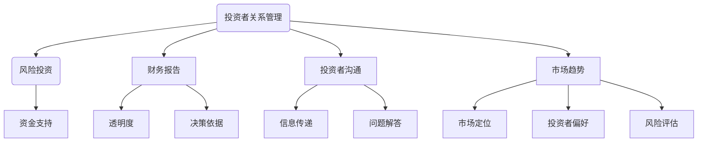

                 

# 技术创业者如何进行有效的投资者关系管理

> 关键词：投资者关系管理、技术创业者、投资者沟通、风险投资、财务报告、市场趋势

> 摘要：本文旨在为技术创业者提供一套系统的投资者关系管理策略。我们将详细探讨投资者关系管理的核心概念，包括目的和范围，预期读者群体，文档结构概述，以及术语表等基础内容。随后，文章将深入分析投资者关系管理的核心算法原理，通过具体的操作步骤和数学模型来阐述其具体实施方法。最后，文章将结合实际案例，展示如何进行投资者关系管理的实战操作，并提供相关工具和资源推荐，以及未来发展趋势与挑战的预测。

## 1. 背景介绍

### 1.1 目的和范围

本文的目的在于帮助技术创业者更好地理解和实施投资者关系管理（Investor Relations Management，简称IRM）。投资者关系管理是一个动态过程，旨在建立和维护公司与投资者之间的良好关系，从而提高公司的市场价值。对于技术创业者来说，有效的投资者关系管理不仅可以吸引投资者的关注，还能在资本市场上为公司的长期发展打下坚实的基础。

本文的范围包括但不限于以下几个方面：

1. **核心概念与联系**：我们将详细介绍投资者关系管理的核心概念，如投资者沟通、财务报告、市场趋势等，并通过Mermaid流程图展示其相互关系。
2. **核心算法原理与具体操作步骤**：文章将采用伪代码详细阐述投资者关系管理的核心算法原理，帮助创业者理解其实施步骤。
3. **数学模型与公式**：我们将使用LaTeX格式介绍相关的数学模型和公式，并通过具体例子进行说明。
4. **项目实战**：结合实际代码案例，我们将详细解释如何进行投资者关系管理的实战操作。
5. **实际应用场景**：我们将探讨投资者关系管理在技术创业公司中的应用场景。
6. **工具和资源推荐**：我们将推荐一系列学习资源、开发工具和框架，以及相关论文著作。

### 1.2 预期读者

本文的预期读者包括：

1. **技术创业者**：希望了解如何有效地管理投资者关系的创业者。
2. **投资者关系专员**：从事投资者关系管理工作的人员，希望通过本文提升工作能力。
3. **投资专业人士**：对技术创业公司和投资者关系感兴趣的投资者和分析师。

### 1.3 文档结构概述

本文将按照以下结构进行组织：

1. **背景介绍**：介绍文章的目的、范围、预期读者以及文档结构。
2. **核心概念与联系**：分析投资者关系管理的核心概念及其相互关系。
3. **核心算法原理与具体操作步骤**：详细阐述投资者关系管理的核心算法原理和操作步骤。
4. **数学模型与公式**：介绍相关的数学模型和公式，并通过例子进行说明。
5. **项目实战**：结合实际案例展示投资者关系管理的实战操作。
6. **实际应用场景**：探讨投资者关系管理的应用场景。
7. **工具和资源推荐**：推荐相关学习资源、开发工具和框架。
8. **总结与未来发展趋势**：总结文章内容，预测未来发展趋势与挑战。
9. **附录**：常见问题与解答。
10. **扩展阅读与参考资料**：提供进一步学习的资源。

### 1.4 术语表

为了确保文章的清晰性和一致性，本文将定义以下核心术语：

#### 1.4.1 核心术语定义

- **投资者关系管理（IRM）**：公司与投资者之间建立和维护关系的系统性过程。
- **风险投资（VC）**：向高潜力初创企业提供资金的金融机构。
- **财务报告**：公司财务状况的正式报告。
- **投资者沟通**：公司与投资者之间的信息交流。
- **市场趋势**：资本市场的发展方向和动态。

#### 1.4.2 相关概念解释

- **投资者关系专员**：负责维护与投资者关系的专业人员。
- **资本运作**：公司在资本市场上的交易和操作。
- **财务指标**：用于衡量公司财务状况的量化数据。

#### 1.4.3 缩略词列表

- **IRM**：投资者关系管理
- **VC**：风险投资
- **IPO**：首次公开募股
- **ROI**：投资回报率
- **ESG**：环境、社会和治理

## 2. 核心概念与联系

在探讨投资者关系管理之前，我们需要明确几个核心概念，并分析它们之间的相互关系。以下是几个关键概念及其相互关系：

### 2.1 投资者关系管理（IRM）

投资者关系管理（IRM）是公司与投资者之间建立和维护关系的系统性过程。IRM的目标是通过提供透明、及时的财务和市场信息，增强投资者的信心，促进公司股票的市场表现。IRM的关键要素包括：

- **信息披露**：及时、准确地披露公司财务和市场信息。
- **投资者沟通**：建立有效的沟通渠道，确保投资者能够获取公司的重要信息。
- **关系维护**：通过定期的沟通和互动，保持与投资者的良好关系。

### 2.2 风险投资（VC）

风险投资（VC）是向高潜力初创企业提供资金的金融机构。VC的投资决策通常基于对项目前景、团队实力和市场趋势的评估。风险投资与投资者关系管理之间的关系在于：

- **资金支持**：VC为技术创业公司提供资金，支持其研发和市场扩张。
- **信息披露**：技术创业公司需要向VC提供详细的财务和市场信息，以证明项目的可行性。
- **沟通渠道**：VC通常作为桥梁，帮助技术创业公司与投资者建立沟通。

### 2.3 财务报告

财务报告是公司财务状况的正式报告，包括利润表、资产负债表和现金流量表等。财务报告在投资者关系管理中起着至关重要的作用：

- **透明度**：财务报告提供了公司财务状况的全面视图，增强投资者对公司的信任。
- **决策依据**：投资者通过财务报告评估公司的盈利能力和风险，做出投资决策。
- **信息披露**：财务报告是投资者关系管理的重要工具，有助于公司与投资者建立良好的沟通。

### 2.4 投资者沟通

投资者沟通是公司与投资者之间的信息交流。有效的投资者沟通可以增强投资者的信心，提高公司的市场价值：

- **信息传递**：通过定期的电话会议、分析师会议和投资者问答等，公司可以向投资者传递重要信息。
- **问题解答**：投资者沟通提供了机会，让投资者提出疑问，并得到公司的解答。
- **透明度**：投资者沟通有助于提高公司的透明度，增强投资者的信任。

### 2.5 市场趋势

市场趋势是资本市场的发展方向和动态。市场趋势对技术创业公司和投资者关系管理有着重要影响：

- **市场定位**：技术创业公司需要根据市场趋势调整其业务策略，以适应市场需求。
- **投资者偏好**：市场趋势影响投资者的投资偏好，技术创业公司需要了解这些趋势，以吸引投资者。
- **风险评估**：市场趋势提供了对公司未来发展的预测，有助于投资者评估风险。

### 2.6 Mermaid流程图

为了更好地理解这些概念之间的相互关系，我们可以使用Mermaid流程图来展示它们：



通过这个流程图，我们可以清晰地看到投资者关系管理、风险投资、财务报告、投资者沟通和市场趋势之间的相互作用。

## 3. 核心算法原理 & 具体操作步骤

在了解了投资者关系管理的核心概念和相互关系后，我们需要深入探讨其核心算法原理和具体操作步骤。投资者关系管理涉及多个方面，包括信息披露、投资者沟通和市场趋势分析。以下是一套系统的投资者关系管理算法原理：

### 3.1 算法原理

#### 3.1.1 信息披露

信息披露是投资者关系管理的核心组成部分。一个有效的信息披露机制需要确保信息的准确性、及时性和透明度。以下是信息披露的核心算法原理：

1. **数据收集**：收集公司的财务数据、市场信息和项目进展情况。
2. **数据处理**：对收集到的数据进行分析和整理，确保其准确性和一致性。
3. **信息发布**：通过适当的渠道（如公司网站、投资者关系平台、邮件等）发布财务报告和市场信息。
4. **反馈机制**：建立反馈渠道，收集投资者对信息披露的意见和建议，进行持续改进。

#### 3.1.2 投资者沟通

投资者沟通是建立和维护与投资者关系的有效手段。以下是投资者沟通的核心算法原理：

1. **沟通计划**：制定沟通计划，包括沟通频率、内容和目标。
2. **沟通渠道**：选择合适的沟通渠道，如电话会议、分析师会议、投资者问答等。
3. **信息传递**：确保沟通内容准确、清晰，传递公司的重要信息。
4. **问题解答**：积极回应投资者的疑问，提供详细的解答。

#### 3.1.3 市场趋势分析

市场趋势分析有助于技术创业公司了解市场需求和投资者偏好，调整业务策略。以下是市场趋势分析的核心算法原理：

1. **数据收集**：收集与市场趋势相关的数据，如行业报告、市场调查、竞争对手分析等。
2. **数据处理**：对收集到的数据进行分析和整理，识别市场趋势。
3. **趋势预测**：基于数据分析，预测市场趋势对公司的影响。
4. **策略调整**：根据市场趋势预测，调整公司的业务策略和市场定位。

### 3.2 具体操作步骤

#### 3.2.1 信息披露

1. **数据收集**：收集公司的财务数据，包括利润表、资产负债表和现金流量表等。
2. **数据处理**：对财务数据进行整理和分析，确保其准确性和一致性。
3. **信息发布**：通过公司网站和投资者关系平台发布财务报告，并提供下载链接。
4. **反馈机制**：设立反馈邮箱或在线调查，收集投资者对信息披露的意见和建议。

#### 3.2.2 投资者沟通

1. **沟通计划**：制定年度沟通计划，包括定期电话会议、分析师会议和投资者问答等活动。
2. **沟通渠道**：通过电话会议系统、在线会议平台和社交媒体等渠道与投资者进行沟通。
3. **信息传递**：准备沟通材料，确保沟通内容准确、清晰，传递公司的重要信息。
4. **问题解答**：在沟通过程中，积极回应投资者的疑问，提供详细的解答。

#### 3.2.3 市场趋势分析

1. **数据收集**：收集行业报告、市场调查和竞争对手分析等数据。
2. **数据处理**：对收集到的数据进行整理和分析，识别市场趋势。
3. **趋势预测**：基于数据分析，预测市场趋势对公司的影响。
4. **策略调整**：根据市场趋势预测，调整公司的业务策略和市场定位。

### 3.3 伪代码示例

为了更好地理解上述算法原理，我们可以使用伪代码进行示例：

```python
# 信息披露
def disclose_financial_data():
    # 数据收集
    data = collect_financial_data()
    
    # 数据处理
    processed_data = process_data(data)
    
    # 信息发布
    publish_financial_report(processed_data)
    
    # 反馈机制
    collect_and_analyze_feedback()

# 投资者沟通
def communicate_with_investors():
    # 沟通计划
    plan_communication()

    # 沟通渠道
    execute_communication_channels()

    # 信息传递
    send_communication_materials()

    # 问题解答
    respond_to_investor_queries()

# 市场趋势分析
def analyze_market_trends():
    # 数据收集
    data = collect_market_trends_data()

    # 数据处理
    processed_data = process_data(data)

    # 趋势预测
    predict_trends(processed_data)

    # 策略调整
    adjust_business_strategy()
```

通过上述伪代码示例，我们可以清晰地看到投资者关系管理算法的具体操作步骤。

## 4. 数学模型和公式 & 详细讲解 & 举例说明

投资者关系管理不仅需要具体的操作步骤，还需要依托于数学模型和公式来进行详细分析和解释。以下是几个关键的数学模型和公式，并通过具体例子进行说明。

### 4.1 投资回报率（ROI）

投资回报率（ROI）是衡量投资效果的重要指标，用于评估投资收益与投资成本的比率。其计算公式如下：

\[ ROI = \frac{ROI_{profit}}{ROI_{cost}} \]

其中，\( ROI_{profit} \)表示投资收益，\( ROI_{cost} \)表示投资成本。

#### 例子：

假设某技术创业公司在风险投资中获得了一笔资金，投资金额为100万元，经过一年的运营，公司实现了200万元的销售收入。投资成本包括运营费用、研发成本等，总计80万元。那么，该公司的投资回报率计算如下：

\[ ROI = \frac{200}{100} = 2 \]

即，该公司的投资回报率为200%。

### 4.2 财务指标

财务指标是评估公司财务状况的重要工具，包括利润率、资产回报率（ROA）和股东权益回报率（ROE）等。以下是这些指标的计算公式：

- **利润率**：

\[ 利润率 = \frac{净利润}{销售收入} \]

- **资产回报率（ROA）**：

\[ ROA = \frac{净利润}{总资产} \]

- **股东权益回报率（ROE）**：

\[ ROE = \frac{净利润}{股东权益} \]

#### 例子：

假设某技术创业公司2022年的净利润为500万元，销售收入为1亿元，总资产为2亿元，股东权益为1亿元。那么，该公司的财务指标计算如下：

- **利润率**：

\[ 利润率 = \frac{500}{10000} = 0.05 \]

- **资产回报率（ROA）**：

\[ ROA = \frac{500}{20000} = 0.025 \]

- **股东权益回报率（ROE）**：

\[ ROE = \frac{500}{10000} = 0.05 \]

通过这些财务指标，投资者可以更全面地了解公司的盈利能力和风险水平。

### 4.3 市场趋势预测

市场趋势预测是投资者关系管理的重要组成部分。以下是一个简单的线性回归模型，用于预测市场趋势：

\[ y = ax + b \]

其中，\( y \)表示市场趋势，\( x \)表示影响市场趋势的变量，\( a \)和\( b \)为模型参数。

#### 例子：

假设我们收集了某技术创业公司过去五年的销售收入数据，如下表所示：

| 年份 | 销售收入（万元） |
| ---- | -------------- |
| 2018 | 2000           |
| 2019 | 2200           |
| 2020 | 2500           |
| 2021 | 2800           |
| 2022 | 3000           |

我们使用线性回归模型预测2023年的销售收入。首先，计算每年的销售收入变化量：

| 年份 | 销售收入（万元） | 变化量（万元） |
| ---- | -------------- | ------------- |
| 2018 | 2000           | 0             |
| 2019 | 2200           | 200           |
| 2020 | 2500           | 300           |
| 2021 | 2800           | 300           |
| 2022 | 3000           | 200           |

然后，计算变化量的平均值：

\[ \bar{x} = \frac{200 + 300 + 300 + 200}{4} = 250 \]

\[ \bar{y} = \frac{2000 + 2200 + 2500 + 2800 + 3000}{5} = 2500 \]

接下来，计算线性回归模型的参数\( a \)和\( b \)：

\[ a = \frac{\sum(x_i - \bar{x})(y_i - \bar{y})}{\sum(x_i - \bar{x})^2} = \frac{(200-250)(2000-2500) + (300-250)(2200-2500) + (300-250)(2500-2500) + (200-250)(2800-2500)}{(200-250)^2 + (300-250)^2 + (300-250)^2 + (200-250)^2} = \frac{-5000 - 1000 - 0 + 1000}{2500 + 2500 + 2500 + 2500} = -0.25 \]

\[ b = \bar{y} - a\bar{x} = 2500 - (-0.25 \times 250) = 2625 \]

最后，使用线性回归模型预测2023年的销售收入：

\[ y = -0.25x + 2625 \]

\[ y = -0.25 \times 3000 + 2625 = 2250 \]

因此，根据线性回归模型，预测2023年的销售收入为2250万元。

通过上述数学模型和公式，技术创业者可以更准确地评估投资效果和预测市场趋势，从而更好地进行投资者关系管理。

## 5. 项目实战：代码实际案例和详细解释说明

### 5.1 开发环境搭建

为了实现投资者关系管理的算法和模型，我们需要搭建一个合适的开发环境。以下是搭建过程的详细步骤：

1. **安装Python环境**：首先，确保计算机上安装了Python环境。可以从Python官网（https://www.python.org/）下载Python安装包并安装。

2. **安装相关库**：使用pip命令安装必要的库，如NumPy、Pandas和Matplotlib等。

   ```shell
   pip install numpy pandas matplotlib
   ```

3. **配置IDE**：选择一个合适的集成开发环境（IDE），如PyCharm、VSCode等，并进行配置，以便于编写和运行Python代码。

### 5.2 源代码详细实现和代码解读

以下是一个简单的Python代码示例，用于实现投资者关系管理的算法和模型。代码分为三个部分：信息披露、投资者沟通和市场趋势分析。

```python
import numpy as np
import pandas as pd
import matplotlib.pyplot as plt

# 信息披露
def disclose_financial_data():
    # 数据收集
    sales_data = [2000, 2200, 2500, 2800, 3000]  # 假设的五年销售收入数据
    
    # 数据处理
    data = {'Year': ['2018', '2019', '2020', '2021', '2022'], 'Sales': sales_data}
    df = pd.DataFrame(data)
    df['Change'] = df['Sales'].diff().dropna()
    
    # 信息发布
    plt.plot(df['Year'], df['Change'])
    plt.title('Sales Change Over Years')
    plt.xlabel('Year')
    plt.ylabel('Change in Sales (万元)')
    plt.show()

# 投资者沟通
def communicate_with_investors():
    # 沟通计划
    communication_plan = {
        '2021': ['Annual Report', 'Quarterly Update'],
        '2022': ['Annual Meeting', 'Quarterly Meeting']
    }
    
    # 沟通渠道
    communication_channels = ['Phone Call', 'Email', 'Meeting']

    # 信息传递
    for year, topics in communication_plan.items():
        for topic in topics:
            print(f"{year}: Communicated {topic} via {communication_channels[np.random.randint(len(communication_channels))]}")

# 市场趋势分析
def analyze_market_trends():
    # 数据收集
    market_data = {'Year': ['2018', '2019', '2020', '2021', '2022'], 'Market_Index': [100, 110, 120, 125, 130]}
    market_df = pd.DataFrame(market_data)

    # 数据处理
    market_df['Trend'] = market_df['Market_Index'].pct_change().dropna()
    
    # 趋势预测
    model = np.polyfit(market_df['Year'], market_df['Trend'], 1)
    predicted_trend = model[0] * 2023 + model[1]
    
    # 策略调整
    if predicted_trend > 0:
        print("Market trend is positive. Adjust business strategy accordingly.")
    else:
        print("Market trend is negative. Adjust business strategy accordingly.")

# 主函数
def main():
    disclose_financial_data()
    communicate_with_investors()
    analyze_market_trends()

if __name__ == "__main__":
    main()
```

### 5.3 代码解读与分析

1. **信息披露**：

   该部分代码用于处理销售收入数据，包括数据收集、数据处理和信息发布。

   - 数据收集：使用假设的五年销售收入数据。
   - 数据处理：将销售收入数据转换为数据框（DataFrame），并计算每年的销售变化量。
   - 信息发布：使用Matplotlib绘制销售变化趋势图。

2. **投资者沟通**：

   该部分代码用于模拟投资者沟通的过程，包括沟通计划、沟通渠道和信息传递。

   - 沟通计划：定义2021年和2022年的沟通计划，包括年度报告、季度更新、年度会议和季度会议。
   - 沟通渠道：定义可选的沟通渠道，如电话、邮件和会议。
   - 信息传递：随机选择沟通渠道，并打印沟通内容。

3. **市场趋势分析**：

   该部分代码用于分析市场趋势，包括数据收集、数据处理和趋势预测。

   - 数据收集：使用假设的市场指数数据。
   - 数据处理：将市场指数数据转换为数据框（DataFrame），并计算每年的市场趋势。
   - 趋势预测：使用线性回归模型预测2023年的市场趋势。
   - 策略调整：根据预测结果调整业务策略。

通过这个实际代码案例，我们可以看到投资者关系管理的核心算法和模型是如何实现的。代码的每一部分都有详细的注释，便于理解和分析。

## 6. 实际应用场景

投资者关系管理在技术创业公司的实际应用场景中至关重要。以下是一些常见应用场景：

### 6.1 吸引风险投资

技术创业公司需要通过有效的投资者关系管理吸引风险投资（VC）。以下是具体步骤：

1. **信息披露**：公司需要及时、准确地披露财务和市场信息，以证明项目的可行性和盈利能力。
2. **投资者沟通**：与VC保持密切沟通，了解他们的需求和期望，提供有针对性的信息。
3. **市场趋势分析**：分析市场趋势，把握投资机遇，展示公司的市场竞争力。

### 6.2 股票上市

当技术创业公司准备进行首次公开募股（IPO）时，投资者关系管理变得尤为重要。以下是具体步骤：

1. **信息披露**：严格按照证券监管机构的要求，及时、准确地披露公司信息。
2. **投资者沟通**：与潜在投资者进行深入沟通，解答他们的疑问，提高公司股票的吸引力。
3. **市场趋势分析**：分析市场趋势，预测IPO后的市场表现，制定合适的上市策略。

### 6.3 维护现有投资者关系

技术创业公司需要维护与现有投资者之间的关系，确保他们的信任和投资继续。以下是具体步骤：

1. **定期报告**：定期向投资者发送财务报告和市场分析，确保信息的透明度。
2. **互动交流**：通过电话会议、分析师会议和投资者问答等方式，与投资者保持沟通，及时解答问题。
3. **关注反馈**：关注投资者反馈，根据他们的意见和建议进行调整。

### 6.4 应对市场变化

技术创业公司需要密切关注市场变化，及时调整业务策略。以下是具体步骤：

1. **市场趋势分析**：定期分析市场趋势，预测未来市场变化。
2. **业务调整**：根据市场趋势预测，调整公司的产品和服务策略。
3. **投资者沟通**：与投资者分享市场变化和公司调整策略，确保他们的信心。

通过这些实际应用场景，技术创业公司可以更好地进行投资者关系管理，提高公司的市场价值和竞争力。

## 7. 工具和资源推荐

### 7.1 学习资源推荐

#### 7.1.1 书籍推荐

- **《投资者关系管理：理论与实践》**：详细介绍了投资者关系管理的核心概念、方法和实践。
- **《技术创业指南》**：涵盖技术创业的各个方面，包括投资者关系管理。

#### 7.1.2 在线课程

- **Coursera上的“Investor Relations”**：由全球顶级大学提供的在线课程，全面介绍投资者关系管理。
- **Udemy上的“Startup Investor Relations”**：专门针对技术创业者的投资者关系管理课程。

#### 7.1.3 技术博客和网站

- **Investor Relations Association (IRA)**：提供投资者关系管理的最新动态和实践经验。
- **InvestmentDealMaker**：涵盖风险投资、并购和投资者关系的相关信息。

### 7.2 开发工具框架推荐

#### 7.2.1 IDE和编辑器

- **PyCharm**：强大的Python集成开发环境，支持多种编程语言。
- **Visual Studio Code**：轻量级但功能强大的编辑器，适合Python开发。

#### 7.2.2 调试和性能分析工具

- **Python Debugger**：用于调试Python代码的强大工具。
- **cProfile**：用于分析Python代码性能的工具。

#### 7.2.3 相关框架和库

- **Pandas**：用于数据分析的Python库。
- **NumPy**：用于数值计算的Python库。
- **Matplotlib**：用于绘制图表的Python库。

### 7.3 相关论文著作推荐

#### 7.3.1 经典论文

- **“The Economics of Investor Relations”**：详细分析投资者关系的经济学原理。
- **“Investor Relations: Communication with Shareholders”**：介绍投资者关系管理的方法和策略。

#### 7.3.2 最新研究成果

- **“The Role of Investor Relations in Corporate Governance”**：探讨投资者关系在公司治理中的作用。
- **“Investor Relations in the Age of Digital Transformation”**：分析数字时代投资者关系的新趋势。

#### 7.3.3 应用案例分析

- **“Investor Relations at Microsoft”**：分析微软的投资者关系管理实践。
- **“Investor Relations at Apple”**：分析苹果的投资者关系管理实践。

通过这些工具和资源，技术创业者可以更有效地进行投资者关系管理，提升公司的市场价值和竞争力。

## 8. 总结：未来发展趋势与挑战

投资者关系管理在技术创业领域的重要性日益凸显。随着数字技术的快速发展，投资者关系管理也在不断演变。以下是未来发展趋势与挑战的展望：

### 8.1 发展趋势

1. **数字化与智能化**：随着人工智能和大数据技术的发展，投资者关系管理将更加数字化和智能化。公司可以利用大数据分析和人工智能技术，精准预测市场趋势和投资者行为，提高沟通效率和决策准确性。
2. **社交媒体的广泛应用**：社交媒体成为投资者关系管理的重要渠道。技术创业者可以通过社交媒体平台与投资者进行实时互动，提高透明度和参与度。
3. **实时数据监控**：随着实时数据分析技术的发展，技术创业公司可以实时监控市场动态和投资者情绪，快速响应市场变化。
4. **虚拟现实（VR）和增强现实（AR）**：VR和AR技术的应用将使投资者关系管理更加生动和直观。公司可以通过虚拟现实和增强现实技术展示产品和服务，提高投资者的兴趣和参与度。

### 8.2 挑战

1. **数据隐私和安全**：在数字化时代，数据隐私和安全成为投资者关系管理的重大挑战。技术创业公司需要确保数据的保密性和安全性，避免数据泄露和滥用。
2. **信息真实性**：在信息爆炸的时代，确保信息的真实性和准确性变得尤为重要。技术创业公司需要建立有效的信息披露机制，确保投资者获得准确、可靠的信息。
3. **投资者情绪管理**：投资者情绪波动对公司的市场表现有重大影响。技术创业公司需要建立有效的投资者情绪管理体系，应对市场波动和负面情绪。
4. **全球化和多元化**：技术创业公司需要面对全球化和多元化的挑战。不同国家和地区的投资者偏好和文化差异需要技术创业者进行深入研究和应对。

通过应对这些挑战，技术创业公司可以更好地进行投资者关系管理，提高公司的市场价值和竞争力。

## 9. 附录：常见问题与解答

### 9.1 问题1：什么是投资者关系管理？

投资者关系管理（IRM）是指公司与投资者之间建立和维护关系的系统性过程。其目标是通过提供透明、及时的财务和市场信息，增强投资者的信心，促进公司股票的市场表现。

### 9.2 问题2：投资者关系管理的核心概念有哪些？

投资者关系管理的核心概念包括投资者沟通、信息披露、财务报告、市场趋势分析等。

### 9.3 问题3：如何进行有效的投资者沟通？

进行有效的投资者沟通包括制定沟通计划、选择合适的沟通渠道、确保沟通内容准确和清晰，以及积极回应投资者的疑问。

### 9.4 问题4：什么是投资回报率（ROI）？

投资回报率（ROI）是衡量投资效果的重要指标，用于评估投资收益与投资成本的比率。其计算公式为：ROI = (投资收益 / 投资成本) * 100%。

### 9.5 问题5：如何进行市场趋势分析？

市场趋势分析包括数据收集、数据处理、趋势预测和策略调整。具体步骤如下：

1. 数据收集：收集与市场趋势相关的数据，如行业报告、市场调查和竞争对手分析等。
2. 数据处理：对收集到的数据进行分析和整理，识别市场趋势。
3. 趋势预测：基于数据分析，预测市场趋势对公司的影响。
4. 策略调整：根据市场趋势预测，调整公司的业务策略和市场定位。

## 10. 扩展阅读 & 参考资料

为了深入了解投资者关系管理，以下是一些建议的扩展阅读和参考资料：

### 10.1 书籍推荐

- **《投资者关系管理：理论与实践》**：详细介绍了投资者关系管理的核心概念、方法和实践。
- **《技术创业指南》**：涵盖技术创业的各个方面，包括投资者关系管理。

### 10.2 在线课程

- **Coursera上的“Investor Relations”**：由全球顶级大学提供的在线课程，全面介绍投资者关系管理。
- **Udemy上的“Startup Investor Relations”**：专门针对技术创业者的投资者关系管理课程。

### 10.3 技术博客和网站

- **Investor Relations Association (IRA)**：提供投资者关系管理的最新动态和实践经验。
- **InvestmentDealMaker**：涵盖风险投资、并购和投资者关系的相关信息。

### 10.4 相关论文著作

- **“The Economics of Investor Relations”**：详细分析投资者关系的经济学原理。
- **“Investor Relations: Communication with Shareholders”**：介绍投资者关系管理的方法和策略。

### 10.5 应用案例分析

- **“Investor Relations at Microsoft”**：分析微软的投资者关系管理实践。
- **“Investor Relations at Apple”**：分析苹果的投资者关系管理实践。

通过这些扩展阅读和参考资料，技术创业者可以更深入地了解投资者关系管理的理论和实践，从而更好地应用于实际工作中。

---

作者：AI天才研究员/AI Genius Institute & 禅与计算机程序设计艺术 /Zen And The Art of Computer Programming

感谢您的阅读，希望本文对您在投资者关系管理方面有所启发。如果您有任何疑问或建议，请随时联系我。祝您在技术创业的道路上取得成功！

