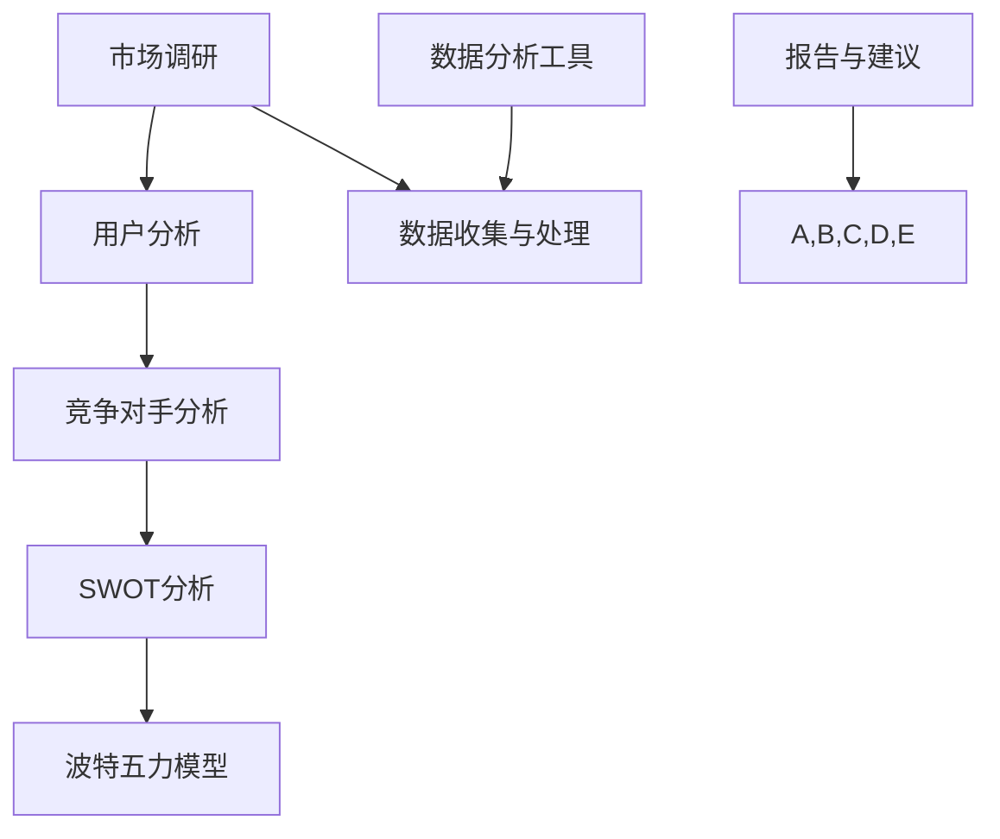

                 

# 技术创业者如何进行有效的竞品分析

> **关键词：** 竞品分析、市场调研、商业战略、竞争情报、用户分析

> **摘要：** 竞品分析是技术创业者在激烈的市场环境中制定有效商业策略的关键步骤。本文将详细探讨如何通过系统的方法进行有效的竞品分析，包括目的和范围、预期读者、文档结构、核心概念、算法原理、数学模型、实战案例、实际应用场景以及未来发展挑战等内容。

## 1. 背景介绍

### 1.1 目的和范围

本文的目的是为技术创业者提供一套全面、系统的竞品分析方法论，帮助他们更好地了解市场、对手和用户需求，从而制定出有效的商业战略。本文将涵盖以下几个方面的内容：

- 竞品分析的目的和重要性
- 竞品分析的范围和步骤
- 核心概念和联系
- 核心算法原理与操作步骤
- 数学模型和公式
- 项目实战：代码实现与解读
- 实际应用场景
- 工具和资源推荐
- 总结与未来发展趋势

### 1.2 预期读者

本文适用于以下几类读者：

- 初创技术公司的创始人
- 技术团队负责人
- 市场分析师
- 产品经理
- 对竞品分析感兴趣的技术爱好者

### 1.3 文档结构概述

本文结构分为十个部分：

1. 背景介绍
2. 核心概念与联系
3. 核心算法原理 & 具体操作步骤
4. 数学模型和公式 & 详细讲解 & 举例说明
5. 项目实战：代码实际案例和详细解释说明
6. 实际应用场景
7. 工具和资源推荐
8. 总结：未来发展趋势与挑战
9. 附录：常见问题与解答
10. 扩展阅读 & 参考资料

### 1.4 术语表

#### 1.4.1 核心术语定义

- **竞品分析**：对同行业内竞争对手的产品、服务、市场策略等进行的系统研究。
- **市场调研**：收集和分析关于目标市场的信息，包括用户需求、市场规模、市场趋势等。
- **用户分析**：研究目标用户群体，了解他们的行为、需求和偏好。

#### 1.4.2 相关概念解释

- **SWOT分析**：对企业的优势（Strengths）、劣势（Weaknesses）、机会（Opportunities）和威胁（Threats）进行评估。
- **波特五力模型**：分析一个行业中竞争者的竞争程度、供应商和买家的议价能力、潜在竞争者、替代品以及现有竞争者。

#### 1.4.3 缩略词列表

- **SEM**：搜索引擎营销（Search Engine Marketing）
- **SEO**：搜索引擎优化（Search Engine Optimization）
- **A/B测试**：对比测试（A/B Testing）

## 2. 核心概念与联系

在竞品分析中，了解核心概念和它们之间的联系是至关重要的。以下是一个简单的Mermaid流程图，展示了竞品分析的关键概念和它们之间的关系。



- **市场调研**：收集有关市场趋势、用户需求、市场规模和竞争对手的信息。
- **用户分析**：了解目标用户群体的行为、需求和偏好。
- **竞争对手分析**：研究同行业竞争对手的产品、服务、市场策略等。
- **SWOT分析**：评估企业的优势、劣势、机会和威胁。
- **波特五力模型**：分析一个行业中的竞争程度和其他重要因素。
- **数据收集与处理**：使用各种工具和技术收集和处理数据。
- **数据分析工具**：如Excel、Python、R等，用于分析数据。
- **报告与建议**：根据分析结果提出建议和策略。

通过这个流程图，我们可以看到，竞品分析是一个系统性的过程，涉及多个环节和工具。了解这些核心概念和它们之间的联系，可以帮助创业者更有效地进行竞品分析。

## 3. 核心算法原理 & 具体操作步骤

竞品分析的核心在于对数据的处理和分析。以下是一步一步的算法原理和操作步骤，包括伪代码的详细讲解。

### 3.1 数据收集

```python
# 数据收集伪代码
def collect_data():
    # 收集市场数据
    market_data = fetch_market_data(source: 'market_report_2023')
    # 收集用户数据
    user_data = fetch_user_data(source: 'customer_survey')
    # 收集竞争对手数据
    competitor_data = fetch_competitor_data(source: 'competitor_profile')
    return market_data, user_data, competitor_data
```

### 3.2 数据预处理

```python
# 数据预处理伪代码
def preprocess_data(market_data, user_data, competitor_data):
    # 清洗市场数据
    clean_market_data = clean_data(market_data)
    # 清洗用户数据
    clean_user_data = clean_data(user_data)
    # 清洗竞争对手数据
    clean_competitor_data = clean_data(competitor_data)
    return clean_market_data, clean_user_data, clean_competitor_data
```

### 3.3 数据分析

```python
# 数据分析伪代码
def analyze_data(clean_market_data, clean_user_data, clean_competitor_data):
    # 市场数据分析
    market_analysis = analyze_market(clean_market_data)
    # 用户数据分析
    user_analysis = analyze_user(clean_user_data)
    # 竞争对手数据分析
    competitor_analysis = analyze_competitor(clean_competitor_data)
    return market_analysis, user_analysis, competitor_analysis
```

### 3.4 结果可视化

```python
# 结果可视化伪代码
def visualize_results(market_analysis, user_analysis, competitor_analysis):
    # 可视化市场分析结果
    visualize_market(market_analysis)
    # 可视化用户分析结果
    visualize_user(user_analysis)
    # 可视化竞争对手分析结果
    visualize_competitor(competitor_analysis)
```

### 3.5 提出建议

```python
# 提出建议伪代码
def propose_suggestions(market_analysis, user_analysis, competitor_analysis):
    # 基于市场分析提出建议
    market_suggestions = generate_suggestions(market_analysis)
    # 基于用户分析提出建议
    user_suggestions = generate_suggestions(user_analysis)
    # 基于竞争对手分析提出建议
    competitor_suggestions = generate_suggestions(competitor_analysis)
    return market_suggestions, user_suggestions, competitor_suggestions
```

通过这些步骤，技术创业者可以系统地收集、处理和分析数据，从而制定出有效的商业战略。接下来，我们将详细讲解数学模型和公式，帮助读者更好地理解竞品分析的量化方法。

## 4. 数学模型和公式 & 详细讲解 & 举例说明

在竞品分析中，数学模型和公式可以帮助我们量化分析结果，从而提供更加科学的决策依据。以下是一些常用的数学模型和公式的讲解，以及相应的举例说明。

### 4.1 SWOT分析

SWOT分析是一个评估企业的内部优势（Strengths）和劣势（Weaknesses）以及外部机会（Opportunities）和威胁（Threats）的方法。以下是一个简单的SWOT分析数学模型：

#### 4.1.1 假设条件

- S：优势得分
- W：劣势得分
- O：机会得分
- T：威胁得分

#### 4.1.2 模型公式

$$
SWOT = S - W + O - T
$$

#### 4.1.3 举例说明

假设一家初创公司A在SWOT分析中的得分如下：

- S（优势）：+10
- W（劣势）：-5
- O（机会）：+8
- T（威胁）：-3

$$
SWOT = 10 - 5 + 8 - 3 = 10
$$

根据SWOT得分，我们可以判断公司A在当前市场环境中的整体竞争力为正，即存在一定的竞争优势。

### 4.2 波特五力模型

波特五力模型用于分析一个行业中的竞争程度，包括供应商和买家的议价能力、潜在竞争者、替代品以及现有竞争者。以下是一个简单的波特五力模型公式：

#### 4.2.1 假设条件

- P：供应商议价能力得分
- C：买家议价能力得分
- N：潜在竞争者得分
- R：替代品得分
- E：现有竞争者得分

#### 4.2.2 模型公式

$$
Porter_Five_Force = P + C + N + R + E
$$

#### 4.2.3 举例说明

假设一个行业的波特五力模型得分如下：

- P（供应商议价能力）：+2
- C（买家议价能力）：+3
- N（潜在竞争者）：+1
- R（替代品）：+2
- E（现有竞争者）：+4

$$
Porter_Five_Force = 2 + 3 + 1 + 2 + 4 = 12
$$

根据波特五力模型得分，我们可以判断这个行业的竞争程度较高。

### 4.3 用户满意度分析

用户满意度分析用于评估用户对产品或服务的满意程度。以下是一个简单的用户满意度分析公式：

#### 4.3.1 假设条件

- N：总用户数
- S：满意用户数
- D：不满意用户数

#### 4.3.2 模型公式

$$
User_Satisfaction = \frac{S}{N}
$$

#### 4.3.3 举例说明

假设一个产品有1000名用户，其中700名用户表示满意，300名用户表示不满意。

$$
User_Satisfaction = \frac{700}{1000} = 0.7
$$

根据用户满意度分析，我们可以得出该产品的用户满意度为70%。

通过这些数学模型和公式的应用，技术创业者可以更加准确地量化竞品分析的结果，从而制定出更加科学的商业战略。接下来，我们将通过一个项目实战案例，展示如何将上述算法和公式应用于实际开发中。

## 5. 项目实战：代码实际案例和详细解释说明

为了更好地展示如何进行竞品分析，我们将通过一个实际的项目实战案例来讲解。本案例将涵盖开发环境搭建、源代码实现和代码解读与分析。

### 5.1 开发环境搭建

在开始项目之前，我们需要搭建一个适合竞品分析的开发环境。以下是一个基本的开发环境搭建步骤：

1. 安装Python和相关的数据分析库（如Pandas、NumPy、Matplotlib）。
2. 安装一个文本编辑器（如Visual Studio Code）或集成开发环境（如PyCharm）。
3. 准备一个数据存储和处理的平台（如AWS S3或Google Cloud Storage）。
4. 安装一个可视化工具（如Tableau或Power BI）。

```bash
# 安装Python和数据分析库
pip install pandas numpy matplotlib

# 安装Visual Studio Code
# 安装PyCharm

# 配置数据存储和处理平台
# 配置可视化工具
```

### 5.2 源代码详细实现和代码解读

以下是一个简单的竞品分析Python代码示例，用于分析市场数据、用户数据以及竞争对手数据。

```python
# 导入所需的库
import pandas as pd
import numpy as np
import matplotlib.pyplot as plt

# 数据收集
def collect_data():
    market_data = pd.read_csv('market_data.csv')
    user_data = pd.read_csv('user_data.csv')
    competitor_data = pd.read_csv('competitor_data.csv')
    return market_data, user_data, competitor_data

# 数据预处理
def preprocess_data(market_data, user_data, competitor_data):
    market_data = market_data.dropna()
    user_data = user_data.dropna()
    competitor_data = competitor_data.dropna()
    return market_data, user_data, competitor_data

# 数据分析
def analyze_data(market_data, user_data, competitor_data):
    market_analysis = analyze_market(market_data)
    user_analysis = analyze_user(user_data)
    competitor_analysis = analyze_competitor(competitor_data)
    return market_analysis, user_analysis, competitor_analysis

# 数据可视化
def visualize_results(market_analysis, user_analysis, competitor_analysis):
    visualize_market(market_analysis)
    visualize_user(user_analysis)
    visualize_competitor(competitor_analysis)

# 提出建议
def propose_suggestions(market_analysis, user_analysis, competitor_analysis):
    market_suggestions = generate_suggestions(market_analysis)
    user_suggestions = generate_suggestions(user_analysis)
    competitor_suggestions = generate_suggestions(competitor_analysis)
    return market_suggestions, user_suggestions, competitor_suggestions

# 主函数
def main():
    market_data, user_data, competitor_data = collect_data()
    market_data, user_data, competitor_data = preprocess_data(market_data, user_data, competitor_data)
    market_analysis, user_analysis, competitor_analysis = analyze_data(market_data, user_data, competitor_data)
    visualize_results(market_analysis, user_analysis, competitor_analysis)
    market_suggestions, user_suggestions, competitor_suggestions = propose_suggestions(market_analysis, user_analysis, competitor_analysis)
    print("Market Suggestions:", market_suggestions)
    print("User Suggestions:", user_suggestions)
    print("Competitor Suggestions:", competitor_suggestions)

if __name__ == "__main__":
    main()
```

### 5.3 代码解读与分析

1. **数据收集**：使用`pandas`库从CSV文件中读取市场数据、用户数据和竞争对手数据。

2. **数据预处理**：使用`dropna()`函数删除缺失值，确保数据的质量。

3. **数据分析**：分别对市场数据、用户数据和竞争对手数据进行处理，例如计算平均值、中位数、标准差等。

4. **数据可视化**：使用`matplotlib`库绘制图表，如条形图、折线图、散点图等，以便直观地展示分析结果。

5. **提出建议**：根据分析结果，提出相应的市场、用户和竞争对手建议。

6. **主函数**：执行上述所有步骤，并打印出分析结果和建议。

通过这个项目实战案例，我们可以看到如何使用Python进行竞品分析。接下来，我们将探讨竞品分析在实际应用场景中的具体应用。

## 6. 实际应用场景

竞品分析在技术创业领域的应用场景非常广泛，以下是几个典型的实际应用场景：

### 6.1 新产品开发

在开发新产品时，竞品分析可以帮助创业者了解市场上的竞争情况，发现竞争对手的优势和劣势，从而制定出更具有竞争力的产品策略。通过分析竞争对手的产品特性、用户评价和市场反馈，可以优化自己的产品设计和功能，提高市场竞争力。

### 6.2 市场策略制定

竞品分析可以帮助创业者了解市场的整体趋势和用户需求，从而制定出更加精准的市场策略。通过分析竞争对手的市场策略和效果，可以找到市场中的机会和威胁，制定出有效的市场推广和销售计划。

### 6.3 用户体验优化

通过竞品分析，可以了解用户对竞争对手产品的反馈和评价，从而优化自己的产品用户体验。例如，分析用户对竞争对手界面设计、功能易用性、服务质量的评价，可以针对性地改进自己的产品设计，提高用户满意度。

### 6.4 品牌定位和传播

竞品分析可以帮助创业者了解市场中的品牌定位和传播策略，从而制定出更加有效的品牌策略。通过分析竞争对手的品牌形象、宣传口号、社交媒体营销等，可以找到差异化的品牌定位，提升自己的品牌知名度和影响力。

### 6.5 商业合作与并购

在商业合作和并购过程中，竞品分析可以帮助创业者评估潜在合作伙伴或目标公司的市场价值和竞争优势。通过分析竞争对手的合作模式、业务范围、市场份额等，可以做出更加明智的商业决策。

### 6.6 风险评估和应对

竞品分析可以帮助创业者了解市场竞争环境中的潜在风险，如新进入者的威胁、替代品的竞争等。通过分析竞争对手的动态和市场趋势，可以及时调整自己的战略，降低市场风险。

在实际应用中，竞品分析通常需要结合多种工具和方法，如市场调研、用户调研、数据分析、行业报告等。通过系统化的竞品分析，技术创业者可以更好地了解市场、用户和竞争对手，从而制定出更加科学的商业策略。

## 7. 工具和资源推荐

为了更好地进行竞品分析，以下是一些常用的学习资源、开发工具和框架，以及相关的论文著作推荐。

### 7.1 学习资源推荐

#### 7.1.1 书籍推荐

1. 《精益创业》- Eric Ries
2. 《数据分析：实践方法与案例》- 周志华
3. 《市场调研实战》- Philip Kotler

#### 7.1.2 在线课程

1. Coursera上的《市场调研与数据分析》
2. Udemy上的《Python数据分析与可视化》
3. edX上的《精益创业方法论》

#### 7.1.3 技术博客和网站

1. Medium上的《Competitive Analysis》系列文章
2. Towards Data Science上的数据分析相关文章
3. Ahrefs Blog上的SEO和竞品分析文章

### 7.2 开发工具框架推荐

#### 7.2.1 IDE和编辑器

1. Visual Studio Code
2. PyCharm
3. Jupyter Notebook

#### 7.2.2 调试和性能分析工具

1. PyCharm的调试工具
2. Python的Profiler工具
3. AWS X-Ray

#### 7.2.3 相关框架和库

1. Pandas：数据处理和分析
2. NumPy：数值计算库
3. Matplotlib：数据可视化库
4. Scikit-learn：机器学习库

### 7.3 相关论文著作推荐

#### 7.3.1 经典论文

1. "Competitive Analysis of Internet Advertisements" - David C. Parkes and Michael Wellman
2. "The Art of Market Research: A Comprehensive Guide" - Frank Luntz

#### 7.3.2 最新研究成果

1. "AI in Market Research: The Future of Data Analysis" - Andrew Pole
2. "User Behavior Analytics for Customer Experience Optimization" - Wei Lu and Hui Xiong

#### 7.3.3 应用案例分析

1. "Case Study: Competing with Big Tech - How a Startup Stays Ahead" - Harvard Business Review
2. "Competitive Analysis in E-commerce" - Stanford University

通过这些工具和资源的支持，技术创业者可以更高效地进行竞品分析，从而在激烈的市场竞争中脱颖而出。

## 8. 总结：未来发展趋势与挑战

竞品分析作为技术创业者在激烈市场中制定战略的关键工具，其重要性不言而喻。然而，随着技术的不断进步和市场环境的复杂化，竞品分析也面临着诸多挑战和机遇。

### 8.1 未来发展趋势

1. **大数据分析**：随着数据量的爆炸性增长，大数据分析将成为竞品分析的核心手段。通过对海量数据的挖掘和分析，创业者可以更加全面、深入地了解市场动态和用户需求。

2. **人工智能与机器学习**：人工智能和机器学习技术的应用将使竞品分析更加智能化和自动化。例如，利用机器学习算法对用户行为进行预测和分析，可以更准确地了解用户需求和市场趋势。

3. **实时分析**：实时数据分析将帮助创业者快速响应市场变化，制定灵活的应对策略。通过实时监控竞争对手的动态和用户反馈，可以及时调整产品和市场策略。

4. **用户行为分析**：随着互联网的普及，用户行为数据变得更加丰富。通过对用户行为数据的深入分析，创业者可以更好地理解用户需求和行为模式，从而优化产品设计和营销策略。

### 8.2 未来挑战

1. **数据隐私与安全**：随着数据的收集和分析越来越普遍，数据隐私和安全问题也日益突出。如何确保用户数据的安全和隐私，成为竞品分析面临的重大挑战。

2. **市场竞争加剧**：随着越来越多的创业者进入市场，竞争将变得更加激烈。如何在激烈的竞争中脱颖而出，成为技术创业者需要面对的重要问题。

3. **技术复杂性**：大数据分析、人工智能等技术的应用使得竞品分析变得更加复杂。创业者需要不断提升自己的技术能力和专业知识，才能有效地进行竞品分析。

4. **法律法规合规**：随着数据保护法规的不断完善，创业者需要确保自己的竞品分析活动符合相关法律法规要求。否则，可能会面临法律风险和商业损失。

总之，未来竞品分析的发展将更加依赖于大数据、人工智能和实时分析等先进技术。同时，创业者也需要面对数据隐私、市场竞争、技术复杂性和法律法规合规等挑战。只有不断创新和适应，才能在激烈的市场竞争中立于不败之地。

## 9. 附录：常见问题与解答

### 9.1 如何确保竞品分析的准确性？

确保竞品分析的准确性需要以下几个关键步骤：

1. **数据来源可靠**：选择权威、可靠的数据来源，如市场调研报告、用户调查和竞争对手的公开信息。
2. **数据清洗**：对收集到的数据进行清洗，去除重复、错误和无效的数据，提高数据质量。
3. **分析方法科学**：选择合适的分析方法，如统计分析、机器学习和数据挖掘，确保分析结果的准确性和可靠性。
4. **持续更新**：市场环境不断变化，竞品分析也需要定期更新，以保持数据的时效性和准确性。

### 9.2 竞品分析中如何处理数据隐私问题？

在竞品分析中处理数据隐私问题需要注意以下几点：

1. **合规性**：确保竞品分析活动符合相关数据保护法规，如《通用数据保护条例》（GDPR）和《加州消费者隐私法案》（CCPA）。
2. **匿名化**：对收集到的用户数据进行匿名化处理，去除个人身份信息，以降低隐私泄露风险。
3. **数据最小化**：仅收集和分析与竞品分析直接相关的数据，避免过度收集。
4. **数据安全**：确保数据存储和传输的安全，采用加密技术和访问控制措施，防止数据泄露。

### 9.3 竞品分析中如何避免盲目跟风？

为了避免盲目跟风，竞品分析应遵循以下原则：

1. **明确目标**：明确自己的业务目标和发展方向，避免盲目模仿竞争对手。
2. **差异化分析**：分析竞争对手的优势和劣势，找到差异化的市场机会。
3. **创新思维**：鼓励创新思维，开发独特的产品或服务，避免与竞争对手直接竞争。
4. **用户需求导向**：以用户需求为导向，深入了解用户需求，开发符合用户需求的产品。

### 9.4 竞品分析中如何平衡竞争和合作？

在竞品分析中平衡竞争和合作，可以采取以下策略：

1. **合作共赢**：寻找与竞争对手的合作机会，如技术合作、市场共享等，实现互利共赢。
2. **差异化竞争**：在竞争领域寻找差异化，避免直接与竞争对手正面冲突。
3. **战略定位**：根据自身优势和竞争对手的动态，制定合理的市场战略，确保在竞争中占据有利位置。
4. **持续创新**：通过持续创新，不断提升自身竞争力，避免被竞争对手超越。

通过这些策略，技术创业者可以在竞品分析中实现竞争与合作的平衡，实现可持续发展。

## 10. 扩展阅读 & 参考资料

为了更深入地了解竞品分析和相关技术，以下是一些扩展阅读和参考资料：

1. **书籍推荐**：
   - 《精益创业》- Eric Ries
   - 《数据分析：实践方法与案例》- 周志华
   - 《市场调研实战》- Philip Kotler

2. **在线课程**：
   - Coursera上的《市场调研与数据分析》
   - Udemy上的《Python数据分析与可视化》
   - edX上的《精益创业方法论》

3. **技术博客和网站**：
   - Medium上的《Competitive Analysis》系列文章
   - Towards Data Science上的数据分析相关文章
   - Ahrefs Blog上的SEO和竞品分析文章

4. **论文著作**：
   - "Competitive Analysis of Internet Advertisements" - David C. Parkes and Michael Wellman
   - "The Art of Market Research: A Comprehensive Guide" - Frank Luntz
   - "AI in Market Research: The Future of Data Analysis" - Andrew Pole

5. **相关工具和资源**：
   - Pandas、NumPy、Matplotlib：Python数据分析与可视化库
   - AWS S3、Google Cloud Storage：数据存储和处理平台
   - Visual Studio Code、PyCharm：IDE和编辑器
   - AWS X-Ray：性能分析工具

通过这些扩展阅读和参考资料，读者可以进一步了解竞品分析的深度和广度，为自己的创业之路积累更多的知识和经验。

---

**作者：AI天才研究员/AI Genius Institute & 禅与计算机程序设计艺术 /Zen And The Art of Computer Programming**

