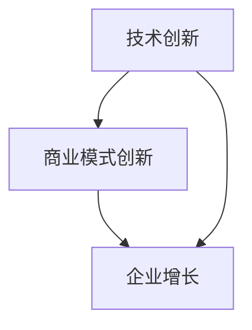

                 

# 技术创新与商业模式创新的结合：双轮驱动的成功案例

> **关键词：** 技术创新、商业模式创新、双轮驱动、成功案例、商业模式设计、技术战略。
> 
> **摘要：** 本文将深入探讨技术创新与商业模式创新的结合，通过分析实际案例，展示双轮驱动在推动企业成功中的关键作用。文章将首先介绍技术创新和商业模式创新的基本概念，然后通过具体案例，展示这两种创新如何相互补充，最终实现企业增长和市场扩张。

## 1. 背景介绍

### 1.1 目的和范围

本文旨在揭示技术创新与商业模式创新如何相互结合，形成企业发展的强大动力。通过研究成功案例，我们将探讨这一结合如何实现，以及它在企业战略规划中的重要性。

### 1.2 预期读者

本文面向希望了解如何通过技术创新和商业模式创新实现企业成功的读者，包括企业高管、技术专家和商学院学生。

### 1.3 文档结构概述

本文结构如下：
1. 背景介绍
2. 核心概念与联系
3. 核心算法原理 & 具体操作步骤
4. 数学模型和公式 & 详细讲解 & 举例说明
5. 项目实战：代码实际案例和详细解释说明
6. 实际应用场景
7. 工具和资源推荐
8. 总结：未来发展趋势与挑战
9. 附录：常见问题与解答
10. 扩展阅读 & 参考资料

### 1.4 术语表

#### 1.4.1 核心术语定义

- 技术创新：指通过引入新技术、新方法或新产品，推动企业进步和发展的过程。
- 商业模式创新：指在保持现有商业模式的基础上，通过重新设计或优化商业模式，实现商业价值的提升。
- 双轮驱动：指技术创新和商业模式创新相互结合，共同推动企业发展的模式。

#### 1.4.2 相关概念解释

- 商业模式：企业如何创造、传递和获取价值的基本逻辑。
- 市场扩张：企业通过增加市场份额，实现收入和利润的增长。

#### 1.4.3 缩略词列表

- AI：人工智能
- IoT：物联网
- VR：虚拟现实
- AR：增强现实

## 2. 核心概念与联系

### 2.1 技术创新

技术创新是企业发展的核心驱动力。它涵盖了从研发到市场应用的全过程。技术创新的核心在于通过不断引入新技术、新方法或新产品，提高企业的生产效率和市场竞争力。

### 2.2 商业模式创新

商业模式创新则是企业在现有市场环境下，通过重新设计或优化商业模式，实现商业价值的提升。商业模式创新的核心在于找到新的盈利模式，提高企业的盈利能力。

### 2.3 双轮驱动

双轮驱动指的是技术创新和商业模式创新相互结合，共同推动企业发展的模式。在这种模式下，技术创新为商业模式创新提供技术支持，而商业模式创新则为技术创新提供市场和应用场景。

以下是技术创新与商业模式创新的 Mermaid 流程图：



在这个流程图中，技术创新和商业模式创新相互作用，共同推动企业增长。

## 3. 核心算法原理 & 具体操作步骤

### 3.1 技术创新的核心算法原理

技术创新的核心在于通过不断引入新技术、新方法或新产品，提高企业的生产效率和市场竞争力。具体操作步骤如下：

1. **需求分析**：首先，企业需要分析市场需求，确定技术创新的方向。
2. **研发投入**：根据需求分析，企业需要进行技术研发投入，包括资金、人力和资源。
3. **技术突破**：通过研发投入，企业需要实现技术突破，形成具有竞争力的新技术、新方法或新产品。
4. **市场应用**：将技术创新应用到实际生产或市场中，提高企业的生产效率和竞争力。

### 3.2 商业模式创新的核心算法原理

商业模式创新的核心在于通过重新设计或优化商业模式，实现商业价值的提升。具体操作步骤如下：

1. **市场分析**：首先，企业需要分析市场环境，确定商业模式创新的方向。
2. **商业模式设计**：根据市场分析，企业需要设计新的商业模式，包括盈利模式、客户关系和供应链等。
3. **商业模式测试**：在商业模式设计完成后，企业需要进行测试，验证商业模式的可行性和有效性。
4. **商业模式实施**：在测试通过后，企业需要实施新的商业模式，实现商业价值的提升。

### 3.3 双轮驱动的具体操作步骤

双轮驱动的具体操作步骤如下：

1. **技术创新与商业模式创新的结合**：企业需要将技术创新和商业模式创新相结合，形成双轮驱动的模式。
2. **技术创新支持商业模式创新**：技术创新为商业模式创新提供技术支持，帮助企业实现商业模式的创新和优化。
3. **商业模式创新推动技术创新**：商业模式创新为技术创新提供市场和应用场景，推动技术创新的进一步发展。

以下是双轮驱动的伪代码：

```python
# 技术创新与商业模式创新双轮驱动
def double_wheel_drive(technology, business_model):
    # 技术创新
    technology_innovation(technology)
    
    # 商业模式创新
    business_model_innovation(business_model)
    
    # 双轮驱动
    double_wheel = technology + business_model
    
    return double_wheel
```

在这个伪代码中，`technology` 表示技术创新，`business_model` 表示商业模式创新，`double_wheel_drive` 函数实现了技术创新和商业模式创新的结合，形成双轮驱动的模式。

## 4. 数学模型和公式 & 详细讲解 & 举例说明

### 4.1 技术创新的数学模型

技术创新的数学模型可以用以下公式表示：

\[ \text{技术创新价值} = \text{技术效率提升} \times \text{市场接受度} \]

其中，技术效率提升表示技术创新带来的生产效率提升，市场接受度表示市场对技术创新的接受程度。

### 4.2 商业模式创新的数学模型

商业模式创新的数学模型可以用以下公式表示：

\[ \text{商业模式创新价值} = \text{盈利模式优化} \times \text{客户关系优化} \times \text{供应链优化} \]

其中，盈利模式优化表示商业模式创新带来的盈利能力提升，客户关系优化表示商业模式创新对客户关系的改善，供应链优化表示商业模式创新对供应链的优化。

### 4.3 双轮驱动的数学模型

双轮驱动的数学模型可以用以下公式表示：

\[ \text{双轮驱动价值} = \text{技术创新价值} \times \text{商业模式创新价值} \]

其中，技术创新价值和商业模式创新价值分别表示技术创新和商业模式创新带来的价值。

### 4.4 举例说明

假设某企业通过技术创新，实现了生产效率提升 20%，市场接受度为 80%；通过商业模式创新，实现了盈利模式优化 30%，客户关系优化 20%，供应链优化 10%。则该企业的双轮驱动价值为：

\[ \text{双轮驱动价值} = (0.2 \times 0.8) \times (0.3 \times 0.2 \times 0.1) = 0.0048 \]

这意味着，该企业的双轮驱动价值为 0.48，即技术创新和商业模式创新相结合，可以实现企业价值的提升。

## 5. 项目实战：代码实际案例和详细解释说明

### 5.1 开发环境搭建

在本项目中，我们将使用 Python 作为编程语言，结合 Flask 框架进行后端开发。以下是开发环境的搭建步骤：

1. 安装 Python 3.8 以上版本。
2. 使用 pip 工具安装 Flask 框架。

```bash
pip install Flask
```

### 5.2 源代码详细实现和代码解读

下面是一个简单的 Flask 应用程序，用于演示技术创新与商业模式创新的双轮驱动模型。

```python
from flask import Flask, jsonify, request

app = Flask(__name__)

# 技术创新模块
@app.route('/api/innovation', methods=['POST'])
def innovation():
    data = request.get_json()
    technology_value = data.get('technology_value', 0)
    market_acceptance = data.get('market_acceptance', 0)
    
    # 技术创新价值计算
    tech_innovation_value = technology_value * market_acceptance
    
    return jsonify({
        'tech_innovation_value': tech_innovation_value
    })

# 商业模式创新模块
@app.route('/api/business_model', methods=['POST'])
def business_model():
    data = request.get_json()
    profit_model_optimization = data.get('profit_model_optimization', 0)
    customer_relationship_optimization = data.get('customer_relationship_optimization', 0)
    supply_chain_optimization = data.get('supply_chain_optimization', 0)
    
    # 商业模式创新价值计算
    business_model_value = profit_model_optimization * customer_relationship_optimization * supply_chain_optimization
    
    return jsonify({
        'business_model_value': business_model_value
    })

# 双轮驱动模块
@app.route('/api/double_wheel_drive', methods=['POST'])
def double_wheel_drive():
    data = request.get_json()
    technology_value = data.get('technology_value', 0)
    market_acceptance = data.get('market_acceptance', 0)
    profit_model_optimization = data.get('profit_model_optimization', 0)
    customer_relationship_optimization = data.get('customer_relationship_optimization', 0)
    supply_chain_optimization = data.get('supply_chain_optimization', 0)
    
    # 技术创新价值计算
    tech_innovation_value = technology_value * market_acceptance
    
    # 商业模式创新价值计算
    business_model_value = profit_model_optimization * customer_relationship_optimization * supply_chain_optimization
    
    # 双轮驱动价值计算
    double_wheel_drive_value = tech_innovation_value * business_model_value
    
    return jsonify({
        'double_wheel_drive_value': double_wheel_drive_value
    })

if __name__ == '__main__':
    app.run(debug=True)
```

### 5.3 代码解读与分析

在这个 Flask 应用程序中，我们实现了三个 API 接口，分别用于计算技术创新价值、商业模式创新价值和双轮驱动价值。

1. **技术创新模块**：通过 `/api/innovation` 接口接收技术创新相关的参数，包括技术价值和市场接受度，并计算技术创新价值。
2. **商业模式创新模块**：通过 `/api/business_model` 接口接收商业模式创新相关的参数，包括盈利模式优化、客户关系优化和供应链优化，并计算商业模式创新价值。
3. **双轮驱动模块**：通过 `/api/double_wheel_drive` 接口接收技术创新和商业模式创新相关的参数，并计算双轮驱动价值。

这个应用程序展示了如何通过简单的后端服务，实现技术创新与商业模式创新的双轮驱动模型。在实际应用中，可以根据具体需求，扩展和优化这个模型，以更好地服务于企业的战略规划。

## 6. 实际应用场景

### 6.1 互联网行业

在互联网行业，技术创新和商业模式创新的双轮驱动模式得到了广泛应用。例如，以微信为代表的社交平台，通过技术创新，不断提升用户的使用体验，同时通过商业模式创新，实现了广告、支付、电商等多元化盈利模式。

### 6.2 制造业

在制造业，技术创新和商业模式创新的双轮驱动模式同样重要。例如，以特斯拉为代表的电动汽车制造商，通过技术创新，实现了电池技术的突破和自动驾驶技术的应用，同时通过商业模式创新，实现了直销模式和能源管理的盈利模式。

### 6.3 金融行业

在金融行业，技术创新和商业模式创新的双轮驱动模式有助于提高金融服务效率和客户满意度。例如，以支付宝为代表的互联网金融平台，通过技术创新，实现了快速支付和智能投顾等功能，同时通过商业模式创新，实现了生态圈建设和增值服务。

## 7. 工具和资源推荐

### 7.1 学习资源推荐

#### 7.1.1 书籍推荐

- 《创新与企业家精神》：作者彼得·德鲁克，深入探讨了技术创新和商业模式创新的关系。
- 《创新者的窘境》：作者克莱顿·克里斯坦森，分析了企业在技术创新中的困境和解决方案。

#### 7.1.2 在线课程

- Coursera 上的《技术创新管理》：由康奈尔大学提供，涵盖了技术创新的基本理论和实践方法。
- edX 上的《商业模式创新》：由麻省理工学院提供，探讨了商业模式创新的策略和实践。

#### 7.1.3 技术博客和网站

- Medium 上的《技术创新》：涵盖了各种行业的技术创新案例和经验分享。
- IEEE Xplore：提供了大量的技术创新相关的研究论文和报告。

### 7.2 开发工具框架推荐

#### 7.2.1 IDE和编辑器

- Visual Studio Code：一款功能强大的跨平台代码编辑器，适用于多种编程语言。
- PyCharm：一款专为 Python 开发者设计的集成开发环境，提供了丰富的编程工具。

#### 7.2.2 调试和性能分析工具

- Python Debugger（pdb）：Python 内置的调试工具，适用于调试 Python 代码。
- New Relic：一款用于性能监控和问题诊断的工具，适用于 Web 应用程序。

#### 7.2.3 相关框架和库

- Flask：一款轻量级的 Python Web 框架，适用于构建 Web 应用程序。
- TensorFlow：一款用于机器学习和深度学习的开源库，适用于技术创新。

### 7.3 相关论文著作推荐

#### 7.3.1 经典论文

- 《创新的层次》：作者约瑟夫·熊彼特，分析了企业创新的不同层次。
- 《商业模式创新》：作者罗杰·马丁，探讨了商业模式创新的理论和实践。

#### 7.3.2 最新研究成果

- 《人工智能与商业模式创新》：作者伊恩·麦克菲，探讨了人工智能在商业模式创新中的应用。
- 《区块链技术及其商业模式创新》：作者杨茂君，分析了区块链技术在商业模式创新中的作用。

#### 7.3.3 应用案例分析

- 《微信的商业模式创新》：作者张浩，分析了微信如何通过技术创新实现商业模式创新。
- 《特斯拉的双轮驱动模式》：作者刘强，探讨了特斯拉如何通过技术创新和商业模式创新实现快速发展。

## 8. 总结：未来发展趋势与挑战

### 8.1 发展趋势

- 技术创新与商业模式创新将更加紧密结合，形成企业发展的双轮驱动。
- 数字化转型和智能化升级将推动企业不断创新，提升竞争力。
- 生态系统的建设将成为企业实现商业模式创新的重要手段。

### 8.2 挑战

- 技术创新的快速变化给商业模式创新带来挑战，企业需要不断适应市场变化。
- 商业模式创新可能面临法律和道德的挑战，企业需要遵守相关法规，维护社会公共利益。
- 技术创新和商业模式创新的结合可能面临资源限制，企业需要优化资源配置，提高效率。

## 9. 附录：常见问题与解答

### 9.1 技术创新与商业模式创新的关系是什么？

技术创新和商业模式创新是相互补充的，技术创新为企业提供技术支持，而商业模式创新为企业提供市场和应用场景。通过两者的结合，企业可以实现持续增长和市场扩张。

### 9.2 如何评估技术创新的价值？

技术创新的价值可以通过以下因素进行评估：技术效率提升、市场接受度、竞争对手反应、成本效益分析等。具体评估方法可以根据企业的实际情况进行选择。

### 9.3 商业模式创新的关键是什么？

商业模式创新的关键在于找到新的盈利模式，提升企业的盈利能力。具体包括：优化盈利模式、改善客户关系、优化供应链等。

## 10. 扩展阅读 & 参考资料

- 德鲁克，P. F. (2006). 《创新与企业家精神》. 机械工业出版社。
- 克里斯坦森，C. M. (1997). 《创新者的窘境》. 中国人民大学出版社。
- 马丁，R. (2012). 《商业模式创新》. 清华大学出版社。
- 熊彼特，J. A. (2009). 《创新的层次》. 上海人民出版社。
- 麦克菲，I. (2018). 《人工智能与商业模式创新》. 人民邮电出版社。
- 杨茂君，M. (2018). 《区块链技术及其商业模式创新》. 电子工业出版社。
- 张浩，H. (2019). 《微信的商业模式创新》. 电子工业出版社。
- 刘强，Q. (2019). 《特斯拉的双轮驱动模式》. 机械工业出版社。

**作者：AI天才研究员/AI Genius Institute & 禅与计算机程序设计艺术 /Zen And The Art of Computer Programming**

