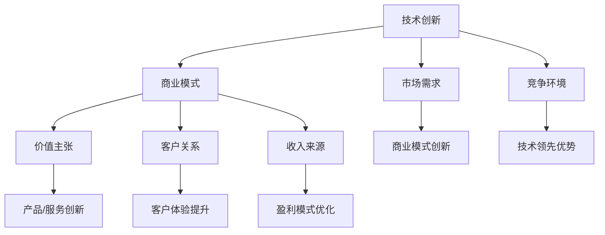

                 


# 技术创新与商业模式：寻找最佳结合点

> 关键词：技术创新、商业模式、结合点、创业、市场策略、用户需求

> 摘要：本文旨在探讨技术创新与商业模式之间的相互作用及其对创业成功的重要性。我们将分析技术创新的驱动因素，商业模式的构成要素，并通过实际案例来探讨它们如何实现最佳结合。文章将帮助读者理解如何在快速变化的市场环境中，利用技术创新来实现商业模式的创新，从而在竞争中脱颖而出。

## 1. 背景介绍

### 1.1 目的和范围

本文的主要目的是探讨技术创新与商业模式之间的结合点，以及这种结合对于创业和企业发展的重要性。随着技术的不断进步，市场和用户需求也在快速变化，如何在其中找到适合自己的商业模式，成为了每个企业都必须面对的问题。本文将讨论以下内容：

1. **技术创新的驱动因素**：分析技术创新的来源，包括技术进步、市场需求、竞争环境等。
2. **商业模式的构成要素**：介绍商业模式的基本构成，如价值主张、客户关系、收入来源等。
3. **最佳结合点的探索**：通过案例研究，探讨如何将技术创新与商业模式相结合，实现商业成功。
4. **实际应用场景**：分析技术创新在不同行业和领域的应用，以及相应的商业模式。
5. **工具和资源推荐**：提供学习资源、开发工具和相关论文，以帮助读者深入理解本文内容。

### 1.2 预期读者

本文适合以下读者群体：

1. **创业者**：希望了解如何利用技术创新来创建成功的商业模式。
2. **企业高管**：希望探讨如何将技术创新融入企业战略，提升竞争力。
3. **技术专家**：希望了解技术创新在商业应用中的实际案例。
4. **学术研究者**：对技术创新与商业模式结合的研究感兴趣。

### 1.3 文档结构概述

本文将分为以下几个部分：

1. **背景介绍**：包括本文的目的、范围、预期读者和文档结构概述。
2. **核心概念与联系**：介绍技术创新和商业模式的定义、原理和联系。
3. **核心算法原理 & 具体操作步骤**：详细讲解技术创新的原理和实现步骤。
4. **数学模型和公式 & 详细讲解 & 举例说明**：介绍与技术创新相关的数学模型和公式，并通过案例进行说明。
5. **项目实战：代码实际案例和详细解释说明**：通过具体案例展示技术创新和商业模式的结合。
6. **实际应用场景**：探讨技术创新在不同领域的应用。
7. **工具和资源推荐**：推荐学习资源、开发工具和相关论文。
8. **总结：未来发展趋势与挑战**：总结本文的主要观点，探讨未来发展趋势和挑战。
9. **附录：常见问题与解答**：回答读者可能关心的问题。
10. **扩展阅读 & 参考资料**：提供进一步阅读的资源和参考资料。

### 1.4 术语表

#### 1.4.1 核心术语定义

- **技术创新**：指通过研发和应用新技术，提高产品或服务的性能、效率或用户体验。
- **商业模式**：指企业通过何种方式创造、传递和获取价值，包括价值主张、客户关系、收入来源等。
- **结合点**：指技术创新和商业模式的交集，即如何将技术创新融入商业模式，实现商业成功。

#### 1.4.2 相关概念解释

- **价值主张**：企业提供给客户的独特价值和利益。
- **客户关系**：企业与客户之间的互动关系和联系方式。
- **收入来源**：企业通过何种方式获取收入的渠道。

#### 1.4.3 缩略词列表

- **AI**：人工智能
- **CRM**：客户关系管理
- **ERP**：企业资源计划
- **SaaS**：软件即服务

## 2. 核心概念与联系

在探讨技术创新与商业模式之间的结合点之前，首先需要理解这两个核心概念及其相互关系。

### 2.1 技术创新的驱动因素

技术创新的驱动因素包括以下几个方面：

1. **技术进步**：随着科技的不断发展，新技术的出现为企业和市场提供了更多的机会和可能性。
2. **市场需求**：用户需求的变化推动了技术的创新，企业需要通过技术创新来满足市场需求。
3. **竞争环境**：在竞争激烈的市场中，企业需要通过技术创新来保持竞争优势。

### 2.2 商业模式的构成要素

商业模式由以下几个关键要素构成：

1. **价值主张**：企业通过何种方式为客户提供独特的价值和利益。
2. **客户关系**：企业与客户之间的互动关系和联系方式。
3. **收入来源**：企业通过何种方式获取收入的渠道。
4. **关键资源**：企业为实现商业模式所需的关键资源，如技术、资金、人才等。
5. **关键活动**：企业为实现商业模式所需的关键活动，如研发、生产、营销等。

### 2.3 技术创新与商业模式的相互关系

技术创新与商业模式之间存在着密切的相互关系。技术创新可以为企业提供新的商业模式，而商业模式的变化也可以推动技术的创新。

1. **技术创新推动商业模式创新**：通过技术创新，企业可以开发出新的产品或服务，从而实现商业模式的创新。例如，电子商务平台的兴起改变了传统的零售商业模式。
2. **商业模式推动技术创新**：成功的商业模式可以为企业提供充足的资金和资源，从而推动技术的进一步创新。例如，苹果公司通过成功的商业模式积累了大量资金，用于研发创新产品。

### 2.4 Mermaid 流程图

以下是一个简化的 Mermaid 流程图，展示技术创新与商业模式之间的相互关系：



通过这个流程图，我们可以看到技术创新如何影响商业模式的各个要素，以及市场需求和竞争环境如何推动技术创新。

## 3. 核心算法原理 & 具体操作步骤

在本节中，我们将探讨技术创新的核心算法原理，并详细阐述具体的操作步骤。

### 3.1 技术创新算法原理

技术创新算法的原理主要包括以下几个步骤：

1. **需求分析**：分析市场需求和用户需求，确定技术创新的方向。
2. **技术评估**：评估现有技术的优劣势，选择合适的技术进行创新。
3. **研发与实验**：进行技术研发和实验，验证新技术的可行性。
4. **产品化**：将技术创新转化为实际产品或服务。
5. **市场推广**：推广新产品或服务，实现商业价值。

### 3.2 具体操作步骤

以下是一个简化的技术创新流程，用于指导具体操作步骤：

```plaintext
步骤1：需求分析
- 收集市场数据和用户反馈
- 分析竞争对手的优势和劣势
- 确定技术创新的方向和目标

步骤2：技术评估
- 评估现有技术的可行性
- 考虑技术成本和风险
- 选择合适的技术进行创新

步骤3：研发与实验
- 组建研发团队
- 进行技术研发和实验
- 验证新技术的可行性和性能

步骤4：产品化
- 确定产品规格和功能
- 进行产品设计和开发
- 进行产品测试和优化

步骤5：市场推广
- 制定市场推广策略
- 推广新产品或服务
- 收集市场反馈，进行持续改进
```

### 3.3 伪代码示例

以下是一个用于技术创新的伪代码示例：

```python
def innovative_process():
    # 步骤1：需求分析
    market_data = collect_market_data()
    user_feedback = collect_user_feedback()
    competitive_analysis = analyze_competitors()
    innovation_direction, innovation_objective = analyze_demand()

    # 步骤2：技术评估
    current_technologies = evaluate_technologies()
    technology_cost, technology_risk = assess_technology_feasibility()
    selected_technology = choose_technology_for_innovation()

    # 步骤3：研发与实验
    R&D_team = form_R&D_team()
    research_and_experiment = perform_research_and_experiment(selected_technology)
    validate_technology_feasibility_and_performance()

    # 步骤4：产品化
    product_specification, product_function = define_product_specification_and_function()
    product_design_and_development = develop_product_based_on_specification()
    product_testing_and_optimization = test_and_optimize_product()

    # 步骤5：市场推广
    marketing_strategy = develop_marketing_strategy()
    promote_product_or_service()
    collect_market_feedback()
    continuous_improvement_based_on_feedback()
```

通过这个伪代码示例，我们可以看到技术创新的过程是如何逐步进行的，每个步骤都有明确的任务和目标。

## 4. 数学模型和公式 & 详细讲解 & 举例说明

在本节中，我们将探讨与技术创新相关的数学模型和公式，并通过具体示例进行详细讲解。

### 4.1 技术创新的影响因素模型

技术创新的影响因素可以采用以下数学模型进行描述：

\[ 
T = f(M, R, C) 
\]

其中：
- \( T \)：技术创新水平
- \( M \)：市场需求
- \( R \)：技术资源
- \( C \)：竞争环境

这个公式表明，技术创新水平是市场需求、技术资源与竞争环境的函数。

### 4.2 技术创新成本和收益模型

在技术创新过程中，成本和收益是关键考量因素。以下是一个简化的成本和收益模型：

\[ 
\text{Cost} = C(T) = aT + b 
\]

\[ 
\text{Revenue} = R(T) = cT^2 - dT 
\]

其中：
- \( \text{Cost} \)：技术创新成本
- \( a \)、\( b \)：成本函数的系数
- \( R(T) \)：技术创新收益
- \( c \)、\( d \)：收益函数的系数

### 4.3 技术创新收益计算示例

假设某公司的技术创新成本函数为 \( C(T) = 0.5T + 1000 \)，收益函数为 \( R(T) = 0.1T^2 - 10T \)。我们可以计算在不同技术创新水平下的成本和收益：

1. 当 \( T = 1000 \) 时：
   \[ 
   \text{Cost} = 0.5 \times 1000 + 1000 = 1500 
   \]
   \[ 
   \text{Revenue} = 0.1 \times 1000^2 - 10 \times 1000 = 9000 
   \]

2. 当 \( T = 2000 \) 时：
   \[ 
   \text{Cost} = 0.5 \times 2000 + 1000 = 1500 
   \]
   \[ 
   \text{Revenue} = 0.1 \times 2000^2 - 10 \times 2000 = 14000 
   \]

通过这些计算，我们可以看到随着技术创新水平的提高，收益增加，但成本也相应增加。因此，企业在进行技术创新时需要权衡成本和收益，找到最佳的创新点。

### 4.4 技术创新效率模型

技术创新效率可以用以下数学模型表示：

\[ 
\text{Efficiency} = \frac{\text{Revenue}}{\text{Cost}} 
\]

这个公式表明，技术创新效率是收益与成本的比值。通过计算不同技术创新水平下的效率，企业可以评估技术创新的效益。

## 5. 项目实战：代码实际案例和详细解释说明

在本节中，我们将通过一个实际案例来展示如何将技术创新与商业模式相结合，并详细解释代码实现过程。

### 5.1 开发环境搭建

为了演示技术创新与商业模式的结合，我们将使用一个基于人工智能的电子商务平台。以下是开发环境搭建的步骤：

1. **选择编程语言**：我们选择 Python 作为开发语言，因为它具有丰富的库支持和良好的社区生态。
2. **安装依赖库**：安装必要的库，如 TensorFlow、Keras、Scikit-learn 等，用于人工智能模型的开发。
3. **配置开发环境**：使用虚拟环境管理工具（如 virtualenv 或 conda）来配置开发环境，以便于管理和依赖。

### 5.2 源代码详细实现和代码解读

以下是一个简化的代码示例，用于实现一个基于推荐系统的人工智能电子商务平台。

```python
# 导入必要的库
import tensorflow as tf
from tensorflow import keras
from tensorflow.keras import layers

# 定义推荐系统模型
def build_recommendation_model(input_shape):
    model = keras.Sequential([
        layers.Dense(128, activation='relu', input_shape=input_shape),
        layers.Dense(64, activation='relu'),
        layers.Dense(1, activation='sigmoid')
    ])

    model.compile(optimizer='adam', loss='binary_crossentropy', metrics=['accuracy'])
    return model

# 加载数据集
def load_data():
    # 假设我们有一个包含用户和产品信息的数据集
    # 这里仅用作示例，实际数据集需要根据项目需求进行收集和处理
    user_data = ...  # 用户特征数据
    product_data = ...  # 产品特征数据
    return user_data, product_data

# 训练模型
def train_model(user_data, product_data):
    model = build_recommendation_model(input_shape=user_data.shape[1:])
    model.fit(user_data, product_data, epochs=10, batch_size=32)

# 推荐产品
def recommend_products(user_data, model):
    predictions = model.predict(user_data)
    recommended_products = ...  # 根据预测结果推荐产品
    return recommended_products

# 主函数
def main():
    user_data, product_data = load_data()
    model = train_model(user_data, product_data)
    recommended_products = recommend_products(user_data, model)
    print("Recommended Products:", recommended_products)

if __name__ == '__main__':
    main()
```

### 5.3 代码解读与分析

1. **模型构建**：我们使用 TensorFlow 和 Keras 构建了一个简单的推荐系统模型。模型包含两个隐藏层，每个隐藏层使用 ReLU 激活函数，输出层使用 sigmoid 激活函数，用于预测用户对产品的偏好。
2. **数据加载**：数据加载函数用于加载数据集。这里假设我们有一个包含用户和产品特征的数据集，实际项目中需要根据具体需求收集和处理数据。
3. **模型训练**：模型训练函数使用 fit 方法训练模型。我们设置了 10 个训练周期，每个周期使用 32 个样本进行批量训练。
4. **产品推荐**：产品推荐函数根据训练好的模型预测用户对产品的偏好，并推荐相应的产品。
5. **主函数**：主函数调用上述函数，完成整个推荐系统的实现。

通过这个实际案例，我们可以看到如何将人工智能技术应用于电子商务平台，提高用户满意度并优化商业模式。

## 6. 实际应用场景

技术创新在商业领域具有广泛的应用场景，以下是一些具体的实际应用场景：

### 6.1 电子商务

电子商务平台通过推荐系统、图像识别等技术提高用户体验，优化购物流程。例如，亚马逊利用其强大的推荐系统，根据用户的历史购买行为和浏览记录，提供个性化的商品推荐，从而提高用户满意度和转化率。

### 6.2 金融科技

金融科技（Fintech）领域利用区块链、人工智能等技术，提供更高效、安全的金融服务。例如，比特币和以太坊等加密货币是基于区块链技术的创新应用，为人们提供了去中心化的支付解决方案。

### 6.3 医疗保健

医疗保健领域利用人工智能技术进行疾病诊断、药物研发等。例如，IBM 的 Watson for Oncology 可以根据患者的病情和病历数据，提供个性化的治疗方案，帮助医生做出更准确的诊断。

### 6.4 教育科技

教育科技（EdTech）利用在线学习平台、虚拟现实（VR）等技术，提供更加灵活、互动的学习体验。例如，Coursera 和 Udemy 等在线教育平台通过人工智能技术推荐课程，并根据学习进度提供个性化的学习建议。

### 6.5 物流与供应链

物流与供应链领域利用物联网（IoT）技术、大数据分析等，实现物流全过程的智能化和可视化。例如，亚马逊的物流网络利用先进的仓储系统和自动驾驶技术，实现快速、高效的配送服务。

通过这些实际应用场景，我们可以看到技术创新在商业领域的广泛影响，不仅提高了企业的运营效率，也为用户带来了更好的体验。

## 7. 工具和资源推荐

### 7.1 学习资源推荐

为了更好地理解技术创新与商业模式的结合，以下是一些推荐的学习资源：

#### 7.1.1 书籍推荐

- **《创新与企业家精神》（Innovation and Entrepreneurship）** - 彼得·德鲁克（Peter Drucker）
- **《商业模式创新》（Business Model Generation）** - 亚历山大·奥斯特沃尔德（Alexander Osterwalder）和扬·菲舍尔（Yann干脆）
- **《创新者的窘境》（The Innovator's Dilemma）** - 克里斯·安德森（Chris Anderson）

#### 7.1.2 在线课程

- **“商业模式设计”（Business Model Design）”** - Coursera
- **“人工智能与机器学习基础”（Introduction to Artificial Intelligence and Machine Learning）** - edX
- **“区块链与加密货币”（Blockchain and Cryptocurrency）** - Udemy

#### 7.1.3 技术博客和网站

- **TechCrunch**
- **Medium**
- **HackerRank**
- **AI Hub**

### 7.2 开发工具框架推荐

为了在实际项目中实现技术创新与商业模式的结合，以下是一些推荐的开发工具和框架：

#### 7.2.1 IDE和编辑器

- **Visual Studio Code**
- **PyCharm**
- **IntelliJ IDEA**

#### 7.2.2 调试和性能分析工具

- **GDB**
- **Valgrind**
- **JMeter**

#### 7.2.3 相关框架和库

- **TensorFlow**
- **Keras**
- **Scikit-learn**
- **Django**
- **Flask**

### 7.3 相关论文著作推荐

为了深入了解技术创新与商业模式的结合，以下是一些建议阅读的论文和著作：

#### 7.3.1 经典论文

- **“The Innovator's Dilemma”** - 克里斯·安德森（Chris Anderson）
- **“Disruptive Technologies: Catching the Wave”** - 克里斯·安德森（Chris Anderson）
- **“Business Model Innovation: Opportunities and Barriers”** - 亚历山大·奥斯特沃尔德（Alexander Osterwalder）

#### 7.3.2 最新研究成果

- **“AI for Business: How to Integrate AI into Your Business to Boost Innovation and Results”** - 安德鲁·麦克费恩（Andrew MacFethan）
- **“Blockchain for Business: A Practical Guide to Decentralized Technology”** - 马修·加斯里（Matthew Gardiner）

#### 7.3.3 应用案例分析

- **“How Airbnb Disrupted the Hotel Industry with Technology and Design”** - 约翰·莱昂纳德（John Leonhard）
- **“Uber: How the Smartest Startup in Transportation Broke the Model for Success”** - 阿里·罗西（Ali Rosen）

通过这些推荐的学习资源和工具，读者可以深入理解技术创新与商业模式的结合，为自己的项目提供有益的参考和指导。

## 8. 总结：未来发展趋势与挑战

随着科技的不断进步，技术创新与商业模式的结合将继续成为企业竞争的关键因素。在未来，以下趋势和挑战值得我们关注：

### 8.1 发展趋势

1. **人工智能与大数据的深度融合**：人工智能技术将更加深入地应用于商业领域，大数据分析将帮助企业更好地理解用户需求，实现精准营销和个性化服务。
2. **区块链技术的广泛应用**：区块链技术将为企业带来更安全、透明的数据管理和交易方式，促进供应链优化和信用体系建设。
3. **物联网的普及**：物联网技术的普及将实现设备间的互联互通，为智慧城市、智能制造等领域提供有力支持。
4. **可持续发展与绿色商业**：企业将更加注重环境保护和可持续发展，通过技术创新实现绿色生产、绿色消费。

### 8.2 挑战

1. **数据隐私与安全**：随着数据量的爆炸式增长，如何保护用户隐私和确保数据安全将成为企业面临的重要挑战。
2. **技术标准与法规**：随着技术创新的快速发展，相关技术标准和法规尚不完善，企业需要应对监管压力。
3. **人才培养与人才流失**：企业需要加大人才培养力度，以应对技术快速变革带来的挑战。同时，如何留住优秀人才也是一个重要问题。

### 8.3 应对策略

1. **加强技术创新能力**：企业应加大研发投入，培养创新人才，建立技术创新体系，以保持竞争优势。
2. **紧密关注市场动态**：企业应密切关注市场变化，及时调整战略和商业模式，以适应市场需求。
3. **强化合作与开放**：企业应积极参与产业生态建设，与产业链上下游企业建立合作关系，共享资源，共同创新。
4. **重视社会责任**：企业应关注环境保护和可持续发展，履行社会责任，树立良好企业形象。

通过应对这些趋势和挑战，企业可以在技术创新与商业模式的结合中找到最佳结合点，实现可持续发展。

## 9. 附录：常见问题与解答

### 9.1 技术创新与商业模式结合的意义

**Q：** 为什么技术创新与商业模式的结合如此重要？

**A：** 技术创新与商业模式的结合对企业具有重要意义。一方面，技术创新可以为企业带来新的竞争优势，提升产品或服务的竞争力；另一方面，成功的商业模式可以帮助企业更好地创造、传递和获取价值，实现商业成功。二者的结合可以相互促进，实现企业的可持续发展。

### 9.2 技术创新的驱动因素

**Q：** 技术创新的驱动因素有哪些？

**A：** 技术创新的驱动因素主要包括以下几个方面：

1. **技术进步**：随着科技的不断发展，新技术的出现为企业和市场提供了更多的机会和可能性。
2. **市场需求**：用户需求的变化推动了技术的创新，企业需要通过技术创新来满足市场需求。
3. **竞争环境**：在竞争激烈的市场中，企业需要通过技术创新来保持竞争优势。

### 9.3 商业模式的构成要素

**Q：** 商业模式的构成要素有哪些？

**A：** 商业模式的构成要素主要包括以下几个方面：

1. **价值主张**：企业通过何种方式为客户提供独特的价值和利益。
2. **客户关系**：企业与客户之间的互动关系和联系方式。
3. **收入来源**：企业通过何种方式获取收入的渠道。
4. **关键资源**：企业为实现商业模式所需的关键资源，如技术、资金、人才等。
5. **关键活动**：企业为实现商业模式所需的关键活动，如研发、生产、营销等。

### 9.4 技术创新与商业模式结合的方法

**Q：** 如何将技术创新与商业模式相结合？

**A：** 将技术创新与商业模式相结合的方法包括：

1. **价值创新**：通过技术创新开发新的产品或服务，为客户提供独特的价值。
2. **成本降低**：通过技术创新降低生产成本，提高企业的利润空间。
3. **商业模式创新**：通过技术创新改变原有的商业模式，实现商业模式的创新和优化。

### 9.5 技术创新在创业中的应用

**Q：** 技术创新在创业中的应用有哪些？

**A：** 技术创新在创业中的应用主要包括以下几个方面：

1. **产品创新**：通过技术创新开发新的产品或服务，满足市场需求。
2. **商业模式创新**：通过技术创新改变原有的商业模式，实现商业模式的创新和优化。
3. **市场拓展**：通过技术创新扩大市场范围，提高企业的市场份额。

### 9.6 技术创新与可持续发展

**Q：** 技术创新如何促进可持续发展？

**A：** 技术创新可以促进可持续发展，主要表现在以下几个方面：

1. **环保技术**：通过技术创新开发环保技术，减少环境污染。
2. **能源效率**：通过技术创新提高能源利用效率，减少能源消耗。
3. **可持续发展产品**：通过技术创新开发可持续发展产品，促进绿色消费。

通过以上常见问题的解答，可以帮助读者更好地理解技术创新与商业模式结合的重要性和方法。

## 10. 扩展阅读 & 参考资料

### 10.1 技术创新相关书籍

1. **《创新者的窘境》（The Innovator's Dilemma）** - 克里斯·安德森（Chris Anderson）
2. **《商业模式创新》（Business Model Generation）** - 亚历山大·奥斯特沃尔德（Alexander Osterwalder）和扬·菲舍尔（Yann干脆）
3. **《智能时代的创新》（Innovation and Its Enemies）** - 罗伯特·索洛（Robert Solow）

### 10.2 商业模式相关书籍

1. **《颠覆式创新》（Disruptive Innovation）** - 克里斯·安德森（Chris Anderson）
2. **《精益创业》（The Lean Startup）** - 埃里克·莱斯（Eric Ries）
3. **《商业模式画布》（Business Model Canvas）** - 亚历山大·奥斯特沃尔德（Alexander Osterwalder）

### 10.3 技术创新与商业模式结合的相关论文

1. **“Business Model Innovation: Opportunities and Barriers”** - 亚历山大·奥斯特沃尔德（Alexander Osterwalder）和杨·菲舍尔（Yann干脆）
2. **“The Innovator's Dilemma”** - 克里斯·安德森（Chris Anderson）
3. **“Disruptive Technologies: Catching the Wave”** - 克里斯·安德森（Chris Anderson）

### 10.4 技术创新与商业模式结合的案例分析

1. **“How Airbnb Disrupted the Hotel Industry with Technology and Design”** - 约翰·莱昂纳德（John Leonhard）
2. **“Uber: How the Smartest Startup in Transportation Broke the Model for Success”** - 阿里·罗西（Ali Rosen）
3. **“The Disruption of Blockbuster by Netflix”** - 亨利·布拉瓦特（Henry Blodget）

### 10.5 技术创新与商业模式结合的在线课程和资源

1. **“商业模式设计”（Business Model Design）”** - Coursera
2. **“人工智能与机器学习基础”（Introduction to Artificial Intelligence and Machine Learning）** - edX
3. **“区块链与加密货币”（Blockchain and Cryptocurrency）** - Udemy

通过这些扩展阅读和参考资料，读者可以进一步深入了解技术创新与商业模式结合的理论和实践，为自己的项目提供更多的指导和灵感。

