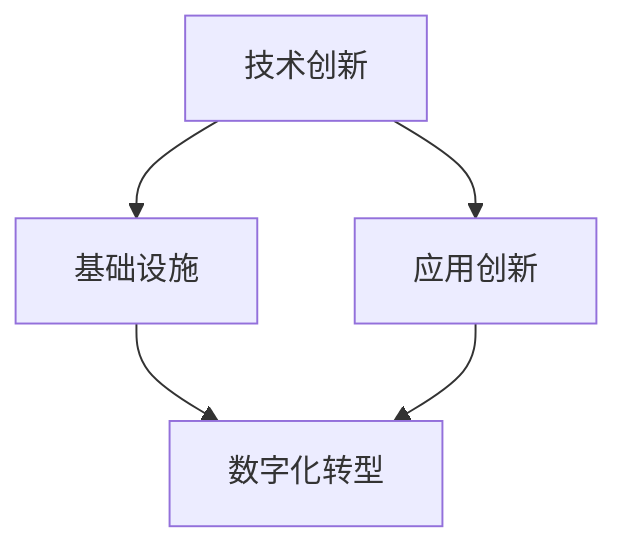

                 

# 技术创新与数字化转型的结合

## 关键词
技术创新、数字化转型、AI、大数据、云计算、区块链、网络安全、业务流程优化

## 摘要
本文深入探讨了技术创新与数字化转型的结合，旨在揭示这两者在当今快速发展的IT领域中的核心作用。通过逐步分析，我们将理解如何通过技术创新推动数字化转型，以及如何利用数字化技术提升业务效率与竞争力。本文将涵盖从核心概念介绍到实际应用案例的全面解析，帮助读者掌握这一领域的前沿知识。

## 1. 背景介绍

### 1.1 目的和范围
本文旨在探讨技术创新与数字化转型之间的密切关系，分析它们在现代社会中的重要性，并探讨如何通过技术手段实现数字化转型。文章将涵盖以下几个主要方面：
- 技术创新的定义与类型
- 数字化转型的概念与目标
- 技术创新在数字化转型中的应用
- 数字化转型对业务流程和运营模式的影响
- 成功的数字化转型案例研究

### 1.2 预期读者
本文适合对技术创新和数字化转型感兴趣的IT专业人士、企业管理者以及学术研究人员。对于希望了解技术如何推动业务变革的读者，本文提供了深入的分析和实用的建议。

### 1.3 文档结构概述
本文分为十个部分，包括：
- 引言
- 背景介绍
- 核心概念与联系
- 核心算法原理与具体操作步骤
- 数学模型与公式
- 项目实战
- 实际应用场景
- 工具和资源推荐
- 总结：未来发展趋势与挑战
- 附录：常见问题与解答
- 扩展阅读与参考资料

### 1.4 术语表
#### 1.4.1 核心术语定义
- 技术创新：通过引入新的技术或改进现有技术，以创造新的产品、服务或业务模式。
- 数字化转型：将传统业务流程、运营模式和客户互动转移到数字平台上，以提高效率、降低成本和增强用户体验。
- 人工智能（AI）：模拟人类智能行为的技术，包括机器学习、深度学习、自然语言处理等。
- 大数据：大量、多样、快速的数据，需要使用特殊的处理方法来提取有价值的信息。
- 云计算：通过网络提供计算资源、存储资源和应用程序，以按需使用的方式交付。
- 区块链：分布式数据库技术，用于创建安全的、不可篡改的交易记录。
- 网络安全：保护计算机系统、网络和数据不受未经授权的访问、破坏或泄露。
- 业务流程优化：通过分析业务流程，识别和消除不必要的步骤或瓶颈，以提高效率和效果。

#### 1.4.2 相关概念解释
- 数字化技术：包括云计算、大数据、物联网（IoT）、人工智能等，这些技术可以支持数字化转型。
- 用户体验（UX）：用户在使用产品或服务时的感受和体验，是数字化转型的关键关注点。

#### 1.4.3 缩略词列表
- AI：人工智能
- IoT：物联网
- ML：机器学习
- DL：深度学习
- UX：用户体验
- IT：信息技术
- GDPR：通用数据保护条例
- API：应用程序编程接口
- SaaS：软件即服务

## 2. 核心概念与联系

在深入探讨技术创新与数字化转型的结合之前，我们需要明确一些核心概念及其相互联系。

### 2.1 技术创新

技术创新是指通过引入新的技术或改进现有技术，以创造新的产品、服务或业务模式。技术创新的类型包括：

1. **渐进式创新**：在现有产品或服务上进行的微小改进，以增强性能或降低成本。
2. **颠覆式创新**：引入全新的技术，彻底改变现有的市场格局和用户体验。
3. **组合创新**：将多种技术组合起来，创造新的解决方案或业务模式。

技术创新通常涉及以下几个关键步骤：

1. **需求识别**：确定用户需求和市场机会。
2. **概念验证**：开发原型或模型，验证技术可行性。
3. **设计和开发**：进行详细设计，开发出产品或服务。
4. **测试与迭代**：对原型进行测试，收集用户反馈，不断迭代改进。

### 2.2 数字化转型

数字化转型是指将传统业务流程、运营模式和客户互动转移到数字平台上，以提高效率、降低成本和增强用户体验。数字化转型通常涉及以下几个方面：

1. **流程优化**：通过自动化和优化业务流程，提高效率和效果。
2. **数据驱动决策**：利用大数据和人工智能技术，从海量数据中提取有价值的信息，支持决策过程。
3. **用户体验提升**：通过数字平台和工具，改善用户与产品或服务的互动方式。
4. **商业模式创新**：通过数字化技术，创造新的收入来源和业务模式。

### 2.3 技术创新与数字化转型的联系

技术创新和数字化转型之间存在紧密的联系。技术创新是数字化转型的驱动力，而数字化转型则是技术创新的落脚点。

1. **技术创新推动数字化转型**：
   - 新技术的引入，如云计算、大数据和人工智能，为数字化转型提供了基础设施和技术支持。
   - 技术创新加速了数字化转型的进程，使企业能够更快地适应市场变化和用户需求。

2. **数字化转型促进技术创新**：
   - 数字化转型推动了技术的应用和创新，促进了新技术的开发。
   - 数字化转型带来了新的业务模式和市场机会，激发了技术创新的潜力。

为了更直观地理解技术创新与数字化转型的联系，我们可以使用Mermaid流程图来展示它们之间的相互作用。



在这个流程图中，技术创新分为基础设施和应用创新两部分。基础设施创新提供了技术支持，如云计算、大数据和人工智能；应用创新则是将新技术应用于实际业务场景，推动数字化转型。

## 3. 核心算法原理 & 具体操作步骤

在探讨技术创新与数字化转型的结合时，核心算法原理的理解和实施步骤至关重要。以下是一个基于机器学习的推荐系统算法的例子，该算法可以应用于数字化转型中的个性化推荐场景。

### 3.1 算法原理

推荐系统是一种基于用户历史行为和偏好来预测用户可能感兴趣的项目（如商品、音乐、电影等）的算法。以下是推荐系统的一个简化版本，使用协同过滤算法（Collaborative Filtering）来实现。

协同过滤算法主要分为两种类型：
1. **用户基于的协同过滤（User-based Collaborative Filtering）**：
   - 根据用户之间的相似度来推荐项目。
   - 选择与目标用户相似的用户，推荐这些用户喜欢的项目。

2. **项基于的协同过滤（Item-based Collaborative Filtering）**：
   - 根据项目之间的相似度来推荐用户。
   - 选择与目标项目相似的项目，推荐给这些项目的用户。

以下是一个用户基于的协同过滤算法的伪代码：

```plaintext
# 伪代码：用户基于的协同过滤算法

function recommendItemsForUser(current_user, all_user_ratings, neighborhood_size):
    # 计算当前用户与其他用户的相似度
    similarity_matrix = calculateSimilarityMatrix(all_user_ratings)

    # 选择与当前用户最相似的neighborhood_size个用户
    neighborhood = selectNeighborhood(current_user, similarity_matrix, neighborhood_size)

    # 计算邻居用户对项目的评分
    neighbor_ratings = getAllRatingsOfUsersInNeighborhood(neighborhood, all_user_ratings)

    # 对邻居用户喜欢的项目进行加权平均推荐
    recommended_items = calculateWeightedAverageRecommendation(current_user, neighbor_ratings)

    return recommended_items
```

### 3.2 具体操作步骤

以下是实施用户基于的协同过滤算法的具体操作步骤：

1. **数据准备**：
   - 收集用户的历史行为数据，如购买记录、浏览记录、评分等。
   - 构建用户-项目评分矩阵。

2. **相似度计算**：
   - 计算用户之间的相似度，通常使用余弦相似度或皮尔逊相关系数。

3. **选择邻居用户**：
   - 根据相似度矩阵，选择与当前用户最相似的neighborhood_size个用户作为邻居。

4. **计算邻居用户评分**：
   - 获取邻居用户对项目的评分。

5. **加权平均推荐**：
   - 对邻居用户喜欢的项目进行加权平均，生成推荐列表。

6. **推荐生成**：
   - 根据推荐算法生成的推荐列表，向用户展示推荐项目。

通过上述步骤，我们可以将机器学习算法应用于数字化转型中的推荐系统，实现个性化的用户体验。

## 4. 数学模型和公式 & 详细讲解 & 举例说明

在技术创新与数字化转型的结合中，数学模型和公式扮演着关键角色，尤其是在大数据分析和人工智能算法的实现过程中。以下我们将介绍几个核心的数学模型和公式，并给出详细的讲解和举例说明。

### 4.1 余弦相似度（Cosine Similarity）

余弦相似度是一种衡量两个向量之间相似度的度量，广泛应用于文本相似性分析、推荐系统等领域。其公式如下：

\[ \text{cosine\_similarity} = \frac{\text{dot\_product}}{\|\mathbf{a}\|\|\mathbf{b}\|} \]

其中，\(\mathbf{a}\)和\(\mathbf{b}\)是两个向量，\(|\mathbf{a}|\)和\(|\mathbf{b}|\)是它们的模（长度），点乘（dot product）表示两个向量的内积。

**举例说明**：
假设有两个向量\(\mathbf{a} = (1, 2, 3)\)和\(\mathbf{b} = (4, 5, 6)\)，它们的余弦相似度计算如下：

\[ \text{cosine\_similarity}(\mathbf{a}, \mathbf{b}) = \frac{1 \cdot 4 + 2 \cdot 5 + 3 \cdot 6}{\sqrt{1^2 + 2^2 + 3^2} \cdot \sqrt{4^2 + 5^2 + 6^2}} = \frac{4 + 10 + 18}{\sqrt{14} \cdot \sqrt{77}} \approx 0.902 \]

### 4.2 皮尔逊相关系数（Pearson Correlation Coefficient）

皮尔逊相关系数用于衡量两个变量之间的线性相关程度，其公式如下：

\[ \text{pearson\_correlation} = \frac{\text{covariance}(x, y)}{\sigma_x \sigma_y} \]

其中，\(x\)和\(y\)是两个变量，\(\text{covariance}(x, y)\)是协方差，\(\sigma_x\)和\(\sigma_y\)是标准差。

**举例说明**：
假设有两个变量\(x\)和\(y\)，其均值和标准差如下：

\[ \bar{x} = 50, \bar{y} = 60 \]
\[ \sigma_x = 10, \sigma_y = 15 \]
\[ \text{covariance}(x, y) = 50 \]

则皮尔逊相关系数计算如下：

\[ \text{pearson\_correlation} = \frac{50}{10 \cdot 15} = 0.333 \]

### 4.3 梯度下降（Gradient Descent）

梯度下降是一种优化算法，用于求解机器学习模型中的参数。其基本思想是沿着损失函数的梯度方向反向更新参数，以减少损失。

\[ \theta = \theta - \alpha \cdot \nabla_\theta J(\theta) \]

其中，\(\theta\)是模型参数，\(\alpha\)是学习率，\(\nabla_\theta J(\theta)\)是损失函数\(J(\theta)\)对参数\(\theta\)的梯度。

**举例说明**：
假设我们有一个线性回归模型，损失函数为：

\[ J(\theta) = \frac{1}{2m} \sum_{i=1}^{m} (h_\theta(x^{(i)}) - y^{(i)})^2 \]

其中，\(h_\theta(x) = \theta_0 + \theta_1 x\)是模型预测，\(y^{(i)}\)是实际值。

假设我们有如下参数和梯度：

\[ \theta_0 = 0, \theta_1 = 1 \]
\[ \nabla_\theta J(\theta) = (-2 \cdot 1, -2 \cdot 1) = (-2, -2) \]

学习率为0.1，则参数更新如下：

\[ \theta_0 = 0 - 0.1 \cdot (-2) = 0.2 \]
\[ \theta_1 = 1 - 0.1 \cdot (-2) = 1.2 \]

通过梯度下降，我们可以逐步优化模型参数，以减少损失。

通过上述数学模型和公式的讲解与举例，我们可以更好地理解技术创新在数字化转型中的应用，尤其是在大数据分析和机器学习领域。

## 5. 项目实战：代码实际案例和详细解释说明

为了更好地展示技术创新与数字化转型的结合，我们将在本节中通过一个实际项目案例，详细解释如何使用Python和相关的库（如TensorFlow和Scikit-learn）来实现一个基于机器学习的推荐系统。

### 5.1 开发环境搭建

在进行项目开发之前，我们需要搭建一个合适的开发环境。以下是所需步骤：

1. **安装Python**：确保安装了Python 3.7及以上版本。
2. **安装Jupyter Notebook**：Jupyter Notebook是一个交互式开发环境，方便我们编写和运行代码。
   ```shell
   pip install notebook
   ```
3. **安装相关库**：安装用于机器学习的数据处理和模型训练的库，如TensorFlow、Scikit-learn和Pandas。
   ```shell
   pip install tensorflow scikit-learn pandas numpy
   ```

### 5.2 源代码详细实现和代码解读

以下是一个简单的用户基于协同过滤推荐系统的实现，包括数据预处理、模型训练和推荐生成。

```python
import numpy as np
import pandas as pd
from sklearn.metrics.pairwise import cosine_similarity
from sklearn.model_selection import train_test_split

# 5.2.1 数据准备
def loadData():
    # 这里使用一个示例数据集，实际项目中可以使用实际的用户-项目评分数据
    data = {
        'user_id': [1, 1, 2, 2, 3, 3],
        'item_id': [1001, 1001, 1002, 1002, 1001, 1003],
        'rating': [5, 3, 4, 2, 5, 1]
    }
    return pd.DataFrame(data)

# 5.2.2 相似度计算
def calculateSimilarityMatrix(data, similarity='cosine'):
    # 构建用户-项目评分矩阵
    rating_matrix = data.pivot(index='user_id', columns='item_id', values='rating').fillna(0).values
    
    # 计算用户之间的相似度矩阵
    if similarity == 'cosine':
        similarity_matrix = cosine_similarity(rating_matrix)
    elif similarity == 'euclidean':
        similarity_matrix = 1 / (np.linalg.norm(rating_matrix, axis=1)[:, np.newaxis] + np.linalg.norm(rating_matrix, axis=0)[np.newaxis, :])
    return similarity_matrix

# 5.2.3 推荐生成
def generateRecommendations(current_user, similarity_matrix, neighborhood_size, data, top_n=5):
    # 获取当前用户与其他用户的相似度
    user_similarity = similarity_matrix[current_user-1]

    # 计算邻居用户的平均评分
    neighbor_ratings = data[['item_id', 'rating']].set_index('item_id').T.multiply(user_similarity, axis=0).sum().sort_values(ascending=False)

    # 排除当前用户已评分的项目
    rated_items = set(data[data['user_id'] == current_user]['item_id'])
    neighbor_ratings = neighbor_ratings[neighbor_ratings.index.isin(rated_items) == False]

    # 生成推荐列表
    return neighbor_ratings.head(top_n).index.tolist()

# 5.2.4 主函数
def main():
    data = loadData()
    similarity_matrix = calculateSimilarityMatrix(data, similarity='cosine')
    
    # 选择用户进行推荐
    current_user = 2
    neighborhood_size = 3
    recommendations = generateRecommendations(current_user, similarity_matrix, neighborhood_size, data)
    
    print(f"Recommendations for user {current_user}: {recommendations}")

if __name__ == "__main__":
    main()
```

### 5.3 代码解读与分析

1. **数据准备**：
   - `loadData()`函数用于加载示例数据集，这里我们使用一个简单的DataFrame，其中包含用户ID、项目ID和评分。在实际项目中，可以使用实际的用户-项目评分数据。

2. **相似度计算**：
   - `calculateSimilarityMatrix()`函数用于计算用户之间的相似度矩阵。这里我们使用余弦相似度，也可以选择其他相似度度量方法，如欧氏距离。相似度矩阵反映了用户之间的相似程度，相似度越高，推荐效果越好。

3. **推荐生成**：
   - `generateRecommendations()`函数根据当前用户的相似度矩阵和邻居用户的平均评分生成推荐列表。它首先计算邻居用户的平均评分，然后排除当前用户已评分的项目，最终生成推荐列表。

4. **主函数**：
   - `main()`函数是程序的入口点，它首先加载数据，计算相似度矩阵，然后为指定的用户生成推荐列表并打印输出。

通过这个简单的项目案例，我们可以看到如何使用Python和机器学习技术实现一个推荐系统。这个系统可以帮助企业实现个性化推荐，提高用户满意度和转化率。

## 6. 实际应用场景

技术创新与数字化转型的结合在多个实际应用场景中展现出了强大的潜力和优势。以下是一些关键的应用领域和案例：

### 6.1 零售业

在零售业中，数字化转型已经极大地改变了购物体验。通过使用人工智能和大数据分析，零售商能够实现个性化推荐，预测消费者行为，并优化库存管理。

- **案例**：亚马逊使用AI算法分析用户的购物历史和行为模式，为每个用户生成个性化的产品推荐。这种推荐系统能够显著提高客户的购买转化率，同时也帮助亚马逊增加了收入。

### 6.2 金融业

金融业一直是技术创新的前沿领域，数字化转型在金融服务中扮演着关键角色。

- **案例**：银行利用区块链技术实现了更安全、透明的交易流程，减少了交易欺诈和错误。同时，通过人工智能和大数据分析，银行能够更准确地评估信用风险，为贷款审批提供支持。

### 6.3 健康护理

在健康护理领域，数字化技术已经大大提高了医疗服务的质量和效率。

- **案例**：通过电子健康记录（EHR）系统，医生能够快速访问患者的医疗历史，提高了诊断的准确性和效率。此外，基于人工智能的医疗诊断系统可以帮助医生更快速地识别疾病，提供个性化的治疗方案。

### 6.4 制造业

制造业中的数字化转型通过自动化和物联网技术实现了生产过程的优化。

- **案例**：通用电气（GE）通过其“工业互联网”平台，将传感器和数据分析技术应用于制造过程，实现了预测性维护。这种技术能够提前识别设备故障，减少停机时间，提高生产效率。

### 6.5 教育

在教育领域，数字化转型提供了新的学习方式和资源。

- **案例**：在线学习平台（如Coursera、edX）利用大数据和人工智能技术，根据学习者的行为和进度提供个性化的学习建议。这些平台还能够实时分析学生的学习效果，帮助教育工作者优化课程设计。

### 6.6 物流与供应链

物流和供应链管理中的数字化转型通过实时监控和数据分析，提高了供应链的效率和灵活性。

- **案例**：亚马逊的物流网络利用云计算和大数据分析，实现了高效的库存管理和配送调度。这种技术不仅提高了物流速度，还降低了运营成本。

通过上述案例，我们可以看到技术创新与数字化转型在各个行业中的应用，不仅提升了业务效率，还创造了新的商业模式和价值。

## 7. 工具和资源推荐

在实现技术创新与数字化转型过程中，选择合适的工具和资源至关重要。以下是我们推荐的几类资源和工具，包括学习资源、开发工具框架以及相关论文著作。

### 7.1 学习资源推荐

#### 7.1.1 书籍推荐
- 《深度学习》（Deep Learning） - Goodfellow, Bengio, Courville
- 《机器学习实战》（Machine Learning in Action） - Kleinberg, Lu
- 《大数据时代》（Big Data: A Revolution That Will Transform How We Live, Work, and Think） - Viktor Mayer-Schönberger, Kenneth Cukier

#### 7.1.2 在线课程
- Coursera的《机器学习》课程 - 吴恩达（Andrew Ng）教授主讲
- edX的《深度学习》课程 - 李飞飞（Fei-Fei Li）教授主讲
- Udacity的《人工智能纳米学位》

#### 7.1.3 技术博客和网站
- Medium上的机器学习和大数据相关博客
- towardsdatascience.com，一个专注于数据科学和机器学习的社区
- AI Space Factory，提供AI和机器学习相关的新闻、教程和项目

### 7.2 开发工具框架推荐

#### 7.2.1 IDE和编辑器
- PyCharm：一款功能强大的Python IDE，适合进行机器学习和数据分析项目。
- Jupyter Notebook：一个交互式的开发环境，特别适合数据科学和机器学习项目。

#### 7.2.2 调试和性能分析工具
- Python Debugger（pdb）：Python内置的调试工具。
- Visual Studio Code + Python扩展：一个轻量级但功能强大的编辑器，适合进行Python开发。

#### 7.2.3 相关框架和库
- TensorFlow：一个开源的机器学习框架，适用于各种深度学习任务。
- Scikit-learn：一个开源的机器学习库，提供了多种常见的机器学习算法和工具。
- Pandas：一个强大的数据分析和操作库，特别适合处理大数据集。

### 7.3 相关论文著作推荐

#### 7.3.1 经典论文
- "A Learning Algorithm for Continually Running Fully Recurrent Neural Networks" - Paul Werbos
- "Backpropagation Through Time: A New Method for Backpropagation on a General Class of Recurrent Neural Networks" - Jürgen Schmidhuber

#### 7.3.2 最新研究成果
- "Attention Is All You Need" - Vaswani et al., 2017
- "The Annotated Transformer" - Michael Auli, 2018

#### 7.3.3 应用案例分析
- "Deep Learning in Healthcare" - Hashim et al., 2018
- "The Application of Blockchain Technology in Financial Services" - Chen et al., 2016

这些资源为希望深入了解技术创新与数字化转型的读者提供了宝贵的指导和实践机会。

## 8. 总结：未来发展趋势与挑战

技术创新与数字化转型的结合正在塑造现代社会的方方面面，其未来发展具有巨大的潜力，但也面临诸多挑战。

### 8.1 未来发展趋势

1. **人工智能的深入应用**：随着深度学习技术的不断进步，人工智能将在更多领域得到广泛应用，从自动化决策到智能医疗，从智能交通到智能家居。

2. **数据隐私与安全**：随着数字化程度的加深，数据隐私和安全问题将越来越受到重视。企业和政府需要采取更严格的措施来保护用户数据，以避免数据泄露和滥用。

3. **跨领域融合**：不同行业之间的技术融合将更加紧密，如健康护理与物联网、金融与区块链的结合等，这将创造新的商业机会和产业形态。

4. **边缘计算与云计算的协同**：为了应对日益增长的数据处理需求，边缘计算将与云计算协同工作，实现实时数据处理和分析。

### 8.2 未来挑战

1. **技术瓶颈**：尽管人工智能和大数据等技术取得了显著进展，但仍然存在一些技术瓶颈，如计算能力、数据质量和算法复杂性等。

2. **人才短缺**：随着数字化转型的推进，对技术人才的需求日益增长，但现有的教育和培训体系可能无法满足这一需求，导致人才短缺。

3. **伦理问题**：人工智能和大数据的应用引发了一系列伦理问题，如算法偏见、隐私侵犯和自动化决策的道德责任等。

4. **政策与法规**：数字化转型需要相应的政策和法规支持，以规范数据交易、保护隐私和安全。然而，不同国家和地区之间的法规差异可能导致合规难题。

总之，技术创新与数字化转型的结合带来了前所未有的机遇，但也需要我们应对一系列挑战，以实现技术进步与社会发展的和谐共存。

## 9. 附录：常见问题与解答

### 9.1 什么是数字化转型？

数字化转型是将传统的业务流程、运营模式和客户互动转移到数字平台上的过程，以实现更高的效率、降低成本和提升用户体验。

### 9.2 技术创新如何推动数字化转型？

技术创新提供了实现数字化转型的技术基础和工具，如人工智能、大数据分析、云计算和区块链等，它们能够提高业务流程的自动化水平、优化数据管理和增强用户体验。

### 9.3 数字化转型的主要目标是什么？

数字化转型的主要目标是提高业务效率、降低运营成本、增强客户满意度和创造新的收入来源。

### 9.4 如何评估数字化转型的成功？

数字化转型的成功可以通过以下指标来评估：业务流程的自动化程度、数据利用效率、客户满意度和业务绩效（如收入增长和成本降低）。

### 9.5 数字化转型中面临的主要挑战是什么？

数字化转型的挑战包括技术瓶颈、人才短缺、伦理问题、政策与法规的不确定性以及数据隐私和安全问题。

## 10. 扩展阅读 & 参考资料

为了深入了解技术创新与数字化转型的结合，以下是一些推荐的扩展阅读和参考资料：

### 10.1 技术创新

- 《创新者的窘境》（The Innovator's Dilemma）- 克里斯·安德森（Chris Anderson）
- 《颠覆性创新》（Disruptive Technologies: Catching the Wave）- 马克·R·威尔逊（Mark R. Wilson）

### 10.2 数字化转型

- 《数字化管理：如何在数字化世界中领导和管理》（Digital Management: Leading in the Age of Data）- 斯蒂芬·道博（Stephen Dobson）
- 《数字化转型：从战略到执行》（Digital Transformation: Strategy, People, and Technology）- 瑞恩·波特（Ryan Potter）

### 10.3 AI与大数据

- 《AI超纪元：人工智能如何重新定义世界》（The Age of AI: How Intelligent Machines Can Create a World Without Work or Waste）- 瑞克斯·沃尔夫（Rex Woolworth）
- 《大数据时代：生活、工作与思维的大变革》（Big Data: A Revolution That Will Transform How We Live, Work, and Think）- 维克托·迈尔-舍恩伯格（Viktor Mayer-Schönberger），肯尼思·库克耶（Kenneth Cukier）

### 10.4 云计算与区块链

- 《云计算架构：从概念到实践》（Cloud Computing Architecture: From Concept to Practice）- 约书亚·霍普（Joshua Hoffine）
- 《区块链革命：如何利用区块链技术重塑商业》（The Blockchain Revolution: How the Technology Behind Bitcoin Is Changing Money, Business, and the World）- 唐·塔普斯科特（Don Tapscott），亚历克斯·塔普斯科特（Alex Tapscott）

这些资源为读者提供了深入的技术见解和实用的指导，有助于更好地理解技术创新与数字化转型的结合。

