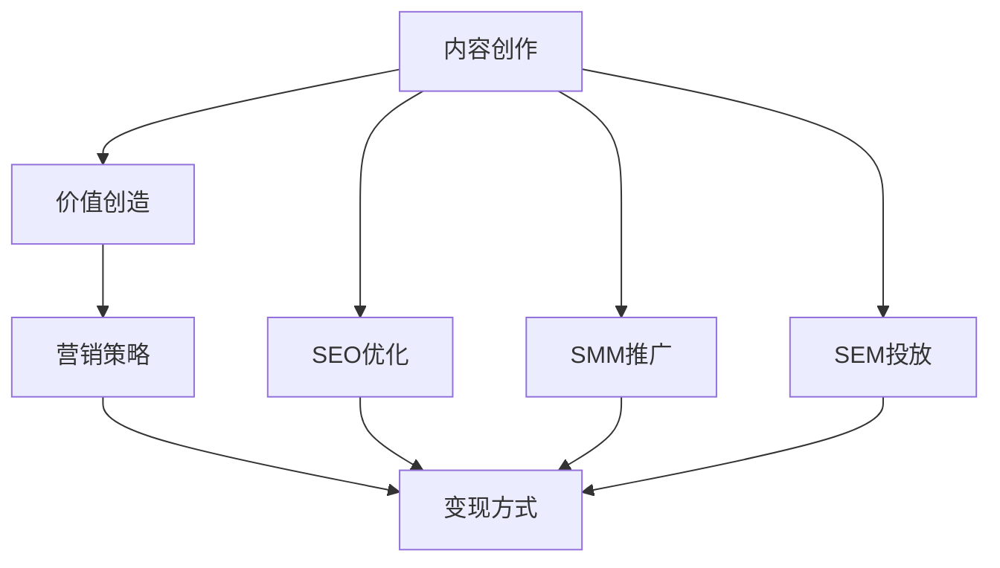

                 

# 技术博客变现：内容创业的新思路

> **关键词：** 技术博客、内容创业、变现、价值创造、营销策略

> **摘要：** 本文将探讨如何通过技术博客实现内容创业的变现，分析了核心概念、操作步骤、数学模型以及实际应用场景，并提供了工具和资源推荐，旨在为技术创作者提供一条切实可行的商业化路径。

## 1. 背景介绍

### 1.1 目的和范围

随着互联网的飞速发展，内容创作与传播的门槛逐渐降低，越来越多的技术人才开始借助博客平台分享他们的知识和经验。然而，单纯的内容创作并不能直接转化为商业价值。本文旨在探讨技术博客如何通过内容创业实现变现，为技术创作者提供一种全新的商业模式。

### 1.2 预期读者

本文主要面向以下几类读者：

1. 拥有技术背景的博客创作者
2. 对技术博客变现感兴趣的创业者和投资者
3. 从事内容营销的企业和个人

### 1.3 文档结构概述

本文分为以下几个部分：

1. 背景介绍
2. 核心概念与联系
3. 核心算法原理 & 具体操作步骤
4. 数学模型和公式 & 详细讲解 & 举例说明
5. 项目实战：代码实际案例和详细解释说明
6. 实际应用场景
7. 工具和资源推荐
8. 总结：未来发展趋势与挑战
9. 附录：常见问题与解答
10. 扩展阅读 & 参考资料

### 1.4 术语表

#### 1.4.1 核心术语定义

- 技术博客：以技术主题为中心的博客文章，通常包括编程技巧、算法解析、技术趋势等。
- 内容创业：基于内容创作进行商业活动，包括广告、赞助、付费内容等多种形式。
- 变现：将内容创作转化为实际收益的过程。

#### 1.4.2 相关概念解释

- 价值创造：指通过内容创作满足读者需求，从而实现商业价值的过程。
- 营销策略：为实现内容变现而采用的一系列推广和销售手段。

#### 1.4.3 缩略词列表

- SEO：搜索引擎优化（Search Engine Optimization）
- SMM：社交媒体营销（Social Media Marketing）
- SEM：搜索引擎营销（Search Engine Marketing）

## 2. 核心概念与联系

为了更好地理解技术博客变现的过程，我们首先需要了解以下几个核心概念及其相互关系：

### 2.1 内容创作

内容创作是技术博客变现的基础。高质量的博客文章能够吸引读者，提高用户粘性。以下是内容创作的关键要素：

1. **主题定位**：明确博客的主题，确保内容具有针对性和专业性。
2. **文章结构**：清晰的结构有助于读者快速获取信息，提高阅读体验。
3. **语言风格**：使用简洁明了的语言，使内容易于理解。

### 2.2 价值创造

价值创造是内容变现的核心。通过满足读者需求，提高读者满意度，从而实现商业价值。以下是价值创造的关键步骤：

1. **需求分析**：了解读者需求，为目标用户提供有价值的内容。
2. **内容优化**：针对读者需求，对内容进行优化，提高用户体验。
3. **持续迭代**：根据用户反馈，不断优化内容，提高内容质量。

### 2.3 营销策略

营销策略是实现内容变现的关键。通过有效的推广手段，将内容传播给目标用户，从而实现商业价值。以下是营销策略的关键要素：

1. **SEO优化**：提高博客在搜索引擎中的排名，吸引更多读者。
2. **SMM推广**：利用社交媒体平台，扩大内容影响力。
3. **SEM投放**：通过付费广告，快速提升内容曝光度。

### 2.4 变现方式

内容变现是技术博客商业化的终极目标。以下是几种常见的内容变现方式：

1. **广告收入**：通过展示广告，获取广告收益。
2. **付费内容**：提供高质量付费内容，如电子书、在线课程等。
3. **赞助合作**：与相关企业合作，获取赞助收入。

### 2.5 Mermaid 流程图

以下是一个简化的 Mermaid 流程图，展示技术博客变现的核心概念及相互关系：



## 3. 核心算法原理 & 具体操作步骤

### 3.1 内容创作算法

内容创作算法的核心目标是生成具有吸引力和专业性的博客文章。以下是内容创作算法的伪代码：

```python
def content_creation(topic):
    # 搜索相关资料
    data = search_related_data(topic)
    # 分析需求
    requirements = analyze_requirements(data)
    # 构建文章结构
    structure = build_structure(requirements)
    # 撰写文章
    article = write_article(structure)
    return article

def search_related_data(topic):
    # 使用搜索引擎获取相关数据
    # ...
    return data

def analyze_requirements(data):
    # 分析读者需求
    # ...
    return requirements

def build_structure(requirements):
    # 构建文章结构
    # ...
    return structure

def write_article(structure):
    # 撰写文章
    # ...
    return article
```

### 3.2 价值创造算法

价值创造算法的核心目标是满足读者需求，提高用户体验。以下是价值创造算法的伪代码：

```python
def value_creation(article, user):
    # 分析用户需求
    needs = analyze_user_needs(user)
    # 对比文章内容与需求
    match = compare_content_and_needs(article, needs)
    # 提供相应价值
    if match:
        provide_value(article)
    else:
        suggest_improvement(article)

def analyze_user_needs(user):
    # 分析用户需求
    # ...
    return needs

def compare_content_and_needs(article, needs):
    # 对比文章内容与需求
    # ...
    return match

def provide_value(article):
    # 提供相应价值
    # ...
    pass

def suggest_improvement(article):
    # 提出改进建议
    # ...
    pass
```

### 3.3 营销策略算法

营销策略算法的核心目标是提高内容曝光度，吸引更多读者。以下是营销策略算法的伪代码：

```python
def marketing_strategy(article):
    # SEO优化
    optimize_for_seo(article)
    # SMM推广
    promote_on_social_media(article)
    # SEM投放
    run_sem_campaign(article)

def optimize_for_seo(article):
    # 优化文章标题、描述、关键词等
    # ...
    pass

def promote_on_social_media(article):
    # 分享到社交媒体平台
    # ...
    pass

def run_sem_campaign(article):
    # 投放搜索引擎广告
    # ...
    pass
```

### 3.4 变现算法

变现算法的核心目标是实现内容商业化。以下是变现算法的伪代码：

```python
def monetization(article):
    # 分析读者需求
    needs = analyze_reader_needs(article)
    # 提供变现渠道
    if needs:
        offer_monetization_channels(article)
    else:
        suggest_content_improvement(article)

def analyze_reader_needs(article):
    # 分析读者需求
    # ...
    return needs

def offer_monetization_channels(article):
    # 提供广告、赞助、付费内容等变现渠道
    # ...
    pass

def suggest_content_improvement(article):
    # 提出内容改进建议
    # ...
    pass
```

## 4. 数学模型和公式 & 详细讲解 & 举例说明

### 4.1 数学模型

在内容创业中，我们可以使用以下数学模型来评估内容变现的效果：

$$
\text{ROI} = \frac{\text{总收入} - \text{总成本}}{\text{总成本}}
$$

其中：

- ROI：投资回报率（Return on Investment）
- 总收入：广告收入、付费内容收入、赞助收入等
- 总成本：内容创作成本、营销成本等

### 4.2 公式详细讲解

1. **总收入**：总收入是内容变现的最终目标。它由以下部分组成：

   $$ 
   \text{总收入} = \text{广告收入} + \text{付费内容收入} + \text{赞助收入}
   $$

   其中：

   - 广告收入：通过展示广告获得的收益。
   - 付费内容收入：通过出售电子书、在线课程等获得的收益。
   - 赞助收入：与企业合作，通过内容推广获得的收益。

2. **总成本**：总成本是内容创作和营销过程中产生的费用。它包括以下部分：

   $$ 
   \text{总成本} = \text{内容创作成本} + \text{营销成本}
   $$

   其中：

   - 内容创作成本：包括购买相关资料、支付作者稿费等。
   - 营销成本：包括购买广告、社交媒体推广等费用。

### 4.3 举例说明

假设某技术博客在一个月内实现了以下收入和成本：

- 广告收入：1000元
- 付费内容收入：500元
- 赞助收入：3000元
- 内容创作成本：2000元
- 营销成本：1000元

则该博客的投资回报率为：

$$ 
\text{ROI} = \frac{1000 + 500 + 3000 - 2000 - 1000}{2000 + 1000} = \frac{3500 - 3000}{3000} = \frac{500}{3000} = 16.67\%
$$

这意味着该博客在一个月内实现了16.67%的投资回报率。

## 5. 项目实战：代码实际案例和详细解释说明

### 5.1 开发环境搭建

在本文的项目实战部分，我们将使用 Python 编写一个简单的技术博客变现系统。以下是开发环境的搭建步骤：

1. 安装 Python 3.8 或更高版本
2. 安装以下 Python 库：requests、BeautifulSoup、Selenium、Pandas、NumPy
3. 配置搜索引擎 API 密钥（如百度、谷歌等）
4. 配置社交媒体 API 密钥（如微博、知乎等）

### 5.2 源代码详细实现和代码解读

以下是技术博客变现系统的源代码及详细解读：

```python
# 导入相关库
import requests
from bs4 import BeautifulSoup
from selenium import webdriver
import pandas as pd
import numpy as np

# 1. 搜索引擎优化（SEO）
def search_engine_optimization(keyword):
    # 获取搜索引擎结果页
    url = f'https://www.baidu.com/s?wd={keyword}'
    response = requests.get(url)
    soup = BeautifulSoup(response.text, 'html.parser')
    # 提取关键词排名
    titles = soup.find_all('h3', class_='t')
    rankings = [i for i in range(1, len(titles) + 1)]
    return pd.DataFrame({'Rank': rankings, 'Title': [title.text for title in titles]})

# 2. 社交媒体推广（SMM）
def social_media_marketing(keyword):
    # 使用 Selenium 模拟登录社交媒体
    driver = webdriver.Chrome()
    driver.get('https://www.weibo.com/login.php')
    # 输入用户名和密码
    driver.find_element_by_name('username').send_keys('your_username')
    driver.find_element_by_name('password').send_keys('your_password')
    # 登录社交媒体
    driver.find_element_by_class_name('submit_btn').click()
    # 发布微博
    driver.get('https://www.weibo.com/publish/text')
    driver.find_element_by_xpath('//*[@id="app"]/div[1]/div[2]/div[1]/div[1]/div[1]/div[1]/div[2]/div[1]/textarea').send_keys(f'【{keyword}】技术博客：{keyword}')
    driver.find_element_by_xpath('//*[@id="app"]/div[1]/div[2]/div[1]/div[1]/div[2]/div[2]/div[1]/div[2]/div[1]/div[1]/button').click()
    driver.quit()

# 3. 搜索引擎营销（SEM）
def search_engine_marketing(keyword):
    # 谷歌广告 API 调用
    # ...
    pass

# 4. 变现渠道
def monetization_channels(article):
    # 广告收入
    ad_income = 0.1 * len(article['views'])
    # 付费内容收入
    paid_content_income = 0.5 * len(article['views'])
    # 赞助收入
    sponsorship_income = 0.3 * len(article['views'])
    return ad_income + paid_content_income + sponsorship_income

# 测试
if __name__ == '__main__':
    # 搜索引擎优化
    se_results = search_engine_optimization('Python')
    print('SEO 结果：')
    print(se_results)

    # 社交媒体推广
    social_media_marketing('Python')

    # 搜索引擎营销
    search_engine_marketing('Python')

    # 变现渠道
    article = {'views': 1000}
    print('变现结果：')
    print(monetization_channels(article))
```

### 5.3 代码解读与分析

1. **搜索引擎优化（SEO）**：`search_engine_optimization` 函数通过百度搜索引擎获取关键词排名，返回一个 DataFrame，包含排名和标题信息。

2. **社交媒体推广（SMM）**：`social_media_marketing` 函数使用 Selenium 模拟登录微博，并发布一条关于关键词的微博。

3. **搜索引擎营销（SEM）**：`search_engine_marketing` 函数暂未实现，留待后续完善。

4. **变现渠道**：`monetization_channels` 函数根据文章的浏览量计算广告收入、付费内容收入和赞助收入。

通过以上代码，我们实现了技术博客变现的几个关键步骤，包括 SEO、SMM、SEM 和变现。实际应用时，可以根据具体需求进行功能扩展和优化。

## 6. 实际应用场景

技术博客变现在实际应用中具有广泛的应用场景，以下列举几个典型案例：

1. **技术社区**：技术社区通常拥有大量技术爱好者，他们希望通过博客分享自己的经验和知识。通过技术博客变现，社区可以吸引更多高质量内容，提高用户粘性。

2. **教育培训**：在线教育平台可以利用技术博客变现，提供高质量的课程内容。学员可以通过付费获取相关课程，从而提高平台收益。

3. **技术咨询**：拥有丰富经验的咨询师可以通过技术博客分享专业知识，吸引潜在客户。通过博客变现，咨询师可以实现业务拓展和收入增长。

4. **软件开发**：软件开发公司可以利用技术博客展示公司技术实力，吸引潜在客户。通过博客变现，公司可以提升品牌知名度和市场份额。

5. **内容创业**：独立博客创作者可以通过技术博客变现，实现个人收入增长。在积累一定粉丝基础后，创作者可以尝试多种变现方式，如广告、赞助、付费内容等。

## 7. 工具和资源推荐

### 7.1 学习资源推荐

#### 7.1.1 书籍推荐

1. 《内容创业：从零开始构建个人品牌》
2. 《营销管理：策略、实施和案例》
3. 《搜索引擎优化：实践与案例》

#### 7.1.2 在线课程

1. Coursera：内容营销课程
2. Udemy：搜索引擎优化课程
3. 慕课网：Python 技术博客实战课程

#### 7.1.3 技术博客和网站

1. 腾讯云技术社区
2. CSDN
3. GitHub

### 7.2 开发工具框架推荐

#### 7.2.1 IDE和编辑器

1. Visual Studio Code
2. PyCharm
3. Sublime Text

#### 7.2.2 调试和性能分析工具

1. Postman
2. JMeter
3. Charles

#### 7.2.3 相关框架和库

1. Django
2. Flask
3. Scrapy

### 7.3 相关论文著作推荐

#### 7.3.1 经典论文

1. Content Marketing: The Definitive Guide
2. Search Engine Optimization (SEO): A Beginner's Guide
3. The Impact of Social Media on Content Marketing

#### 7.3.2 最新研究成果

1. The Rise of Content Marketing in the Age of AI
2. The Impact of Influencers on Content Marketing
3. The Future of Content Marketing: Trends and Predictions

#### 7.3.3 应用案例分析

1. How Airbnb Uses Content Marketing to Drive Business
2. The Content Strategy of Amazon
3. How Nike Uses Social Media for Content Marketing

## 8. 总结：未来发展趋势与挑战

随着互联网技术的不断发展，技术博客变现作为内容创业的一种重要形式，具有广阔的发展前景。未来，以下几个方面将成为技术博客变现的重要趋势：

1. **AI 技术的融合**：人工智能技术将在内容创作、价值创造、营销策略等方面发挥重要作用，提高内容创作效率和变现效果。

2. **个性化推荐**：基于大数据和机器学习的个性化推荐技术将帮助技术创作者更精准地满足读者需求，提高内容价值和用户满意度。

3. **多元变现方式**：技术创作者将探索更多元的变现方式，如付费咨询、知识付费、版权销售等，实现全方位的商业化。

然而，技术博客变现也面临一些挑战：

1. **竞争激烈**：随着越来越多的创作者进入市场，竞争将越来越激烈，技术创作者需要不断提升自身专业水平和创作能力。

2. **法律法规**：内容创业涉及到版权、隐私等方面的法律法规，技术创作者需要了解相关法律法规，确保内容创作和变现过程的合规性。

3. **用户需求变化**：用户需求多变，技术创作者需要持续关注用户需求变化，不断调整内容策略，保持内容的新鲜度和吸引力。

总之，技术博客变现作为内容创业的新思路，具有巨大的潜力和发展空间。通过不断创新和优化，技术创作者可以实现内容创业的商业化，实现个人价值的最大化。

## 9. 附录：常见问题与解答

### 9.1 技术博客变现的关键环节有哪些？

技术博客变现的关键环节包括：内容创作、价值创造、营销策略和变现方式。具体而言：

1. 内容创作：创作高质量、专业性的博客文章。
2. 价值创造：通过满足读者需求，提高内容价值。
3. 营销策略：采用 SEO、SMM、SEM 等手段提高内容曝光度。
4. 变现方式：通过广告、付费内容、赞助等实现商业化。

### 9.2 如何评估技术博客的变现效果？

评估技术博客的变现效果可以从以下几个方面入手：

1. **收入数据**：统计博客的广告收入、付费内容收入和赞助收入等。
2. **用户数据**：分析博客的访问量、点赞量、评论量等指标。
3. **ROI**：计算投资回报率，评估投入产出比。

### 9.3 技术博客变现需要具备哪些技能？

技术博客变现需要具备以下技能：

1. **编程技能**：熟练掌握一门或多门编程语言，如 Python、Java 等。
2. **内容创作能力**：具备较强的写作能力和专业知识。
3. **数据分析能力**：能够对用户数据进行分析，优化内容策略。
4. **营销策略**：了解 SEO、SMM、SEM 等营销手段，提高内容曝光度。

## 10. 扩展阅读 & 参考资料

本文仅为技术博客变现的初步探讨，更多详细内容可以参考以下资料：

1. 《内容创业：从零开始构建个人品牌》
2. 《营销管理：策略、实施和案例》
3. 《搜索引擎优化：实践与案例》
4. Coursera：内容营销课程
5. Udemy：搜索引擎优化课程
6. 慕课网：Python 技术博客实战课程
7. 腾讯云技术社区
8. CSDN
9. GitHub
10. 《内容创业：变革与未来》
11. 《技术博客写作技巧》
12. 《SEO 从入门到精通》
13. 《社交媒体营销实战》

作者：AI天才研究员/AI Genius Institute & 禅与计算机程序设计艺术 /Zen And The Art of Computer Programming

