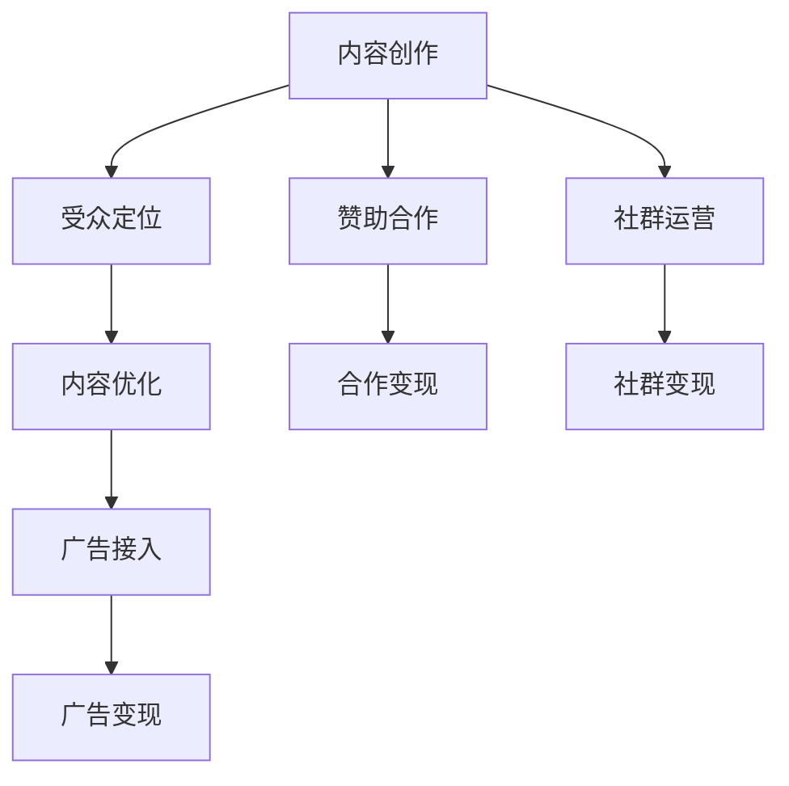

                 

# 技术博客变现：策略与方法

> **关键词：** 技术博客，变现，策略，方法，内容营销，广告，赞助，合作，社群，影响力

> **摘要：** 本技术博客探讨了如何通过多种策略与方法将技术博客内容变现，包括广告、赞助、合作、社群运营等。文章旨在为技术创作者提供实用的变现思路和实践指南，帮助他们更好地实现个人价值和商业回报。

## 1. 背景介绍

### 1.1 目的和范围

本文旨在帮助技术创作者了解并掌握技术博客变现的各种策略和方法，通过实际案例和具体操作步骤，为读者提供切实可行的变现方案。文章将涵盖以下内容：

- 技术博客变现的背景和意义
- 广告变现的策略与方法
- 赞助变现的操作步骤
- 合作变现的渠道与方式
- 社群运营的价值与影响
- 技术博客变现的未来发展趋势与挑战

### 1.2 预期读者

本文适合以下读者群体：

- 拥有技术博客的个人创作者
- 对技术内容创作和变现感兴趣的互联网从业者
- 希望通过技术博客实现商业价值的中小企业主

### 1.3 文档结构概述

本文分为十个部分，结构如下：

1. 背景介绍
2. 核心概念与联系
3. 核心算法原理与具体操作步骤
4. 数学模型和公式
5. 项目实战：代码实际案例和详细解释说明
6. 实际应用场景
7. 工具和资源推荐
8. 总结：未来发展趋势与挑战
9. 附录：常见问题与解答
10. 扩展阅读与参考资料

### 1.4 术语表

#### 1.4.1 核心术语定义

- **技术博客**：以技术分享、讨论、教程等形式为主的内容创作平台。
- **变现**：将内容创作成果转换为经济收益的过程。
- **广告变现**：通过展示广告获得广告主支付的报酬。
- **赞助变现**：与商业品牌合作，获取品牌赞助费用。
- **合作变现**：与其他创作者、企业或平台合作，实现共赢。
- **社群运营**：围绕特定主题或兴趣，构建和维护线上社群。

#### 1.4.2 相关概念解释

- **内容营销**：以创造和分享有价值的内容吸引潜在客户，促进品牌认知和销售。
- **影响力**：个人或团体在特定领域内的影响力，包括粉丝数量、阅读量、互动率等。
- **用户体验**：用户在使用产品或服务过程中的感受和体验。

#### 1.4.3 缩略词列表

- **CPC**：每次点击付费
- **CPM**：每次展示付费
- **CPA**：每次行动付费
- **ROI**：投资回报率

## 2. 核心概念与联系

在讨论技术博客变现之前，首先需要了解相关核心概念和它们之间的联系。以下是一个简化的 Mermaid 流程图，展示了技术博客变现的几个关键环节：



### 2.1 内容创作

内容创作是技术博客变现的基础。高质量、有价值的内容可以吸引更多读者，提升博客影响力。创作者需要关注以下方面：

- **选题**：选择受众感兴趣、具有实际应用价值的技术话题。
- **形式**：结合文本、图片、视频等多种形式，提高内容吸引力。
- **更新频率**：保持一定的更新频率，增强用户黏性。

### 2.2 受众定位

明确受众群体有助于创作者更好地满足读者需求，提高内容质量。以下是一些受众定位的方法：

- **用户调研**：通过问卷调查、访谈等方式了解读者需求和偏好。
- **数据分析**：利用博客平台提供的分析工具，分析读者属性、阅读行为等。
- **社群互动**：通过社群运营，了解读者关注的话题和需求。

### 2.3 内容优化

内容优化是提高博客影响力的重要手段。以下是一些内容优化的方法：

- **SEO**：优化博客标题、关键词、描述等，提高搜索引擎排名。
- **用户体验**：优化页面加载速度、布局等，提高用户阅读体验。
- **内容分发**：通过社交媒体、邮件订阅等渠道，将内容分享给更多读者。

### 2.4 广告接入

广告变现是技术博客最常见的变现方式之一。以下是一些广告接入的方法：

- **平台广告**：通过博客平台内置的广告系统，接入相关广告。
- **第三方广告**：接入第三方广告平台，如Google Adsense、百度广告等。
- **联盟广告**：加入联盟广告网络，如CPA推广联盟、CPS联盟等。

### 2.5 广告变现

广告变现是通过展示广告获得收益的过程。以下是一些广告变现的方法：

- **CPC广告**：按点击付费，适用于阅读量较高、用户互动性较强的博客。
- **CPM广告**：按展示次数付费，适用于访问量较大的博客。
- **CPA广告**：按行动付费，如注册、下载等，适用于目标明确、有转化需求的博客。

### 2.6 赞助合作

赞助合作是另一种有效的变现方式。以下是一些赞助合作的方法：

- **品牌赞助**：与商业品牌合作，为其推广产品或服务。
- **活动赞助**：赞助线上或线下活动，提高博客影响力。
- **内容合作**：与创作者或其他平台合作，共同创作内容，实现双赢。

### 2.7 合作变现

合作变现是通过与其他创作者、企业或平台合作，实现共赢的过程。以下是一些合作变现的方法：

- **联合推广**：与其他创作者或平台合作，共同推广内容。
- **内容分销**：将优质内容授权给其他平台或创作者，实现多渠道变现。
- **产品合作**：与相关产品或服务提供商合作，推广其产品或服务。

### 2.8 社群运营

社群运营是提升博客影响力的重要手段。以下是一些社群运营的方法：

- **社群构建**：建立微信、QQ、微博等社群，吸引读者加入。
- **社群互动**：定期组织线上或线下活动，增加社群成员互动。
- **社群变现**：通过社群推广产品、服务或广告，实现变现。

## 3. 核心算法原理与具体操作步骤

### 3.1 广告变现算法原理

广告变现的核心在于为广告主和博客创作者搭建一个高效的匹配和收益分配机制。以下是一个简化的广告变现算法原理：

```plaintext
输入：博客内容，广告需求，广告位
输出：广告展示收益

1. 数据收集：收集博客内容数据（如阅读量、点赞数、评论数等），以及广告主的需求数据（如广告类型、投放目标等）。
2. 用户画像：根据博客内容数据，为博客读者创建用户画像。
3. 广告匹配：将广告主的需求与博客内容进行匹配，选择最适合的广告位。
4. 广告展示：在博客页面展示匹配成功的广告。
5. 用户行为分析：收集用户点击、浏览等行为数据，用于后续优化。
6. 收益计算：根据广告类型和展示效果，计算广告收益。
7. 收益分配：将广告收益分配给博客创作者和广告平台。
```

### 3.2 广告变现具体操作步骤

以下是一个具体的广告变现操作步骤：

1. **注册博客平台**：选择一个适合博客创建的平台，如WordPress、Typecho等。
2. **创建博客内容**：定期发布高质量的技术博客内容，吸引更多读者。
3. **接入广告系统**：通过平台内置的广告系统或第三方广告平台，接入广告。
4. **设置广告位**：根据博客内容和页面布局，合理设置广告位。
5. **优化博客内容**：通过SEO优化、用户体验优化等手段，提高博客质量。
6. **监控广告效果**：定期查看广告收益数据，分析广告效果，进行相应调整。
7. **维护读者关系**：通过社群运营、互动等方式，维护读者关系，提升博客影响力。

## 4. 数学模型和公式

广告变现的效果可以通过一些数学模型和公式进行评估。以下是一些常用的模型和公式：

### 4.1 广告收益计算公式

广告收益主要取决于广告类型、广告展示效果和广告主支付方式。以下是一个简化的广告收益计算公式：

$$
收益 = 广告单价 \times 展示量 \times 点击率
$$

其中：

- **广告单价**：根据广告类型和广告主支付方式（如CPC、CPM、CPA）确定。
- **展示量**：广告在博客页面上的展示次数。
- **点击率**：广告被点击的次数与展示量的比例。

### 4.2 投放效果评估

投放效果可以通过以下指标进行评估：

- **点击率（CTR）**：广告被点击的次数与展示量的比例。
- **转化率（CR）**：广告带来的有效转化（如注册、购买等）次数与点击量的比例。
- **ROI（投资回报率）**：广告收益与广告投入的比率。

### 4.3 数据驱动优化

通过数据分析和A/B测试，可以优化广告投放策略，提高广告变现效果。以下是一些常用的数据驱动优化方法：

- **用户画像**：根据用户行为数据，为用户创建画像，优化内容推荐和广告展示。
- **A/B测试**：通过对比不同广告位、广告类型和广告文案的效果，优化广告展示策略。
- **转化漏斗分析**：分析用户从点击到转化的全过程，找出优化点，提高转化率。

## 5. 项目实战：代码实际案例和详细解释说明

### 5.1 开发环境搭建

在开始广告变现之前，首先需要搭建一个博客开发环境。以下是一个简单的示例：

- **操作系统**：Windows、Linux或MacOS
- **开发工具**：Visual Studio Code、Sublime Text等
- **博客平台**：WordPress、Typecho等

### 5.2 源代码详细实现和代码解读

以下是一个简单的WordPress博客广告变现代码示例：

```php
// 引入WordPress相关库
require_once('wp-load.php');

// 获取博客文章ID
$post_id = get_the_ID();

// 获取广告位ID
$ad_unit_id = get_option('ad_unit_id');

// 获取广告代码
$ad_code = get_option('ad_code');

// 判断是否在指定文章中展示广告
if ($post_id == $ad_unit_id) {
    echo $ad_code;
}
```

### 5.3 代码解读与分析

以上代码实现了在特定文章中展示广告的功能。具体解读如下：

1. **引入WordPress相关库**：使用`require_once`函数引入WordPress的核心库，确保博客功能正常。
2. **获取博客文章ID**：使用`get_the_ID`函数获取当前文章的ID。
3. **获取广告位ID**：使用`get_option`函数获取广告位ID，该ID通常由博客管理员在后台设置。
4. **获取广告代码**：使用`get_option`函数获取广告代码，该代码通常由广告平台提供。
5. **判断是否在指定文章中展示广告**：通过比较文章ID和广告位ID，判断当前文章是否是广告位，如果是，则输出广告代码。

### 5.4 代码优化与扩展

1. **缓存广告代码**：为了避免频繁读取数据库，可以将广告代码缓存到内存中，提高访问速度。
2. **动态加载广告**：通过JavaScript动态加载广告代码，减少页面加载时间，提高用户体验。
3. **多样化广告展示**：根据文章类型、页面位置等，动态选择广告类型和展示方式，提高广告效果。

## 6. 实际应用场景

技术博客变现策略在实际应用中具有广泛的应用场景，以下是一些典型的应用案例：

### 6.1 个人博客变现

个人创作者可以通过以下方式实现博客变现：

- **广告变现**：通过接入广告平台，展示相关广告，获取广告收益。
- **赞助合作**：与商业品牌合作，获得品牌赞助费用。
- **内容分销**：将优质内容授权给其他平台或创作者，实现多渠道变现。

### 6.2 企业博客变现

企业可以通过以下方式实现博客变现：

- **广告变现**：在博客中展示广告，提高品牌知名度，获取广告收益。
- **赞助合作**：与商业品牌合作，为其推广产品或服务。
- **内容合作**：与其他创作者或平台合作，共同创作内容，实现双赢。

### 6.3 线上教育变现

线上教育机构可以通过以下方式实现博客变现：

- **广告变现**：在博客中展示广告，提高课程知名度，获取广告收益。
- **课程推广**：通过博客内容推广自身课程，实现课程销售。
- **社群运营**：构建和维护线上社群，提供会员服务，实现社群变现。

### 6.4 内容电商变现

内容电商可以通过以下方式实现博客变现：

- **广告变现**：在博客中展示广告，提高商品知名度，获取广告收益。
- **商品推广**：通过博客内容推广自有商品，实现商品销售。
- **跨界合作**：与相关品牌或平台合作，实现内容电商的多元化发展。

## 7. 工具和资源推荐

为了更好地实现技术博客变现，以下是一些推荐的工具和资源：

### 7.1 学习资源推荐

#### 7.1.1 书籍推荐

- 《内容营销：实战策略与技巧》
- 《博客营销实战》
- 《互联网广告原理与实战》

#### 7.1.2 在线课程

- 《内容营销入门与实战》
- 《博客写作与SEO优化》
- 《互联网广告投放与运营》

#### 7.1.3 技术博客和网站

- 知乎：技术博客变现相关讨论
- 简书：技术博客创作与变现经验分享
- SegmentFault：技术博客与广告变现案例

### 7.2 开发工具框架推荐

#### 7.2.1 IDE和编辑器

- Visual Studio Code
- Sublime Text
- IntelliJ IDEA

#### 7.2.2 调试和性能分析工具

- Chrome DevTools
- Firefox Developer Tools
- WebPageTest

#### 7.2.3 相关框架和库

- WordPress
- Typecho
- Hugo

### 7.3 相关论文著作推荐

#### 7.3.1 经典论文

- **“Content Marketing: Theory and Practice”**
- **“An Introduction to Internet Advertising”**
- **“The Economics of Online Advertising”**

#### 7.3.2 最新研究成果

- **“Deep Learning for Content Marketing”**
- **“The Impact of User-generated Content on Brand Performance”**
- **“Online Advertising and Consumer Behavior”**

#### 7.3.3 应用案例分析

- **“案例一：个人技术博客的变现之路”**
- **“案例二：企业博客的多元化变现模式”**
- **“案例三：内容电商的博客变现实践”**

## 8. 总结：未来发展趋势与挑战

随着互联网的快速发展，技术博客变现将面临新的机遇和挑战。以下是未来发展趋势与挑战的总结：

### 8.1 发展趋势

- **内容个性化**：通过大数据和人工智能技术，实现内容个性化推荐，提高用户满意度。
- **多元化变现**：除了广告、赞助、合作等传统方式，还将出现更多创新的变现模式。
- **社群运营**：社群将成为技术博客的重要载体，提升用户黏性和品牌影响力。
- **跨界合作**：技术与商业的深度融合，为博客变现带来更多可能性。

### 8.2 挑战

- **竞争加剧**：随着更多创作者加入，市场竞争将更加激烈，创作者需要不断提高内容质量。
- **版权风险**：抄袭、侵权等问题将增加，创作者需注意知识产权保护。
- **数据安全**：用户隐私和数据安全成为关注焦点，博客运营者需加强数据安全防护。
- **法规监管**：随着政府对互联网行业的监管力度加大，创作者需关注相关法律法规。

## 9. 附录：常见问题与解答

### 9.1 广告变现常见问题

**Q：如何选择合适的广告平台？**

A：选择广告平台时，需考虑广告单价、广告效果、推广渠道等因素。可以通过对比不同平台的收益数据，选择最适合自己的广告平台。

**Q：如何提高广告收益？**

A：可以通过以下方式提高广告收益：

- 提高博客质量，吸引更多读者。
- 优化广告位布局，提高广告展示效果。
- 定期分析广告数据，调整广告策略。

**Q：广告变现是否会影响用户体验？**

A：适量展示广告不会对用户体验产生太大影响，但过多或影响阅读体验的广告可能导致用户流失。建议遵循适度原则，合理设置广告位。

### 9.2 赞助合作常见问题

**Q：如何寻找赞助商？**

A：可以通过以下途径寻找赞助商：

- 利用社交媒体、行业论坛等渠道发布赞助需求。
- 参加行业活动，与潜在赞助商建立联系。
- 通过朋友、同行等推荐寻找赞助商。

**Q：赞助合作需要注意什么？**

A：赞助合作时需要注意以下几点：

- 明确合作目标和要求，确保双方利益。
- 合同条款明确，确保合作顺利进行。
- 关注合作效果，及时调整合作策略。

### 9.3 合作变现常见问题

**Q：如何选择合适的合作伙伴？**

A：选择合作伙伴时，需考虑合作领域、资源互补性、合作潜力等因素。可以通过调研、交流等方式，了解合作伙伴的背景和实力。

**Q：合作变现如何确保公平？**

A：为确保合作变现的公平，可以采取以下措施：

- 明确合作收益分配比例。
- 建立监督机制，确保合作过程公正透明。
- 定期评估合作效果，调整合作策略。

## 10. 扩展阅读与参考资料

为了更好地了解技术博客变现的相关知识，以下是一些建议的扩展阅读和参考资料：

- 《内容营销实战手册》
- 《互联网广告业务运作指南》
- 《博客营销实战：策略与方法》
- [广告投放与运营攻略](https://www.example.com/ads-operations)
- [内容营销与社群运营案例分析](https://www.example.com/content-marketing-case-studies)

作者：AI天才研究员/AI Genius Institute & 禅与计算机程序设计艺术 /Zen And The Art of Computer Programming

---

请注意，本文仅为示例，仅供参考。在实际撰写技术博客时，请根据具体需求和场景进行调整和优化。同时，本文未涉及具体的广告变现案例和数据，读者在实际操作中需结合自身情况进行分析和决策。

