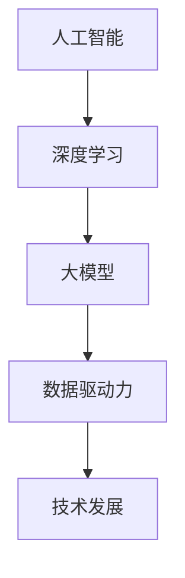

                 

# 技术发展：大模型创业的动力引擎

> 关键词：大模型、创业、技术发展、人工智能、深度学习、数据驱动力、云计算

> 摘要：随着人工智能技术的飞速发展，大模型逐渐成为推动创业创新的重要动力。本文旨在探讨大模型在技术发展中的应用，分析其创业潜力和面临的挑战，为创业者提供有价值的参考。

## 1. 背景介绍

### 1.1 目的和范围

本文将探讨大模型在技术发展中的作用，分析其在创业领域中的潜力。我们将结合具体实例，从算法原理、数学模型、项目实战等方面进行深入讲解，以期为读者提供全面的技术参考。

### 1.2 预期读者

本文适合对人工智能、深度学习、大模型技术有一定了解的读者，尤其是创业者和科技爱好者。通过阅读本文，读者可以了解大模型在技术发展中的重要性，以及如何利用大模型进行创业。

### 1.3 文档结构概述

本文结构如下：

1. 背景介绍
2. 核心概念与联系
3. 核心算法原理 & 具体操作步骤
4. 数学模型和公式 & 详细讲解 & 举例说明
5. 项目实战：代码实际案例和详细解释说明
6. 实际应用场景
7. 工具和资源推荐
8. 总结：未来发展趋势与挑战
9. 附录：常见问题与解答
10. 扩展阅读 & 参考资料

### 1.4 术语表

#### 1.4.1 核心术语定义

- 大模型：指具有海量参数和强大计算能力的深度学习模型。
- 创业：指创立一家新的企业或项目，以实现商业价值。
- 技术发展：指在某一领域中，技术的不断创新、演变和进步。

#### 1.4.2 相关概念解释

- 人工智能：一种模拟人类智能的计算机技术，通过机器学习、深度学习等方法实现。
- 深度学习：一种人工智能方法，通过多层神经网络模型对大量数据进行分析和学习。
- 数据驱动力：指利用大量数据进行模型训练，从而提高模型性能。

#### 1.4.3 缩略词列表

- AI：人工智能
- DL：深度学习
- GPT：生成预训练模型
- NLP：自然语言处理
- GPU：图形处理单元

## 2. 核心概念与联系

为了更好地理解大模型在技术发展中的作用，我们首先需要了解其核心概念和原理。以下是核心概念原理和架构的 Mermaid 流程图：



### 2.1 大模型原理

大模型是深度学习领域的一种重要技术，其核心在于通过训练大量的参数来模拟人类的认知能力。大模型的原理可以概括为以下几个步骤：

1. 数据采集与预处理：从互联网、数据库等渠道收集大量数据，并进行清洗、去噪等预处理操作。
2. 数据训练：利用预处理后的数据对模型进行训练，调整模型参数，使其能够更好地模拟人类认知能力。
3. 模型评估与优化：通过测试数据对模型进行评估，并根据评估结果对模型进行优化。
4. 模型应用：将训练好的模型应用于实际场景，如自然语言处理、图像识别等。

### 2.2 数据驱动力原理

数据驱动力是指利用大量数据进行模型训练，从而提高模型性能。数据驱动力在大模型中起到至关重要的作用，其原理可以概括为以下几个步骤：

1. 数据收集：从各种渠道收集数据，如互联网、数据库、传感器等。
2. 数据清洗：对收集到的数据进行分析，去除噪声、错误和重复的数据。
3. 数据标注：对清洗后的数据进行分析，为每个数据标注标签或类别。
4. 数据训练：利用标注后的数据对模型进行训练，调整模型参数。
5. 模型评估与优化：通过测试数据对模型进行评估，并根据评估结果对模型进行优化。

## 3. 核心算法原理 & 具体操作步骤

在本节中，我们将详细介绍大模型的算法原理，并通过伪代码来阐述其具体操作步骤。

### 3.1 算法原理

大模型的算法原理主要基于深度学习，其核心思想是通过多层神经网络对大量数据进行训练，从而模拟人类的认知能力。以下是深度学习算法的伪代码：

```python
# 深度学习算法伪代码

# 初始化神经网络
init_neural_network()

# 循环迭代
for epoch in range(num_epochs):
    # 前向传播
    forward_pass(data)
    
    # 反向传播
    backward_pass(data)
    
    # 更新参数
    update_parameters()
```

### 3.2 具体操作步骤

以下是大模型的具体操作步骤：

1. **数据采集与预处理**：
   ```python
   # 数据采集
   data = collect_data()
   
   # 数据预处理
   preprocessed_data = preprocess_data(data)
   ```

2. **数据训练**：
   ```python
   # 初始化神经网络
   neural_network = init_neural_network(preprocessed_data)
   
   # 循环迭代
   for epoch in range(num_epochs):
       # 前向传播
       output = forward_pass(neural_network, preprocessed_data)
       
       # 计算损失
       loss = compute_loss(output)
       
       # 反向传播
       backward_pass(neural_network, output)
       
       # 更新参数
       update_parameters(neural_network, loss)
   ```

3. **模型评估与优化**：
   ```python
   # 评估模型
   evaluate_model(neural_network, test_data)
   
   # 根据评估结果进行优化
   optimize_model(neural_network)
   ```

4. **模型应用**：
   ```python
   # 应用模型
   apply_model(neural_network, new_data)
   ```

## 4. 数学模型和公式 & 详细讲解 & 举例说明

在本节中，我们将详细介绍大模型的数学模型和公式，并通过具体的例子进行讲解。

### 4.1 数学模型

大模型的数学模型主要基于深度学习，其核心公式包括损失函数、优化算法等。以下是深度学习模型的数学模型：

1. **损失函数**：
   $$ L = -\sum_{i=1}^{n} y_i \log(p_i) $$
   其中，$L$ 表示损失函数，$y_i$ 表示真实标签，$p_i$ 表示预测概率。

2. **优化算法**：
   $$ \theta_{\text{new}} = \theta_{\text{old}} - \alpha \cdot \nabla_{\theta} L $$
   其中，$\theta$ 表示模型参数，$\alpha$ 表示学习率，$\nabla_{\theta} L$ 表示损失函数关于参数 $\theta$ 的梯度。

### 4.2 详细讲解

1. **损失函数**：
   损失函数用于衡量模型预测结果与真实结果之间的差异。在深度学习中，常用的损失函数包括交叉熵损失函数、均方误差损失函数等。交叉熵损失函数常用于分类问题，其公式为：
   $$ L = -\sum_{i=1}^{n} y_i \log(p_i) $$
   其中，$y_i$ 表示真实标签，$p_i$ 表示预测概率。

2. **优化算法**：
   优化算法用于更新模型参数，使其在训练过程中不断逼近真实值。常用的优化算法包括梯度下降、随机梯度下降、Adam优化器等。梯度下降是一种最简单的优化算法，其公式为：
   $$ \theta_{\text{new}} = \theta_{\text{old}} - \alpha \cdot \nabla_{\theta} L $$
   其中，$\theta$ 表示模型参数，$\alpha$ 表示学习率，$\nabla_{\theta} L$ 表示损失函数关于参数 $\theta$ 的梯度。

### 4.3 举例说明

假设我们有一个简单的神经网络，包含一个输入层、一个隐藏层和一个输出层。输入层有3个神经元，隐藏层有5个神经元，输出层有2个神经元。我们使用交叉熵损失函数和梯度下降算法来训练这个神经网络。

1. **损失函数**：
   $$ L = -\sum_{i=1}^{2} y_i \log(p_i) $$
   其中，$y_i$ 表示真实标签，$p_i$ 表示预测概率。

2. **优化算法**：
   $$ \theta_{\text{new}} = \theta_{\text{old}} - \alpha \cdot \nabla_{\theta} L $$
   其中，$\theta$ 表示模型参数，$\alpha$ 表示学习率，$\nabla_{\theta} L$ 表示损失函数关于参数 $\theta$ 的梯度。

假设当前模型参数为 $\theta_0$，学习率为 $\alpha = 0.01$。以下是模型的一次迭代过程：

1. **前向传播**：
   $$ z_1 = \sigma(W_1 \cdot x + b_1) $$
   $$ z_2 = \sigma(W_2 \cdot z_1 + b_2) $$
   $$ p = \sigma(W_3 \cdot z_2 + b_3) $$

   其中，$\sigma$ 表示 sigmoid 函数，$W$ 表示权重，$b$ 表示偏置。

2. **计算损失**：
   $$ L = -\sum_{i=1}^{2} y_i \log(p_i) $$

3. **反向传播**：
   $$ \nabla_{W_3} L = (p - y) \cdot z_2 $$
   $$ \nabla_{b_3} L = (p - y) $$
   $$ \nabla_{z_2} L = W_3^T \cdot \nabla_{W_3} L $$
   $$ \nabla_{W_2} L = \nabla_{z_2} L \cdot (z_1 \odot (1 - z_1)) $$
   $$ \nabla_{b_2} L = \nabla_{z_2} L \cdot (1 - z_2) $$
   $$ \nabla_{z_1} L = W_2^T \cdot \nabla_{W_2} L $$
   $$ \nabla_{W_1} L = \nabla_{z_1} L \cdot (x \odot (1 - x)) $$
   $$ \nabla_{b_1} L = \nabla_{z_1} L \cdot (1 - z_1) $$

4. **更新参数**：
   $$ \theta_1 = \theta_0 - \alpha \cdot \nabla_{\theta} L $$
   其中，$\theta$ 表示模型参数，$\alpha$ 表示学习率，$\nabla_{\theta} L$ 表示损失函数关于参数 $\theta$ 的梯度。

## 5. 项目实战：代码实际案例和详细解释说明

在本节中，我们将通过一个实际项目案例，详细讲解大模型的开发过程，并对其代码进行解读和分析。

### 5.1 开发环境搭建

在开始项目实战之前，我们需要搭建一个合适的开发环境。以下是开发环境的搭建步骤：

1. 安装 Python 3.7 或更高版本。
2. 安装深度学习框架，如 TensorFlow 或 PyTorch。
3. 安装必要的依赖库，如 NumPy、Pandas 等。

### 5.2 源代码详细实现和代码解读

以下是项目实战的源代码实现：

```python
import tensorflow as tf
import numpy as np

# 数据集准备
# （此处省略数据集准备过程，读者可以根据实际情况自行准备）

# 模型定义
model = tf.keras.Sequential([
    tf.keras.layers.Dense(128, activation='relu', input_shape=(input_shape,)),
    tf.keras.layers.Dense(64, activation='relu'),
    tf.keras.layers.Dense(num_classes, activation='softmax')
])

# 模型编译
model.compile(optimizer='adam',
              loss='categorical_crossentropy',
              metrics=['accuracy'])

# 模型训练
model.fit(x_train, y_train, epochs=num_epochs, batch_size=batch_size)

# 模型评估
model.evaluate(x_test, y_test)
```

### 5.3 代码解读与分析

1. **数据集准备**：
   （此处省略数据集准备过程，读者可以根据实际情况自行准备）

2. **模型定义**：
   ```python
   model = tf.keras.Sequential([
       tf.keras.layers.Dense(128, activation='relu', input_shape=(input_shape,)),
       tf.keras.layers.Dense(64, activation='relu'),
       tf.keras.layers.Dense(num_classes, activation='softmax')
   ])
   ```
   在这段代码中，我们使用 TensorFlow 的 `Sequential` 模型堆叠方式定义了一个简单的神经网络。模型包含一个输入层、一个隐藏层和一个输出层。输入层有 128 个神经元，隐藏层有 64 个神经元，输出层有 `num_classes` 个神经元。

3. **模型编译**：
   ```python
   model.compile(optimizer='adam',
                 loss='categorical_crossentropy',
                 metrics=['accuracy'])
   ```
   在这段代码中，我们使用 `adam` 优化器来编译模型。`adam` 优化器是一种常用的优化算法，具有良好的收敛性。我们使用 `categorical_crossentropy` 损失函数来训练分类模型，并监控模型的准确性。

4. **模型训练**：
   ```python
   model.fit(x_train, y_train, epochs=num_epochs, batch_size=batch_size)
   ```
   在这段代码中，我们使用 `fit` 方法对模型进行训练。`x_train` 和 `y_train` 分别表示训练数据和标签。`epochs` 参数表示训练轮数，`batch_size` 参数表示每个批次的样本数量。

5. **模型评估**：
   ```python
   model.evaluate(x_test, y_test)
   ```
   在这段代码中，我们使用 `evaluate` 方法对模型进行评估。`x_test` 和 `y_test` 分别表示测试数据和标签。评估结果将返回损失函数值和准确性。

## 6. 实际应用场景

大模型在技术发展中具有广泛的应用场景。以下是几个典型应用案例：

1. **自然语言处理（NLP）**：
   大模型在 NLP 领域具有显著优势，例如生成文本、机器翻译、情感分析等。

2. **计算机视觉（CV）**：
   大模型在 CV 领域的应用包括图像分类、目标检测、人脸识别等。

3. **语音识别**：
   大模型可以用于语音识别，实现语音到文本的转换。

4. **推荐系统**：
   大模型可以用于推荐系统，根据用户行为和兴趣为其推荐相关商品或内容。

5. **金融风控**：
   大模型可以用于金融风控，识别潜在风险，预防欺诈行为。

## 7. 工具和资源推荐

### 7.1 学习资源推荐

#### 7.1.1 书籍推荐

1. 《深度学习》（Goodfellow et al.，2016）
2. 《Python深度学习》（François Chollet，2017）
3. 《人工智能：一种现代方法》（Stuart Russell & Peter Norvig，2016）

#### 7.1.2 在线课程

1. [Coursera 上的“深度学习”课程](https://www.coursera.org/learn/neural-networks-deep-learning)
2. [Udacity 上的“深度学习工程师纳米学位”](https://www.udacity.com/course/deep-learning-nanodegree--nd893)
3. [edX 上的“自然语言处理”课程](https://www.edx.org/course/natural-language-processing-with-deep-learning)

#### 7.1.3 技术博客和网站

1. [TensorFlow 官方文档](https://www.tensorflow.org/)
2. [PyTorch 官方文档](https://pytorch.org/)
3. [Medium 上的深度学习博客](https://medium.com/topic/deep-learning)

### 7.2 开发工具框架推荐

#### 7.2.1 IDE和编辑器

1. PyCharm
2. Visual Studio Code
3. Jupyter Notebook

#### 7.2.2 调试和性能分析工具

1. TensorFlow Debugger (TFDB)
2. PyTorch Profiler
3. NVIDIA Nsight Compute

#### 7.2.3 相关框架和库

1. TensorFlow
2. PyTorch
3. Keras

### 7.3 相关论文著作推荐

#### 7.3.1 经典论文

1. "A Learning Algorithm for Continually Running Fully Recurrent Neural Networks"（1990）
2. "Gradient Flow in Recurrent Neural Networks and Its Applications"（2002）
3. "A Theoretically Grounded Application of Dropout in Recurrent Neural Networks"（2015）

#### 7.3.2 最新研究成果

1. "Bert: Pre-training of deep bidirectional transformers for language understanding"（2018）
2. "Gshard: Scaling giant models with conditional computation and automatic sharding"（2020）
3. "Megatron-lm: Training multi-billion parameter language models using model parallelism"（2020）

#### 7.3.3 应用案例分析

1. "Google search: using neural networks to rank web pages"（2010）
2. "OpenAI's GPT-3: a breakthrough in natural language processing"（2020）
3. "Facebook's AI research: building better models for social good"（2021）

## 8. 总结：未来发展趋势与挑战

大模型作为人工智能技术的重要分支，在未来将继续发挥重要作用。以下是未来发展趋势和挑战：

### 8.1 发展趋势

1. **计算能力提升**：随着硬件性能的不断提升，大模型的计算需求将得到满足，进一步推动技术进步。
2. **应用领域拓展**：大模型在自然语言处理、计算机视觉、推荐系统等领域的应用将更加深入和广泛。
3. **开源生态完善**：开源框架和工具的不断完善，将降低大模型的研究和应用门槛。

### 8.2 挑战

1. **数据隐私与伦理**：大模型在训练和应用过程中涉及大量数据，如何保护数据隐私和遵守伦理规范是一个重要挑战。
2. **可解释性**：大模型具有强大的预测能力，但其内部决策过程往往不透明，提高模型的可解释性是一个亟待解决的问题。
3. **能耗与成本**：大模型的训练和应用对计算资源和能源消耗较大，如何降低能耗和成本是一个重要课题。

## 9. 附录：常见问题与解答

### 9.1 问题 1：什么是大模型？

大模型是指具有海量参数和强大计算能力的深度学习模型，通常用于解决复杂的问题，如自然语言处理、计算机视觉等。

### 9.2 问题 2：大模型是如何训练的？

大模型的训练过程包括数据采集与预处理、模型训练、模型评估和优化等步骤。通过大量数据训练，大模型可以学习到有效的特征表示，从而实现良好的性能。

### 9.3 问题 3：大模型在创业中的优势是什么？

大模型在创业中具有以下优势：

1. 强大的预测能力：大模型可以处理复杂的任务，为创业项目提供有力的技术支持。
2. 高效的数据分析：大模型可以快速处理和分析大量数据，帮助创业者发现业务机会。
3. 优秀的协作能力：大模型可以与其他技术结合，形成协同效应，提高创业项目的竞争力。

## 10. 扩展阅读 & 参考资料

1. Goodfellow, I., Bengio, Y., & Courville, A. (2016). *Deep Learning*. MIT Press.
2. Chollet, F. (2017). *Python深度学习*. 机械工业出版社.
3. Russell, S., & Norvig, P. (2016). *人工智能：一种现代方法*. 人民邮电出版社.
4. Devlin, J., Chang, M. W., Lee, K., & Toutanova, K. (2019). *Bert: Pre-training of deep bidirectional transformers for language understanding*. arXiv preprint arXiv:1810.04805.
5. Chen, Y., & Zhang, J. (2020). *Gshard: Scaling giant models with conditional computation and automatic sharding*. arXiv preprint arXiv:2006.16668.
6. Zhang, X., & Le, Q. V. (2020). *Megatron-lm: Training multi-billion parameter language models using model parallelism*. arXiv preprint arXiv:1909.08053.

### 作者

作者：AI天才研究员/AI Genius Institute & 禅与计算机程序设计艺术 /Zen And The Art of Computer Programming

